# 第3节. mysqldump实战和xtrabackup介绍


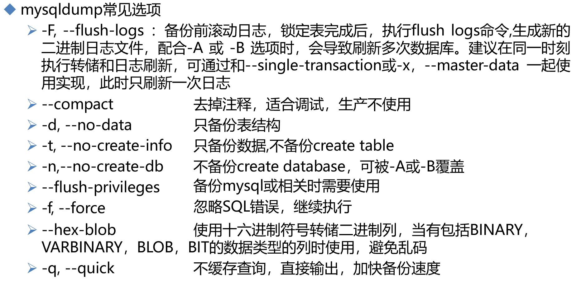

-F --flush-logs：存在滚动多次数据库-A -B涉及多个数据库，估计一个数据库就会滚动一次；所以需要配合--single-transaction来做一次事务滚动一次，就是相当于不用 人工flush logs刷新binlog了。--master-data肯定要的，mysqldump动作对应的binlog位置得记下来的。

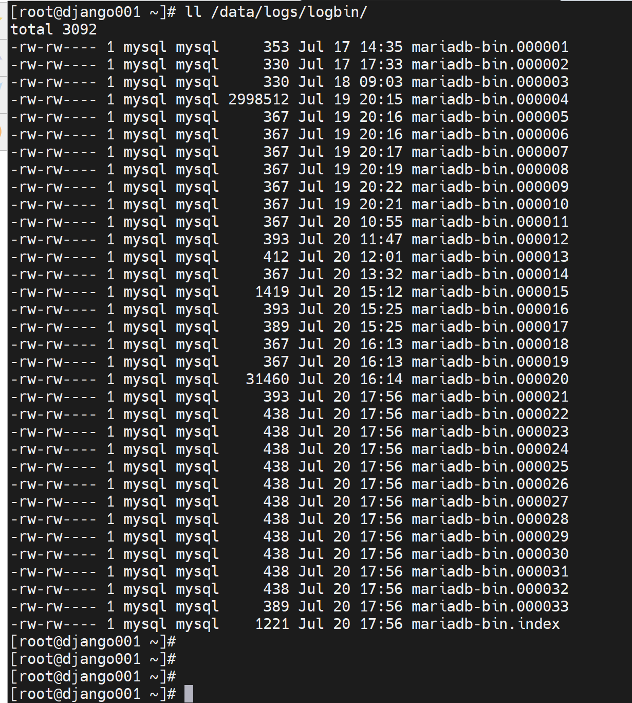


这个就直接STD 输出到屏幕上了哦，然后再看看binlog

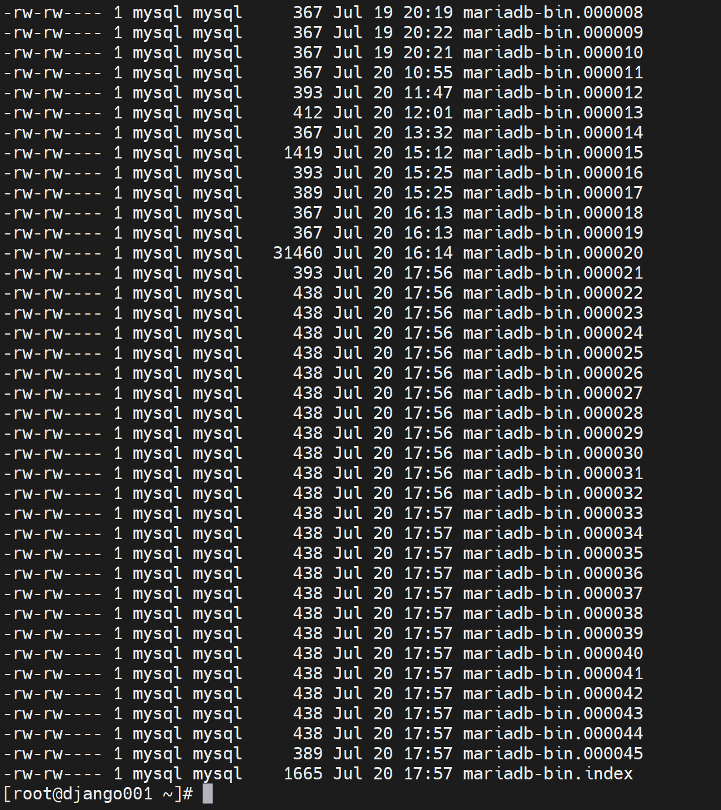

从34开始到45，多了12个。


只会刷出一个binlog

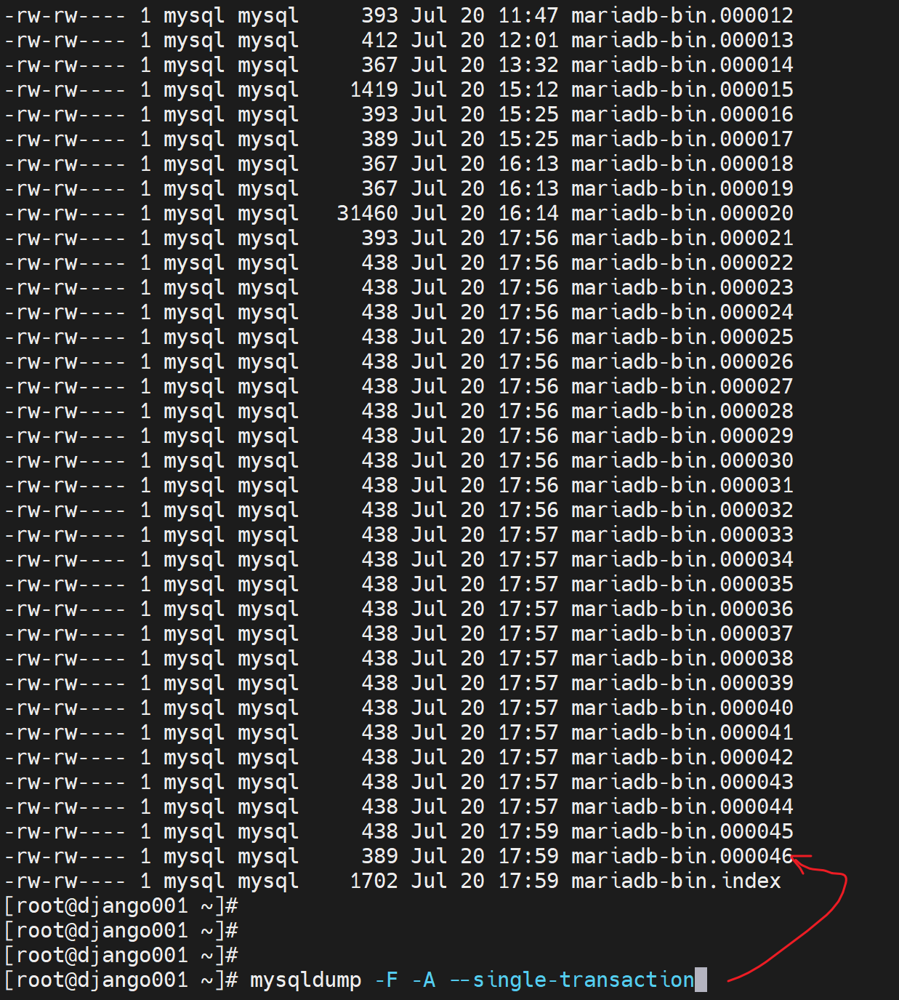

-F 滚动的好处也就是flush logs的好处，就是上图的000046号文件是新的日志，和老日志分开来放了，就是新老日志存放清晰，处理备份还原就有明确的000045--老日志，000046新日志，明确的文件分界线就出来了，无需去文件里扒位置去定界了。


看下这条优化备份CLI的实操效果

```shell
mysqldump -F -A --single-transaction --master-data=2 > /data/all_`date +%F`.sql
```

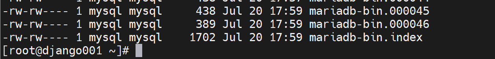

现在000046号文件389，

```
drop table coc;
show master logs;
```

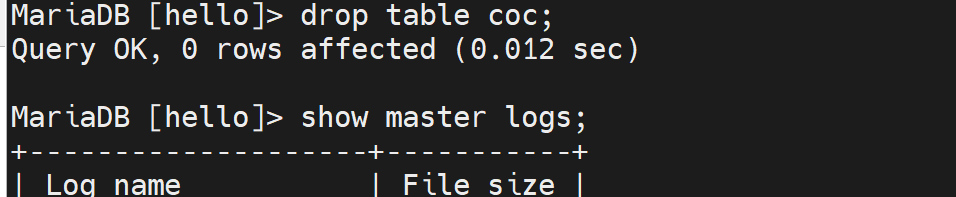 

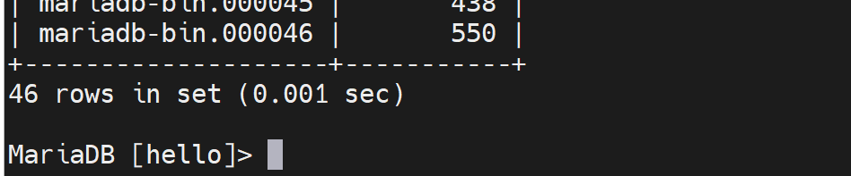 

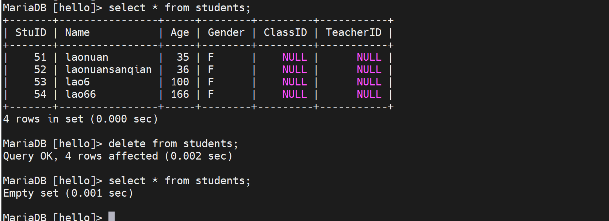

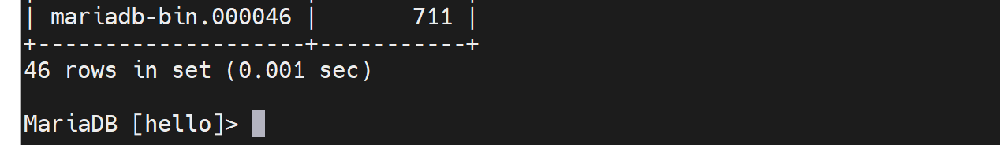

好，此时000046的size达到了711，从389。日志增长了很多。

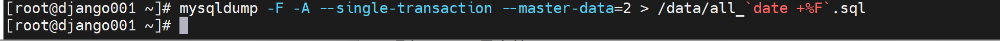

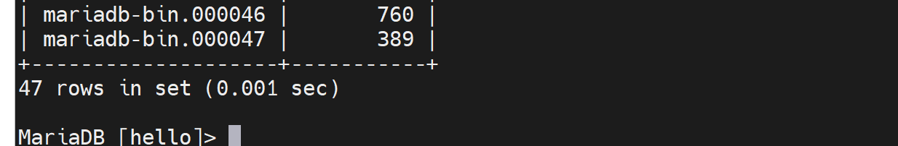

-F的效果就出来了，结合--single-transaction以及--master-data=2

就是新的binlog文件000047的389这个位置作为mysqldump的节点，去看看all_`date +%F`.sql文件里必然也写着000047 389这个位置点

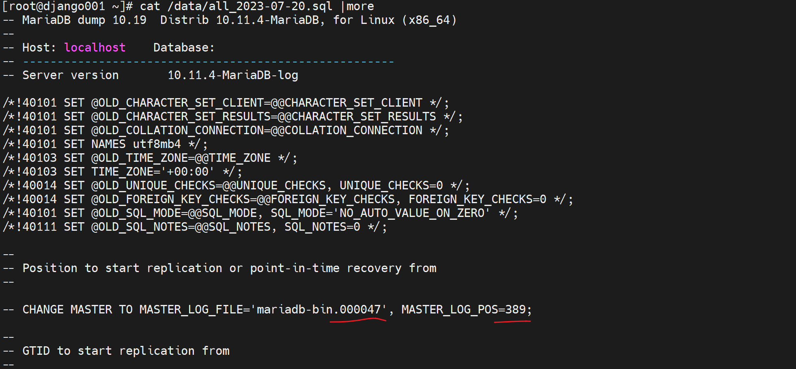

相当于flush了一个新日志文件，从这个文件以前的binlog就包含在了全备文件了，从这个节点开始以后就不包含在全备里。


全备已经包含的binlog就可以清一下了，哦，所以binlog清里是这么清的！

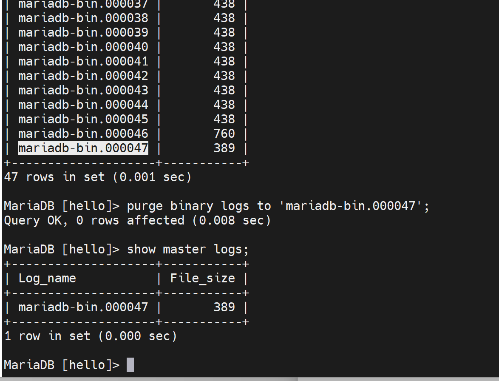

磁盘上自然也同步了

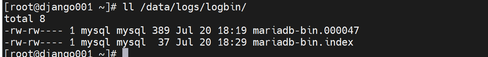

👇这个reset没必要吧，不然你还原的全备没问题，补差价的时候处理binlog就不能直接复制mysqldump --master-data 产生得binlog编号和位置了

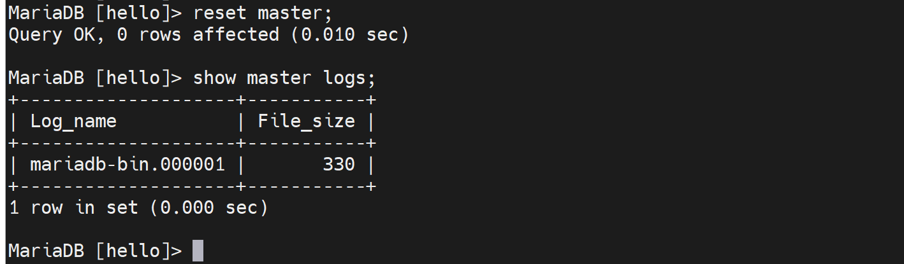

得改成新的binlog编号，和位置，不过-F是刷新得，位置不用写了直接编号就行了。

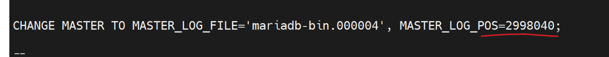

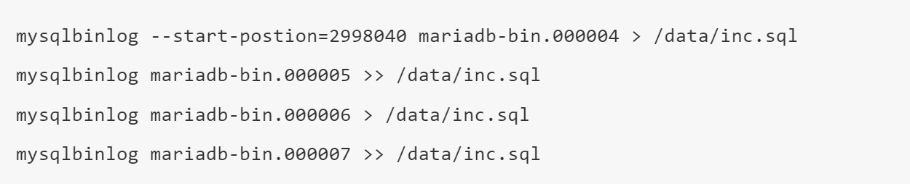


### 温备-MyISAM不支持事务，要加锁保证数据一致性。

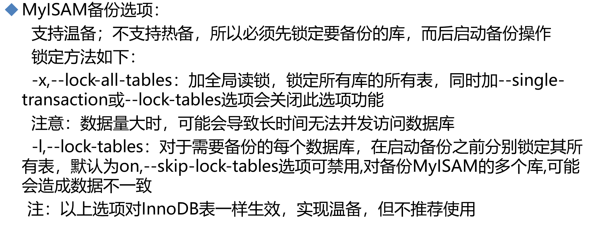

MyISAM备份要用-x，全部加上读锁，这样才能保证数据一致性。

-l  别用了，会导致数据不一致，因为一个库一个库的加锁，可能导致数据不一致。

所以InnoDB不要用这些选项，这些选项是MyISAM才需要的。


热备-InnoDB，开启事务

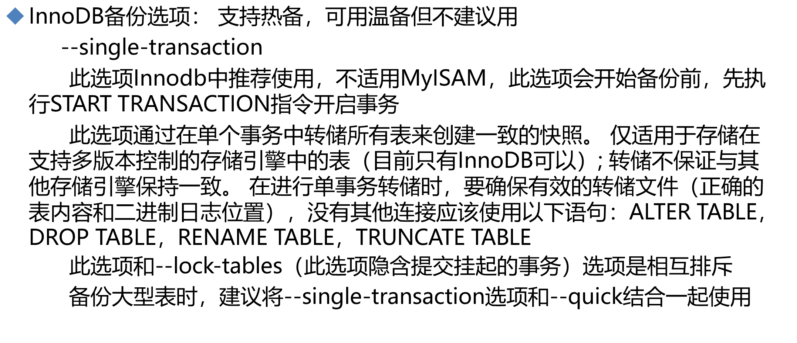

就是所有的mysqldump在也给事务里，而事务的默认隔离级别是"可重复读"，所以可以做到所有数据库的数据一致性。

​		但是事务可以隔离DML，不能隔离DDL。请看下图👇

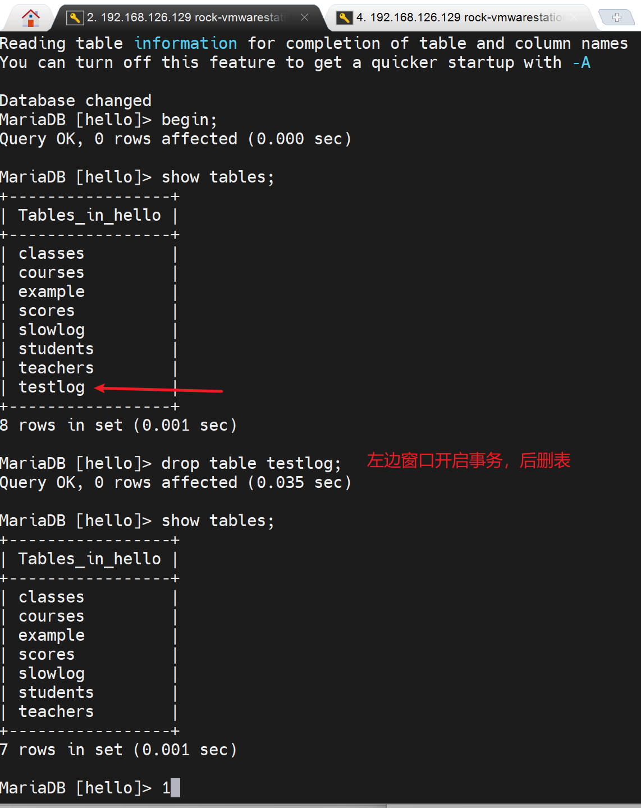

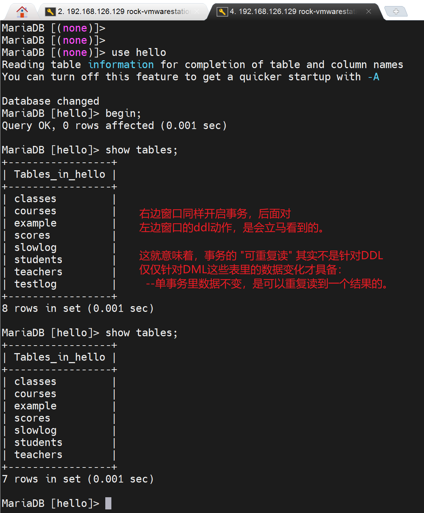


DDL语言：drop table,   rename table, truncate table；这些事务针对这些是不具备隔离性的。

注意truncate table和delete from的区别，前者是DDL，后缀是DML。这些事务具备对其的隔离性。


-q就是--quick看来还不错


## 处理方式

一般来讲MyISAM，-x

对于InnoDB，--single-transaction

但是对于数据库来讲，又有mysql这种系统库是MyISAM的，又有常规的其他所有库就都是InnoDB。

如果

mysqldump -x --single-transaction ，-x就失效了，上图里有提到的。


-A应该就包含了-E -R --triggers --default-character这些了，因为-A包含了mysql系统库。

但是-F和--hex-blob理论上是需要的，然后--deafult-character-set这个需要特定指定吗？不写会不会更好，写的就要看下是否和原本的数据库的默认字符集一致，要写成一致的字符集。

--master-data=1就是有主从复制了。

```
InnoDB建议备份策略
mysqldump –uroot –A –F –E –R --single-transaction --master-data=1 --
flush-privileges --triggers --default-character-set=utf8 --hex-blob
>$BACKUP/fullbak_$BACKUP_TIME.sql

MyISAM建议备份策略
mysqldump –uroot –A –F –E –R –x --master-data=1 --flush-privileges --  triggers --default-character-set=utf8 --hex-blob
>$BACKUP/fullbak_$BACKUP_TIME.sql

```

MyISAM就是需要加上-x选项。


## 分库备份

之前-A可能备的太多了，没必要，于是这里开始学习一下分库备份

来看看错误得案例：

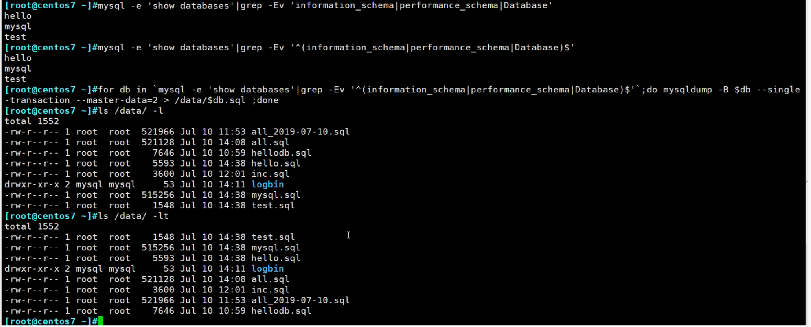

上图得grep 用的倒是挺溜得，不过也就是-w的事，写成了^xxx$；

然后上图用for 循环里的--single-transaction是不是有毒，一个循环一个数据一个对立的事务，TM有10个db就要开启10个事务，数据的一致性还有吗？


明明-B就可以跟多个db，非要秀for。

 

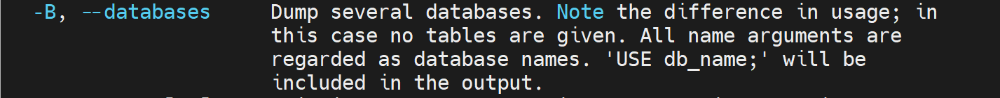


优化下，取出所有需要备份的数据库

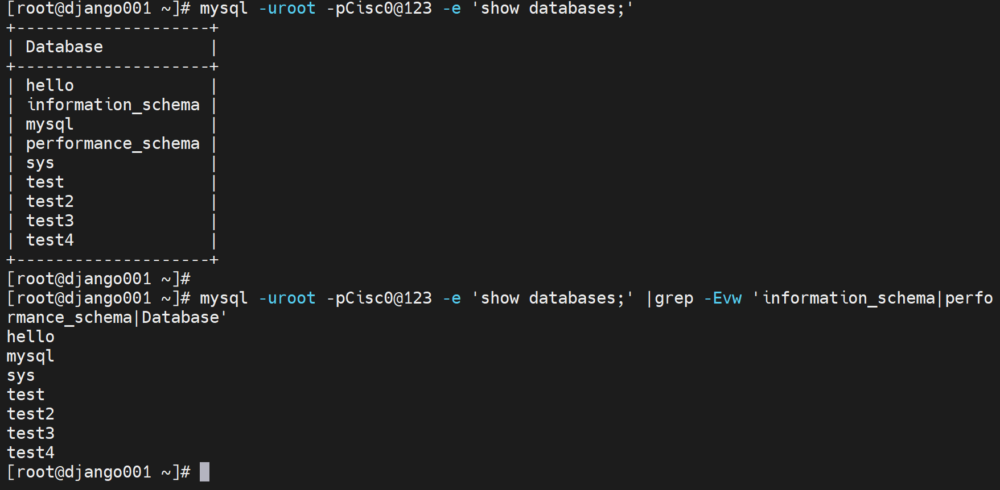

这样👇就可以啦：

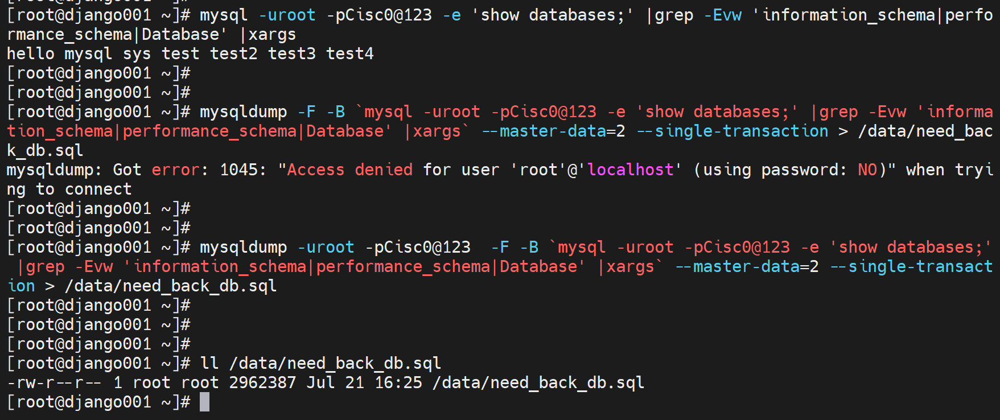

OK，库都备好了👇：

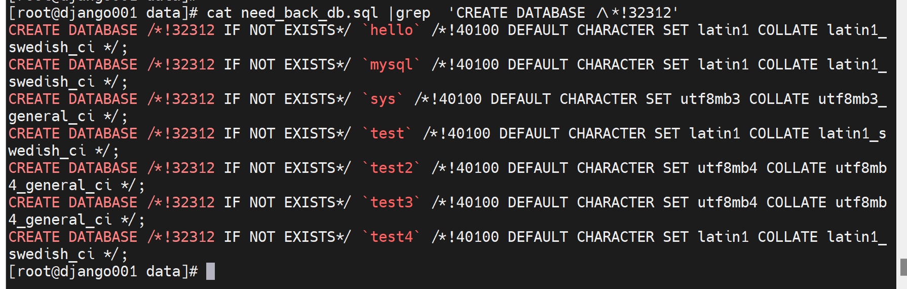

或者👇这样：

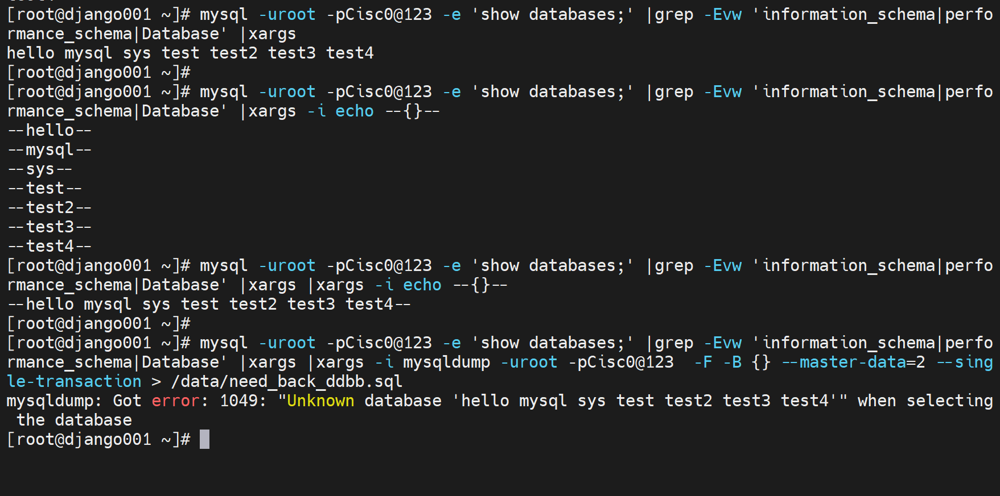

看着有点问题，但是echo出来的cli直接复制是可以的，看着像没有调用bash

优化下就可以了

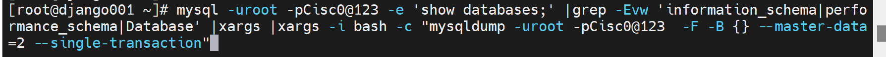

OK了，大小和第一个命令写法一样

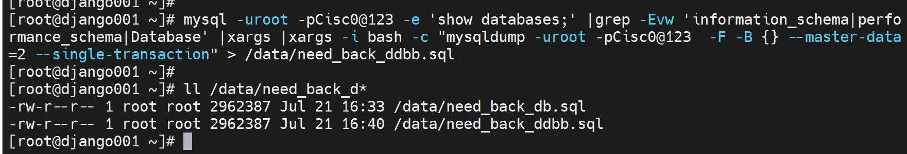

和压缩打包结合一下

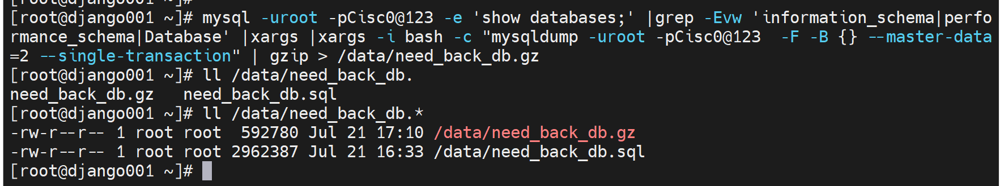


然后补充一个视频里错误的思路（还是-B 只带了一个db），但是有意思的写法（sed写的6）

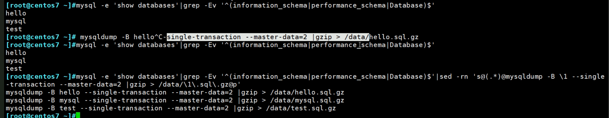

但是生成的命令没有执行，还需要重定向到bash，或者\`\`反斜杠才行。

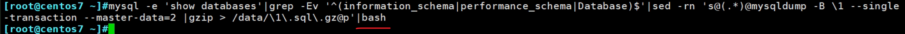


