# 第3节. mysqldump实战和xtrabackup介绍


-F --flush-logs：存在滚动多次数据库-A -B涉及多个数据库，估计一个数据库就会滚动一次；所以需要配合--single-transaction来做一次事务滚动一次，就是相当于不用 人工flush logs刷新binlog了。--master-data肯定要的，mysqldump动作对应的binlog位置得记下来的。


这个就直接STD 输出到屏幕上了哦，然后再看看binlog


从34开始到45，多了12个。


只会刷出一个binlog


-F 滚动的好处也就是flush logs的好处，就是上图的000046号文件是新的日志，和老日志分开来放了，就是新老日志存放清晰，处理备份还原就有明确的000045--老日志，000046新日志，明确的文件分界线就出来了，无需去文件里扒位置去定界了。


看下这条优化备份CLI的实操效果

```shell
mysqldump -F -A --single-transaction --master-data=2 > /data/all_`date +%F`.sql
```


现在000046号文件389，

```
drop table coc;
show master logs;
```

 

 


好，此时000046的size达到了711，从389。日志增长了很多。


-F的效果就出来了，结合--single-transaction以及--master-data=2

就是新的binlog文件000047的389这个位置作为mysqldump的节点，去看看all_`date +%F`.sql文件里必然也写着000047 389这个位置点


相当于flush了一个新日志文件，从这个文件以前的binlog就包含在了全备文件了，从这个节点开始以后就不包含在全备里。


全备已经包含的binlog就可以清一下了，哦，所以binlog清里是这么清的！


磁盘上自然也同步了


👇这个reset没必要吧，不然你还原的全备没问题，补差价的时候处理binlog就不能直接复制mysqldump --master-data 产生得binlog编号和位置了


得改成新的binlog编号，和位置，不过-F是刷新得，位置不用写了直接编号就行了。


### 温备-MyISAM不支持事务，要加锁保证数据一致性。


MyISAM备份要用-x，全部加上读锁，这样才能保证数据一致性。

-l  别用了，会导致数据不一致，因为一个库一个库的加锁，可能导致数据不一致。

所以InnoDB不要用这些选项，这些选项是MyISAM才需要的。


热备-InnoDB，开启事务


就是所有的mysqldump在也给事务里，而事务的默认隔离级别是"可重复读"，所以可以做到所有数据库的数据一致性。

​		但是事务可以隔离DML，不能隔离DDL。请看下图👇


DDL语言：drop table,   rename table, truncate table；这些事务针对这些是不具备隔离性的。

注意truncate table和delete from的区别，前者是DDL，后缀是DML。这些事务具备对其的隔离性。


-q就是--quick看来还不错


## 处理方式

一般来讲MyISAM，-x

对于InnoDB，--single-transaction

但是对于数据库来讲，又有mysql这种系统库是MyISAM的，又有常规的其他所有库就都是InnoDB。

如果

mysqldump -x --single-transaction ，-x就失效了，上图里有提到的。


-A应该就包含了-E -R --triggers --default-character这些了，因为-A包含了mysql系统库。

但是-F和--hex-blob理论上是需要的，然后--deafult-character-set这个需要特定指定吗？不写会不会更好，写的就要看下是否和原本的数据库的默认字符集一致，要写成一致的字符集。

--master-data=1就是有主从复制了。

```
InnoDB建议备份策略
mysqldump –uroot –A –F –E –R --single-transaction --master-data=1 --
flush-privileges --triggers --default-character-set=utf8 --hex-blob
>$BACKUP/fullbak_$BACKUP_TIME.sql

MyISAM建议备份策略
mysqldump –uroot –A –F –E –R –x --master-data=1 --flush-privileges --  triggers --default-character-set=utf8 --hex-blob
>$BACKUP/fullbak_$BACKUP_TIME.sql

```

MyISAM就是需要加上-x选项。


## 分库备份

之前-A可能备的太多了，没必要，于是这里开始学习一下分库备份

来看看错误得案例：


上图得grep 用的倒是挺溜得，不过也就是-w的事，写成了^xxx$；

然后上图用for 循环里的--single-transaction是不是有毒，一个循环一个数据一个对立的事务，TM有10个db就要开启10个事务，数据的一致性还有吗？


明明-B就可以跟多个db，非要秀for。

 


优化下，取出所有需要备份的数据库


这样👇就可以啦：


OK，库都备好了👇：


或者👇这样：


看着有点问题，但是echo出来的cli直接复制是可以的，看着像没有调用bash

优化下就可以了


OK了，大小和第一个命令写法一样


和压缩打包结合一下


然后补充一个视频里错误的思路（还是-B 只带了一个db），但是有意思的写法（sed写的6）


但是生成的命令没有执行，还需要重定向到bash，或者\`\`反斜杠才行。


## xtrabackup-更专业的备份工具


他有很多产品，👆这是xtrabackup，其实人家还有监控，还有管理，还有号称比mysql更牛逼的db


https://www.percona.com/downloads


8.0对应的应该是mysql8.X

2.4对应的就是mysql5.x


这个工具对比mysqldump的优势

1、速度更快，而且不是像mysqldump那种其实就是通过mysql命令进入数据库然后通过大的select命令来查的。extrabackup是通过数据块文件的复制。

2、备份的时候打断正在执行的事务

3、有压缩功能节约磁盘，这个不算什么优点吧，mysqldump出来也能自己zip一下。

4、备份的自动检验，这个是否能保障备份出来的文件可以正常还原的意思呢？如果是，还不错。

5、开源、免费，应该是对标的红帽企业级的备份工具mysqlbackup。


### xtrabackup工具的内部的一些工作机制

2.2版本之前比较烂：其实主要有两个程序组成

innobackupex：per脚本

xtrabackup：C/C++写的

还两个不怎么用：xbcrypt加解密的；xbstream并发用的


xtrabackup 不能备份非innodb表，

innobackupex 可以用来备份非innodb表。和mysqlserver的交互就是指进入mysql进行锁表之类的操作。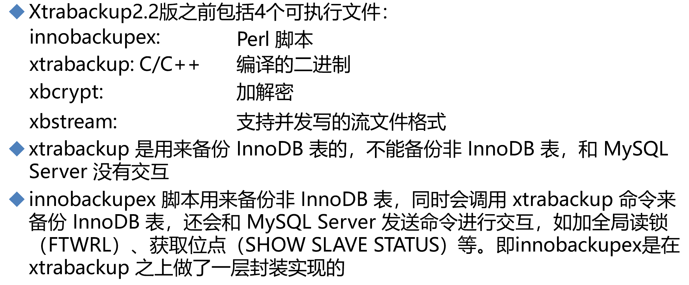

一个innobackupex脚本，一个bin文件，一个还会调另一个，讲完了。

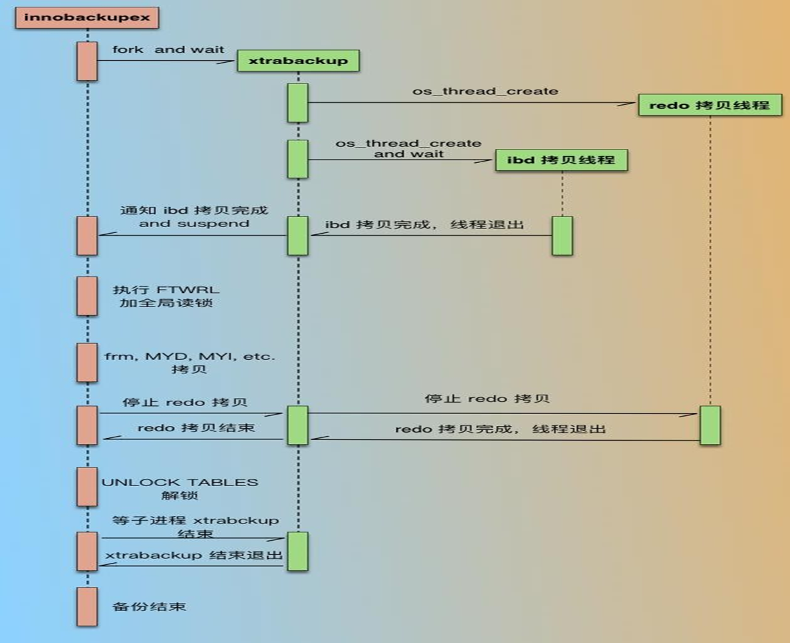

redo拷贝线程：就是os_thread_create，系统创建线程来做redo也就是事务日志的复制。

ibd拷贝线程：就是系统创建线程，来做innodb的ibd文件(里面有数据和索引)的备份。

innodb拷贝完就开始弄MyISAM引擎的数据库了，主要是mysql系统库吧。

MyISAM的被，本质就是复制frm、MYD、MYI文件，etc说明还有别的文件，难道是相关的log？当然要加全局读锁。当然这些动作都是在一个大的事务里进行的。

停止一开始开启的事务后，解锁，退出xtrabackup二进制程序。接着结束innobackupex脚本。

以上就是老版本的xtrabackup的被过程👆。

从2.4以后，就不再是分来的文件了，而是合在一起，都是C写的了。


### 下面就是开始安装xtrabackup

注意启用epel源因为需要libev.so，这个在epel源里。这是视频里讲的，我发现libev好像现在也在base源了。反正一个rock.repo里有很多源：base、appsteam

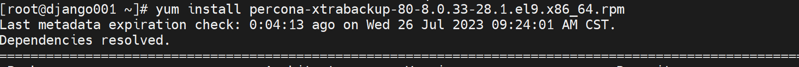

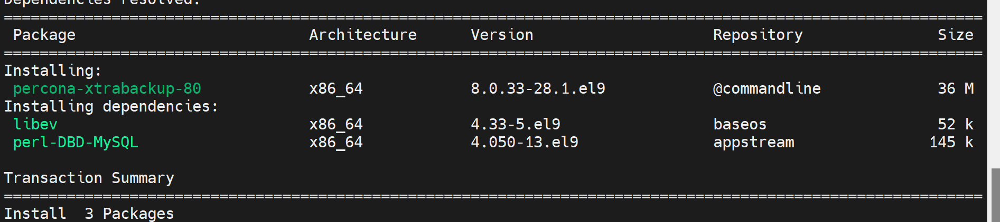

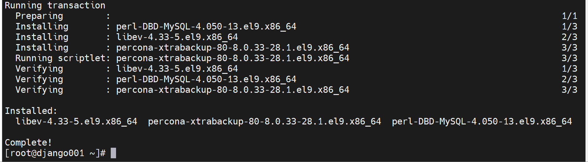

现在的版本早就没了innobackupexu这个文件了，可能2.4以后还保留了它作为xtrabackup的软连接，这是考虑一部分人的使用习惯，后面干脆就连软连接都都没有了。


### xtrabackup的用法


--defaults-file --user  --password --hosts --databases 就登入的用户名和密码，登入主机，备份的数据库

--defaults-file是读取配置文件，比如/etc/my.cnf，这个选项要置顶

--incremental --incremental-basedir，增量备份，已经基于前一次全备或增倍的目录。

差异备份、增量备份的区别

增量备份，可以手动指到前面去，不一定能够是紧接着上一次的增量。

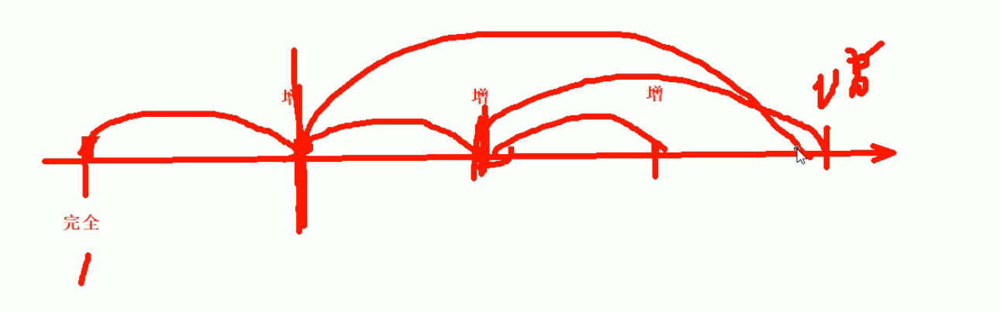

--incremental-dir：是指定还原备份的增量备份的目录

--include=name：指定标明，格式：databasename.tablename


xtrabackup备份还原大致分为三个阶段：

1、备份

上面一小段文字就是讲的备份；

2、预处理：看到这就会想到mysqldump的时候存在这些情况的吧，这个最常用的mysqldump怎么考虑和处理这些事情的呢？印象中mysqldump也就是skip-network一下然后开启单个事务备份，还原就完了

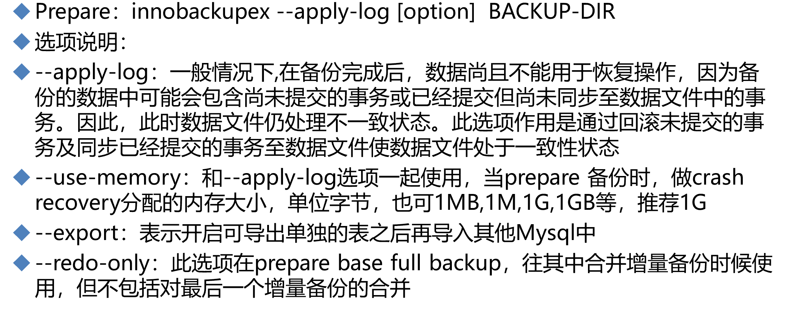

3、还原


下面讲讲细节

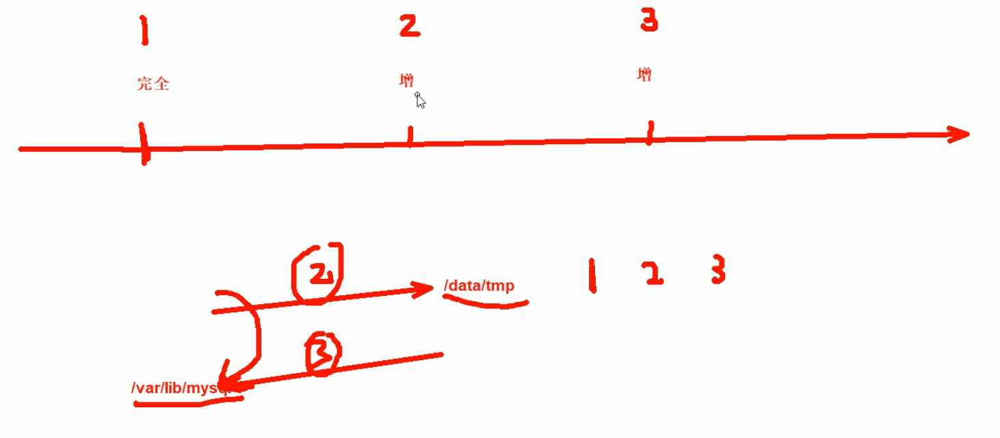

图中没有画出①，①其实就是第一步备份咯；"③就是还原，就是等第②步预处理完了得到完全的数据库文件后，复制到/var/lib/mysql/下，就是这么个意思。"

②就是预处理；是将1的全备和2、3的增量整合在一起，这个整合并不简单。


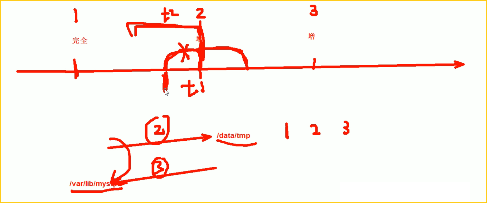

看这个图，就能看出来xtrabackup比myslqdump专业的地方了，就是担心你mysqldump在做停服或者dump的时候存在跨越备份时间节点的事务--图中t1事务。

来，重新讲讲上图，当进行备份的时候，比如2这个增量备份的节点，有一个t1事务进行了一半，此时2节点处备份下来的事务log肯定会回滚，回滚到前面；还有一个t2事务它是已经执行完了在2节点备份动作的时候就已经执行完了。所以2节点备份的东西不是一个时间节点的了，因为2节点本来备份的节点理论上时间节点是一致的，但是t1由于是半个事务，是后来回滚了的，数据自然就不一致了。这个说法对吗，t1在事务里，外界是可重复读，哪怕commit也是可重复读的，所以不会影响外界吧，对于外界来讲t1是不存在的对吧？问题是，前一半事务你其实备下来了只不过是回滚了，后一半事务在3节点处其实也是在后一个增量备份里备份下来了，所以t1的前一半事务不要回滚，而是等后面一个增量备份后再去拼t2的后一半事务，否则整体上t1就丢了，一旦t1丢了，这个整体事务丢了，那么就和实际数据不一致了，及时t1执行的时候是 可重复读，外界是不受影响的，但是t1整体是会结束commit的，所以外界就受到影响了的，所以t1的事务需要合并的。

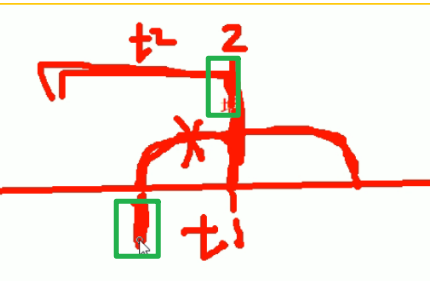


如果3节点处也出现了执行一半的事务，那就回滚啊，也没啥大问题。

所以最后一个备份点的跨越事务才会回滚，而前面的跨备份点的事务是需要整合的，做了一半的事务凑全了就不会回滚了，所以才有了②预处理步骤。


所以需要在<font color=red>cli也就是命令敲的时候，要体现出是不是最后一次备份节点的还原动作</font>，如果不是就存在拼凑不完整事务的情况的，有这个情况就要拼凑的；如果是最后一次备份节点，如果存在不完整的事务就回滚啦。这个情况简称为 <font color=red>"封口"</font>，同样存在于sqlserver和orcale。

封口就是不完整的事务不回滚，等后续另一半事务拼凑，就叫做不封口，而cli里明确是最后一次还原--这个动作所涉及半个事务是直接回滚的无需等待因为没有后续，所以就叫做封口。这是口语化沟通的时候存在这么个说法。emm就是行家一出手(口)就知有没有。装B用的现在是。当然正途就是理解别人用的，自己说出来就是装B用的。


备份时不会回滚的，只有还原的时候才会回滚！比如，1节点做的备份，如果也截断了一个事务，没关系，备份里的事务只有一半没事，就时一半在那的，还原的时候才会说这个一半的事务回不回滚。

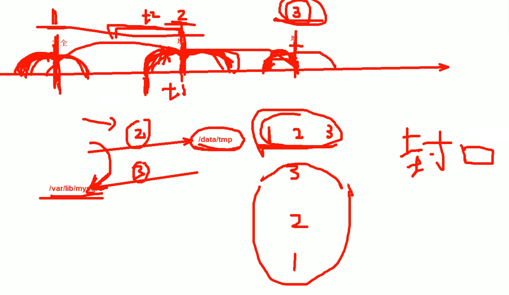

如果你就是那2节点的备份进行还原，那就是要回滚啦，封口在哪里，那里就回滚。

还原的时候，最后一次你定在那里，那里就会回滚。


备份CLI的选项见后面实验，然后xtrabackup备的时候，会生成一些辅助文件，比如xtrabackup_info文件用来记录工具的版本、cli用了哪些选项、花费了多长时间、备份了LSN--日志的序列号。


这个LSN号其实类似binglog的位置，是OS组织数据以PAGE为单位类似块的概念，然后这个PAGE的

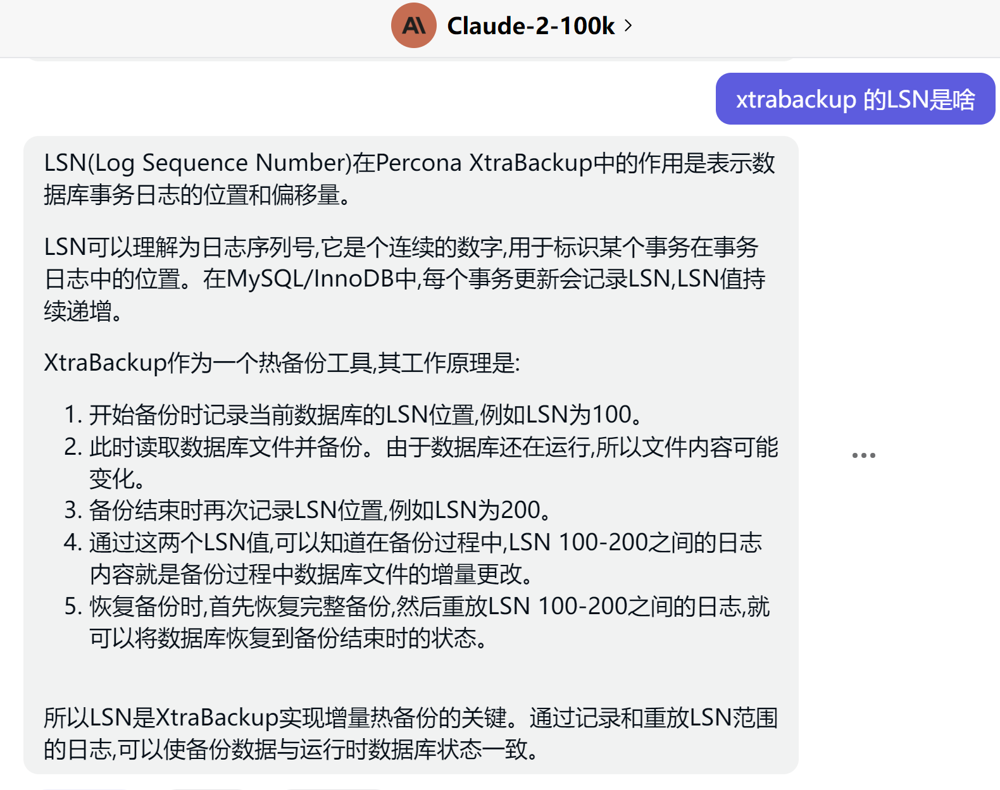

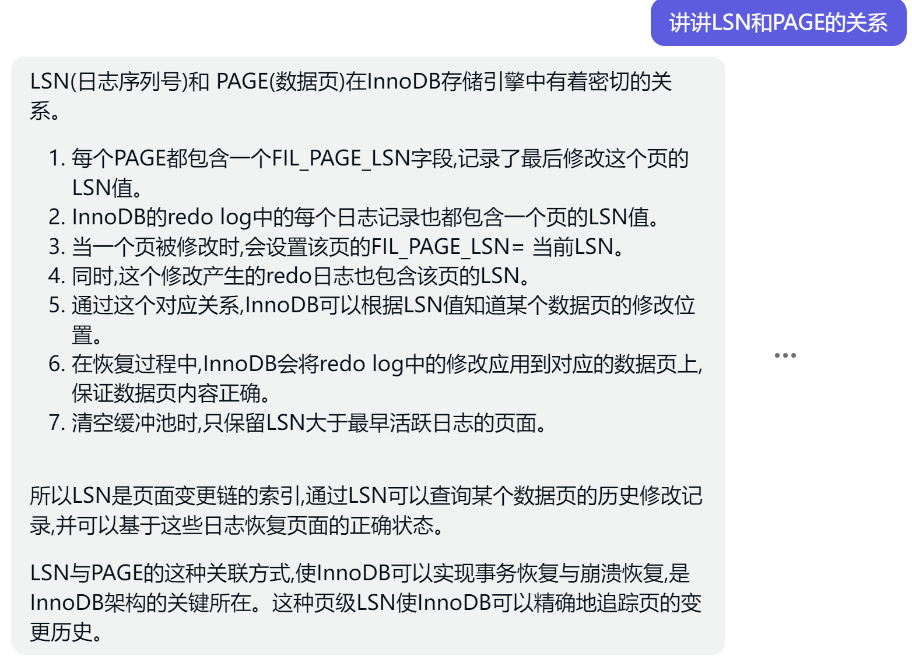


### 继续解释下LSN：

磁盘上的DB组织数据是按页page来存放的，

类似block--块是OS以及上次FS都是这么组织的，不过OS的块和FS文件系统的块不是一回事。

所以这里我们来总结下，os-block，fs-block，db-page

page的一个单位容量要比block大的多了去了，一半yum下来或者编译的时候不改源码，也不会改它，默认就是16Kbytes一个单位分配的。


1、数据备份的时候，会记录PAGE里的一个数值，这个数值就是LSN

2、LSN就是事务的编号，在数据库做任何修改操作的时候，会把事务日志的编号写道PAGE里去。

比如PAGE里都放了一些数据，如果你修改了某个PAGE里的数据，那么这个PAGE页里就会记录LSN号。这个LSN号只增不减。


现在接上图继续说，现在xtrabackup备份数据的时候，就会把最大的事务编号LSN记录下来，比如上图就是10002。

​		现在又有新的改动，比如10002变成当时的事务日志编号比如是：20000。

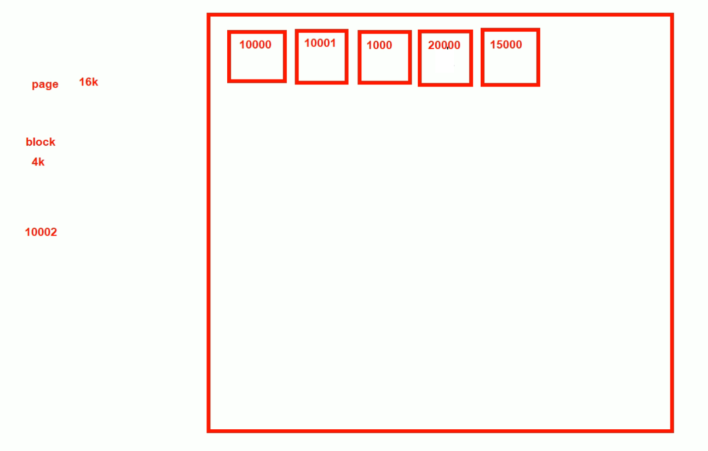

现在再一次备份-做增量备份，也就是说从10002上次备份的点到现在20000这个点，中间涉及的数据做增量备份，那么对应到PAGE上，也就是涉及到的几个PAGE（15000和20000这两个页）才会去处理。

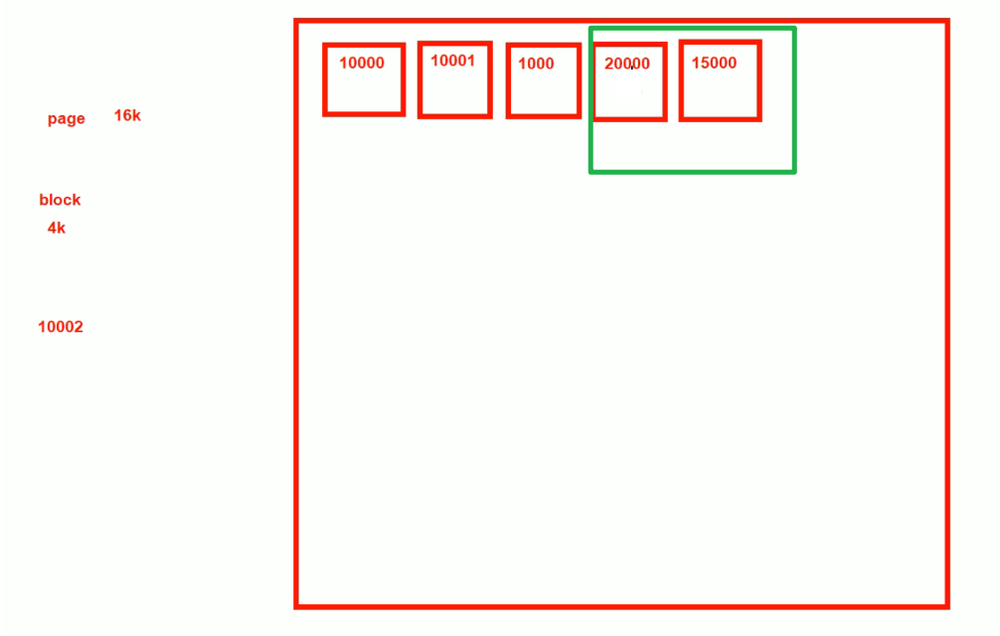


就是根据LSN来判断哪些PAGE需要备份，哪些不用，从而实现增量备份。


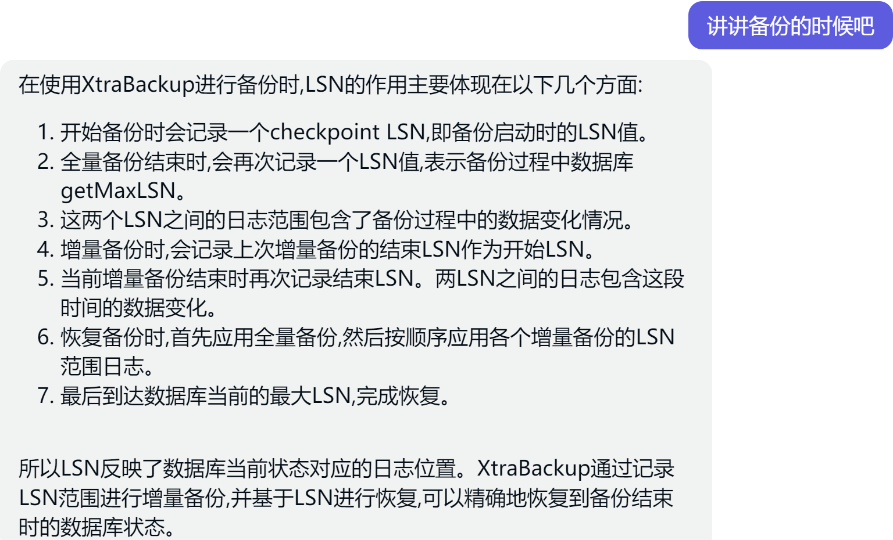

xtrabackup_checkpoints：这个就是涉及备份时候记录的LSN和备份后再记录一次的LSN，涉及是全备还是增量，涉及是否是prepared状态，也即是上面讲了这么多LSN的内容介绍。


xtrabackup_binlog_info：同样也会涉及binlog的位置记录，上面讲的是事务日志的位置记录。

所以备份还原的时候也是基于binlog的位置的，不需要认为修改，然后事务日志估计是用来"封口"--也就是回滚和同步用的吧。同步就是commit后还确认写道磁盘里的意思咯。


backup-my.cnf  就是备份配置文件

xtrabackup_logfile：该工具自身的日志记录。

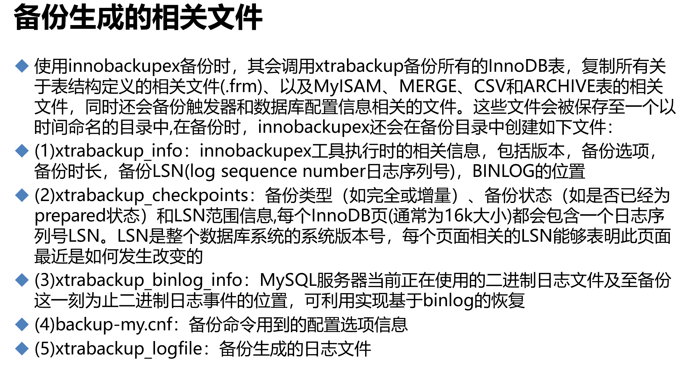


