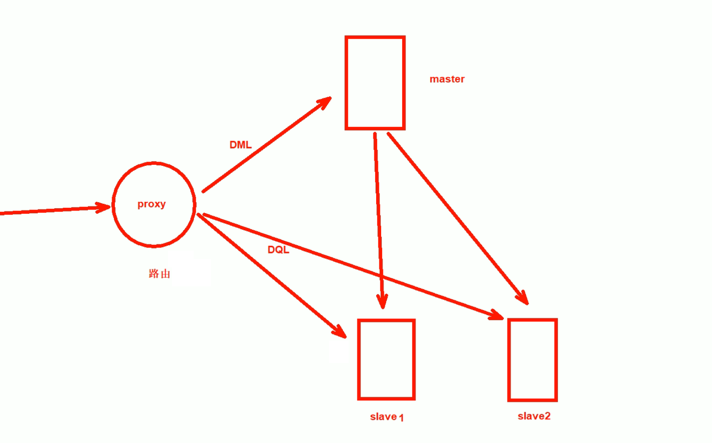
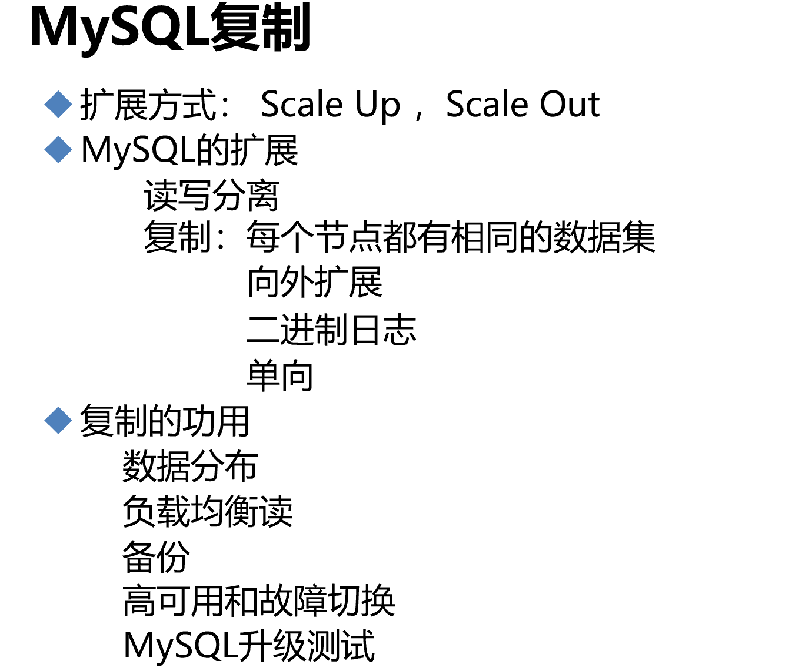
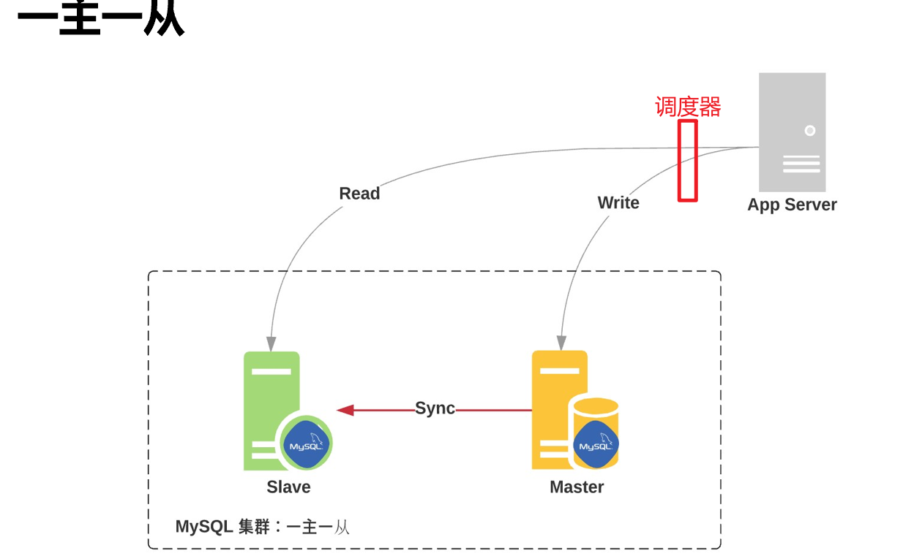
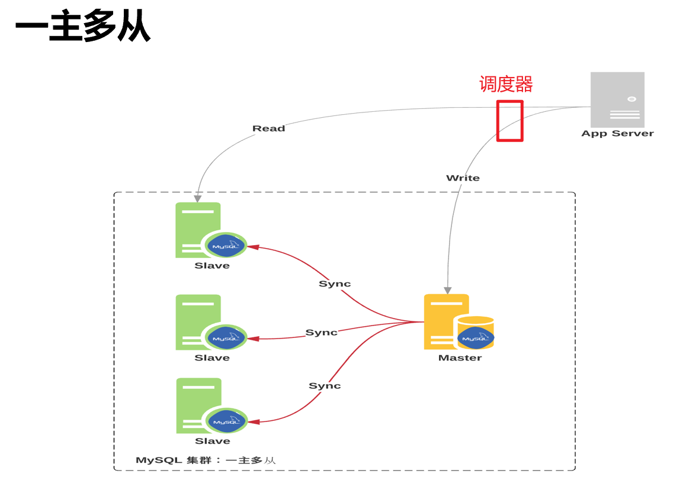
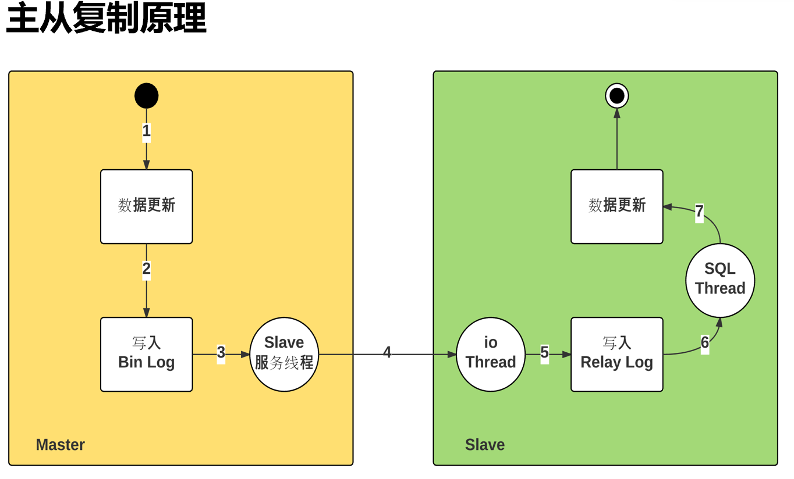
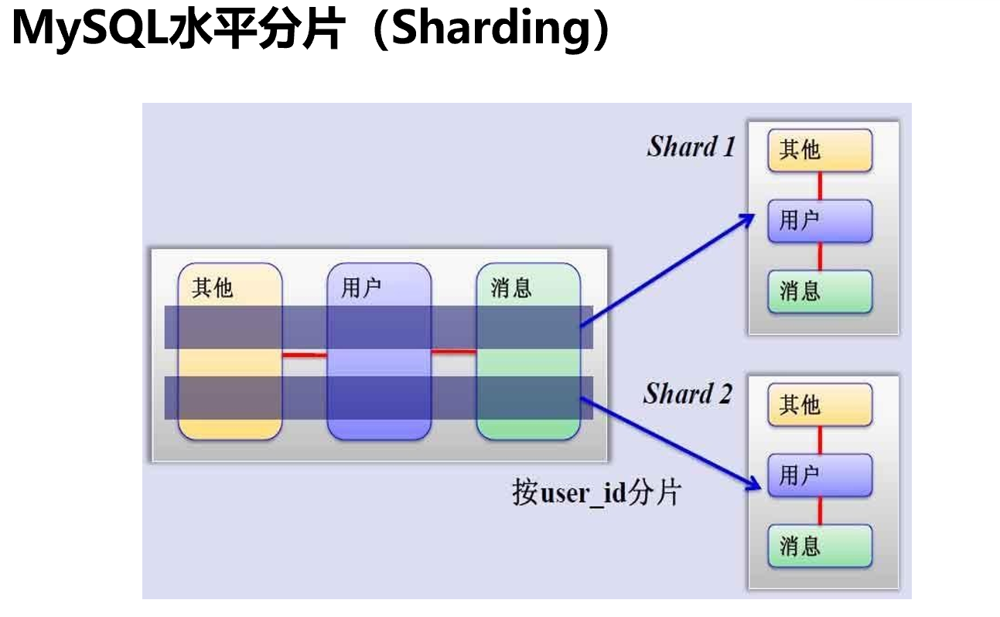
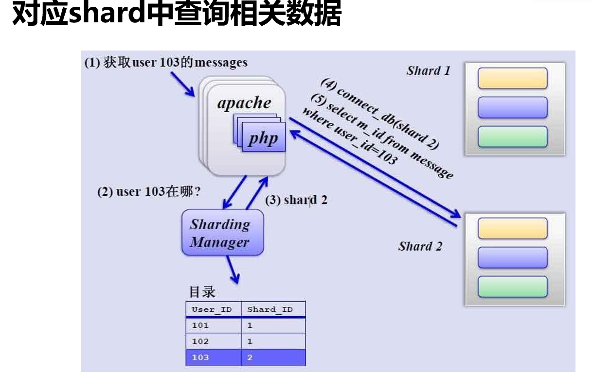

# 第4节. mysql主从复制原理和实现

主从可不是备份，主上面DDL删库，从上也没了，DDL也不是事务日志能够记录的，也无法回滚，更别说恶意的commit了；所以备份时备份，主从是主从。

scale up,scale out  纵向和横向，前者指提升硬件资源cpu，内存、硬盘等；后者指提升横向计算机数量，类似主从，集群来提升性能。

主从复制要配合读写分离

proxy就是当sql操作来的时候，进行识别：

如果是DML就送给主，主要时进行数据的修改；

如果是DQL查询语句，就送给从进行查询；

这种proxy读写分离器，或者叫代理器，或者叫路由器，或者叫调度器。

proxy有很多产品，看你喜欢哪一个了。

下面先搭建主从架构

如果主挂了，从可以在秒级顶替上来。

升级可以先拿一个从节点开始升级，然后用用看，没问题就继续升其他的。

## 主从架构

sync 主从复制，是依赖的binlog，所以binlog是要在master上启动的。

然后是怎么把二进制日志拷贝过去的，下文会细讲。

很多时候，主从架构的搭建不是一蹴而就的。要知道一个事实规律，架构这种东西从来不是生下来就一个样子的，是不断演进的。所以不能为了好看的架构而架构，一定是适合业务发展需求。

复制依赖于二进制日志，master---slave---slave，如果是这种级联，其实中间的slave对于右边的slave来讲也是主了，而主就需要启用binlog。

1、当数据更新，就会自动生成binlog日志里的内容；

2、因为要主从复制，所以启用了一个服务--叫dump的线程，在Master上启用的。这个线程会负责读取新的二进制日志，把它通过网络发送给Slave。

3、有发就有接收啊，所以在slave上有一个线程来接收--小IO thread。这个io线程就是负责从网络中接收来自于master的binlog。

4、slave的io thread接收下来，放到relay log中继日志文件里，放到中继日志文件也不是最终目的，最终目的是要让从数据库的数据也发生更新。

5、此时就需要slave上的sql thread线程来读取 中继日志里的binlog，在本地slave数据库里运行，从而实现slave的数据同步。

6、主从复制涉及 两个线程，master 那边1个，slave那边2个。dump thread、io thread、sql thread。

7、涉及两个日志，主节点的binlog；从节点的relaylog。

##### 主从架构的主是复制写操作的，主就是一台，如果写压力大业务大，主从，从再多也没用。此时，就需要分库、分表来解决。

拆库和主从不搭嘎，原来一个主服务器拆成3个，这3个依然都是主服务器

拆库的原则，是三个部分或者本来是三个表没有关系，不需要join表，所以就可以拆成各自的库。

上图👆是纵向切片，下图👇是水平切片

1、比如用户表、消息表、其他表，表和表之间存在join关系；此时纵向拆就不行了。

2、可以考虑横向拆，原来1000W条拆成500W+500W两张表，然后放到2个数据库机器上去。

3、拆开来后表的结构都一样的，只是放了其中一部分的数据

4、比如按13579奇偶数拆，奇数放一个服务器上，偶数放另一个服务器上。

5、比如按范围拆，1-500W，501W-1000W。

6、按地区拆，北京、上海

7、按用户级别拆，vip、svip

8、前端还得有调度也就是proxy，查和写都得知道去哪个库。

分库也好，主从也罢，都涉及到调度器proxy去将 读写负载分担到主也好从也好，拆分出来的库也罢。

这里就涉及一个调度器这个负载设备点的 单点故障。

