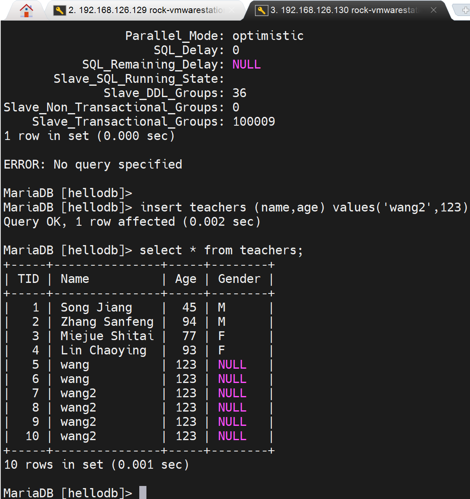

# 第1节. 主从服务故障恢复和级联复制

# 半途做主从

一半业务刚起步也不会做什么主从，就单机，随着业务体量起来才会考虑架构的事情。所以需要处理主从复制的时候主节点上已经有很多数据的情况。

思路就是：先将主节点的数据备份-还原到从节点--其实如果是VM直接克隆出来一台就行了连mysqldump都不需要，再开启主从复制，复制的位置就是show master logs的位置。


## 实验一下

1、弄一个干净的mariadb服务


然后这里报错，就是文件夹的权限问题


binlog就有了


```


```

2、制造一些数据，代表单节点的数据起来了--我认为因该要做这个


```
然后备份，还原一下，这里就不偷懒用VM克隆，实际工作中反而是克隆直接，不过具体情况具体看咯，两种方法都得会。


主节点的账号要不要复制过去给从节点，要！主从复制本身从节点上不用有账号库，但是从节点万一成为了主节点，此时其他的从节点就会和这个提升上来的从节点上同步数据，此时该节点就需要有同步用的账号库了。这就是考虑问题的时间跨度要有，所以当面临一个不擅长的问题，就需要有这个时间跨度的意识去拉自己一把。

所以做主从的时候，就是先创建账号，再备份还原过去，这样账号就一起还原到从节点了。
```


3、有了一些数据了，也先于主从复制创建了账号。现在还是备份使用mysqldump


关键语句如下👇


这条语句其实就是主从复制的，从节点上面用的复制配置CLI。


msyqldump里的--master-data=1这个=1就是在从节点上面还原的时候直接顺带执行了change master to xxxx 了，不过还缺一个mater的IP是多少。


所以直接在从节点执行也是不行的。还得补齐master的IP，复制的账号。


4、将dump出来的备份复制到从节点


将从节点的mariadb 删库，卸载，重装，发现，/etc/my.cnf会自动给你备份，新建，还是挺不错的。

 


重新安装好mariadb后，不要启用服务，否则会自动生成/var/lib/mysql/的一些文件，这样不利于还原主节点那边的数据。  # 当然这视频里说的，现在版本又不这么回事了，yum install后，直接/var/lib/mysql/下就会直接生成文件，不用启动也会又文件初始化生成的。所以不用管这些。而且你恢复dump文件的时候就是要先启动服务的。


然后vim 进去备份文件all.sql补全从节点的change maser to的相关信息

 


5、修改从节点的配置文件


 

 6、恢复dump文件

启动服务


db也是默认的几个，slave status也是空的

server_id没问题，注意是下划线。/etc/my.cnf里面可以-可以\_，但是mysql交互模式进来就是变量去看，变量就是\_。


但是这个read_only ON是防不住root的哦，root依然可以修改的。


由于vim过all.sql补齐了change master to的相关信息，所以可以直接mysql < all.sql还原并直接置为从节点，如果在交互模式里直接source /data/all.sql就行


此时从节点的配置好了，就差一个启动


然后此时一些 relay文件就生成了


目前没有启动，从节点和master节点的网络连接还没有


待会启动了slave start后，从节点就会主动连接主节点的3306端口去了。


然后就报错鸟


不过由于IO thread起来了，所以ss -nt tcp连接时已经建立


然后拍个错


这对这个报错


flush priveleges；就行了，然后start slave；一下。

然后就发现继续报错


我只能说FUCK，然后我继续排错，过程嘛就是remove \install \remove\install，

发现了一个all.sql这个dump文件里的错误，就是分号


好像就是这个原因，我再改回分号试试，破案了，就是这个分号导致了上面的start slave后的show slave stauts\G看到的报错，而且细究一下其实mysql < /data/all.sql是会报错的，👇如图


但是你要是进入mysql，敲source /data/all.sql，就看不到报错了，<font color=red>所以由此看来，还是建议在外面做mysql < /data/all.sql的还原操作比较OK</font>。


👆应该root不受限，所以可以导入了


总之就是

```
  yum -y remove mariadb-server
  rm -rf /var/lib/mysql/*
  yum -y install  mariadb-server
  \cp -a /etc/my.cnf.rpmsave /etc/my.cnf
  systemctl start mariadb
  systemctl status mariadb
  mysql < /data/all.sql
这样就可以啦
```


OK了


tcp 建连也没问题


数据也还原的没问题


然后看看主从复制是否OK能否复制了


同步的很丝滑~


总结，在现有的mysql服务器基础上，实现主从复制


## 生成中主从复制的错误案例


1、案例1

有人本该去主上创建库，结果跑到从节点上创建了；发现后又跑到主节点上创建了一遍。

错误如下


然后去主上创建同名的库


但是我这个没报错啊，难道是高版本优化？

然后我在主节点上删掉这个db003试试


从节点此时就自动同步了，貌似高版本确实优化了


老版本是由这个问题的，如下图👇


这个问题的严重性在于：一旦发生这个错误，后续的主从复制就停滞了，继续在主节点上创建数据库，从节点就不会同步了。

这种冲突不仅仅是数据，这里只是举例，冲突可能存在于表，表里的记录都是可能的。

这里处理的方法不是在从上drop掉冲突的库，及时删掉，也不会继续同步的。需要stop salve和start slave，重启一下。但是生成中不能人工去处理的吖~而其是报错明确的，万一报错里的内容没有明确指出来呢，万一不止一条呢。


按视频里说法就是忽略这个报错的意思咯，我先不急记录他的处理方法，我先看看高版本里的这种错是否由优化自动处理掉了。


结果该问题确实有的，没有自动优化一说，继续处理吧。


此时主节点那边开始写入大量数据，从节点就卡在那边不同步了


此时从节点并不会同步


### skip忽略错误-sql_slave_skip_counter


此时就可以同步复制了，之前主节点跑的存储过程其实就是创建和insert的testlog也同步过来了👇


当然忽略的1个报错，只是临时解决让数据继续同步下去，但是如果存在关联性，就不太好了，还是要回头过来去解决。

如果问题实在太多，还不如从的删掉，重新同步呢。


### skip指定的error

再一个，尝试通过忽略错误编号的方式而不是忽略几个，这里要明确这个错误编号我测试下来不是说代表某一个错误，至少我insert 两次，忽略一次，1062的错误编号没变。





不行唉，read-only也碍事了，改一下


还是不对啊


算了该配置文件去


就好了。。。


所以那几个insert都是1062类型的错？我理解成类型不知道对不对啊。

对的吧，官方有的https://mariadb.com/kb/en/mariadb-error-codes/


# 如果主服务器宕机了

1、创建出1主2从的架构先

```
在主节点上执行
mysqldump -A --single-transaction --master-data=1 > /data/all2.sql
scp /data/all2.sql 192.168.126.131:/data

```


```
在从节点上执行

yum -y install mariadb-server

vim /etc/my.cnf
server-id=131
read-only
wr

systemctl restart mariadb

vim /data/all2.sql
----补齐-----
CHANGE MASTER TO
 MASTER_HOST='192.168.126.129',
 MASTER_USER='repluser',
 MASTER_PASSWORD='centos',
 MASTER_PORT=3306,
     #MASTER_LOG_FILE='mariadb-bin.000032',  这两行是自动就有的
     #MASTER_LOG_POS=548,         默认就有
 MASTER_CONNECT_RETRY=10;           # 注意最后一个才是分号
 
 wr
 
 mysql < /data/all2.sql
 
 mysql
 
 start slave;
 
 show slave status\G;                看见2个YES就OK啦。

```

上面执行的过程中报错了


①是版本不一致导致的

②是

https://stackoverflow.com/questions/1814532/mysql-error-1071-specified-key-was-too-long-max-key-length-is-767-bytes

