# 第4节. 基于MySQL5.7的二进制安装和GTID复制


# GTID复制-slave配置的是省去指定masterbinlog位置的方式

之前主复制都是指定MASTER_LOG_FILE='mariadb-bin.000023', 和 Master_log_pos=xxx

```
CHANGE MASTER TO  MASTER_HOST='192.168.126.129',  MASTER_USER='repluser',  
MASTER_PASSWORD='cisco',
MASTER_LOG_FILE='mariadb-bin.000023',  
MASTER_LOG_POS=691,
MASTER_SSL=1;
```


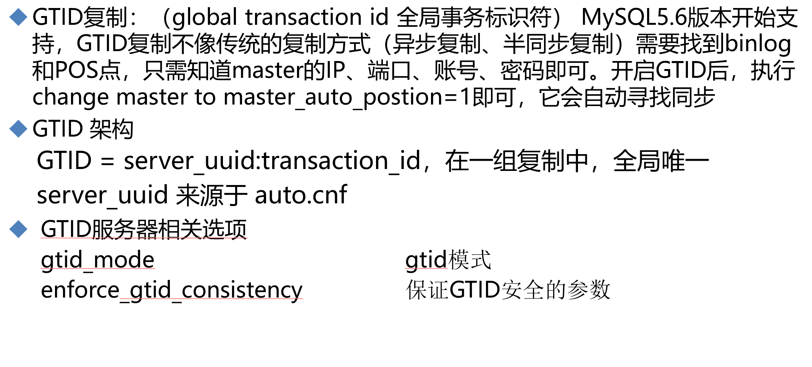

这么多配置，还不如老方法手工指定呢，呵呵


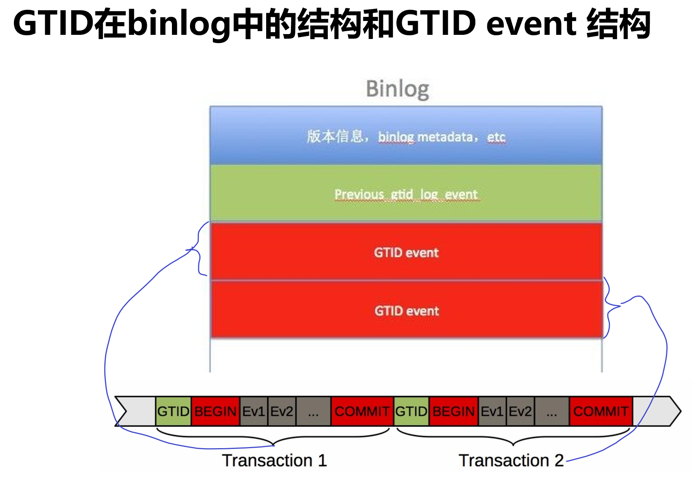

GTID 全局事务ID

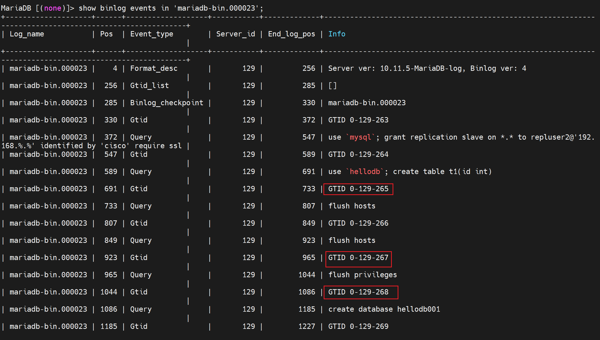


GTID = server_uuid:transaction_id，在一组复制中，全局唯一 server_uuid 来源于 auto.cnf


开搞

1、下载mysql5.7算了我还是直接用新的吧

https://dev.mysql.com/downloads/mysql/

没找到新版的二进制安装包，，，5.7的到时候有

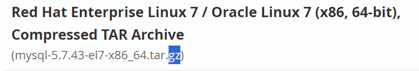

算了直接用高版本的mariadb不香嘛，操


视频演示的mysql5.7的一个二级制安装备注：

---

同样注意下mysql5.7的二进制安装，的一个初始化差一点，它使用mysqld --initialize来初始化数据库的，并且直接在结尾给你生成了root的密码了。这个是和前面单独二进制安装的章节是不一样的点。

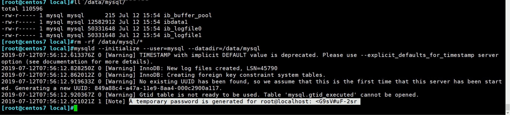

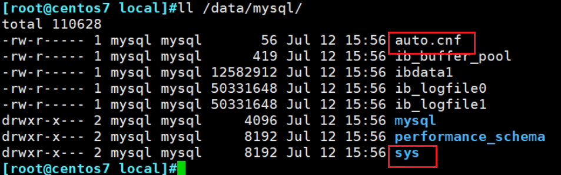 

这里多了auto.cnf这个文件，和sys默认库


这个就是server的uuid来源了


需要添加client的socket，说什么不然本机连不了，client登入的时候也会找不到socket？之前多实例也没有说配置client的socket啊，优点奇怪👇

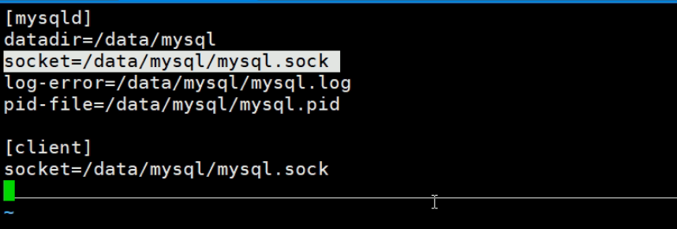

其他和之前章节的 二进制安装一样的操作。


登入的时候密码有特殊字符的处理方式

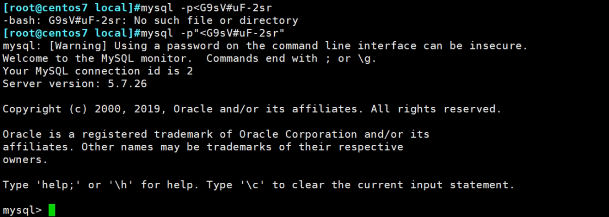

mango里python我是这么处理的

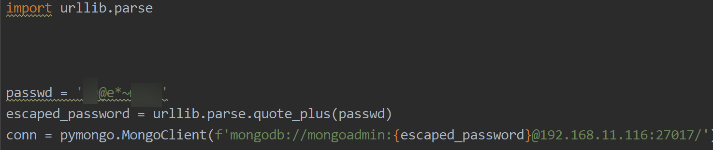

### mysql5.7的二进制安装全过程👇

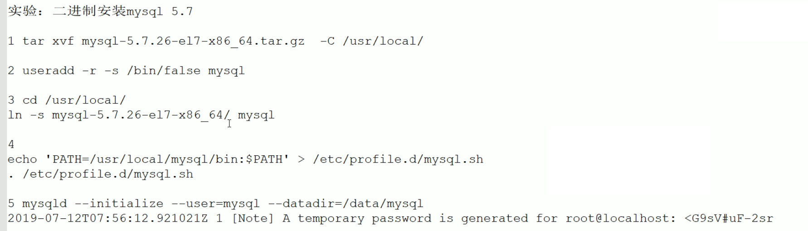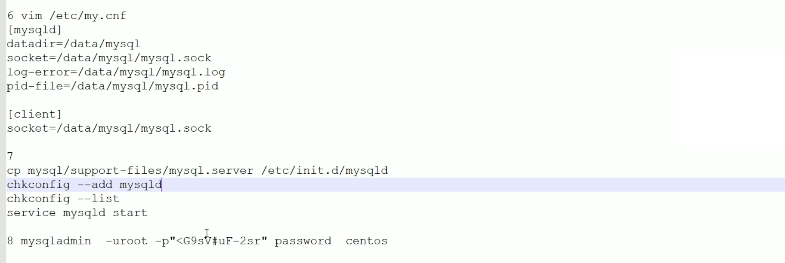


### GTID配置举例

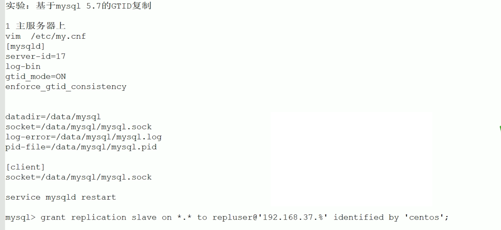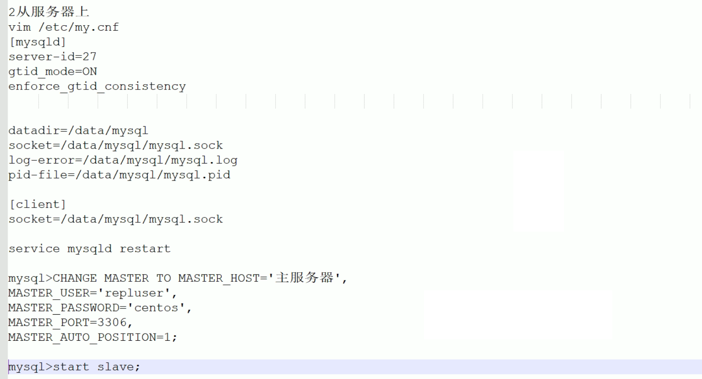


