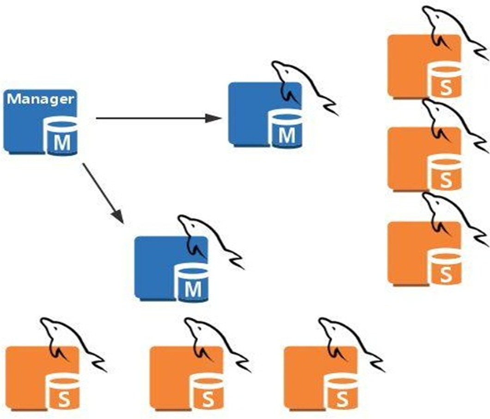
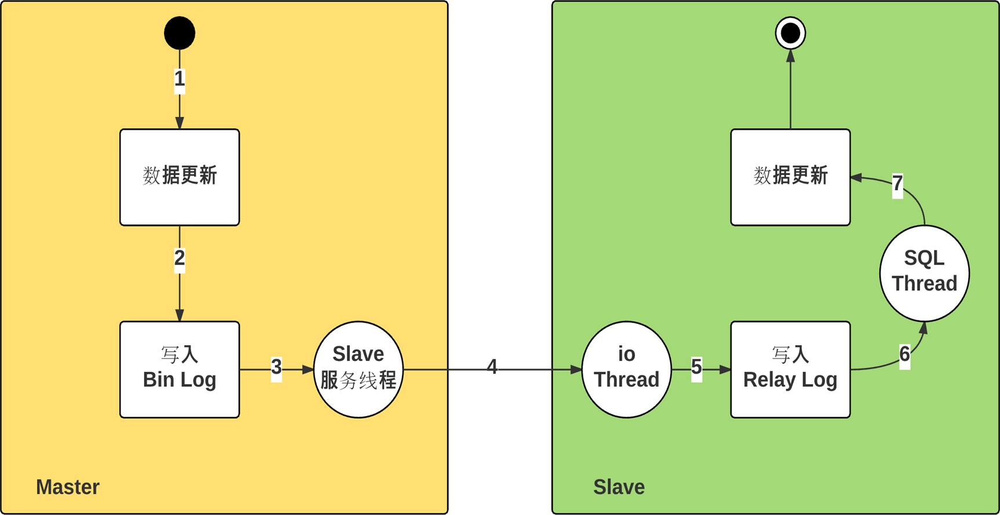
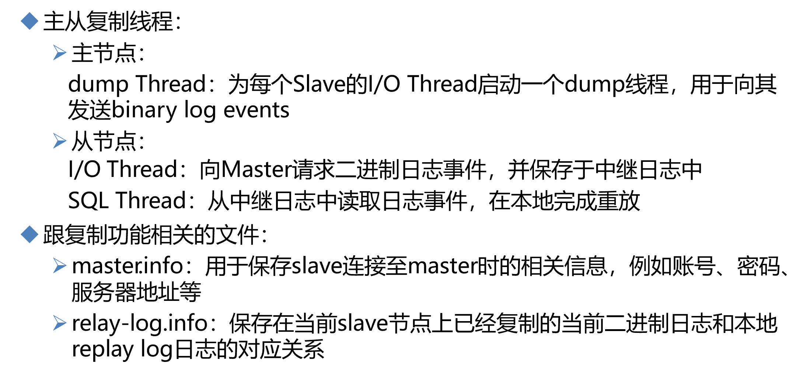
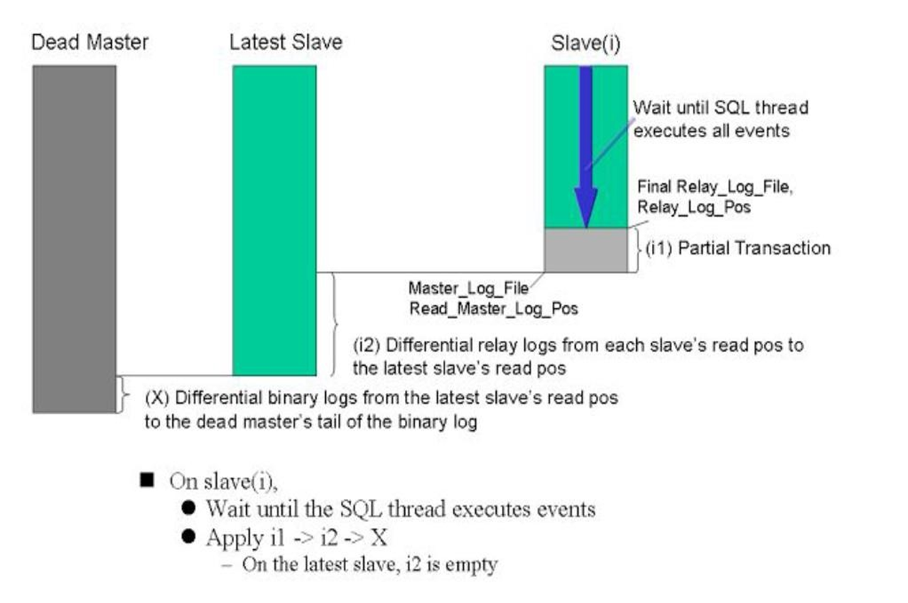
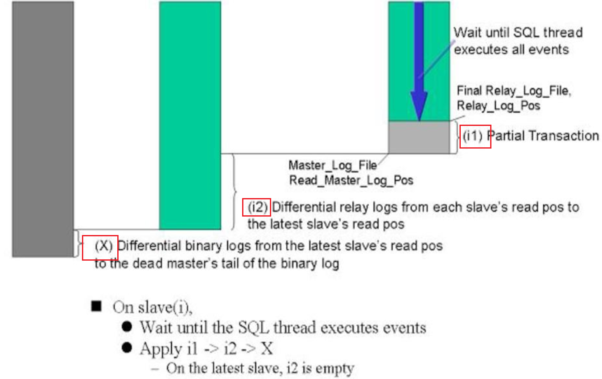
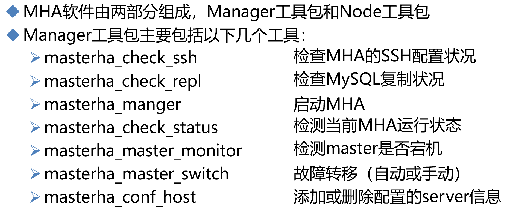
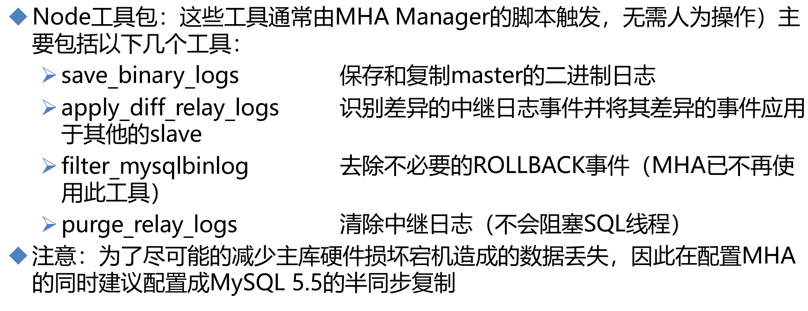
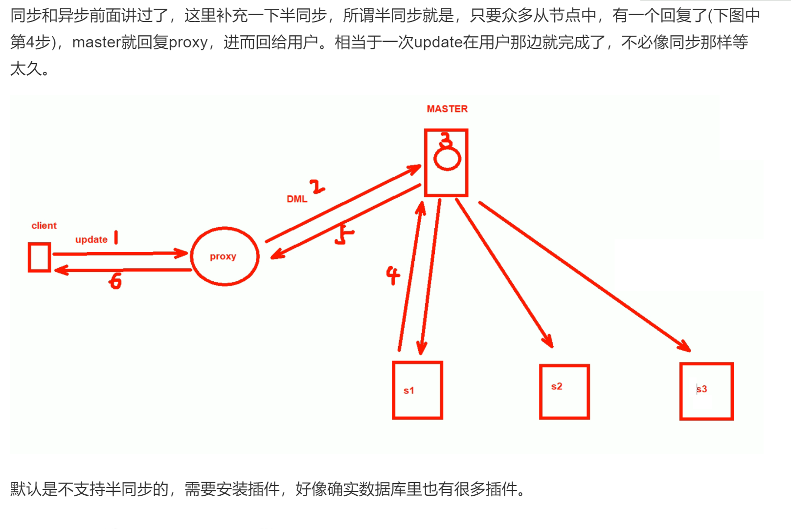
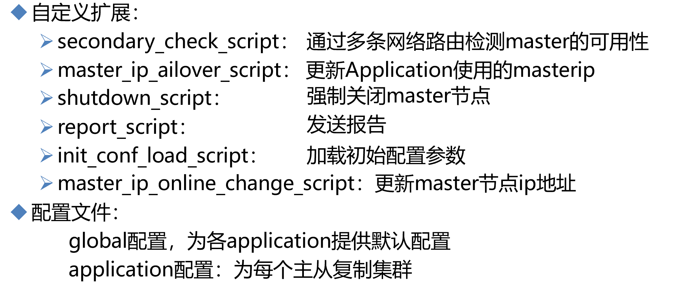
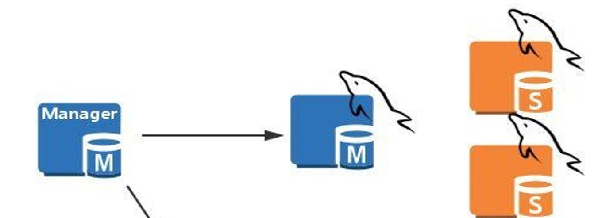

# 第6节. mysql的主从复制高可用性解决方案MHA

我为什么要用这个东西呢，一个perl 语言写的东西，最新版本2012年，难道是因为免费实用够用？好吧

# MHA架构

manager节点，管理着多个主从，某一堆主从的master挂了，就会把在那堆主从里的找一个slave提升为master。

manager管理节点，是单点，但是问题不大，因为用户访问的业务不走它走，它挂了，不影响业务；除非运气好，manager挂了的时间段里，某个主从的主也挂了，此时由于没有管理节点，所以就无法自动提升slave，所以也就导致业务出问题了，按传统的思路写是要分流到master上的，此时master都没了，所以业务收到了影响。

# MHA的工作原理介绍

先复习一下主从的底层

**再来理解下图MHA的思路**

1、三根柱子代表什么

2、柱子之间的落差，就是binlog落差

3、slave(i)这个i是变量，就是很多个slave的意思，u known~，这些不太优秀的slave(i)们，不仅仅从master那拿到的binglog比最优秀的lastest slave要少一截，而且写到本地还写的慢。

4、所以矮子当中选将军咯，新的master选出来后，

5、想办法补齐DeadMaster和LatestSlave之间的binlog差，怎么想办法：①dead不是机器dead只是服务dead就去找binlog文件；②binlog是否有异地备份；③没有异地，本地重启看看也行啊对不对，总之找到dead master上的binlog，补齐到LatestSlave上，不过这些理论上都是MHA实现的，所以MHA不太可能说给你异地取备份，也不太可能给你重启deadmaster机器，所以MHA能自动处理的应该就是机器没死mysql服务死的的情况去去binlog文件。

6、slave(i)同步之前可能也要做两个事情：①SQL Thread进程走完，把已经拿到的binlog写到本地文件里；②把和Lastest Slave之间的差距通过I/O Thread补齐；然后就继续同步。

看它意思，

这么麻烦的吗，难道不是slave 所有的save包括最优的那个slave，统统从deadmaster同步X，唉不对，同步各自的差异binlog嘛。

估计是怕deadmaster连机器都挂了，ssh上不去，MHA的manage拿不到binlog，就做不了X，所以才有了i1-->i2-->X这么一个先后同步的过程，就是每次同步的动作不大，能成功的同步先做了。

i1就是本地的sql线程将relylog写到库里，i2就是slave们从最优的slave去取差异binlog；X就是deadMaster上取binlog这个可能就不一定成功。

**所以MHA要利用到ssh，scp这些协议**

manager工具包需要epel源，node工具包不需要epel源。

manager工具包安装在manager节点上，node工具包安装在监控的主从节点上和manager节点上。

半同步复制，默认是异步会存在slave和master差异越来越大的可能，而半同步，就能保证只要有一台slave回应我master了，master就回答client了。参见 第二十七章 MYSQL数据05-第2节

master作为半同步的一个关键点，它的行为就是只要收到一台slave的响应就会回应client。那么问题来了，这种行为下，slave(i)们是否是保证一定有一台是最优的，会不会出现不同的数据分散到不同的slave上，不会！同步的机制就是binlog的posti位置，按序复制的，所以某台slave回应了master，那么这台slave一定已经取到了最新的数据了！  呼~~~

简单了解👇

MHA有个配置文件：

​		其中global配置：就是为各个主从(它叫做application)提供默认的统一配置模板

​		如果想为单个某个主从，配置，就针对他们配置application关键字的配置。

# 实验

4台就够了

