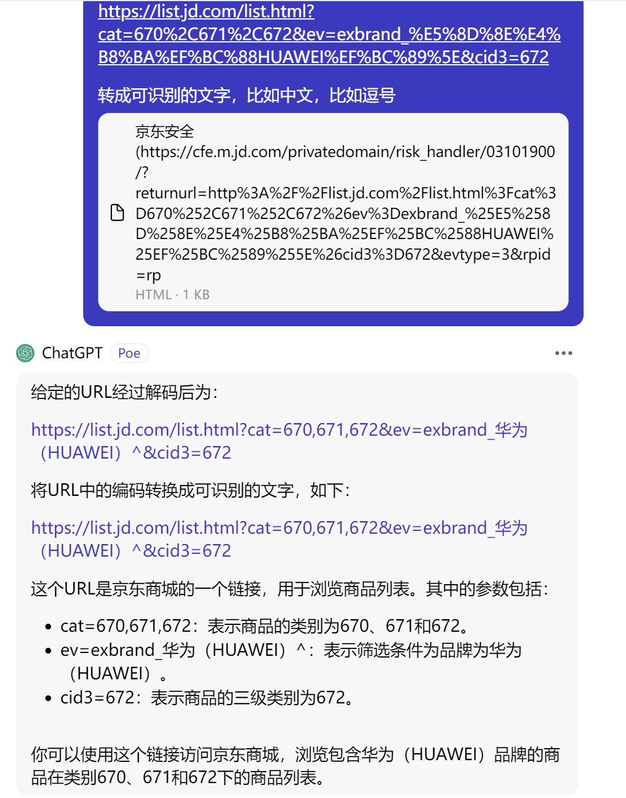

# 第3节. httpd软件工作模型


# URI

**URI: Uniform Resource Identifier 统一资源标识，分为URL和URN**

​	>	URN: Uniform Resource Naming，统一资源命名

​					示例： P2P下载使用的磁力链接是URN的一种实现 magnet:?xt=urn:btih:6605589.....890EF888666

​	>	URL: Uniform Resorce Locator，统一资源定位符，用于描述某服务器某特定资源位置。

两者区别：URN如同一个人的名称，而URL代表一个人的住址。换言之， URN定义某事物的身份，而URL提供查找该事物的方法。URN仅用于命名， 而不指定地址


额，看来URI真的很多啊，哈哈哈


其实URL使用是最多的，URI里面虽然包含了很多，但是URL是最最多的，所以通常人们提到屌丝的时候，大概也不是什么赞美，哎哎哎，通常工作中URI和URL其实是混为一谈的，不必较真。但是你自己说出来的就得是URL


# URL组成


URL格式：

```
<scheme>://<user>:<password>@<host>:<port>/<path>;<params>?<query>#<frag>
```

**scheme**:方案，访问服务器以获取资源时要使用哪种协议，比如https://，这就是scheme，ftp://也是schema，不同的scheme其实就是不同的协议，自然后面的port也就不同。
**user**:用户，某些方案访问资源时需要的用户名      # 基本不用
**password**:密码，用户对应的密码，中间用：分隔      # 基本不用
**Host**:主机，资源宿主服务器的主机名或IP地址
**port**:端口,资源宿主服务器正在监听的端口号，很多方案有默认端口号
**path**:路径,服务器资源的本地名，由一个/将其与前面的URL组件分隔
**params**:参数，指定输入的参数，参数为名/值对，多个参数，用;分隔      # 名/值对，就是在说 键值对的形式
**query**:查询，传递参数给程序，如数据库，用？分隔,多个查询用&分隔    #  这个比较常见，👇cat是类型的简写。


上图👆?cat=670,671,672实际上就是mysql的select * from goods where cat='670,671,672';


**frag**:片段,一小片或一部分资源的名字，此组件在客户端使用，用#分隔      这个是跳转，比如业内跳转到下面的内容。

​        当点击M的时候👇，就等价于在URL后面补一个#m，这就是frag片段，可用来直接跳转到下面的特定行。


---


&就是select里的and，翻译成DQL就是select * from goods where cat='670,671,672' and ev='exbrand_华为(HUAWEI)^' and cid3='672';   这里还涉及%2C就是,逗号     然后%5E好像是^脱字符，





## 网站访问量

**IP(独立IP)**：即Internet Protocol,指独立IP数。一天内来自相同客户机IP地址只 计算一次，记录远程客户机IP地址的计算机访问网站的次数，是衡量网站流量 的重要指标；

​			需要注意的是，IP不代表一个用户，一个公司可能出口就是一个IP。


**PV(访问量)**：	即Page View, 页面浏览量或点击量，用户每次刷新即被计算一 次，PV反映的是浏览某网站的页面数，PV与来访者的数量成正比，PV并不是页 面的来访者数量，而是网站被访问的页面数量;

​			PV,是页面刷新一次就算一次， 叫页面点击量，我觉的前提是你的业务不涉及自动刷新功能吧。


**UV(独立访客)**：即Unique Visitor,访问网站的一台电脑为一个访客。一天内相 同的客户端只被计算一次。可以理解成访问某网站的电脑的数量。网站判断来 访电脑的身份是通过来访电脑的cookies实现的。如果更换了IP后但不清除 cookies，再访问相同网站，该网站的统计中UV数是不变的

​			这里涉及cookies标识用户身份，按上文描述，IP就算换了，缓存还在cookies还在，用户身份不变的，这其实好理解，类似缓存一样，身份老的cookies一直在那呢，所以server还是认为同一个用户。


网站统计：http://www.alexa.cn/rank/


### 网站统计实例


### 网站访问量


# web服务请求处理步骤


## **一次完整 的http请求处理过程**


## **1、建立连接：接收或拒绝连接请求**

​			三次握手后，发http请求过去，对方收到后去判断是否为合法用户，来判断是否接收和拒绝。


## **2、接收请求：接收客户端请求报文中对某资源的一次请求的过程**

​			接收请求会有多种响应模型，统称为web I/O响应模型👇：

​				**Web访问响应模型（Web I/O）**
​					**单进程I/O模型**：启动一个进程处理用户请求，而且一次只处理一个，多个 请求被串行响应

​					**多进程I/O模型**：并行启动多个进程,每个进程响应一个连接请求

​					**复用I/O结构**：启动一个进程，同时响应N个连接请求 

​						实现方法：多线程模型和事件驱动
​								多线程模型：一个进程生成N个线程，每线程响应一个连接请求
​								事件驱动：一个进程处理N个请求

​					**复用的多进程I/O模型**：启动M个进程，每个进程响应N个连接请求，同时接 收M*N个请求

就是讲了一个服务器的进程-线程，处理单-多用户请求的情况。

前面提到的tcp连接里多个请求并发，和这里的关系就是tcp连接就是用户连接请求。


### <span id = 'jump1'>web访问响应模型</span>


**上图不好说对不对，至少apache不是(b)，apache如果用上图解释，需要将(b)改成多进程I/O结构，然后apache是使用(a)/(b)/(c)三种的，默认是(b)多进程就对了。**

(c) 就是单进程 通过"连接复用器"来对接多个连接请求，思路如下👇： 不知道这个连接复用器是否是多线程还是指的是事件驱动呢？好像是的，连接服用可能也是事件驱动的一种应用场景，什么应用场景--就是网络连接的事件驱动下产生的连接服用器这么一个效果。俺是这样理解了~

​		①这里涉及一个情况：就是一堆用户的请求连接过来，server需要从DB里调用数据资源取到后才能给到用户响应response，所以不是每个用户的请求都能够立即响应的，也不需要立刻响应的，就算该进程就为一个用户服务，也会存在 调用资源没法立即响应的情况。所以这有了连接复用器的 发挥空间。

​			同样再梳理一遍：连接复用器 也叫 连接池 ，这个pool里就接收用户发起的请求，比如来个7个用户(7剑夏天山)，但是立即需要处理的请求不是所有的用户，用户的响应，需要server去磁盘上或者db里找到对应的文件数据资源。这些资源在server找到之前，是不需要和回应用户的，此时只需要和用户保持连接(长连接)就行，你看这不就是[event MPM](#jump4)的监听线程干的活嘛。

​			比如针对某个用户的网页请求，server已经把对应的网页文件已经从磁盘上调度/加载到当前的进程里了，此时就可以回应他了。

​			所以server回应用户，涉及后端的  数据查找-网页文件合并？-加载到进程？ 大概这些步骤吧。

结合下图👇理解一下，accept函数调用后，就接收client的connect，开启一个新的socket就是一个连接，通过这个socket连接来响应用户请求，这一个连接就是上面讨论的用户请求，一个socket通常不会独享也给进程，都是多个socket通过连接复用器来共享一个进程的。


在后面讲到nginx的时候，会展开说，一个进程并发给多个用户响应，背后有一些复杂的I/O模型，涉及 阻塞、非阻塞、复用多路复用。


(d) 其实就是(c)的进一步，比如nginx，会开一个主进程，然后有几个颗CPU，就开几个子进程，然后每个子进程来讲，就是一个(c)结构。每个子进程*<u>再开多个线程</u>*\*然后为多个用户提供响应服务。

<font size=2>*再开多个线程*：*不过图中提到的都是线程，而不是进程，这一点也有不同，我猜可能是这样，niginx为例，①主进程一个②几个CPU开启几个子进程③子进程再开启多个线程，此时细化到线程才对应(c)的单线程I/0 连接复用器结构。参考https://cloud.tencent.com/developer/article/1931083*</font>


apache是(b)结构，多线程I/0结构；一个用户请求过来就开启一个线程为其响应，所以资源消耗主要是内存消耗比较大。apache并发所以上不去，虽说上不去，但传统行业基本也够用(用户量没有互联网公司的业务大一般情况)，互联网不行nginx才行。


## 3、处理请求：服务器对请求报文进行解析，并获取请求的资源及请求方法等相 关信息，根据方法，资源，首部和可选的主体部分对请求进行处理

```
元数据：请求报文首部
<method> <URL> <VERSION>
HEADERS 	格式 name:value
<request body>  
示例：
Host: www.magedu.com     请求的主机名称
Server: Apache/2.4.7

HTTP常用请求方式(方法)，Method
GET、POST、HEAD、PUT、DELETE、TRACE、OPTIONS
```


估计是这里一堆东西，不过好像一些关键字变了👇：


比如，GET 方法，然后结合URL里指明的页面，此时server就会去找这个URL所指的资源，于是进入下一步4-访问资源。


## 4、访问资源

服务器获取请求报文中请求的资源web服务器，即存放了web资源的服务器，负责向请求者提供对方请求的静态资源，或动态运行后生成的资源
**资源放置于本地文件系统特定的路径**：DocRoot     #   apache的默认路径找页面资源咯

```
DocRoot --->  /var/www/html    # 默认的页面根路径。
/var/www/html/images/logo.jpg

http://www.xxxx.com/images/logo.jpg    # images/log.jpg就是去httpd的根路径下找。
```

**web服务器资源路径映射方式：**
	①docroot
	②alias
	③虚拟主机docroot
	④用户家目录docroot


找到磁盘上的网页文件后，要构建 "响应报文" 于是进入下一步 5-构建响应报文。


**apache的documentation**入口官网竟然没了，不过可以直接进去

https://httpd.apache.org/docs/


## 5、构建响应报文：

一旦Web服务器识别出了资源，就执行请求方法中描述的动作，并返回响应 报文。响应报文中 包含有响应状态码、响应首部，如果生成了响应主体的话，还包 括响应主体

**1、响应实体**：如果事务处理产生了响应主体，就将内容放在响应报文中回送过 去。响应报文中通常包括：

​			描述了响应主体MIME类型的Content-Type首部

​			描述了响应主体长度的Content-Length

​			实际报文的主体内容


**2、URL重定向**：web服务构建的响应并非客户端请求的资源，而是资源另外一 个访问路径

永久重定向301：[http://www.360buy.com](http://www.360buy.com/)

临时重定向302/307：[http://www.taobao.com](http://www.taobao.com/)  不过这个也变成301了，需要重新找一个

https://blog.csdn.net/idwtwt/article/details/90692773    👈这个有时间再研究吧，不研究也行，知道有这个回事就行。


**3、MIME类型**：

Web服务器要负责确定响应主体的MIME类型。多种配置服务器的方法可将MIME类型与资源管理起来：

​		魔法分类：	Apache web服务器可以扫描每个资源的内容，并将其与一个已知模 式表(被称为魔法文件)进行匹配，以决定每个文件的MIME类型。这样做可能比较 慢，但很方便，尤其是文件没有标准扩展名时

​		显式分类：	可以对Web服务器进行配置，使其不考虑文件的扩展名或内容，强 制特定文件或目录内容拥有某个MIME类型

​		类型协商：	有些Web服务器经过配置，可以以多种文档格式来存储资源。在这 种情况下，可以配置Web服务器，使其可以通过与用户的协商来决定使用哪种格 式(及相关的MIME类型)"最好"

​	看不懂，没关系，GPT来帮你👇其实就是上文的表达方式不太通俗易懂。


“当我们访问一个网页或下载一个文件时”   有个好的开头就能让你 立刻理解整段中心思想


## 6、发送响应报文

Web服务器通过连接发送数据时也会面临与接收数据一样的问题。服务器可能有很多条到各个客户端的连接，有些是空闲的，有些在向服务器发送数据，还有一些在向客户端回送响应数据。服务器要记录连接的状态，还要特别注意对持久连接的处理。

​	对非持久连接而言，服务器应该在发送了整条报文之后，关闭自己这 一端的连接。

​	对持久连接来说，连接可能仍保持打开状态，在这种情况下，服务器 要正确地计算Content-Length首部，不然客户端就无法知道响应什么时候结束了


## 7、记录日志

最后，当事务结束时，Web服务器会在日志文件中添加一个条目，来描述已执行的事务。针对这些日志分析，有可能帮助你进一步了解用户画像，从而更好的规划网站内容，啥不理解？打个比方，如果网站内容都是卖货的，就分析日志多多进好卖的商品呗。


http的7个处理过程弄完，下面看看I/O方面的情况，用户的访问其实涉及很多I/O：磁盘I/O、网络I/O、内核和进程之间的交换。


图中👆是涉及浏览器、服务器和硬盘、网口、内核、socket buffer这是网络缓冲区就在内核中、http应用程序的各方I/O和数据交换。

1、用户的浏览器打开一个网页的请求

2、请求的数据包发送到了服务器的接口，就放入接口缓冲

3、然后 内核就从接口缓冲区里拿到数据，放到内核的网络缓冲区(socket buffer)里。

4、然后进一将请求数据交给应用程序httpd这个服务。

5、httpd软件查看请求，一看是个GET方法用户要得到index.html文件

6、由于用户的进程是无法直接访问磁盘的，所以httpd软件发送一个指令给内核(要知道软件本身也不能直接访问磁盘，都是通过内核去间接打交道的)

7、内核收到指令后内核通过DMA--直接内存和磁盘的交互，这里参见


内核就通过DMA直接把磁盘的index.html文件读入到内存中的内核缓冲区？然后再把index.html文件复制到http进程的内存空间里。

​    得到这个文件后，还得在外层封装响应头部，再发送给内核的buffer缓冲区--socketbuffer。

​	再发给网卡缓冲区，再发给用户的浏览器，

​	再记录日志。


# HTTP服务器应用

**http服务器程序**
		httpd    <--- apache
		nginx
		lighttpd

**应用程序服务器**

​		IIS	.asp
​		tomcat	.jsp
​		jetty	开源的servlet容器，基于Java的web容器 
​		Resin	CAUCHO公司，支持servlets和jsp的引擎
​		webshpere(IBM), weblogic(BEA), jboss,oc4j(Oracle)

**市场占有率统计**
		www.netcraft.com

https://www.netcraft.com/resources/?type=blog    # 以前在news现在放到blog路径里了。

https://www.netcraft.com/blog/august-2023-web-server-survey/


nginx不仅仅可以做web服务器，还可以做强大的反向代理。

apache只能作为web服务器。


# HTTPD介绍

**httpd**

​		20世纪90年代初，国家超级计算机应用中心NCSA开发

​		1995年开源社区发布apache（a patchy server）   # 补丁服务器，我国也有一个补丁墙-三个佛，哈哈~ 都很牛逼~

​				ASF: apache software foundation

​				FSF：Free Software Foundation

**特性**

​		高度模块化：core + modules    # 核心+模块，都是这样的，包括linux(内核+各种模块)

​		DSO：Dynamic Shared Object 动态加/卸载    #  这些模块 安装/卸载 比较灵活，灵活个屁，据说是编译的时候加进去的。

​		MPM：multi-processing module多路处理模块     # <span id='jump2'>这里排版空间不够写道下面去👇</span>[下文内容](#jump3)


APACHE不仅仅是HTTPD咯，点开See All Projects可见N多ASF旗下的开源软件。


往下翻，可见tomcat也是他家的，一切都是从apache开始的。

kafka也是，牛逼

hadoop、HBase 也是~ 这些都是大数据里的东西


大数据运维这个岗位，和正常linux应用运维不一样，大数据有开发、运维两个方向。

大数据运维可能就涉及HBase，hadoop的搭建？都是一些专业大数据分析相关的软件维护了吧。


​	<span id="jump3">上接前文</span>[跳到前文](#jump2)，MPM：multi-processing module多路处理模块     # 这个和前面的web访问响应模型很像啊[跳转前文](#jump1)


### MPM工作模式


**prefork：**多进程I/O模型，每个进程响应一个请求，默认模型

​		一个主进程：生成和回收n个子进程，创建套接字，不响应请求

​		多个子进程：工作work进程，每个子进程处理一个请求；系统初始时，预先生成多个空闲进程，等待请求，最大不超过1024个


**worker：**复用的多进程I/O模型,多进程多线程，IIS使用此模型

​		一个主进程：生成m个子进程，每个子进程负责生个n个线程，每个线程响应一个请求，并发响应请求：m*n


**event：**事件驱动模型（worker模型的变种）  这个图中没有唉。

一个主进程：生成m个子进程，每个子进程负责生个n个线程，每个线程响应一个请求，并发响应请求：m*n，有专门的监控线程来管理这些keep-alive类型的线程，当有真实请求时， 将请求传递给服务线程，执行完毕后，又允许释放。这样增强了高并发场景下的 请求处理能力

</font>

​			httpd-2.2：event 测试版，centos6默认

​			httpd-2.4：event 稳定版，centos7默认，现在马上都用rocky-linux9这一类的linux，httpd早就默认yum下来就是2.4了。

https://cloud.tencent.com/developer/article/1931083

https://httpd.apache.org/docs/2.4/zh-cn/mpm.html  # 看原版算了


进一步看图

### prefork MPM，pre fork就是预先开好fork子进程得意思


注意，这个模式下，一个子进程里只会开一个线程，所以一般就说一个进程服务一个用户请求了。

**Prefork MPM:** 预派生模式，有一个主控制进程，然后生成多个子进程，使用 select模型，最大并发1024，每个子进程有一个独立的线程响应用户请求，相 对比较占用内存，但是比较稳定，可以设置最大和最小进程数，是最古老的一 种模式，也是最稳定的模式，适用于访问量不是很大的场景。

**优点**：稳定

**缺点**：慢，占用资源，不适用于高并发场景


### worker MPM


**worker MPM**：是一种多进程和多线程混合的模型，有一个控制进程，启动多 个子进程，每个子进程里面包含固定的线程，使用线程程来处理请求，当线程 不够使用的时候会再启动一个新的子进程，然后在进程里面再启动线程处理请求，由于其使用了线程处理请求，因此可以承受更高的并发。

**优点**：相比prefork 占用的内存较少，可以同时处理更多的请求

**缺点**：使用keep-alive的长连接方式，某个线程会一直被占据，即使没有传输 数据，也需要一直等待到超时才会被释放。如果过多的线程，被这样占据，也 会导致在高并发场景下的无服务线程可用。（该问题在prefork模式下，同样会 发生）


### event MPM，在worker PMP基础上多了回收线程机制，我估计就是前文提到的"事件驱动"


不过上图PPT是将事件驱动放到 复用I/O结构里，实际上复用多进程I/O结构里也会有事件驱动，其实apache的event MPM就是在复用的多进程I/O模型基础上又加了事件驱动模型，


我认为  所谓的 连接复用器，其实就是  事件驱动模型。


**event MPM**：Apache中最新的模式，属于事件驱动模型(epoll)，每个进程响应多个 请求，在现在版本里的已经是稳定可用的模式。它和worker模式很像，最大的区别在 于，它解决了keep-alive场景下，长期被占用的线程的资源浪费问题（某些线程因为被 keep-alive，空挂在哪里等待，中间几乎没有请求过来，甚至等到超时）。event MPM中，会有一个专门的线程来管理这些keep-alive类型的线程，当有真实请求过来 的时候，将请求传递给服务线程，执行完毕后，又允许它释放。这样增强了高并发场景 下的请求处理能力

**event**只在有数据发送的时候才开始建立连接，连接请求才会触发工作线程，即使用了 TCP的一个选项，叫做延迟接受连接TCP_DEFER_ACCEPT，加了这个选项后，若客户 端只进行TCP连接，不发送请求，则不会触发Accept操作，也就不会触发工作线程去 干活，进行了简单的防攻击（TCP连接）

**优点**：单线程响应多请求，占据更少的内存，高并发下表现更优秀，会有一个专门的线 程来管理keep-alive类型的线程，当有真实请求过来的时候，将请求传递给服务线程， 执行完毕后，又允许它释放

**缺点**：没有线程安全控制


上图👆没有提到，前文说的，client请求过来，server从后台捞出数据/文件之前的一个不响应处理，只是维持连接，我觉得可以把这个动作逻辑加到上图的 请求1过来，交给工作线程A处理，但是捞出数据/文件之前，都不会响应，此时这个工作线程A可能去干别的事也是有可能的，期间该线程A向内核发起数据查询后，就将连接交给监听线程，然后等内核通过DMA拿到数据/文件后放入内核缓冲，此时线程A才会重新从监听线程接管之前的连接，将HTTP响应回给用户。<span id="jump4">event也好，连接复用器也罢，其实正式有了监听线程，才有了单线程多路复用的可能，所以这个监听线程和工作线程之间的协同合作就是连接复用器，就是event MPM机制</span>

​      补充一下：线程的一个释放和阻塞问题，涉及①工作线程处理完请求后就会释放线程②处理着请求呢，等待DMA将数据调入缓冲呢此时 是否不是阻塞，是否也存在该线程干别的工作去了，这个调度是否也是内核还是event MPM机制调度的呢？然后③就是空请求不会分配线程；以上就是的事件调度机制event可以做到高并发。   **本质上还是  时分复用+用完立马释放+和空请求不分配 这么一套优化动作**。

​		其实你要说学技术有什么用，学这么细有什么用，反正配置文件一个单词就搞定了。你要知道，上面这套东西是人家apache自身的处理逻辑，当你不用apache的时候就没有这套逻辑了，你自己开发的脚本、软件，如果面对这些场景的时候，此时就有处理思路，这就是学习的本质！对吧，无非是内核函数的调用，线程的分配，连接的维持，这些拆分开来，确实可以想象代码模块可能没有我们想象的那么难，特别是写C的那帮吊人，吊人在这里是羡慕嫉妒恨的意思，想当初C就上课听考试还能70，现在啥都不会了。

其实，别人问你apache的三个MPM多路处理机制，你可以两句话搞定他咯

①http2.2之前默认是预fork，开启子进程，单一线程，资源占用大，内存消耗高；

②http2.4之后默认是事件模型，子进程里有监听线程和工作线程，监听 负责分配任务给工作线程和绑工作线程维护与客户的连接；工作线程就拼命干活。

③此时你可以反问，工作线程如果从监听线程接手了一个请求，该请求需要从本地捞取的数据文件量大，此时I/O处理时间长，你反问：工作线程是阻塞态还是干别的活，如果是干别的活去了，这个调度机制是系统内核本身的行为还是apache event事件机制实现的。


所以说apache高并发不行，顶多C10K( connect 10 000，1w的连接)，其实可能是停留在老的版本也就是prefork这个机制上的，我严重这样认为，所以高并发apache也能支持的。


只不过niginx的牛B之处，估计在于 人家支持复杂的反向代理，L4的也OK，所以这就集成了F5和WEB SERVER的功能，你说谁还用apache呢，所以不要用并发去踩人家apache，而要准确的认知。


至于你说结果对了就行，那就没有推导能力咯，用错误的论据得到正确的结论，下次呢？


然后这里提一个点应用上的：为什么传统公司用apache的prefork，因为event MPM存在一个问题就是，如果一个子进程里的某个工作线程 DOWN了，那么可能会导致整个子进程都DOWN了--影响同一个子进程下的其他线程。    那个，我怎么感觉不一定呢，对吧，哦某个工作线程吊死占用大量资源？也许吧。  所以大家的共识是：追求稳定性用prefork，呵呵，整个共识也许是不对的，早些年的共识吧，这里表示怀疑。


然后APACHE MPM其实最终还是要读官方的

https://httpd.apache.org/docs/2.4/zh-cn/mpm.html

举个例子


默认机制其实很多的👆，不是PPT上仅仅的三种就完事了。
