# 第4节. httpd2


# apache的文件æ„æˆäº†è§£


## rockylinux9上apacheç›´æ¥yum安装的版本


安装httpd软件时的ä¾èµ–

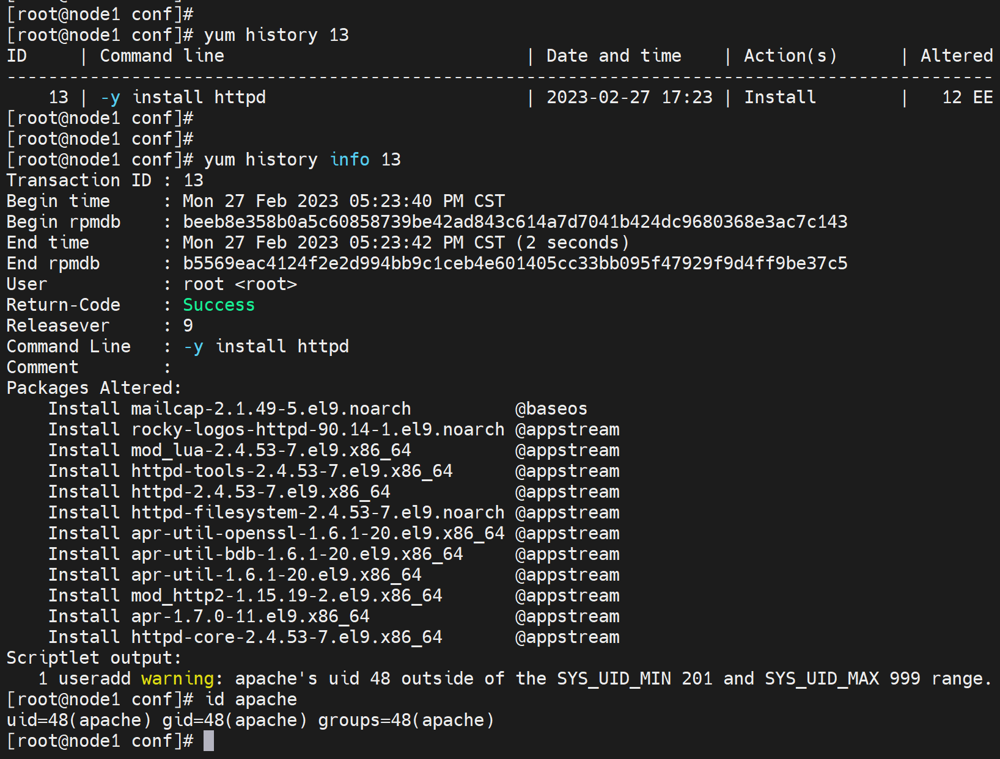

其中é‡è¦æ–‡ä»¶ï¼Œæ¯”如conf文件都在httpd-core-xxx这个软件包里。


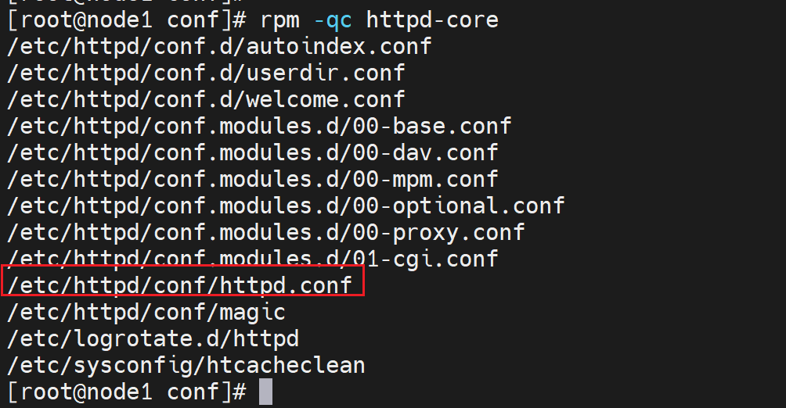


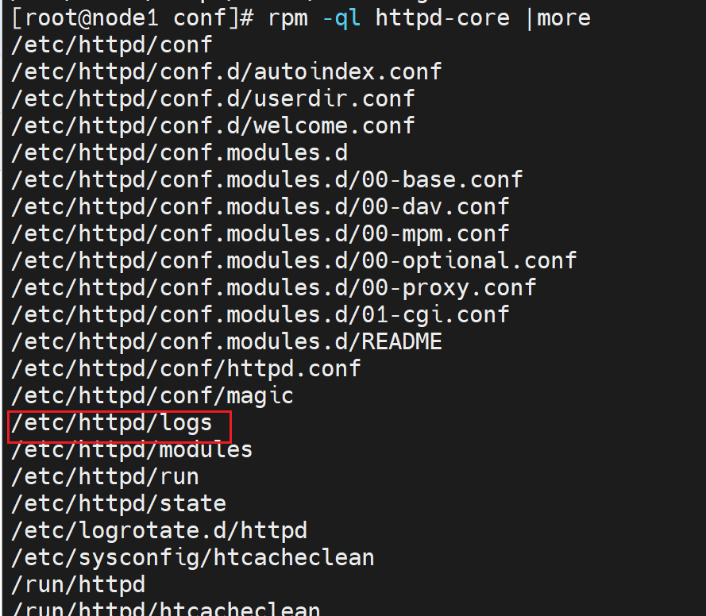


## /etc/httpd  就是apache软件的工作总目录


æœåŠ¡service文件就ä¸åœ¨httpd-core-xxx这个包里了，而是在httpd.x86_64这个里


## å…³äºmodules

**â‘ /etc/httpd/modules 模å—目录**   conf.modules.d这个一看就是confé…置文件的模æ¿ä¸æ˜¯è¿™é‡Œè¦æ¢³ç†çš„/etc/httpd/modules这个模å—

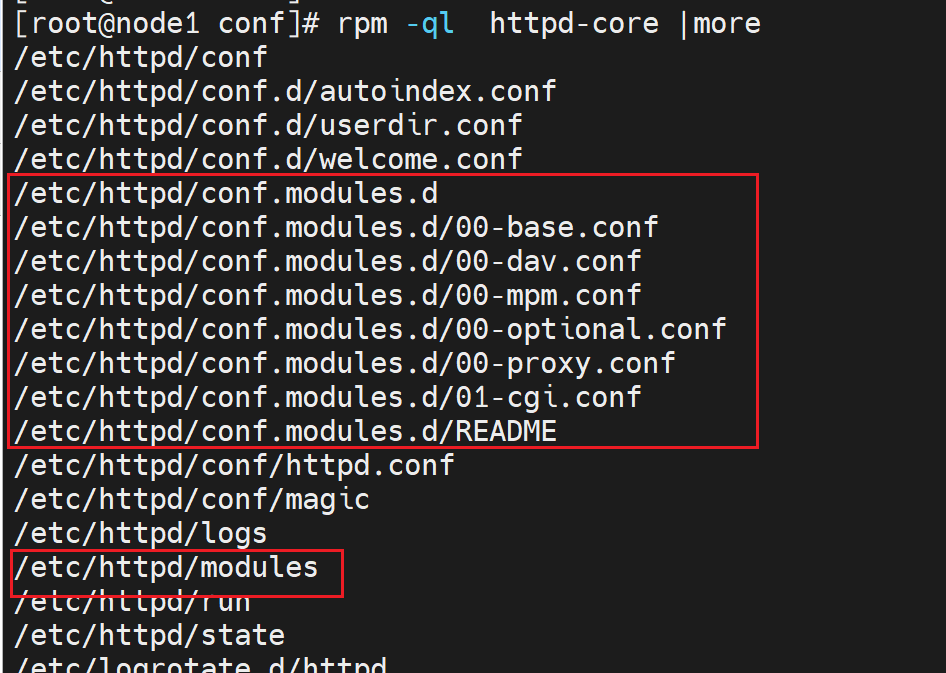

还有**/usr/lib64/httpd/modules/**这个 模å—


å…¶å®æ˜¯ä¸€æ ·çš„


/etc/httpd/modulesæ—¶/usr/lib64/httpd/modules的软è¿æ¥ã€‚


/etc/httpd是作为apache的总目录，åé¢ä¸€äº›é…置上，都以这个目录为相对路径的。é…置上直æ¥å†™çš„就是相对路径，而相对的就是这个目录。


mod_auth_basic.so模å—的作用：用æ¥éªŒè¯ç”¨æˆ·å密ç çš„一个基本功能；一般æ¥è®²ç”¨æˆ·ç™»å…¥POSTæ交用户密ç ï¼Œå¯¹æ¯”DB里的记录，一致则验è¯é€šè¿‡ï¼Œè€Œè¿™ä¸€å¥—东西涉åŠè½¯ä»¶å¼€å‘的过程(...这就涉åŠè½¯ä»¶å¼€å‘了？ä¸å°±æ˜¯POST对比DB库嘛，先估且认åŒè¿™ä¸ªè§‚点å§ï¼Œä¼°è®¡æ˜¯æ¶‰åŠDBå’ŒPOST处ç†å§ï¼Œæ­£å¸¸django好åƒæŒºç®€å•çš„处ç†è¿™å—)。而mod_auth_basic.so这个模å—å°±å¯ä»¥å¯¹æŸä¸€ä¸ªç½‘ç«™åšåŸºæœ¬çš„用户å密ç è®¤è¯ã€‚


apachectl å¯ç”¨å…³é—­çš„二进制程åºï¼Œä¸è¿‡ä¸€èˆ¬ç”¨systemctl start httpd。

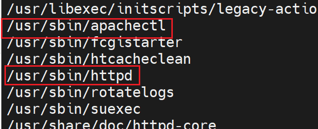

/usr/sbin/httpd是apache的主进程，systemctl start httpdå¯åŠ¨çš„就是这个。

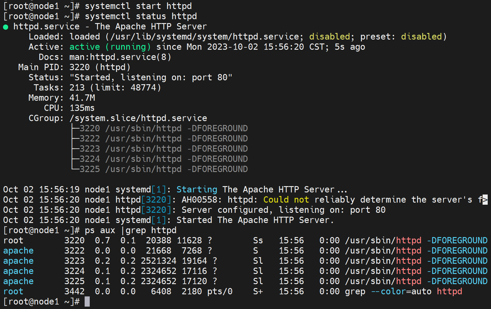

然åapachectl 这个cli也看下效æœğŸ‘‡

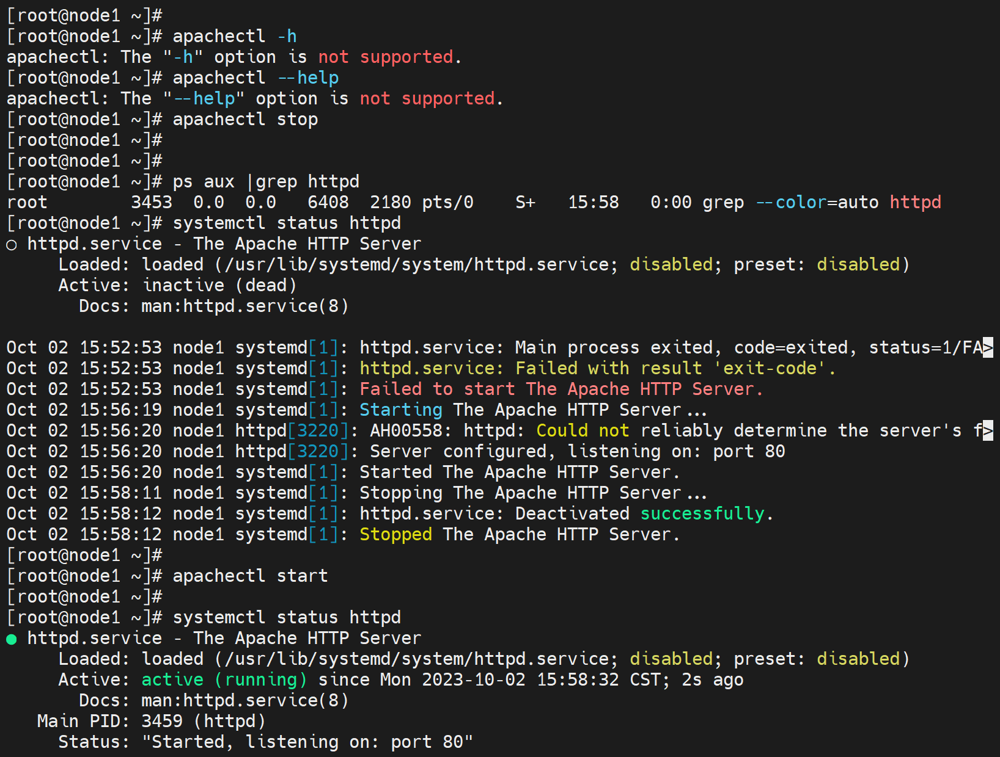


## 然å/var/www这个耳熟能详的目录

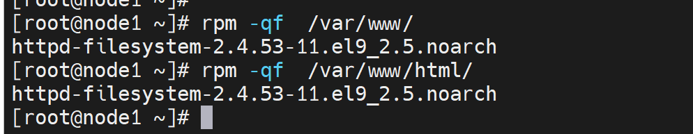

是在httpd-filesystem-2.4xxxx这个包里了，


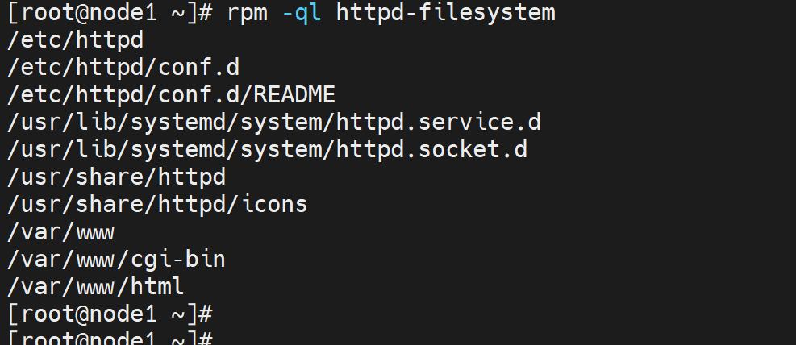


## 


刚安装好的httpdçš„é…置检测看看


Syntax OK，语法OK，然åæ示消æ¯è¯´çš„是FQDN的事情，没啥åé¢ä¼šé…置。


è·Ÿpptp，l2tpçš„æœåŠ¡ä¸€æ ·ï¼ŒvpnæœåŠ¡è·‘èµ·æ¥é’ˆå¯¹é’ˆå¯¹æŸä¸ªç”¨æˆ·è¸¢ä¸‹çº¿ï¼Œå°±å¯ä»¥æ‰¾åˆ°ç”¨æˆ·æ‹¨å…¥æ¥å£çš„进程PIDï¼›


我的æ„æ€å°±æ˜¯é’ˆå¯¹è¿›ç¨‹çš„ID，通常æœåŠ¡è½¯ä»¶ä»¬ä¼šè‡ªå·±åŠ¨æ€ç”Ÿæˆxxx.pid文件æ¥ä¿å­˜çš„，ä¸ç„¶ps aux å»çœ‹å¯èƒ½æœ‰å¾ˆå¤šä¸å¥½åŒºåˆ†--就比如上图的ppp0ã€ppp1如æœè¿™äº›å¾ˆå¤šï¼Œps aux |grep ppp 也ä¸çŸ¥é“哪个æ¥å£æ—¶å“ªä¸ªè¿›ç¨‹çš„。


# httpdçš„é…ç½®

```
[root@node1 ~]# cat /etc/httpd/conf/httpd.conf  |grep -Ev '^ *#'

ServerRoot "/etc/httpd"    # 这就是根，所有的é…置目录的相对路径都是相对这个目录的

Listen 80

Include conf.modules.d/*.conf  # 包å«çš„辅助é…置文件，这里就是相对路径了，/etc/httpd/conf.modules.d/了。

User apache
Group apache


ServerAdmin root@localhost


<Directory />
    AllowOverride none
    Require all denied
</Directory>


DocumentRoot "/var/www/html"

<Directory "/var/www">
    AllowOverride None
    Require all granted
</Directory>

<Directory "/var/www/html">
    Options Indexes FollowSymLinks

    AllowOverride None

    Require all granted
</Directory>

<IfModule dir_module>
    DirectoryIndex index.html
</IfModule>

<Files ".ht*">
    Require all denied
</Files>

ErrorLog "logs/error_log"

LogLevel warn

<IfModule log_config_module>
    LogFormat "%h %l %u %t \"%r\" %>s %b \"%{Referer}i\" \"%{User-Agent}i\"" combined
    LogFormat "%h %l %u %t \"%r\" %>s %b" common

    <IfModule logio_module>
      LogFormat "%h %l %u %t \"%r\" %>s %b \"%{Referer}i\" \"%{User-Agent}i\" %I %O" combinedio
    </IfModule>


    CustomLog "logs/access_log" combined
</IfModule>

<IfModule alias_module>


    ScriptAlias /cgi-bin/ "/var/www/cgi-bin/"

</IfModule>

<Directory "/var/www/cgi-bin">
    AllowOverride None
    Options None
    Require all granted
</Directory>

<IfModule mime_module>
    TypesConfig /etc/mime.types

    AddType application/x-compress .Z
    AddType application/x-gzip .gz .tgz


    AddType text/html .shtml
    AddOutputFilter INCLUDES .shtml
</IfModule>

AddDefaultCharset UTF-8

<IfModule mime_magic_module>
    MIMEMagicFile conf/magic
</IfModule>


EnableSendfile on

IncludeOptional conf.d/*.conf    # ç”±äºå½“å‰æ–‡ä»¶ä¹Ÿå°±æ˜¯/etc/httpd/conf/httpd.conf里的东西太多，所以建议åé¢çš„é…置都放到conf.d/下é¢ã€‚

```

ä¸ç®¡æ€ä¹ˆè¯´å…ˆå¤‡ä»½è¿™ä¸ªä¸»é…置文件


## HTTPD常è§é…ç½®


**httpdé…置文件的组æˆï¼š**

**主è¦ç»„æˆ**

​	Global Environment

​	Main server configuration virtual host

**é…置格å¼ï¼šdirective value **     # 指令 值得格å¼ï¼Œç±»ä¼¼å­—典得键值对。

 	Directive  ä¸åŒºåˆ†å­—符大å°å†™
 	
 	Value 为路径时，是å¦åŒºåˆ†å¤§å°å†™ï¼Œå–决äºæ–‡ä»¶ç³»ç»Ÿ

**官方帮助**

​	http://httpd.apache.org/docs/2.4/


é…置的格å¼éƒ½æ˜¯ç±»ä¼¼key valueçš„æ–¹å¼


### **listen**的写法


IP-address ä¸å†™å°±æ˜¯ç»‘定所有IP。

IP地å€æœ¬åœ°ä¸å­˜åœ¨ï¼Œhttpd都ä¸ä¼šè®©ä½ èµ·æ¥

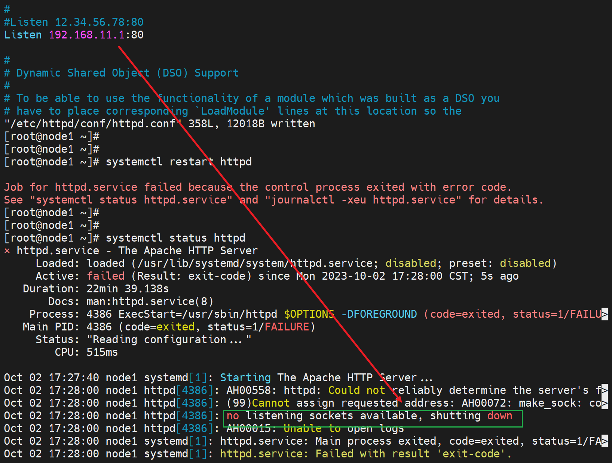


修改监å¬ç«¯å£éœ€è¦é‡å¯æœåŠ¡çš„，reloadä¸è¡ŒğŸ‘‡

ä¸æ˜¯æ‰€æœ‰çš„é…置都能reload，进而无需é‡å¯æœåŠ¡ï¼Œ


å°†æ¥å°±å¯ä»¥åšä¸¤ä¸ªç½‘站，一个80，一个8080。å¯ä»¥ä½¿ç”¨è™šæ‹Ÿä¸»æœºæŠ€æœ¯ã€‚是VPS嘛？感觉ä¸æ˜¯..


### ServerTokens


👇下图å¯è§server字段就暴露了apache的版本和æ“作系统。


使用curl看头部信æ¯


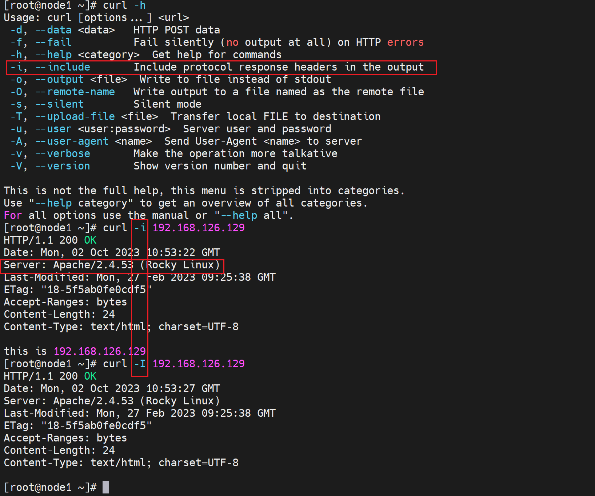

①好åƒ-iå’Œ-I一样，忽略大å°å†™äº†ï¼›å…¶å®ä¸å¯¹çš„，-I 是大写，看下图案例

②就是curl -iå¯ä»¥æŸ¥çœ‹head头部信æ¯ã€‚其中就有server字段显示你的apache版本和æ“作系统。


我把/var/www/html/index.html  æ‹¿æ‰--就该改æˆxxx

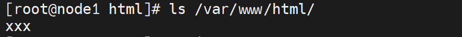

然å呢就有两个ç°è±¡ï¼Œâ‘  -iå’Œ-Iä¸åŒ  â‘¡403报错


然å403页é¢æŠ¥é”™ï¼Œæ˜¯**页é¢ä¸å­˜**的一个报错，了解下👇，当然也å¯èƒ½æ˜¯**页é¢æ–‡ä»¶æ²¡æœ‰è®¿é—®æƒé™**。这里就是index.html没有创建导致的报错403。


还有一个点，就是如æœä½ ä¿®æ”¹äº†index.html的默认ä½ç½®--/var/www/html/index.html，那么修改å的路径也è¦è®©apache这个id有至少读的æƒé™å§ã€‚


修改index.html文件无需é‡å¯æœåŠ¡ï¼Œåˆ·æ–°é¡µé¢å°±è¡Œäº†


å›åˆ°serverToken的内容，ServerToken就是用æ¥æ©ç›–真å®çš„server字段信æ¯çš„。

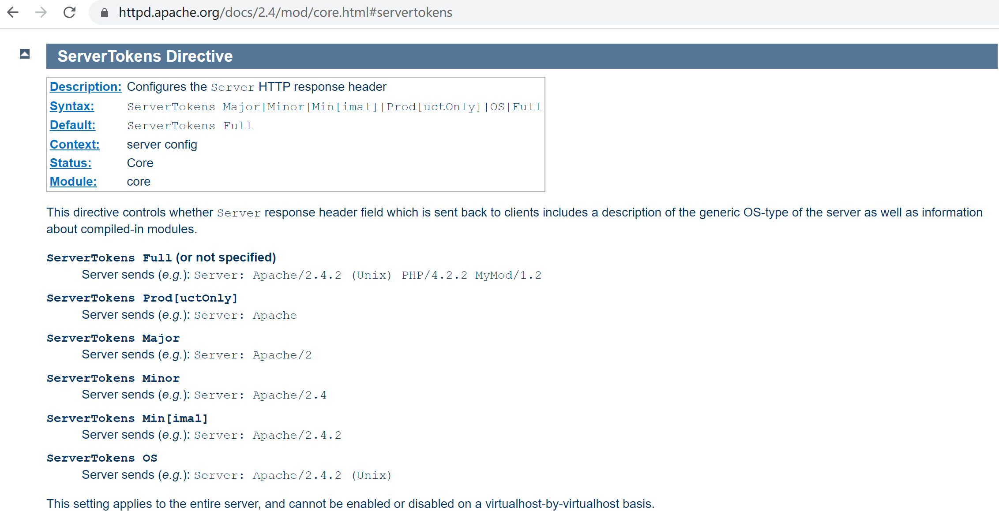


æ ¹æ®å‚数说æ˜ï¼Œå¯çŸ¥httpd默认用的full，就是把信æ¯æ˜¾ç¤ºå…¨äº†ï¼Œç„¶åé€éœ²ä¿¡æ¯æœ€å°‘的是Prod[uctOnly]，方括å·æ˜¯å¯ä»¥çœç•¥çš„æ„æ€ï¼Œlinux通用写法。

å…¶å®prod暴露的信æ¯ä¹Ÿæ²¡å¿…è¦ï¼Œæœ€å¥½å•¥éƒ½ä¸æš´éœ²ï¼Œè¿™å°±ä¸æ˜¯httpd自带的功能了--或者æºç ä¿®æ”¹è¿™äº›ä¿¡æ¯(字符串Apacheæœä¸€æœæ”¹ä¸€æ”¹å°±è¡Œäº†)然å编译安装；如æœä¸æ”¹æºç ï¼Œå°±éœ€è¦å‰ç«¯é€šè¿‡è°ƒåº¦å™¨æ¥è¿‡æ»¤æ‰ã€‚


### 修改é…置文件æ¨èä¸è¦åŠ¨/etc/httpd/conf/httpd.conf这个主é…置文件

æ¢å¤ä¸€ä¸‹ä¹‹å‰çš„listen的修改

 

/etc/httpd/conf.d/下新建test.conf，编辑所需指令和值

 


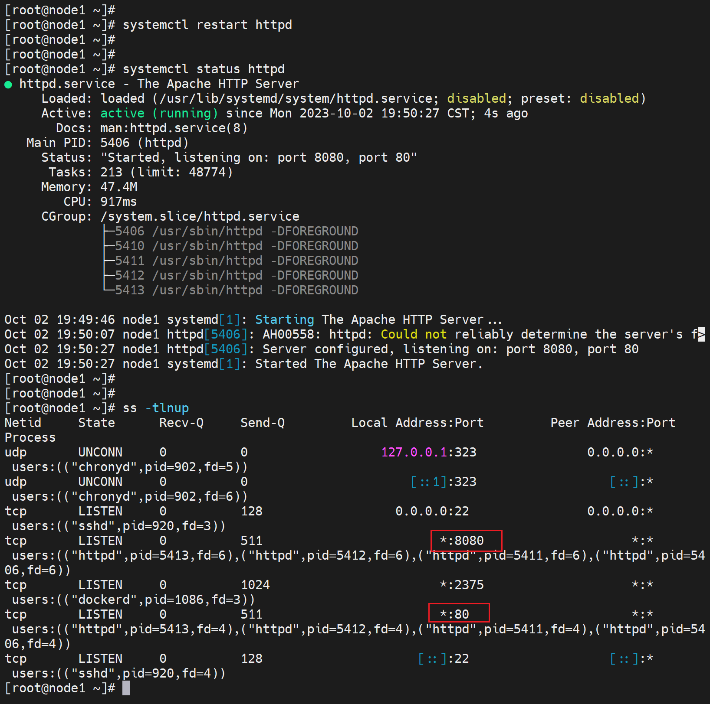


å†è¡¥ä¸€ä¸ªservertokens


需è¦é‡å¯æœåŠ¡çš„


👆这张图就看清楚了-iå’Œ-I的区别，-i就是include包å«å¤´éƒ¨å’Œé¡µé¢å†…容。-I就是仅仅头部。

然åservertokenså¯è§ï¼Œå·²ç»ç”Ÿæ•ˆäº†ï¼Œåªæœ‰Apache这个简略信æ¯äº†ã€‚


### æŒä¹…è¿æ¥

**Persistent Connection**：è¿æ¥å»ºç«‹ï¼Œæ¯ä¸ªèµ„æºè·å–完æˆåä¸ä¼šæ–­å¼€è¿ æ¥ï¼Œè€Œæ˜¯ç»§ç»­ç­‰å¾…其它的请求完æˆï¼Œé»˜è®¤å…³é—­æŒä¹…è¿æ¥

**æ–­å¼€æ¡ä»¶**：时间é™åˆ¶ï¼šä»¥ç§’为å•ä½ï¼Œ 默认5s，httpd-2.4 支æŒæ¯«ç§’级 

**副作用**：对并å‘访问é‡å¤§çš„æœåŠ¡å™¨ï¼ŒæŒä¹…è¿æ¥ä¼šä½¿æœ‰äº›è¯·æ±‚å¾—ä¸åˆ°å“应 

**折衷**：使用较短的æŒä¹…è¿æ¥æ—¶é—´

**设置**：KeepAlive On|Off 

​			KeepAliveTimeout 15

**测试**：telnet WEB_SERVER_IP PORT

​			GET /URL HTTP/1.1 

​			Host: WEB_SERVER_IP


å‰é¢çš„章节讲过http1.1版本默认就支æŒpersistent connection的👇

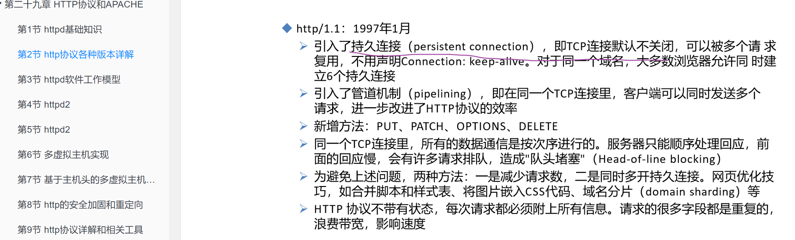 


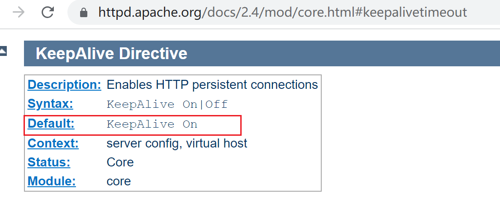

官方说是默认开å¯çš„，当然2.4版本的http的，自然也是http1.1å议。

如æœçŸ¥é“是å¦å¼€å¯äº†"æŒä¹…è¿æ¥"--通过telnet 80然åGETæ–¹å¼è¿›è¡Œæµ‹è¯•æŒä¹…è¿æ¥

â‘ æŒä¹…è¿æ¥å°±æ˜¯ä¸€ä¸ªtcpè¿æ¥é‡Œï¼Œå¯ä»¥å¤„ç†å¤šä¸ªç”¨æˆ·è¯·æ±‚

②测试方法：

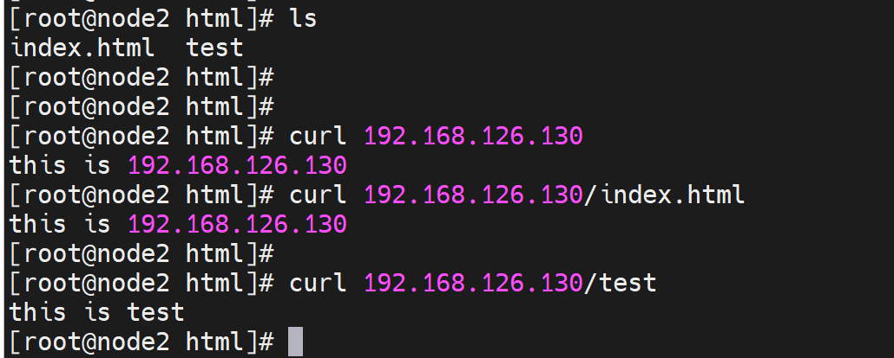


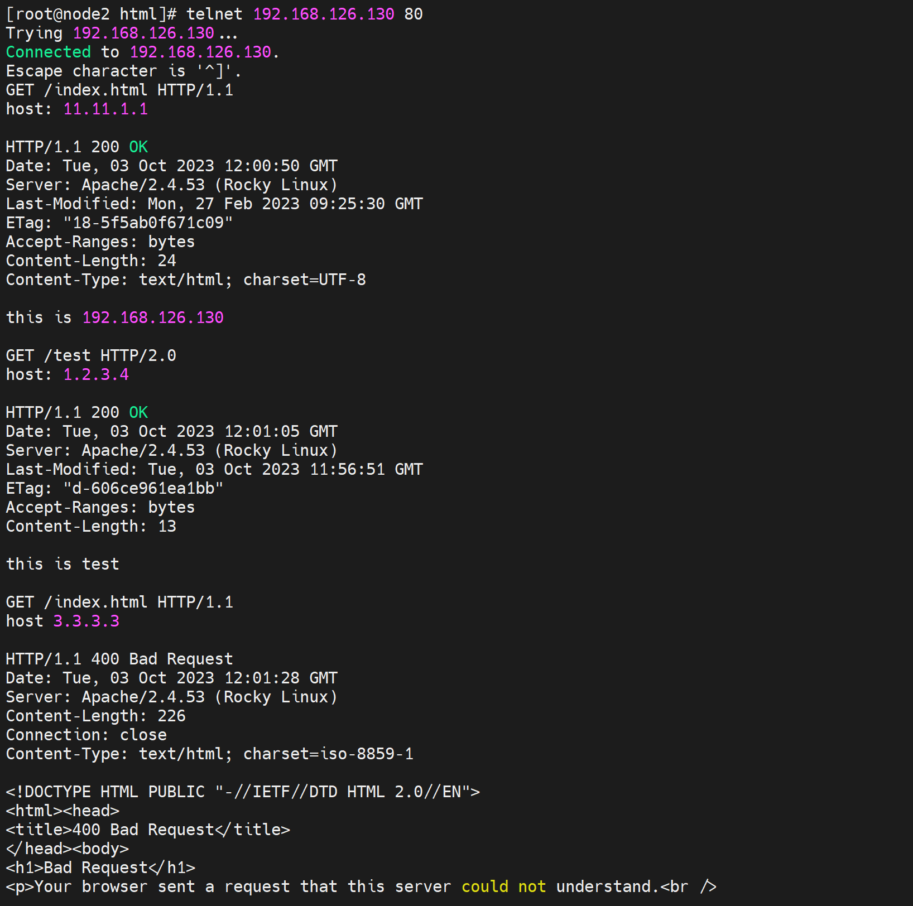

上图👆就是用telnetå¼€å¯äº†80的端å£TCPè¿æ¥--算是一个长è¿æ¥ï¼Œç„¶å这里有keepalive timeout的超时(默认是seconds秒为å•ä½ï¼Œä¹Ÿæ”¯æŒms毫秒)。


这是👆KeepAliveTimeout Directiveçš„å‚数解释，这里è¦æ³¨æ„默认是5秒钟，然å5秒钟的超时表ç°åœ¨ä»€ä¹ˆç‚¹ä¸Šå‘¢ï¼Œå°±æ˜¯ä½ è¾“å…¥host 3.3.3.3 å›è½¦å‘é€äº†ä¸ªGETrequest出å»å，开始计时的，也就是wait for a subsequtent request befor closing the conn。æ€ä¸€ä¸ªsubsequent了得~éšå的，所以两个请求之间超时时间就是keepAliveTimeout。


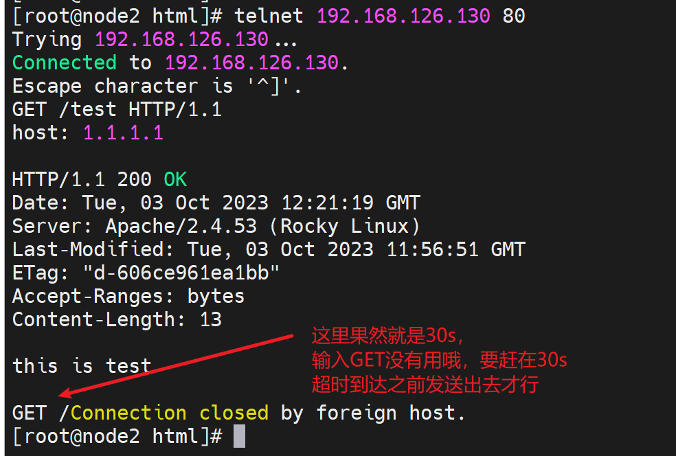

除了这个keepalivetimeout，还有一个å‚数设置是 æŒä¹…è¿æ¥é‡Œ 资æºä¸‹è½½æ¬¡æ•°(getå…¶å®å°±æ˜¯ä¸‹è½½é¡µé¢äº†) 到了也å¯ä»¥æ–­å¼€ã€‚通过poe.com问一下就找到了

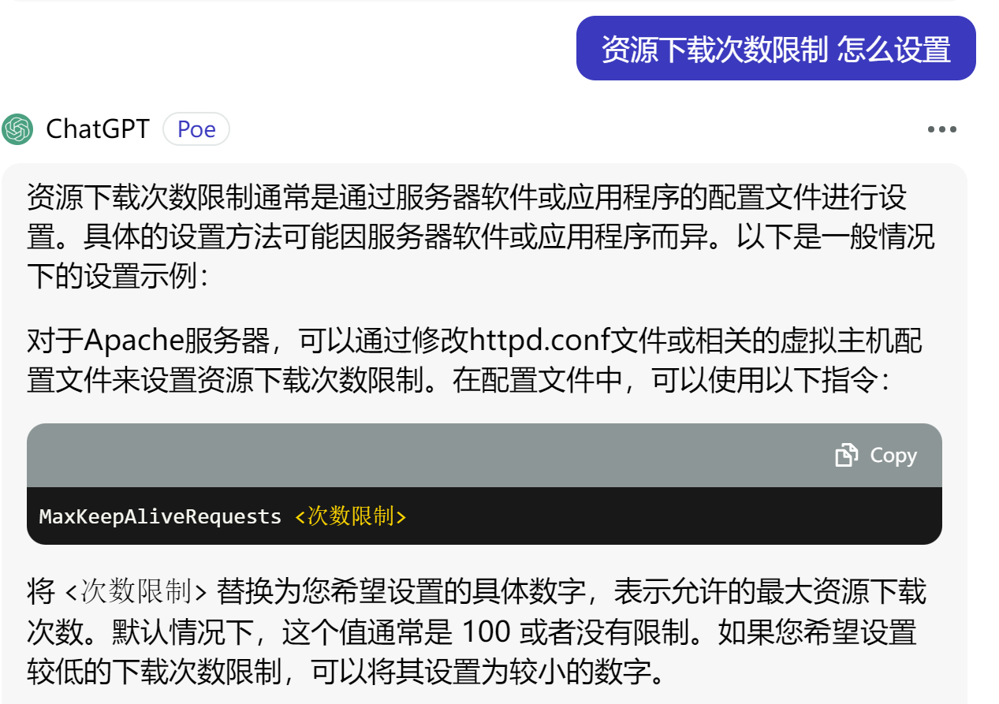


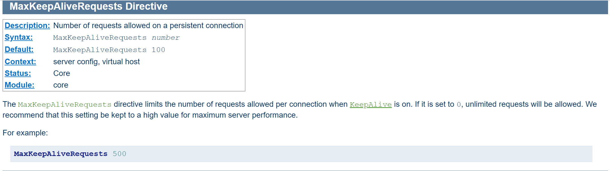

测试下👇


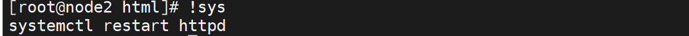

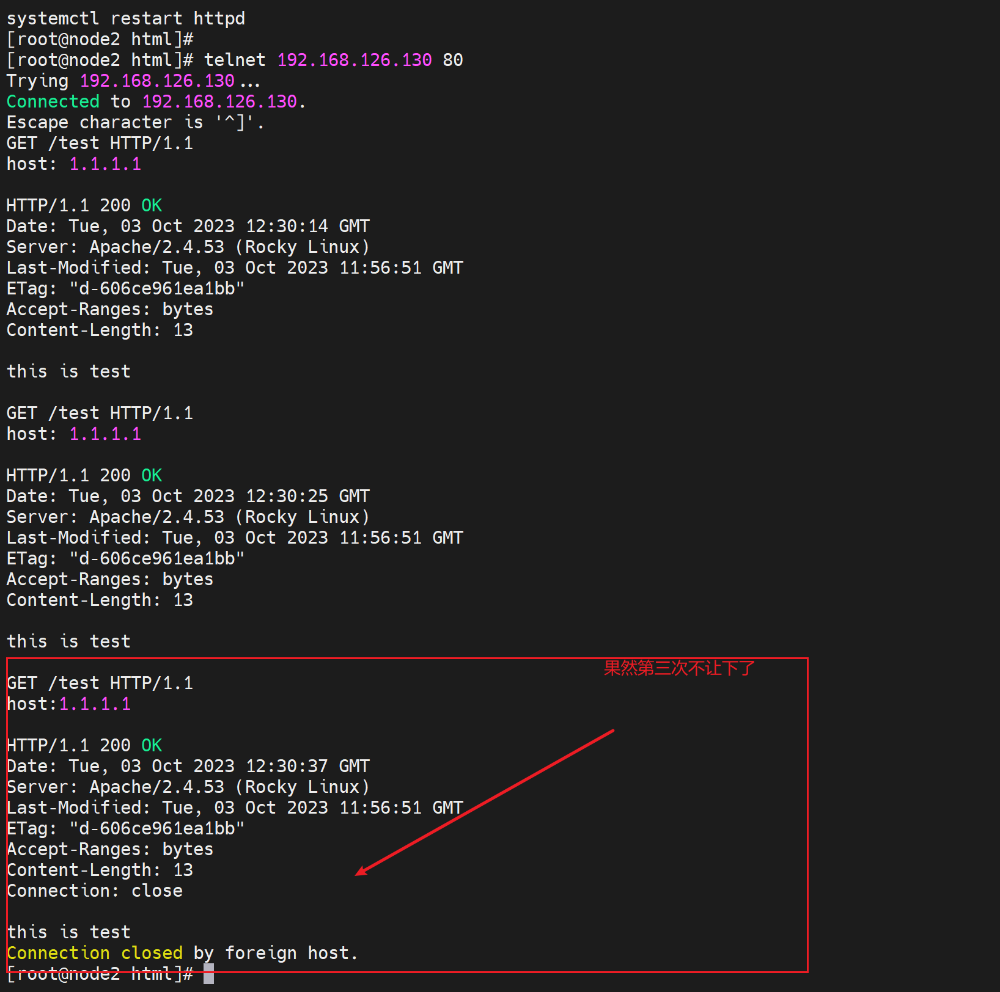

👆上图å¯ä¸æ˜¯keepalivetimeout 30秒超时哦，没到呢；这是maxkeepaliverequests 2，2次下载超了的é™åˆ¶ã€‚


然å补充说æ˜ä¸€ä¸‹ï¼Œæµ‹è¯•æ–¹æ³•ğŸ‘‡


å…¶å®å°±æ˜¯ç±»ä¼¼curl以åŠæµè§ˆå™¨çš„行为，通过抓包å¯è§


curl一样，就ä¸æŠ“了，然åhostå…¶å®æ˜¯å¯ä»¥éšä¾¿å†™çš„。


### DSO：Dynamic Shared Object

动æ€çš„共享对象，也就是说http的模å—是支æŒåŠ¨æ€åŠ è½½çš„。


上图其å®è¿˜æœ‰å¾ˆå¤šï¼Œmodules，通过ls å»çœ‹æ›´æ–¹ä¾¿

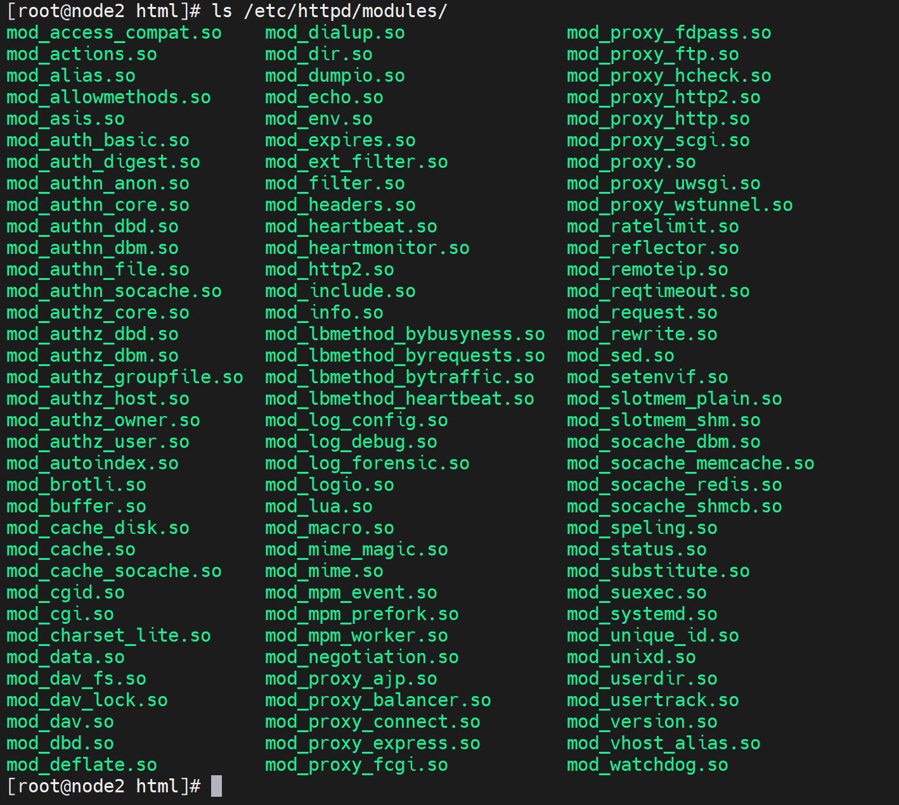

这些模å—是å¦éƒ½åŠ è½½äº†ï¼Œå¯ä»¥é€šè¿‡ğŸ‘‡httpd -Mæ¥æŸ¥çœ‹ï¼Œå¯è§105个模å—，加载了93个。


👇这张图就说æ˜äº†ï¼Œç¡®å®æ˜¯ls /etc/httpd/modules的模å—mod_auth_basic.so加载å通过httpd -Må¯è§çš„👇

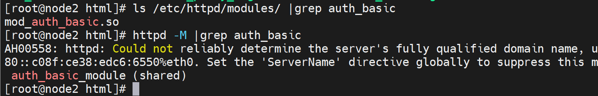


å…³äºæ¨¡å—加载也是由é…置的，åŒæ ·åœ¨ä¸»é…置文件/etc/httpd/conf/httpd.conf里å¯æ‰¾åˆ°ğŸ‘‡


👆说æ˜è¦è¿›åˆ°/etc/httpd/conf.modules.d/下看


👆这样就就看到了LoadModule加载哪些具体的模å—了，这就是105个模å—，加载了93个的åŸå› ã€‚


注释å，å†æ¬¡çœ‹çœ‹åŠ è½½æ¨¡å—çš„æ•°é‡

æœç„¶å°‘了1个


è®°å¾—æ¢å¤è¯¥æ¨¡å—的加载，åç»­è¦ç”¨

### 所以这也是加载和å¸è½½æ¨¡å—的方法👆

总结如下：

DSO： Dynamic Shared Object

​	加载动æ€æ¨¡å—é…置，ä¸éœ€é‡å¯å³ç”Ÿæ•ˆ

​		/etc/httpd/conf/httpd.conf 

​		Include conf.modules.d/*.conf 

​	é…置指定å®ç°æ¨¡å—加载格å¼ï¼š

​		LoadModule <mod_name> <mod_path>

模å—文件路径å¯ä½¿ç”¨ç›¸å¯¹è·¯å¾„：相对äºServerRoot（默认/etc/httpd）

​	示例：LoadModule auth_basic_module modules/mod_auth_basic.so

动æ€æ¨¡å—路径： /usr/lib64/httpd/modules/

查看é™æ€ç¼–è¯‘çš„æ¨¡å—  httpd -l    # 看的是é™æ€ç¼–译的模å—区别share的，是绑定的模å—。

查看é™æ€ç¼–译åŠåŠ¨æ€è£…载的模å—	httpd –M   # 看的是全部的包å«ï¼šshare(共享)模å—å’Œstatic(é™æ€å…¶å®å¯ä»¥å«ç‹¬äº«)模å—


然åstatic模å—是无法通过之å‰ä¸Šæ–‡è®²çš„ é…ç½®æ–‡ä»¶å» å¸è½½ï¼Œæ˜¯httpdæœåŠ¡æœ¬èº«è‡ªå¸¦çš„默认就有的。  真è¦æƒ³"å¸è½½"也å¯ä»¥---就是æºç é‡Œå»æ‰ï¼Œé‡æ–°ç¼–译。ä¸è¿‡ä¼°è®¡å¸äº†ä¹Ÿå°±æ²¡æ³•ç”¨äº†ï¼Œè¿™ä¸ªè‡ªå¸¦çš„估计是core核心的东西。httpd软件组æˆæœ¬èº«å°±æ˜¯æ ¸å¿ƒcore+模å—modules。


### MPM(Multi-Processing Module)多路处ç†æ¨¡å—

å‰æ–‡è®²è¿‡prefork，worker，event，这里讲如何进行é…ç½®

以å‰ï¼šè¦è¿›è¡Œè¯¥å¤„ç†æ–¹å¼çš„切æ¢ï¼Œéœ€è¦é‡æ–°ç¼–译，因为是绑定在core代ç æ¨¡å—里é¢çš„。

ç°åœ¨ï¼šä½†æ˜¯ä»centos7开始(奇了怪了，难é“ä¸æ˜¯ä»httpdçš„æŸä¸ªç‰ˆæœ¬å¼€å§‹å˜›ï¼Œæ€ä¹ˆè¿˜æ˜¯ä»centos版本开始呢)，也支æŒé…置文件的方å¼æ¥åˆ‡æ¢äº†ã€‚


默认处ç†æ–¹å¼æ˜¯ï¼šä»¥å‰å¥½åƒæ˜¯prefork--就是一个主进程-多个å­è¿›ç¨‹-æ¯ä¸ªå­è¿›ç¨‹é‡Œåªå¼€ä¸€ä¸ªçº¿ç¨‹ï¼›ç°åœ¨ä¸æ˜¯äº†ï¼Œç°åœ¨å¥½åƒæ˜¯event(å¯ä»¥å»/etc/httpd/conf.modules.d/00-mpm.confå¯è§å°±æ˜¯event)，有3680独立的å­è¿›ç¨‹ï¼Œè¿˜æœ‰å‡ ä¸ªäº†å¾ˆå¤šçº¿ç¨‹çš„å­è¿›ç¨‹ã€‚

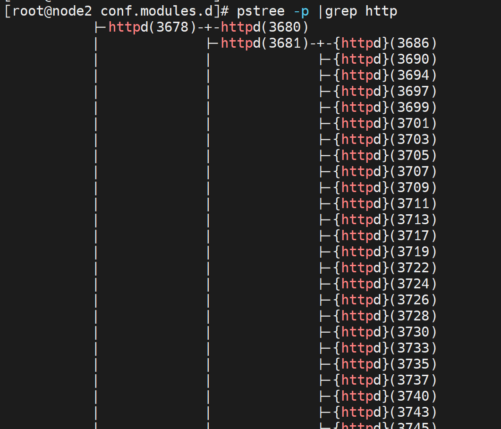


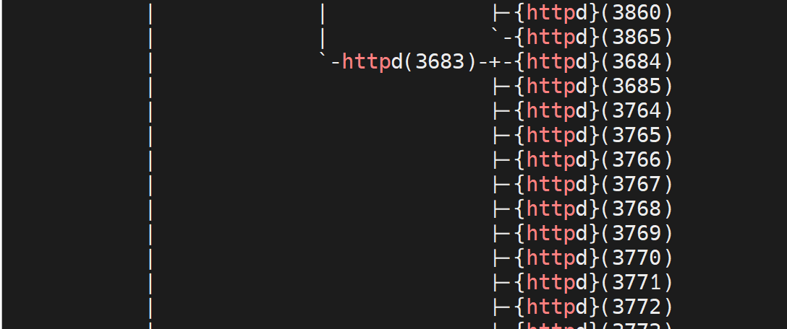

ä¸è¿‡é€šè¿‡ps auxf看到的åªæ˜¾ç¤ºåˆ°å­è¿›ç¨‹ã€‚线程就ä¸æ˜¾ç¤ºäº†ğŸ‘‡

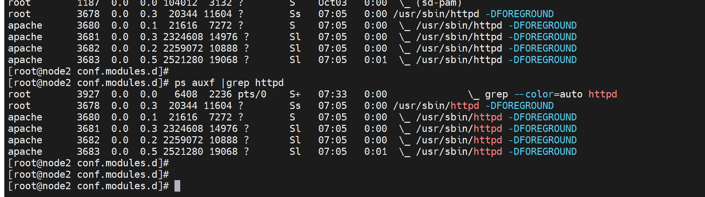

ps -ef一样


然å进程数ä¸æ˜¯é™æ­»çš„，如æœè¿›ç¨‹æ•°ä¸å¤Ÿï¼Œä¾ç„¶ä¼šå¢åŠ çš„。ä¸è¿‡è¿™é‡Œæ¶‰åŠçº¿ç¨‹ï¼Œä¸çŸ¥é“具体的å¢åŠ ç»†èŠ‚了，å¯èƒ½å…ˆå¢åŠ çº¿ç¨‹å§ã€‚


没有讲是Unix到底是默认哪个？

看é…置文件，æœç„¶æ˜¯event👇


修改方法，官网查看路径

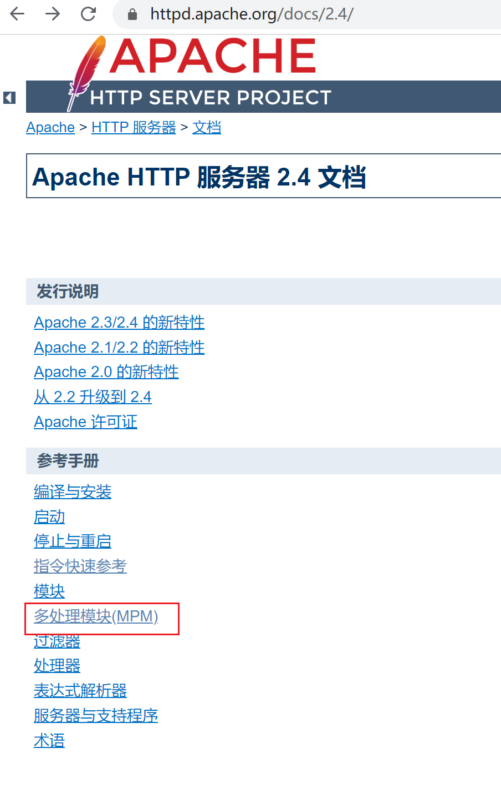

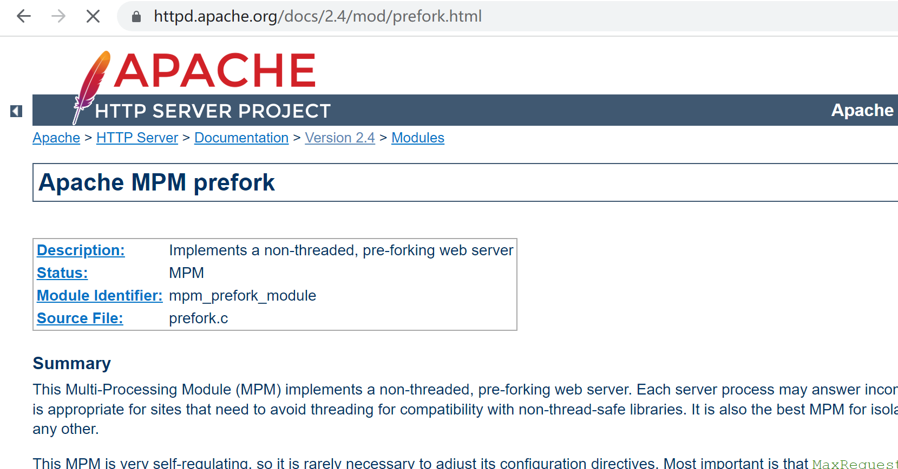

妈的，哈哈，查个å±ï¼Œ/etc/httpd/conf.modules.d/00-mpm.conf里写的好好的，你上é¢æˆªå›¾çš„时候看ä¸åˆ°ï¼Œé å“¦ï¼Œä»€ä¹ˆçœ¼ç¥ã€‚

这里注释åŸæ¥çš„，å–消所需的就行了

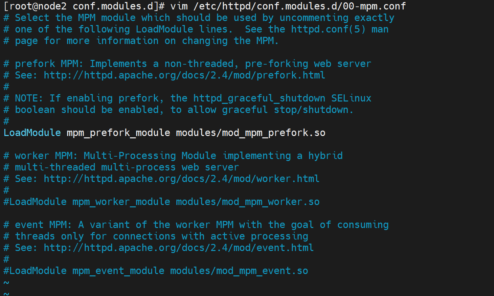

é‡å¯å，å†pstree -p 应该就没有花括å·--也就是没有线程了，结æœäº‹ä¸æ„¿è¿


👆还是有一堆线程啊，一个进程里开了好多线程，奇怪了。ä¸è¿‡æ›´åƒworker。


å†åˆ‡æˆworker

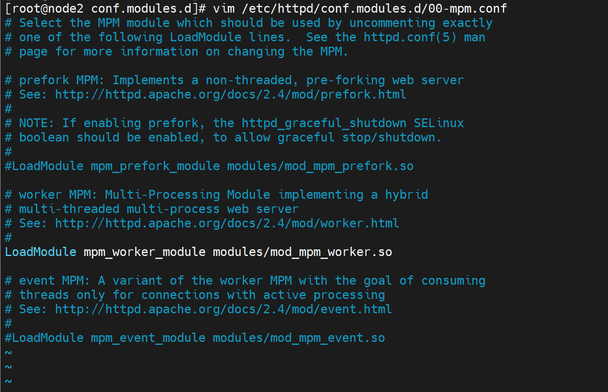

å‘ç°workerå¼€å¯çš„线程è¦å¤šäº†å»äº†ï¼Œå’Œevent一样多。

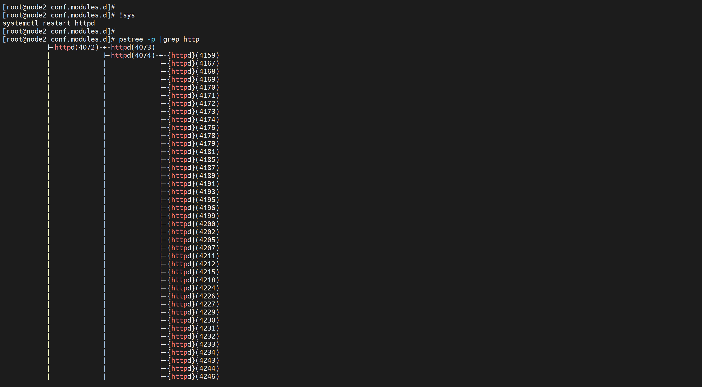

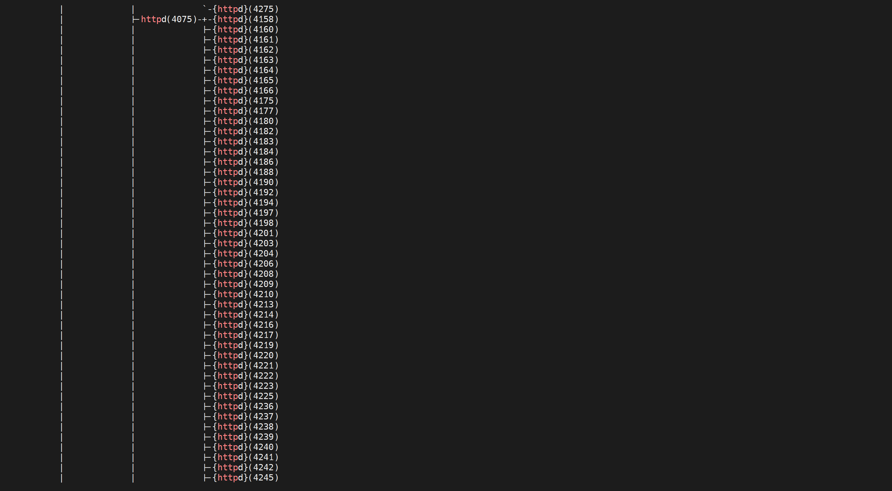

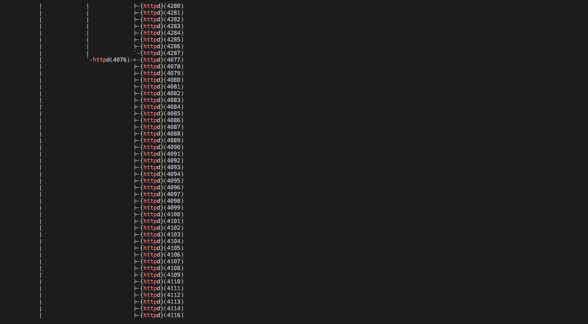

所以，我觉的，新版本的prefork也ä¸æ˜¯åŸæ¥çš„prefork了，ä¸æ˜¯ä¸€ä¸ªè¿›ç¨‹é‡Œå°±å¼€ä¸€ä¸ªçº¿ç¨‹äº†ï¼Œç¡®å®å¯è§å¼€äº†ä½†å¼€çš„ä¸å¤šï¼Œç›¸æ¯”而言 线程开å¯çš„æ•°é‡è¿œè¿œå°äºevent或者worker。

通过pstree -p 是无法区分workerå’Œevent的，event是æ¯ä¸€ä¸ªå­è¿›ç¨‹é‡Œçš„多个线程中有一个是监å¬çº¿ç¨‹ï¼Œè¿™æ˜¯é‡Œé¢ç¨‹åºè°ƒåº¦çš„事情了，无法在pstree中查看的。


ä¸è¿‡æˆ‘好奇的是为什么ç°åœ¨çš„preforkä¸æ˜¯å•çº¯çš„一个å­è¿›ç¨‹é‡Œä»…仅一个线程了。


### 测试mpmçš„eventå’Œprefork的并å‘能力workeråŒç†

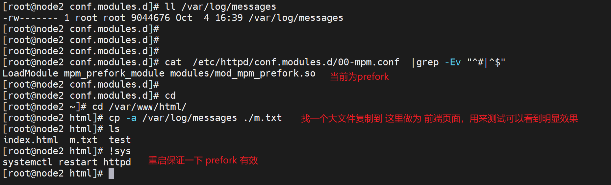

记得修改页é¢æ–‡ä»¶çš„访问æƒé™

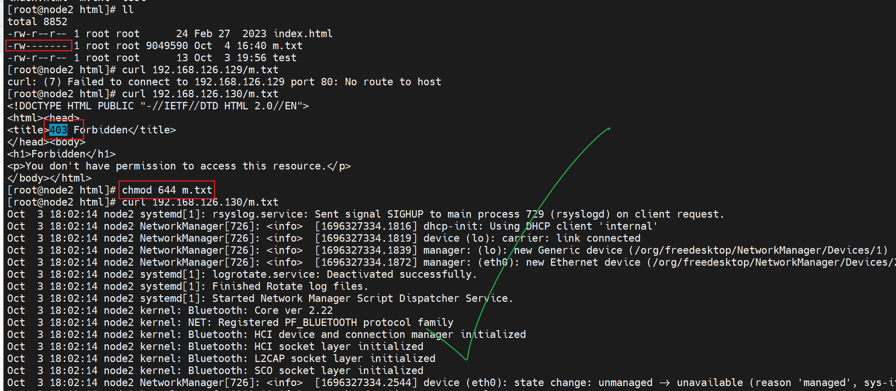

测试CLI


-C1000就是1000个并å‘，åŒæ—¶å»server上看看并å‘é‡ï¼›-n 是å‘动的request个数。


ps aux看到的是进程涨了很多，åŸæ¥å°±æ˜¯å‡ ä¸ªï¼Œç°åœ¨æ˜¯258个

pstree看到的都是线程数，1296个了已ç»ã€‚

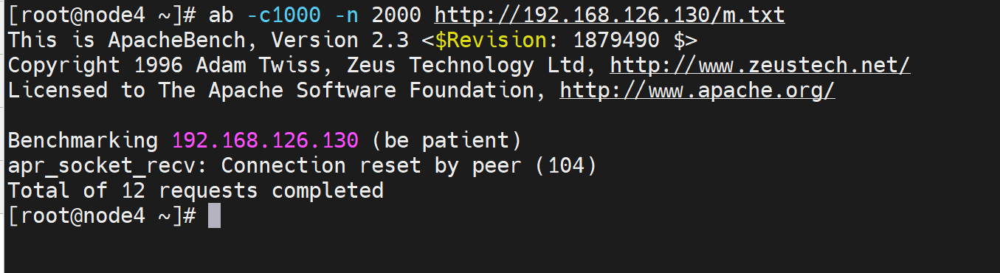

等了一å°ä¼šğŸ‘†ç»“æœè¢« server端reset了，说æ˜è¯·æ±‚é‡å¤ªå¤§äº†å§ï¼Œå‡å°‘请求é‡ç»§ç»­æµ‹è¯•


在👆上图ab测试的过程中，多次在server端查看并å‘情况👇


PS：上图👆æ到的此时 restart 会等蛮久，我觉的ä¸ä¸€å®šæ˜¯ab的并å‘å›æ”¶æ…¢é€ æˆçš„，本身httpdæœåŠ¡é‡å¯å°±æ…¢ï¼Œæœ‰æ—¶å€™å¿«ï¼Œè¿‡åŠçš„时候感觉都是慢的，ä»å‰é¢ä¸æ–­çš„é‡å¯åŠ¨ä½œå¾—出的ç»éªŒè¿™æ˜¯ã€‚

好，第一个prefork mpm的并å‘结æœæœ‰äº†ï¼Œä¸»è¦å°±æ˜¯çœ‹Request per second，æ¯ç§’处ç†äº†3个请求。这是平å‡æµ‹è¯•ç»“æœã€‚


å†ä¿®æ”¹ä¸ºevent mpmæ¥æµ‹è¯•ä¸‹


多次查看进程数和线程数没有å˜åŒ–，说æ˜è¯¥é‡Šæ”¾çš„都释放了，而且6个进程和209个线程基本上就是eventçš„åˆå§‹å¼€å¯çš„é‡äº†ã€‚

然åab 命令走一波

然而这里仅仅看requests per secondå‘ç°eventå而åªæœ‰3.08，è¦å°äºperforkçš„3.13哈哈，æ€ä¹ˆå¯èƒ½ï¼Œä¸è¿‡ç»¼åˆå¼€è¿›ç¨‹å’Œçº¿ç¨‹çš„å¼€å¯æ•°é‡ï¼Œevent是è¦è¿œè¿œå°äºperfork的。ä»è¿™ä¸ªè§’度æ¥çœ‹å°±æ˜¯eventè¦æ›´åŠ èŠ‚çœèµ„æºçš„。æ¢å¥è¯è¯´å¦‚æœç›¸åŒèµ„æºçš„消耗下event的并å‘处ç†å°±ä¼šè¿œè¿œé«˜äºprefork了。   å¦å¤–为啥event模å¼ç³»ç»ŸæœåŠ¡æ²¡æœ‰å¤šå¼€å†™è¿›ç¨‹å’Œçº¿ç¨‹ï¼Œè®©å¤„ç†é‡ä¸Šä¸€ä¸ªå°é˜¶ï¼Œè¿™å°±ä¸çŸ¥é“了，å¯èƒ½æœåŠ¡åˆ¤æ–­å¤„ç†çš„速度还行无需å¢åŠ èµ„æºå¼€é”€ã€‚

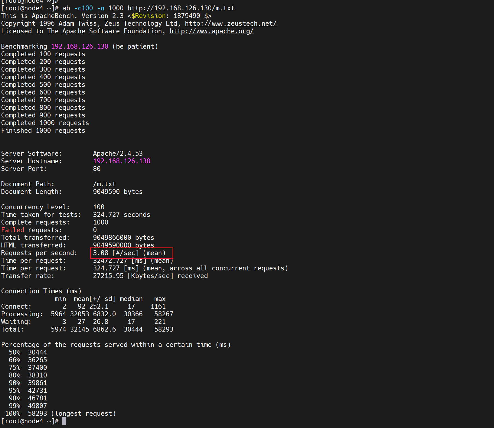

然å上图👆测试期间，并å‘没啥大å˜åŒ–，结æŸäº†5分钟左å³ï¼Œä¹Ÿä¸è§å›æ”¶1个线程


æä¸æ‡‚。。。哈哈，继续往下看å§ï¼Œè¿™é‡Œå…ˆè¿™æ ·ï¼Œå¹¶å‘测试


å¶ç„¶çœ‹åˆ°è¿™ç¯‡

https://lvwenhan.com/tech-epic/500.html

需è¦è‡ªè¡Œç ”究下的感觉👆

然å，这个URLåªæ˜¯è¯¥ä½œè€…的一篇，全部的高并å‘在这里https://github.com/johnlui/PPHC，挺牛逼。ä¸æ˜¯æˆ‘ç°åœ¨è¯¥å»çœ‹çš„，ä¸è¿‡åƒinnodbã€åˆ†å¸ƒå¼dbã€K8S，这些确å®æ˜¯æˆ‘çš„æ–¹å‘，所以这个blog我感觉确å®æ˜¯å¤§ä½¬çº§çš„。


### 并å‘数超了-clientçš„socket打开数

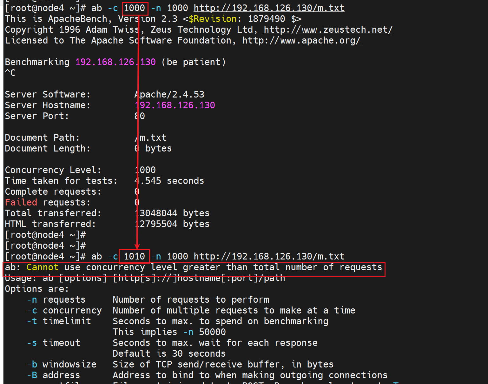

说是收到ulimit -a里的打开文件数é™åˆ¶


è¿æ¥æ•°ï¼Œæœ€ç»ˆå°±æ˜¯æ‰“开的socket文件，linux一切皆文件。

调大也没有用，å¯èƒ½æ˜¯ä¸æ­¢è°ƒè¿™ä¸€ä¸ªåœ°æ–¹ã€‚


哦，æ“~~~ï¼ æ˜¯CLI敲错了，并å‘-c 1010 大äºæ€»æ•° -n 1000了，这算乌龙å§~

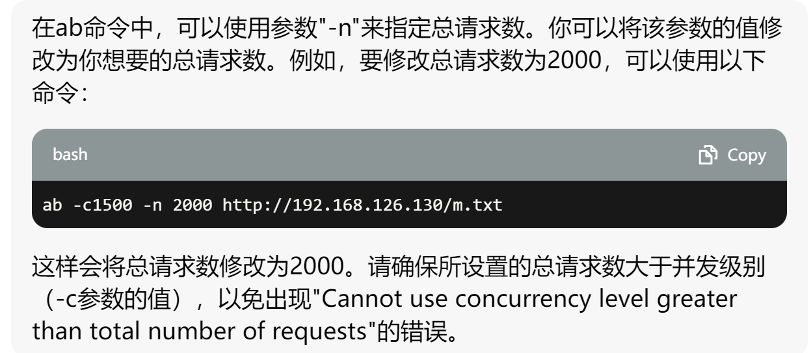


æ错了~å†æ¥ä¸€é👇


调大socket 文件上é™ï¼Œç¡®å®å°±å¯ä»¥äº†


### 并å‘超了-server端的进程数

在server端改为perfork进行测试


大页é¢æ–‡ä»¶çš„并å‘，结æœå°±æ˜¯è¢«server reset了，超出了server的承å—能力--就是进程数超了，大页é¢æ–‡ä»¶ä¸‹è½½çš„慢，进程å ç”¨æ—¶é—´é•¿ï¼Œå›æ”¶çš„慢，ä¸å¤Ÿç”¨äº†ã€‚


改æˆå°æ–‡ä»¶å°±å¯ä»¥äº†ï¼Œæ‰€ä»¥ä¸‹é¢ç ”究下server的处ç†ä¸Šé™é—®é¢˜ï¼Œå°æ–‡ä»¶æµ‹è¯•çš„时候，server的进程数是够用的，因为å›æ”¶çš„快，å°é¡µé¢æ‰“å¼€(下载)处ç†çš„快，进程å›æ”¶çš„快，所以够用


### prefork çš„ é… ç½® 


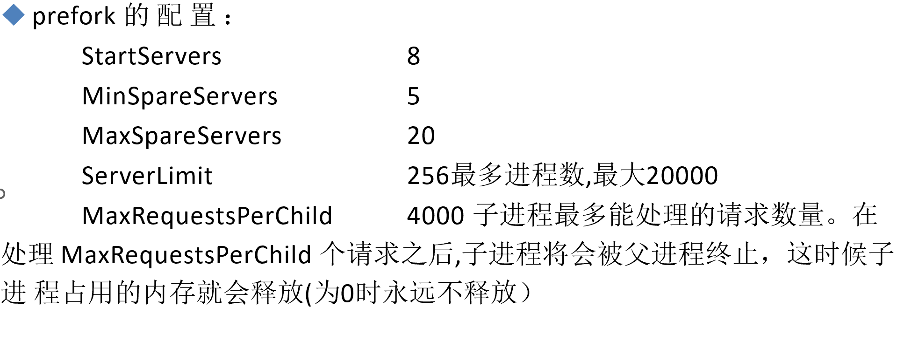


 **StartServers** 	     # 这是一开始的ps auxf |grep httpd 默认开å¯çš„进程数

 

perfork默认是开5个进程数

然å线程开的也ä¸å¤š

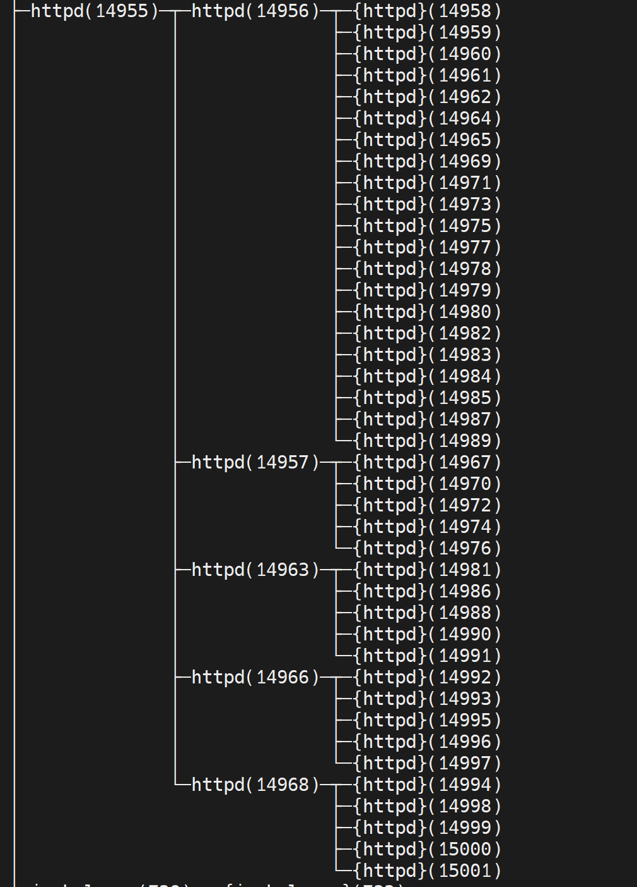


**StartServers** 				**8 **			# åˆå§‹å¼€å¯8个进程

**MinSpareServers 			5 **     	#  最少ä¿ç•™5个空闲进程

**MaxSpareServers 			20**		# 最多ä¿ç•™20个空闲进程

è¿èµ·æ¥çš„æ„æ€å°±æ˜¯ï¼Œ8个åˆå§‹è¿›ç¨‹éšç€ç”¨æˆ·è¯·æ±‚å˜å¤šï¼Œä¼šå¼€å¯çš„越æ¥è¶Šå¤šï¼›

但是至少ä¿ç•™5个空闲的进程ä¸åˆ†é…出å»ï¼Œæ¯”如ä»8涨到100进程，那么会开105个。

当用户请求下é™äº†ï¼Œé‚£ä¹ˆæ¯”如100个用户请求大文件，100个进程开ç€ï¼Œéšç€è¯·æ±‚处ç†ç»“æŸï¼Œè¿™ä¸ª100进程会å›æ”¶80个，留20个空闲，因为最多20个。

我是这么ç†è§£çš„👆


 **ServerLimit 						256最多进程数,最大20000**

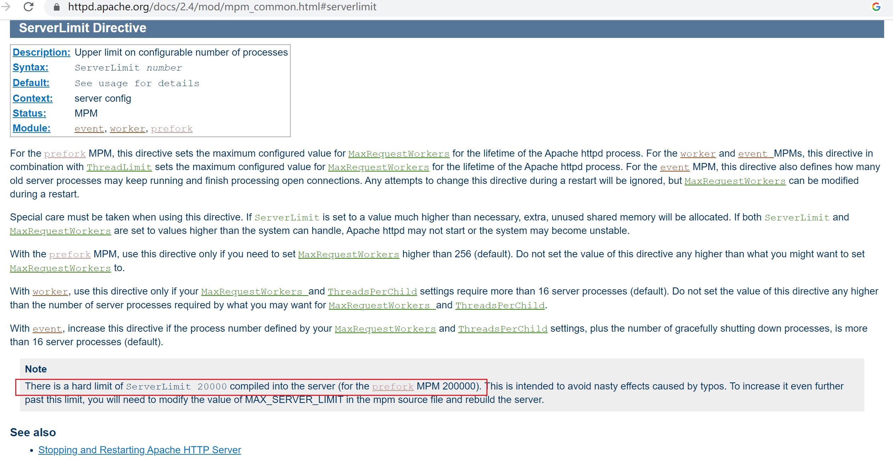

2000或者20Wå¯èƒ½å’ŒMPM模å‹æœ‰å…³


MaxRequestsPerChild 		4000 å­è¿›ç¨‹æœ€å¤šèƒ½å¤„ç†çš„请求数é‡ã€‚åœ¨å¤„ç† MaxRequestsPerChild 个请求之å,å­è¿›ç¨‹å°†ä¼šè¢«çˆ¶è¿›ç¨‹ç»ˆæ­¢ï¼Œè¿™æ—¶å€™å­è¿› 程å ç”¨çš„内存就会释放(为0时永远ä¸é‡Šæ”¾ï¼‰


然å修改一下é…ç½®

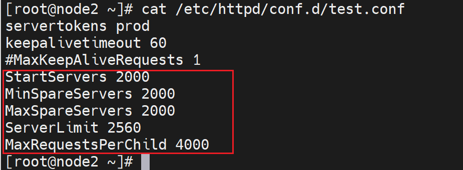

然åé‡å¯æœåŠ¡


然å看下对应的å‚数是å¦è½å®


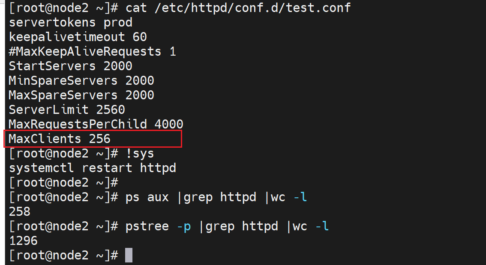


修改MaxClients为2560å‘ç°ç¡®å®è°ƒå¤§äº†ï¼Œè€Œä¸”该å‚数官方网站上是找ä¸åˆ°çš„，å¯èƒ½æ˜¯æ—©æœŸç‰ˆæœ¬çš„å‚数在2.4里没有写，但是ä¾ç„¶æœ‰æ•ˆã€‚


然åMaxClients 2560这个调大了以å，StartServers 2000这个åˆå§‹çš„å­è¿›ç¨‹æ•°å°±å¯¹äº†2000个就OK了

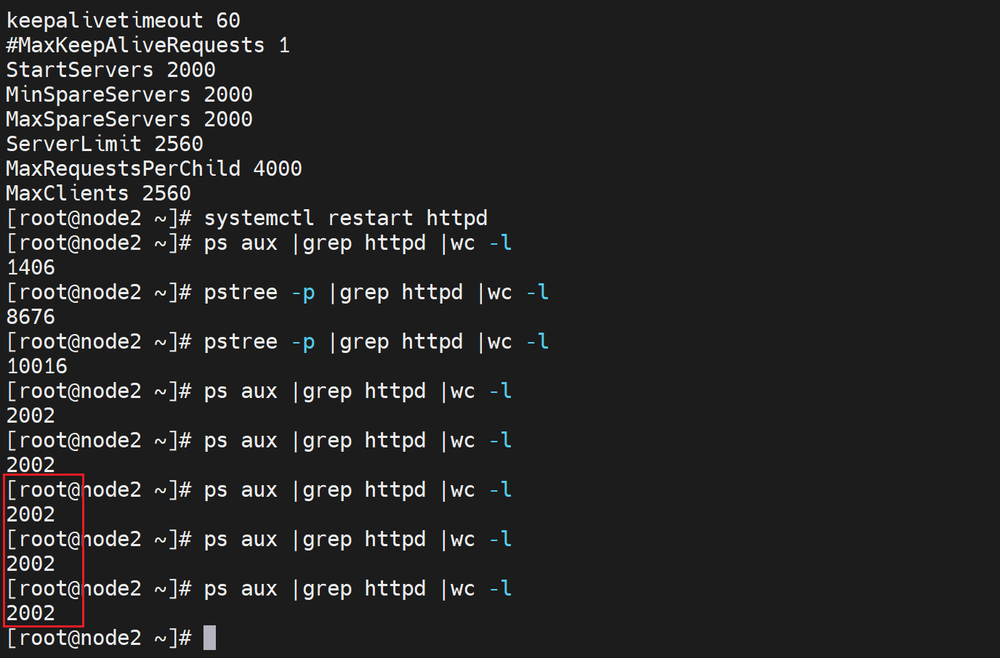

以上是间隔3-5分钟多次键入的，👇间隔2分钟多次输入的命令，说æ˜æ­¤æ—¶å­è¿›ç¨‹æ•°å’Œçº¿ç¨‹æ•°æ¶¨åœğŸ‘‡ã€‚


这个å‚数是httpd 2.2版本里的å‚数。

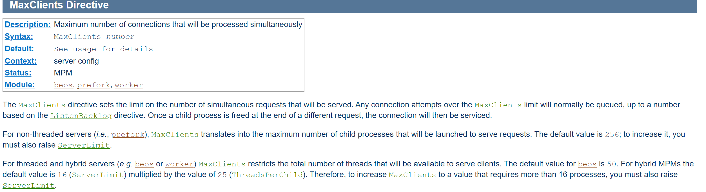


ç”±äºæ­¤æ—¶è¿›ç¨‹æ•°è°ƒå¤§äº†ï¼Œå†æ¬¡ç”¨ab测试一下

这是👇本篇 上文的 内容--之å‰ab测试的结æœ


这是👇调大å‚æ•°å的测试结æœğŸ‘‡ï¼Œè‚¯å®šå°±å¯ä»¥äº†å› ä¸ºserveråˆå§‹åŒ–了2000个进程，这里ab测试时1500个并å‘，而且2.4çš„prefork虽然2000个进程，但是åŒæ ·ä¹Ÿå¼€å¯äº†çº¿ç¨‹1W+了都，肯定支æŒ1500个tcpè¿æ¥äº†ã€‚

åŒæ ·æ­¤æ—¶å†…存消耗也大：server端👇

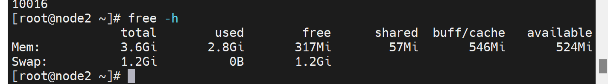

看下ç°åœ¨çš„测试结æœğŸ‘‡ï¼Œç¡®å®ä¸å†æŠ¥é”™ï¼Œä½†æ˜¯å†…å­˜è¦å¤Ÿçš„，好在我的内存还行给的。æ€ä¹ˆåˆ¤æ–­ç»™çš„内容够ä¸å¤Ÿï¼Œç®€å•ï¼Œfree -h 看看涨ä¸æ¶¨ä¸å°±è¡Œäº†ï¼Œæ²¡å˜åŒ–就是够用了--上图就是内存：2.8G用了。

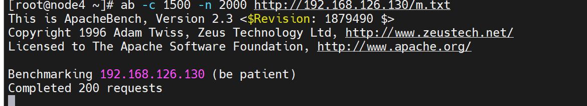


进程数也涨了写，线程åŒæ ·æ¶¨äº†ï¼Œè¯´æ˜2000个åˆå§‹å­è¿›ç¨‹StartServers还ä¸å¤Ÿï¼Œå› ä¸ºm.txt太大了

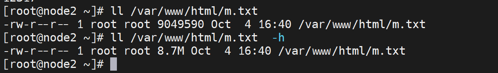


åŠå¤©10分钟过å»äº†ï¼Œ 1500个并å‘å°±ç¬é—´æ¶ˆè€—1500个tcp，然åè¦è®¿é—®2000次，m.txtåˆå¤ªå¤§ï¼Œä¸‹è½½è€—时长tcpå¾—ä¸åˆ°é‡Šæ”¾ï¼Œä»ç¬¬ä¸€ä¸ªtcp建立到最å一tcp释放，å†ç»äº†ä¸€å…±1500*2000=30 00 000 次的tcpè¿æ¥ã€‚å‰é¢é¡µé¢åŠ è½½å®Œm.txt就会得到释放å§--感觉会释放-ä¸è¿‡é‡Šæ”¾çš„æ¡ä»¶å¯èƒ½æ—¶timeout和上é¢è®¾ç½®çš„4000个请求数MaxRequestsPerChild。

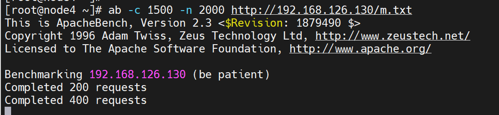


总结

ServerLimitå’ŒMaxClients都是é™åˆ¶æœ€å¤§å¹¶å‘è¿æ¥çš„å‚数，都需è¦æ”¹çš„。


### worker MPMçš„å‚æ•°


threads 一般表示线程，python里的import 也是这么表示的


MinSpareThreads 最å°ç©ºé—²çº¿ç¨‹

ThreadsPerChild 25 就是 æ¯ä¸ªå­è¿›ç¨‹é‡Œå¼€25个线程，直æ¥çœ‹GPT的解释å§ğŸ‘‡


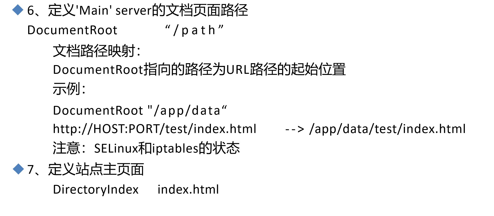

