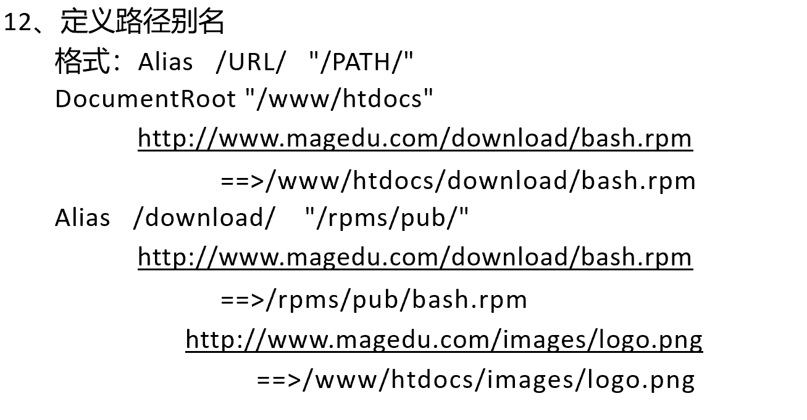
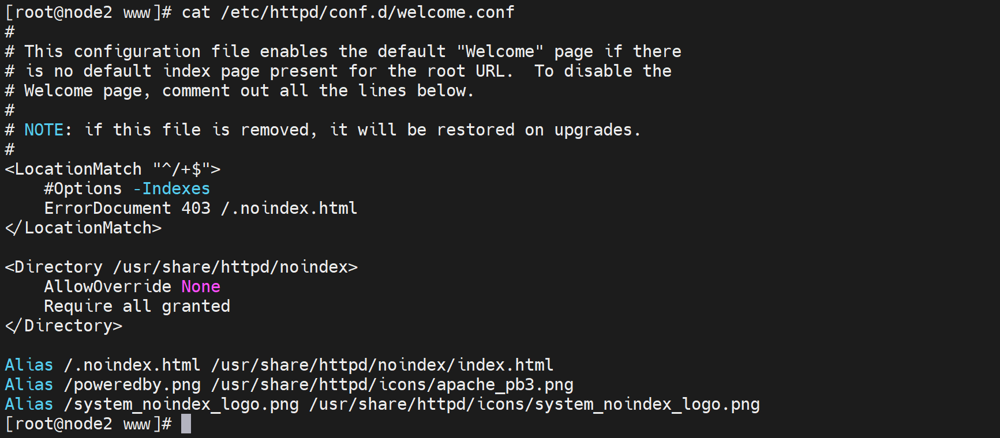
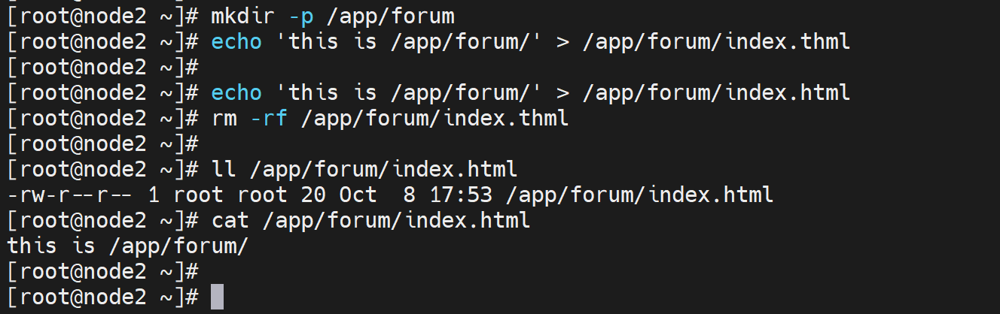
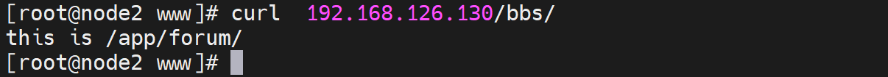
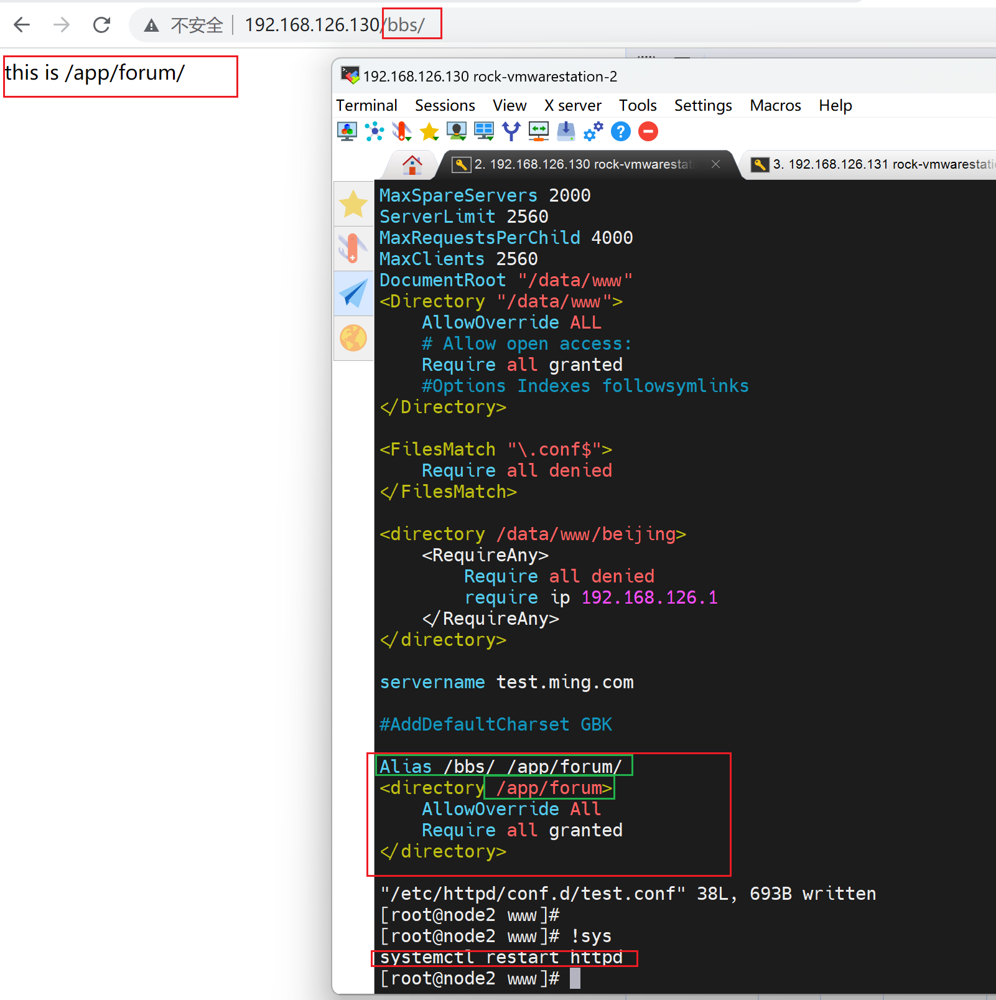

# 第6节. 多虚拟主机实现


## 目录访问的别名

 


别名在welcome.conf里也见过的，上一篇将/.noindex.html的时候就遇到过👇




开始实验

``` 
mkdir /app/forum
echo 'thisi is /app/forum/' > /app/forum/index.html

```

用户通过 curl 192.168.126.130/bbs/      访问到/app/forum/

当然你说用**跳转**，没必要，这里用alias别名

当你还还说用**软连接**，没必要，这用别名




光写别名还不行，👆还需要补上别名的那个目标地址的访问权限。

问题来了①我待会使用curl 192.168.126.130/bbs/去访问，/bbs这个文件夹我感觉不用存在，感觉正确。

②/app/forum在os层面也是需要apache可读的。

 




### 总结，页面URL里的路径不一定在DocumentRoot下

curl http://192.168.126.130/dir100，实际上就是打开dir100/index.html页面

①这个dir100文件夹确实在DocumentRoot下，且apache配置文件里有给到访问权限。

②软连接，不过软连接所在的路径应该也需要在配置文件里给到访问权限

③别名，就是上文的alias，这个种dir100文件夹 都无需创建。

④跳转应该也算一个，具体见上一篇文章。


