# 第3节. cp和mv

## **1、cp命令**

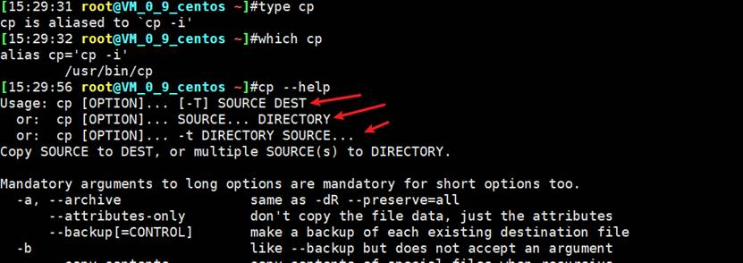

cp的三种语法

前两种用的多，

cp [OPTION]... [-T] SOURCE DEST # 复制并改名

cp [OPTION]... SOURCE... DIRECTORY # 复制多个源文件到一个文件夹中

cp [OPTION]... -t DIRECTORY SOURCE # 同上，多了个-t

其实第三种用的也很多，因为通常会将rm，alisa成mv，此时就需要将目的文件夹放到前面，如下图：

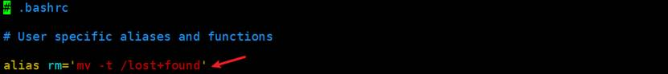

 

cp 复制文件的meta data会改变的

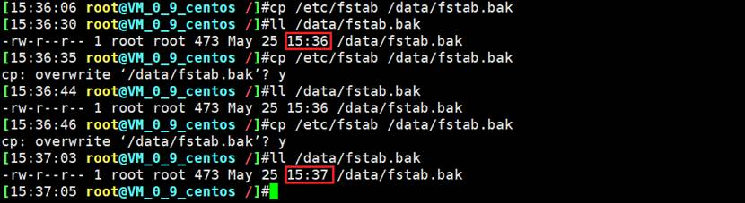

 

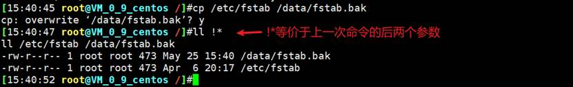

cp复制文件的时候，可能有一些信息会丢失（时间）

 

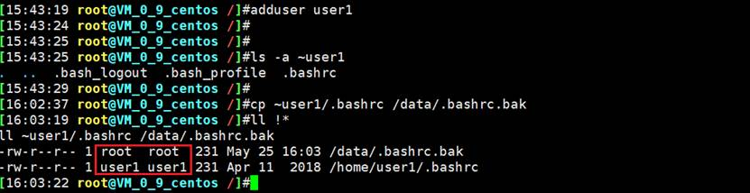

cp复制文件的时候，可能有一些信息会丢失（时间，所属用户 用户组）

文件拷过来了，但是所属者、所属组，也包括时间都变了。

这就是信息丢失了，很可能导致文件复制过来不可用了。

 

 

cp赋值普通文件是可以的，除了上面的说的问题。但是cp不能复制特殊文件

之前讲过7种类型的文件

ll看最前面的符号就是类型了

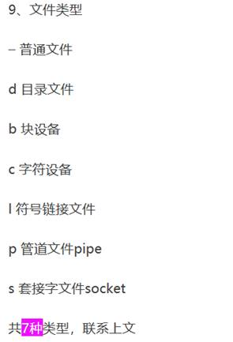

 

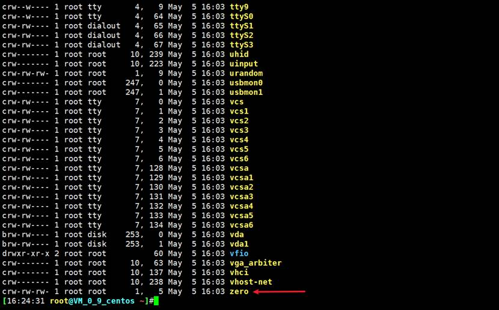

zero也是一个常用的字符文件

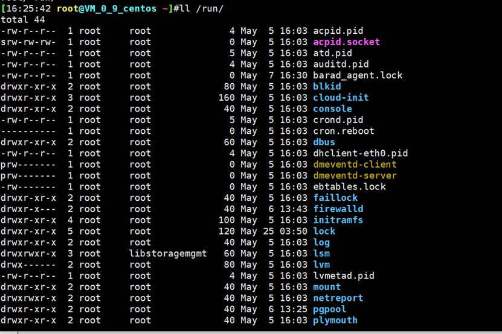

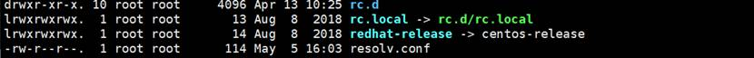

 

cp复制文件的时候，cp复制问题-文件内容变了，拷的就不是你要的文件

下图注意复制的其实不是软连接，而是真是的文件被复制的。

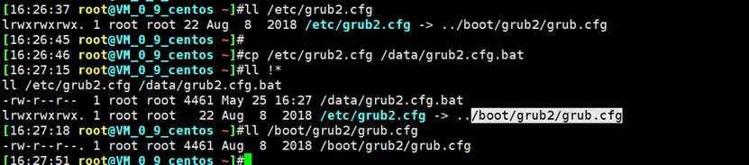

 

cp复制文件的时候，cp了一个/dev/zero设备文件，如下图，什么都不一样了（文件类型、权限、大小）都变了

其实zero好像通常用来产生固定大小的文件的，一般你测试网速，就可以用zero产生一个大文件提供下载。 

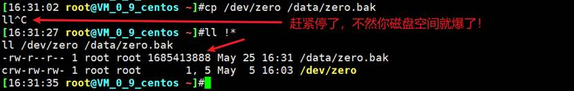

 

所以 cp主要针对普通文件的。要复制特殊文件，需要加一些选项，就算普通文件，如果需要保留原来的时间也需要cp加选项。

 

## **2、复制文件夹的注意事项**

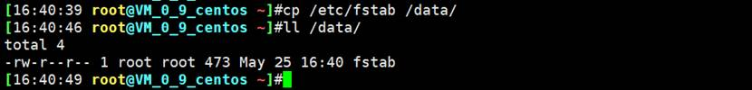

复制到文件夹，不改名字

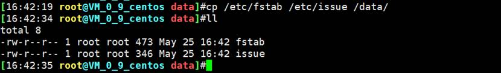

复制多个文件，复制到文件夹下

 

**如果是复制文件夹**

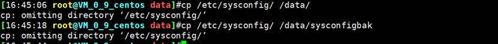

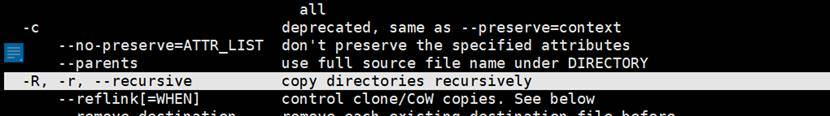

需要递归选项

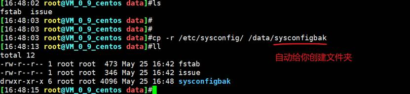

如果文件夹不存在，自动给你创建

 

如果文件夹存在，会覆盖？！不是，看清楚下图，①sysconfigbak文件存在，②所以会把sysconfig文件夹的内容全都复制到sysconfigbak文件夹下。③而再次cp -r的时候由于sysconfigbak下已经有sysconfig整个文件夹的内容了，所以会问你是否覆盖。

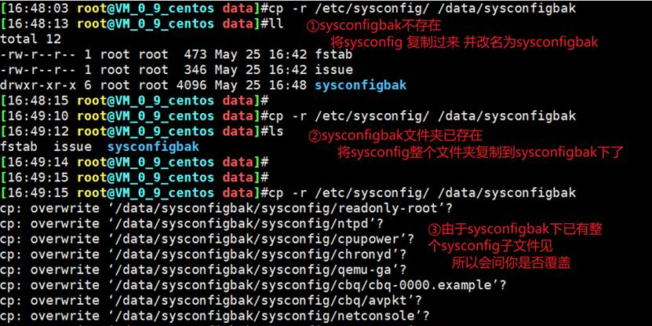

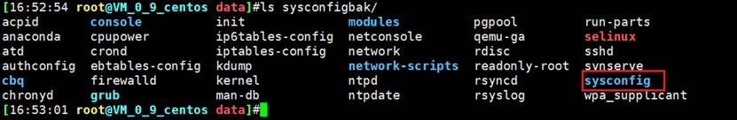

这就是传说中的：**幂等性**

多次重复执行一个命令，效果一样，这就叫做幂等性。

所以**cp命令不具有幂等性**的特点。

 

| 源    目标         | 不存在                                              | 存在且为文件                                                 | 存在且为目录                                                 |
| ------------------ | --------------------------------------------------- | ------------------------------------------------------------ | ------------------------------------------------------------ |
| 一个文件           | 新建DEST，并将SRC中内容填充至DEST中                 | 将SRC中的内容覆盖至DEST中  注意数据丢失风险！  建议用-i 选项 | 在DEST下新建与原文件同名的文件，并将SRC中内容填充至新文件中  |
| 多个文件           | 提示错误                                            | 提示错误                                                     | 在DEST下新建与原文件同名的文件，并将原文件内容复制进新文件中 |
| 目录  须使用-r选项 | 创建指定DEST同名目录，复制SRC目录中所有文件至DEST下 | 提示错误                                                     | 在DEST下新建与原目录同名的目录，并将SRC中的内容复制到目录中  |

 

 

 

## **3、CP常用选项**

-i 覆盖前提示，默认就有


需要注意

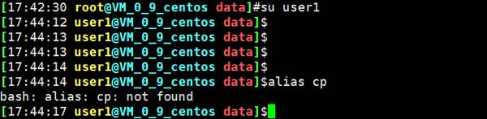


这是因为root账号有自己的alias别名定义，user1没有定义，别名的定义在家目录的.bashrc里写的。在root账号的家目录里有定义的别名，这里

 

-n 不覆盖，注意两者顺序

-r, -R 递归复制目录及内容

-a 归档，相当于-dR –perserv=all

-d --no-dereference –preserv=links 不复制原文件，只复制链接名

--preserv[=ATTR_LIST]

​    mode:权限

​    ownership:属主属组

​    timestamp:

​    links

​    xattr

​    connext

​    all

 

 

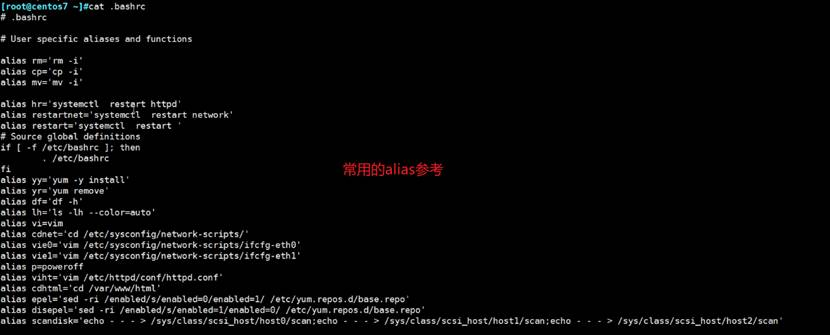

 

 

## 4、cp的技巧

cp通常是需要加上-i ，cp – i 作为alias别名存在，但是存在下图情况，一个个问就很烦了。也不能取消别名的安全措施

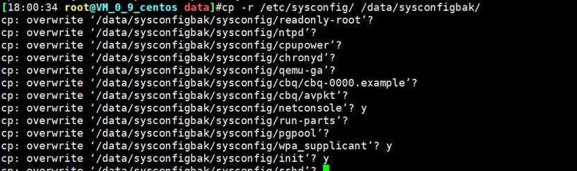

所以可以利用\前缀来还原成原始的命令，不用别名


不要想当然以为是cp -f，并不是这样的


 

 

-n 不覆盖


 

-d 不复制原文件，只复制链接名

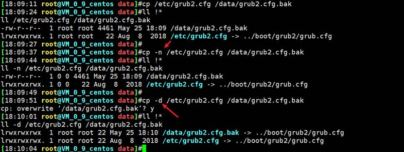

默认是复制原始文件，而不是软链接本身。

 

 

--preserv[=ATTR_LIST]

​    mode:权限

​    ownership:属主属组

​    timestamp:

​    links

​    xattr

​    connext

​    all

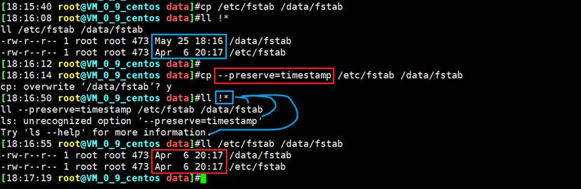

!*等价于上一次命令的后面所有参数，不仅仅是下图表示的两个，上图就出现了三个

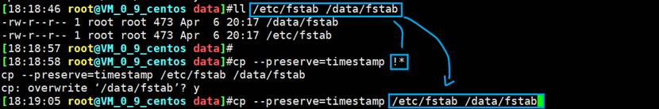

 

如果我们希望保留时间属性，就可以


cp xx xx –preserv=timestamp

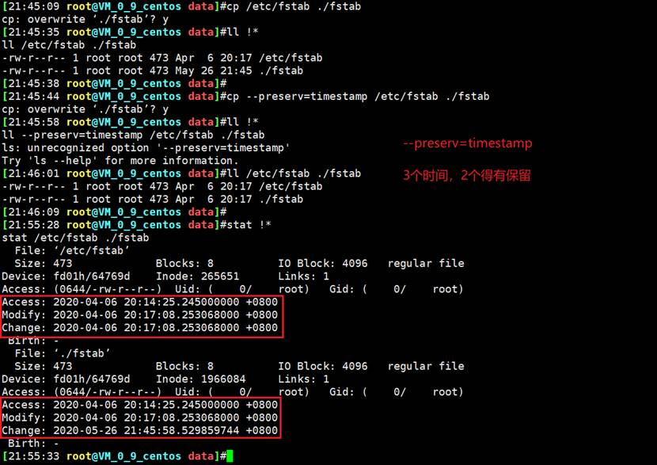

这会时间就保留住了

 

如果所有的都保留住

 

-p 等同于 –preserv=mode,ownership,timestamp #mode是权限、owership所有者所属组、timestamp就是时间了。

-a 前文有，能保留的属性都保留了，最全了。相当于-dR --preserv=all # 这个其实是help里这么写的，但是你不觉得很奇怪吗，r = R, -d只是--preserv=links，所以-a应该是-r 和 --preverv=all这样表示才对。很明显帮助里多了个-d。作为-dr --preserv=all，写法应该就是cli的是偶带了多个参数。所以自然也是and的关系。

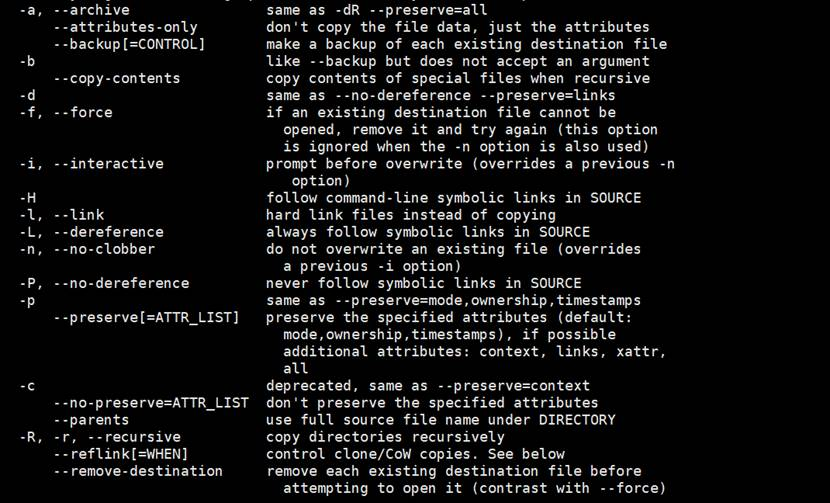

 

-v --verbose # 复制的时候看到过程，如果文件很大，就需要这个直观显示，防止有人以为卡主不动了。  所以工作中推荐**av**经典组合

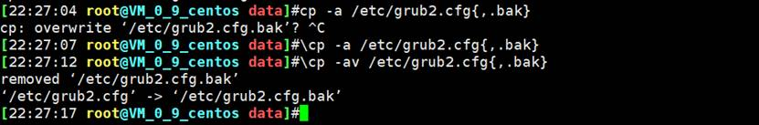

-f --force

演示过程中的错误注意事项：

​    root用户将某文件复制到user1用户的家目录下

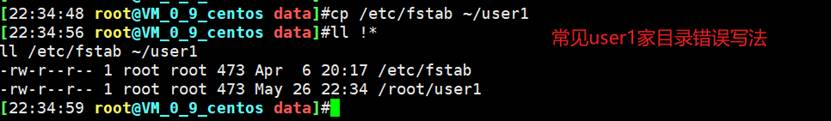

正确写法是~user1，经常写错的原因是因为cd ~/切到自身的家目录这里是可以有/的。

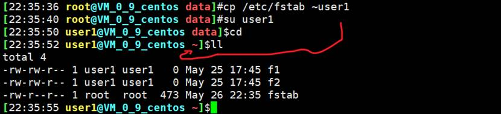

现在user1家目录下的fstab的所属用和用户组是root的

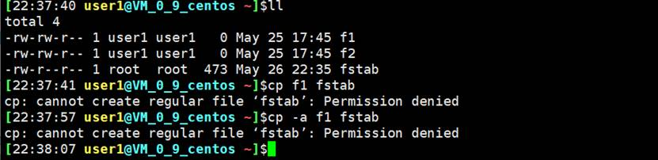

于是如图所示，不能覆盖了，但是我自己的家目录，我还不能改吗？！-f就是强制措施

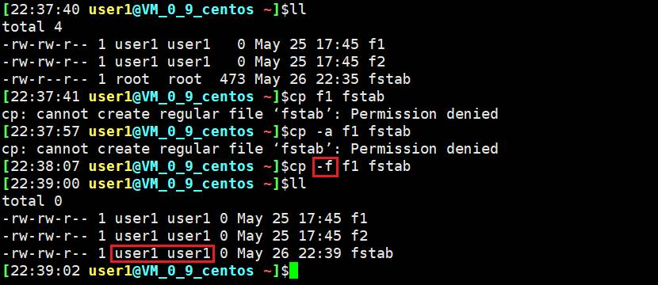

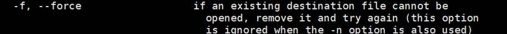

-f的思路，就是**如果**覆盖不了，实际上先删掉后 重新创建新的文件。当然如果删不了就肯定不行了！

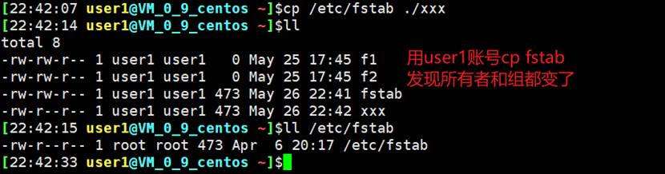

谁复制的，就变成谁的↑，但这话又不全对↓

-f 此时是删了再创建的，所以用户和用户组都是user1。

切到root用户下，cp /etc/fstab ~user1，覆盖掉，发现用户和组还是user1。

 

 

 

 

-u --update 只复制源比目标更新文件或目标不存在的文件

复制的时候存在一个覆盖的问题，一般都是更新的数据整个文件夹，cp -u 到服务器上的数据，这样就只做 增量更新。

 

-b 目标存在，覆盖前先备份，形式为filename~

--backup=numbered目标存在，覆盖前先备份加数字后缀

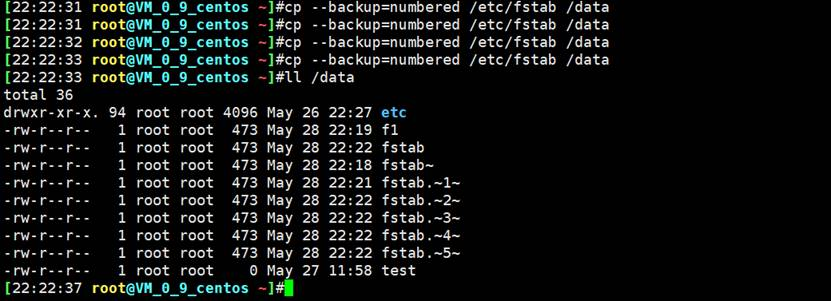

★工作中，可以做个alias bak=’cp -a --backup=numbered’ 这样就小整合了一下。

 

 

所以-a 经常用来做备份的效果，①保留了所有能保留住的属性，②本身-a就集成了-d和递归的功能。

PS：之所以说保留了能保留的，原因见上图，至少有一个ctime是实时的。

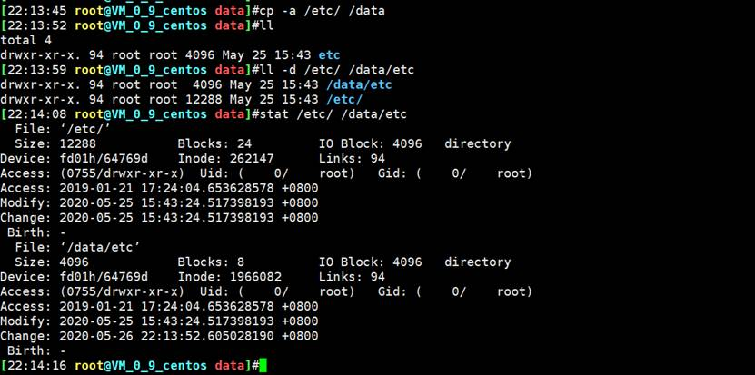

 

**简化写法示例**

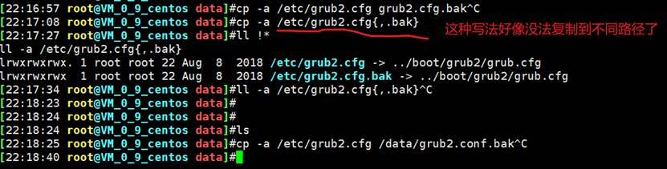

ll grub2.cfg{,.bak}  # {}里面被,逗号分隔成两个部分，,号前面是空，后面是.bak，所以就是

ll grub2.cfg grub2.cfg.bak 这个了。用echo可以直观的看

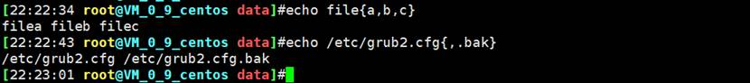

据说这还是常用的备份方法，搞不懂，秀技术吗？

 

 

 

练习：

1、每天将/etc/目录下的所有文件，备份到/data独立的子目录下，并要求子目录格式为backupYYYY-mm-dd，备份过程可见

```
cp -av /etc /data/bakcup`data +%F`
```

2、创建/data/rootdir目录，并复制/root下所有文件到该目录内，要求保留原有权限。

mkdir /data/rootdir;cp -a /root /data/rootdir

cp -r --perserv=mode /root /data/rootdir

cp -rp /root /data/rootdir

cp -a /root /data/rootdir

 

 

 

 

## 5、mv 移动和改名

★可以用mv替代rm，方法就是alias rm=mv ...

mv [OPTION]... [-T] SOURCE DEST

 

mv [OPTION]... SOURCE... DIRECTORY

 

mv [OPTION]... -t DIRECTROY SOURCE

 

常用选项：

-i 交互式

-f 强制

-b 目标存在，覆盖前先备份

 


---


 

## 6、rm删除

rm [OPTION]... FILE...

常用选项：

​    -i 交互式

​    -f 强制删除

​    -r 递归  带文件夹一般都带r

​    -no-preserve-root 删除/

示例：

​    rm -rf /*

 

有的rm会被alias成rm -i，所以如果需要关闭提示，就用\rm f1 f2 f3

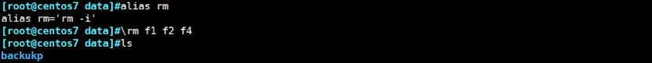


当然也可以使用-f选项

 

★rm -rf / data  #这就完蛋了，你带了空格，就是把/下面全删了

 


rm -rf --no-preserve-root /

在windows里正在使用的文件是不能删除的，但是在linux里没有这个概念。

有些是删不了的，比如media光盘、proc、sys内存、/home /misc /net有些是特殊情况，确实不能删，其他都能。

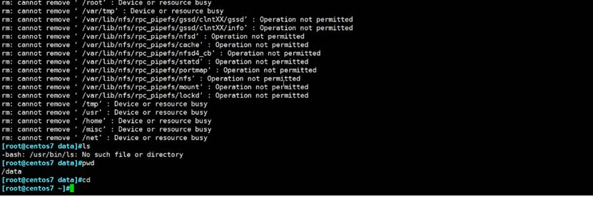

/删掉后，pwd，cd都能用，原因就是这些都是内部命令，内部命令都已经加载到了内存里。

你删掉的是磁盘文件，内存里的东西都还在。

但是 内部命令依赖的/bin/bash文件已经没了，下次重启后，这些命令就没了。

 

外部命令那些本次开机后还没有使用过的就不行了，因为外部命令第一次使用后才会加载到内存中，那些本次开机后没有用过的，还都是磁盘文件呢。所以文件没了，就不能使用这些命令了。

 

 

rm -rf /* 这个命令误操作的可能性不太大，但是下一个命令就不行了


★上图就把/data和 /*下的文件全删了。

 

工作中rm就别用了，别名成mv，其中涉及mv覆盖同名的文件的解决思路

思路就是，rm改成mv mv的时候考虑同名文件，就事前创建一个以当前时间（精确到秒单位,这样只要你的rm命令频率在1s以外，都没有问题）为文件夹名称。然后将要删除的文件移动到该文件夹里。

 

所以最终的mv替代rm的方法就是：

待填空

 

## 7、tree 显示目录树

​    -d：只显示目录

​    -L level：指定显示多少层

​    -P pattern：只显示由指定pattern匹配到的路径，pattern涉及一些正则表达式

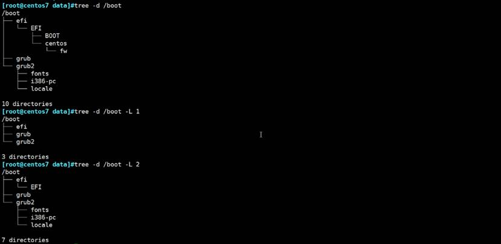

 

 

mkdir d1/d2/d3/d4 -pv  竟然不是-r,-v 就是建立的过程

-m MODE：创建目时，直接指定权限

 

rmdir a1/a2/a3/a4 这是删了a4，且a4是空文件夹，rmdir用的不多。

-p：递归删除父空目录

-v：显示详细信息

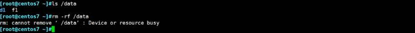

rm也不是都能删的，报错资源忙，忙的原因是因为/data是个设备挂载点

rm -rf /data确实会把里面的文件都删了，但是当删/data这个文件夹的时候（注意rm -rf /data是删了整个/data文件夹的）由于data是个分区挂载点，所以报错忙。 

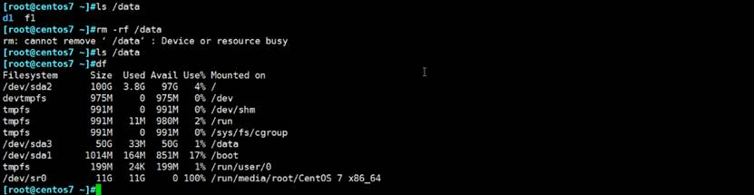

 

 

 

## 8、关于磁盘利用率的释放

cp /dev/zero /boot/bigfile # 时间越久，产生的文件越大

ll /boot/bigfile -h 

**>该实验第1遍**

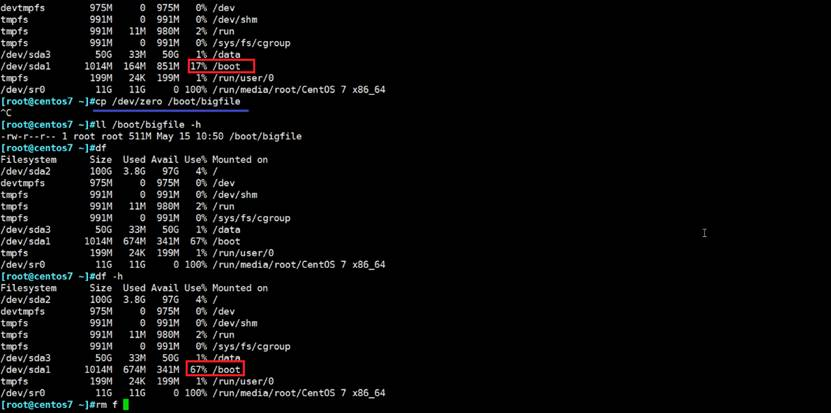

现在删除bigfile，该磁盘利用率是否会立刻降下来呢？不一定。这个实验是立即降下来的。

rm -f /boot/bigfile

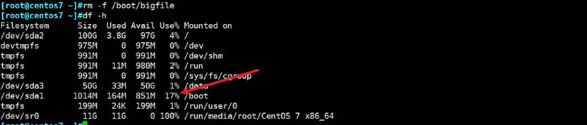

 

**>该实验第2遍**

**同样上面的实验**，现在再rm删除bigfile该文件之前，先用另一个ssh登入打开它。然后在尝试删除观察磁盘利用率是否下降。

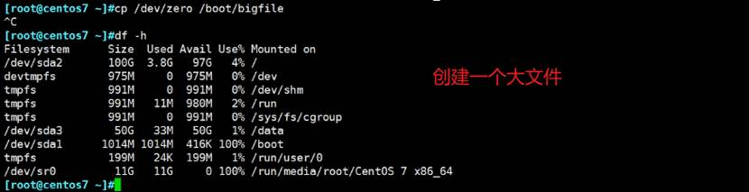

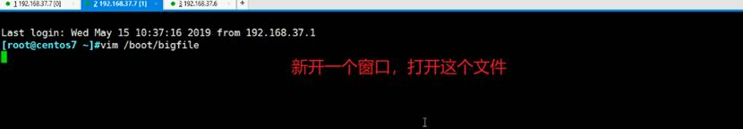

然后删除该文件

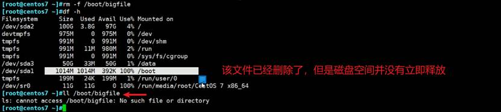

工作中，很多企业会遇到类似的场景，有些分区要满了，硬盘如果要满了，数据写不进去，就会造成很严重的结果，系统会崩溃，对外服务就挂了。

可能一些log日志文件，就删了不能立刻释放，存在这种情况。

 现在关闭之前vim打开的bigfile的窗口

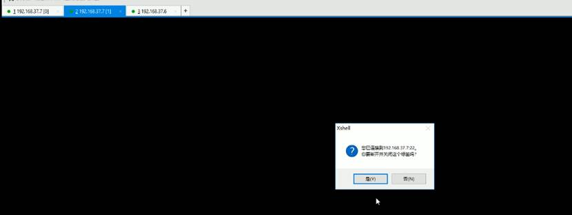

此时空间就释放了

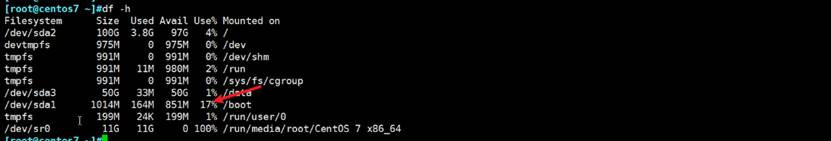

 

 

下面

**>该实验第3遍**

恢复bigfile被占用的情形，就是rm -rf bigfile后磁盘空间不会得到释放的。

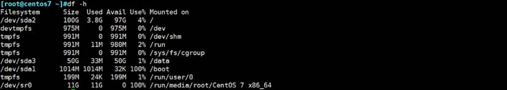

推荐的方法为：> fileName ，就是将文件清空


然后再删除该文件就可以了，整个过程完整截图如下


面试题：发现文件删了，空间没释放，正确应该怎么做，面试常见的答案就是上图。

 

 

rmdir 删除空目录

​    -p：递归删除父空目录，就是从内层外外层删，当删除一个子目录后发现父目录也空了，就把父目录也删了。一直删到根。 # 和mkdir -p相反，mkdir -p是先创建父目录，再创建子目录，删除就自然反着删了。

 

 

 

## 9、rename：改文件名，mv如何改多个文件


rename --help


 


这样就改了，改文件名称，不仅仅只知道mv，还要知道rename。


再改回去（将.bak删掉）

```
rename .bak "" *
```


 

 

练习


第一题的思路，存在一个组合，会想到是大括号的组合用法


 

②第二题


 

③第三题


这样也可以


 

 
