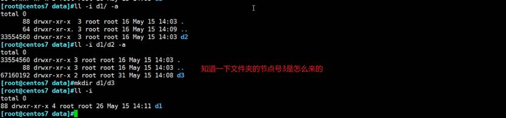
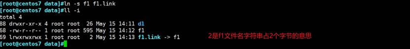
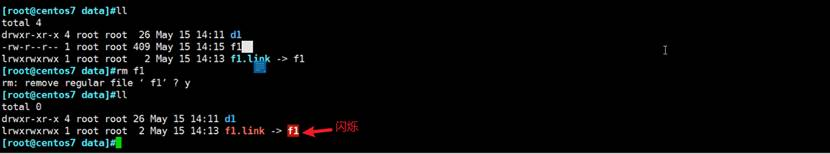
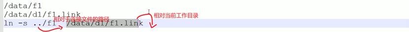

# 第5节. 文件链接

硬链接，在同一个分区的不同目录下

不能针对文件夹

不能跨分区

ll -i查看的连接数是硬连接数，与软连接无关。

 

软连接文件的大小是指向路径的长度决定的

 

软连接的原始文件要写相对于你要创建的连接文件的路径。

写相对路径，你直接复制/data复制重命名其他的，你的软连接一样使用OK。

 

软连接可以针对文件夹创建

 

 

软连接、硬链接区别

1、本质上：硬链接-本质上是同一个文件多个名字；软连接-本质上是不同文件；

2、跨分区：硬链接不支持，软连接支持

3、目录创建：硬链接不支持；软连接支持

4、相互关系：硬链接是相互平等；软连接原始文件删除软连接失效

5、inode编号：硬链接是相同的；软连接不同

6、连接数：硬链接的创建删除会影响连接数；软连接删了这个文件就没了不存在连接数多个的问题。

7、路径问题：原始文件路径：硬链接创建是相对当前工作目录，软连接是相对于要创建的软连接的相对路径。

8、文件类型：软连接时l表示软连接；硬链接就是文件本身是啥类型就是啥。

9、颜色：软连接是蓝色、硬链接看原文件

10、命令实现不同：ln -s和ln

 

 
