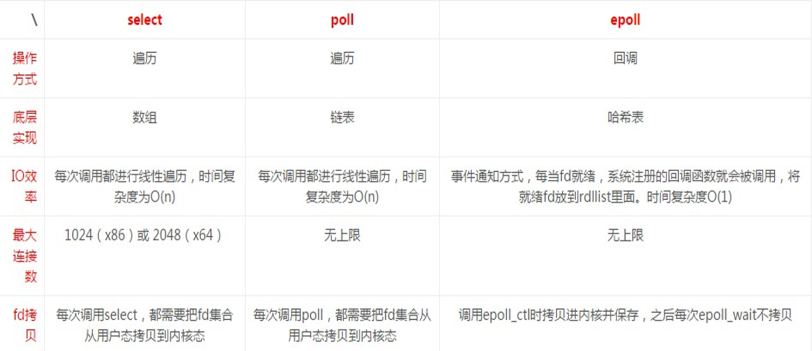

# 第1节. IO五种模型和select与epoll工作原理


 


apache用的模型，nginx都没用


不管多少核，如果负载超过5就算高了--一般是这么认为？


再次了解下PIO和DMA，也就是CPU不再参与大量I/O的处理。

**PIP模型**-数据复制是走CPU的，也就是CPU参与I/O


DMA模型：就是CPU只发送指令控制命令--比如disk复制数据到MEM里，执行者是DMA专用硬件(正在干活的设备)。真正的数据是不走CPU走的。


所以现在基本上，CPU都是不参与I/O。


图中圈圈就是DMA来完成copy的。硬件之间的一个数据传递。


3.copy从内核到用户空间就不是DMA来实现的，而是CPU完成的，从整个角度来讲CPU其实是参与I/O了咯。不对，都在整个大的内存空间里，DMA不参与，然后CPU参与的其实也不算I/O吧应该是。


①I/O是DMA完成，CPU就是下发一个控制指令

②内核和用户空间的数据交互，是CPU完成的

③I/O，是外界设备，比如网卡、磁盘，这些和内存里的内核空间交互

④内存里有内核空间和用户空间

⑤内核里还有socket Buffer和 内核Buffer

⑥网卡将数据送给内核buffer

⑦socket buffer将数据送给网卡

以上是一些关键点，然后再结合看下👇图


看图说话：

1、数据发起：client 网络请求发给网卡

2、数据流转：网卡将数据复制到内存里的内核缓冲区-**DMA**技术

3、数据流转：内核缓冲区将数据复制到用户空间-**CPU转发**，用户空间将数据交给应用程序

4、数据处理：应用程序开始处理数据，根据HTTP的请求，比如GET，去所需磁盘上拿数据则👇

5、数据处理：应用程序不能直接和硬盘打交道，通过system call调用内核去访问磁盘上的数据

6、数据处理：数据从磁盘复制到内核缓冲区-**DMA**技术，再复制到用户空间交还给应用程序-**CPU转发**。

7、数据处理：应用程序构建HTTP响应报文，head+DATA之类，

8、数据流转：构建完毕后数据复制到内存里的socket buffer中。

9、数据流转：socket buffer再将数据复制到网卡中

10、数据流转：网卡再将数据发给用户。

什么，我上面有些不应叫数据处理，应该叫流传，好的，你赢了。

11、数据流转：sendFile技术减少了一部分的交换过程，好像有的吹牛逼叫 "零复制" 技术，其实还有一个内核缓冲区->复制到->socket buffer里的一个复制过程。


12、可能nginx还有其他 "零复制"技术，不仅仅是sendFile技术。


I/O表现为：磁盘I/O和网络I/O，都表现为文件的读取，磁盘I/O就是表现为磁盘上的文件好理解；而网络I/O其实就是socket文件的读取。


**I/O:**

网络IO：本质是socket文件读取

磁盘IO：

**每次IO，都要经由两个阶段：**

第一步，DMA完成转发：将数据从文件先加载至内核内存空间（缓冲区），等待数据准备完 成，**时间较长**，因为要读磁盘，要寻址的。

第二步，CPU完成转发的都在内存中交互的：将数据从内核缓冲区复制到用户空间的进程的内存中，**时间较短**


## I/O模型


要了解I/O模型-据说很复杂的-内核来实现的，就要先了解两个概念①同步/异步②阻塞/非阻塞


同步/异步：

1、这个在mysql里说的是另一回事，是主从复制的同步/半同步/异步。

2、在数据传输的时候，说的是类似军队过桥，步伐整齐划一-危险；和乱步走-安全。落实到数据传输就是

*<font size=2>数据传输的同步和异步是两种不同的方式。同步传输是指发送端和接收端的时钟同步，数据按照一定速率和时序进行传输，保证数据的顺序和完整性。异步传输则是指没有时钟同步，数据按照不规则的速率和时序传输，需要使用特殊的控制字符来标识数据的开头和结尾。</font>*

​		然后L2帧结构就有前导码，这个就是数据传输里的异步模式

3、在I/O里的同步异步，~~上图可能讲的不太到位。同步：调用者等待被调用者的返回结果，才会继续执行原本程序的后面内容；异步：调用者不等待被调用者的返回结果就去执行原本程序的后面内容，等被调用者什么时候通知调用者，那个时候再处理这个返回结果。一般来讲要和阻塞和非阻塞联系起来讲的，不过...继续往下学吧。~~

​		上图PPT应该是对的，同步和异步就指的是消息通信机制，不要和阻塞和非阻塞联系起来，要联系，但是分开来理解，也要联系起来理解。

​		**同步：就是调用者--一般就是程序本身啦，要等到被调用者--一般就是函数，的数据结果。是直接坐等DATA数据结果。是你等到包裹投递到手上 <-------"等-啥事不干就等在那"就是阻塞；"等-不断去问"就是非阻塞。所以同步又分为 同步+阻塞 和 同步+非阻塞**。 同步+非阻塞 就是 等-不断去问，不还是啥也干不了吗，动不动就去问，能干别的事？还不是等价于同步+阻塞了嘛。

​				  也可以理解成：是你在接空中的泡泡落到手上。①手一直摆着接的姿势，此乃阻塞②手会放下，一会抬头看下有泡泡来了就抬手接，所以抬头频率满了会借不到，抬头频率快了也不好，其他事就干不了了，此乃非阻塞。

​		**异步：调用者不是等被调用者的返回数据结果，而是被调用者主动告知调用者结果来了。是被调用者喊过去拿到DATA数据结果。是你等到了门卫喊你取快递。   <-------你无需等待，快递来了有人喊你去取。"不等-干别的事去"就是非阻塞。**同样分为异步+阻塞 ：有人来喊你取快递你还在那边干等着 和 异步+非阻塞：有人喊你取快递，你去忙别的。

​		**所以有没有喊你这个动作就是同步/异步的区分。正是因为同步/异步的情况才需要阻塞和非阻塞的存在。**

​		调用者-应用程序；被调用者-内核。阻塞和非阻塞其实就是调用者还是被调用者谁多干活的问题，谁更忙。你希望谁更忙？在nginx服务中，nginx应用程序和内核，谁更忙好一些，nginx提供服务，使用非阻塞将活交给内核处理，自己本身可以面向更多的用户提供服务，支持更多的人高并发访问。

4、其实还有mysql的logbuffer的机制innodb_flush_log_at_trx_commit，也可以理解成同步机制，同步动作存在于内存(logbuffer/osCache/)和磁盘(logFile)。

5、其实还有ext3日志的写法也是同步概念，同步动作存在于log文件和磁盘文件。

但是4、5不要真的划进去，否则概念界限不清混为一谈反而不美。


### 阻塞I/O模型

思考一个问题：apache为什么解决不了C10K的问题？而nginx可以，这些就涉及底层的工作原理。


recvForm所属的位置：就是一种SYSTEMCALL，通过调用内核来对接Ip+port套接字，来接收数据的，也是应用程序面向身后内核缓冲区进而取数据的接口。


### 同步非阻塞I/O模型


非阻塞I/O模型其实就是，同步+非阻塞的方式，简单讲就是，调用者不断去问被调用者 如上图👆


### I/O多路复用模型


应用程序调用select函数(这是系统调用)，很多访问请求过来，应用程并发调用多个select函数，通过这个函数进而访问内核。

应用程序接收很多访问请求进来，上图app1\app2\app3也许理解为一个app的多个并发请求为好？

应用程序要处理请求，要回包就要构建响应报文，要构建，就要获取响应数据，要获取响应数据就要到磁盘上取，而app不能直接访问磁盘这些硬件，需要通过系统调用systemcall去访问磁盘

 

这里通过select这个系统调用函数去访问内核，通过内核去访问磁盘，取到数据，当数据取到后就返回"可读条件"信号给到recvfrom函数，该函数是面向ip+port用户socket的，它就会将数据从内核空间里复制到用户空间完成响应报文构建进而回给 内核里的socket buffer，再有buffer交给网卡。


返回可读条件 说明有提醒消息有人喊你取快递的，就是异步了。但是该模型受限于select


IO多路复用（IO Multiplexing) ：是一种机制，程序注册一组socket文件描述符 给操作系统，表示“我要监视这些fd是否有IO事件发生，有了就告诉程序处理”


IO多路复用是要和NIO(Not Blocking IO)一起使用的。NIO和IO多路复用是相对独立的。NIO仅仅 是指IO API总是能立刻返回，不会被Blocking；而IO多路复用仅仅是操作系统提 供的一种便利的通知机制(就是异步了)。操作系统并不会强制这俩必须得一起用，可以只用IO 多路复用 + BIO，这时还是当前线程被卡住。IO多路复用和NIO是要配合一起使 用才有实际意义   # 理解这段话，抓住IO多路复用就是有通知就是异步，BIO和NIO就是程序调用函数后阻塞在那。


IO多路复用是指内核一旦发现进程指定的一个或者多个IO条件准备读取，就通知该进程。  # 这不就是异步咯，只不过就是优化升级的异步通知。


多个连接共用一个等待机制，本模型(#这里应该加一个IO多路复用+NIO)会阻塞进程，但是进程是阻塞在select或者poll这两个系统调用上，而不是阻塞在真正的IO操作上。


用户首先将需要进行IO操作添加到select中，同时等待select系统调用返回。当数据到达时，IO被激活，select函数返回。用户线程正式发起read请求，读取数据 并继续执行


阻塞发生点：select调用、poll调用、数据从内核复制到用户空间的过程


### 信号驱动I/O模型


### 异步I/O模型


这个就是全程不阻塞了。


### 总结：五种I/O模型


wait for data👇①          和                   copy data 👇②


## I/O模型的具体实现


说apache并发1W差不多了，为什么达不到C10K，而nginx可以2-3W都没问题，可以就可以在select、poll、epool三种方式上。



遍历就是 数组(linux里数组是列表/字典的统一称呼，列表其实就是下表是1 2 3...的字典） 的一个遍历。

IO效率，拿select举例，就是select遍历操作的时间复杂度O(n)--随着资源越多性能越差，是线性规律。

epoll不是遍历方式，而是回调。IO效率不变都是O(1)。


select存在最大连接数：X86是1024   和 X64是2048  ，这是内核里的自带的FD_SETSIZE就是一个进程最多打开的文件数目，如何在内核文件里找到这个FD_SETSIZE这个文件

```shell
wget https://cdn.kernel.org/pub/linux/kernel/v6.x/linux-6.5.8.tar.xz
tar xvf linux-6.5.8.tar.xz > /dev/null
cd linux-6.5.8
find linux-x.x.x/  -type f |xargs grep "FD_SETSIZE"
```


epoll最优秀，nginx用的就epoll


水平触发LT、边缘触发ET

如果一个文件描述符fd变成就绪态了--比如上面有数据了-比如socket收到一个网络请求这就是fd文件里有数据了。此时就会告知进程哪些fd刚刚变成了就绪态，ET边缘触发就是通知一次；LT水平触发就是通知多次。

LT和ET都是IO多路复用的两种模式，LT模式下，当一个文件描述符就绪时会一直通知进程，直到该文件描述符被处理；ET模式下，当一个文件描述符就绪时只会通知一次，需要进程自己保证及时处理。LT模式下可能会导致进程不断地被唤醒，而ET模式则可以减少系统调用次数，提高效率。


# 零拷贝

mmap技术，是epoll的技术，一般也可以将epoll理解成select和poll的增强版。

mmap也算是一种 零拷贝 技术，之前学过一个sendfile技术。


### 原始数据复制操作


图中copy过程是DMA完成的👇也不是，是copy下半截-从kernel到hardware才是DMA的活，上半截从用户空间到kernel是CPU的活。当然下半截CPU也是发送了控制指令的，干活还是DMA来做的。


有个问题，之前学到就是网卡将数据复制道Kernel缓存里；socket缓存将数据复制到网卡里。不知道是不是这样的。。。所以上图的箭头都是单向的。还需要补上磁盘文件活网络适配器到kernel缓存的箭头咯。


会导致，数据包在用户态和内核态 频繁复制，


### SENDFILE也是一种零复制技术

apache和nginx都支持该技术👇


但是有些场景下sendfile是不推荐的，是不合理的，比如上图的磁盘文件不是本地磁盘，而是NFS挂载过来的，此时就不要用sendfile技术。

NFS挂载过来本质上还是走的网络，按这个说法，不就是一样可以用sendfile嘛，还是说要走过用户空间过一遍NFS协议才能解开数据包？可能是的，也许是这个原因就不能用sendfile了。


### MMAP：Memory Mapping也是零复制技术


映射过来，省去了内核空间和用户空间的数据复制，但是我绝对只是不走文件复制，物理层面还是要走用户空间和内核空间之间的连接的吧，只不过这个连接在都在整个内存里，具体的表现形式是什么？


上图的CPU-COPY是从内核缓存复制到socket缓存，这里将的复制可能正如GPT所说不是文件系统层面的复制，所以要节省很多开销。


### DMA辅助的SENDFILE


因为是内存和硬件网卡的交互，所以是DMA来sendfile了。

然后这种技术是需要硬件支持的，不具备通用性可能。

mmap和sendfile是软件级别的，更加具备通用性。


总结，nginx采用的是epoll，apache使用的是select，所以性能nginx更好，不过要去官网求证一下
