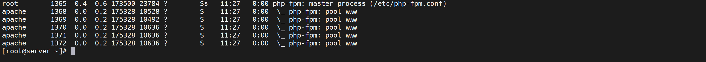

# 第2节. nginx编译安装和功能介绍


## nginx介绍


http://nginx.org


UDP的反代貌似可以用来做内网的DNS负载。

1、场景：用户从两个出口出去，奇数、偶数，分配到不同的出口。但存在奇数和偶数出口对调的情形。

2、DNS：DNS1和DNS2自然也是奇数偶数配置，就等价于两个线路的用户，自然也是和用户一致。

3、1 和 2 就保证了奇数用户有一个DNS1奇数的IP；偶数用户就有一个偶数的DNS2。

4、此时真正需要干的活就只有(上面的都不需要做啥，默认就有了顶多配置飞塔的ECMP基于源IP出去，和两个DNS服务器)；就只有将奇数用户的DNS请求转发到DNS1，将偶数DNS的请求转发到DNS2

5、此类需求之前通过BIND可以实现，但是BIND的负载LB实在太LOW了--因为不支持reg正则表达式，所以无法支持辣么多的IP的奇偶区分，纯手工嘛！我出家吧~哈哈，所以这个需求是否在nginx这里能够得到圆满的解决呢，拭目以待...


nginx的server字段里竟然不是nginx，volt-adc又是啥？nginx.org看看


http://tengine.taobao.org/

http://openresty.org/


都是自家用自家的啊，哈哈


据说追求极致性能的网站可能用这个openresy软件，官网的性能测试可以达到2W。


事件驱动event-driven、异步IO(aio)、mmap和sendfile


apache那会也学习过事件驱动模型，就是多进程里开多线程，线程里有监管和工作线程。


上一篇讲nginx用的是epoll--具有信号驱动I/O模型的一些特点，然后这里又提到aio(异步IO)，问问GPT：👇


### 模块化设计，较好的扩展性

一般就是编译的时候做加减，编译好以后，不对啊，apache好像是可以灵活安装的。当然具体安装可不是简单地在配置文件里补一行就行了的，卸载模块倒是可以注释掉。


模块如果已经安装，那么加载/卸载就可以👆去到配置文件里打开/注释。

模块如果没有安装，就需要安装的


### 支持热部署：不停机更新配置文件、升级版本、更换日志文件

nginx软件升级的时候，用户连接挂着老版本，等用户所有连接访问自然结束自行断开后，就会去连新版本进行业务访问了，所有用户都切到新版本后，老版本的进程就销毁了。  

​                             是不是可以换个说法👇

nginx软件升级的时候，存在新旧两个版本同时对外服务、以及很多当前的"连接"和请求。连接挂着旧版本的不受影响，新请求则使用新版本去服务。等所有"旧版本连接"也就是用户访问结束后，新的连接就转到新版本上去了。等所有旧版本的连接都断开了，就销毁旧版本的进程了。  # 这就是平滑升级了，也可以算到业务层面的一个平滑切换。 # 平滑机1  如果又HA切换的内容就打上 平滑机标签


那会不会存在 用户A的一个浏览器里多个页面访问着新旧两个版本的nginx呢，或者一个页面先后访问了两个版本的nginx呢，其实这个可以测试的后面学到了通过实际测试可以看到，也要通过curl -I xxx去看一下。


不过实际工作中好像是这种，LB后面多个的机器，然后将一台机器下线(其上用户就断开重连并调度到其他机器上去)；然后对其升级，升级后再加入调度，观察用户；

然后就如法炮制一台台升级，仅升级一部分比如说一半的机器，继续观察业务，稳定后全部升级。  # 平滑机2


### 低内存消耗：

10000个keep-alive连接模式下的非活动连接，仅需2.5M内存。

非活动连接：就是连上来了，但是没有数据传输。这个类似AP可以带多少个用户一样，256个其实是非活动用户。

LVS调度算法里有一种计算最短连接，非活动连接/活动连接  比例达到256。也就是一个活动连接对资源的消耗相当于256个非活动连接。这个点我后面整理LVS的时候注意下我是从apache跳过LVS直接看nginx的。

所以nginx可以用epoll来维持上万个连接--非活动连接？，有数据请求过来了--有数据传递了？-从活动连接变成非活动连接？，epoll才会激活服务。  # 其实就是apache里学的mpm event模型类似吧。


## nginx架构


一个主进程+若干个工作进程

一个worker进程，利用epoll监控上万的连接

worker可以对接支持：web服务器，应用程序服务(比如PHP FPM 独立服务监听9000端口)，还支持memcached（提供会话信息，类似redis）,但是没有提到对接redis，将来对接redis如果不能直接对接，也可以通过应用程序来间接对接。比如PHP这个应用程序里面装redis插件模块。session和应用程序相关，让应用程序对接就行了。


作为nginx来讲不需要太多关注应用程序来做的事，apache可能会多做一点类似应用程序要做的事。


nginx通过fastCGI来对接应用程序，而应用程序再去对接session的问题。


proxyCache，就是说nginx支持反向代理的同时也支持缓存。不需要跑到后端服务器上拿数据，直接交给用户就行了。


master管理workers的，load conf，激活woker，no-top update不间断升级。

master复制监听端口，监管worker进程，worker进程负责处理用户请求。woker进程是以普通用户的身份来启动的。master进程应该是以root身份启动的。这一点和apache一样



好像有个一个说法：只有root超级用户才能创建1024以内的监听端口，好像我之前验证过这个说法在rocky-linux里不存在了。


不支持DSO就要编译


worker一般随CPU内核数，几个cpu就配置几个worker。


 


nginx模块从1.9.11开始支持DSO，分为 安装自带的模型模块、标准模块-人工加载的、和三方模块

标准模块也分为 HTTP、邮件、stream模块

stream是TCP的反代，一般来讲HAproxy和LVS在这方面用的多一些，nginx后来才支持，应该也还行的。

可能nginx用的最多就是http的反代、fastCGI的反代较多一些。


说是重点掌握前三个，其实tcp/udp对我来讲才是重点，或者叫情怀，反正比iptables DNAT用起来更舒服，也更加适合给应用运维用或者和他们沟通。还据：说什么LVS做TCP/UDP代理性能更好，HAPROXY做TCP/UDP代理功能更强。好吧~


fastCGI桥接PHP等众多语言的APP、uWSGI是python做的网站(比如django做的网站、flask做的网站)、

https://zhuanlan.zhihu.com/p/354037327      👈简单了解下

WSGI 的官方定义是，the Python Web Server Gateway Interface


源码包；

预编译包-就是yum类的安装


上图的baseurl可以尝试打开看看的，$releasever  就是自己的centos版本，我的是rocky-linux就用centos就行了，然后$basearch就是x86_64架构，也可以缩到前面看整体的


版本也是对的


关掉最新的nginx.repo源，再info看下


可见nginx是在epel源里的，然后是版本也还行。


也可以编译安装，这个用的也很多


简单了解下👇


编译安装实例：👇，与上面的略有区别什么log估计用的就是默认的路径，而模块多了一些。

```shell
useradd -r -s /sbin/nologin nginx

./configure --prefix=/apps/nginx \
--user=nginx \
--group=nginx \
--with-http_ssl_module \
--with-http_v2_module \
--with-http_realip_module \
--with-http_stub_status_module \
--with-http_gzip_static_module \
--with-pcre \
--with-stream \
--with-stream_ssl_module \
--with-stream_realip_module

make && make install

chown nginx.nginx -R /apps/nginx/
```


我这边就用官方的yum源安装1.24.0的了，老规矩yum 后rpm看看


nginx不像apache一样，rpm -ql一看一堆模块，nginx的模块都是直接打包到nginx主程序里了。


虽然也有modules文件夹，但是其实是空的


那么问题来了，DSO这种从1.9.11开始支持的模块都在哪里编辑，从而支持安装卸载的呢？可能就是这里，只不过这里目前是空的而已。


systemctl start nginx后(要保证80没有被占用)，修改一下主页面的内容，无需重启，无需reload，


据说高手不用systemctl启动，哦，牛逼，高手一般怎么弄啊，高手用主程序二进制启动👇恩，真牛逼，受不了。


而且nginx这个启动后默认就是后台启动的。


### nginx源码编译的时候到底加了哪些选项或者模块


你yum也是yum的人家源码编译好的啊，所该段标题描述没毛病。

nginx和httpd检测配置文件的语法


所以好习惯就是，①先检查(nginx -t检查，人眼检查)②再重启服务，你要知道原来服务启动的着，你重启如果起不来影响就大了，原来只是重启一下也就是1秒不到的时间，现在就不止咯。


nginx -T应该是整合所有的conf文件并检查配置，不仅仅是主配置文件里的内容了


差了8行，哈哈，减去2行测试，就是6行，没找到~


找到了，就是nginx -T的两个作用①除了测试所有配置文件以外和-t小t一样的作用②还可以合并所有配置文件，并且在模块开头会注释写明调用的哪个模块，一共6行咯。


## 源码编译安装


也用稳定版

```shell
curl -O https://nginx.org/download/nginx-1.24.0.tar.gz
tar -xvf nginx-1.24.0.tar.gz

yum install gcc pcre-devel openssl-devel zlib-devel

useradd -r -s /sbin/nologin nginx  # 这里有个说法：就是最好统一id，便于管理，比如用户通过nginx上传资源到后端NFS服务器，如果ID不统一，可能权限出问题？不懂！估计具体问题遇到再看了，emmm。。。

cd nginx-1.24.0
./configure --prefix=/apps/nginx \
--user=nginx \
--group=nginx \
--with-http_ssl_module \
--with-http_v2_module \
--with-http_realip_module \
--with-http_stub_status_module \
--with-http_gzip_static_module \
--with-pcre \
--with-stream \
--with-stream_ssl_module \
--with-stream_realip_module

echo $?    # 看下是不是0也就是true，表示configure OK

make && make install   # make -j xcpu个数x && make install   

echo $?

chown nginx.nginx -R /apps/nginx/     # 这条不用加，默认编译安装后自动修改所有者的，除非全是root。


ll /apps/nginx/  # 看看
tree /apps/nginx/ 

ln -s  /apps/sbin/nginx /usr/sbin/nginx  #就一个二进制文件，所以直接软连接就行了

vim /etc/rc.d/rc.local
/usr/sbin/nginx

chmod +x /etc/rc.d/rc.local

```


就一个二进制文件，没必要加PATH变量了，如果是一堆bin文件可以添加PATH，如果是一个就ln -s xx就行了


开机启动👇简单处理，如果要用service可以复制一个yum安装的service文件改改。


修改主页面


