# 第3节. nginx全局配置和性能优化


### nginx的配置文件

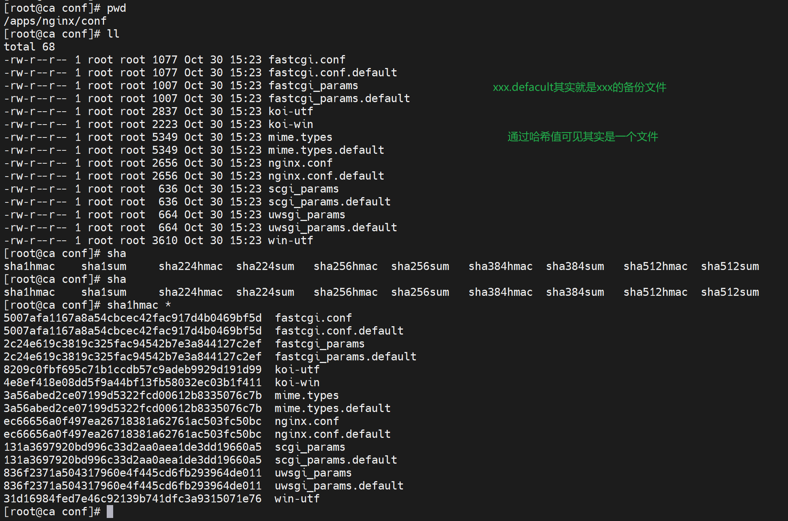


## nginx的配置

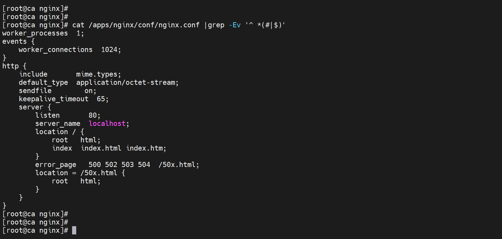


上面一段是全局配置，包括，nginx软件以谁的身份来运行，worker进程是几个，


下面的http打头的段，是泛指http，包括http，已经fastCGI-这个其实不是http但是是web服务也和http相关，所以也放在这里；但是后面做tcp的反代后单独块了不在http块里了。


然后语句里面还有嵌套，就是类似字典里还有字典。不同的指令只能出现在不同的语句块中。

比如上图👆的sendfile on，能够出现在什么语句块里，就需要通过官网来了解


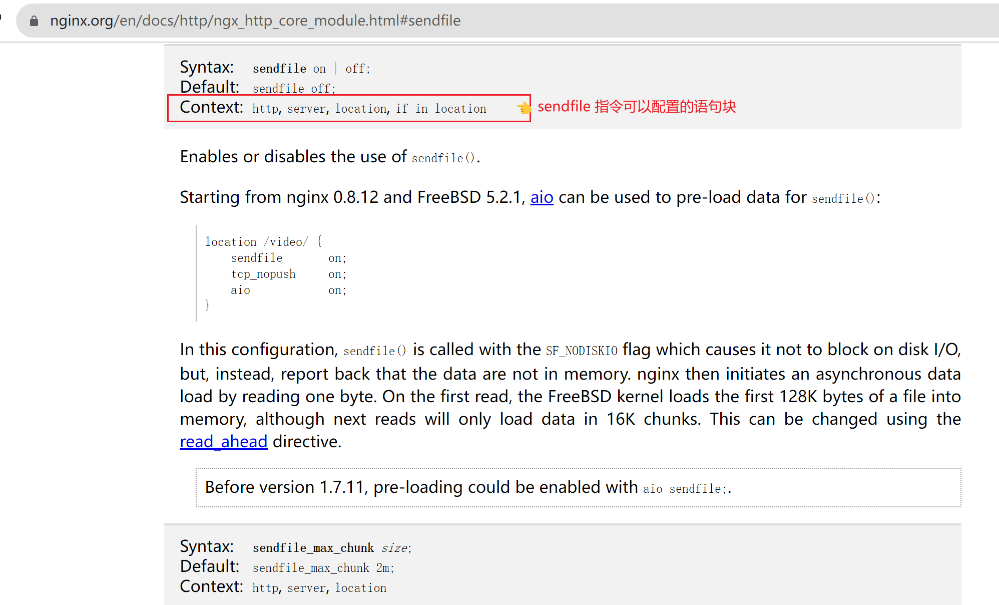

然后配置文件，好习惯其实就是规范配置，是一个网站一个配置文件独立存放的，不是堆在一个主配置文件里的。

yum 安装的 nginx的主配置文件还是有点东西的👇

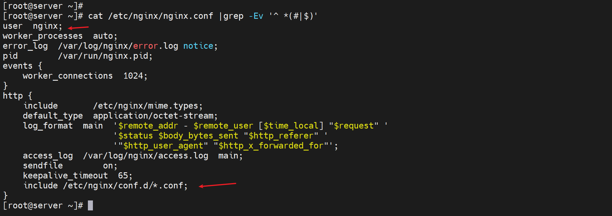

编译安装的主配置文件好像少了的意思👇

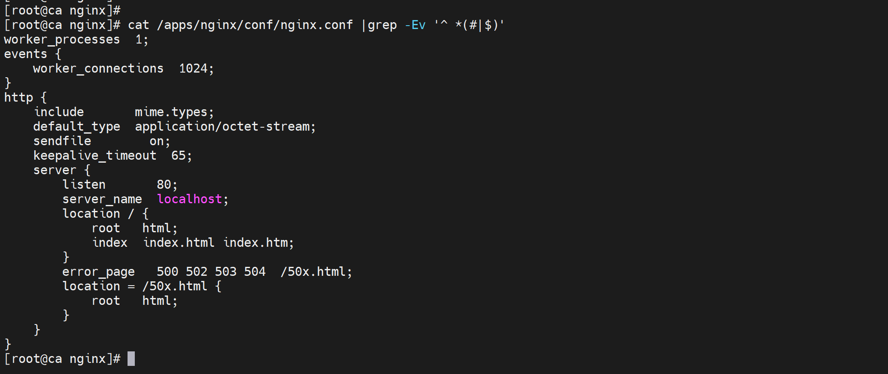


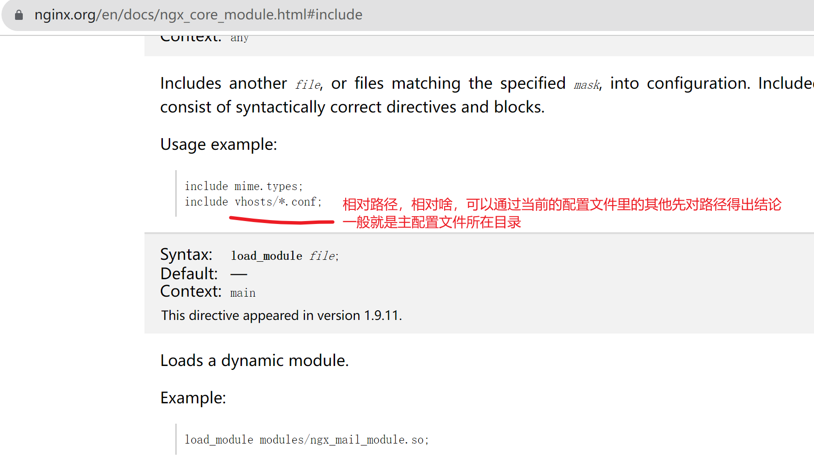


```
cd /apps/nginx/conf
mkdir conf.d
稍后配置文件都放到这个conf.d里

```

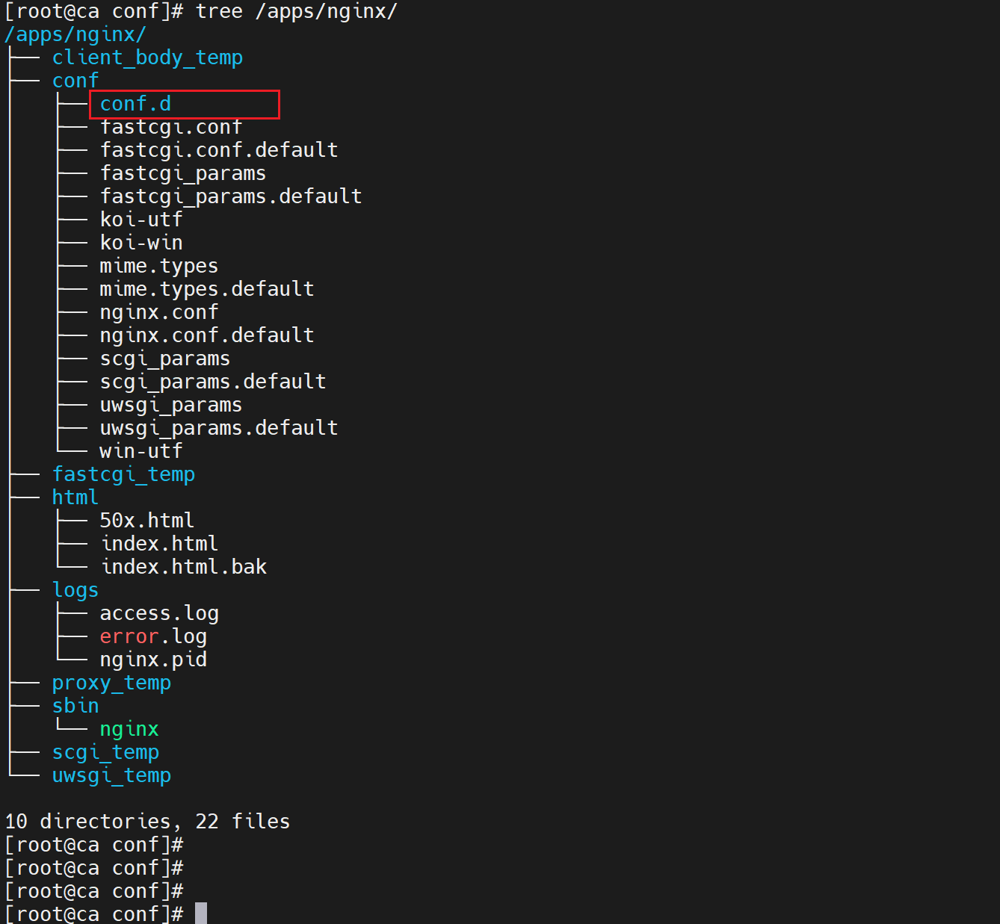


总结PPT


​	


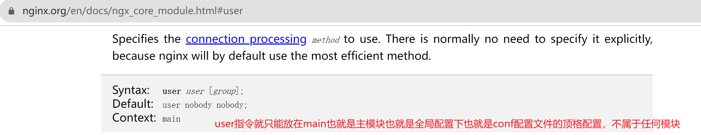

看上图👆default默认user就是叫nobody的这个用户，结果编译安装的时候ps auxf看到的是nginx用户，原因就是编译的时候指定了用户了


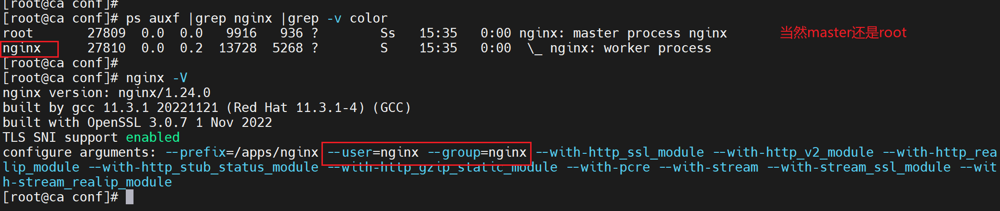


看看yum安装的

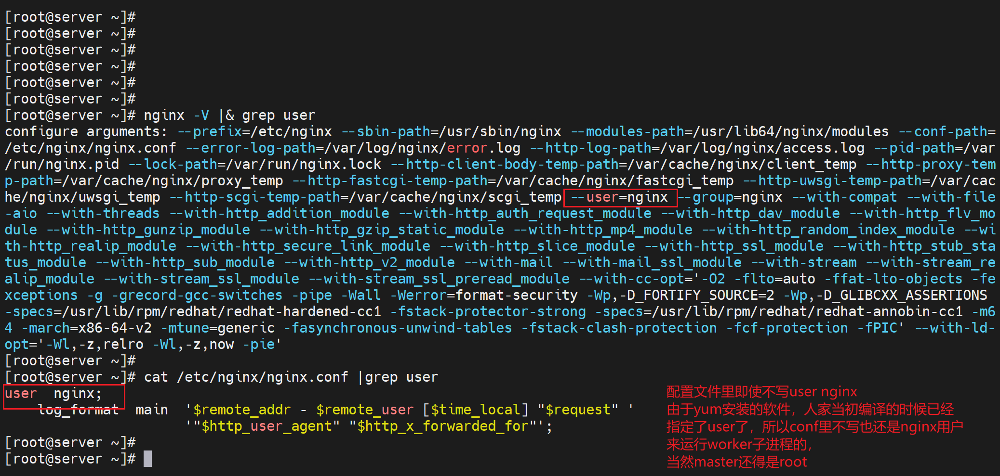


### 看看PID的路径

yum 安装的

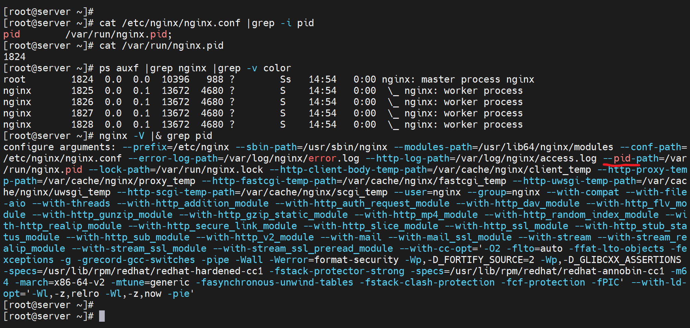

我在想，编译安装的是不是都写到conf里了，应该不是，否则conf不可能那么短的

然后就是conf应该优先于nginx -V看到的配置选项咯，实验过了，是的。


### include包含的文件


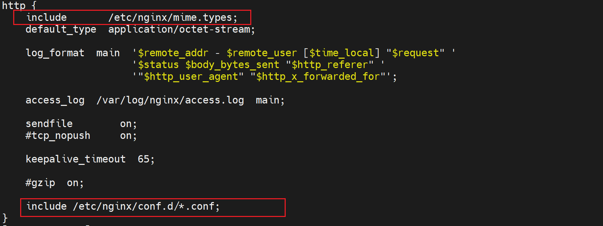


### load_module 模块加载文件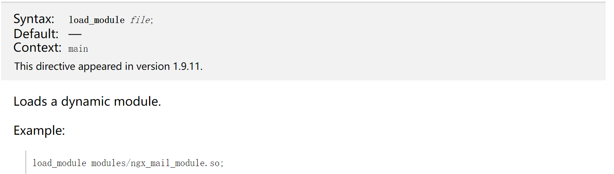


### 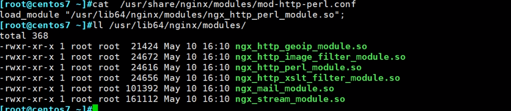


## 下面看看和性能相关的配置


