# 第3节. nginx的压缩和https加密实现

# 压缩

apache也支持压缩

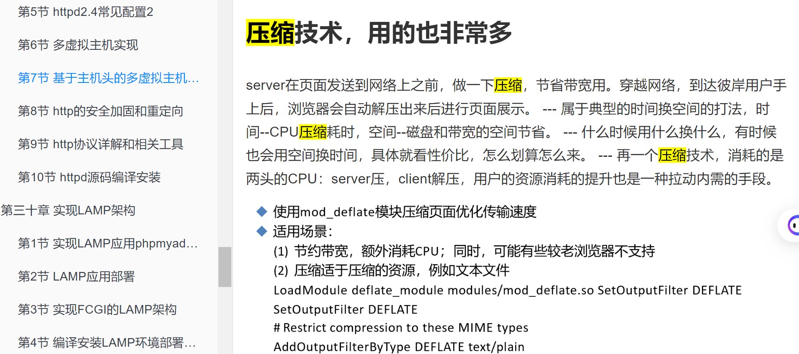

------------------

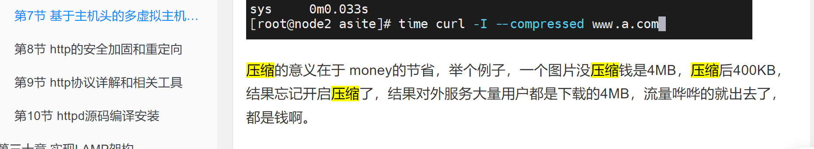

这是👆httpd的压缩篇章

nginx -t查看编译的配置选项

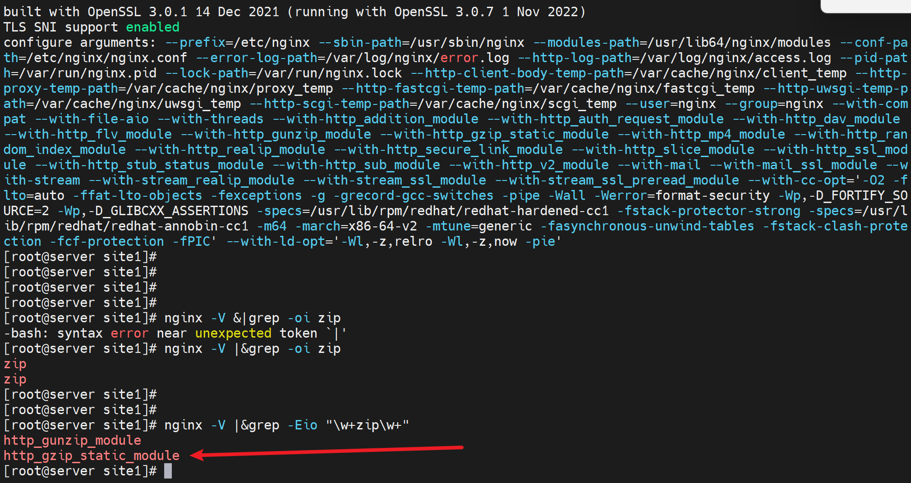

配置参数如下：

gzip on|off  开关

gzip_comp_level level     压缩比修改 1到9，9 最高压缩比，9也是最耗CPU的

虽然是1-9，但是压缩的效果也不会差太多

gzip_disable regex ...     匹配客户端浏览器类型就不执行压缩，比如gzip_disable "MSIE[1-6]\\.";

gzip_min_length length   压缩的起点，什么样的大小才开始压缩，比如＞100k的才开始压缩，100Bytes就别压了，压了也没啥效果。

gzip_http_version 1.0|1.1  是支持的http版本

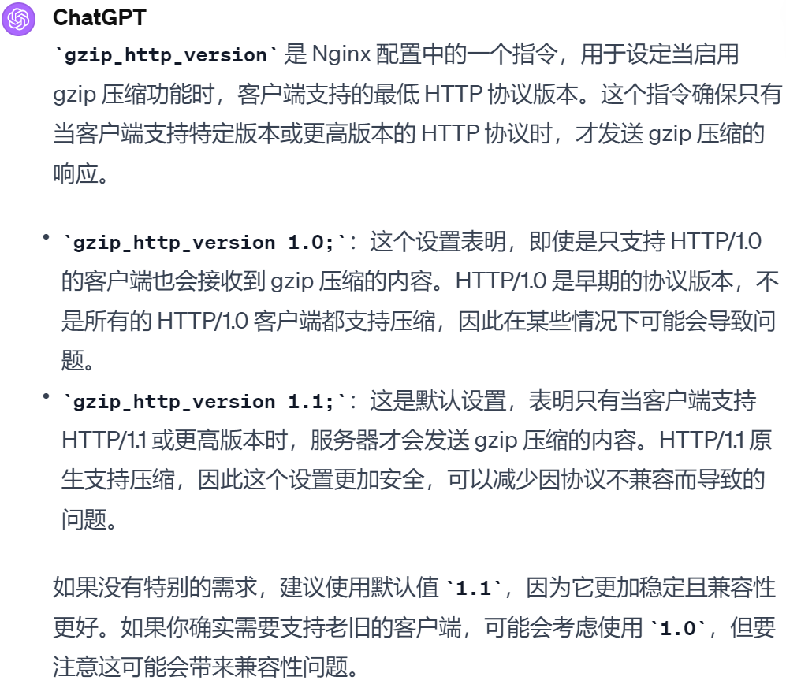

gzip_buffers number szie   压缩的时候启用多大的缓冲区

gzip_types mime-type ... 针对什么类型的文件进行压缩，默认包含text/html的格式支持，不要写，写了反而报错。

gzip_vary on|off   如果启用压缩了，是否在响应报文首部插入"Vary：Accept-Encoding"

解释：👇就是说server要插入这个标记，代理那边就会存储两个版本的web页，一个压缩一个不压缩，以此来响应支持和不支持压缩的client浏览器。当然c-ser直连的话就看client那边浏览器是否支持压缩了支持-server就发送经过gzip压缩的页面版本。

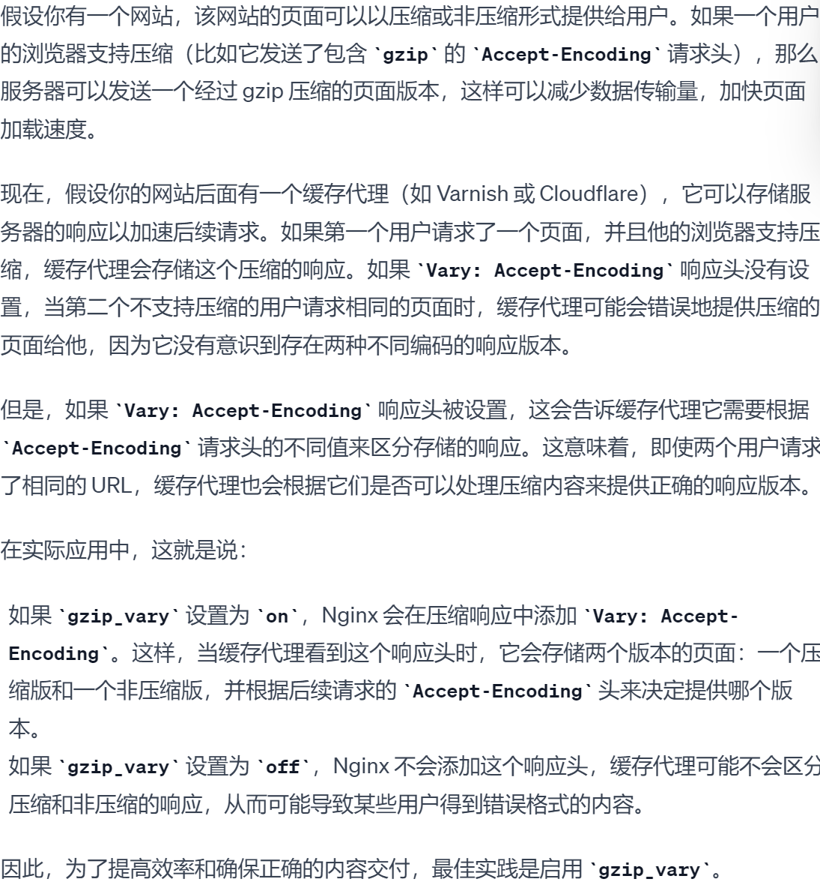

gzip_proxied off|expied|no-cache|no-store|private|no_last_modified|no_etag|auth|any ...;

nginx做反代的时候，后端服务器将响应报文发给nginx，nginx再回给用户的时候，是否启用压缩，就靠这个参数来做的。

off  就是nginx返给client的时候不压缩

expied|no-cache|no-store|private|no_last_modified|no_etag|auth|any ...   后端服务器响应报文中带有Cache-Control字段，然后这个字段里的值 写的是这些的时候，就启用压缩。

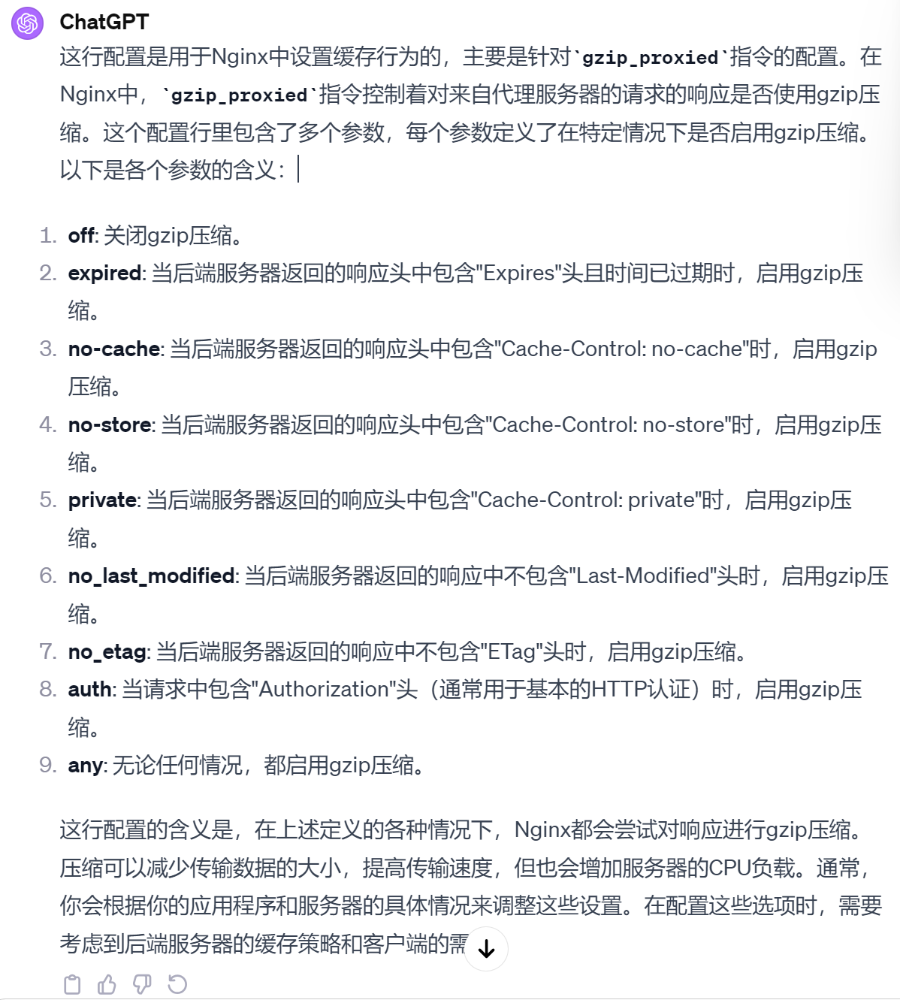

配置下

同样，可以了解下gzip的适配模块

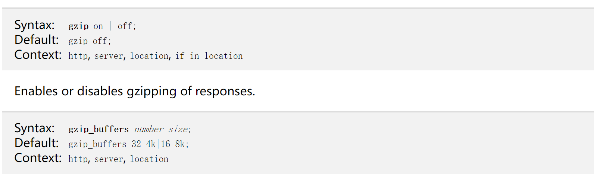

gzip 的总开关 默认就是off的。其他的就是on后的一些选项

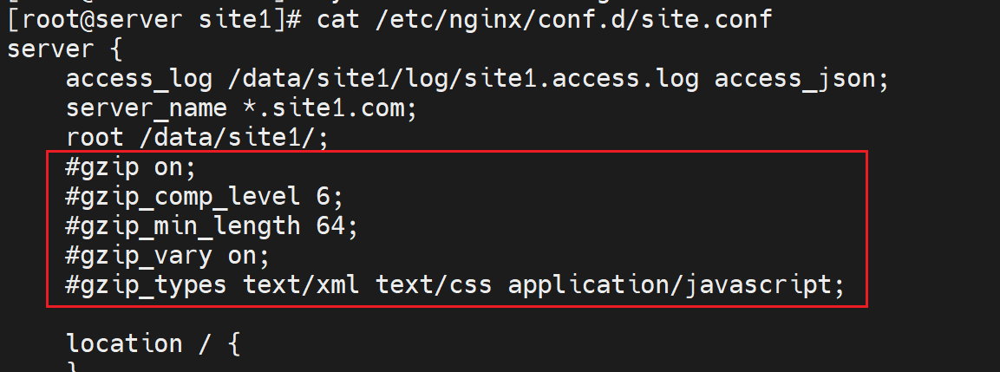

观察这个大文件，看下压缩的效果

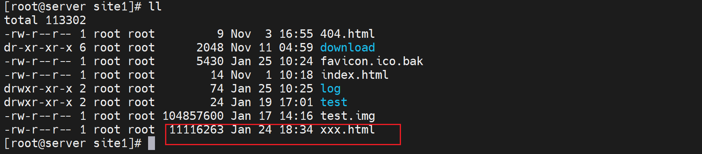

curl可以看到Content-Lenth大小就是文件的大小👇👆

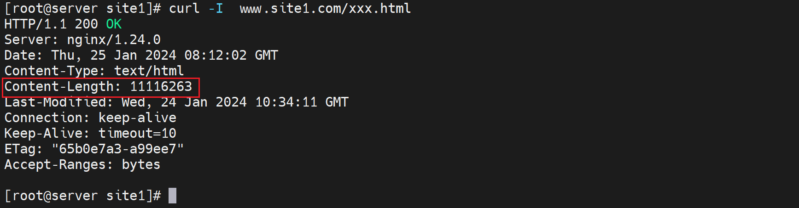

既是curl带上压缩功能，也没有，因为server那边没有开启

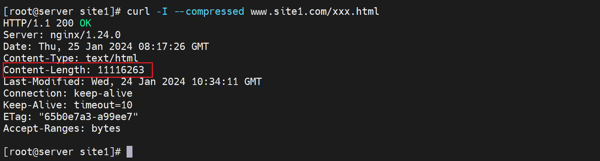

然后server开启压缩功能

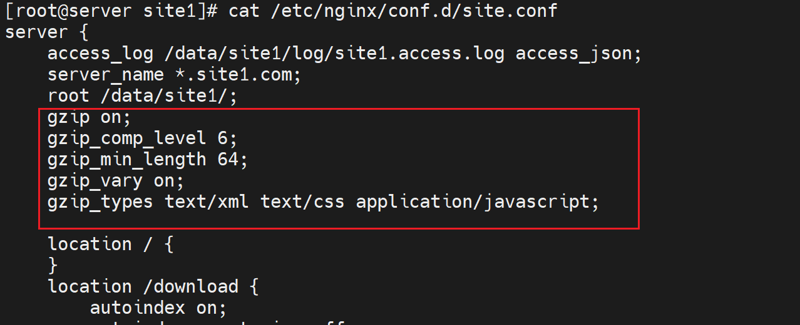

然后curl看压缩要启用压缩功能的，不启用是没效果的

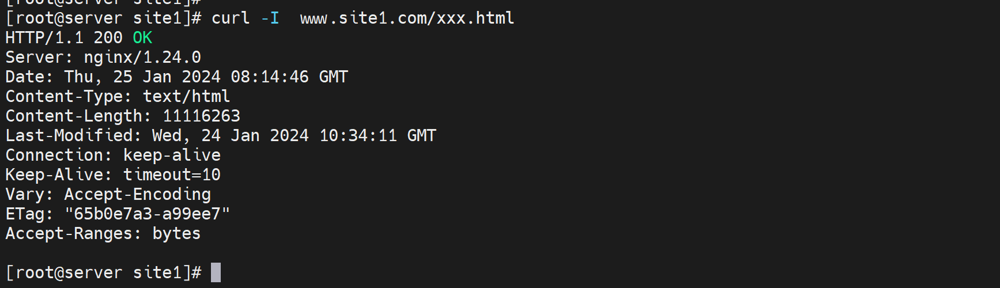

curl带上压缩选项，应该是成功了，只是不再显示Content-Length了。

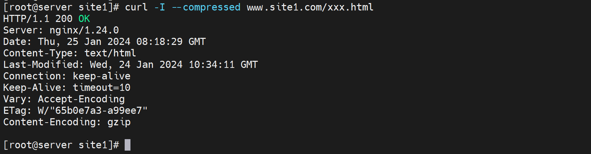

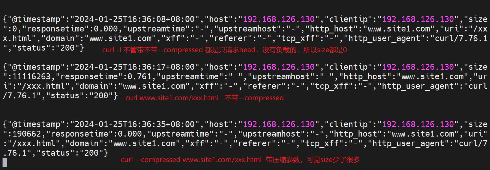

所以说压缩比差不多就行了👇

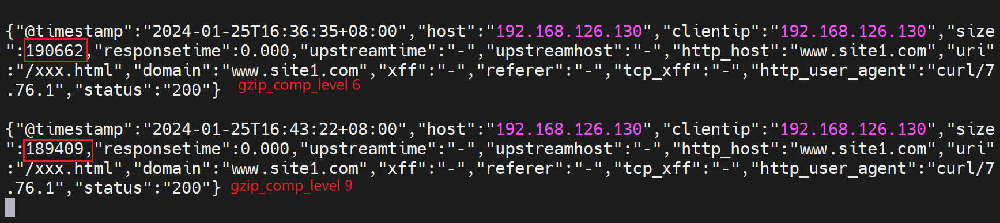

### SSL证书，加密

之前httpd也弄过，自签名证书还挺有意思的，实现了client的安全访问的关键点。

然后购买证书这块的情况

阿里云上有全套的购买申请流程，可以学习下，但是买不一定，需要看哪里性价比高。

apache做ssl，server上是配置3个文件：ca证书、服务器证书、服务器私钥

nginx做ssl，服务器证书、服务器私钥

实现ssl是用的ngx_http_ssl_module模块

**①ssl on|off，   ssl开关，不推荐，建议使用listen指令，和httpd一样 listen 443 ssl**

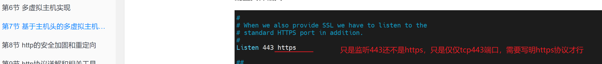

httpd就是listen 443 https ，不是一个意思嘛。

**②ssl_certificate_file** 和 **ssl_certificate_key file**

服务器证书文件和私钥文件；从供应商购买后会得到两个文件，一个服务器证书文件，一个私钥key

**③ssl_protocols**

支持的ssl加密协议，默认就行了

**④ssl_session_cache **

加速服务器响应速度的吧应该是，

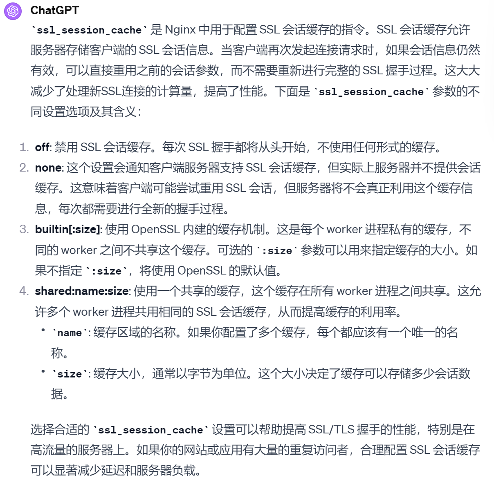

**⑤ssl_session_timeout **

客户端链接可以复用ssl session cache中缓存的有效时长，默认5m

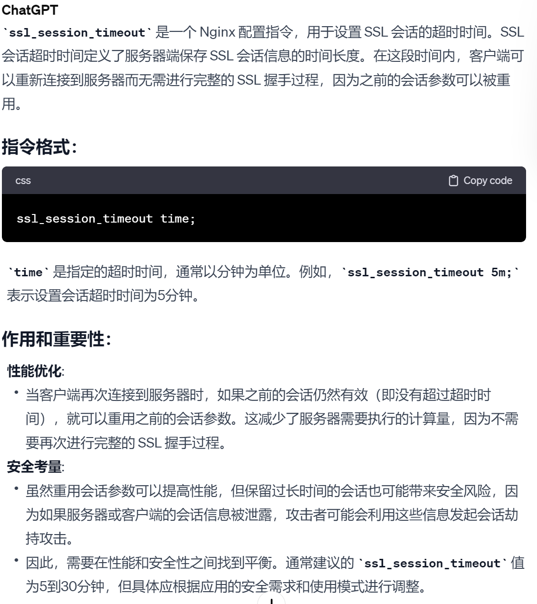

## 下面开始实验

还是使用自签名证书咯

