# 第5节. nginx反向代理实现


# 防盗链

盗链就是一个网站调用另一个网站的资源


**构建盗链**

site1站点盗链site2站点里的一张图片


这是两个之前做的站点👆就利用这个现成的做实验


这就实现了盗链，


很明显存在两个问题①乱码②图片不能缩放了，


这是site1和site2 log 合在一起咯，盗链行为其实是，站在被盗方的角度去防止，所以log拆开来，去开被盗站点site2的log


可以看到的，所以就可以防止盗链行了的


**防止盗链的解放方法：ngx_http_referer_module模块来弄**

大体意思就是先定义出哪些是合法的referer，比如百度过来的referer说明你广告费没白出。

两个参数

**valid_referers none|blocked|server_names|string ...;**      # 用来定义合法referer的值的

**none**：就是referer为空 判断为合法。一般直接访问某个网站referer都是空的。自然要写none的。


none在浏览器里F12是看不到的吧


**blocked**：就是referer里写的东西不是常规的uri，这个没见过还


**server_names**：本网站内部跳转的，就会在referer里带上自己的主机名，都是自家人啊。


**arbitrary_string**：任意字符串，用通配符的方式。


**regular_expression** ：也是任意字符串，用regex来做了，格式就是~开头代表regex。

​																		例如：        ~.*\.site1\.com


配置防盗链肯定在被盗站点上配置了👇

```
    valid_referers none block server_names
    *.site2.com site2.* ~\.site2\.
    ~\.google\. ~\.baidu\.;

    if  ($invalid_referer)  {
         return 403 "Forbidden Access";
    }

```


然后如果是从baidu跳过来的就不禁止访问，因为十有八九就是广告的钱啦👇

测试：修改site1为baidu


修改本地hosts文件

C:\Windows\System32\drivers\etc      下👇


上图配置是不行的，因为http://www.baidu.com/daolian.html是80跳443的也就是跳到https://www.site1.com的，


然后就会去访问https://www.site1.com/daolian.html

然后图片的访问里就有


这样就不是从www.baidu.com跳过去的了，

测试的话倒不用改配置文件，直接访问https://www.baidu.com/daolian.html

这样就可以了，


当然这里ssl不安全的原因也很简单啊，就是域名和ssl里的 备用名称一致。


如果就要实现http://www.baidu.com/daolian.html能够打开呢

可以，单独写baidu就行了


# 开始学习nginx的反向代理咯

正向代理后面也要学习，应用在比如手机的ssl报文抓包要抓到内容的，做ssl解密的。后话这里记一下~


据说nginx的反代还可以做健康性检查，这点比LVS强，LVS好像没有健康性检查，据说哦。

而且nginx可以做应用层和TCP层的反代，不过速度没有LVS快据说。LVS好像工作在内核层的？


**模块支持**


1、proxy、fastcgi、uwsgi这些都是http类的，所以名字都是ngx_http开头的。

​		1.1 、 proxy就是nginx对接http原本协议、fastcgi就是nginx对接php协议、uwsgi是nginx对接python协议

​				1p.1.1、编写动态页面，可以用PHP、python、java、

​							对于java，如果后端是一个tomcat类似的，这个就用ngx_http_proxy_module来支持了。


所以：

​		前后端是java-tomcat之类，就用ngx_http_proxy_module了

​		前后端是python，比如jango，就用ngx_http_uwsgi_moduel了

​		前后端是php，就用ngx_http_fastcgi_module了


ngx_stream_proxy_module就是tcp的反代，不知道是否支持udp哦/

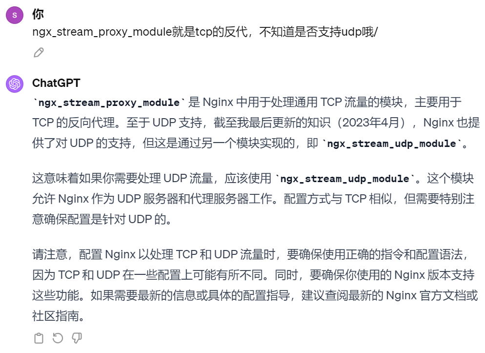


### 反向代理分为同构和异构

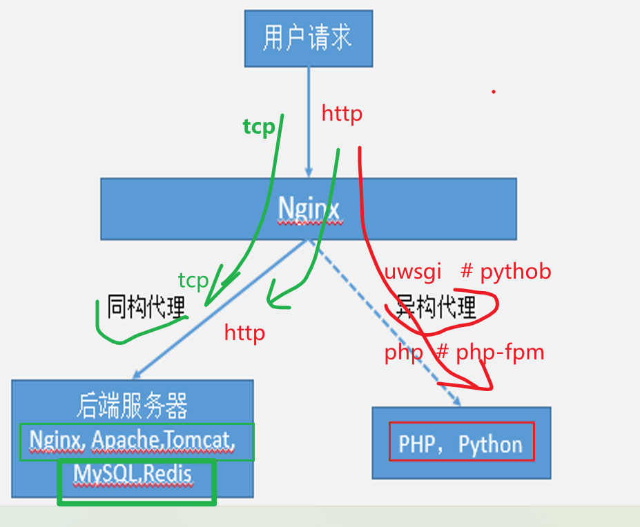

异构、同构，就是client请求的协议和nginx身后的协议是否一样。

用户请求，可能是浏览器的80/443，也可能是mysql的客户端3306。


### 一个应用场景

就是程序员还是喜欢把ip地址写死在代码里，所以就让他们写成nginx的反代IP，然后后面的DB也好服务也罢这些IP可以变动的，反代IP相对固定唯一区分端口就行了，除了这个点，还有个好处，就是代码里可能都是也给nginx的IP然后端口区分就行了，即使nginx反代IP多个也是统一在nginx上的相对集中便于管理的。


### 一个简单架构

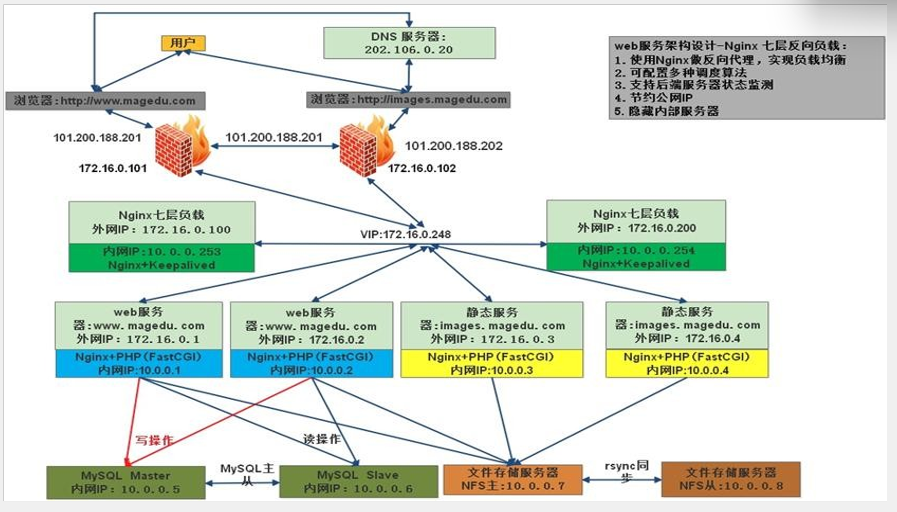

很正常的一个操作：就是image和网站，也就是http://images.xxx.com和http://www.xxx.com分开来部署的。

上图的http://images.xxx.com将来就只放静态图片，静态资源。很多网站都是这么部署的。这样也是就是不同资源在不同服务器上，也能实现并行下载的效果--因为一个浏览器向同一个域名发起请求最多支持5、6个。也就是说一个网站里放5、6个资源顶多再多也就是要二次请求下载了。而拆成多个网站就并发效果好。而且我认为拆成多个针对多个用户也是并发效果更好吧应该。


上图架构说明：

1、用户访问域名比如http://www.xxx.com里面涉及的图片就是其他站点URL了。网站域名就解析到左边的FW的公网IP，图片域名就解析到右边的FWIP，这里显然不是最佳实践，最佳实践是CDN的动静分离。

2、然后FW做DNAT映射到后面的VIP，这个里的VIP可以是LVS来做，然后LVS做TCP/UDP的反代，然后HTTP的就走TCP反代到nginx，再由nginx进行反代。这样无非就是四层的流量会走内核LVS快一点，但是其实HTTP就会多了一层LVS，所以这里可以将LVS和NGINX并排做成一个层级的，LVS给TCP/UDP服务，而nginx給HTTP服务。

3、fw的ha，fw自身解决，比如HSRP，比如juniper的nsrp。

4、lvs和nginx的ha就是依靠通用协议keepalive。

5、反代(lvs/nginx)接收vip进来的流量负载分担到身后内网的服务器，比如web网站这种动态资源站点比如image这种静态资源站点。

6、服务器本身还会去后面找DB，DB还需要做集群，这样可实现HA；或者用读写分离，如果是读写分离就是前置调度器，而调度器也要HA，同样读写分离调度器2个也需要用keepalive做HA的。

keepalive是一个通用的东西，实现浮动IP都可以用。

7、静态页面可以用NFS服务器挂一下就行了。然后用rsysnc+I notify来实现实时备份。https://cloud.tencent.com/developer/article/1373541


## 具体实现

### ngx_http_proxy_module模块反代

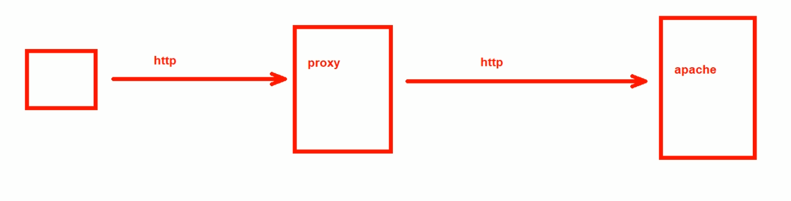

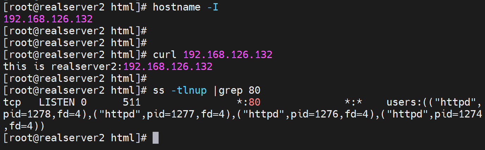

做反代在192.168.126.132上配置👇

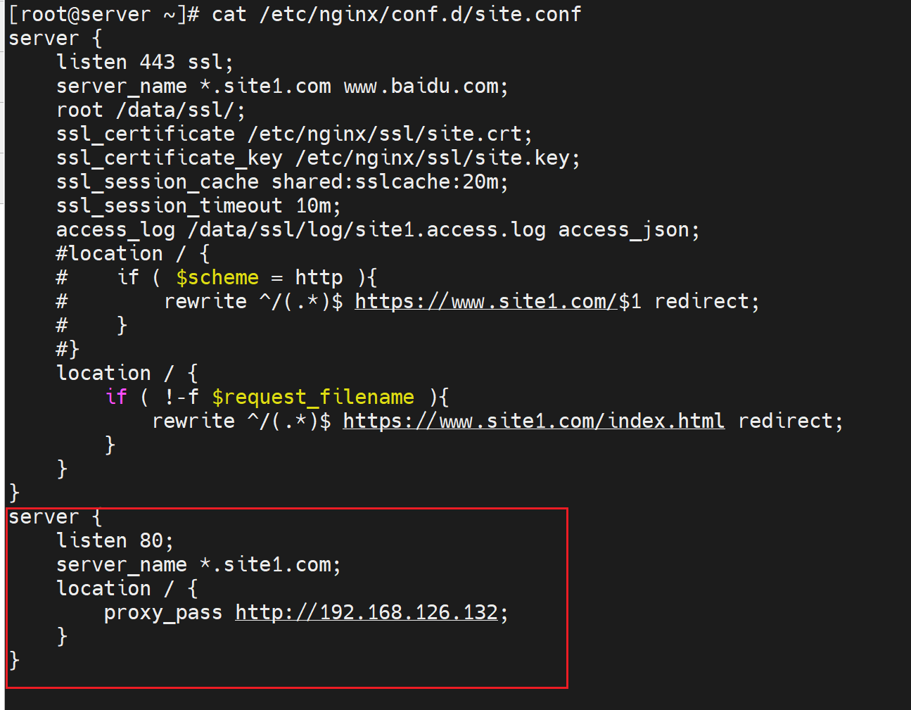

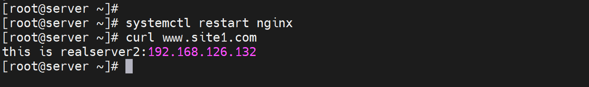


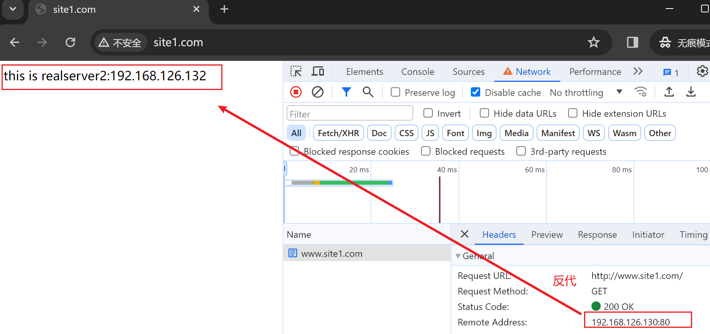


反代对于用户来讲，是看不到真实的server IP的；


后端服务器认为是谁在访问呢

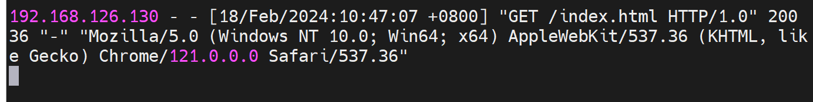

调度器也就是反代nginx上肯定是可以看到真实的用户IP的👇

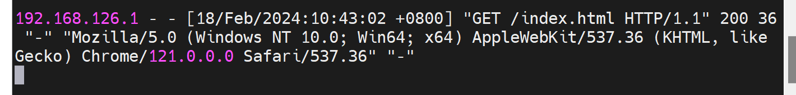


看下telnet www.site1.com 80的效果：只有192.168.126.130上也就是调度器上由TCP连接

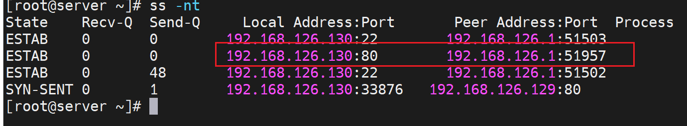

后端server192.168.126.132上是没有的

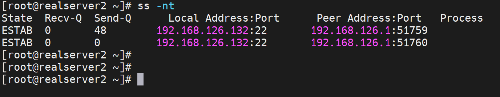

原因就是，nginx的反代写的的http而不是telnet，人家是看协议的。


telnet测试http的方式👇，可见请求后没有断，应该能说明反代和后端都支持长连接吧。

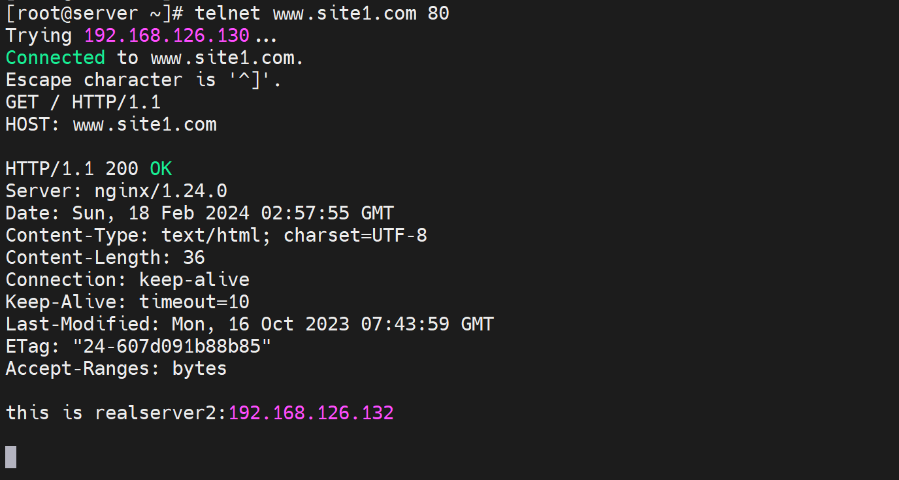

反代上的log👇

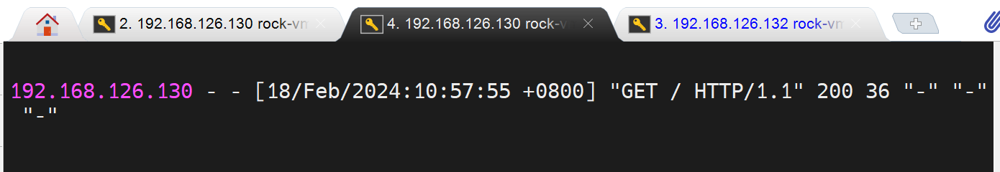

server上的log👇

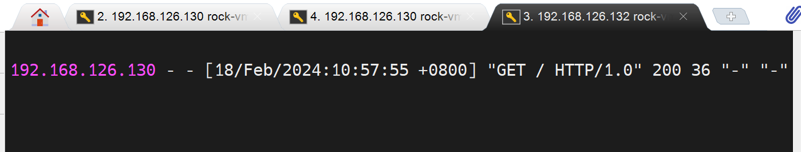


### 针对特定的文件夹(uri)进行反代调度-动静分离

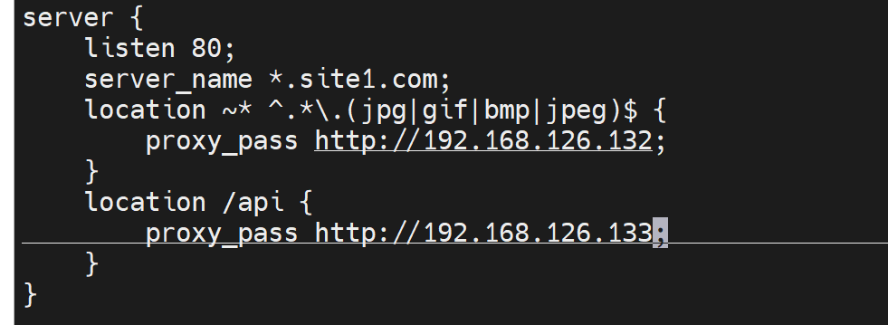

相当于动静分离了👆只要是图片后缀的就调度到192.168.126.132上，只要是api路径的就调度到133上

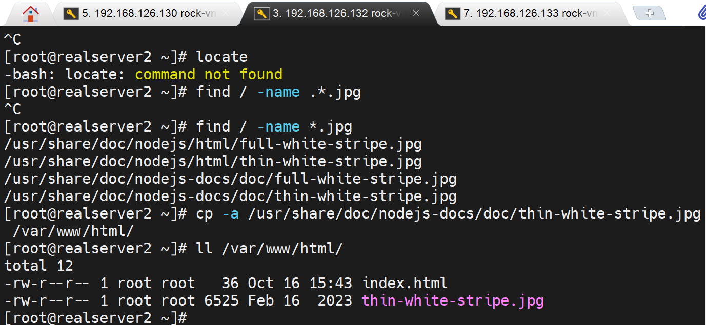

搞个图片👆

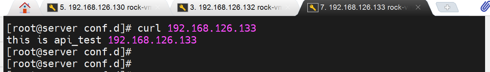

👆133的页面内容，但是反代里写的是

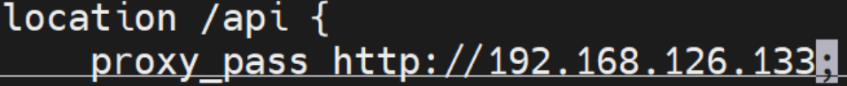会导致访问http://192.168.126.133/api，而该文件是不存在的。

所以创建所需的文件夹api，

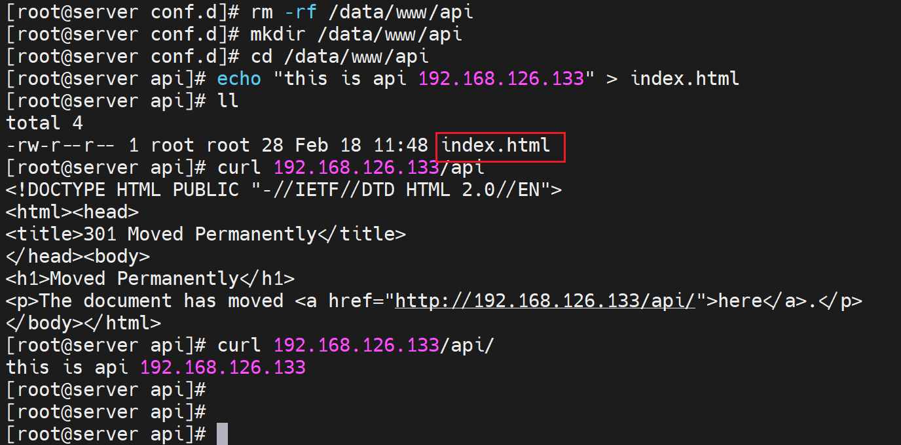

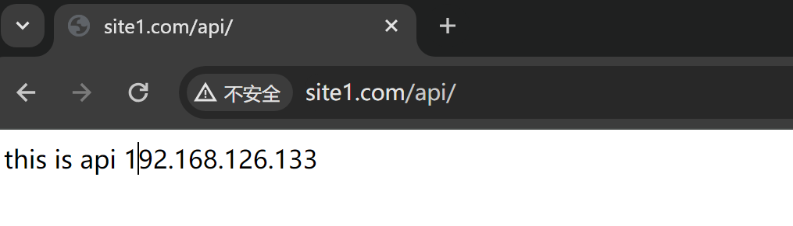


或者api干脆就是个文件也行

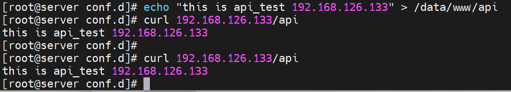

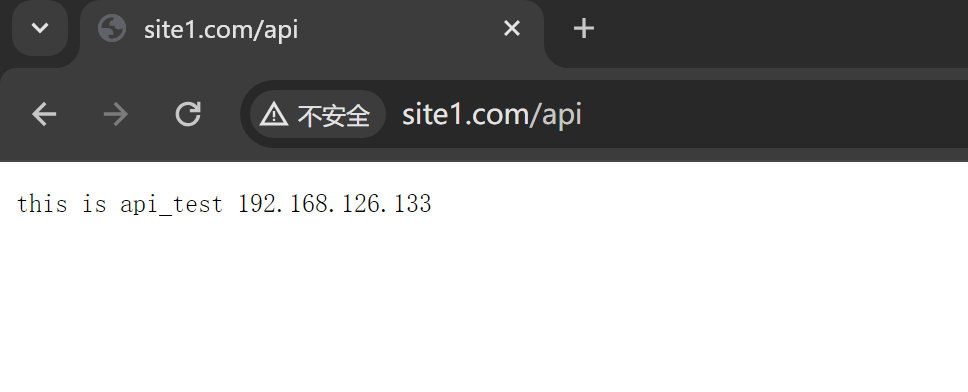访问图片的就会调度到192.168.126.132上👇

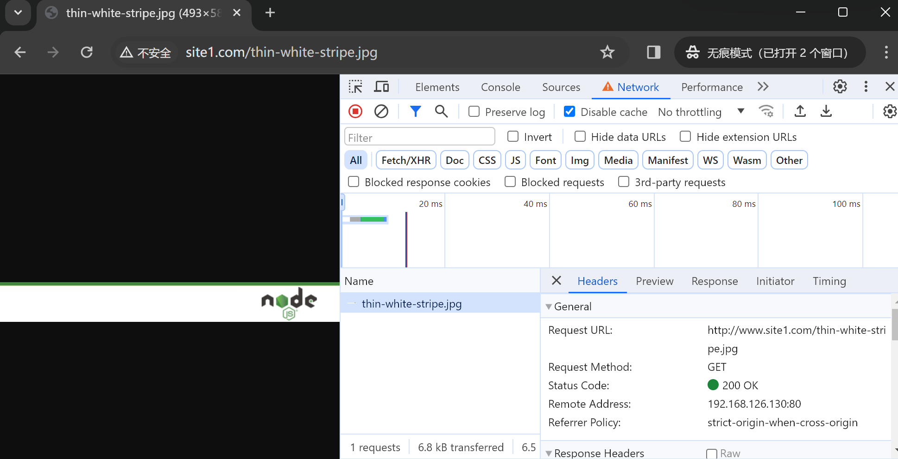


注意

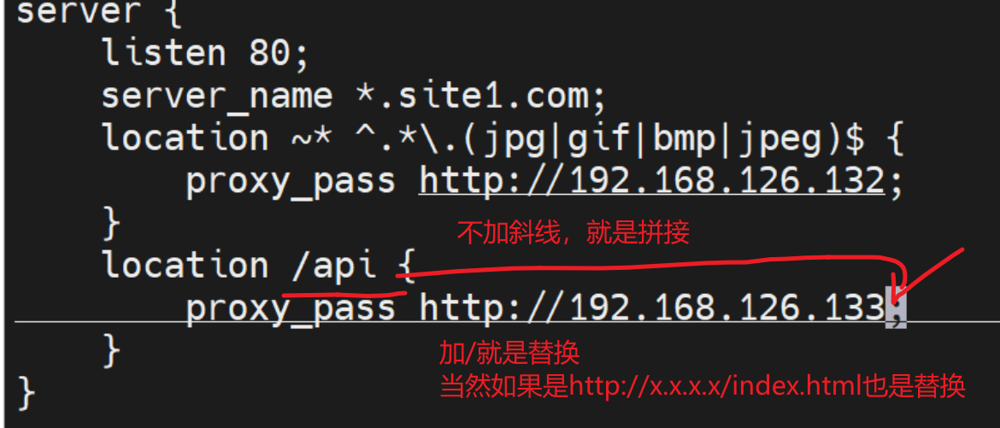

如果写成

```
location /api {
	proxy_pass http://192.168.126.133/    # 实际访问的就是http://192.168.126.133/index.html了，此乃替换。
}
location /api {
	proxy_pass http://192.168.126.133    # 实际访问的就是http://192.168.126.133/api；或者是http://192.168.126.133/api/index.html 此乃凭借
}
location /api {
	proxy_pass http://192.168.126.133/index.html    # 实际访问的就是http://192.168.126.133/index.html。此乃替换
}


```

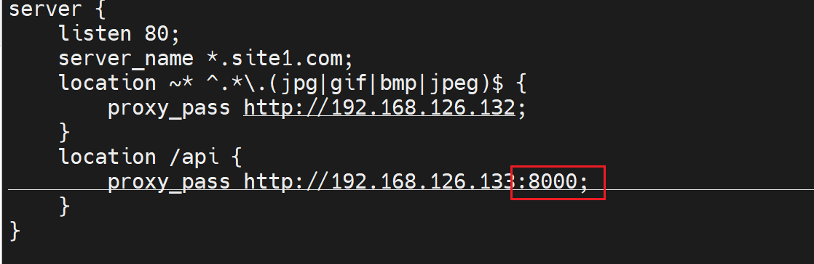


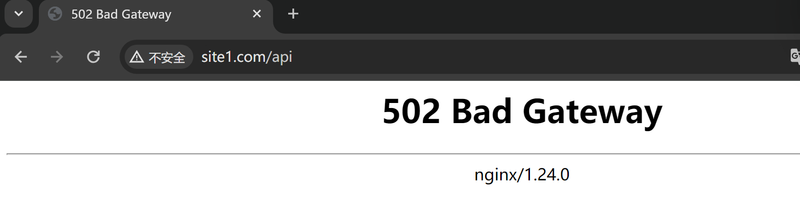

修改后端服务监听的端口

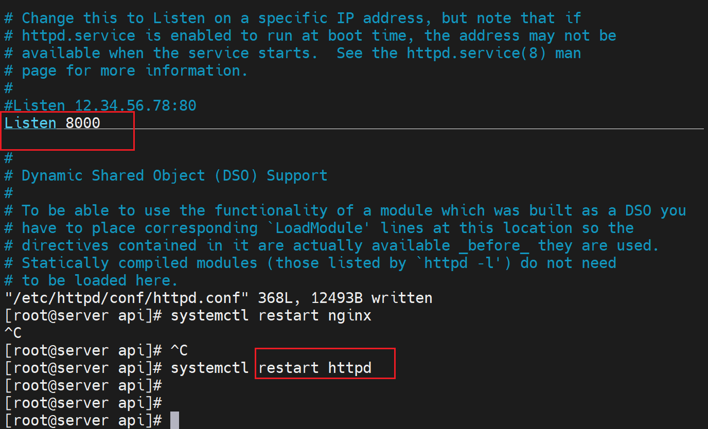

好了👇

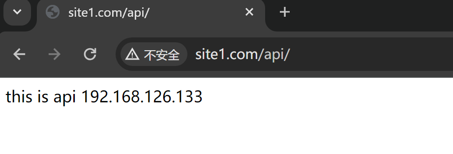


如果server那边用iptables drop，没有响应会导致tcp三次握手都失败，而且是没有回应，这样client端看到的就是504报错。


所以502和504的区别：502server可能没有监听倒是会明确告诉你一个信息的，504就是超时了。


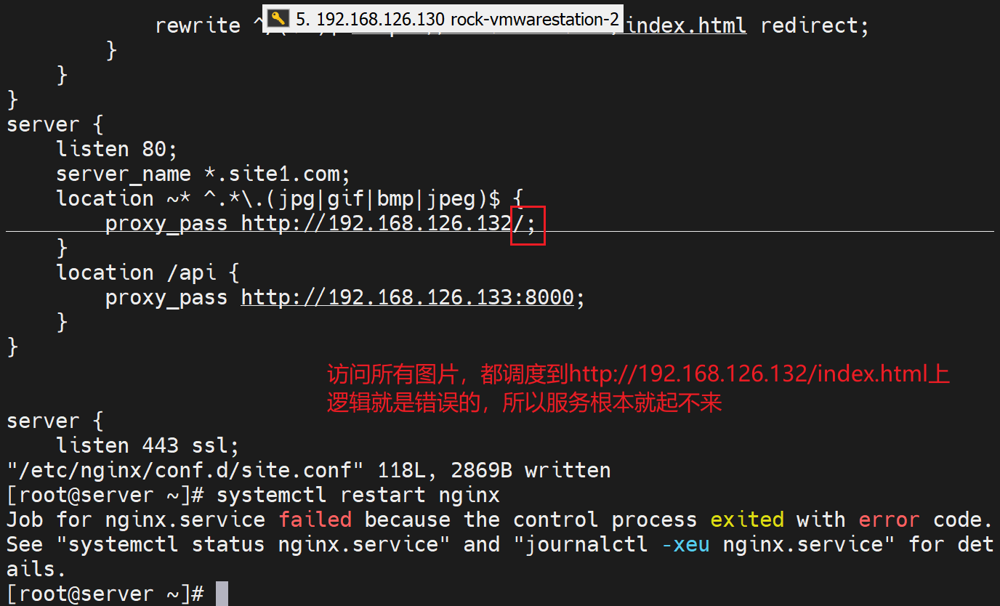


以上就是实现了初始的调度，但是调度还要涉及 健康检查和往健康的server上调度的功效。


