# 第1节. nginx反向代理缓存和IP透传等功能


之前一节，接触了反代，但是发现两个问题

1、用户ip没有真实的反映到后端服务器上

2、调度没有真正的实现


# 如何让后端服务器得到真实的用户IP


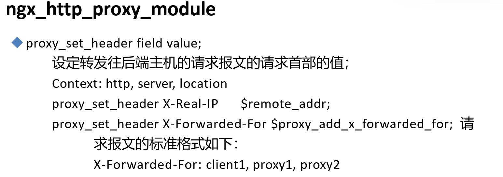

nginx反代的数据交互4个过程，②和④nginx是可以修改的

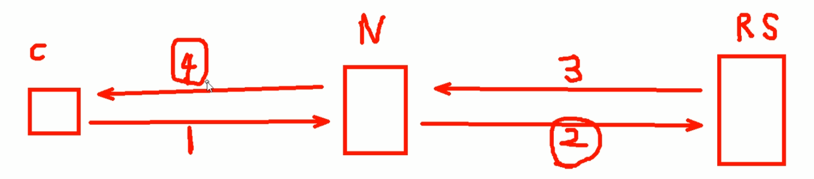

要实现RS(real server)也能获得真实的c(client)的IP信息，可以将这个信息在nginx上添加到请求报文的头部里通过②发个RS。


关于请求头，除了浏览器自己加的东西，也可以自定义一些(nginx 反代的时候或nginx做server的时候或者httpd做server的时候都可以吧)。

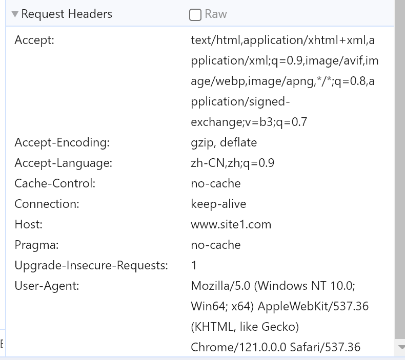

这些都是键值对，nginx上自定义 添加什么key:value都是可以的。

**proxy_set_header X-Real-IP $remote_addr;**

X-Real-IP自定义的键，值就是用变量$remote_addr，这个在配置log格式的时候就见过的

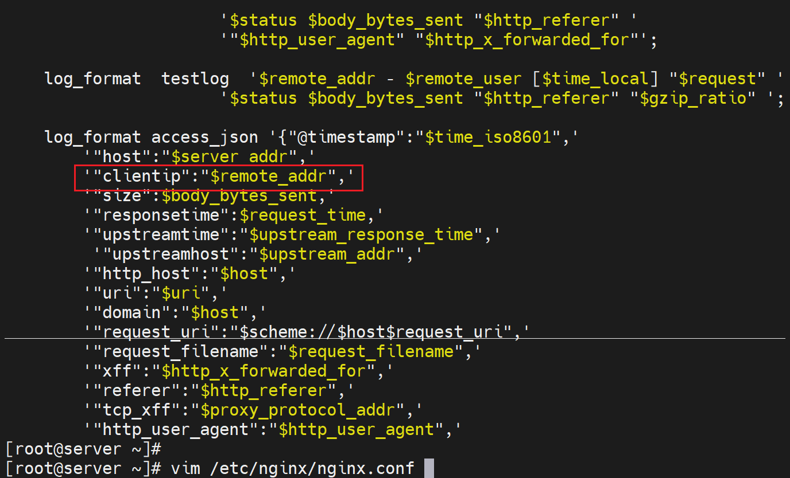


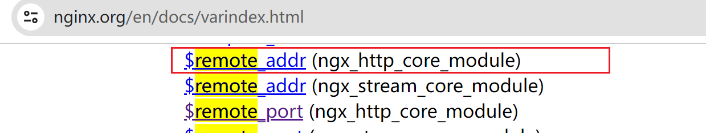

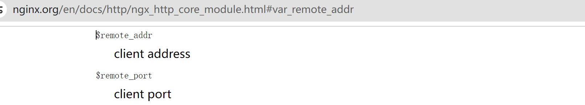


然后key的配置位置，http、server、location都行，我们就放到location里

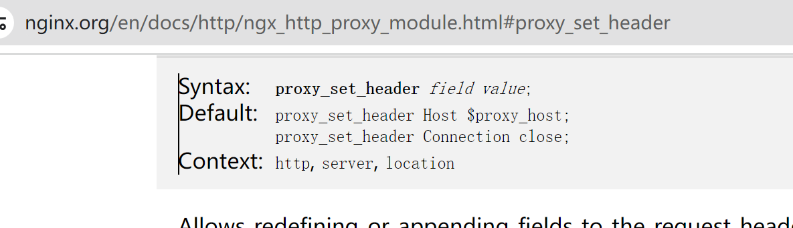


在反代nginx也就是192.168.126.130的nginx的配置中定义一个key，并使用remote_addr变量作为value👇

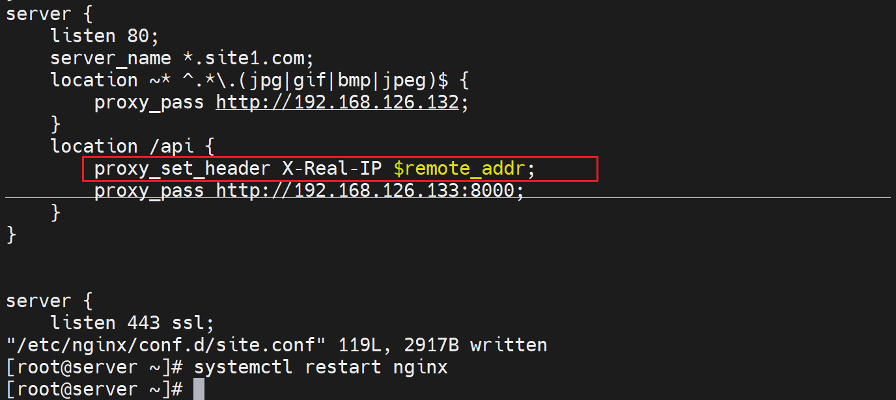

这样配置以后，只是添加了head头部里的一个叫做X-Real-IP的key，value是client ip，要想real server也就是后端真实的服务器记录实际的ip，还得修改对应的log字段吧。否则默认也是看不到的。

在后端服务器上，这里就是192.168.126.133上 的httpd配置中log里调用该变量。

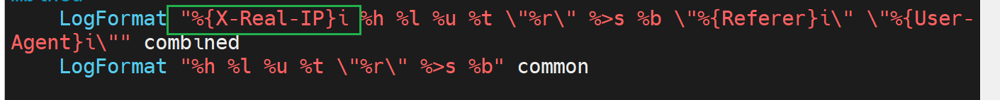

固定格式 %{xxx}i

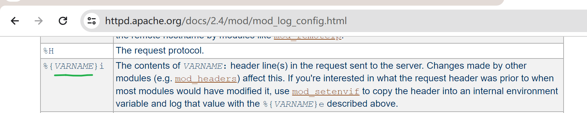


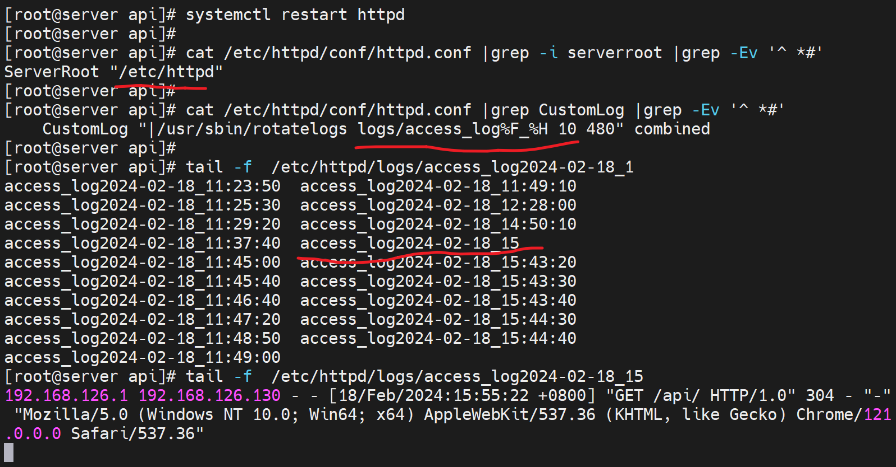

其中192.168.126.1就是真实的用户IP，儿192.168.126.130就是nginx反代。


这个X-Real-IP是自定义的，随便写的。


### 如果存在多级代理，remote_addr不好用了就

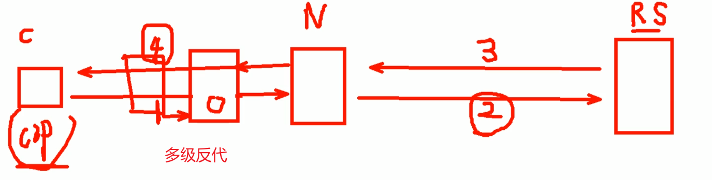


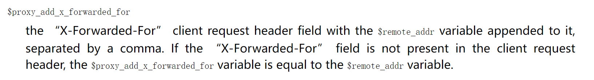

注意这里有一个变量教X-Forwarder-For，然后没经过一次反代，就会添加到proxy_add_x_forwarded_for变量里，类似列表的append。

第一个加进去的就是真实的客户端IP，然后后面的都是反代的IP。

类似这样：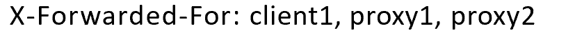

然后X-Forwarder-For也是自定义个的名称，随便换名字都行；关键是后面的$proxy_add_x_forwarded_for是固定的变量，当然规范还是用通用的名称便于维护。


然后

①、整条链路上所有的代理nginx上都要做这个配置，才能完成client,proxy1,proxy2的信息传递和累计。

```
proxy_set_header X-Forwarded-For $proxy_add_x_forwarded_for; 
```

②、最后的real server上加X-Forwarded-For变量到日志里就行了。

```
 LogFormat "%{X-Forwarded-For}i %h %l %u %t \"%r\" %>s %b \"%{Referer}i\" \"%{User-Agent}i\"" combined
```


# 缓存功能

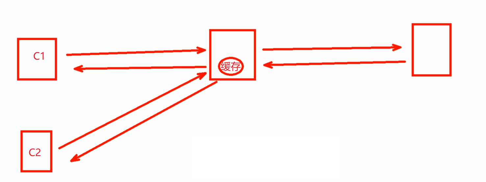

C1第一次访问某个资源，nginx反代会像real server请求；并缓存该资源

C2也访问这个资源的时候，就命中了该缓存资源，于是nginx不会再向后端请求，直接将对应资源返给C2。


## 实验缓存的效果

1、既然是缓存，就要找一个大点的页面做测试

2、ab命令测试

在192.168.126.133上的api目录下弄一个大文件m.html并可读👇

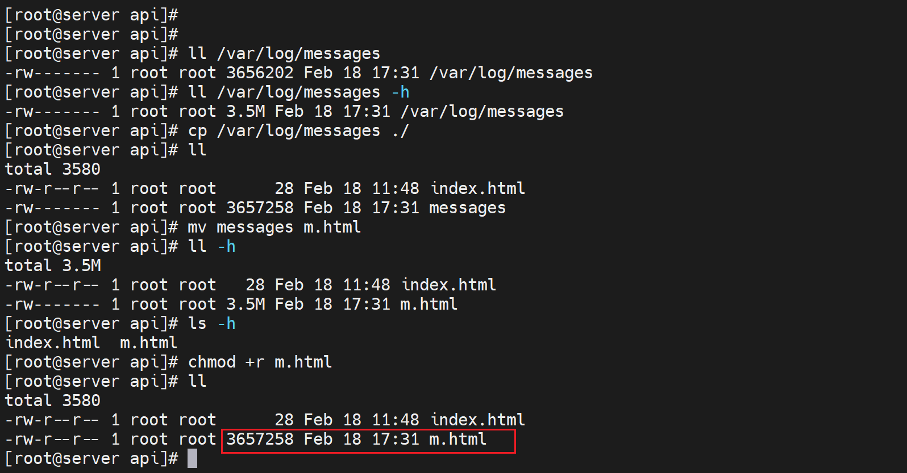

在192.168.126.130上curl 可见👇

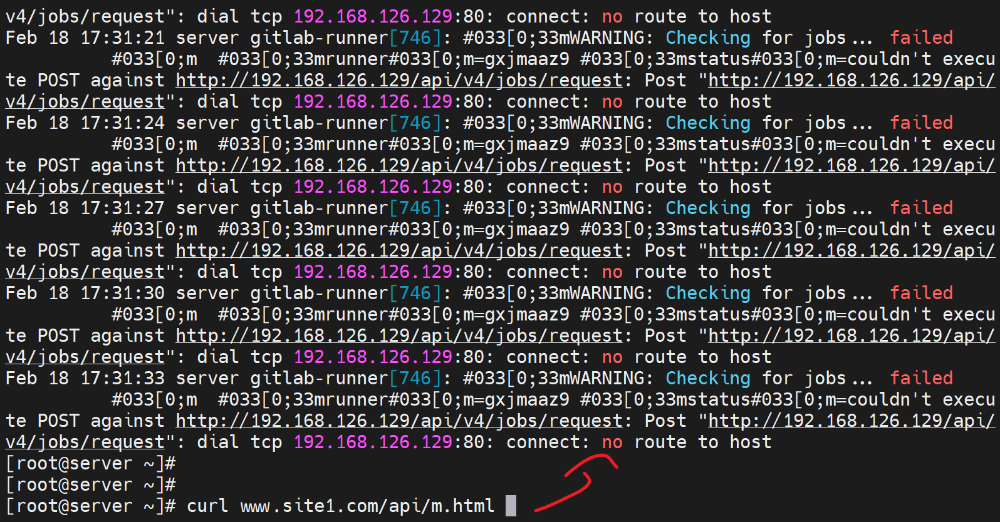

同样在130上ab测试

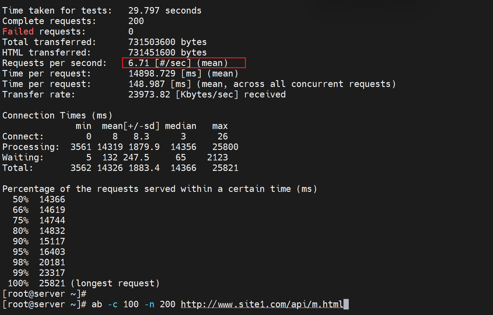

以上是未开启中间反代缓存功能的结果，c--nginx---server


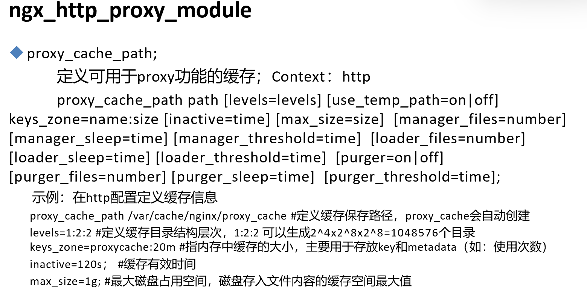

①首先proxy_cache_path指定的path就是存放缓存的地方

②levels=levels就是1:2:2这个和之前上传资源的存放是一样的

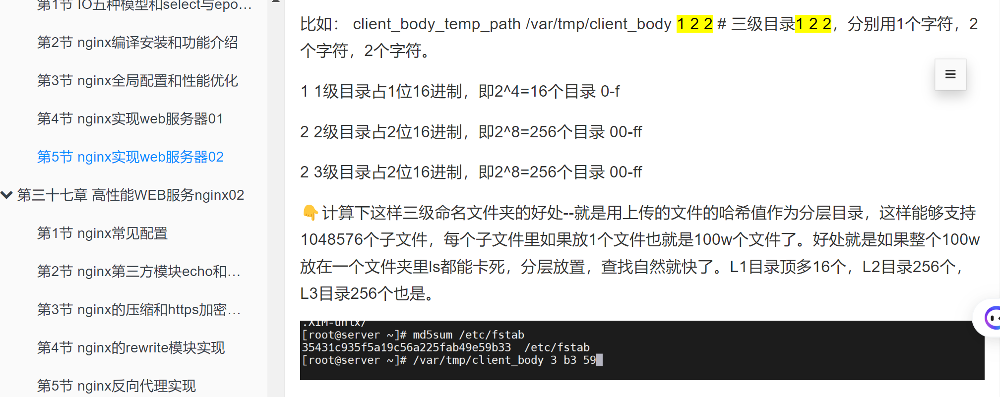

然后缓存的使用，也分内存和硬盘空间，

③key_zone=proxycache:20m \#指内存中缓存的大小，主要用于存放key和metadata（如：使用次数）

比如，存放的key是什么，比如就是url，然后对url进行哈希运算，运算之后放到缓冲区proxy_cache里

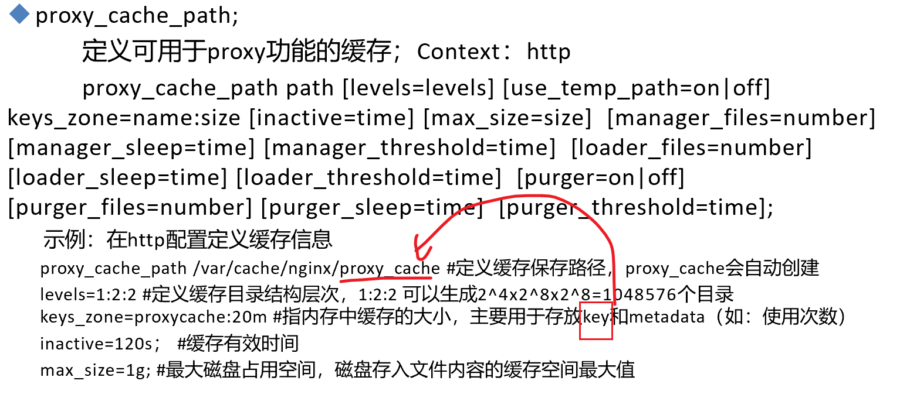

比如，metadata元数据里存放了访问了多少次。

④inactive=120s；   缓存有效期，应该就是磁盘上的文件失效自动删除，我理解。

⑤max_size=1g;   磁盘上缓存文件也即是path里的东西最大占用空间。


