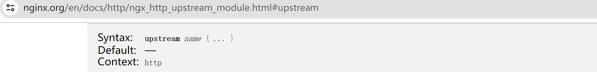
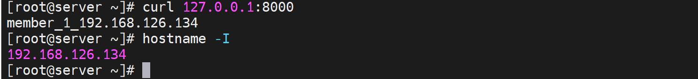
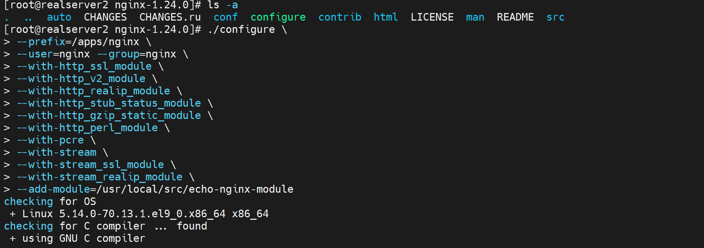

# 第3节. nginx反向代理实现负载均衡及调度方法

# nginx动态资源缓存

接上文，fastcgi的缓存利用和之前讲的基本一样

之前的缓存是nginx针对静态页面的缓存👇


现在要梳理的是nginx针对动态页面方面的fastcgi的缓存支持


对比下


①fastcgi_cache zone |off     # 调用keys_zone=xxx起的名字xxx:20m 

②fastcgi_cache_key string  # 就是哪些部分作为哈希缓存，就是所谓的key string

③fastcgi_cache_methods GET | HEAD | POST ...;    # 哪些方式定义缓存

④fastcgi_keep_conn on | off ;   # 收到后端realserver后是否立即关闭连接，推荐启用长连接

⑤fastcgi_cache_valid [CODE ... ]time;  # 不同的响应码的缓存时长


## fastcgi缓存的具体配置


主配配置文件里修改一下👇


然后调用这个定义的keys_zone:fcgicache


对比测试：未开启的效率


对比测试👇


响应速度明显提升


这是缓存信息👇


这就是缓存的效果，速度大大提升，问题--动态页面静态化了；什么意思，就是命名时php程序的访问，结果变成了缓存的静态资源应答，页面的更新明显时滞后的，所以使用的场景一般就是博客文章、论坛这些不要实时的业务了。


另外，上面时php程序的服务，用fastcgi对接；

如果是java程序，比如tomcat的，就直接nginx代理就行就是http协议i对接。

如果是python程序，比如django框架，就需要用uwsgi_params，其实nginx也是交给类似uwsgi的服务，nginx把请求交给该服务，然后该uwsgi服务再转给python程序。就类似nginx发给php-fpm，php-fpm再转给wordpress这个php代码一样。


# 调度功能

终于学到这一章节啦，调度才是网工普遍关心的点，也是从F5联系过来的吧。


upstream模块，可以把后端realserver分组起名，nginx就往这些分组上调度，每个组里一般就有好多服务器，此时就不再固定的只转发到一台机器了。


配置逻辑上 👇下图是一个tcp 反代，配置在stream层级下的，如果是http反代是写到http模块里的。

 

①先用upstream定义出一组服务器定义出来，后端serverS的ip+port

②然后把这些ip和端口，起一个统一的名字

③接着往这些分组上调度，用proxy_pass调度到upstream定义的分组名称上

④stream的上下文是main，换句话讲 stream是配置在全局最顶层的；

⑤upstream是配置再stream或http下的。





一些参数看看


### 先配置http的反代调度

简单讲就是proxy_pass不再指向某个固定url，而是一个定义好的组名，组内有N个url。


一般来讲 配置上，一个是主配指文件/etc/nginx/nginx.conf 和 其他子配置文件/etc/nginx/conf.d/xxx.conf。 前置放http，后者放独立的server虚拟主机。


所以按照这个思路，我就把upstream要去主配置文件里配置，而不是折腾到子配置文件里了对吧，否则冲突了就。


准备两个后端服务器，并配置好测试页面




然后在nginx的主配置文件里的http层级下，定义好虚拟主机组


然后在子配置文件里，配置调度


上图的index.php要删掉，否则还是访问到之前实验的php文件了。

重启服务，测试


发现没有轮询，memebers，而且即使192.168.126.134 httpd服务down掉了，还是显示134，说明缓存起作用咯。


确实开启了缓存


看下缓存文件，


此时2分钟时间到了，缓存失效了，再次curl发现轮询调度到另一台机器了也就是135


再次开启134的httpd，这样134和135的apache服务都开着了，

然后测试如下图


发现轮询是存在的。


干脆关闭缓存


再次测试轮询


也是ok的。上面已经实现了自动调度了，


### 再看下调度的算法的细节

首先，默认就是wrr调度机制

wrr就是Nginx 调度算法中的 "WRR" 全称是 "Weighted Round Robin"，即加权轮询算法。

测试，通过配置权重，观察curl的返回站点的页面，看调度比例是否改变。

配置之前，先看下上图默认wrr 大家一样的权重，调度基本是均匀的。


测试发现还真是3:1的调度比例


除了weight分担比重外，还有最大连接数

max_conns=10  # 最大连接数10个

max_fails=10  # 10次nginx连接后端realserver失败就标记位不可用，默认为1次

fail_timeout=15  # 上面的max_fails=10次连接不上(默认10s)，判定为不可用之后，15s会重新判定。就是认为人家不可用，也只是暂时，正所谓3日不见，当刮目相看。一周不见自然永远不见~~古语有云(我说古语就是古语)3分天注定7分靠打拼，3分颜值7分作，作死的作~，3分靠颜值，7分靠人品，品德的品！你品~细品，细细品~


### 灰度发布

**down**   # 灰度升级，标记的状态realserver就不会被调度了。此时就可以对这个太down的服务器进行服务升级，因为不被调度到，所以不影响业务。   注意修改 upstream里的某台realserver为down后，你不能说重启nginx的哦，这样所有连接就断了业务就断了，你只需要nginx -s reload重载配置文件就可以了。

reload不会影响正常的业务，除非你的配置文件down掉的就是提供服务的那个realserver才会断，当然如果有调度的空间还是可以的(所谓空间，就是能调度到其他正常的node就只是瞬断了，TMD不会瞬断，看下图验证)


reload测试


这是调度1:1


然后修改配置文件 再reload 看长连接是否断开

telnet www.site1.com 80后挂在那里


然后修改配置文件


然后reload，业务不断


发现

1、1：1 调度的情况下，cmd 先挂上去，保证调度到的是192.168.1126.135


2、然后修改192.168.126.135为down

3、然后nginx -s reload

4、发现nginx的ss -nt 不会断，然后cmd里也不会断。

5、分析，nginx服务没断，cmd的长连接是和nginx-192.168.126.130保持的，所以nginx不重启就不会断，然后reload后即使135这个ip down，也不会影响啊，因为那个是nginx和后面realserver的连接，那个本来默认就是瞬断的，你要测试的是修改为长连接后的配置调度写down，reload后的长连接是否会down，然后这个实验上面并没有体现。上面的实验很搞笑，只是nginx和client的长连接仅仅受nginx服务影响，不会收到nginx身后的realserver影响。除非改长连接。


灰度升级的常规方法：①先把某个realserver下线，也就是upstream 里的server配置为down，然后nginx -s reload，就不会调度到这个机器上了；②然后就升级这个机器就行了，升级好了就测试一段时间OK后③去掉配置文件里upstream层级里的realserver的down关键字就行了，然后nginx -s reload让新机器参与调度。


### sorry server

**backup** 就是俗称sorry server，将服务器标记位备用，其他所有服务器都不可用之后就会使用这个backup标记的机器，一般就是将nginx反代本身作为sorry server，


再配置一个8080的虚拟主机


nginx -s reload后，就可以测试了效果了，

主配指里的http快定义好realserver组名


再到子配置文件里 定义好server，写明location里的proxy_pass作为反代，协议和组名的调用。


然后实验，就是关闭realserver看sorry server


然后恢复业务测试下


注意，nginx的10k只自己做webserver，反代是socket tcp/ip套接字的socket是支持不到10k的连接的。LVS可以达到上百万级别的连接量并发量吧应该叫。这个nginx的tcp/ip反代也就是支持3w多的并发。这里还有个逻辑就是nginx是基于tcp/ip socket的也就是ip+port所谓端口也就是1-65535了，所以理论上就是6w而已，然后lvs是基于内核的不是走socket的所以不受这个65535的限制可以达到上百万。所以一些大业务量就是前面顶一个LVS，后面再分业务场景用nginx做反代。总入口是用LVS，下面分散的是用nginx的。nginx的一些功能是LVS做不到的，比如应用层的调度。


# 调度算法

LVS是有10种调度算法，nginx也有N种，后面可以对比总结一下。


## wrr

nginx默认是wrr调度算法，1:1调度，上面测试过了已经，有几台就依次调度几台。比如5台realserver就是1:1:1:1:1咯


## ip_hash

ip_hash：源地址hash调度算法，说白了就是同一个客户端ip就往同一个realserver上调度。下面测一下源地址hash也就是ip_hash的调度效果。


好像测试下来要是192.168.126.0/24的client访问都是调度到135的机器上去了，下图为证


其他同网段的IP一个个试下来都调度到一样的realserver 135上了


我还以为是134挂了呢，结果并不是👇


这样，给nginx再加一个网卡设置成桥接到物理网卡，然后换办公网的N个IP段来curl

这样nginx就是192.168.56.0/24段的，然后外面我找56段也找25段不行再找其他段来测。


经过测试终于在192.168.11.77上得到调度到134的现象，不容易啊👇


| 所以正如网上讲的👇                                            |
| ------------------------------------------------------------ |
| 使用ip_hash指令无法保证后端服务器的负载均衡，可能有些后端服务器接收的请求多，有些后端服务器收到的请求少，而且设置后端服务权重等方法将不起作用。所以，如果后端的动态应用服务器能够做到SESSION共享，还是建议采用后端服务的SESSION共享方式代替Nginx的ip_hash方式。 |
| wrr才能是weight设置生效啊，ip_hash自然不吃weight这一套啦。   |

这种ip_hash负载分担一点都不均衡，和LACP的链路捆绑也就是端口聚合的负载相比，均衡的效果差远了。这种还不完全是奇偶负载均衡，但也是比较均衡的。


和飞塔的ECMP相比也差远了，👇这个是标准的IP负载均衡，比如192.168.25.10从一个线路出去，改成25.11就会换一个线路了，这个效果就是奇偶负载均衡。


好了继续看别的吧


## least_conn


## has key [consistent]

刚才上文的ip_hash就是针对client的ip做hash来进行调度，不过调度的差异化不明显，结果就是负载分担不均衡。

而这里的has key是针对key进行hash运算的。

也就是说

hash $remote_addr就是等价于ip_hash咯

hash $request_uri 就是针对访问的站点的url进行哈希，也就是不同的站点调度到不同的realserver上。    # 类似LVS的DH算法


测一下hash $request_uri

①修改调度策略


②做一堆页面出来

我现在是192.168.126.134和192.168.126.135两个IP作为realserver，所以在这两台server上分别做10个页面

```shell
for i in {1..10};do echo `hostname -I` Page $i > /var/www/html/test$i.html;done
```


③测试


不同的client访问10个页面，调度的结果都是一样的，说明就是依据request uri调度的，访问同一个目标url，就是往同一个realserver调度的。


好，如果是以上的调度算法，会有会话保持的问题，也就是说用户访问http://www.site1.com/test1.html是一个realserver，然后访问http://www.site1.com/test5.html又是一个realserver，那么一些保留的会话信息就没了。比如cookies，登入的信息，如果基于uri调度到别的机器，那么login就没了。还比如php文件的访问，php是程序了，程序运行依赖的一些环境换了realserver可能也存在问题，比如之前的cookies肯定就没了。

**解决思路有**：

①session服务器前文提到过，可以过去复习下，就会知道redis的作用，cookie的设置以及time()的计算方式，哈哈，不要怕花时间就可以再次捡起来这些有用/无用的知识了，天地无用~


上图的章节里提到了这么几个方案：

1.1  session缓存，就是session id放到cookie里面来玩的， (session就是server存放的表示某个会话的一堆信息，但是id就是代表啦，可以认为session id就类似数据库表里的主键，比如id 1000代表登入网站的用户名，购物车里的东西等等信息。) 。 # hash $cookie_name; 这样写就行。

​						但是cookie有很多，所谓cookie就是很多个key:value键值对，hash写的时候要写清楚是哪一个cookie的key。 

1.2  session复制，所有的realserver互相同步也就是复制会话，肯定不可取。

1.3  session服务器，就是用redis来做session服务器，这个是很好的方案，不过login的信息要拆分到mysql里去做数据持久化的。redis是基于内存的，不是持久化存放的。


补充以下cookies


像这种👇就是一个包里有N个cookie的，每个cookie就是一个键值对。


如果前端调度器也就是nginx反代，就需要明确指定依据cookies里的哪个cookie也就是键值对来调度。

要知道client发动的请求里会有一大堆cookies的。


这个👇sticky指令确实能够实现基于cookie来调度，不过是商业版是收费的，需要用hash指令实现。


hash实现就免费啦👇 再查查变量就能用起来啦。

```
hash $cookie_name;
```


顺便瞧瞧redis的功效


②继续说session id的事情


client请求发过来，server那边的php或者java程序 可以轻松做到 根据不同的client分配不同的session id。

```
<?php
setcookie('sessionid','123456');
?>
```

# 测试下sessionid的事情

## 测试1：使用curl -b 结合 log 的方式 产生和显示cookie

用log查看session

首先cookie_name的落地写法其实是 cookie_变量名称，比如你要用sessionid这个值，就写成cookie_sessionid，具体如下


这里log里显示出cookie_sessionid的值，注意cookie_后面的sessionid才是你要设置的键值对里的键。值你就设置个123456测试下。


然后curl产生cookie，注意键值对要是sessionid这个变量


最后就能在log里看到


## 测试2：使用server的php程序打上cookie和log查看的方式

log格式还是和上面一样这个是nginx反代192.168.126.130的log配置

架构： 130(nginx) -----134  |  135   这两个realserver


php需要nginx的fastcgi对接，这里就使用192.168.126.135:9000的php程序来打上cookie


注意：这里不需要135上开启http，只需要fastcgi对接的php-fpm服务也就是9000端口服务就行了。

然后用浏览器打开，记得使用无痕


第二次访问就有cookie了，当然这里log里只是显示了cookie里的sessionid值，其实也可以都显示出来的。


浏览器里看看再


补充截图


与之对应的log里由于配置了log


所以log里就看到三个cookies了


其中前两个cookies的都是会话级的，会话没了就失效了

最后一个cookie是1小时老化的。


## 测试3：使用echo进行显示cookies，当然打上cookie可以用curl -b或server端的php或者java程序来弄


要使用echo，需要使用：

①echo插件

②nginx的编译的时候带上echo插件

以下是实验过程记录

③echo使用的时候需要补上default_type text/html来防止浏览器自动下载

echo的详情见前文


**1、下载两个包：echo插件和nginx源码**


**2、安装依赖**


**3、编译安装nginx，且带上echo插件**

解压


开始编译安装



上面的cli会导致make编译的时候报错，修改为👇


编译并安装成功后

停掉当前机器的httpd，启用nginx


上图其实错了，server_name *site1.com;写法明明是错的，但是为什么ngintx -t检查ok呢，因为主配置文件里压根没有引用到这个子配置文件，所以语法检查就没有检查到这里，所以这里要注意的。

修改主配置文件里的引用

纠错上图


再次nginx -t就看到报错了


看着基本ok了，测试一波


**测试现象1**：日志路径是日志的路径，调度的路径是调度的路径

浏览器打开http://www.site1.com

观察日志


所以，就是反代的nginx提供的服务，你请求过来访问http://www.site1.com

，匹配到我的server块对吧，也就是server_name *.site1.com  80端口的，自然就是路由到/varxxx/www/html/index.html啦，所以log里就是这么记录了，没毛病的。

然后由于配置了proxy_pass http://websrvs；所以继续调度，日志是日志，调度是调度，各回各家，各找各妈。


然后看日志是调度到135的嘛，所以135上就是看80是nginx编译的那个程序提供的，于是就是路由到/apps/nginx/html/index.html啦。所以页面就是


也是符合文件里的内容的


**现象2**：后端server上的子配置文件未生效，应该说本地访问生效，远端通过nginx访问无效。

直接上结论：用户直接访问192.168.126.135就是请求直接落到192.168.126.135的，不管是域名还是IP。都是找对应的配置文件里的server块。而用户访问nginx反代，不管用户是域名还是IP访问的，nginx反代访问后端192.168.126.135都是用的ip，因为你配置的就是IP。这才是根本👇


基于上面的结论，所以才会又下面的测试现象：


所以server虚拟主机的路由，一定要看真正发到server上的请求是什么，而不是client发出来的是什么，因为client--->nginx--->server，nginx里可能反代发送过去的就不是你client发送的样子。比如client发送的域名，而nginx反代转过去的是IP。自然命中的server块是不一样的。


再一个，上图的localhost看来也是可以涵盖192.168.126.135个IP的，不是说localhost仅仅是127.0.0.1咯。这个要纠正一下了吧。不要矫枉过正，就是纠正过头，localhost就是127，不要瞎理解，这里localhost在nginx里只是可以处理监听的所有本地IP的作用而已。


言归正传，开始测试cookies

既然c--n---s，n发过去的都是ip，所以就在主配置文件里配置吧


curl -b 测试 一个cookie就是一个-b


# 调度cookie

几人上面测试cookies是可以抓到的，那么就用hash $cookie_name来调度


下面就通过curl -b 测试 固定的sessionid是不是都是固定调度到同一个realserver上了呢。


不过实际情况就是server给client打上sessionid了，nginx然后利用这个sessionid来区分对待不同的client和server。


此外还有keepalive 参数

**keepalive 连接数N;**

为每个worker进程保留的空闲的长连接数量，可节约nginx端口，并减少 连接管理的消耗


client-------nginx----------varnish1 | 2 | 3 | 很多个varish ---- 后端很多个realserver


```
hash $request_uri 的解释

hash ( /a.html ) = 128bit % 6 => 0 -5     #  varnish的权重是1 2 3 ，所以整体权重就是6，hash值对6取模，也就是0 1 2 3 4 5 个结果。


varnish 1/6 0   		# 1/6就是hash % 6结果-0就 调度到 这个台varnish
varnish 2/6 1,2   	#  hash % 6 结果是1，2 就往这里调度
varnish 3/6 3,4,5    # hash % 6 结果是 3 4 5 就往这里调度。
```


如果varnish挂了一台，或者后端realserver增加了，varnish跟不上业务量了，再加一个varnish

此时调度分母变成了10，意味着hash ( /a.html ) = 128bit % 6 变成了 % 10，此时取模的结果全变了，意味着所有缓存全部失效！此时缓存穿透，压力全部给到后端服务器了，业务瞬间爆了。因为业务基本都是靠缓存提供快速响应的，缓存没了，靠服务器是提供不起来的。varnish可能就承担了80%的业务量，后端realserver只是20%顶多也许。

```
varnish 1/10
varnish 2/10
varnish 3/10
varnish 4/10
```

这就是一致性hash算法产生的背景。

下章继续

