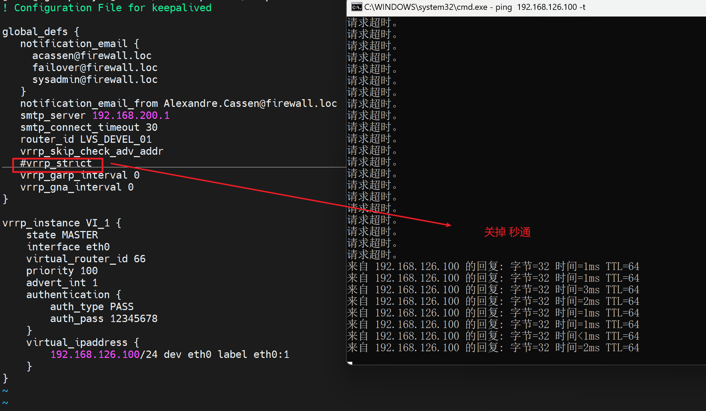
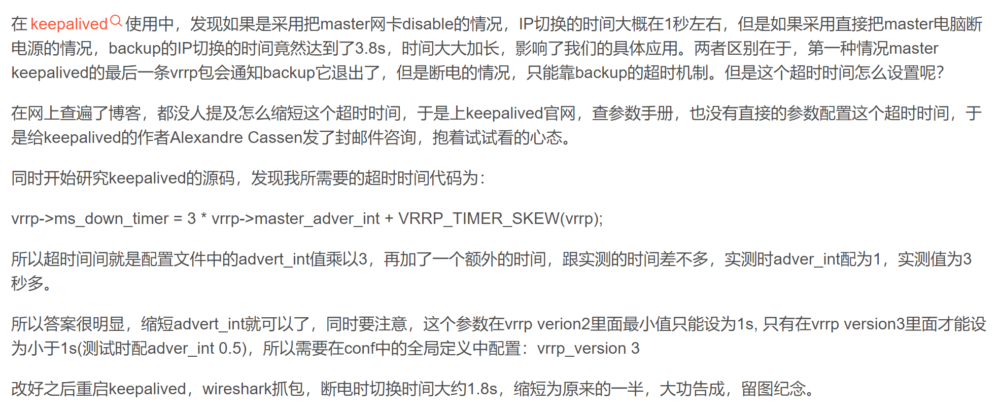
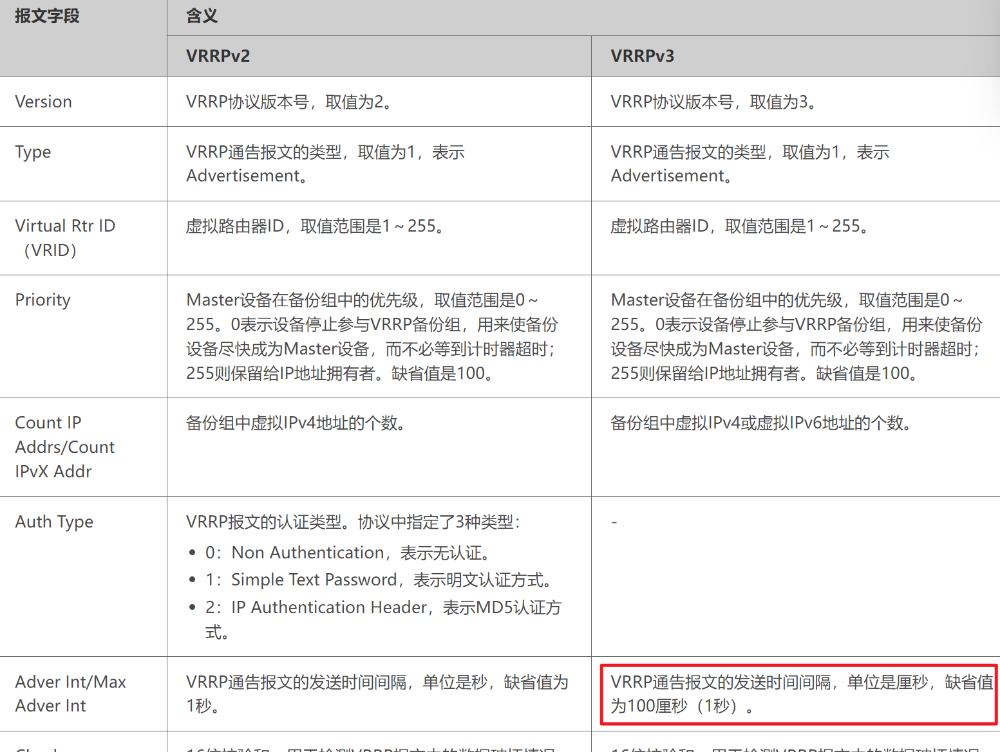
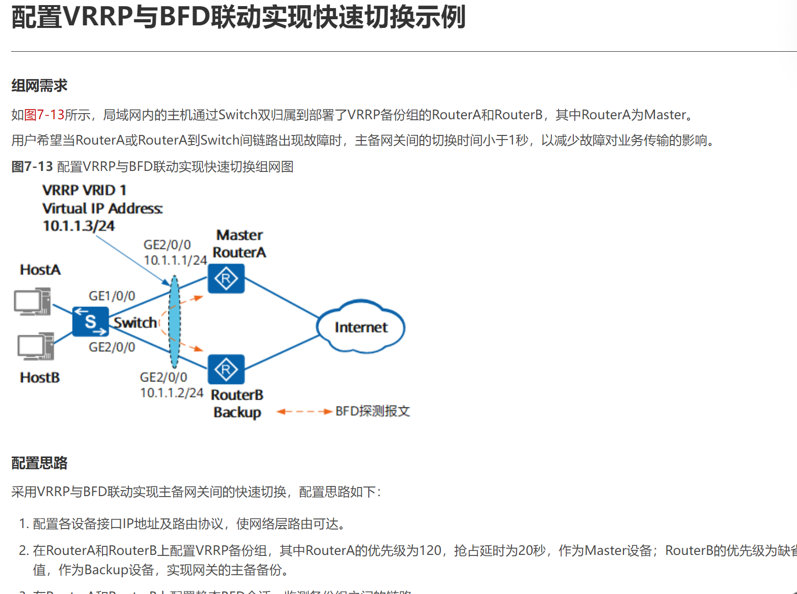

# 第5节. keepalived实现反向代理的高可用


**nginx的高可用怎么做，用keepalive做，keepalive的脚本来是新对nginx的HA。**


通过脚本，监控Master/Slave的状态，进一步调整各自的优先级，从而抢占VIP，实现HA的故障切换，听着就和VRRP、HSRP差不多了。结果keepalive的配置文件一看全TM是vrrp，哈哈哈~


后面还会学习HA Proxy 反向代理软件。也就是说：

①keepavlie + nginx  实现 nginx的HA

②keepalive + ha proxy 实现ha proxy本身的HA

③其实说白了任何服务之间都可以用keepalive做HA了，不过服务L4和L7里L7大多数用nginx了。

④总之，keepalive经常配合调度器(nginx、haproxy、sql读写分离器也行吧) 一块使用。

⑤其实keepalive通过实验就能知道他就是机器级别的VIP，就是网工知道的VRRP。可以说keepalive做两台机器的IP HA也就是VIP，然后nginx监听在这个VIP上而已。是这么个逻辑


# 搭建

## **1、准备两台web服务器也就是realserver**


## **2、搭建master/slave 两台keepalive**

```shell
yum -y install keepalived

计划虚拟地址--VIP  192.168.126.100

vim /etc/keepalived/keepalived.conf

global_defs 里修改一下
	notification_email {
	    xx@xx.xx	收件箱
	}
	notification_email_from 发件箱，或者仅仅,就是个发件地址，邮箱其实不存在也可以。。
	smtp_server 127.0.0.1  本机的smtp server要启用咯 postfix
	router_id xxx   每个服务器起个自己的名字，比如keep1


下面vrrp_instance VI_1 这种就是vrrp的实例，用来实现VIP浮动IP的。
	virtual_router_id xx   写个编号比如66，注意两台都写66，虚拟成一个路由器
	prioity 不动就用默认的100
	authentication { 
    		auth_type PASS
    		auth_pass  xxx   写两台的协商密码；据说密码即使设置了，抓包也是明文的。怀疑~
    	}
	vitual_ipaddress {
		a.b.c.d    vip和端口也可以直接写成👇
		192.168.126.100/24 dev eth0 label eth0:1
	}

再往下就是virtual_server a.b.c.d 443 {
	这些就是LVS了，L4的调度了，本次实验只是用keepalive做nginx的HA，所以这里不管了后面全删掉
}


将此配置文件复制一份到 另一台 keepalive机器上，并略作修改👇；当然两台需要做防火墙、selinux 禁用、时间同步操作

vim /etc/keepalived/keepalived.conf
   修改
   router_id ka2
   
   state BACKUP
   虚拟路由器id必须一样的
   priority 80   优先级和master要不同
   其他也都一样
 
 到此就配置完了
 
 systemctl start keepalived   就ok了，ping VIP就通了。

```




参考：https://blog.51cto.com/sparkgo/6127764


所以keepalive是秒级的HA咯，如何加快收敛呢？交换机里的vrrp也是秒级的？不过有FRR好像可以加速，说错了是BFD。

**方法1：修改秒代码编译咯要**

https://blog.csdn.net/hitcompass1/article/details/104054934




**方法2：使用高版本的vrrp，不是keepalive高版本是否支持厘秒**

https://support.huawei.com/enterprise/zh/doc/EDOC1100112421/6e22bde4




**方法3：用BFD联动** 

https://support.huawei.com/enterprise/zh/doc/EDOC1100112421/54b4f71c




**其实方法2 3 都不是keepalive了而是网络设备的vrrp了，所以可以用网络设备来实现加速收敛的vrrp来替代keepalive。这也是个思路，当然前提是你有现成的网络设备而不是另购**


## **3、vip有了就搭建nginx**
