# 第1节. vim

大篇幅编辑使用软件如vscode的plugin弄就行了。

 

**会用到的备忘**：

 

:set nu

删除100dd,dGG,dgg

^$切换行尾行首w光标移动一个空格

 

/XXX搜索，nN

 

u撤销

U 改行的修改全部撤销

 

s/要查找的内容/替换的内容/修饰符

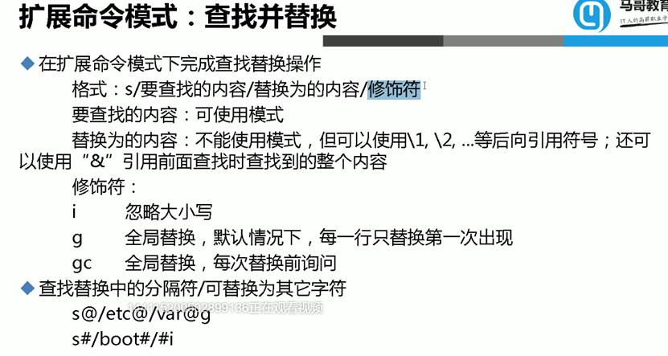

 

整个文件的内容vim里替换用%s

%s/XXX/YYY/g

/可以替换的

%s#/dev#/tmp#g

 

 

 

正则表达式，后补

 

 

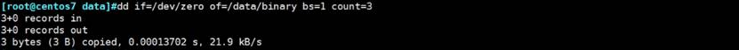

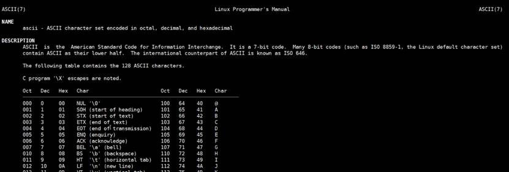

0的ASCI码

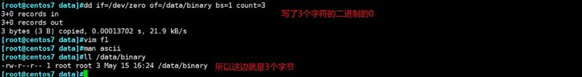

cat也看不到

可以这么看二进制文件

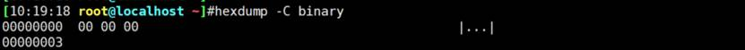

00000000这是位置，后面00 00 00是内容

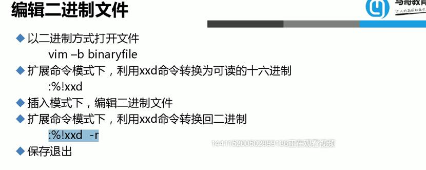

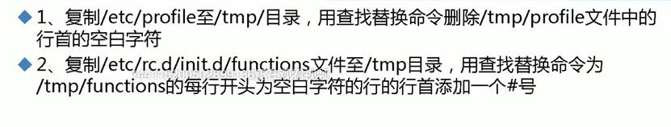

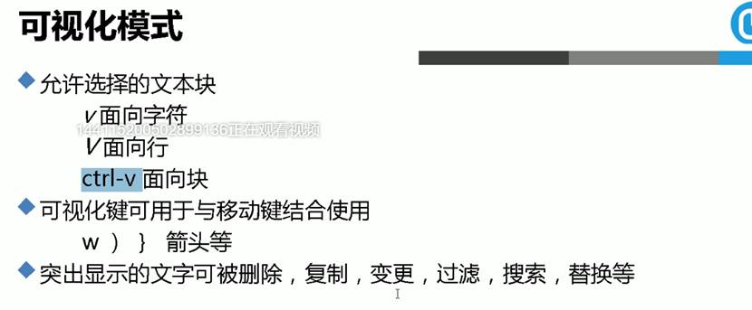

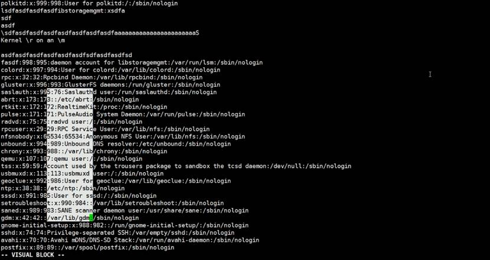

 

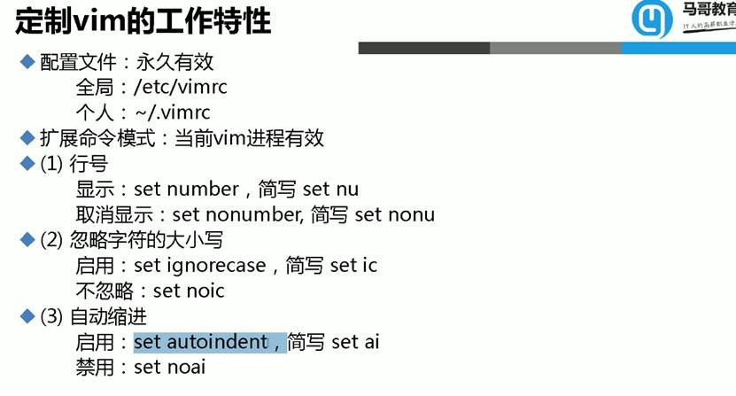

 

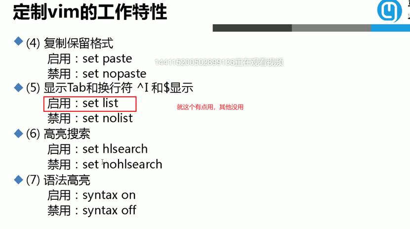

 

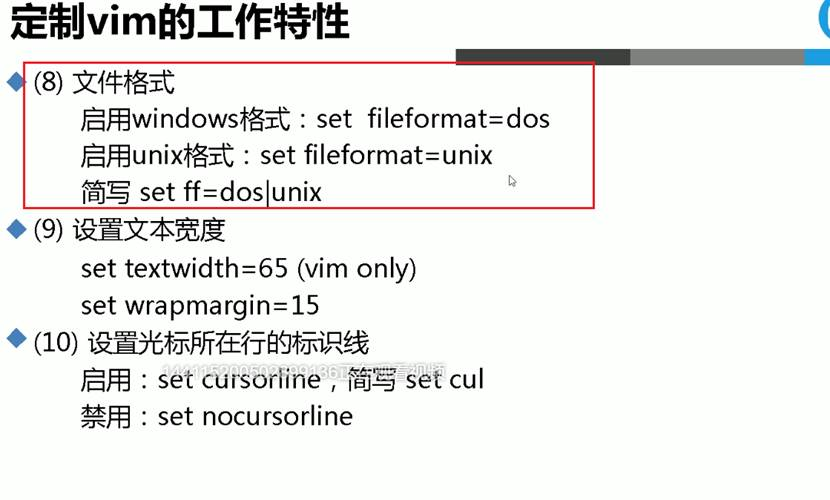

这个比较好用，

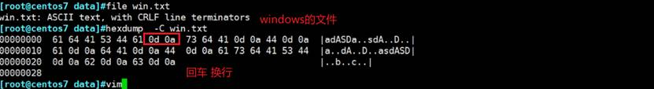

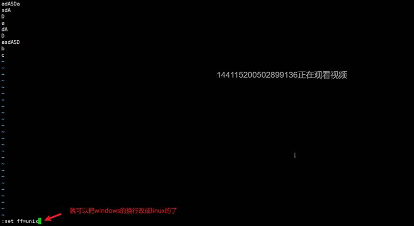

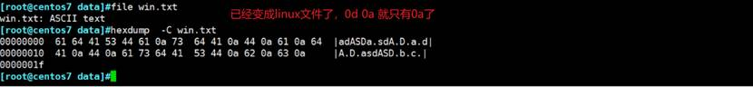

 

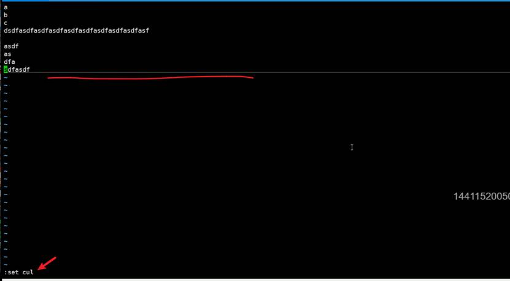

跳行同学的福音

 

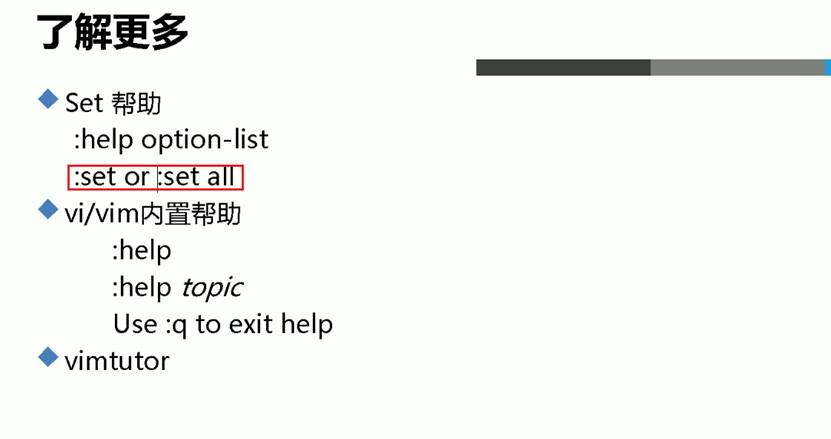

 

 

 
