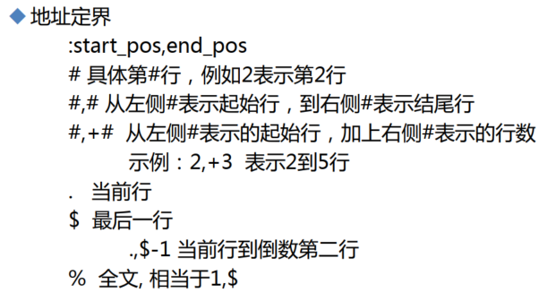
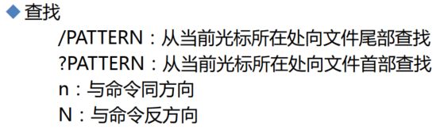
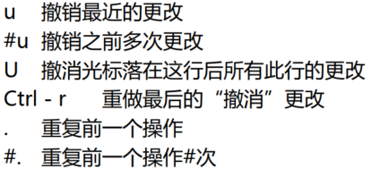
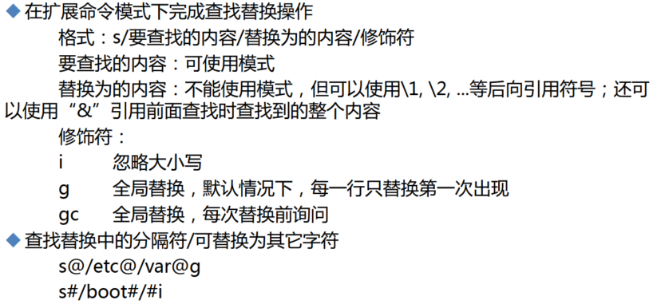
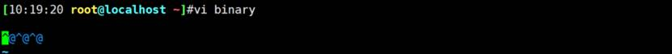
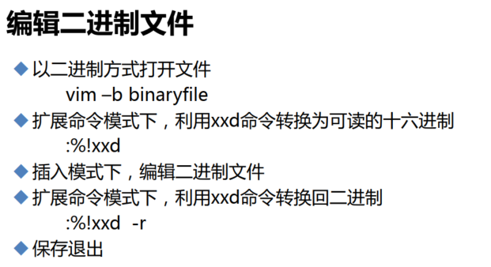
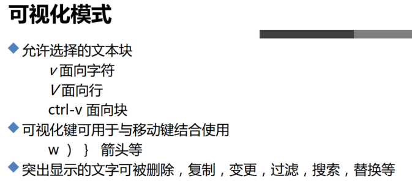
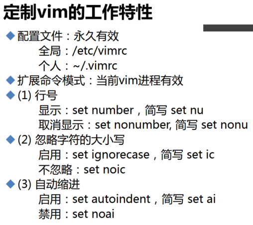
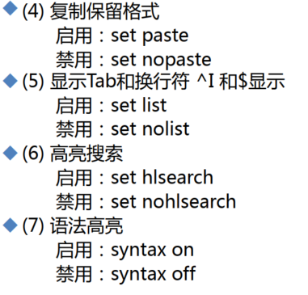
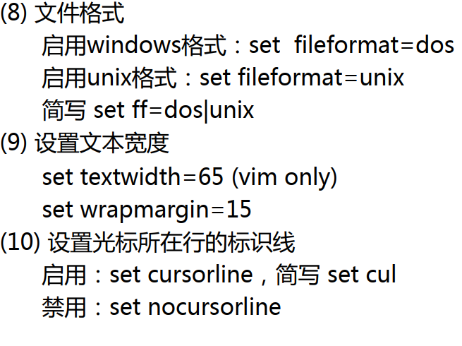

# 第1节. vim

大篇幅编辑使用软件如vscode的plugin弄就行了。

 

**会用到的备忘**：

 

:set nu

删除100dd,dGG,dgg

^$切换行尾行首w光标移动一个空格

 

```
vim +10 xxx  # 打开就进入了第10行
```

vim 颜色也不是都加的，/etc/passwd，复制到/data下再vim就会发现颜色没了。/etc/下的属于系统配置文件，所以给你加颜色了。

vim -m 只读打开

/XXX搜索，nN

 

u撤销

U 改行的修改全部撤销

 

s/要查找的内容/替换的内容/修饰符


 

 

 


 

 


 


这是正则，后面到了正则再说

 


 


 


 

整个文件的内容vim里替换用%s

```
:%s/XXX/YYY/g
```

/可以替换的

```
:%s#/dev#/tmp#g
```

 

 

 


0的ASCI码




cat也看不到

可以这么看二进制文件


00000000这是位置，后面00 00 00是内容

 


 

批量注释会有用


 

 


复制到vim里，空行格式错位，可以试试

```
:set paste
```

 


 


这个比较好用，


 


跳行同学的福音


 


 

 
