# 02.KVM架构和安装.md

查内核是否支持某个功能

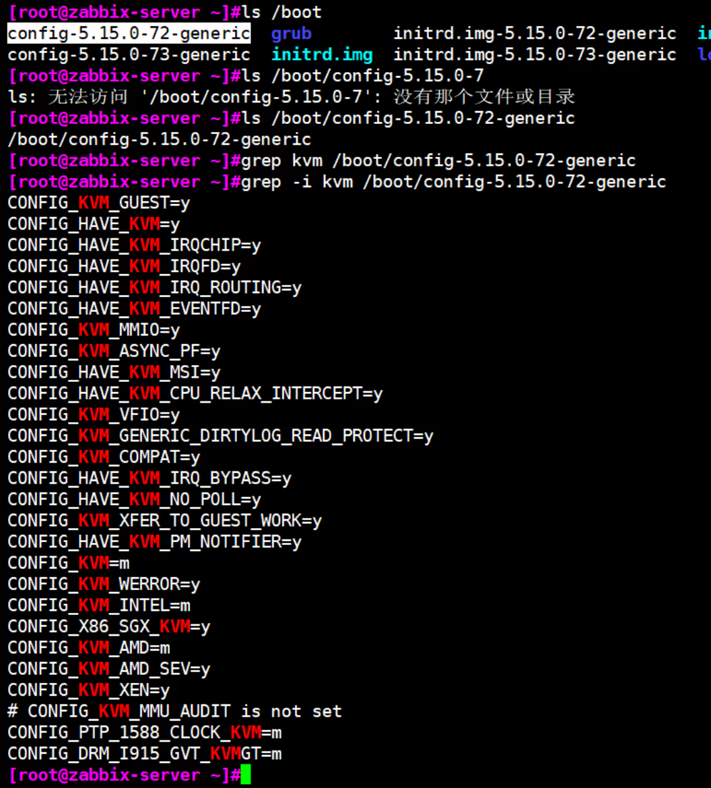


=m就是模块化的方式

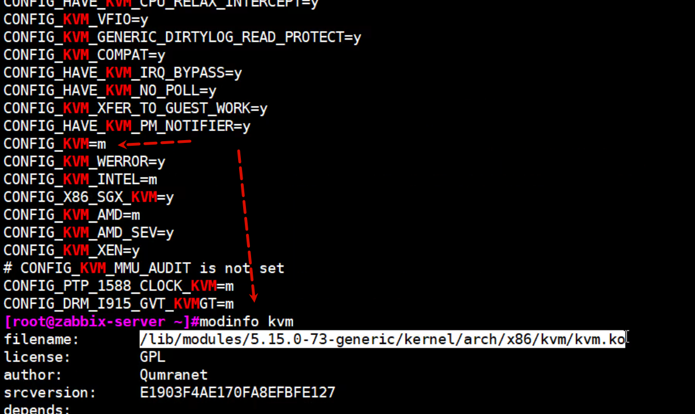


=y和=m的区别就是y是集成在内核文件里，开机加载


=m是模块方式，是按需加载

那么当前机器=m，到底加载没有？


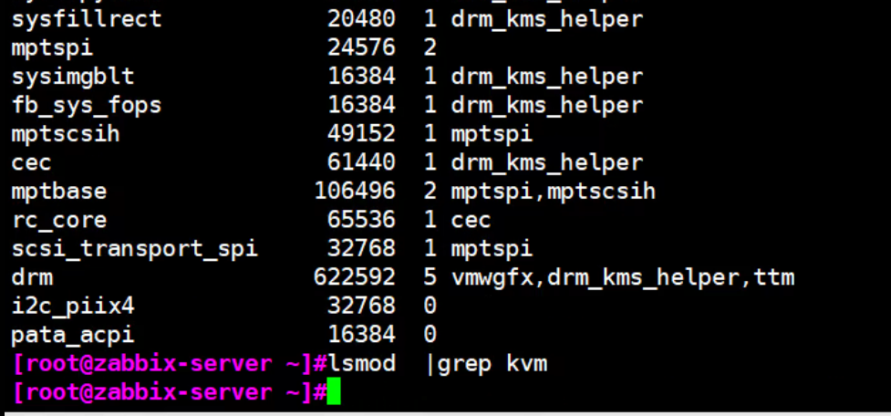

说明没有加载👆，其实就是VM没有勾选硬件虚拟化，勾选了就是支持了，自动就会加载。


手动加载，但是上图表明了该机器 CPU不支持虚拟化，所以手动加载了也没有用


KVM在红帽企业版有限制，其他centos，ubuntu没有限制

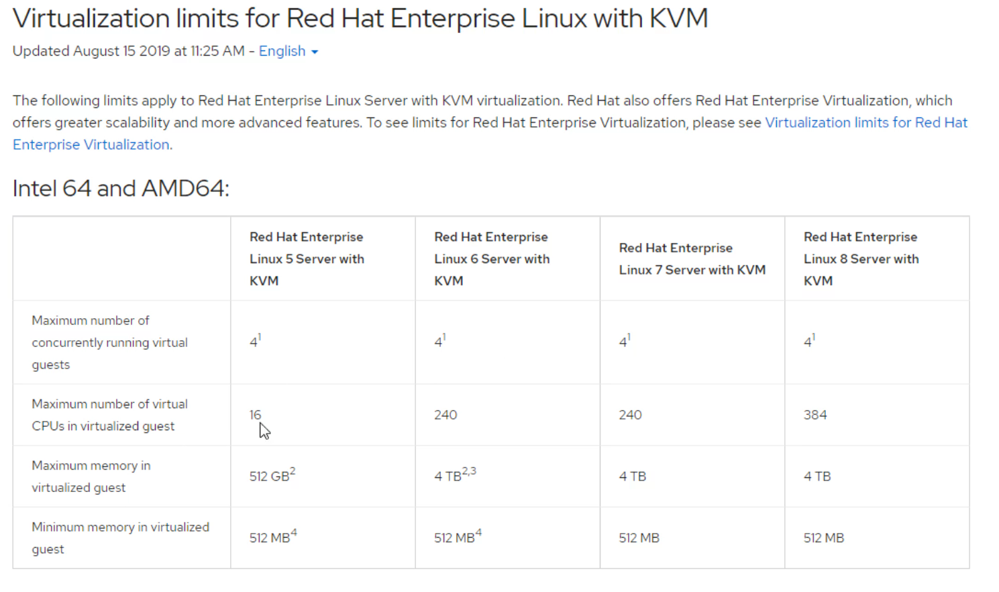


结合上面的开去cpu虚拟化的勾选，再看这里的截图

CPU支持，就会lsmod看到加载👇

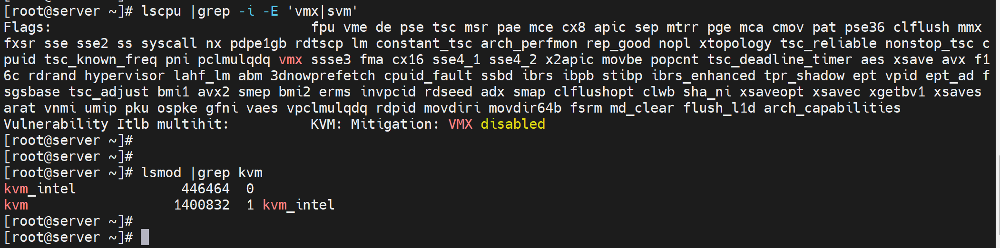

amd的是svm

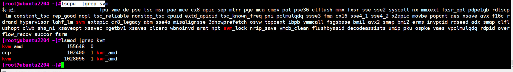


| 维度     | cockpit（service 单元）                       | cockpit.socket（socket 单元）                                |
| -------- | --------------------------------------------- | ------------------------------------------------------------ |
| 单元类型 | `.service`（服务单元）                        | `.socket`（套接字单元）                                      |
| 运行模式 | 常驻型：启动后一直占用系统资源，持续运行      | 按需型：仅监听指定端口，有请求时才启动 Cockpit 主服务        |
| 触发逻辑 | 启动即运行 Cockpit 主进程，无论是否有访问请求 | 仅监听 Cockpit 的默认端口（9090），当有客户端访问该端口时，自动触发启动 `cockpit.service`；无请求时，socket 仅占极少资源，主服务不运行 |
| 资源占用 | 较高（常驻进程）                              | 极低（仅套接字监听，无主进程）                               |
| 典型用途 | 适合高频访问 Cockpit 的场景（如运维工作站）   | 适合低频访问、注重资源节省的场景（如服务器）                 |

### 关键补充

1. **依赖关系**：`cockpit.socket` 是 Cockpit 推荐的默认启动方式，它本质是 `cockpit.service` 的 “触发器”—— 启用 `cockpit.socket` 后，无需手动启动 `cockpit.service`，访问 9090 端口时系统会自动拉起主服务；
2. 操作逻辑：

   - 启动 `cockpit.socket`：`systemctl start cockpit.socket` → 仅监听端口，主服务未运行；
   - 启动 `cockpit.service`：`systemctl start cockpit.service` → 直接运行主服务，即使无访问请求也常驻；
   - 启用开机自启：推荐启用 `cockpit.socket`（`systemctl enable cockpit.socket`），而非直接启用 `cockpit.service`，更节省服务器资源。


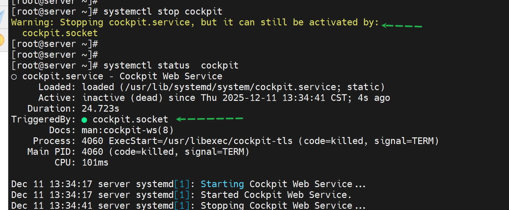


9.5 我测试发现有内部错误无法解决，改成9.3一下子好了，判断9.5的那台机器可能是我之前折腾其他环境搞或者是python 10导致的。


放开root登入web👇

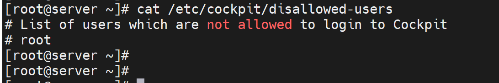


cockpit.socket 是web页面管理rocky的

cockpit-machines是web里虚拟机管理模块

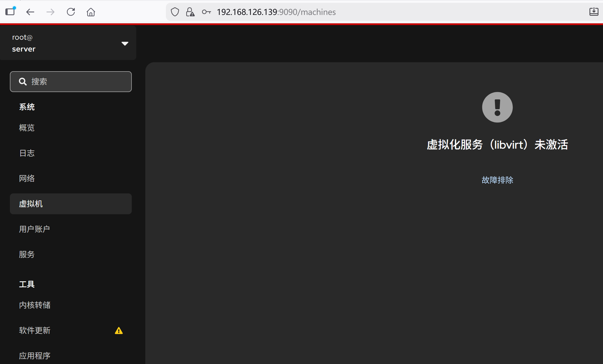


# KVM经典桥接★

------

## ✅ 正确模型（你这个需求下）

> **宿主机要访问网络，VM 也要访问网络，且 VM 直通内外网**

👉 **IP 必须在 bridge（br）上**
👉 **物理口 em1 / em2 不能再拿 IP**

也就是说：

| 设备        | 是否拿 IP   | 作用     |
| ----------- | ----------- | -------- |
| em1         | ❌ 不拿      | 只是网线 |
| em2         | ❌ 不拿      | 只是网线 |
| **br1**     | ✅ 拿外网 IP | 宿主外网 |
| **br2**     | ✅ 拿内网 IP | 宿主内网 |
| vm001 网卡1 | ✅           | 外网     |
| vm001 网卡2 | ✅           | 内网     |

⚠️ **绝对不要**让 em 和 br 同时拿 IP
否则就是你刚才遇到的：
👉 `nmcli up` 卡住
👉 SSH 断
👉 路由乱跳

------

## 🧠 为什么必须这样？

Linux bridge 本质上是个**虚拟交换机**：

- em1 是交换机的一个端口
- vnetX 是交换机的一个端口
- **IP 必须配置在交换机上，而不是端口上**

这和真实机房里：

> 服务器插在交换机上
> IP 配在服务器，不配在交换机端口

是**同一个逻辑**。

------

## 🧱 你的目标拓扑（最终形态）

```
        外网
         |
       em1
         |
       br1  <---- 宿主外网 IP
      /   \
   vnet0  宿主
     |
   vm001(外网)

--------------------------------

       内网
         |
       em2
         |
       br2  <---- 宿主内网 IP
      /   \
   vnet1  宿主
     |
   vm001(内网)
```


------

## 🧩 Rocky 10 配置文件方式（keyfile）

### ① 外网桥 br1（宿主拿外网 IP）

```shell
[root@phy001 system-connections]# cat /etc/NetworkManager/system-connections/br1.nmconnection
[connection]
id=br1
uuid=ff5e5656-9725-4479-ac37-02c03f9298a4
type=bridge
interface-name=br1
autoconnect=true

[bridge]
stp=false

[ipv4]
method=auto

[ipv6]
method=ignore
```

------

### ② em1 作为 br1 从口（不拿 IP）

```shell
[root@phy001 system-connections]# cat /etc/NetworkManager/system-connections/em1.nmconnection
[connection]
id=em1
uuid=75688915-eb0a-49fa-b005-72bf1e445b48
type=ethernet
interface-name=ens33
autoconnect=true
master=br1
slave-type=bridge

[ethernet]

[ipv4]
method=disabled

[ipv6]
method=ignore

[proxy]
```

------

### ③ 内网桥 br2（宿主拿内网 IP）

```shell
[root@phy001 system-connections]# cat /etc/NetworkManager/system-connections/br2.nmconnection
[connection]
id=br2
uuid=e753c1d2-8289-464c-8ee0-bdd1e79427b8
type=bridge
interface-name=br2
autoconnect=true

[bridge]
stp=false

[ipv4]
method=manual
addresses=123.1.1.1/24
gateway=123.1.1.254
dns=1.1.1.1

[ipv6]
method=ignore
```

------

### ④ em2 加入 br2（不拿 IP）

```shell
[root@phy001 system-connections]# cat /etc/NetworkManager/system-connections/em2.nmconnection
[connection]
id=em2
uuid=a06c941f-e072-4011-bf2e-66925b5f738b
type=ethernet
interface-name=ens36
master=br2
slave-type=bridge
autoconnect=true

[ethernet]

[ipv4]
method=disabled

[ipv6]
method=ignore

[proxy]
```

------

## 🔁 激活顺序（**非常重要**）

⚠️ 建议 **本地控制台操作，不要 SSH**

```bash
nmcli connection reload
nmcli connection up br1
nmcli connection up em1
nmcli connection up br2
nmcli connection up em2
```

检查：

```bash
ip a
brctl show   # 没有就：dnf install bridge-utils
```

你应该看到：

- `br1` 有外网 IP
- `br2` 有内网 IP
- `em1/em2` **没有 IP**
- `vnetX` 自动挂在对应 bridge

------

## 🖥️ 虚拟机 vm001 怎么桥接

- 网卡1 → bridge = `br1`
- 网卡2 → bridge = `br2`


好的，我帮你整理一下 **KVM 下编辑 VM（以 vm001 为例）桥接网卡的完整步骤**，适用于命令行和 `virt-manager` 两种方式。

------

## **方法一：命令行配置（virsh / XML）**

1. **查看虚拟机当前网络**

```bash
virsh domiflist vm001
```

输出示例：

```shel
Interface  Type       Source     Model
------------------------------------------------
vnet0      network    default    virtio
```

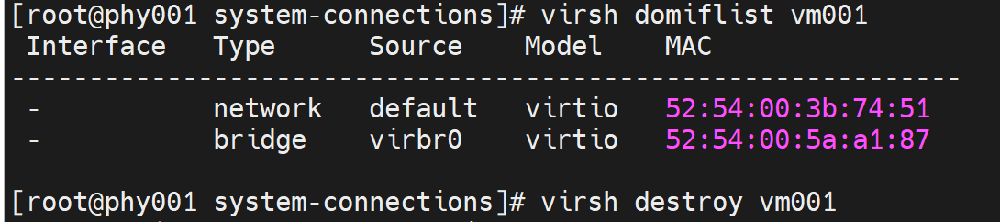

1. **关闭虚拟机**

```bash
virsh shutdown vm001
# 或强制
virsh destroy vm001

# 看下kvm虚拟机的配置的接口部分，发现不是桥接，network就是默认的走的NAT
[root@phy001 system-connections]# virsh dumpxml vm001 |grep -A5 interface
    <interface type='network'>
      <mac address='52:54:00:3b:74:51'/>
      <source network='default'/>
      <model type='virtio'/>
      <address type='pci' domain='0x0000' bus='0x01' slot='0x00' function='0x0'/>
    </interface>
    <interface type='bridge'>
      <mac address='52:54:00:5a:a1:87'/>
      <source bridge='virbr0'/>
      <model type='virtio'/>
      <address type='pci' domain='0x0000' bus='0x07' slot='0x00' function='0x0'/>
    </interface>
    <serial type='pty'>
      <target type='isa-serial' port='0'>
        <model name='isa-serial'/>
      </target>
    </serial>


```

1. **编辑虚拟机 XML 配置**

```bash
virsh edit vm001
```

找到 `<interface>` 节点，比如：

```xml
<interface type='network'>
  <mac address='52:54:00:xx:xx:xx'/>
  <source network='default'/>
  <model type='virtio'/>
</interface>
```

1. **修改为桥接模式**
   假设宿主机桥接是 `br1`：

```xml
<interface type='bridge'>
  <mac address='52:54:00:xx:xx:xx'/>
  <source bridge='br1'/>
  <model type='virtio'/>
</interface>
```

- `type='bridge'` 表示桥接

- `source bridge='br1'` 指定桥接接口

- `model type='virtio'` 保持虚拟网卡类型为 virtio（性能最好）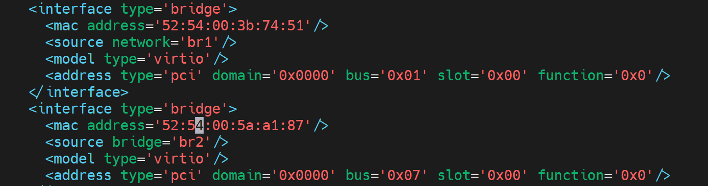

- 上图br1那一行改成bridge='br1'否则报错如下👇

  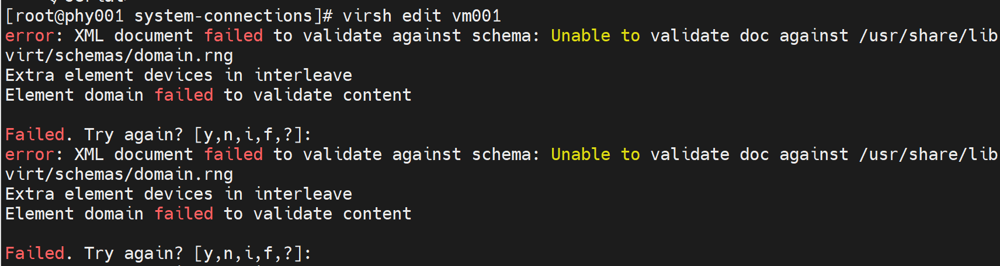

  

1. **保存退出并启动虚拟机**

```bash
virsh start vm001
```

1. **验证网卡**

```bash
virsh domiflist vm001
```

应该显示：

```
vnet0      bridge     br1        virtio
```

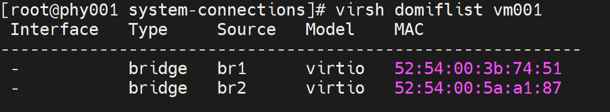

这里可能要借助gui进到vm001里配置IP地址


```shell
[root@vm001 system-connections]# cp -a enp1s0.nmconnection enp7s0.nmconnection
[root@vm001 system-connections]# ll
total 8
-rw-------. 1 root root 229 Dec 12 03:30 enp1s0.nmconnection
-rw-------. 1 root root 229 Dec 12 03:30 enp7s0.nmconnection

[root@vm001 system-connections]# vi enp7s0.nmconnection
[root@vm001 system-connections]# cat enp7s0.nmconnection
[connection]
id=enp7s0
uuid=b8696dcd-ecd1-4463-a56a-38c35f31c43e
type=ethernet
autoconnect=true
interface-name=enp7s0

[ethernet]

[ipv4]
method=manual
addresses=123.1.1.2/24
dns=1.1.1.1


[ipv6]
addr-gen-mode=eui64
method=auto

[proxy]
[root@vm001 system-connections]#


[root@vm001 system-connections]# nmcli conn reload
[root@vm001 system-connections]# nmcli conn up enp7s0
Connection successfully activated (D-Bus active path: /org/freedesktop/NetworkManager/ActiveConnection/4)

[root@vm001 system-connections]# nmcli conn
NAME                UUID                                  TYPE      DEVICE
enp1s0              8ff79451-b5b0-3351-8f96-e5390579b2cc  ethernet  enp1s0
enp7s0              b8696dcd-ecd1-4463-a56a-38c35f31c43e  ethernet  enp7s0
lo                  9a306733-1a3d-446c-bc83-739178574d38  loopback  lo
Wired connection 1  51a49b21-e774-3cb6-b0bd-fbe9196eb95c  ethernet  --

[root@vm001 system-connections]# ip a
1: lo: <LOOPBACK,UP,LOWER_UP> mtu 65536 qdisc noqueue state UNKNOWN group default qlen 1000
    link/loopback 00:00:00:00:00:00 brd 00:00:00:00:00:00
    inet 127.0.0.1/8 scope host lo
       valid_lft forever preferred_lft forever
    inet6 ::1/128 scope host noprefixroute
       valid_lft forever preferred_lft forever
2: enp1s0: <BROADCAST,MULTICAST,UP,LOWER_UP> mtu 1500 qdisc fq_codel state UP group default qlen 1000
    link/ether 52:54:00:3b:74:51 brd ff:ff:ff:ff:ff:ff
    altname enx5254003b7451
    inet 192.168.126.130/24 brd 192.168.126.255 scope global dynamic noprefixroute enp1s0
       valid_lft 1522sec preferred_lft 1522sec
    inet6 fe80::5054:ff:fe3b:7451/64 scope link noprefixroute
       valid_lft forever preferred_lft forever
3: enp7s0: <BROADCAST,MULTICAST,UP,LOWER_UP> mtu 1500 qdisc fq_codel state UP group default qlen 1000
    link/ether 52:54:00:5a:a1:87 brd ff:ff:ff:ff:ff:ff
    altname enx5254005aa187
    inet 123.1.1.2/24 brd 123.1.1.255 scope global noprefixroute enp7s0
       valid_lft forever preferred_lft forever
    inet6 fe80::5054:ff:fe5a:a187/64 scope link noprefixroute
       valid_lft forever preferred_lft forever
[root@vm001 system-connections]# ping 123.1.1.2
PING 123.1.1.2 (123.1.1.2) 56(84) bytes of data.
64 bytes from 123.1.1.2: icmp_seq=1 ttl=64 time=0.407 ms
^C

[root@vm001 system-connections]# nmcli conn delete 'Wired connection 1'
Connection 'Wired connection 1' (51a49b21-e774-3cb6-b0bd-fbe9196eb95c) successfully deleted.
[root@vm001 system-connections]# nmcli conn
NAME    UUID                                  TYPE      DEVICE
enp1s0  8ff79451-b5b0-3351-8f96-e5390579b2cc  ethernet  enp1s0
enp7s0  b8696dcd-ecd1-4463-a56a-38c35f31c43e  ethernet  enp7s0
lo      9a306733-1a3d-446c-bc83-739178574d38  loopback  lo
[root@vm001 system-connections]#


# 查看双网卡双路由。
[root@vm001 system-connections]# ip route show
default via 192.168.126.2 dev enp1s0 proto dhcp src 192.168.126.130 metric 100
123.1.1.0/24 dev enp7s0 proto kernel scope link src 123.1.1.2 metric 101
192.168.126.0/24 dev enp1s0 proto kernel scope link src 192.168.126.130 metric 100


```

------


## 🧠 一句话总结（你这个场景）

> **要宿主 + VM 都能通网络 → IP 永远配置在 bridge 上，而不是 em 上**


# nmcli reload up的顺序

## 🧠 一句话结论

> **先 up bridge，再 up 物理口（slave）**
> 因为：**slave 没有 master 是无法独立存在的**

------

## 🔍 逐条解释你这 5 行命令

### 1️⃣ `nmcli connection reload`

```bash
nmcli connection reload
```

**作用**：

- 让 NetworkManager 重新读取 `.nmconnection` 文件
- 不会启停接口
- 不改现有链路状态

👉 **这是“读配置”**

------

### 2️⃣ `nmcli connection up br1`

```bash
nmcli conn up br1
```

**发生了什么**：

- 创建 bridge 设备 `br1`
- 应用 `[bridge]` 参数（STP / delay 等）
- 启动 br1 的 IP（DHCP / static）
- br1 进入 **UP 状态**

👉 **master 先出生**

------

### 3️⃣ `nmcli connection up em1`

```bash
nmcli conn up em1
```

**发生了什么**：

- em1 被标记为 `slave-type=bridge`
- em1 挂到 **已经存在的 br1**
- em1 不再单独拿 IP
- em1 进入 forwarding 状态

👉 **端口加入交换机**

------

### 4️⃣ `nmcli connection up br2`

同 br1，一模一样逻辑。

------

### 5️⃣ `nmcli connection up em2`

同 em1，一模一样逻辑。

------

## ❌ 如果你反过来会发生什么（重点）

### ❌ 先 up em1

```bash
nmcli conn up em1
```

但：

```ini
master=br1
slave-type=bridge
```

而 **br1 还不存在**

NetworkManager 的行为是：

- 要么：
  - 卡住（你之前遇到的）
- 要么：
  - 自动把 em1 down
- 要么：
  - 反复 attach / detach
- 最坏：
  - SSH 直接断

👉 **这是你前面“nmcli up 卡住”的根本原因**

------

## 🧱 用“交换机”来理解（最清楚）

现实世界：

1. 你得 **先买一台交换机**
2. 再把网线插上去

你不可能：

> 网线插空气里，等交换机出现

bridge / slave 就是这个关系。

------

## 🧪 验证你顺序对不对（一个命令）

```bash
bridge link
```

你会看到：

```
ens33 master br1 state forwarding
ens36 master br2 state forwarding
```

如果顺序错了，状态会是：

- `disabled`
- `blocking`
- 或反复 flap

------

## ✅ 最佳实践（你可以记住这一条）

> **凡是 master / slave 结构（bridge、bond、team）：**
>
> **永远先 up master，再 up slave**

------

## 🧠 再补一句（运维经验）

在生产上我们一般：

```bash
nmcli conn reload
nmcli conn up br1
nmcli conn up br2
# 确认没问题
nmcli conn up em1
nmcli conn up em2
```

中间留 **几秒观察**，避免“全网一把梭”。

------

你现在这个问题已经是 **“懂原理的人才会问的”** 级别了 👍
下一步我建议你直接验证：

- VM 是否 **启动即通**
- VM 内默认路由是否走外网口

要不要我帮你 **把 VM 内路由也一次性理顺**？


# 为什么ip不能配在物理口上，要配置在br上

这个问题问到了 Linux 桥接的核心逻辑，本质是 **“虚拟交换机的工作原理”**，一句话结论：IP 配在物理口（em）上会和桥（br）冲突，导致网络路由混乱，宿主 / VM 都无法正常通信。

### 核心原因：Linux Bridge 是 “虚拟交换机”，不是 “转发通道”

1. 桥（br）的本质是模拟物理交换机，作用是 “二层转发”（比如把 VM 的数据包通过物理口发出去）。

1. IP 是 “三层地址”，用于 “跨网段通信”（比如宿主机访问外网、VM 访问内网网关），必须配置在 “交换机本身”，而不是 “交换机的端口” 上。

举个真实世界的类比（一看就懂）：

- 物理交换机有多个端口，电脑插在端口上，但 **IP 配置在电脑上，不是交换机端口上**。

- Linux 里的 br 就是 “虚拟交换机”，em1/em2 是这个交换机的 “物理端口”，vnetX（VM 网卡）是 “虚拟端口”—— 所以 IP 必须配在 br（交换机本身）上，em1/em2 只负责 “接线”，不需要也不能有 IP。

### 配在物理口上的直接后果（你之前遇到的翻车问题）

如果 em1 配了 IP，br1 也配了 IP，相当于：

1. 宿主机有两个 “外网出口”（em1 和 br1），系统不知道该走哪个路由，导致 nmcli up 卡住、SSH 断开。

1. VM 发的数据包到 br1 后，会和 em1 的 IP 冲突，出现 “ARP 欺骗” 类问题，VM 要么 ping 不通，要么时通时断。

1. 网络流量会在 em1 和 br1 之间无限循环（环路），最终导致整个内外网瘫痪。

### 补充：桥接的 “数据流向”（理解后再也不会错）

以 VM 访问外网为例：

1. VM 的数据包 → vnet0（VM 网卡）→ br1（虚拟交换机，有外网 IP）。

1. br1 识别到是外网请求，通过自身的路由表 → 转发到 em1（物理端口，无 IP）。

1. em1 把数据包通过网线发出去，最终到达外网。

如果 em1 有 IP，步骤 2 会混乱：br1 和 em1 都想处理这个数据包，互相抢流量，结果就是 “谁都处理不好”。

简单总结：**IP 是 “决策者”（负责选路），br 是 “交换机”（负责转发），em 是 “接线员”（负责传数据）** —— 决策者只能有一个（br 上的 IP），接线员不能抢决策者的活（em 不能有 IP），否则整个流程就乱了。

要不要我帮你整理一份 **“Linux 桥接网络数据流向示意图”**，用可视化的方式把这个逻辑画清楚，后续配置时直接对照？


## 全程CLI的kvm安装桥接记录

### 1、全程无gui

```shell
virt-install \
--name vm001 \
--memory 2048 \
--vcpus 2 \
--disk path=/var/lib/libvirt/images/vm001.qcow2,size=15 \
--os-variant rocky10 \
--network bridge=br1,model=virtio \
--network bridge=br2,model=virtio \
--graphics none \
--console pty,target_type=serial \
--location /data/isos/Rocky-10.1-x86_64-minimal.iso \
--extra-args "console=ttyS0,115200n8"


...
...


```

等一会开始进入配置向导text版👇

```shell
Starting installer, one moment...
libreport is not available in this environment - bug reporting disabled
anaconda 40.22.3.33-1.el10.rocky.0.3 for Rocky Linux 10.1 started.
 * installation log files are stored in /tmp during the installation
 * shell is available on TTY2 and in second TMUX pane (ctrl+b, then press 2)
 * if the graphical installation interface fails to start, try again with the
   inst.text bootoption to start text installation
 * when reporting a bug add logs from /tmp as separate text/plain attachments
================================================================================
================================================================================
Text mode provides a limited set of installation options. It does not offer
custom partitioning for full control over the disk layout. Would you like to use
remote graphical access via the RDP protocol instead?

1) Use graphical mode via Remote Desktop Protocol
2) Use text mode

Please make a selection from the above ['c' to continue, 'q' to quit, 'r' to
refresh]: 2
python-meh: libreport is not available in this environment - bug reporting disabled
================================================================================
================================================================================

Installation

1) [x] Language settings                 2) [x] Time settings
       (English (United States))                (America/New_York timezone)
3) [!] Installation source               4) [!] Software selection
       (Setting up installation                 (Processing...)
       source...)
5) [!] Installation Destination          6) [x] Kdump
       (Automatic partitioning                  (Kdump is enabled)
       selected)
7) [x] Network configuration             8) [!] Root password
       (Connected: enp2s0, enp1s0)              (Root account is disabled)
9) [!] User creation
       (No user will be created)

Please make a selection from the above ['b' to begin installation, 'q' to quit,
'r' to refresh]: 1


```

这就安装进去了

```
         Starting rsyslog.service - System Logging Service...
[  OK  ] Started rsyslog.service - System Logging Service.
[  OK  ] Reached target multi-user.target - Multi-User System.
         Starting systemd-update-utmp-runle…- Record Runlevel Change in UTMP...
[  OK  ] Finished systemd-update-utmp-runle…e - Record Runlevel Change in UTMP.

Rocky Linux 10.1 (Red Quartz)
Kernel 6.12.0-124.8.1.el10_1.x86_64 on x86_64

localhost login: [   48.924753] block dm-0: the capability attribute has been deprecated.

localhost login: rot
Password:
Login incorrect

localhost login: root
Password:
[root@localhost ~]#
[root@localhost ~]# ip a
1: lo: <LOOPBACK,UP,LOWER_UP> mtu 65536 qdisc noqueue state UNKNOWN group default qlen 1000
    link/loopback 00:00:00:00:00:00 brd 00:00:00:00:00:00
    inet 127.0.0.1/8 scope host lo
       valid_lft forever preferred_lft forever
    inet6 ::1/128 scope host noprefixroute
       valid_lft forever preferred_lft forever
2: enp1s0: <BROADCAST,MULTICAST,UP,LOWER_UP> mtu 1500 qdisc fq_codel state UP group default qlen 1000
    link/ether 52:54:00:7a:c2:b4 brd ff:ff:ff:ff:ff:ff
    altname enx5254007ac2b4
    inet 192.168.126.132/24 brd 192.168.126.255 scope global dynamic noprefixroute enp1s0
       valid_lft 1539sec preferred_lft 1539sec
    inet6 fe80::5054:ff:fe7a:c2b4/64 scope link noprefixroute
       valid_lft forever preferred_lft forever
3: enp2s0: <BROADCAST,MULTICAST,UP,LOWER_UP> mtu 1500 qdisc fq_codel state UP group default qlen 1000
    link/ether 52:54:00:49:3a:76 brd ff:ff:ff:ff:ff:ff
    altname enx525400493a76
    inet 192.168.127.131/24 brd 192.168.127.255 scope global dynamic noprefixroute enp2s0
       valid_lft 1539sec preferred_lft 1539sec
    inet6 fe80::5054:ff:fe49:3a76/64 scope link noprefixroute
       valid_lft forever preferred_lft forever
[root@localhost ~]# lscpu |grep ker
[root@localhost ~]# lscpu |grep vend
Hypervisor vendor:                       KVM
[root@localhost ~]#

```

通过ctrl ] 退出到宿主机👇

```shell
       valid_lft forever preferred_lft forever
[root@localhost ~]# exit
logout

Rocky Linux 10.1 (Red Quartz)
Kernel 6.12.0-124.8.1.el10_1.x86_64 on x86_64

localhost login: exit
Password:


Login incorrect

localhost login:
Password:
[root@phy001 images]#
[root@phy001 images]#

```

平时也可以通过console登入

```shell


[root@phy001 images]# virsh  list
 Id   Name    State
-----------------------
 7    vm001   running

[root@phy001 images]#
[root@phy001 images]# virsh console vm001
Connected to domain 'vm001'
Escape character is ^] (Ctrl + ])

[root@localhost ~]# ip a
1: lo: <LOOPBACK,UP,LOWER_UP> mtu 65536 qdisc noqueue state UNKNOWN group default qlen 1000
    link/loopback 00:00:00:00:00:00 brd 00:00:00:00:00:00
    inet 127.0.0.1/8 scope host lo
       valid_lft forever preferred_lft forever
    inet6 ::1/128 scope host noprefixroute
       valid_lft forever preferred_lft forever
2: enp1s0: <BROADCAST,MULTICAST,UP,LOWER_UP> mtu 1500 qdisc fq_codel state UP group default qlen 1000
    link/ether 52:54:00:7a:c2:b4 brd ff:ff:ff:ff:ff:ff
    altname enx5254007ac2b4
    inet 192.168.126.132/24 brd 192.168.126.255 scope global dynamic noprefixroute enp1s0
       valid_lft 927sec preferred_lft 927sec
    inet6 fe80::5054:ff:fe7a:c2b4/64 scope link noprefixroute
       valid_lft forever preferred_lft forever
3: enp2s0: <BROADCAST,MULTICAST,UP,LOWER_UP> mtu 1500 qdisc fq_codel state UP group default qlen 1000
    link/ether 52:54:00:49:3a:76 brd ff:ff:ff:ff:ff:ff
    altname enx525400493a76
    inet6 fe80::5054:ff:fe49:3a76/64 scope link noprefixroute
       valid_lft forever preferred_lft forever
[root@localhost ~]#
[root@phy001 images]#

```


# 修改rocky10的网卡名为eth


1、修改grub文件

```shell
sed -ri.bak '/^GRUB_CMDLINE_LINUX=/s@(.*)"$@\1 net.ifnames=0 biosdevname=0"@' /etc/default/grub

sed -ri.bak '/^GRUB_CMDLINE_LINUX=/s@"$@ net.ifnames=0 biosdevname=0"@' /etc/default/grub

```

2、更新 grub 配置

```shell
# 判断BIOS还是UEFI
[ -d /sys/firmware/efi ] && echo "UEFI" || echo "BIOS"
# BIOS 系统
grub2-mkconfig -o /boot/grub2/grub.cfg
# UEFI 系统
grub2-mkconfig -o /boot/efi/EFI/rocky/grub.cfg

# UEFI
EFI_DIR=`find /boot/efi/ -name "grub.cfg" | awk -F"/" '{print $5}'`

# Rocky、Almalinux、CentOS、openEuler、AnolisOS、OpenCloudOS、Kylin Server、Uos Server
grub2-mkconfig -o /boot/efi/EFI/${EFI_DIR}/grub.cfg

# Ubuntu、Debian
grub-mkconfig -o /boot/efi/EFI/${EFI_DIR}/grub.cfg
```

3、使用udev固定网卡名称，好像前两部可以省略

```shell
cat <<EOF > /etc/udev/rules.d/50-persistent-net.rules
SUBSYSTEM=="net", ACTION=="add", ATTR{address}=="第一块网卡的mac", NAME="eth0"
SUBSYSTEM=="net", ACTION=="add", ATTR{address}=="xx:xx:xx:xx:xx:xx", NAME="eth1"
EOF

```

4、重启reboot


# vm时间倒退问题

看到的是

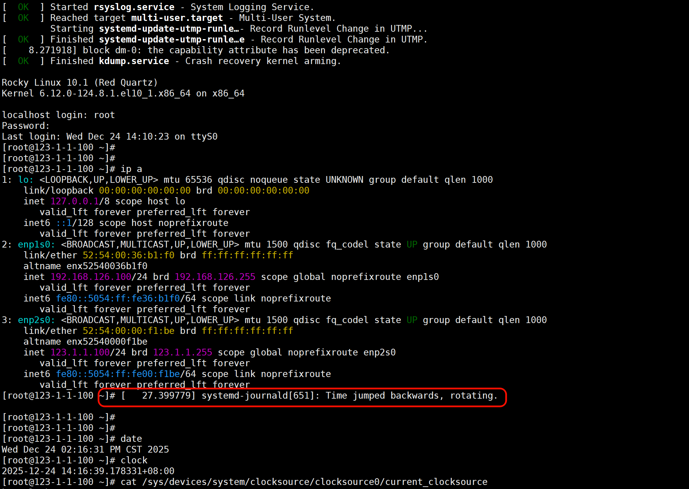

确认是否真的倒退看

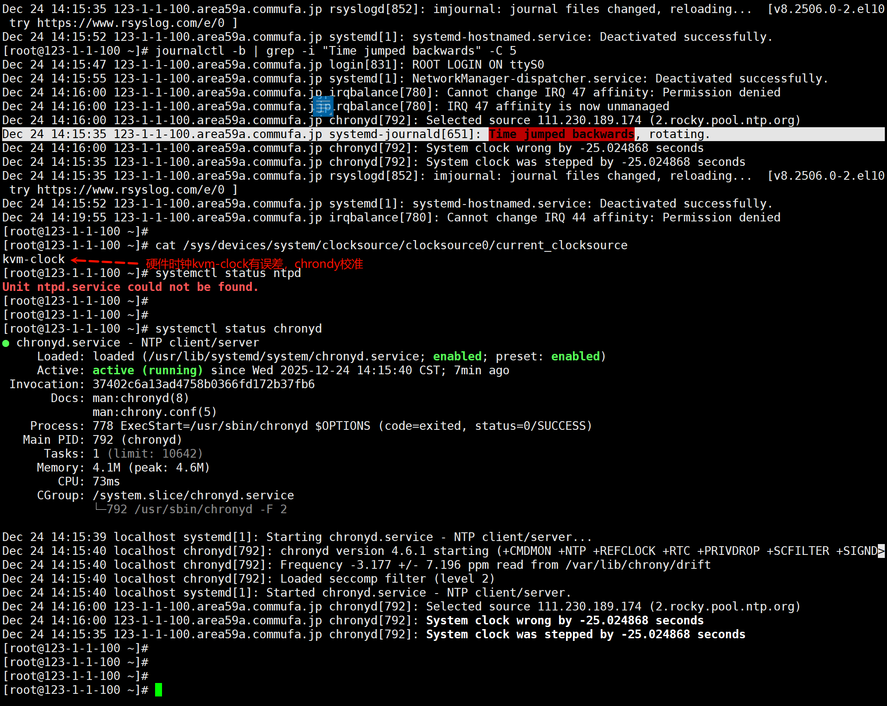

如何解决，应该不用解决，这是装机的时候有chronyd直接就有了，开机后chronyd发现快了25s就自动调整了

如果总是出现这个，就是要关注宿主机的时间是否不对。

cli总结

```shell
cat /sys/devices/system/clocksource/clocksource0/current_clocksource

timedatectl set-local-rtc 0

systemctl restart chronyd
chronyc makestep
clock -w
```


