# 04.KVM实现自动化创建虚拟机.md


# 1、查看支持的os的两个cli 

```shell
virt-install --osinfo list
osinfo-query os
```


 这是win2016 2008这下👇

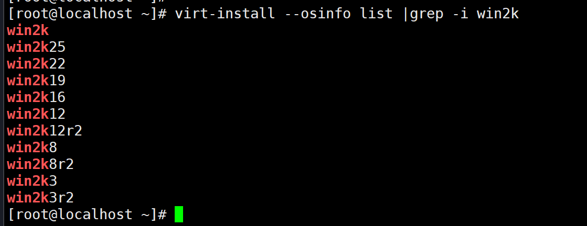


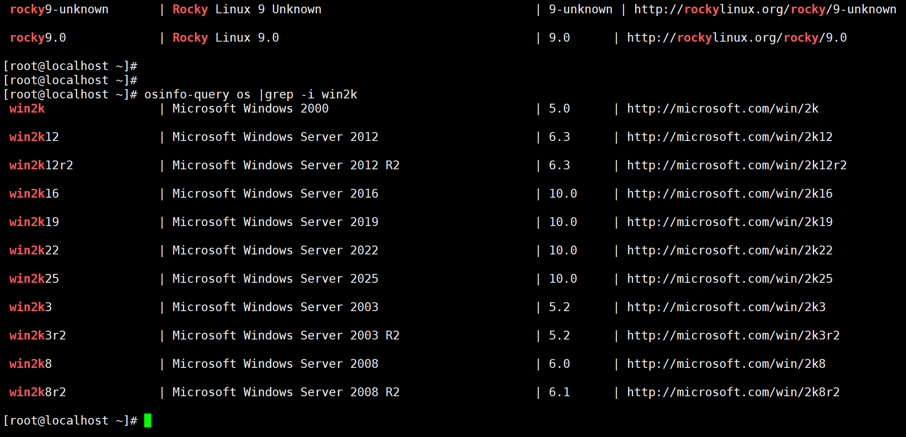


# 2、linux无GUI安装过程

在前面的02章节里有讲过无gui和桥接的操作，这里整合一下，并增加了ks的全自动安装实操。

## 2.1 宿主机网卡配置好


### ①修改宿主网卡为eth0 eth1(可选)

1、修改grub文件

```shell
sed -ri.bak '/^GRUB_CMDLINE_LINUX=/s@(.*)"$@\1 net.ifnames=0 biosdevname=0"@' /etc/default/grub
```

2、更新 grub 配置

```shell
# 判断BIOS还是UEFI
[ -d /sys/firmware/efi ] && echo "UEFI" || echo "BIOS"
# BIOS 系统
grub2-mkconfig -o /boot/grub2/grub.cfg
# UEFI 系统
grub2-mkconfig -o /boot/efi/EFI/rocky/grub.cfg

# UEFI
EFI_DIR=`find /boot/efi/ -name "grub.cfg" | awk -F"/" '{print $5}'`

# Rocky、Almalinux、CentOS、openEuler、AnolisOS、OpenCloudOS、Kylin Server、Uos Server
grub2-mkconfig -o /boot/efi/EFI/${EFI_DIR}/grub.cfg

# Ubuntu、Debian
grub-mkconfig -o /boot/efi/EFI/${EFI_DIR}/grub.cfg
```

3、使用udev固定网卡名称，好像前两部可以省略

```shell
cat <<EOF > /etc/udev/rules.d/50-persistent-net.rules
SUBSYSTEM=="net", ACTION=="add", ATTR{address}=="第一块网卡的mac", NAME="eth0"
SUBSYSTEM=="net", ACTION=="add", ATTR{address}=="xx:xx:xx:xx:xx:xx", NAME="eth1"
EOF

```

4、重启reboot


你的目标拓扑（最终形态）

```
        外网
         |
       eth0
         |
       br1  <---- 宿主外网 IP
      /   \
   vnet0  宿主
     |
   vm001(外网)

--------------------------------

       内网
         |
       eth1
         |
       br2  <---- 宿主内网 IP
      /   \
   vnet1  宿主
     |
   vm001(内网)
```

### ②外网桥 br1（宿主拿外网 IP）

```shell
cat  <<EOF > /etc/NetworkManager/system-connections/br1.nmconnection
[connection]
id=br1
uuid=这里使用uuidgen生成，在vim里输入:r!uuidgen即可
type=bridge
interface-name=br1
autoconnect=true

[bridge]
stp=false

[ipv4]
method=auto

[ipv6]
method=ignore
EOF
```

------

### ③ eth0 作为 br1 从口（不拿 IP）

```shell
cat  <<EOF >  /etc/NetworkManager/system-connections/eth0.nmconnection
[connection]
id=eth0
uuid=这里使用uuidgen生成，在vim里输入:r!uuidgen即可
type=ethernet
interface-name=eth0
autoconnect=true
master=br1
slave-type=bridge

[ethernet]

[ipv4]
method=disabled

[ipv6]
method=ignore

[proxy]
EOF
```

------

### ④ 内网桥 br2（宿主拿内网 IP）

```shell
cat  <<EOF > /etc/NetworkManager/system-connections/br2.nmconnection
[connection]
id=br2
uuid=这里使用uuidgen生成，在vim里输入:r!uuidgen即可
type=bridge
interface-name=br2
autoconnect=true

[bridge]
stp=false

[ipv4]
method=manual
addresses=10.100.1.1/24

[ipv6]
method=ignore

EOF
```

------

### ⑤ eth1加入 br2（不拿 IP）

```shell
cat  <<EOF >  /etc/NetworkManager/system-connections/eth1.nmconnection
[connection]
id=eth1
uuid=这里使用uuidgen生成，在vim里输入:r!uuidgen即可
type=ethernet
interface-name=eth1
master=br2
slave-type=bridge
autoconnect=true

[ethernet]

[ipv4]
method=disabled

[ipv6]
method=ignore

[proxy]

EOF
```


### ⑥ 修改网卡文件的权限

```shell
chmod 600 /etc/NetworkManager/system-connections/*
```


------

### 🔁 激活顺序（**非常重要**）

⚠️ 建议 **本地控制台操作，不要 SSH**，如果没法本地控制台，那就下面的4条命令一把敲，一定要保证前面的正确。

```shell
nmcli connection reload
nmcli connection up br1
nmcli connection up eth0
nmcli connection up br2
nmcli connection up eth1
```

检查：

```bash
ip a
brctl show   # 没有就：yum -y install epel-release && dnf -y install bridge-utils
```

你应该看到：

- `br1` 有外网 IP
- `br2` 有内网 IP
- `em1/em2` **没有 IP**
- `vnetX` 自动挂在对应 bridge


## 2.2 ks文件和iso准备好

```
[root@localhost data]# pwd
/data
[root@localhost data]# tree
.
├── isos
│   └── Rocky-10.1-x86_64-minimal.iso
└── ks
    └── ks-rocky10.cfg

2 directories, 2 files
[root@localhost data]# 

```

```shell
[root@localhost data]# cat /data/ks/ks-rocky10.cfg 
# ===============================
# 基础安装方式
# ===============================
text
reboot
cdrom

# ===============================
# 语言 / 键盘 / 时区
# ===============================
lang en_US.UTF-8
keyboard us
timezone Asia/Shanghai

# ===============================
# 网络（DHCP，安装后可改静态IP）
# ===============================
# network --bootproto=dhcp --device=eth0 --onboot=on

# ===============================
# 网络（静态 IP，生产环境）
# ===============================

# eth0 - 外网（默认路由）
network --device=eth0 --bootproto=static --ip=192.168.126.100 --netmask=255.255.255.0 --gateway=192.168.126.2 --nameserver=192.168.126.2 --onboot=on --activate

# eth1 - 内网
network --device=eth1 --bootproto=static --ip=123.0.0.1 --netmask=255.255.255.0 --onboot=on --activate


# ===============================
# Root 密码
# ===============================
rootpw --plaintext ChangeMe123!

# ===============================
# SELinux / 防火墙
# ===============================
selinux --disabled
firewall --disabled

# ===============================
# 启动器
# ===============================
bootloader --location=mbr

# ===============================
# 磁盘分区（LVM） 注意vda跟总线的关系
# ===============================
zerombr
ignoredisk --only-use=vda
clearpart --all --initlabel

part biosboot --fstype=biosboot --size=2
part /boot --fstype=xfs --size=1024
part swap --size=2048

part pv.01 --grow
volgroup vg0 pv.01

logvol / --vgname=vg0 --percent=100 --name=root --fstype=xfs


# ===============================
# 软件包
# ===============================
%packages --ignoremissing
@^minimal-environment
@core

curl
bash-completion
net-tools
chrony
rsyslog
lsof

-audio
-plymouth
%end

# ===============================
# 安装后配置
# ===============================
%post --log=/root/ks-post.log

# 设置时钟
systemctl enable chronyd
systemctl start chronyd

# 将 RTC 设置为 UTC，同时立即修正系统时间，保证系统时间和本地时区显示正确
timedatectl set-local-rtc 0 --adjust-system-clock


# 启用串口控制台 (KVM console)
systemctl enable serial-getty@ttyS0.service

# SSH 基础加固
sed -i 's/^#UseDNS yes/UseDNS no/' /etc/ssh/sshd_config
sed -i 's/^GSSAPIAuthentication yes/GSSAPIAuthentication no/' /etc/ssh/sshd_config
systemctl restart sshd

# 确保传统网卡命名，virsh-install里带上了无需这里打开,而且对于rokcy10也要优化udev/rules.d/下的文件，备着不用了。
# sed -ri.bak '/^GRUB_CMDLINE_LINUX=/s@(.*)"$@\1 net.ifnames=0 biosdevname=0"@' /etc/default/grub
# grub2-mkconfig -o /boot/grub2/grub.cfg
# cat <<EOF > /etc/udev/rules.d/50-persistent-net.rules
# SUBSYSTEM=="net", ACTION=="add", ATTR{address}=="第一块网卡的mac", NAME="eth0"
# SUBSYSTEM=="net", ACTION=="add", ATTR{address}=="xx:xx:xx:xx:xx:xx", NAME="eth1"
# EOF


# 提高文件句柄
cat >> /etc/security/limits.conf <<EOF
* soft nofile 1048576
* hard nofile 1048576
* soft nproc  65535
* hard nproc  65535
EOF

# sysctl 常用优化
cat > /etc/sysctl.d/99-prod.conf <<EOF
net.ipv4.ip_forward = 0
net.ipv4.tcp_syncookies = 1
net.ipv4.tcp_tw_reuse = 1
net.ipv4.tcp_tw_recycle = 0
net.core.somaxconn = 65535
fs.file-max = 2097152
vm.swappiness = 10
EOF

sysctl --system

%end


```

带注释版👇 todo

```
略，复制给GPT 让他注释就好
```

### 1️⃣检查ks文件


```shell
yum -y install pykickstart
ksvalidator ks-rocky.cfg
```


------

### 2️⃣ 创建一个小 ISO 文件，只包含 KS 文件

```shell
root@localhost ~]# 
[root@localhost ~]# tree /data/
/data/
├── isos
│   └── Rocky-10.1-x86_64-minimal.iso
└── ks
    ├── ks-rocky10.cfg
    └── ks-rocky10.iso

2 directories, 3 files

```

 KS 文件在宿主机 `/data/ks/ks-rocky10.cfg`：

```
mkdir -p /tmp/ks-iso
cp /data/ks/ks-rocky10.cfg /tmp/ks-iso/

# 创建 ISO，挂载点为根目录，“inst.ks=cdrom:/ks-rocky10.cfg”
genisoimage -output /data/ks/ks-rocky10.iso -volid ks -joliet -rock /tmp/ks-iso
```

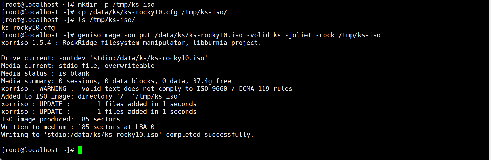

#### 参数解析

1. **`genisoimage`**
   - 生成 ISO 文件的命令，相当于把一个目录打包成光盘镜像。
   - Rocky 10 / RHEL 10 的安装器可以识别 ISO 上的 KS 文件。
2. **`-output /data/ks/ks-rocky10.iso`**
   - 指定生成的 ISO 文件路径和文件名。
   - 这里会在宿主机 `/data/ks/` 下生成 `ks-rocky10.iso`。
3. **`-volid ks`**
   - 设置 ISO 卷标（volume ID），类似光盘的名字。
   - 可以随便取，但最好简短，不要有空格。
4. **`-joliet`**
   - 允许 ISO 文件中使用 Windows 风格长文件名（最多 64 个字符），兼容性更好。
   - 对 Linux 安装来说可选，但加上没有坏处。
5. **`-rock`**
   - 开启 Rock Ridge 扩展，让 ISO 支持 Linux 的文件权限和长文件名。
   - 保证 Linux 虚拟机可以正确读取文件权限。
6. **`/tmp/ks-iso`**
   - 指定要打包的源目录，这里是你存放 `ks-rocky10.cfg` 的目录。
   - ISO 会把这个目录下的文件作为光盘根目录打包进去。


## 2.3 安装命令完全离线版(ks)：

安装kvm相关工具，启动kvm守护进程

```shell
yum -y install qemu-kvm libvirt virt-install virt-viewer
systemctl enable --now libvirtd
```

高级版验证OK（rocky9.7，rocky10都OK）👇高级在进去网卡是eth0 eth1 且配合ks那边直接给eth0 1 配置好IP，进去就能用，结合无GUI安装快。

```shell
virt-install \
--name vm001 \
--memory 2048 \
--vcpus 2 \
--cpu host \
--disk path=/var/lib/libvirt/images/vm001.qcow2,size=15,bus=virtio,cache=none \
--os-variant rocky10 \
--network bridge=br1,model=virtio \
--network bridge=br2,model=virtio \
--graphics none \
--console pty,target_type=serial \
--location /data/isos/Rocky-10.1-x86_64-minimal.iso \
--disk path=/data/ks/ks-rocky10.iso,device=cdrom \
--extra-args "inst.ks=cdrom:/ks-rocky10.cfg net.ifnames=0 biosdevname=0 inst.text console=ttyS0,115200n8"
```

基础版已验证OK👇

```shell
virt-install \
--name vm001 \
--memory 2048 \
--vcpus 2 \
--cpu host \
--disk path=/var/lib/libvirt/images/vm001.qcow2,size=15,bus=virtio,cache=none \
--os-variant rocky10 \
--network bridge=br1,model=virtio \
--network bridge=br2,model=virtio \
--graphics none \
--console pty,target_type=serial \
--location /data/isos/Rocky-10.1-x86_64-minimal.iso \
--disk path=/data/ks/ks-rocky10.iso,device=cdrom \
--extra-args "inst.ks=cdrom:/ks-rocky10.cfg inst.text console=ttyS0,115200n8"
```


注意：vm的时间、网卡eth0

关键点：

1. 第二个 `--disk` 把 KS ISO 作为 CD-ROM 挂载到虚拟机。
2. `inst.ks=cdrom:/ks-rocky10.cfg` → 路径是 **ISO 根目录下的 KS 文件名**。
3. `inst.text` → 文本模式安装。
4. `console=ttyS0,115200n8` → 串口输出。


**以上的安装命令配合上面ks，实操成功，关键阶段截图如下，注不同的系统安装ks可能不同。**


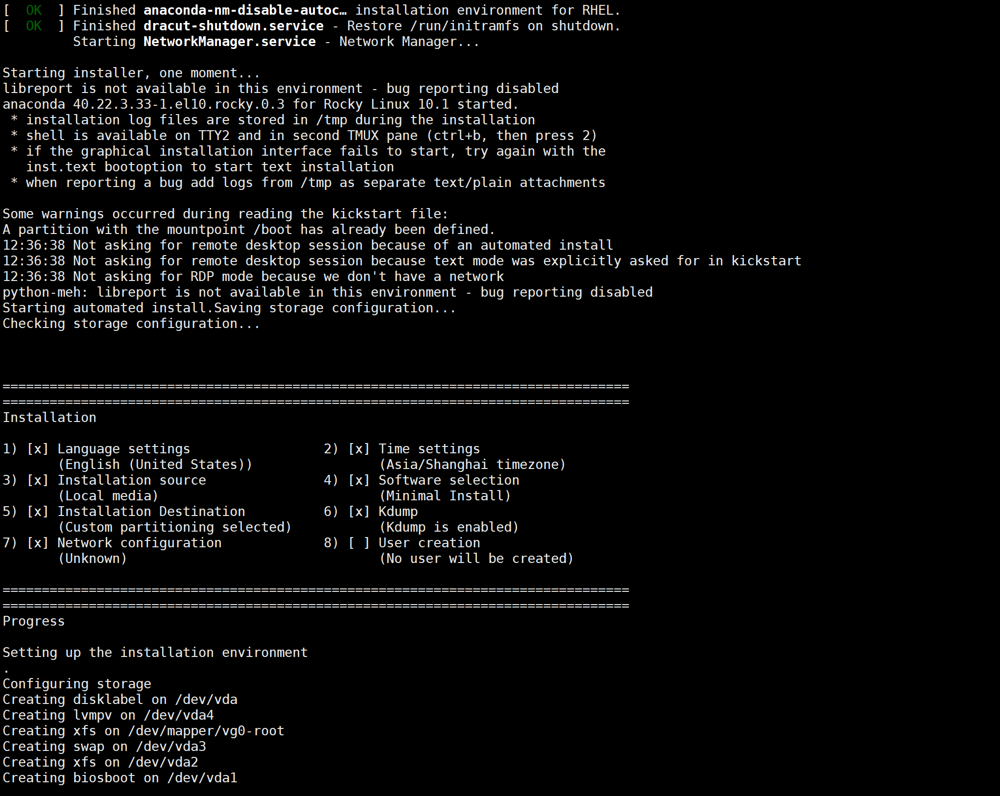


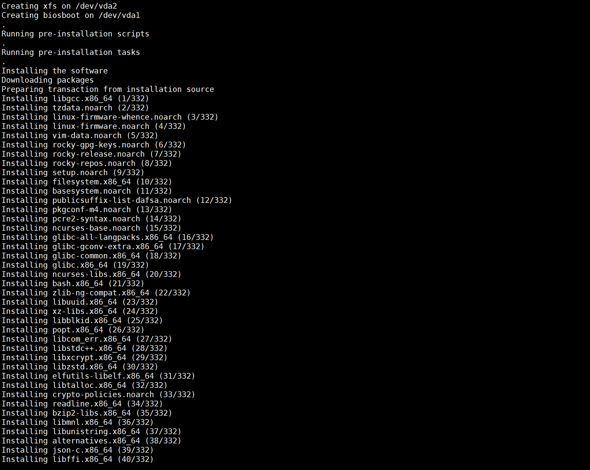


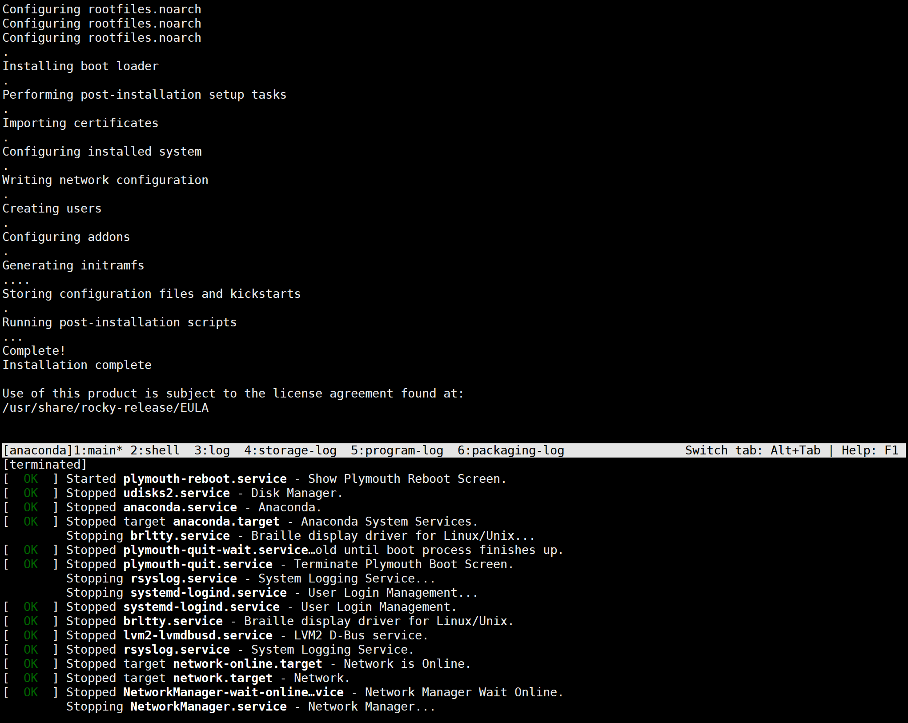


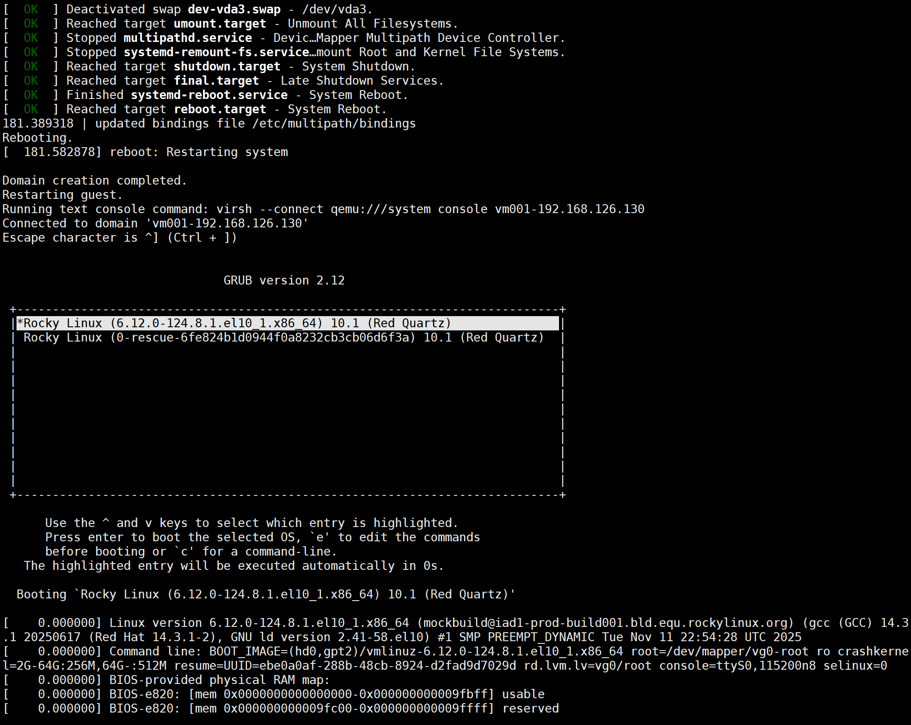


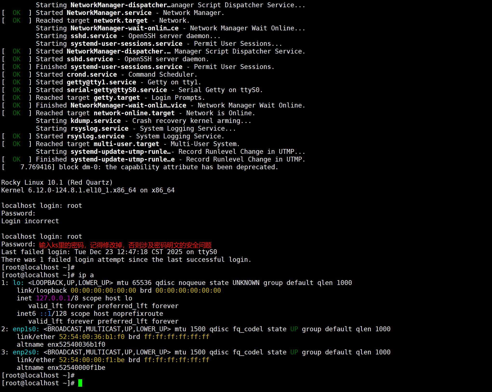

输入ctrl + ]退到宿主机层面 再次进入vish console <虚拟机的名称>就可以了


# 3、虚拟机初始化(网络桥接)

## 🖥️ 虚拟机 vm001 怎么桥接

- 网卡1 → bridge = `br1`
- 网卡2 → bridge = `br2`


好的，我帮你整理一下 **KVM 下编辑 VM（以 vm001 为例）桥接网卡的完整步骤**，适用于命令行和 `virt-manager` 两种方式。

------

## **方法一：命令行配置（virsh / XML）**

1. **查看虚拟机当前网络**

```bash
virsh domiflist vm001
bridge link
```

输出示例：可以看到forwarding状态，其实宿主机哪里br已经关闭stp了，所以必然是forwarding了。

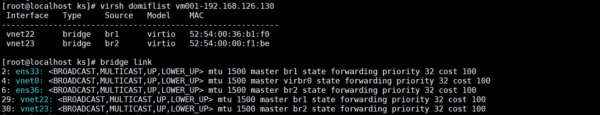


这里可能要借助gui进到vm001里配置IP地址

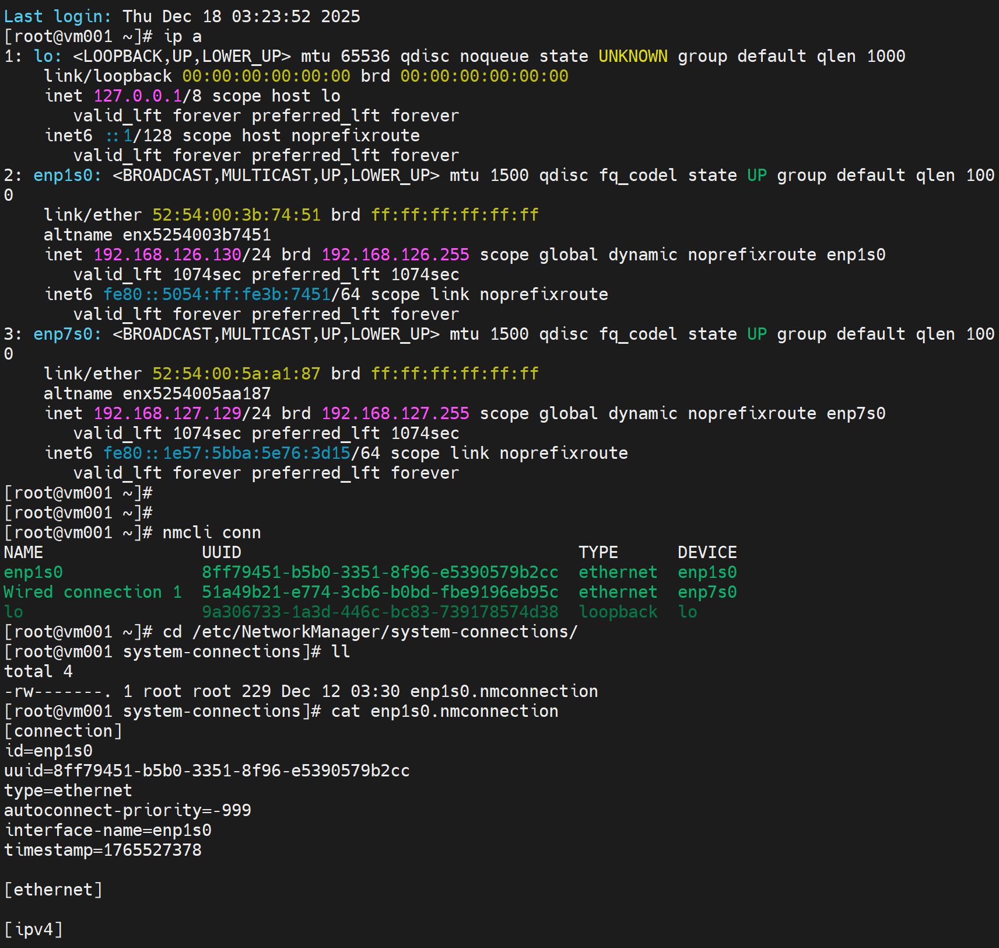

```shell
[root@vm001 system-connections]# cp -a enp1s0.nmconnection enp7s0.nmconnection
[root@vm001 system-connections]# ll
total 8
-rw-------. 1 root root 229 Dec 12 03:30 enp1s0.nmconnection
-rw-------. 1 root root 229 Dec 12 03:30 enp7s0.nmconnection

[root@vm001 system-connections]# vi enp7s0.nmconnection
[root@vm001 system-connections]# cat enp7s0.nmconnection
[connection]
id=enp7s0
uuid=b8696dcd-ecd1-4463-a56a-38c35f31c43e
type=ethernet
autoconnect=true
interface-name=enp7s0

[ethernet]

[ipv4]
method=manual
addresses=123.1.1.2/24
dns=1.1.1.1


[ipv6]
addr-gen-mode=eui64
method=auto

[proxy]
[root@vm001 system-connections]#


[root@vm001 system-connections]# nmcli conn reload
[root@vm001 system-connections]# nmcli conn up enp7s0
Connection successfully activated (D-Bus active path: /org/freedesktop/NetworkManager/ActiveConnection/4)

[root@vm001 system-connections]# nmcli conn
NAME                UUID                                  TYPE      DEVICE
enp1s0              8ff79451-b5b0-3351-8f96-e5390579b2cc  ethernet  enp1s0
enp7s0              b8696dcd-ecd1-4463-a56a-38c35f31c43e  ethernet  enp7s0
lo                  9a306733-1a3d-446c-bc83-739178574d38  loopback  lo
Wired connection 1  51a49b21-e774-3cb6-b0bd-fbe9196eb95c  ethernet  --

[root@vm001 system-connections]# ip a
1: lo: <LOOPBACK,UP,LOWER_UP> mtu 65536 qdisc noqueue state UNKNOWN group default qlen 1000
    link/loopback 00:00:00:00:00:00 brd 00:00:00:00:00:00
    inet 127.0.0.1/8 scope host lo
       valid_lft forever preferred_lft forever
    inet6 ::1/128 scope host noprefixroute
       valid_lft forever preferred_lft forever
2: enp1s0: <BROADCAST,MULTICAST,UP,LOWER_UP> mtu 1500 qdisc fq_codel state UP group default qlen 1000
    link/ether 52:54:00:3b:74:51 brd ff:ff:ff:ff:ff:ff
    altname enx5254003b7451
    inet 192.168.126.130/24 brd 192.168.126.255 scope global dynamic noprefixroute enp1s0
       valid_lft 1522sec preferred_lft 1522sec
    inet6 fe80::5054:ff:fe3b:7451/64 scope link noprefixroute
       valid_lft forever preferred_lft forever
3: enp7s0: <BROADCAST,MULTICAST,UP,LOWER_UP> mtu 1500 qdisc fq_codel state UP group default qlen 1000
    link/ether 52:54:00:5a:a1:87 brd ff:ff:ff:ff:ff:ff
    altname enx5254005aa187
    inet 123.1.1.2/24 brd 123.1.1.255 scope global noprefixroute enp7s0
       valid_lft forever preferred_lft forever
    inet6 fe80::5054:ff:fe5a:a187/64 scope link noprefixroute
       valid_lft forever preferred_lft forever
[root@vm001 system-connections]# ping 123.1.1.2
PING 123.1.1.2 (123.1.1.2) 56(84) bytes of data.
64 bytes from 123.1.1.2: icmp_seq=1 ttl=64 time=0.407 ms
^C

[root@vm001 system-connections]# nmcli conn delete 'Wired connection 1'
Connection 'Wired connection 1' (51a49b21-e774-3cb6-b0bd-fbe9196eb95c) successfully deleted.
[root@vm001 system-connections]# nmcli conn
NAME    UUID                                  TYPE      DEVICE
enp1s0  8ff79451-b5b0-3351-8f96-e5390579b2cc  ethernet  enp1s0
enp7s0  b8696dcd-ecd1-4463-a56a-38c35f31c43e  ethernet  enp7s0
lo      9a306733-1a3d-446c-bc83-739178574d38  loopback  lo
[root@vm001 system-connections]#


# 查看双网卡双路由。
[root@vm001 system-connections]# ip route show
default via 192.168.126.2 dev enp1s0 proto dhcp src 192.168.126.130 metric 100
123.1.1.0/24 dev enp7s0 proto kernel scope link src 123.1.1.2 metric 101
192.168.126.0/24 dev enp1s0 proto kernel scope link src 192.168.126.130 metric 100


```

------


------

## 🧪 验证你顺序对不对（一个命令）

```bash
bridge link
```

你会看到：

```
ens33 master br1 state forwarding
ens36 master br2 state forwarding
```

如果顺序错了，状态会是：

- `disabled`
- `blocking`
- 或反复 flap

------

## ✅ 最佳实践（你可以记住这一条）

> **凡是 master / slave 结构（bridge、bond、team）：**
>
> **永远先 up master，再 up slave**

------

## 🧠 再补一句（运维经验）

在生产上我们一般：

```bash
nmcli conn reload
nmcli conn up br1
nmcli conn up br2
# 确认没问题
nmcli conn up em1
nmcli conn up em2
```

中间留 **几秒观察**，避免“全网一把梭”。


# 4、winows安装

virtio是kvm的驱动技术，简单理解就是半虚拟化技术透传到物理机，加速io，有和磁盘打交道的virtio_blk，也有和网卡打交道的virtio_net，有给linux的用的，又给window用的。


windows的要下载，用最新版就好。

https://fedorapeople.org/groups/virt/virtio-win/direct-downloads/archive-virtio/


要后台跑&，防止安装出问题。

安装后无网卡，手动添加驱动版👇

```shell
virt-install \
--name vm002 \
--memory 4096 \
--vcpus 4 \
--cpu host \
--machine q35 \
--disk path=/var/lib/libvirt/images/vm002.qcow2,size=20,bus=virtio,cache=writeback \
--os-variant win2k16 \
--network bridge=br1,model=virtio \
--network bridge=br2,model=virtio \
--console pty,target_type=serial \
--cdrom=/data/isos/cn_windows_server_2016_x64_dvd_9718765.iso \
--disk path=/data/isos/virtio-win-0.1.285.iso,device=cdrom &
```

```
virt-install \
--name vm002 \                       # 虚拟机名称（libvirt 中的唯一标识）
--memory 4096 \                      # 分配 4GB 内存，Win2016 最低可用、较稳
--vcpus 4 \                          # 分配 4 个 vCPU
--cpu host \                         # 直通宿主 CPU 指令集，性能最好（生产推荐）
--machine q35 \                      # 使用 Q35 芯片组，支持 PCIe，Win 更友好
--disk path=/var/lib/libvirt/images/vm002.qcow2,size=20,bus=virtio,cache=writeback \  
                                      # 系统盘：20G，virtio 磁盘（需驱动），writeback 性能/稳定性平衡
--network bridge=br1,model=e1000 \   # 网卡1：桥接 br1，Intel e1000（Windows 安装阶段免驱）
--network bridge=br2,model=e1000 \   # 网卡2：桥接 br2，双网卡（内外网/业务网）
--os-variant win2k16 \               # 指定 Windows Server 2016，优化默认设备参数
--cdrom /data/isos/cn_windows_server_2016_x64_dvd_9718765.iso \  
                                      # Windows Server 2016 安装 ISO
--disk path=/data/isos/virtio-win-0.1.285.iso,device=cdrom
                                      # VirtIO 驱动光盘（安装后加载磁盘/网卡驱动用）

```


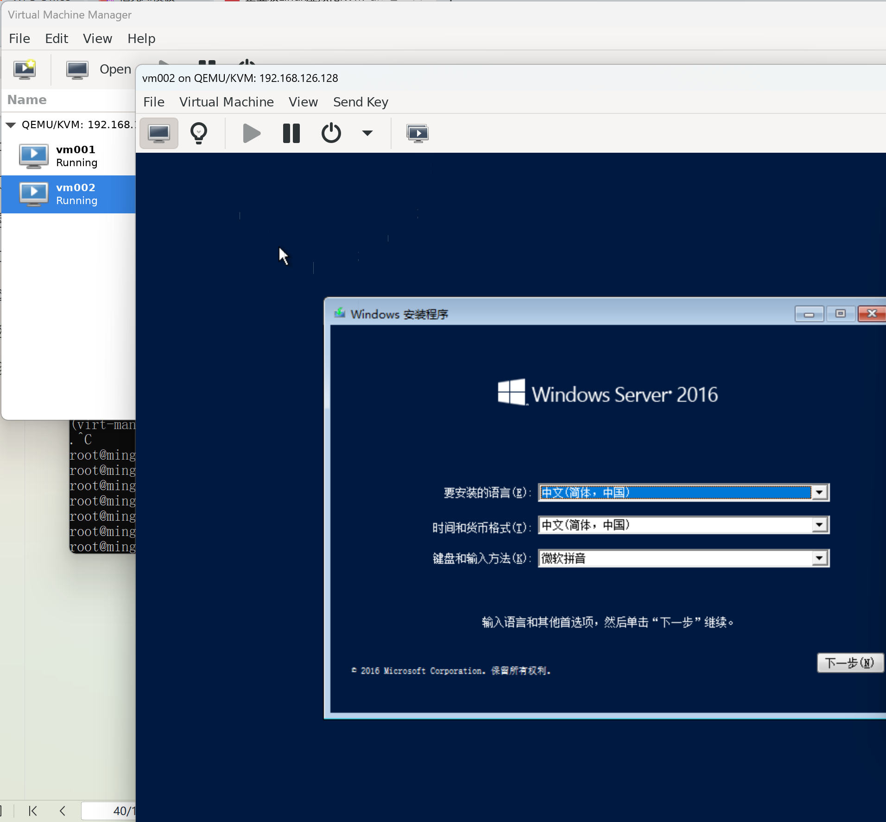

磁盘识别不出来，要驱动加载选择上面挂载的virtio-win-0.1.285.iso里的amd里的2k16，就可以继续安装了

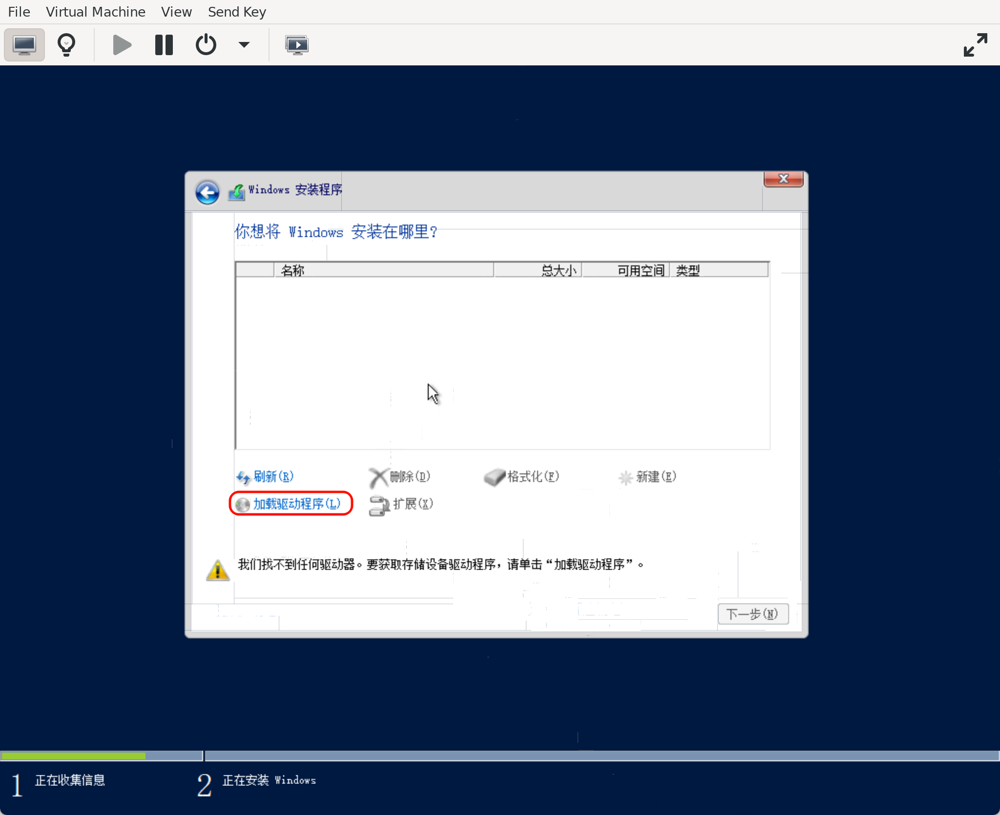


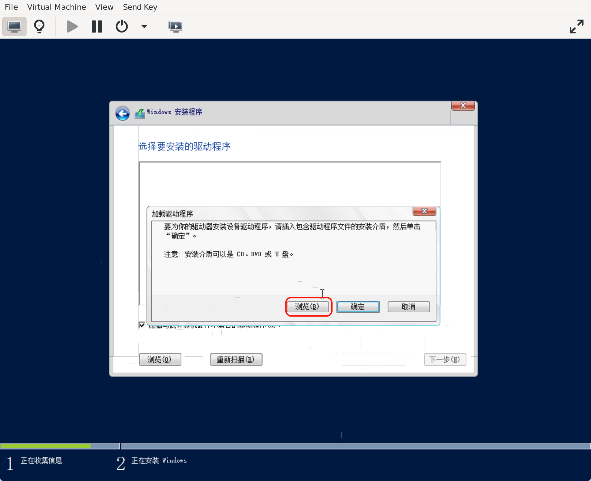


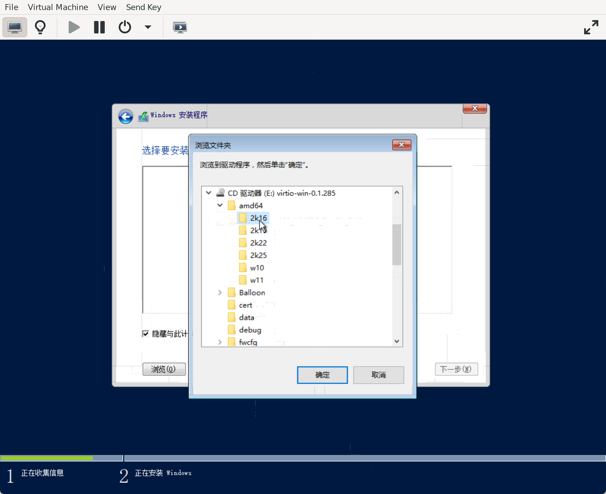


等一会virt-manager的界面按需重连一下就好了

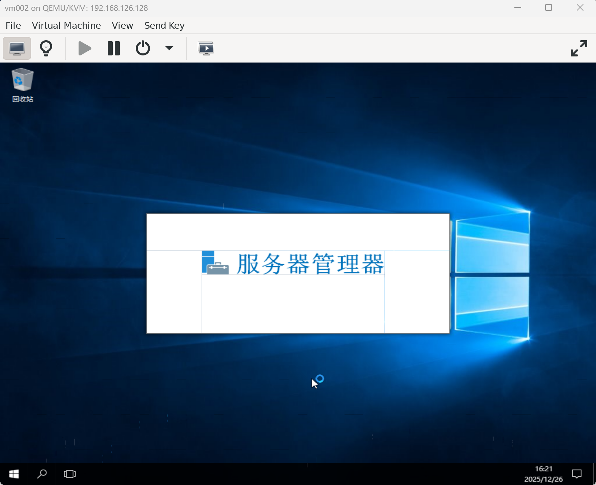


还没完，需要安装virtio网卡驱动，同样在第二块驱动iso里找到NetKVM/win2k16/amd64安装就行了。

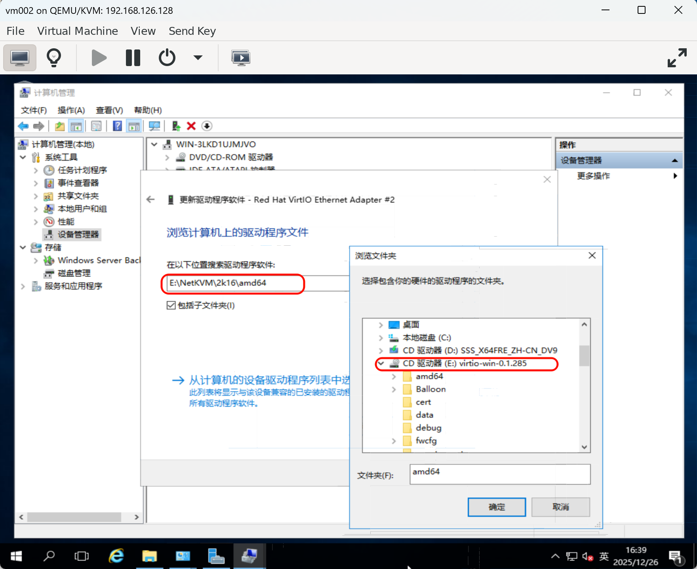


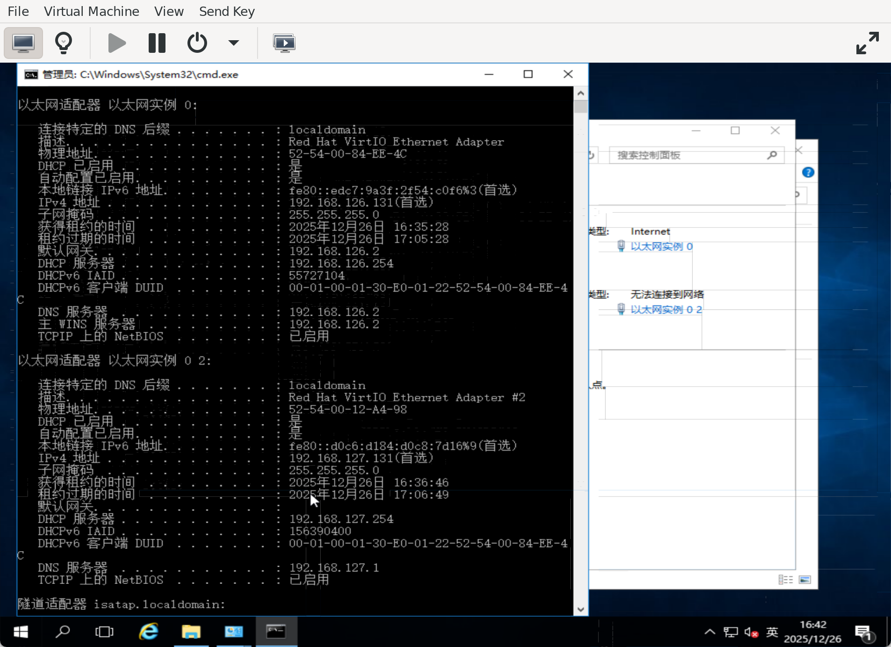

网络OK

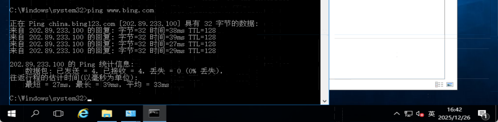


# 5、cache=什么？

**在 KVM 上：Linux VM 必须用 `cache=none`，Windows VM 必须用 `cache=writeback` 才稳。**

## 结论先给你一句话

> **Linux 用 `cache=none`，是为了“避免双重缓存（double cache）”，把缓存责任交还给最懂业务的地方。**
>
> **Windows VM 必须用 `cache=writeback`，否则同步写直接打到宿主磁盘会导致系统卡顿和服务抖动。**

------

## 这件事的核心：**Double Cache（双重缓存）**

在 KVM 场景下，如果不用 `cache=none`，I/O 路径是这样的：

```text
Linux Guest Page Cache
        ↓
QEMU / Host Page Cache
        ↓
磁盘
```

也就是说：

- **Guest 有一份页缓存**
- **Host 也有一份页缓存**
- 同一份数据，被缓存了两次

------

## Double Cache 在 Linux 场景下的问题

### 1️⃣ 浪费内存（这是最直接的）

- Guest 认为：这页我缓存着
- Host 也认为：这页我缓存着

结果：

- 1GB 数据
- 实际占用 2GB 内存

在 Linux Server 上，这是**不可接受的浪费**。

------

### 2️⃣ Linux 本来就“非常会缓存”

Linux 的 page cache 特点：

- LRU 精细
- 回收策略成熟
- 能根据 I/O 模式动态调整
- 应用（MySQL / Redis / Web）都围绕它设计

👉 **Linux Guest 比 Host 更“懂”这些数据该不该缓存**

------

### 3️⃣ cache=none 的本质：把权力交还给 Guest

```bash
cache=none
```

等价于：

```text
Host 不缓存
Guest 全权负责
```

I/O 路径变成：

```text
Linux Guest Page Cache
        ↓
磁盘
```

这在 Linux 世界里是**设计上更干净、更一致的模型**。

------

## 为什么 Linux 能“驾驭” cache=none？

关键不是 KVM，而是 **Linux I/O 模型本身就为这种模式设计过**。

### 一件具体事实

Linux 原生就大量使用：

```text
O_DIRECT
```

例如：

- 数据库（MySQL / PostgreSQL）
- Ceph OSD
- Elasticsearch
- 大规模文件服务

这些场景本来就：

- 不用页缓存
- 自己管理 I/O
- 追求确定性

👉 `cache=none` 对 Linux 来说 **不是新东西**

------

## 那性能呢？会不会慢？

在 Linux 下：

- 顺序 I/O：差别不大
- 随机 I/O：取决于 workload
- 高并发：**cache=none 反而更稳定**

因为：

- 没有 host cache 抢内存
- 没有双重回收
- 延迟曲线更平滑

------

## 给你一个可以“教别人”的总结

> **Linux 用 cache=none，不是为了快，
> 而是为了：
>
> - 避免双重缓存
> - 减少内存浪费
> - 让最懂数据的 Linux 自己做缓存决策**

------

## 一句话收尾（你这类专家场合用）

> **cache=none 是 Linux 世界的“工程洁癖”：
> 不多管闲事，把缓存交给该管的人。**

如果你愿意，下一步我可以只讲一件事：

- **为什么数据库 Linux VM 几乎一定选 cache=none**
- 或 **为什么 Ceph OSD 必须 cache=none**

你挑一个就行。


好，这次我专门讲**Windows 在 KVM 上为什么不能用 `cache=none`**，我只讲一件事，彻底讲透，不发散。

------

## 一句话结论

> **Windows 在 KVM 下不能用 `cache=none`，因为它对同步写（sync write）和延迟抖动极度敏感，host cache 被绕过会导致 VM 卡顿、服务假死甚至更新失败。**

------

## 核心原因：Windows 的 I/O 模型与 KVM I/O 路径

在 Windows 下，I/O 路径如下：

```text
Windows Guest
   ↓
Virtio / emulated driver
   ↓
QEMU / libvirt
   ↓
Host 块设备
   ↓
物理磁盘
```

### 🔹 Windows 与同步写

- NTFS 默认会大量使用 **同步写（FILE_FLAG_WRITE_THROUGH / flush）**
- 每次写入都要求数据“真正落盘”，不能延迟
- 应用（SQL Server、Exchange、游戏服、AD 等）也普遍发起大量 sync I/O

------

### 🔹 `cache=none` 的影响

```text
--disk cache=none
```

效果：

- Host 不做任何页缓存
- 每个同步写都直接打到物理磁盘
- 如果宿主存储有任何 I/O 抖动或延迟，Windows 立刻阻塞

------

### 🔹 真实表现（生产中常见）

1. **系统卡顿 / 假死**

- 鼠标能动，但所有服务无响应
- 高 I/O 期间 Windows 全面阻塞

1. **更新 / 补丁慢**

- Windows Update 卡住
- 关机 / 重启阶段等待磁盘响应，可能几十分钟

1. **数据库 / 高并发应用抖动**

- SQL Server / MySQL for Windows
- 延迟突发，TPS / tick rate 飙升，性能下降

------

## 二、为什么 Linux 能扛，Windows 扛不住？

- Linux 内核 I/O 调度更激进、更容忍延迟
- Linux 的 O_DIRECT / page cache 模型允许应用自己管理 I/O
- Windows 更保守，对延迟非常敏感

> 核心就是：**Windows 依赖宿主缓存来“平滑 I/O”，cache=none 会直接打碎这个缓冲**

------

## 三、生产级结论

| OS      | 建议 cache 模式  | 原因                                  |
| ------- | ---------------- | ------------------------------------- |
| Linux   | none / writeback | Linux 自己管理缓存，双重缓存浪费内存  |
| Windows | writeback        | 避免 I/O 抖动，保障系统稳定和应用性能 |

------

## 四、口诀（方便记忆）

> **Linux 扛 none，Windows 扛不住；
> 小存储别 none，writeback 才稳。**

------

## 五、总结一句话

> **Windows VM 在 KVM 上必须显式写 `cache=writeback`，默认 `none` 会导致系统假死和服务不稳定，这是“铁律”。**

------

如果你愿意，我可以帮你画一张**Windows vs Linux 在 cache=none 下 I/O 路径示意图**，直观展示为什么 Windows 卡、Linux 扛得住。


# 6、安装命令完全离线版(模板)：


## 方法1：磁盘导入法

之前2.3那里用的是ks实现第二阶段的配置安装，而这里是基于之前安装好的vm直接创建的。

```shell
# 查看要做成模板的vm是什么样的资源，当然这些资源都是可调的
[root@localhost images]# ll -h /var/lib/libvirt/images/
total 12G
-rw-------. 1 qemu qemu 16G Dec 25 18:44 vm001.qcow2
-rw-------. 1 root root 21G Dec 29 12:00 vm002.qcow2
[root@localhost images]# 
[root@localhost images]# virsh dumpxml vm001 |grep -Ei 'os id=|cpu|memory'
      <libosinfo:os id="http://rockylinux.org/rocky/9"/>
  <memory unit='KiB'>2097152</memory>
  <currentMemory unit='KiB'>2097152</currentMemory>
  <vcpu placement='static'>4</vcpu>
  <cpu mode='host-model' check='partial'/>
[root@localhost images]# 
[root@localhost images]# qemu-img info /var/lib/libvirt/images/vm001.qcow2 |grep size
virtual size: 15 GiB (16106127360 bytes)
disk size: 2.2 GiB
cluster_size: 65536
    disk size: 2.2 GiB
        extent size hint: 1048576
# 最终做成模板
[root@localhost images]# cp /var/lib/libvirt/images/vm001.qcow2 /var/lib/libvirt/images/rocky9-tmp-4c2g15g.qcow2
[root@localhost images]# ll -h /var/lib/libvirt/images/
total 14G
-rw-------. 1 root root 16G Dec 30 15:54 rocky9-tmp-4c2g15g.qcow2
-rw-------. 1 qemu qemu 16G Dec 25 18:44 vm001.qcow2
-rw-------. 1 root root 21G Dec 29 12:00 vm002.qcow2


```


利用模板创建vm

复制磁盘

```
cp /var/lib/libvirt/images/rocky9-tmp-4c2g15g.qcow2 /var/lib/libvirt/images/vm003.qcow2
```

配置机器开机即可

```shell
virt-install \
--name vm003 \
--memory 2048 \
--vcpus 2 \
--cpu host \
--os-variant rocky9 \
--disk path=/var/lib/libvirt/images/vm003.qcow2,bus=virtio,cache=none \
--network bridge=br1,model=virtio \
--network bridge=br2,model=virtio \
--graphics none \
--console pty,target_type=serial \
--import

```


## 方法2：vm clone法 (推荐)


```shell
virt-clone -o vm001 -n vm005 -f /var/lib/libvirt/images/vm005.qcow
virtsh start vm005
```

-o vm001   用存在的vm

-n vm005   创建的新的vm

-f xxx  	   新vm的磁盘路径，该文件无需事先创建

所以需要一个模板vm，

1、常用配置 几核几G多大磁盘，省的后面再改

2、内核优化

3、时间时区

