# 05.KVM虚拟机管理VirtIO驱动安装.md


https://sq.sf.163.com/blog/article/218148356914737152


使用virtio_blk驱动的硬盘显示为/dev/vda，使用IDE硬盘显示为/dev/had，使用SATA硬盘显示/dev/sda


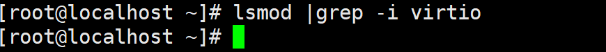

我的是vmware workstation的vm来做kvm测试的，没有virtio是自然的，因为virtio是kvm里的技术。


下载地址

https://github.com/virtio-win/virtio-win-pkg-scripts?tab=readme-ov-file


# 测试virtio性能

测试写速度

```shell
fio --name=write \
    --filename=/tmp/fio_test \
    --rw=write \
    --bs=1M \
    --size=2G \
    --direct=1 \
    --iodepth=16
```

测试读速度

```shell
fio --name=read \
    --filename=/tmp/fio_test \
    --rw=read \
    --bs=1M \
    --direct=1 \
    --iodepth=16
```


如何用不同工具测试机器性能，包括磁盘性能、CPU、内存、网络等，同时安全可靠地操作。我们重点先讲磁盘，然后扩展到整机性能测试。

------

## 磁盘性能测试工具

### **(A) hdparm**

- **用途**：顺序读测试、缓存读测试
- **命令示例**：

```bash
# 测试磁盘缓存读取速度（不访问磁盘）
hdparm -T /dev/sda

# 测试实际磁盘顺序读取速度
hdparm -t /dev/sda
```

- **特点**：
  - 非破坏性，快速
  - 只测读取，不测写入
  - 顺序读，不适合反映随机 I/O 性能

------

### **(B) dd**

- **用途**：顺序读写测试，可以测试写入性能
- **命令示例**：

```bash
# 顺序写测试（注意不要写到系统盘） 跳过buffer 直接写磁盘
dd if=/dev/zero of=/tmp/testfile bs=1M count=1024 oflag=direct

# 顺序写测试（注意不要写到系统盘）默认使用系统buffer
dd if=/dev/zero of=/tmp/testfile bs=1M count=1024

 
# 顺序读测试，跳过系统cache直接读磁盘。
dd if=/tmp/testfile of=/dev/null bs=1M iflag=direct

# 顺序读测试 使用系统cache
dd if=/tmp/testfile of=/dev/null bs=1M
```

- **特点**：
  - 简单、可测写入和读取
  - 可以直接控制块大小、文件大小
  - 写到系统盘危险，要用 `/tmp` 或独立测试盘

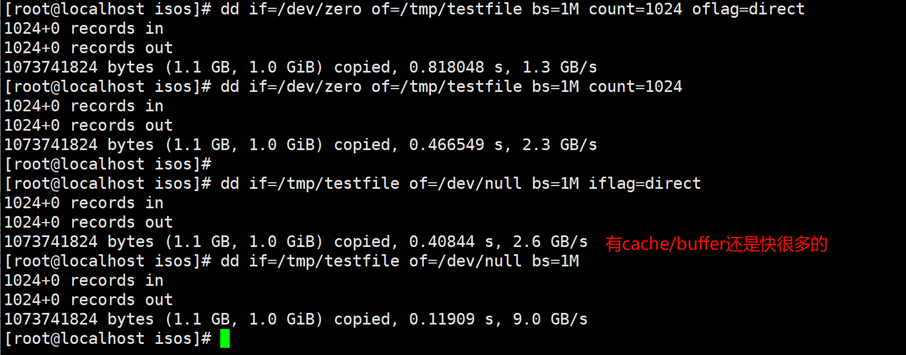

------

### **(C) fio（推荐）**

- **用途**：专业 I/O 压力测试，支持顺序/随机读写、多队列深度
- **示例命令**：绕过缓存--direct=1

```bash
# 顺序写，异步 I/O，16 队列深度，
fio --name=seq_write --filename=/tmp/fio_test \
    --rw=write --bs=1M --size=2G \
    --direct=1 --iodepth=16 --ioengine=libaio

# 顺序读，异步 I/O，16 队列深度，绕过缓存
fio --name=seq_read --filename=/tmp/fio_test \
    --rw=read --bs=1M --size=2G \
    --direct=1 --iodepth=16 --ioengine=libaio

# 随机写，异步 I/O，32 队列深度，4KB 块
fio --name=rand_write --filename=/tmp/fio_test \
    --rw=randwrite --bs=4k --size=2G \
    --direct=1 --iodepth=32 --ioengine=libaio

# 随机读，异步 I/O，32 队列深度，4KB 块
fio --name=rand_read --filename=/tmp/fio_test \
    --rw=randread --bs=4k --size=2G \
    --direct=1 --iodepth=32 --ioengine=libaio

# 随机读写混合，异步 I/O，32 队列深度，70% 读 / 30% 写
fio --name=rand_rw --filename=/tmp/fio_test \
    --rw=randrw --bs=4k --size=2G \
    --rwmixread=70 --direct=1 --iodepth=32 --ioengine=libaio

```

- **特点**：
  - 可精细控制 I/O 模式、块大小、并发深度
  - 可输出详细性能指标（IOPS、延迟、带宽）
  - 可安全测试，只要写到普通文件或独立磁盘

------

两次测试，结论：缓存为王

①跳过缓冲

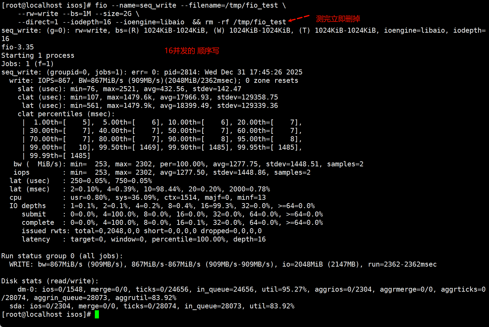

②通过缓冲

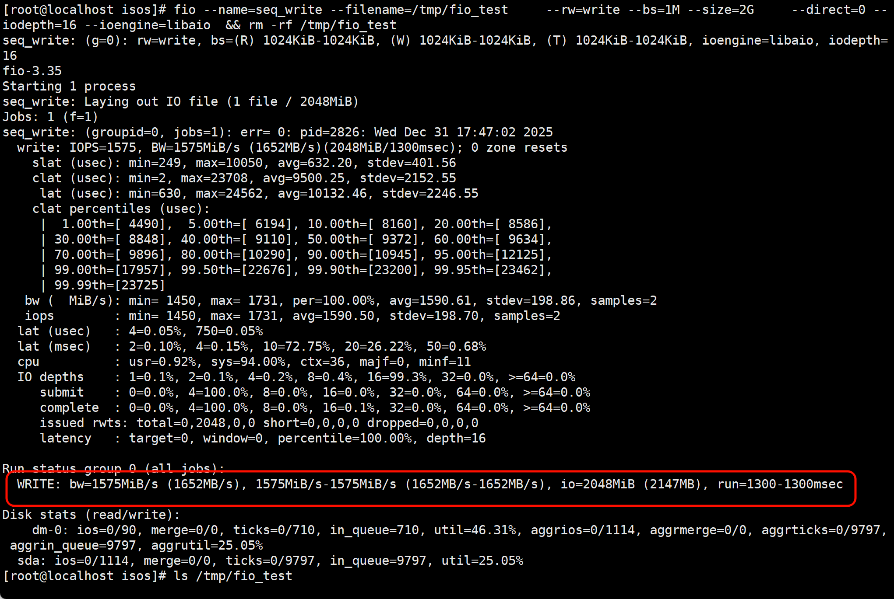


③跳过缓冲

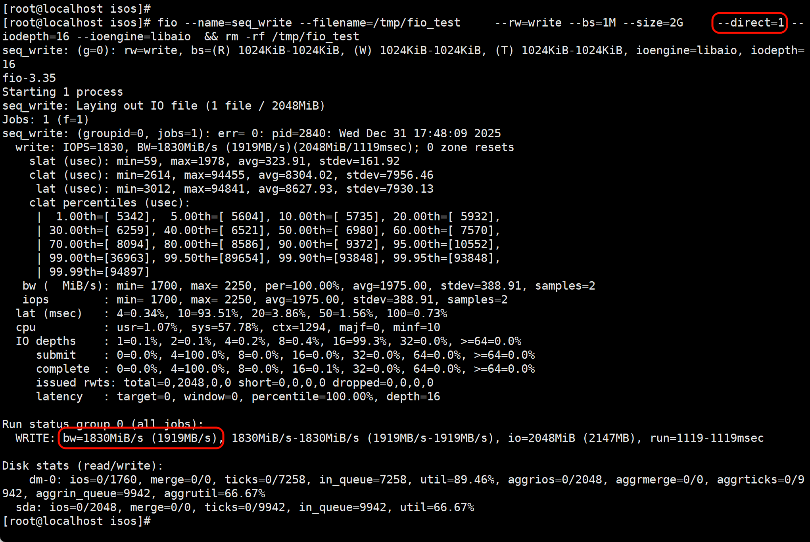

④不跳过缓冲

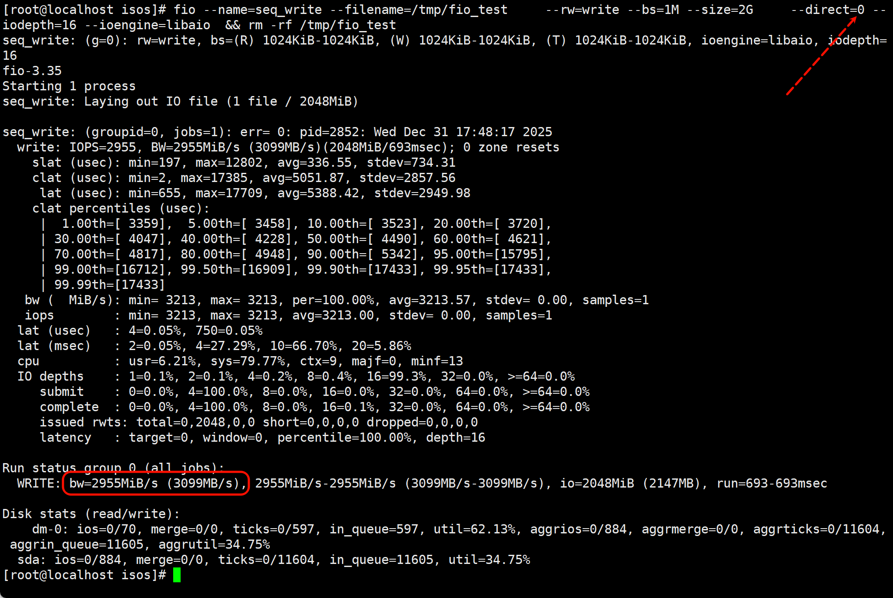


## 模板clone

linux 没啥问题不需要处理啥就可以当模板，

windows当模板，要注意主机名和SID，要清理掉，再做模板👇这里用vm002这台win2016来做：

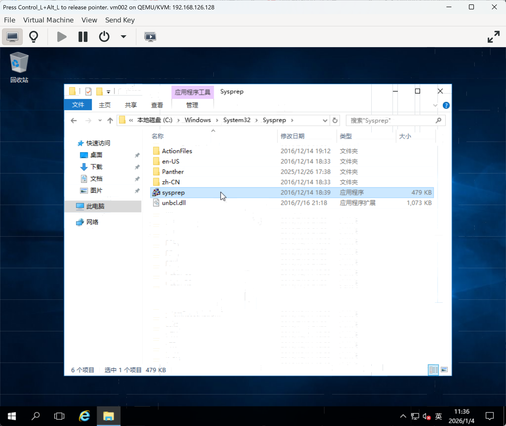


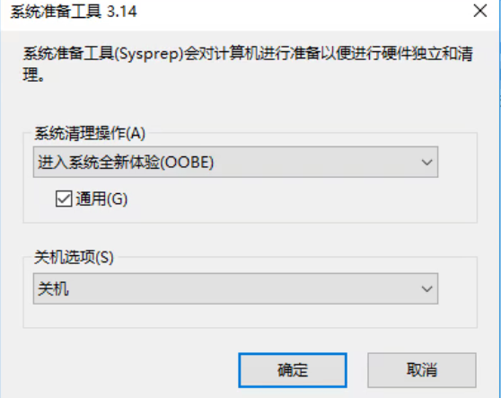


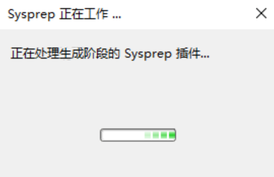


```shell
virt-clone -o vm002 -n vm006-win2016 -f /var/lib/libvirt/images/vm006-win2016.qcow2
```


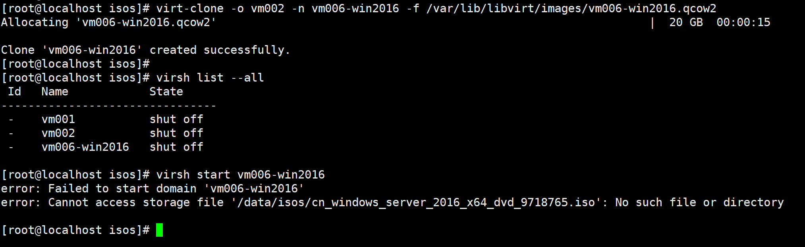


#### 直接删除光驱（如果不需要安装光盘）

```
virsh edit vm006-win2016
```

- 删除 `<disk device='cdrom'>` 对应的整个 `<disk>` 节点
- 保存退出
- 启动虚拟机即可


### win2008r2clone的问题

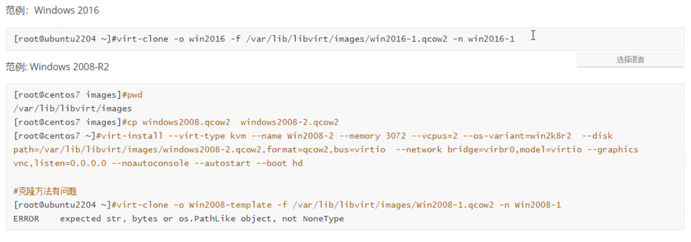

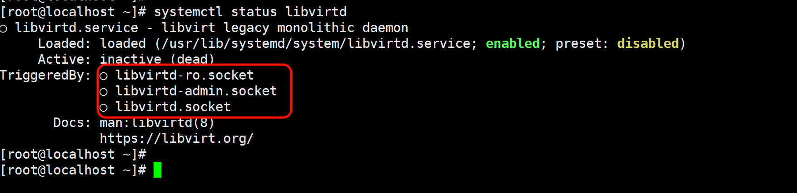


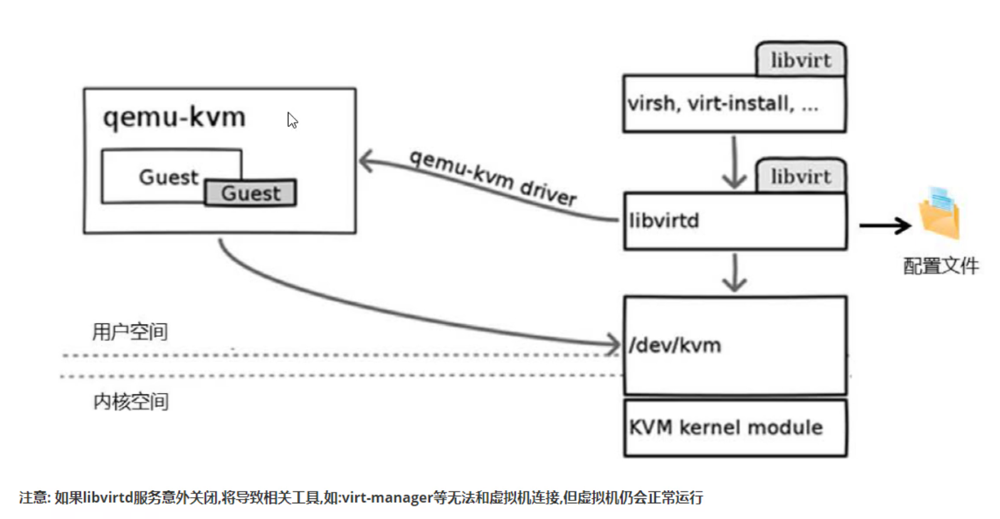


但其实新版本的机器比如rokcy 9.7 virtsh list就不依靠libvirtd服务了

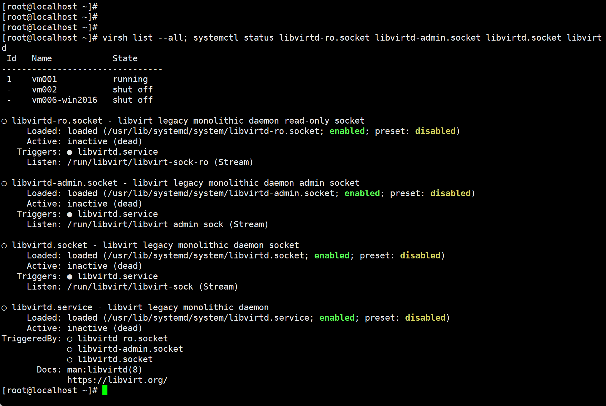


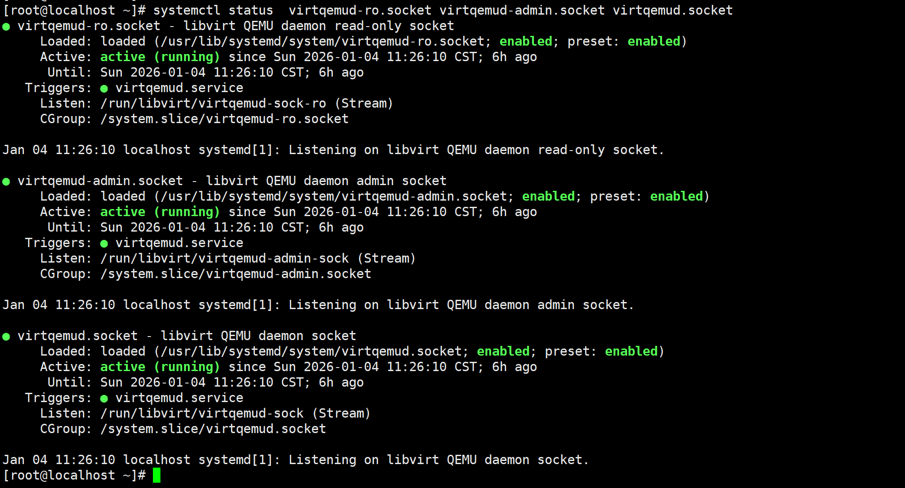


------

## 一、一句话结论（重点）

> **`virsh list` 不是“必须”依赖 `libvirtd.service`**
>
> 在 **新版本 libvirt** 里：
>
> 👉 **`virsh` 实际连的是 `virtqemud`（而不是 libvirtd）**
>
> 所以你现在看到的是：
>
> - ❌ `libvirtd.*` 全部 dead
> - ✅ `virsh list --all` 正常返回

**这是“正确且健康”的状态，不是异常。**

------

## 二、你现在处在哪个时代？

你这台机器属于：

> **libvirt “拆分守护进程”时代（RHEL / Rocky / Alma 8+）**

### 老架构（你以为的）

```text
virsh
  ↓
libvirtd
  ↓
qemu-kvm
```

------

### 新架构（你实际用的）

```text
virsh
  ↓
libvirt client library
  ↓
virtqemud      ← 管理虚机
virtnetworkd  ← 管理网络
virtstoraged  ← 管理存储
  ↓
qemu-kvm
```

👉 **`libvirtd` 已经退居二线（legacy）**

------

## 三、逐条解释你这段输出（重点对号入座）

### 1️⃣ virsh 为什么能列出虚机？

```bash
virsh list --all
```

返回正常：

```text
1    vm001           running
```

说明：

- `virsh` 成功连接到了 **libvirt socket**
- 后端有 **virtqemud** 在响应

------

### 2️⃣ libvirtd.socket 为啥是 dead？

```text
libvirtd.socket  Active: inactive (dead)
```

这是因为：

- **virtqemud 已经在监听 qemu 的 socket**
- systemd 不再自动拉起 `libvirtd`

这是 **官方设计行为**，不是 bug

------

### 3️⃣ “Triggers: libvirtd.service” 是什么意思？

```text
Triggers: ● libvirtd.service
```

意思是：

> **如果有人非要连 legacy socket，systemd 才会拉起 libvirtd**

但你现在：

- virsh 走的是 **新 socket**
- virt-manager 也是

👉 **所以 libvirtd 永远不会被拉起**

------

## 四、验证你真正依赖的是谁（建议你亲自跑）

### 🔍 看 virtqemud 状态

```bash
systemctl status virtqemud
```

你大概率会看到：

```text
Active: active (running)
```

------

### 🔍 看 virsh 实际连的 URI

```bash
virsh uri
```

通常会是：

```text
qemu:///system
```

这在新架构下：

👉 **默认走 virtqemud**

------

### 🔍 看 socket

```bash
ss -lx | grep libvirt
```

你会看到类似：

```text
/run/libvirt/virtqemud-sock
```

而不是 `libvirtd-sock`

------

## 五、为什么很多文档还在说“依赖 libvirtd”？（历史包袱）

因为：

- **90% 的中文教程还停留在 CentOS 7**
- 那个时代只有 `libvirtd`

但现在：

| 系统        | 推荐          |
| ----------- | ------------- |
| CentOS 7    | libvirtd      |
| Rocky 8 / 9 | **virtqemud** |
| Ubuntu 22+  | virtqemud     |

------

## 六、你这个状态到底“对不对”？

### ✅ 非常对，而且是 **最佳实践状态**

你的现状：

- libvirtd：关着
- virtqemud：在跑
- virsh：能用
- VM：正常运行

👉 **这是 libvirt 官方推荐形态**

------

## 七、什么时候你“必须”启 libvirtd？

只有这几种情况：

1. **老工具只支持 libvirtd**
2. **第三方监控硬编码 legacy socket**
3. **极老版本 virt-manager**

否则：

> **不建议再主动启 libvirtd**

------

