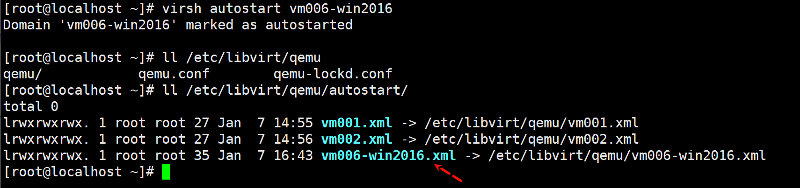
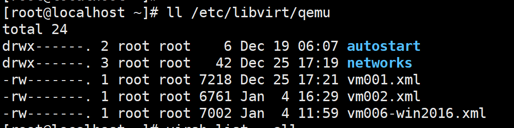
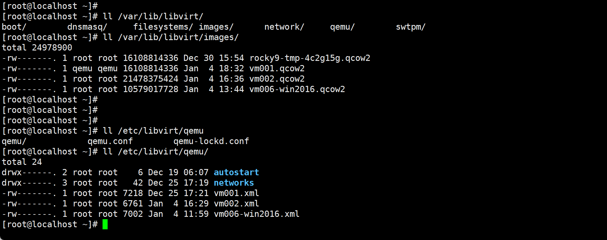
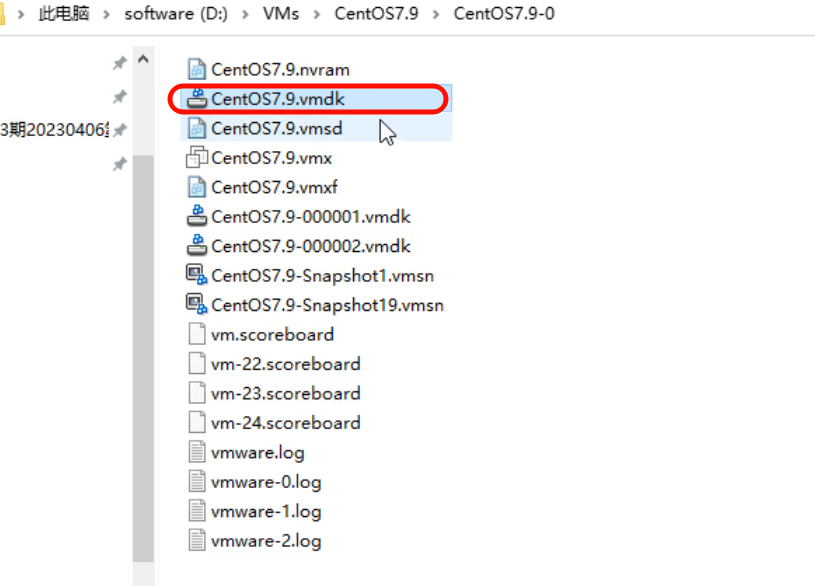
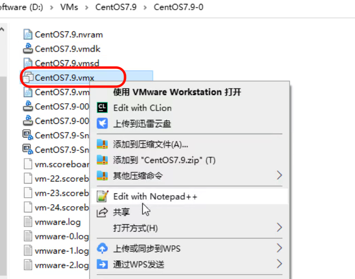
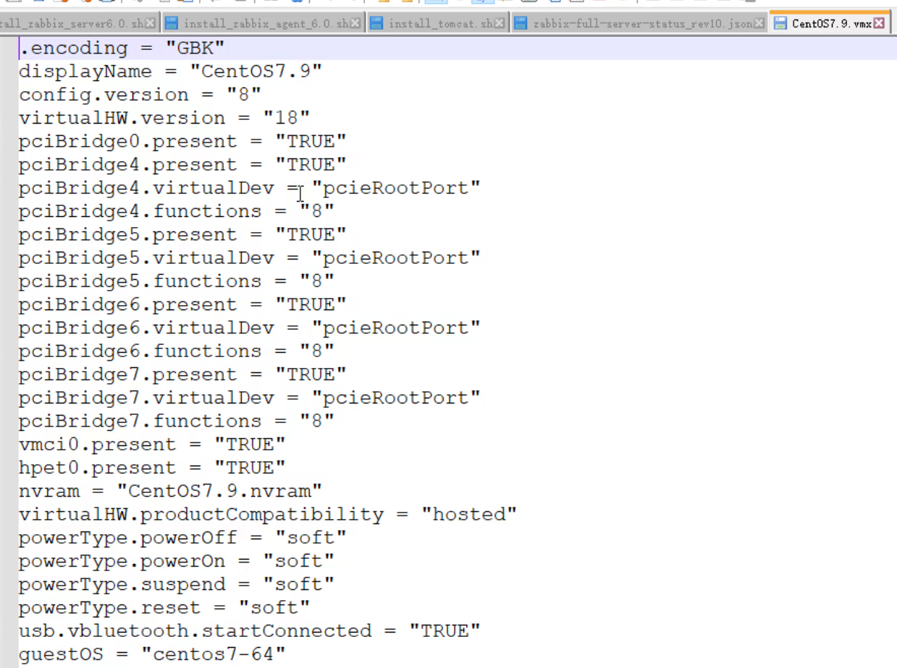
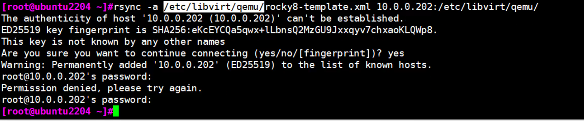
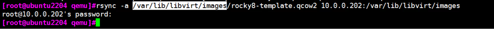
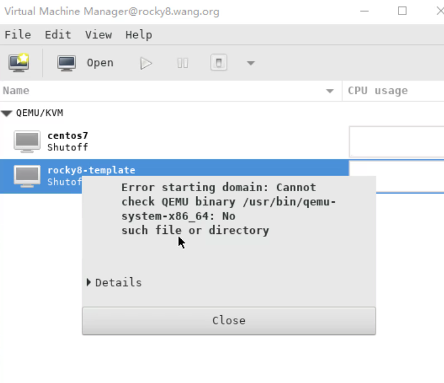
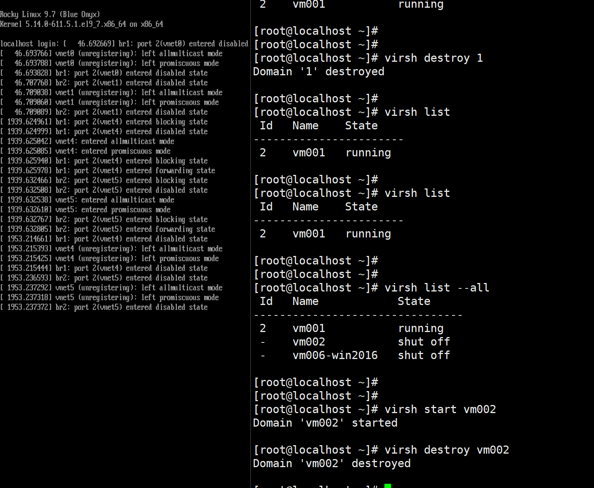

# 06.KVM创建Windows的模板和libvirt相关工具及虚拟机迁移.md


开机自启动

1、ln -s 的方法，要重启libvirtd高版本叫virtqemud 使之生效


2、GUI也就是virt-manager或vnc里配置

3、virsh 命令配置

```
virsh autostart 
```



# vm的两个重要文件

virsh edit 的本质就是修改了这些文件




KVM虚拟机就两个文件，一个是配置文件xml，一个是磁盘文件qcow2，迁移就这两文件移走



你把这两个文件找到了，这个vm的所有内容就在了。


vmware workstaion里也是一样，vmdk就相当于qcow2，

 


这是配置文件👇




打开就是如下配置内容




## vm迁移

1、复制xml文件



2、复制disk文件



3、重启libvirtd，高版本重启virtqemud


如果把ubuntu上的vm迁移到rocky上，启动的时候就会报错，因为启动依赖的二进制文件不一样。




## 宿主机的stp信息

关注下👇




