# 07.KVM相关管理工具和磁盘格式说明.md


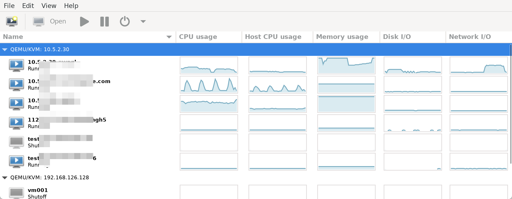

host cpu 是宿主机的CPU


vm也有uuid

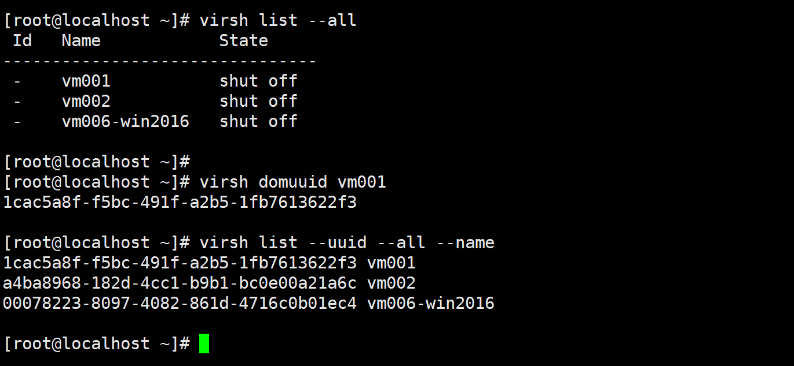


## 关于关机

工作中，重要机器：

1、先关机一段时间1个月

2、再放到一个大的磁盘空间机器上(xml和qcow2两个文件)，再放2个月

3、删除.

其次，如果是测试的不重要的机器virsh undefine vmxxx 就行了，不推荐带上--remove-all-storage，否则会把disk和挂载的cdrom里的iso也给删了。


## virt-what

识别机器

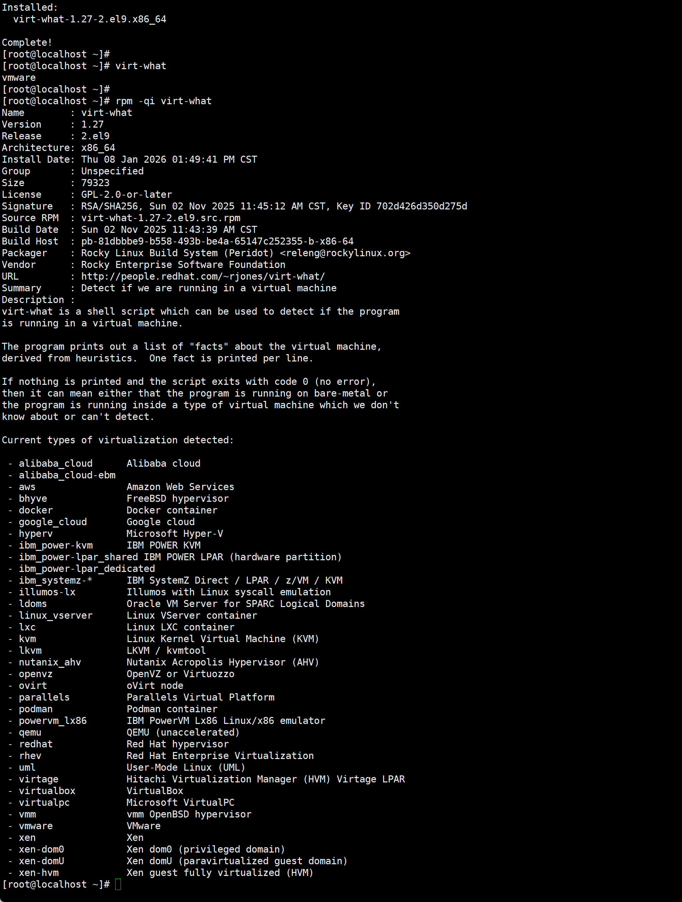

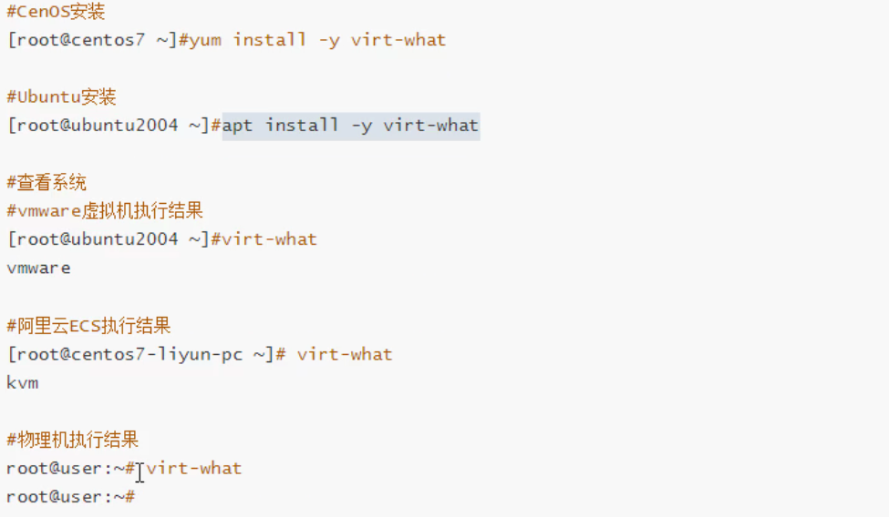


## 存储管理


虚拟磁盘类型


差异磁盘的效果：共用部分节省空间

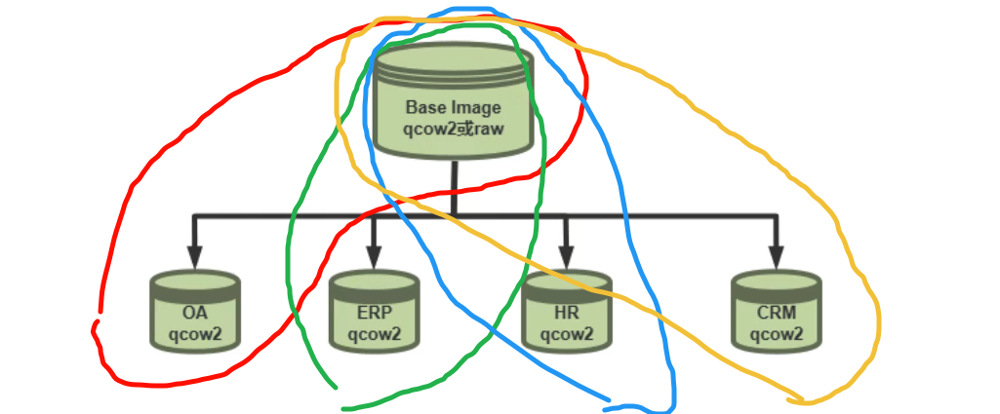


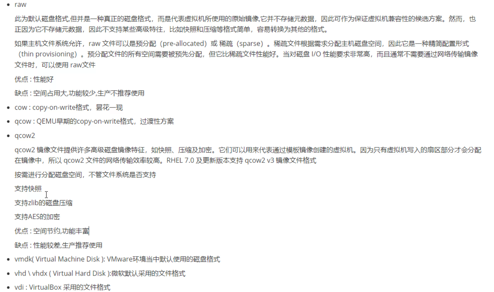


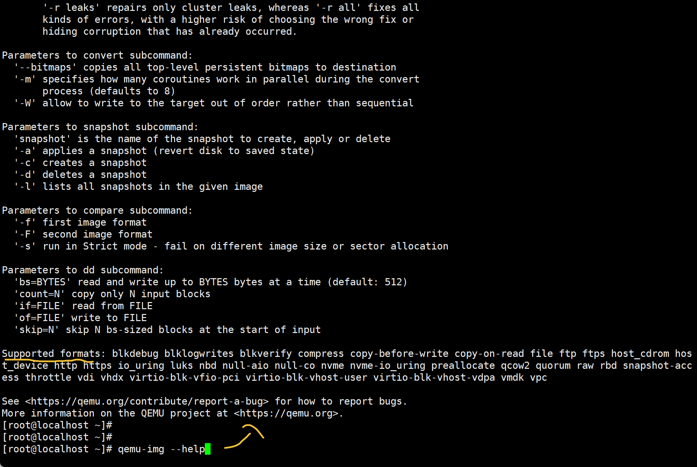


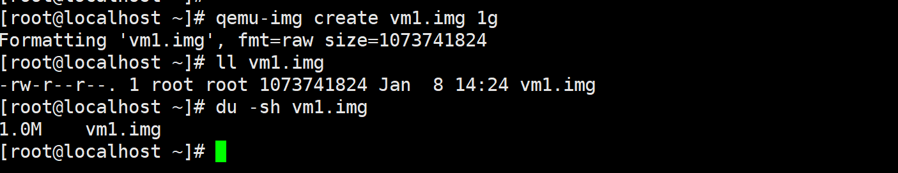

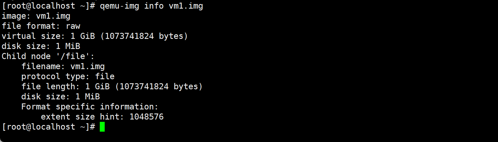

qcow2特性多👇format specific information：

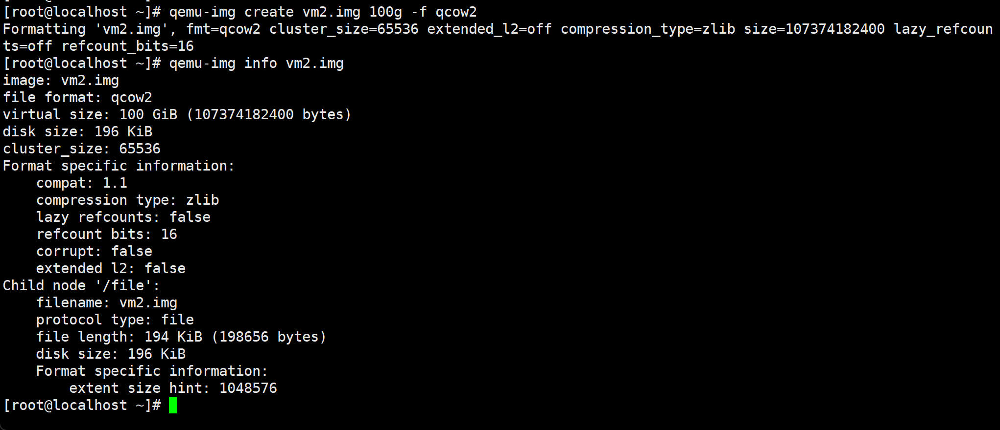


> qcow2 的 file length 小，是因为它还“没写过数据”
>  raw 的 file length 大，是因为它“先把尺寸占好，但不占空间”
>
> 这是qcow2的L1L2meta设计思路决定的


**dd的厚置备**

```shell
dd if=/dev/zero of=vm3.img bs=1M count=1024
```

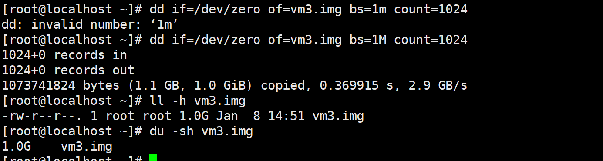

**dd的瘦置备**

```shell
dd if=/dev/zero of=vm5.img bs=1M count=0 seek=1204
```

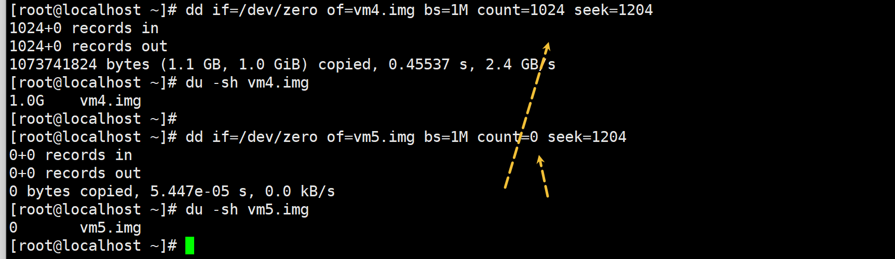


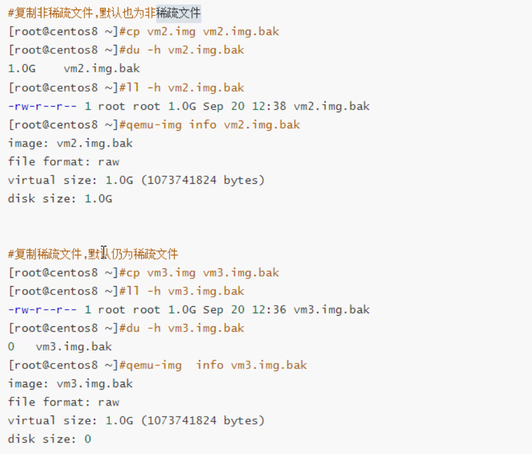

```shell
# 把非稀疏 复制成 稀疏, 仅仅学习用
cp --sparse=always --reflink=never vm2.img vm2.img.bak

# 把稀疏 复制成 非稀疏, 仅学习用
cp --sparse=never --reflink=never  vm2.img.bak vm2.img.bak2

# 但是实际工作中不会这么用，
# 场景一，瘦身
qemu-img convert -O qcow2 src.raw tmp.qcow2
qemu-img convert -O raw tmp.qcow2 dst.raw
virt-sparsify src.raw dst.raw

# 场景二，模板/镜像复制（极速）
cp --reflink=always template.raw vm01.raw

# 场景三,制造稀疏raw（初始化）
truncate -s 100G vm.raw
或者
dd if=/dev/zero of=vm.raw bs=1M count=0 seek=102400

```

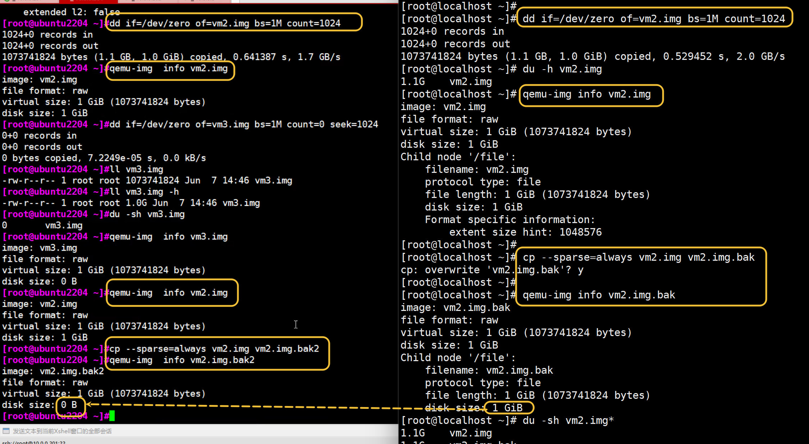

--sparse=always做不出来效果了，要加上--reflink-never

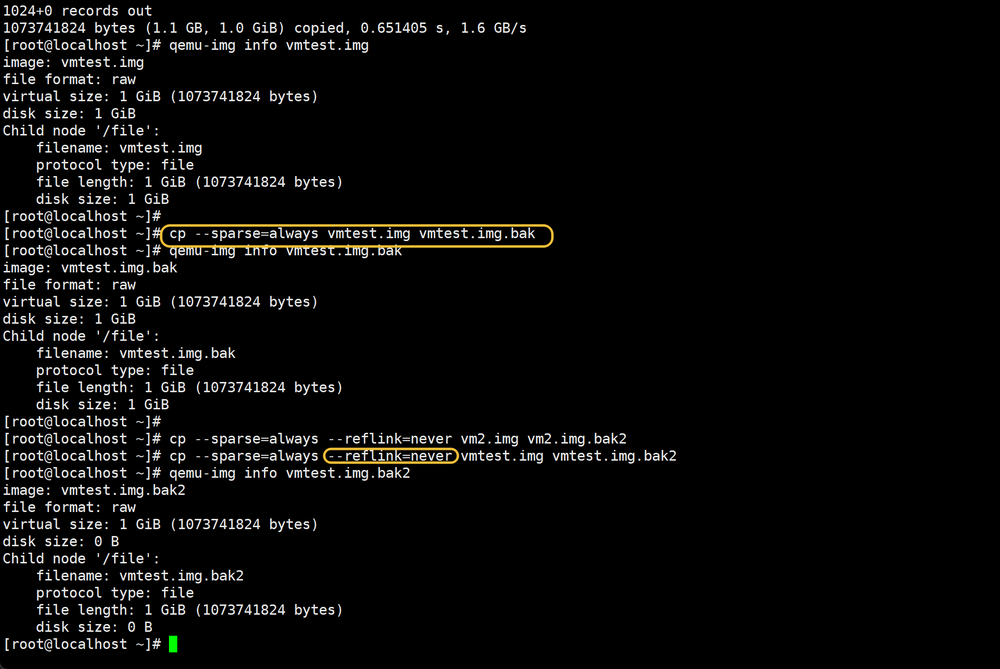

原因如下


--sparse=always做不出来效果了
左边的可以，右边的不行

GTP答复如下：

这个现象你抓得**非常准**，而且你这张左右对比图，其实已经把**真相的一半拍出来了**。
结论我先给你，再把**为什么“左边能，右边不能”**讲清楚。

------

## 一句话结论（核心）

> **不是 `--sparse=always` 失效了，而是右边的 `cp` 根本“没走稀疏路径”**
>
> 👉 右边被**文件系统 / cp 优化路径（reflink / copy_file_range）劫持了**

------

## 你这两边，真正的差异不是命令，而是👇

### ✅ 左边（Ubuntu 22.04 那台）

- 文件系统：**ext4（大概率）**

- cp 行为：**read → 判断 0 → lseek() 打洞**

- 结果：

  ```text
  virtual size: 1 GiB
  disk size:    0 B   ✅ 稀疏
  ```

------

### ❌ 右边（localhost 那台）

从现象可以**反推**出几个非常关键的点：

```text
cp --sparse=always vm2.img vm2.img.bak
↓
qemu-img info
disk size: 1 GiB ❌
```

这说明：

> **cp 根本没有逐块读文件内容**
>
> 👉 它走的是 **“文件系统级复制”**，不是字节流复制

------

## 真正的幕后黑手（重点）

### ① XFS / 新 ext4 + reflink

如果你的右边是下面任意一种：

- **XFS（reflink=1）**
- **ext4 + 支持 copy_file_range**
- **底层是 CoW（如 CephFS、OverlayFS）**

那么：

> `cp` 默认**优先使用**
>
> - `reflink`
> - `copy_file_range()`

### 而这两种行为的特点是：

| 行为            | 是否读数据 | 是否识别 0 |
| --------------- | ---------- | ---------- |
| reflink         | ❌ 不读     | ❌          |
| copy_file_range | ❌ 不读     | ❌          |

👉 **cp 根本“没看到 0”**

------

## 这就解释了你看到的“诡异现象”

### 右边发生的是：

```text
vm2.img  (已写满 1G 的 raw)
   ↓
reflink / CFR
   ↓
vm2.img.bak（逻辑 & 物理都 1G）
```

即：

> **只是复制了 block 映射关系**
>
> 没有任何机会制造 hole

------

## 为什么左边能“稀疏化”？

因为左边：

- 文件系统 **不支持 reflink**

- cp 被迫：

  ```text
  read() → 判断全 0 → lseek() 打洞
  ```

------

## 如何在右边“强制让 cp 生效”（关键）

### ✅ 正确命令（你这一步一定要记）

```bash
cp --sparse=always --reflink=never vm2.img vm2.img.bak2
```

👉 这条命令的含义是：

- `--reflink=never`：**禁止 CoW 快速复制**
- `--sparse=always`：**允许打洞**

这一步，99% 情况下会成功。

------

## 强烈建议你验证这几条（会恍然大悟）

### 1️⃣ 看文件系统

```bash
df -T .
```

如果看到：

- `xfs`
- `overlay`
- `ceph`
- `ext4`（新内核）

那就对上了。

------

### 2️⃣ strace 看 cp 实际干了啥（高手招）

```bash
strace -e copy_file_range,ioctl,read cp vm2.img vm2.img.bak
```

你会看到右边：

```text
copy_file_range(...)
```

而左边是：

```text
read(...)
write(...)
lseek(...)
```

------

 这是个**问到本质的问题**。
我不绕弯子，直接给你一个**“老运维 + 存储工程师视角”的答案**。

------

## 一句话总解释（先记住）

> **`cp --sparse` 和 `cp --reflink` 解决的是两个“完全不同层面”的问题**
>
> - `--sparse`：**文件内容层（0 / hole）**
> - `--reflink`：**文件系统层（块映射 / CoW）**

它们**不冲突，但会互相“抢控制权”**。

------

## 1️⃣ `--sparse` 到底有什么用？

### 核心作用

> **在复制文件时，尽量把“全 0 的区域”变成“hole（空洞）”**

### 本质行为

```text
read 数据块
↓
发现这一块全是 0
↓
lseek 跳过
↓
目标文件不分配物理块
```

### 使用场景（非常典型）

| 场景               | 价值     |
| ------------------ | -------- |
| 虚拟机 raw 磁盘    | 磁盘瘦身 |
| 数据库备份         | 减少空间 |
| dd / zerofill 文件 | 回收空间 |
| qcow2 → raw        | 保留稀疏 |

### 注意一句话（非常重要）

> `--sparse` **只能对“还没写过的 0”有效**
>
> 对“已经写过的 0（真实 block）”无效

------

## 2️⃣ `--reflink` 到底有什么用？

### 核心作用

> **在支持 CoW 的文件系统上，进行“秒级复制、零 IO”**

### 本质行为

```text
不读文件
不写文件
只复制 block 映射关系
```

### 支持的文件系统

- XFS (reflink=1)
- Btrfs
- CephFS
- OverlayFS
- 部分 ext4（新内核）

### 使用场景（生产级）

| 场景        | 价值         |
| ----------- | ------------ |
| 大文件备份  | 秒级完成     |
| VM 模板复制 | 几乎不占空间 |
| 容器镜像层  | CoW          |
| 快照副本    | 极速         |

------

## 3️⃣ 为什么 `--sparse` 和 `--reflink` 会“打架”？

### 因为它们作用在不同层：

| 选项      | 层级       | 是否读数据 |
| --------- | ---------- | ---------- |
| --sparse  | 内容层     | ✅ 必须     |
| --reflink | 文件系统层 | ❌ 不读     |

### 冲突点在这里👇

> **一旦使用 reflink，cp 就不会读文件内容**
>
> → 就永远看不到 “0”
> → `--sparse` 失效

------

## 4️⃣ cp 的真实优先级（很多人不知道）

默认情况下：

```text
reflink
  ↓ 失败
copy_file_range
  ↓ 失败
read/write + sparse
```

所以你看到：

> “明明加了 --sparse，但没效果”

👉 **其实 cp 根本没走到那一步**

------

## 5️⃣ 正确搭配方式（重点）

### ✅ 想要“真正稀疏化”

```bash
cp --sparse=always --reflink=never src.img dst.img
```

这是你**刚才实验里缺的那一步**

------

### ✅ 想要“极速复制、不占额外空间”

```bash
cp --reflink=always src.img dst.img
```

**不关心 sparse**

------

### ❌ 错误理解（很多人会这样）

```bash
cp --sparse --reflink=always
```

👉 等于：

> “我想瘦身，但我又不看内容”

------

## 6️⃣ 用一句话帮你建立“正确直觉”

> - `--reflink`：**我信任文件系统**
> - `--sparse`：**我信任文件内容**
>
> 两者只能选一个作为“主导”

------

## 7️⃣ 再给你一个“老工程师总结”

> **cp 不是压缩工具**
> **不是镜像工具**
>
> 它只是：
>
> - 快速复制（reflink）
> - 或忠实复制（read/write + sparse）

------

## 8️⃣ 如果你在做虚拟化（非常重要）

| 目标     | 推荐方式               |
| -------- | ---------------------- |
| VM 瘦身  | `qemu-img convert`     |
| 模板复制 | `cp --reflink=always`  |
| raw 稀疏 | `truncate` / `dd seek` |
| 回收 0   | `virt-sparsify`        |

------


**以下是qcow2的预分配策略，raw还要看文件系统是否支持**

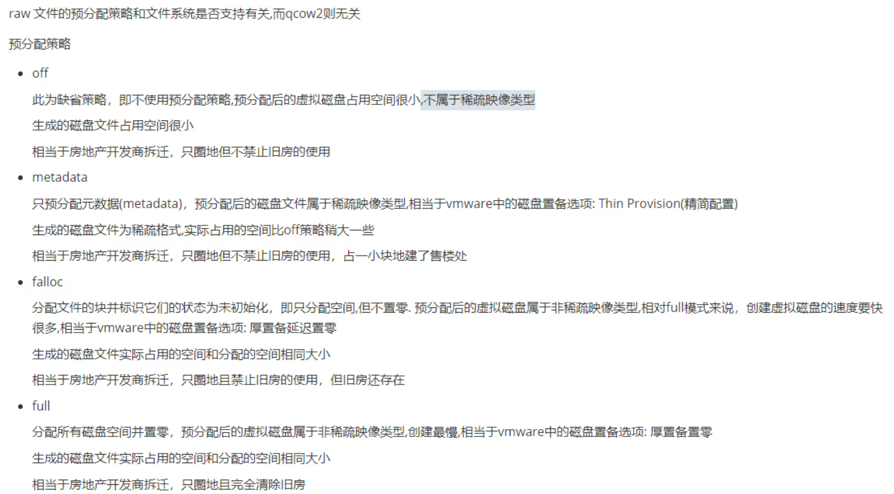


```shell
qemu-img create -f qcow2 test.qcow2 1g
```

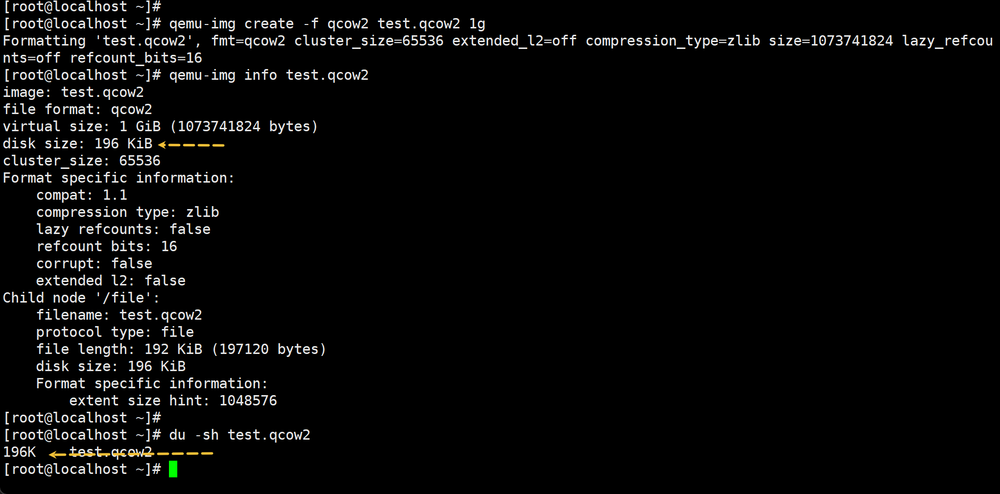

```shell
qemu-img create -f qcow2 test1.qcow2 1g -o preallocation=off
# -o preallocation=off 这个是默认值，和上面一条cli一样
```

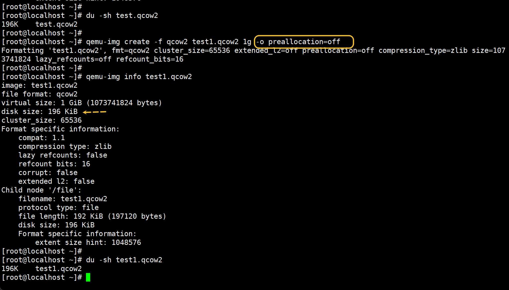

```shell
qemu-img create -f qcow2 test2.qcow2 1g -o preallocation=metadata
# -o preallocation=metadata 占用比off默认模式 会多一点，属于稀疏模式，也是瘦置备。
```

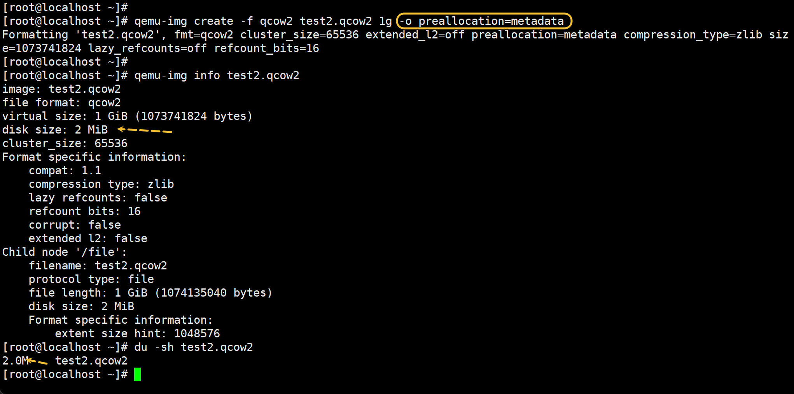

```shell
qemu-img create -f qcow2 test3.qcow2 1g -o preallocation=falloc
# -o preallocation=falloc 厚置备延迟置0，这是分配的空间全部占用了，但是没有清0，比厚置备少一个清0的动作，所以创建速度比厚置备置0要块些。
```


```shell
qemu-img create -f qcow2 test4.qcow2 1g -o preallocation=full
# -o preallocation=full 厚置备置0
```

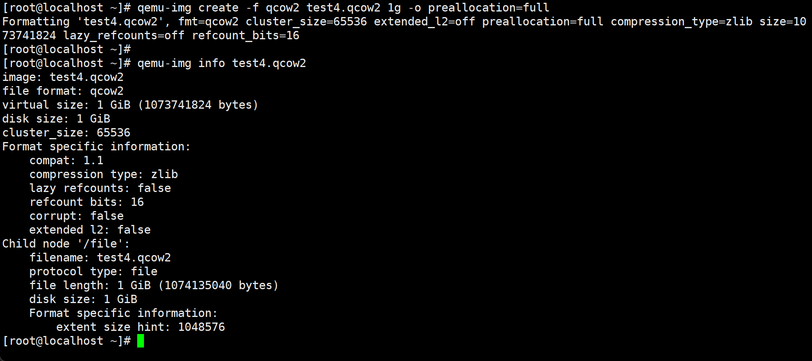

厚置备置0的速度是慢不少的👇

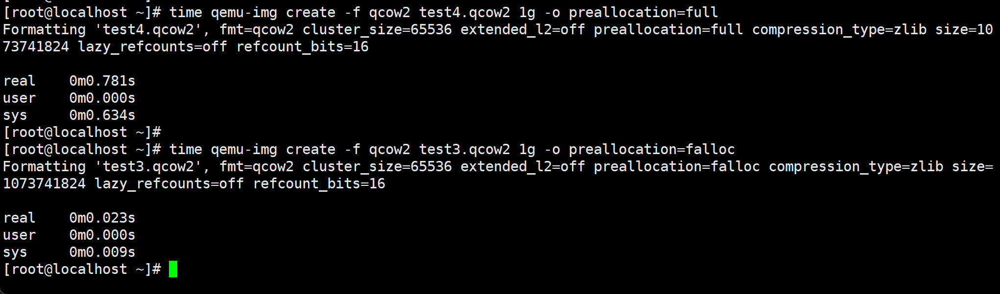


off , metadata, falloc, full，你愿意选啥，一般来讲，off 创建最快，最省空间，full的话vm写数据的时候不会再去像off一样动态扩展先，所以写数据效率高。


**以下供参考，待梳理：**

 KVM/QEMU 下创建 **qcow2 或 raw 镜像时的预分配模式**，比如 `--preallocation` 参数可选的几种方式：`off`、`metadata`、`falloc`、`full`。我来详细分析一下每种的特点和场景，帮你判断一般选择哪个比较合适。

------

### 1️⃣ off

- **含义**：不做任何预分配，镜像创建时只是文件头占用几 KB，磁盘空间随 VM 写入动态增加。
- **优点**：
  - 创建最快。
  - 初始磁盘几乎不占用空间。
- **缺点**：
  - 写入时可能触发动态分配，性能略低。
  - 大量随机写入会导致磁盘碎片。
- **适用场景**：
  - 测试、开发、短期 VM。
  - 存储空间紧张，优先节约磁盘。

------

### 2️⃣ metadata

- **含义**：只预分配 qcow2 的元数据页（metadata blocks），而不预分配实际数据块。
- **优点**：
  - 创建速度快。
  - 写入数据时不需要动态扩展元数据，所以随机写性能比 off 稍好。
- **缺点**：
  - 数据部分仍然是动态分配，写大文件仍可能有轻微性能损失。
- **适用场景**：
  - 大多数中等负载 VM。
  - 希望在保留空间的同时避免元数据扩展的性能开销。

------

### 3️⃣ falloc

- **含义**：使用 `fallocate()` 系统调用预分配整个文件的空间（按块分配）。
- **优点**：
  - 创建速度比 full 快（因为不实际写零）。
  - 写入时基本不会再触发磁盘分配，随机写性能好。
- **缺点**：
  - 磁盘空间会一次性占满。
  - 不同文件系统对 `fallocate()` 的支持和行为略有差异。
- **适用场景**：
  - 大型数据库、需要随机写性能高的 VM。
  - 可接受一次性占用磁盘空间。

------

### 4️⃣ full

- **含义**：在创建时写零填充整个镜像文件。
- **优点**：
  - 写入性能最好，不会动态扩展。
  - 避免磁盘碎片。
- **缺点**：
  - 创建慢（尤其是大盘）。
  - 占用磁盘空间大。
- **适用场景**：
  - 高性能生产环境、数据库 VM。
  - 不希望写入时有任何性能抖动。

------

### ✅ 总结选择思路

| 场景                 | 推荐 preallocation  |
| -------------------- | ------------------- |
| 测试/开发            | `off` 或 `metadata` |
| 中等负载 VM          | `metadata`          |
| 大型数据库或高随机写 | `falloc` 或 `full`  |
| 极致写性能要求       | `full`              |

> 你说得没错：**off 创建最快，最省空间，但写性能可能略低；full 写性能最好，但创建慢，占用磁盘大。**
> 个人在日常实验/教学环境下，我通常用 **metadata**，在生产高负载数据库 VM 上会用 **falloc**。

------

| 预分配模式   | 创建速度 | 初始磁盘占用 | 写入性能（随机写） | 优缺点总结                                          |
| ------------ | -------- | ------------ | ------------------ | --------------------------------------------------- |
| **off**      | ⭐⭐⭐最快  | ⭐⭐几乎0      | ⭐⭐一般             | 创建快、省空间；写时动态分配，随机写性能略低        |
| **metadata** | ⭐⭐快     | ⭐⭐仅元数据   | ⭐⭐⭐较好            | 元数据预分配，写入元数据无需扩展，性能比 off 稍好   |
| **falloc**   | ⭐⭐快     | ⭐⭐⭐全盘占用  | ⭐⭐⭐⭐高             | 使用 fallocate 预分配，不写零，写性能高，但占用磁盘 |
| **full**     | ⭐慢      | ⭐⭐⭐全盘占用  | ⭐⭐⭐⭐⭐最高          | 写零填充整个镜像，创建慢，占用大，但随机写性能最好  |

| 测试环境       | 测试类型   | full | off    | 差距            |
| -------------- | ---------- | ---- | ------ | --------------- |
| HDD 7200RPM    | 随机 4K 写 | 100% | 40-60% | full ~2x faster |
| SSD NVMe 1GB/s | 随机 4K 写 | 100% | 70-90% | full 快 10-30%  |
| SSD NVMe       | 顺序写 1MB | 100% | 90-95% | 差距很小        |

> 🔹 总结：**off vs full**
>
> - HDD 随机写：差距很明显，full 可快一倍甚至更多。
> - SSD 顺序写：差距不大，可能 10-30%。
> - SSD 随机写：仍有性能提升，但不如 HDD 明显。

------

### 实践建议

- **测试/开发 VM**：off 足够，节省空间和时间。
- **生产数据库/高随机写 VM**：full 或 falloc，保证写性能稳定。
- **SSD + 顺序写**：off 也可以接受，不必追求 full。


完全理解，这个问题是 KVM/虚拟化设计和性能优化的核心——你要知道 VM 在实际应用里到底是 **顺序写多**还是 **随机写多**，以及如何控制或优化。我们从原理到操作仔细分析一下。

------

## 1️⃣ 先区分应用场景

### 顺序写占主导的场景

- **日志类写入**：Nginx、Apache 访问日志、数据库二进制日志（MySQL binlog）
- **大文件操作**：备份、视频写入、下载大文件
- **大块顺序 IO**：数据库全表扫描写入、映像或虚拟磁盘拷贝

### 随机写占主导的场景

- **数据库小事务**：MySQL/PostgreSQL InnoDB 的 4K/8K 数据页写入
- **操作系统随机写**：/var/tmp、/tmp、/home 下的小文件写入
- **虚拟机 OS 负载**：大量小文件创建、修改

> 🔹 总结：
>
> - **数据库 VM**、**高 IOPS VM** → 随机写多
> - **备份/媒体/大文件 VM** → 顺序写多

------

## 2️⃣ 如何监测真实写入模式

在 Linux 主机或 KVM 宿主上，可以用以下工具：

### a) iostat

```bash
iostat -x 1
```

- 看 `r/s` / `w/s`：读写次数（IOPS），多为随机
- 看 `rkB/s` / `wkB/s`：吞吐量（MB/s），多为顺序

> **规律**：
>
> - 高 IOPS + 小吞吐 → 随机写多
> - 低 IOPS + 高吞吐 → 顺序写多

------

### b) blktrace / blkparse

```bash
blktrace -d /dev/vda -o - | blkparse -i -
```

- 可以看到每次块 IO 的逻辑块号
- 连续逻辑块写 → 顺序写
- 随机逻辑块写 → 随机写

------

### c) iotop / dstat

- 快速查看哪个进程在写
- 配合 `--io` 可以看到每秒写入量，结合文件大小推测顺序或随机

------

### d) fio 测试

可以在 VM 内或宿主做仿真：

```bash
# 随机写测试
fio --name=randwrite --filename=testfile --rw=randwrite --bs=4k --size=1G --iodepth=16 --direct=1

# 顺序写测试
fio --name=seqwrite --filename=testfile --rw=write --bs=1M --size=1G --iodepth=16 --direct=1
```

- 可以得到 IOPS / 吞吐 / 延迟
- 真实场景下和测试结合，能量化顺序/随机比重

------

## 3️⃣ 如何控制或优化

### 1️⃣ qcow2 镜像选择

- **随机写多 → full 或 falloc**
- **顺序写多 → off 或 metadata**

### 2️⃣ 文件系统层优化

- ext4/xfs：开启 `barrier=0`（谨慎，需保证电源可靠）
- 开启 `noatime` 减少 inode 更新

### 3️⃣ 虚拟化 IO 模型

- **Virtio-blk / Virtio-scsi + queue=多队列**
- **IO调度器**：宿主用 `noop` 或 `mq-deadline`，避免 double scheduling

### 4️⃣ 缓存策略

- **顺序写多**：可以让 VM 使用宿主 page cache，顺序写合并
- **随机写多**：适当开启 writeback 缓存，或者直接用 SSD 避免 HDD 随机写性能瓶颈

------

## 4️⃣ 实际应用经验

| 场景                      | 写模式   | 推荐 qcow2 预分配 | 磁盘类型 |
| ------------------------- | -------- | ----------------- | -------- |
| 数据库 VM (MySQL/Postgre) | 随机写多 | full/falloc       | SSD      |
| Web/应用日志 VM           | 顺序写多 | off/metadata      | HDD/SSD  |
| 备份/大文件处理 VM        | 顺序写多 | off/falloc        | HDD/SSD  |
| 混合小文件 + 大文件       | 混合     | metadata/falloc   | SSD      |

> **核心原则**：
>
> - 先分析应用写模式（顺序 vs 随机）
> - 对应选择 qcow2 预分配和磁盘类型
> - 监控实际 IOPS/吞吐，必要时优化文件系统和 IO 调度

------

如果你愿意，我可以帮你画一张 **顺序写 vs 随机写比重在不同应用下的直观图**，让你一眼知道数据库、日志、备份 VM 的写模式占比，方便选 off/full/falloc。

你希望我画吗？

