# 08.KVM存储管理和默认网络模式.md


# 1、VMware Linux → KVM 正确迁移流程


要转换的机器是R5，有快照2个，这里就要注意了，有快照的要合并，合并法有2，用克隆最快~

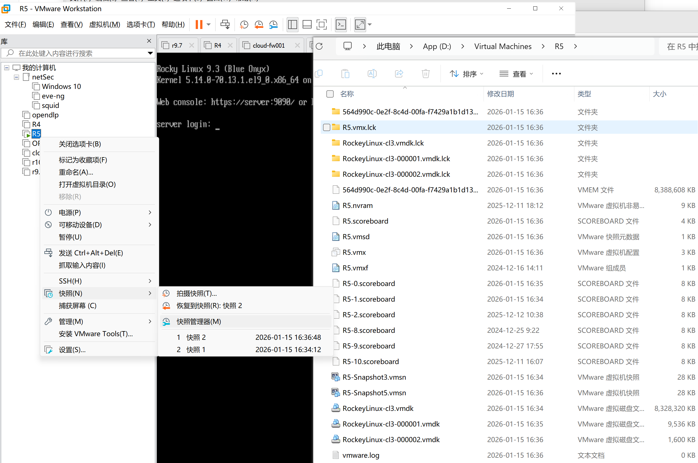


### 1️⃣ 在 VMware 虚拟机中准备内核支持

1. 确认内核里 **virtio 驱动 + LVM** 可用：

```bash
lsinitrd /boot/initramfs-$(uname -r).img | grep -i virtio
```


可见没有kvm的virtio驱动，所以即使转成qcow2，启动也是认不到盘的。

1. 安装必要工具：

```bash
yum -y install epel-release
yum install -y dracut-tools dracut dracut-config-generic lvm2
```

1. 重新生成 initramfs，加入 virtio 和 LVM 驱动：

```bash
dracut -f -v --add-drivers "virtio virtio_pci virtio_blk virtio_scsi" --add "lvm" /boot/initramfs-kvm.img $(uname -r)
cp -a  /boot/initramfs-$(uname -r).img /boot/initramfs-$(uname -r).img.bak
cp -a /boot/grub2/grub.cfg //boot/grub2/grub.cfg.bak
mv /boot/initramfs-kvm.img /boot/initramfs-$(uname -r).img
grub2-mkconfig -o /boot/grub2/grub.cfg
```

✅ 这样确保 KVM 启动时能识别 virtio 磁盘和 LVM 卷。

------

###  2️⃣ 从 VMware 导出镜像并转换

R5这个VM有2快照，然后新数据其实都是落在最近的一个快照2里的

##### 合并快照的方法1-使用cli针对最后的一个快照就

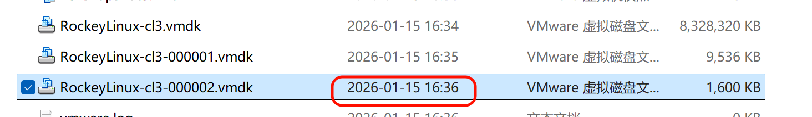

下载对应操作系统的 VDDK 后，解压并在 `bin` 目录下即可找到 `vmware-vdiskmanager`

https://developer.broadcom.com/sdks/vmware-virtual-disk-development-kit-vddk/latest


```
# vmware-vdiskmanager.exe -r 最后一个快照 

vmware-vdiskmanager.exe -r "D:\Virtual Machines\R4\RockeyLinux-cl3-000002.vmdk“ -t 0 "E:\all.vmdk"

# 这里很坑，一定要用最后一个快照去作为整合的线索，否则徒劳；要不你就克隆当前状态为一个新的VM，效果和这个cli一样的效果。
```

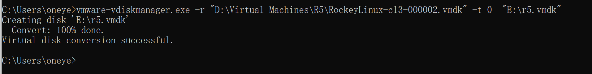

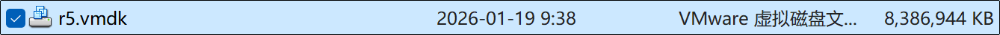


##### 合并快照的方法2-克隆完整的当前状态

> 右键-克隆-虚拟机当前状态-创建完整克隆

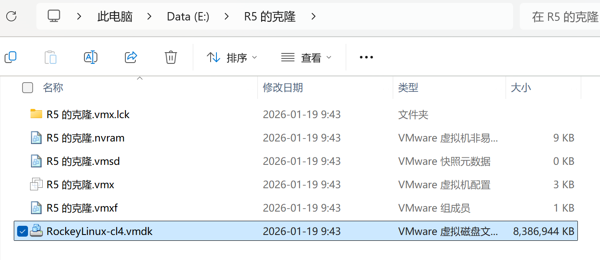

两种方法做出来的vmdk是一样的，虽然md5不同，但东西是一样的（针对两个vmdk分别进行转换和开机）


把这个合并后的vmdk传到linux里进行转换

```bash
qemu-img convert -f vmdk -O qcow2 源VM.vmdk vm_trans.qcow2
```

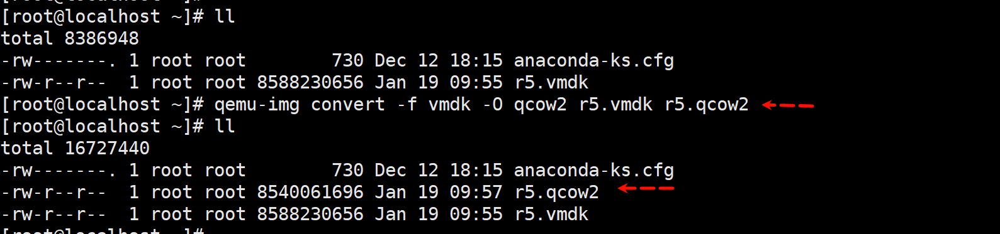


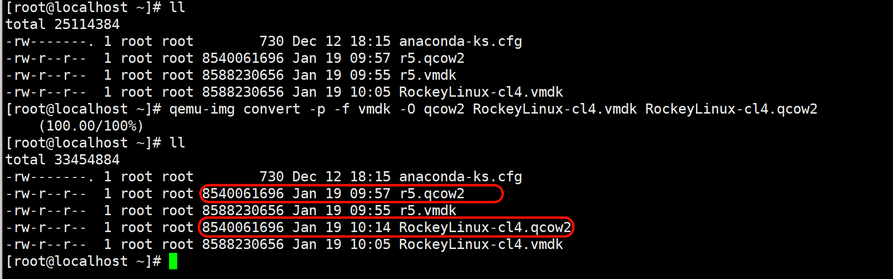


------

### 3️⃣ 放到 libvirt 目录并调整权限

```bash
cp vm_trans.qcow2 /var/lib/libvirt/images/
chown qemu.qemu /var/lib/libvirt/images/vm_trans.qcow2
chmod 600 /var/lib/libvirt/images/vm_trans.qcow2
```


------

### 4️⃣ 创建 KVM 虚拟机

```bash
# --machine pc-q35-rhel9.0.0 是对的 ，但要destroy再start才能在virt-manager打开, 第二次弄发现也不一定要这么弄一下
# 不能用--extra-args 参数只能与 --location（网络/本地介质安装）或 --kernel/--initrd 配合使用，而不能用于 --import（导入现有磁盘镜像）；
# 也不能用-boot

# 以下cli 一把成型👇：就是console进不去了，要用vnc进去或用virt-manager
virt-install \
--name r5-1 \
--memory 2048 \
--vcpus 2 \
--cpu host-model \
--machine pc-q35-rhel9.0.0 \
--os-variant rocky9 \
--disk path=/var/lib/libvirt/images/r5.qcow2,bus=virtio,cache=none \
--network bridge=br1,model=virtio \
--network bridge=br2,model=virtio \
--graphics vnc \
--console pty,target_type=serial \
--import &

```

> 可选：如果宿主机支持 `pc-q35-rhel9.0.0`，可以在 XML 中手动修改 `<type machine='pc-q35-rhel9.0.0'>hvm</type>`，**但不一定需要在 virt-install 命令里指定**。--这个就算了吧，推荐用上面的cli直接指定。

------

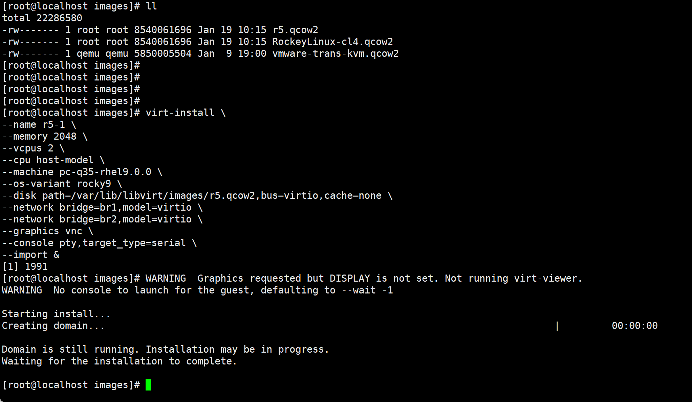

两个warning没事，一个是x11，本来我就不用说在远端用x11，我是windows安装x11，cmd里的virt-manager远程连接过去的。生产中也不会有什么机器给你x11。

第二个warining是console进不去，这个是vmware的vmdk转过来的，本来就没有console配置，所以要gui进去，事后增补倒是可以的。


验证克隆整合的vmdk是否和cli整合的vmdk一样

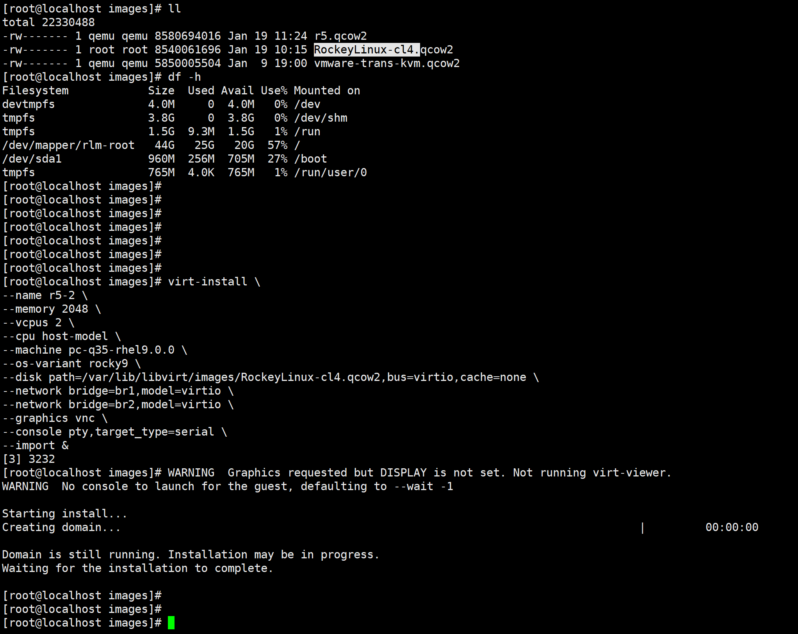

开机进去，发现三个系统里(vmdk、cli合并的vmdk、克隆合并的vmdk)的root/下都有之前创建的f001文件

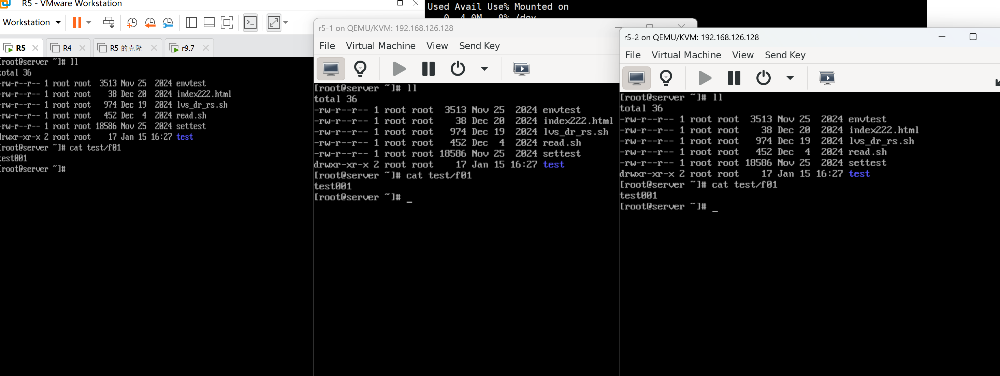


# 2、再增补一个console方便后面维护

你这个场景是 **VM 已安装系统 → 想开串口 console**，唯一可靠的方式是：

### 1️⃣ 通过 grub 配置 kernel args

1. 先启动 VM（用 VNC 或默认 graphics）
2. 登录系统
3. 执行：

```shell
cp -a /boot/grub2/grub.cfg /boot/grub2/grub.cfg.bak.$(date +%F-%H%M)
cp -a /etc/default/grub /etc/default/grub.bak.$(date +%F-%H%M)
grubby --info=ALL > ~/kernel_args_bak.$(date +%F-%H%M)  # 这里是参数记录下，如有有问题手动删除加上去的参数，正常没啥问题，就这么敲就行，已验证多次。
#grubby --update-kernel=ALL --remove-args="console=ttyS0,115200n8"


sudo grubby --update-kernel=ALL --args="console=ttyS0,115200n8"
sudo systemctl enable serial-getty@ttyS0.service
sudo systemctl start serial-getty@ttyS0.service
```

1. 重启 VM：

```
virsh reboot r5-1
```

1. 再用：

```
virsh console r5-1
```

✅ 你就能看到登录提示


**具体操作截图如下👇**

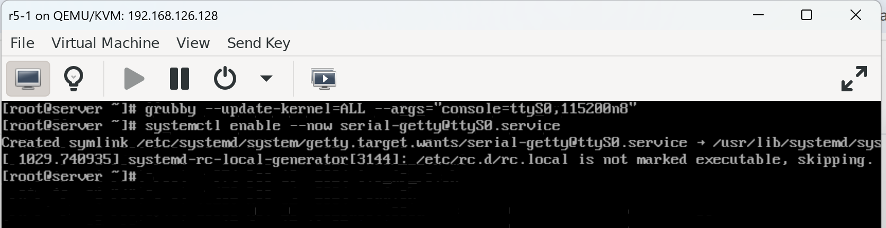


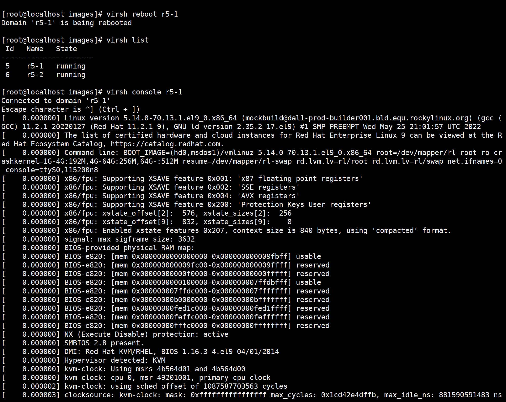

启动就OK

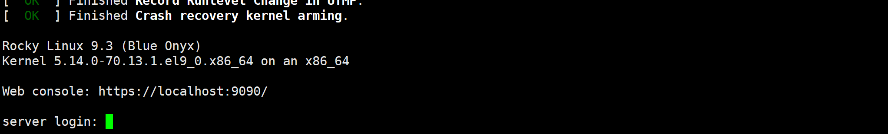


# 3、以下是反复测试过程记录，留着


## 操作记录1

将vmdk转成qcow2

把windows的vmware workstation里的虚拟机的vm复制到linux里

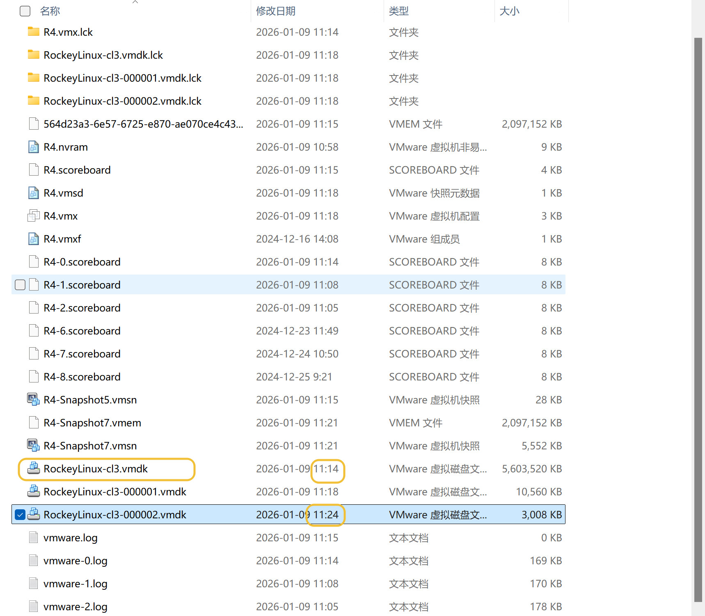

这选择仅处理base镜像看看效果，应该是有问题的


先试试看

```shell
qemu-img convert -f vmdk -O qcow2 RockeyLinux-cl3.vmdk vm_trans_01.qcow2
cp vm_trans_01.qcow2  /var/lib/libvirt/images/
chmod 600 /var/lib/libvirt/images/vm_trans_01.qcow2
chown qemu.qemu vm_trans_02.qcow2


# --machine pc-q35-rhel9.0.0 是对的 ，但要destroy再start才能在virt-manager打开
virt-install \
--name vmware-trans-kvm \
--memory 2048 \
--vcpus 2 \
--cpu host-model \
--machine pc-q35-rhel9.0.0 \
--os-variant rocky9 \
--disk path=/var/lib/libvirt/images/vmware-trans-kvm.qcow2,bus=virtio,cache=none \
--network bridge=br1,model=virtio \
--network bridge=br2,model=virtio \
--graphics vnc \
--console pty,target_type=serial \
--import &

```

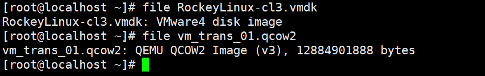


开不了机器，换方案


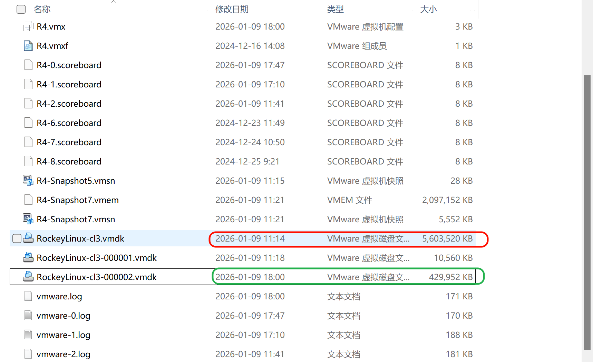

```cmd
# vmware-vdiskmanager.exe -r 最后一个快照 

vmware-vdiskmanager.exe -r "D:\Virtual Machines\R4\RockeyLinux-cl3-000002.vmdk” -t 0 "E:\all.vmdk"


# 这里很坑，一定要用最后一个快照去作为整合的线索，否则徒劳；要不你就克隆当前状态为一个新的VM，效果和这个cli一样的效果。

```

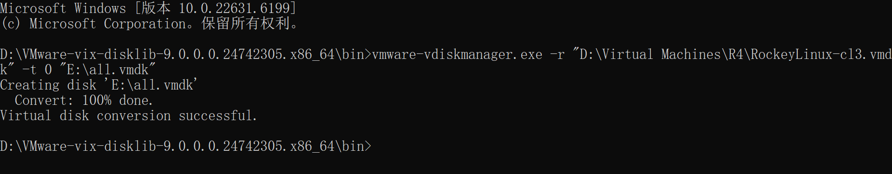


## **操作记录2（在 Rocky Linux 9 VMware 内）**

1. 安装 dracut-tools：

```
yum install -y dracut-tools
```

1. 检查 virtio 驱动是否可用：

```
lsmod | grep virtio
```

如果没加载：

```
modprobe virtio_pci
modprobe virtio_blk
modprobe virtio_scsi
```

1. 备份原 initramfs：

```
cp /boot/initramfs-$(uname -r).img /boot/initramfs-$(uname -r).img.bak
```

1. 生成支持 KVM/virtio 的 initramfs：

```
dracut -f -v --add-drivers "virtio virtio_pci virtio_blk virtio_scsi" /boot/initramfs-$(uname -r)-kvm.img $(uname -r)
```

1. 验证 virtio 驱动是否在 initramfs：

```
lsinitrd /boot/initramfs-$(uname -r)-kvm.img | grep virtio
```

1. 替换系统默认 initramfs：

```
mv /boot/initramfs-$(uname -r)-kvm.img /boot/initramfs-$(uname -r).img
```

1. 关闭 VMware 系统，转 QCOW2：

```
qemu-img convert -f vmdk -O qcow2 all.vmdk vwware_trans_kvm.qcow2
```

1. 在 KVM 上导入：

```
virt-install \
  --name vm_trans_kvm \
  --memory 2048 \
  --vcpus 2 \
  --cpu host-model \
  --disk path=/var/lib/libvirt/images/vm_kvm.qcow2,bus=virtio,cache=none,format=qcow2 \
  --network bridge=br0,model=virtio \
  --graphics none \
  --console pty,target_type=serial \
  --import \
  --os-variant rocky9
```

------

💡 **总结**：

- Rocky Linux 9 内核自带 KVM 模块，不需要 `kmod-kvm*`
- 核心就是重建 initramfs 并加入 virtio 驱动
- 转 QCOW2 后，virt-install 用 `bus=virtio` 就能启动

------


我的 root 和 swap 都在 **LVM** 里：

```
/dev/mapper/rl-root → / (xfs)
/dev/mapper/rl-swap → swap
```

所以 VMware 转 KVM 后黑屏 / dracut emergency shell 的原因就是：

1. KVM 下磁盘改成了 **virtio**，名字变了，例如 `/dev/vda`。
2. initramfs 需要 **包含 virtio_blk / virtio_scsi + lvm2**，并且能够激活卷组 `rl`。
3. 当前 initramfs 可能是原 VMware 生成的，或者生成方式不完全匹配 KVM 下的设备，所以找不到 `/dev/mapper/rl-root`。

------

💡 **解决方案**

1. 在原 VMware 系统里，生成支持 KVM 的 initramfs：

```bash
# 安装必要工具
yum install -y dracut dracut-config-generic lvm2

# 重新生成 initramfs，加入 virtio + lvm 驱动
dracut -f -v --add-drivers "virtio virtio_pci virtio_blk virtio_scsi" --add "lvm" /boot/initramfs-kvm.img $(uname -r)


```

1. 在 KVM 上，把新的 initramfs 设置为默认启动：  这我用的还是覆盖

- 在 virt-install 或 virt-manager 里选择你的磁盘 `virtio`
- 在 domain XML 里指定 kernel/initrd（如果使用 `--import` 可以保持默认启动）

1. 如果还黑屏，可以临时在 kernel 命令行加上：

```
rd.lvm.lv=rl/root
```

这样 dracut 会激活 LVM 并找到 root。

------

⚡ **注意**

- 不要用 VMware 原来的 initramfs，必须在包含 virtio 驱动的环境里生成。
- 磁盘必须是 `virtio` 类型，否则 LVM root 找不到也启动不了。

------

我可以帮你写一个 **完整操作流程**，从 VMware VM 生成 qcow2、修改 initramfs、然后直接在 KVM 上启动，不黑屏。

你希望我写吗？


```
我现在做了

yum install -y dracut-tools dracut dracut-config-generic lvm2

modprobe virtio_pci
modprobe virtio_blk
modprobe virtio_scsi

lsmod | grep virtio # 确认下


dracut -f -v --add-drivers "virtio virtio_pci virtio_blk virtio_scsi" --add "lvm" /boot/initramfs-kvm.img $(uname -r)

mv /boot/initramfs-kvm.img /boot/initramfs-$(uname -r).img

lsinitrd /boot/initramfs-$(uname -r)-kvm.img | grep -E 'virtio|lvm'  # 确认下

grub2-mkconfig -o /boot/grub2/grub.cfg


virt-install \
--name vmware-trans-kvm \
--memory 2048 \
--vcpus 2 \
--cpu host-model \
--machine pc-q35-rhel9.0.0 \
--os-variant rocky9 \
--disk path=/var/lib/libvirt/images/vmware-trans-kvm.qcow2,bus=virtio,cache=none \
--network bridge=br1,model=virtio \
--network bridge=br2,model=virtio \
--graphics vnc \
--console pty,target_type=serial \
--import &

virsh destroy vmware-trans-kvm
virsh start vmware-trans-kvm

搞定

```


## 操作记录3

别人的操作，

可取点：file qemu-img，推荐检查用

参考点：--boot hd 不推荐用

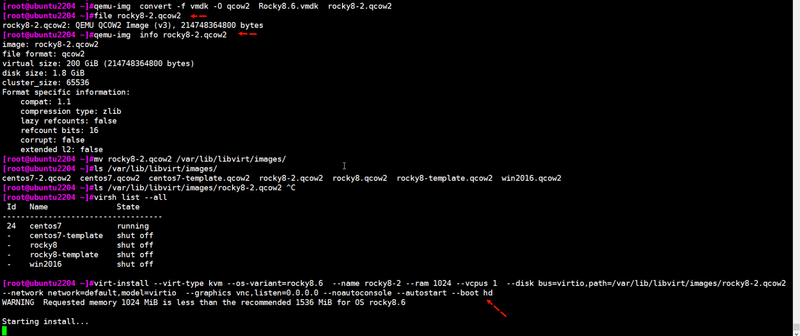


# 磁盘扩容


 

## CLI

```shell
# 查看vm对应的磁盘
virsh dumpxml xxx |grep qcow2
virsh domblklist xxx

# 关机-生产环境推荐
virsh shutdown xxx
或者
virsh destroy xxx


# 做快照★
virsh snapshot-create-as xxx xxx_snap_$(date +%F)
# 做备份★
cp -a /var/lib/libvirt/images/xxx.qcow2 /var/lib/libvirt/images/xx_bak_$(date +%F).qcow2


# 关机状态下，对磁盘扩容
qemu-img resize /var/lib/libvirt/images/xxx.qcow2 +10G
# 验证
qemu-img info /var/lib/libvirt/images/xxx.qcow2

# 开机
virsh start xxx


# 开机状态下查看磁盘空间，但是是开机状态下，元数据应该是和关机状态下的不同的。
qemu-img info --force-share  /var/lib/libvirt/images/xxx.qcow2

# 不关机-在线扩容vm的磁盘，比如500G，注意只是vm的磁盘vda，不是进一步深入到vm的文件系统
virsh blockresize r5-1 vda 500G   
#这个500G一定要小心，要写大于当前磁盘的空间，否则直接gg，除非你提前做了快照！


virsh console xxx  # 进去
# 安装热扩容分区工具
yum -y install cloud-utils-growpart
# 热扩分区 将 vda2 扩展到整个磁盘剩余空间
growpart /dev/vda 2
# lvm一把梭
lvextend -rl +100%free /dev/rl/root


```


## 截图

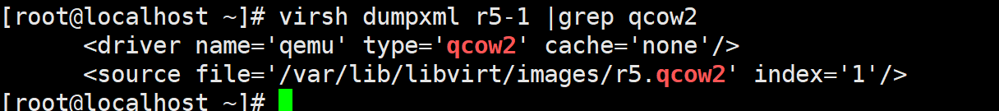 

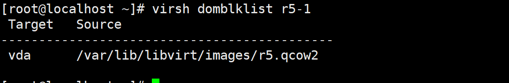 

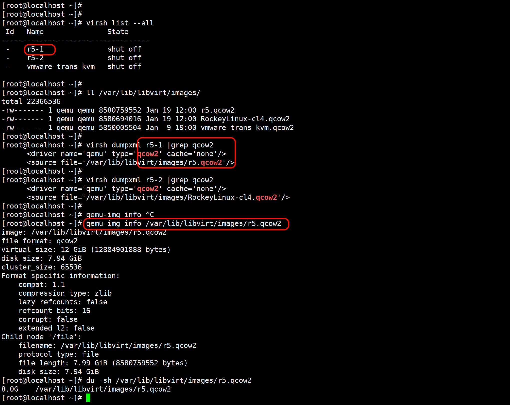

12G的r5.qcow2，考虑当前磁盘空间，扩了10G👇，注意，这些都是虚的，是瘦置备(简单理解)。

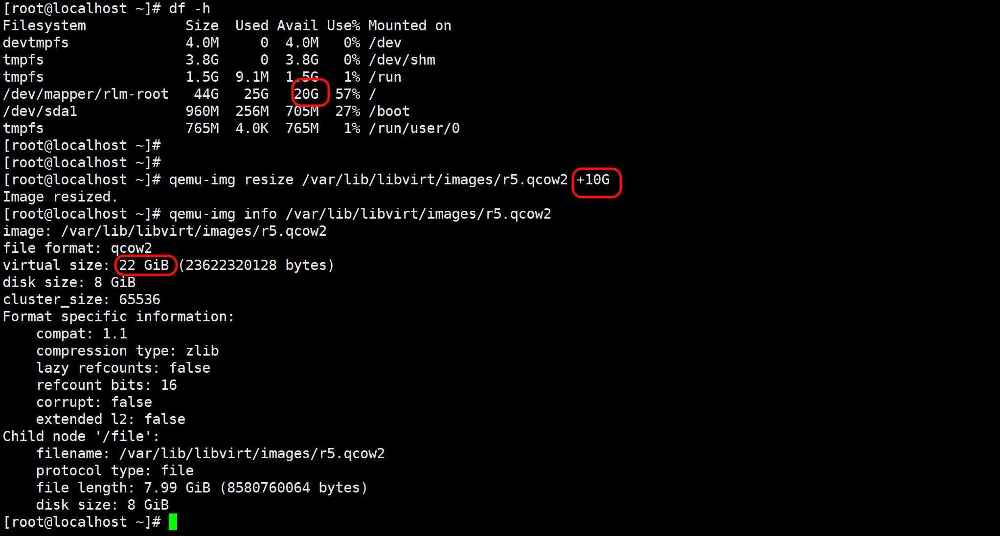

启动，进入这里之前搞定了console，所以直接console进去，否则用GUI

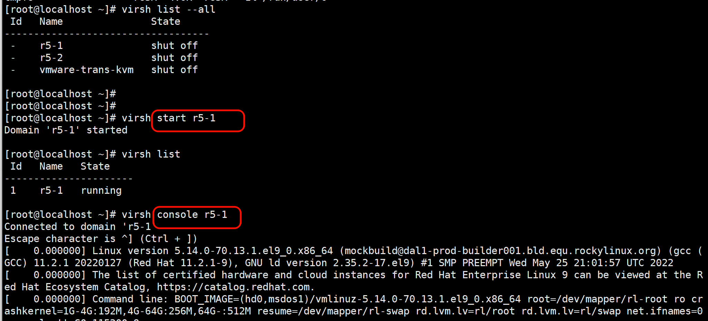

进去后就是文字显示的启动过程，ctrl ]退出，或者继续等等都行。

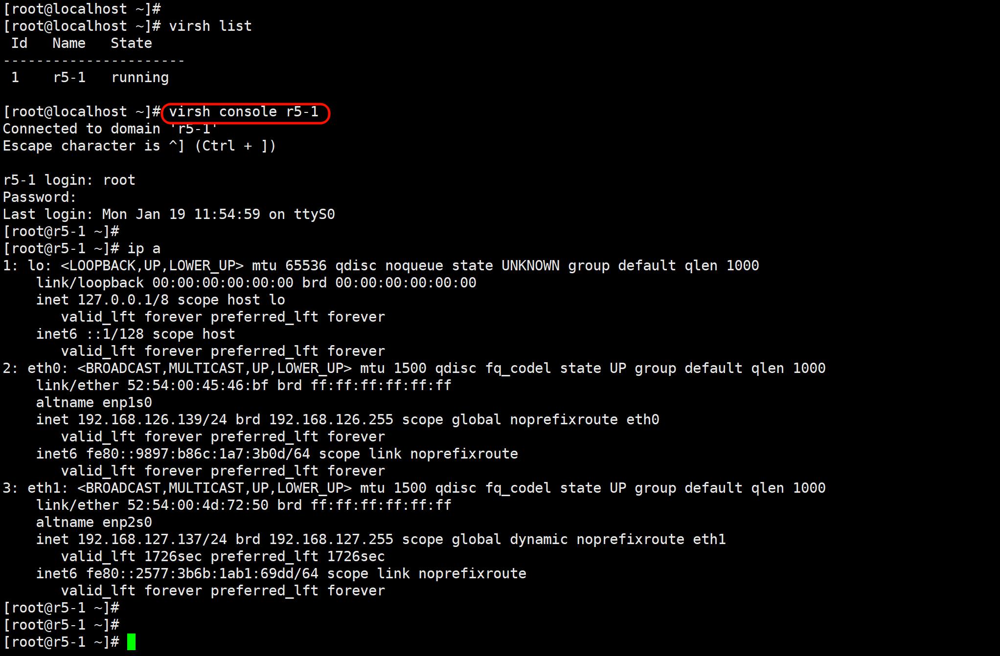


进去可以看到22G有了，但是要用起来，也就是分区和lvm扩容

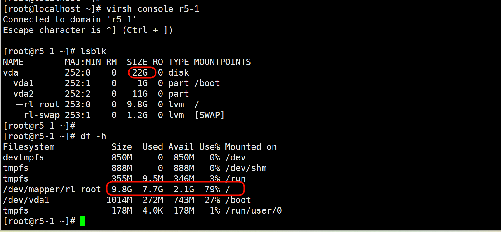


呵呵

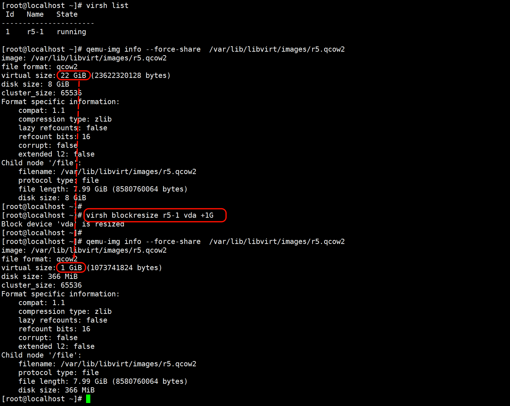

挂了

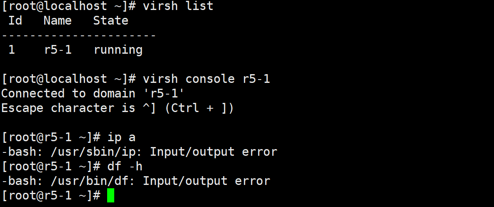 


换个vm再做一遍在线扩容

### 热扩容

#### 扩之前

备份和快照--一般就关机做

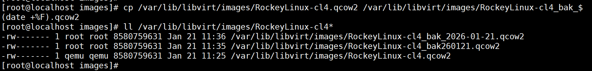

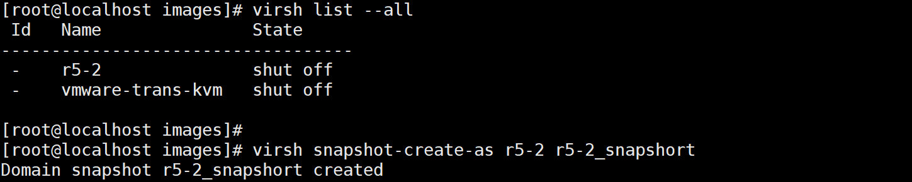


不关机这么做

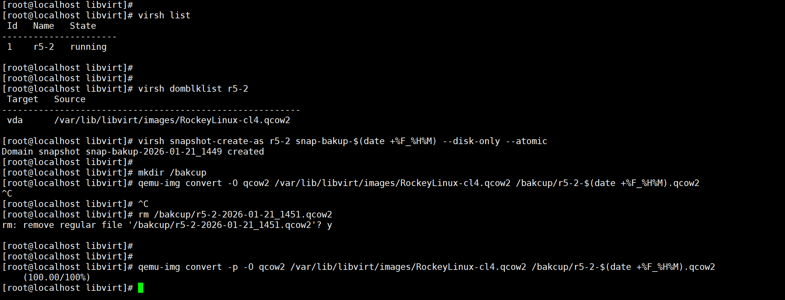

参考文末独立章节


#### 开始扩

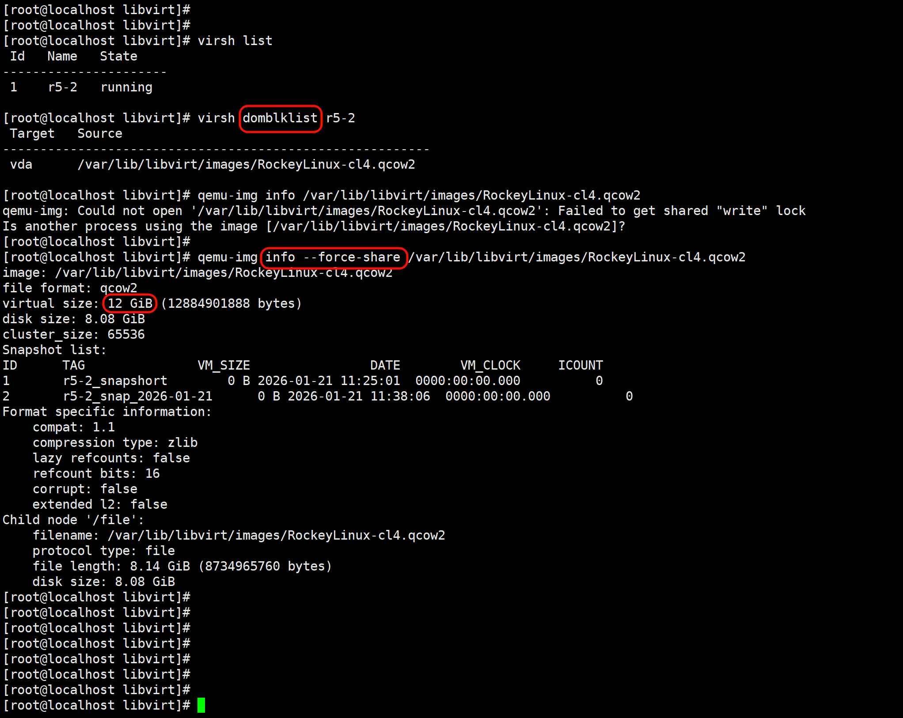


将12G扩容到22G👇

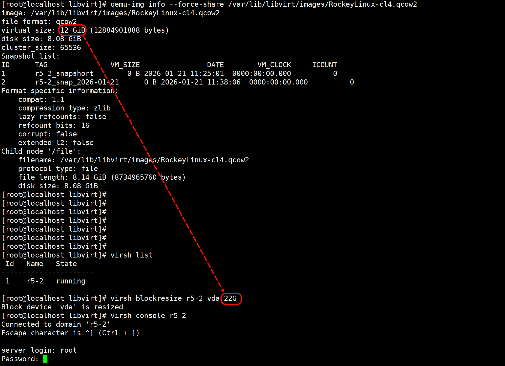

然后再进去看下总磁盘，和扩分区就行了

growpart \[磁盘\] \[要扩的分区号\]  # 这样就分区将占满怎么磁盘👇，同时pv都不要加自动的。当然可以用vgs pvs确认下是否有新增的10G供扩容lvm。

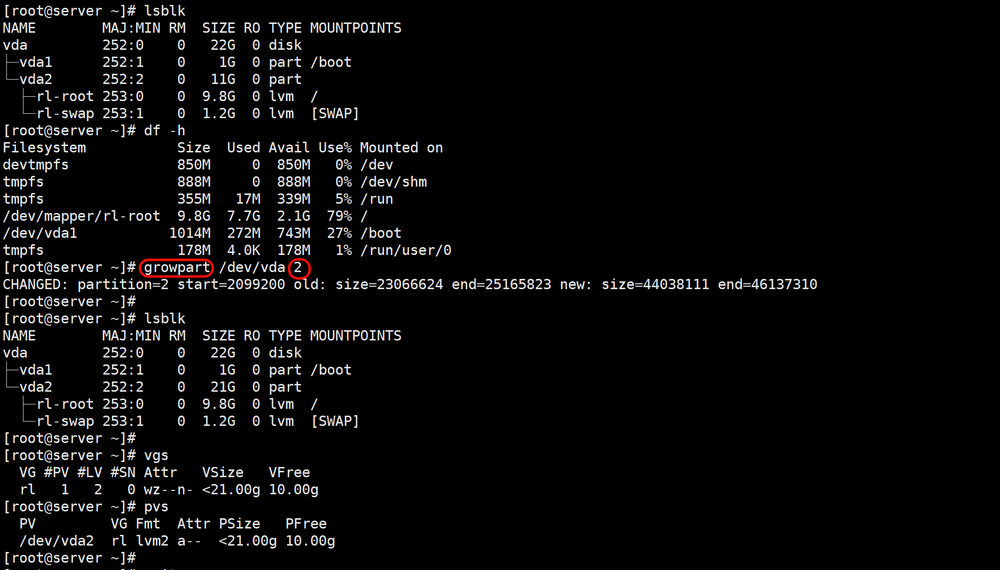

👆上图可见vda2分区从11G扩至22G了已经


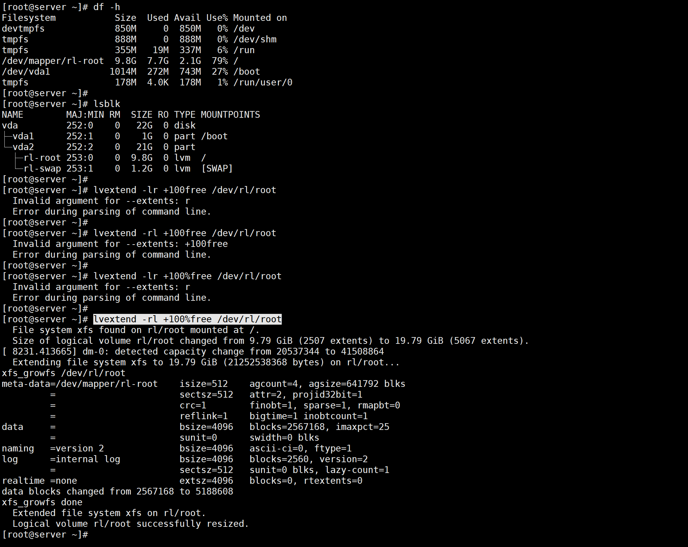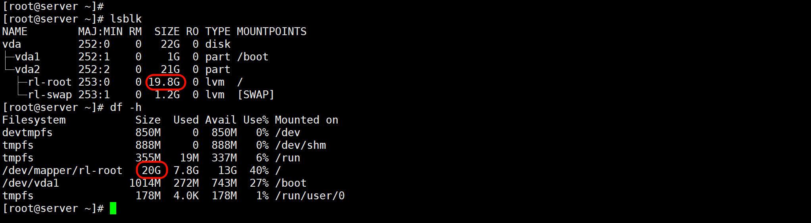

搞定


------

# ✅ KVM 生产级关机备份（Cold Backup）标准操作

## 适用场景

- 数据库 / 核心业务
- 需要 **100% 文件系统 + 应用一致性**
- 可接受短暂停机

------

## 一、确认 VM 状态 & 磁盘

```bash
virsh list --all
virsh domblklist r5-2
```

假设磁盘是：

```
/var/lib/libvirt/images/RockeyLinux-cl4.qcow2
```

------

## 二、优雅关机（必须）

```bash
virsh shutdown r5-2
```

等待关机完成：

```bash
virsh list
```

或强校验(状态精确度高，且针对单台vm)：

```bash
virsh domstate r5-2
```

必须看到：

```
shut off
```

❗**不推荐直接 destroy（断电）**

------

## 三、冷备份（最稳的一步）

### ✅ 推荐方式（懂 qcow2，生产首选）

```bash
mkdir -p /backup

qemu-img convert -O qcow2 \
  /var/lib/libvirt/images/RockeyLinux-cl4.qcow2 \
  /backup/r5-2-$(date +%F)-cold.qcow2
```

### 为什么不用 cp？

- convert 会：
  - 校验 qcow2
  - 合并潜在快照
  - 跳过空洞块
- 输出 **干净、独立、可启动镜像**

👉 **这是“教科书级冷备份”**

------

## 四、校验备份（必须）

```bash
qemu-img info /backup/r5-2-2026-01-21-cold.qcow2
```

------

## 五、启动 VM（恢复业务）

```bash
virsh start r5-2
```

------

## 六、恢复验证（强烈建议至少做一次）

```bash
virt-install \
  --name r5-2-cold-restore \
  --memory 2048 \
  --vcpus 2 \
  --disk path=/backup/r5-2-2026-01-21-cold.qcow2 \
  --import \
  --noautoconsole
```

------

## 七、你可以直接写进规范里的结论

> **生产级备份优先级：**
> 1️⃣ 关机冷备（cold backup）⭐⭐⭐⭐⭐
> 2️⃣ 快照 + convert（不停机）⭐⭐⭐⭐
> 3️⃣ freeze + cp（应急）⭐⭐

------


------

# ✅ KVM生产级在线（running）备份方案

## （快照 + qemu-img convert，最佳实践）

> 目标：
>
> - VM **不停机**
> - 备份 **100% 可恢复、可启动**
> - 不依赖 guest-agent
> - 对业务影响最小

------

## 一、前置确认（1 条命令）

```bash
virsh domblklist r5-2
```

你应该能看到类似：

```
Target   Source
---------------------------------------
vda      /var/lib/libvirt/images/RockeyLinux-cl4.qcow2
```

下面假设磁盘就是这个文件。

------

## 二、步骤 1：创建**磁盘快照**（关键）

```bash
virsh snapshot-create-as r5-2 snap-backup-$(date +%F_%H%M) \
  --disk-only \
  --atomic
```

### 这一刻发生了什么（你要心里有数）：

- VM **继续运行**
- 原磁盘 `RockeyLinux-cl4.qcow2` → **冻结为只读视图**
- 新写入 → 临时快照文件（增量盘）★ 这里和vmware的快照一样，凡是做了快照，新数据都是写到快照里的。

✅ 这是“安全备份点”

------

## 三、步骤 2：导出**干净完整备份**（核心）

```bash
mkdir -p /backup

qemu-img convert -O qcow2 \
  /var/lib/libvirt/images/RockeyLinux-cl4.qcow2 \
  /backup/r5-2-$(date +%F).qcow2
```

### 为什么这一步比 `cp` 强：

- 理解 qcow2 结构
- 自动合并快照链
- 丢弃空洞 cluster
- 输出 **独立、可启动镜像**

📌 这个 `/backup/r5-2-*.qcow2`
就是你**真正意义上的“备份”**

------

## 四、步骤 3：删除快照（必须，或者留最近的2个也行）

```bash
virsh snapshot-list r5-2
```

确认快照名后：

```bash
virsh snapshot-delete r5-2 snap-backup-XXXX --metadata 

# 夜里
virsh blockcommit r5-2 vda --active --verbose --pivot
```


效果：

- VM IO 写回原盘
- 性能恢复
- 快照文件可清理

❗ **生产原则：快照不留过夜，夜里在delete好了，不要脱裤子放屁--metadata后还夜里再去合并！**

------

## 五、验证备份（强烈建议）

```bash
qemu-img info /backup/r5-2-2026-01-21.qcow2
```

看到：

- format: qcow2
- virtual size 正确

👉 说明备份完整

------

## 六、恢复演练（你一定要会）

```bash
virt-install \
  --name r5-2-restore-test \
  --memory 2048 \
  --vcpus 2 \
  --disk path=/backup/r5-2-2026-01-21.qcow2 \
  --import \
  --noautoconsole
```

👉 能启动 = **这套备份是合格的**

------

## 七、你可以直接记住的“最终 SOP”

```text
1. snapshot-create-as --disk-only --atomic
2. qemu-img convert
3. snapshot-delete
```

------

## 八、和你之前问的方案对照（给你定性）

| 方案                   | 定位             |
| ---------------------- | ---------------- |
| freeze + cp            | 临时热备         |
| snapshot               | 回滚点           |
| **snapshot + convert** | ✅ **生产级备份** |

------

## 九、给你一句“专家级结论”

> **r5-2 这种 running 的 KVM VM，
> 不停机、最稳、最通用的备份方案，
> 就是：磁盘快照 + qemu-img convert。**

如果你愿意，下一步我可以帮你把它做成：

- ✅ **可直接 cron 的脚本版**
- ✅ **带失败回滚和告警的运维版**
- ✅ **多 VM 批量备份模板**

你说一声，我直接给你成品。


# 关于快照不一定很好理解

课题：看看r5-2的快照

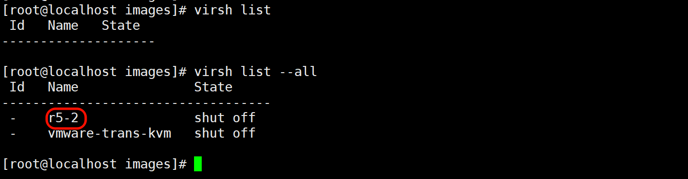


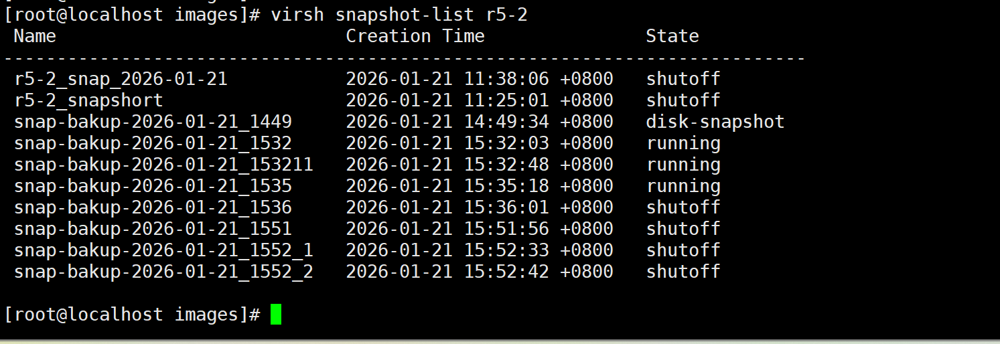

这样virsh snapshot-list xx看👆是全的

但是qemu-img info👇只能看到两个，

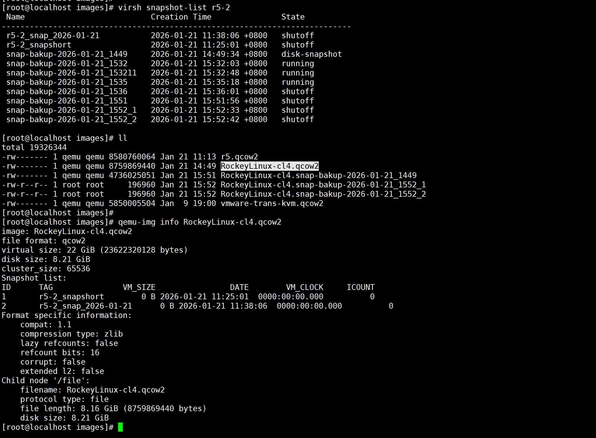

而这两个是针对RockeyLinux-cl4.qcow2的内部快照，是没有独立的qcow2文件的

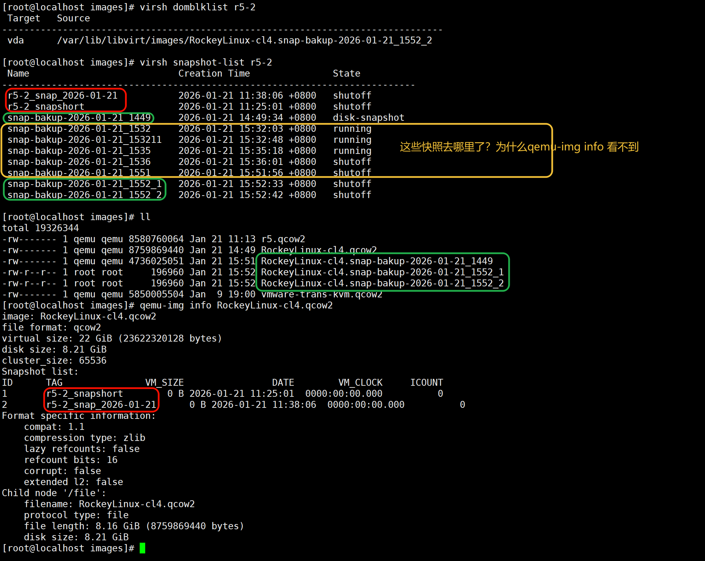


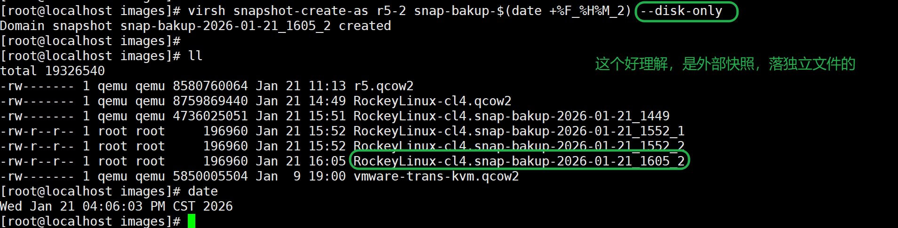


不加--disk-only按理说不落独立文件，怎么还是看不到

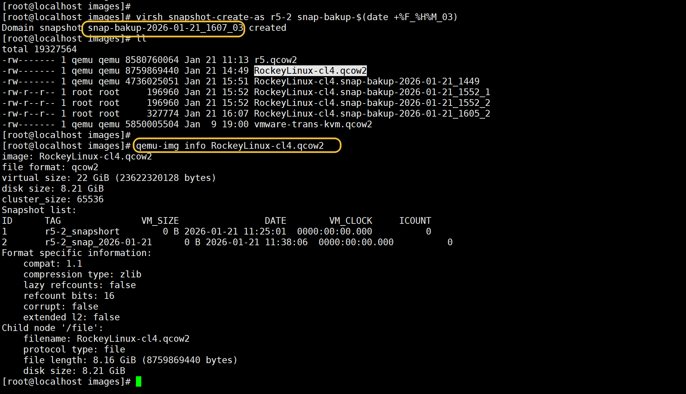

**找到原因了，**只要你用--diskonly创建过一次，那么后面所有的不管你是不是内部快照，qemu-img info都不会记录了

下图就是cli

```
virsh snapshot-create-as vmware-trans-kvm vmware-trans-kvm-snap001
virsh snapshot-create-as vmware-trans-kvm vmware-trans-kvm-snap002
virsh snapshot-create-as vmware-trans-kvm vmware-trans-kvm-snap003
virsh snapshot-create-as vmware-trans-kvm vmware-trans-kvm-snap004
virsh snapshot-create-as vmware-trans-kvm vmware-trans-kvm-snap005

virsh snapshot-create-as vmware-trans-kvm vmware-trans-kvm-snap006 --disk-only  # 此时外部快照落独立文件，qemu-img info 不再记录
virsh snapshot-create-as vmware-trans-kvm vmware-trans-kvm-snap007 # 因为前面有过一次外部快照，所以后面即使用内部快照也会记录在qemu-img info里了

```

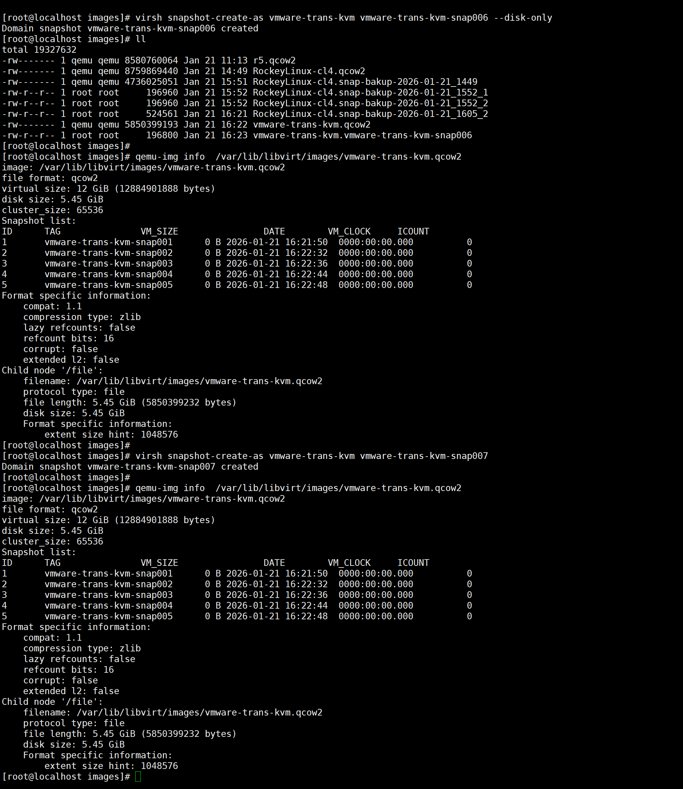


再回过头来看

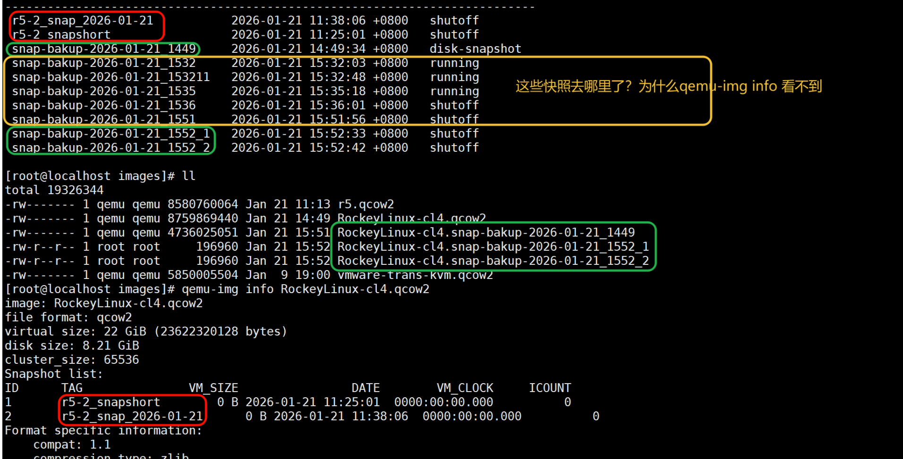

正因为1449那一条外部快照文件落了，所以后面的 管他是不是 内部还是外部(也就是是否加--disk-only)都不会被qemu-info记录了。

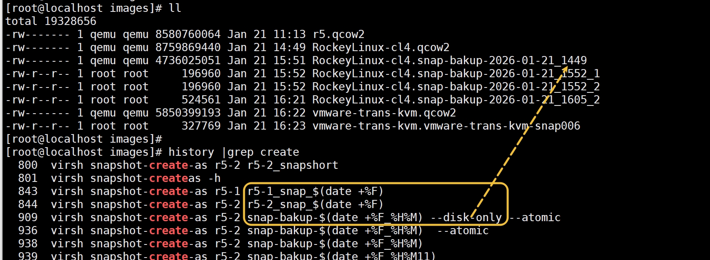

但是话说回来，你知不知道这些内、外 快照，独立文件于否对于快照管理都没啥大的影响

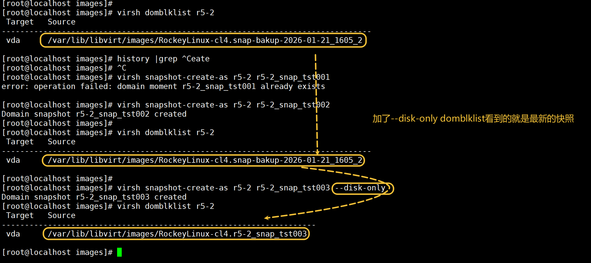

1、domblklist看的是写入层

2、理论上我们在vmware-workstaion上看都知道做了快照，数据都写到快照里，所以类比到kvm的dombllklist代表的写入到最新的快照里是没毛病的

3、但是不加--disk-only就是内部快照，domblklist看不到，也就是没有独立的写入层，还是写到base磁盘里。

**domblklist 反映的是当前写入层的 qcow2 文件**

**内部快照创建不改变写入层**

**disk-only 快照创建会切换写入层到新文件**

核心理解：**domblklist 显示的永远是 VM 当前写入的文件，不加 disk-only 就是内部快照，写入层没变**

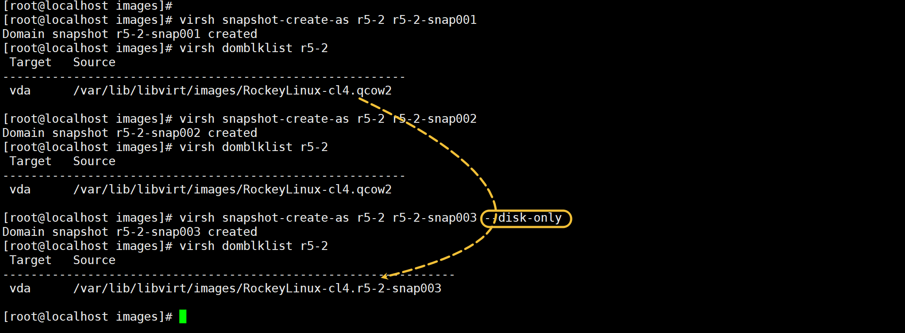


```shell
# 删除所有快照
for snap in $(virsh snapshot-list r5-2 --name);do virsh snapshot-delete r5-2 $snap ;done
for snap in $(virsh snapshot-list r5-2 --name);do virsh snapshot-delete r5-2 $snap ;done
```

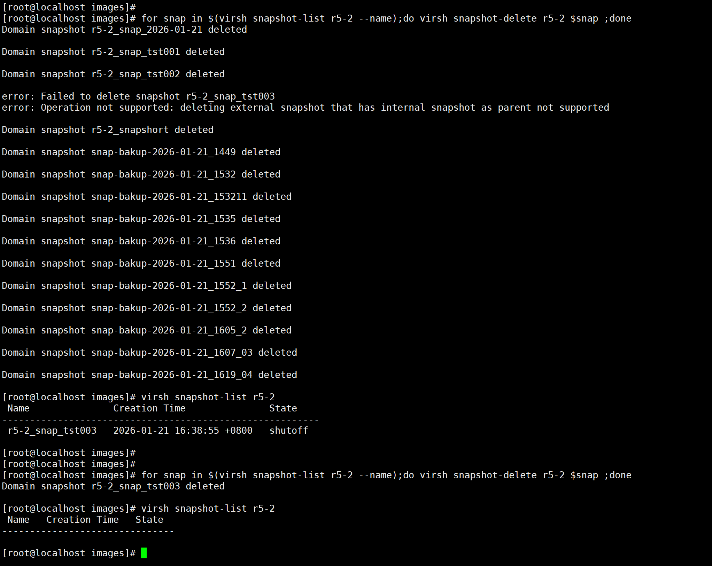


**所以--metadata是用在清理垃圾数据上的，不是你常规删快照的操作。**

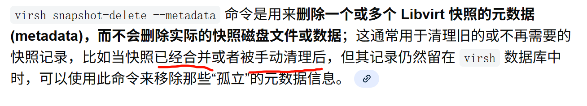 


## 快照合并

vmware里我们用克隆一台就实现了，但是那是克隆啊，不是原地合并啊

vmware-vdiskmanager.exe -r 最后一个快照 ,这样可以合并出来，不过也是新的vmdk

其实真正合并快照就是删除快照，就会自动合并到bases磁盘里，但是上面讲过--metadata删除的只是元数据，实际的写入层还在，我们这里讨论的是外部快照文件。

所以除了删除快照 自动合并的方法，还有删除metadata后的手动合并方法


1、处理一个故障，还原无快照状态

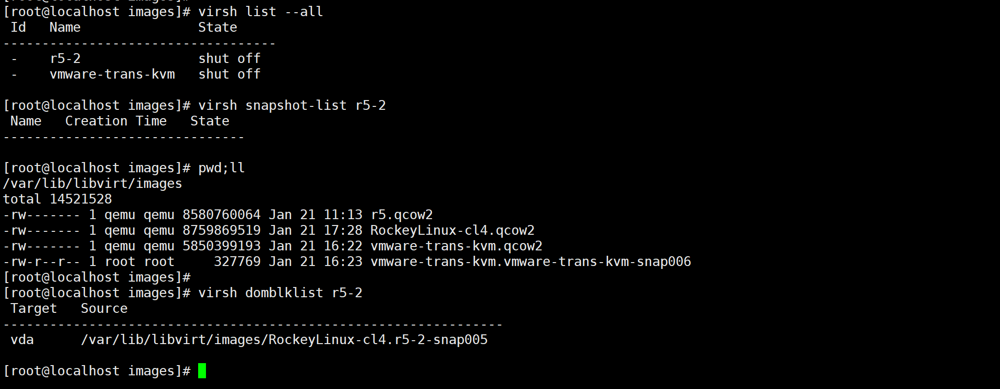

但是历史操作有问题，写入文件不对👆，此时开机必然报错

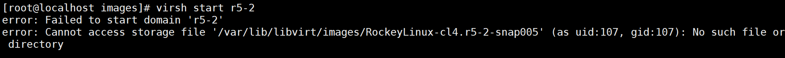

直接edit就行


验证开机ok


2、现在是初始无快照了


3、做快照-外部的


qemu-img info --backing-chain可见快照链👇


```shell
# 手动合并
qemu-img commit /var/lib/libvirt/images/RockeyLinux-cl4.snap002

```


但是还是会写入snap002
需要edit一下，顶层写入改成virsh snapshot-list 可见的最后一个外部独立文件快照，也就是snap001。


再删除snap002


再来，如果是内部快照呢，很好，但是要再删除内部快照后手动刷新腾出空间


# 不要用--metadata


# 关于两种快照的总结和问题处理


## 1、理解两种快照

不管是内部还是外部，都可以在virsh snapshot-list vmxx里看到，这话就不全对，哈哈

1、要知道virsh snapshot-list看的都是有metadata在的，你删掉了metadata，virsh snapshot-list就看不到了，这也是故障点

2、如何知道一个vm的快照的全貌，

①virsh snapshot-list看下，看到的就是所有virsh管理的元数据，但是看不到仅删掉元数据 但是快照文件还在的情况，virsh snapshot-list是看不到的；

②针对内部快照，要看看qemu-img info看看有没有孤儿快照就是仅删除metadata的快照；

③针对外部快照，要看看ll /var/lib/libvirt/images/下有没有孤儿文件；

④如果这个vm经历过内部快照-又做过外部快照--哪怕后面你再做过内部快照，那么这些被外部快照割裂的以后出现的内部快照都不会在第一个base的qemu-img里出现了，就会出现在最后一个外部快照文件里，也就是说割裂的内部快照是会作为前一个外部快照的内部快照。

⑤不管三七二十一，内部快照合并怎么做，有元数据，正常删快照就能合并，没有元数据的孤儿内部快照不能直接qemu-img snapshot -d 去删除，要qemu-img convert 相当于克隆一个独立的磁盘文件了这样就能合并哪些孤儿内部快照了；

⑥外部快照合并怎么做，qemu-img conver就不一定行得通了，针对孤儿外部快照要用qemu-img commit去合并进去。

当然，一般--disk-only比较适合在线快照，不加会影响业务。

**一个干净没有快照信息的初始化**


**启动**


**做10个内外夹杂的快照**，base里写一个0，然后每个快照了里+1


继续


①先上结论： 

1、snap001 002在qemu-info  base里

2、snap003 004是独立的文件

3、snap005 006在qemu-info 004里

4、snap007 008是独立文件

5、snap009 010在qemu-info 008里

②验证OK👇


## 2、制造点问题

删除一些内外快照的metadata


由于只是删除元数据，所以快照层不管是外部的独立文件还是内部的快照层，都在。数据也OK


一些快照的metadata没了，但是分层还在👇


## 2、外部内部快照问题处理

关机先啦，合并快照本身就要commit影响业务，找窗口。

```shell
qemu-img commit /var/lib/libvirt/images/RockeyLinux-cl4.snap002
```


然后移走外部快照


处理顶层写入文件

删掉这些👇


重启验证数据是否都在


此时所有外部快照都合并了已经，


但是内部快照还需要进一步处理合并，看不到的009 010 其实在外部008里就合进去了，007也合进去，006和005随着004合commit进去了，003也commit合进去了，所以修剪一下r5-2的元数据


现在处理002


snap002的情况是元数据没了，但是在base里的分层还在。

尝试写个数据看看，发现内部快照其实不会改变写入层，还是写入base。这点和外部快照一样，外部快照就出现一个就变成新的顶部写入层。


开始处理snap002


之前在外部快照文件里的那些内部快照层会随着，这些外部快照commit合并进base。

最后在base里的内部快照层，如果有元数据丢失，要修正的化，还是要类似克隆一台出来👇

```shell
virsh shutdown r5-2
qemu-img convert -O qcow2 RockeyLinux-cl4.qcow2 merge-r5-2.qcow2
```


```shell
virt-install \
--name merge-r5-2 \
--memory 2048 \
--vcpus 2 \
--cpu host-model \
--machine pc-q35-rhel9.0.0 \
--os-variant rocky9 \
--disk path=/var/lib/libvirt/images/merge-r5-2.qcow2,bus=virtio,cache=none \
--network bridge=br1,model=virtio \
--network bridge=br2,model=virtio \
--graphics vnc \
--console pty,target_type=serial \
--import &

```


