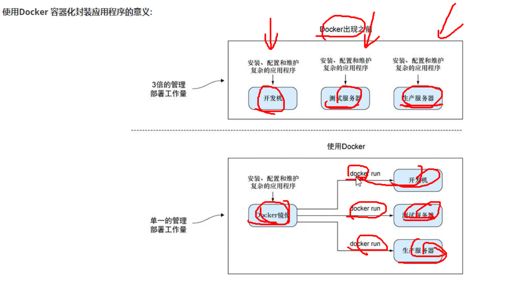

# 第0节 容器技术和Docker特性

# 1、背景

类比集装箱

隔离成本低

docker 只是 一款优秀的 容器技术 ，容器不单单指docker。

docker是结合linux内核开发出来的，不是完全独立开发出来的。将linux内核的两个核心技术加以组合，并封装了额外的功能软件。

docker启动快

build构建----ship传输---run运行

之前docker那本书上有一段敲过实验，可以看到本地build的命令其实可以在远端build然后拉下来运行的。如果不指定就是本地build本地运行，中间是省掉了一个本地到本地的ship过程。

不过这里的ship更多讲的是拿整个build好的镜像到处运行的意思。VM里有迁移的动作，不过也没有docker的ship来的更加频繁。

Any APP  ， Anywhere，比如windows构建的镜像，到linux一样运行使用。

