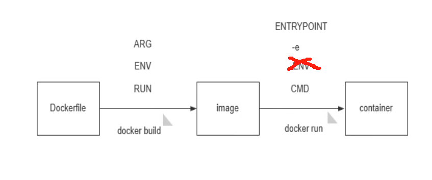

# 第1节 Dockerfile常见指令用法


# 接上节，浅复一下

FROM：所有镜像都有父镜像，scratch镜像

LABEL：版本信息，功能说明，作者
ENV：环境变量，build后run起来可用，后续run得时候-e可覆盖
RUN：build时候执行得shell命令，比如编译安装，ln -s，配置文件修改，脚本操作
COPY：宿主的文件复制到镜像里，文件得放在build动作的当前工作目录，且使用相对路径（一般就是Dockerfile所在目录，除非Dockerfile 是 -f 放到其他地方了，此时COPY的源文件还得必须是build这个动作的当前目录）。
ADD：比COPY多了一个自动解压缩，然后复制的时候，目标目录可能不像COPY那样需要加上/，来严谨对待，但是我们还是要规范的。
CMD：容器run来后执行的命令，一般用来挂前台保证容器run起来后不会停止的。CMD的要求就是执行程序得是前台的不能是后台的，比如nginx命令通常就是后台的，需要明确指定为后台nginx -g daemon off这种。  同时  alpine  、 ubuntu 、centos 这些系统都是/bin/sh的都是会run起来就Exited了，所以创建web服务、java服务、微服务，这些服务的时候就需要CMD是一个前台的程序。


CMD的缺陷：




# 配置文件的处理

现在要在Dockerfile里定义好配置文件，


**1、先把容器跑起来，然后从里面复制一份conf出来**


**2、优化下配置文件**

涉及的参数如下：

```shell
worker_processes auto;
...
events {
	worker_connections 10240;
}
...
...
include /apps/nginx/conf/conf.d/*.conf;


```

```shell
vim build.sh
#!/bin/sh

doker build -t nginx-alpine-self:$1 .
chmod +x build.sh
./build/sh 1.26.0-v1.0

```


run起来然后查看下配置文件是否修改👇


已修改，然后看下conf.d文件夹是否自动创建

并没有创建👇


所以Dockerfile里要创建该目录了


这也是分层多的和分层少的 自己要注意的地方，比如这里由于RUN太长了，前面还有编译的动作，所以要考虑拆成两个RUN就会是的前面的RUN层级可以被复用。


再run起来，看看conf.d是否ok


这样就有了独立的配置文件存放目录conf.d


**3、配置server块**

3.1 创建子目录编写server块


这样配置文件就有了👆

3.2 还得有一个网页html文件


3.3 编写Dockerfile

肯定是基于上面制作得nginx-alpine-selfv1.3来进一步封装啦，要利用之前得nginx的配置文件，特别是conf.d这个目录得存在。

```shell

FROM nginx-alpine-self:v1.3
LABEL maintainer="oneyearice <oneyearice@gmail.com>"

RUN mkdir -p /data/website    # 存放也没html文件的
COPY index.html /data/website/    # html复制进去
COPY www.ming.org.conf /apps/nginx/conf/conf.d/    # 子配置文件，也就是server块文件扔进去
# 由于继承的镜像里有CMD挂前台了，所以这里无需再配置CMD了
```


这样这些原材料就准备好了


build一下


搞定👆

然后run起来，run的时候要用-p而不是大P，理由如下：

1、容器里的nginx默认就是监听80，但我们现在讨论的是 端口暴露这个动作；

2、-p 小p就是明确将容器里的80暴露成宿主的某个端口；

3、-P 大P就是将Dockerfile里定义的 指定暴露的容器里的端口，暴露成宿主机的随机端口。

然后就好了👇


复习下端口暴露的情况查看除了docker ps 还有👇

 

哎，不对，html页面内容不对，里面有两个网站的，一个是nginx.conf主配文件里的，一个是conf.d下的子配置文件，明显这个helo helo ----xxx被nginx.conf里的location配置给截胡了。


上图主配置文件的server块里的root再location /下，然后使用的是相对路径，这个相对路径就是当初编译的时候的路径，怎么查看呢👇


所以root html就是在/apps/niginx/html下的index.html文件了

汇总一下


所以被截胡了

所以换个curl方式就可以优先应用子配置文件了👇


然后进一步把IP地址的curl也让子配置文件优先👇


## nginx的转发优先级

基本实验需求已实现，但是关于nginx的server块优先级，涉及子配置文件，主配文件，location，还有server块里的ip+port > servername ,servername里的又细化为


**以上是模糊的梳理，还需进一步明确优先级。**

1、include写在主配置文件的server前面，基本上就是include那里的子配置文件优先看了

​			\#  然后因为80是默认的，写不写都是，所以基本上轮不到主配置文件的server块了

​			\#  然后多个include还是看谁在前

2、然后include所指的子配置文件夹里(一般就是conf.d)就看多个文件之间，以及单个文件内的server块之间的优先了

​		2.1    按字母顺序查找


​		2.2    单个文件里就按

​						①ip+port 最优

​						②才是这张图👇


3、然后再实现一个curl ip 走一个，curl 域名走一个需求，方法①代理②配置文件里写map？


