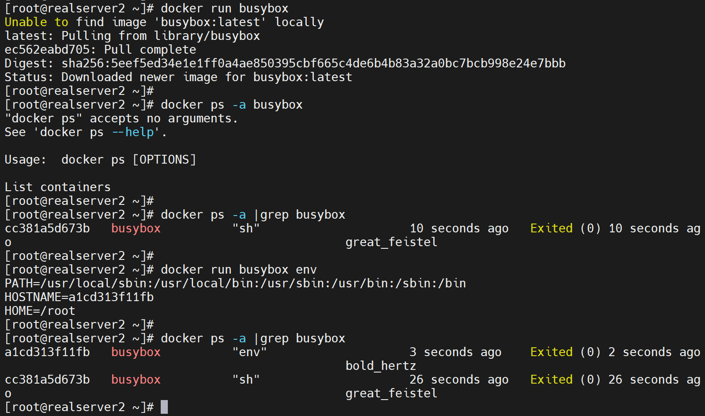
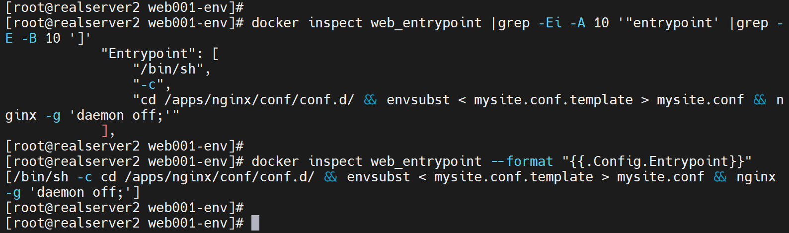
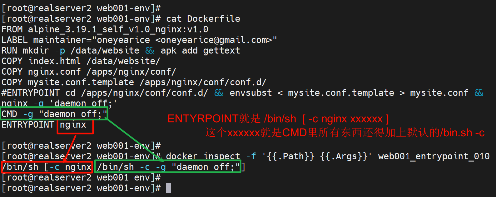
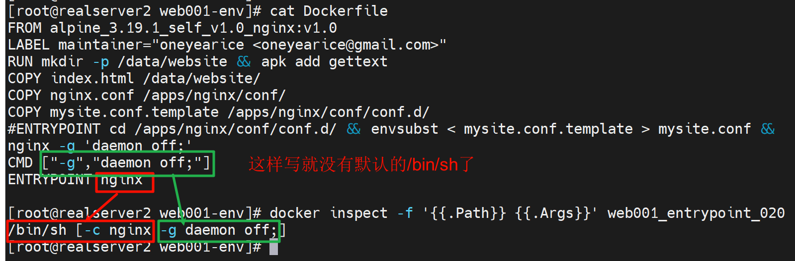
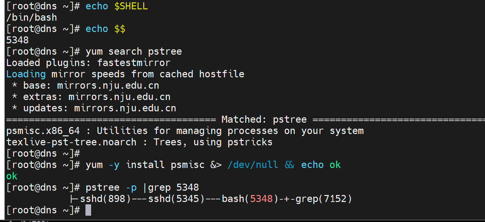
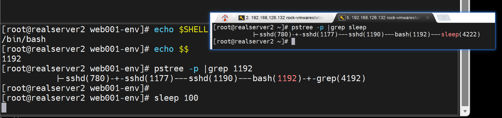
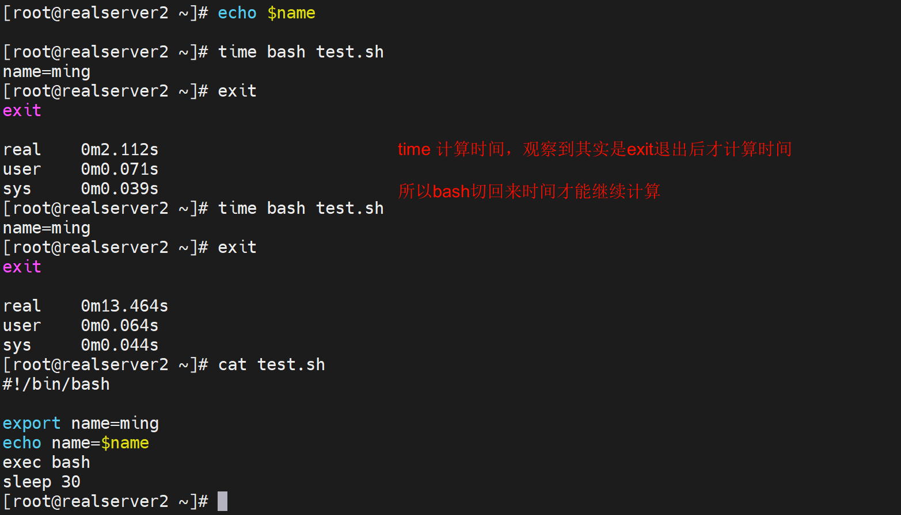
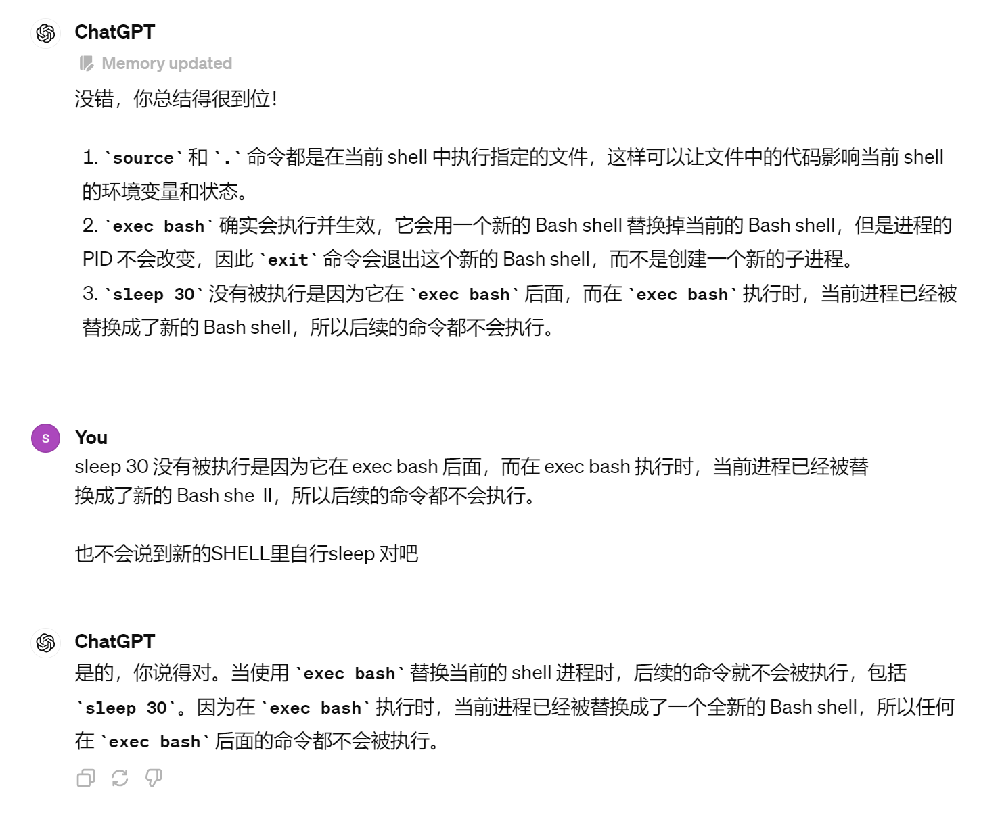
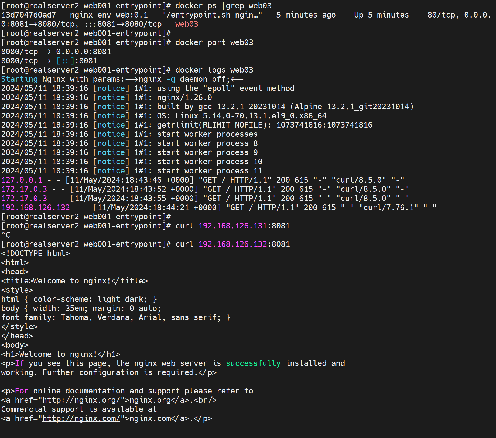

# 第3节 Dockerfile常见指令ENTRYPOINT用法


# 概述


我把cli就是手动敲的命令行叫做cli

我把CMD ENTRYPOINT就是说的Dockerfile里的配置

我把cli entrypoint就是手动命令行里的输入的东西

下文的沟通如上所示


## CLI里的追加和覆盖

### CMD是直接全部覆盖掉

CMD在Dockerfile里也是最有一个生效，前面都会被覆盖。

docker run 最后跟的参数也就是最后的那些个cli，会覆盖Dockerfile里的CMD



同样之前实验的CMD是一串CLI，也被直接覆盖了


但是ENTRYPOINT就不会了

### CLI追加到Dockerfilie里的ENTRYPOINT

docker run 最后的那些个cli就会作为Dockerfile里ENTRYPOINT的参数




没变化，再看其实是有变化的，只是docker ps 看不到太长了


上图可见docker run 的cli也就是cat 123 全部都当作ENTRYPOINT的参数了。

这一点inspect看还是不明朗的👇，只能自己知道有这回事，哦cmd的所有参数都是合并进去的。


## 查看合并后的CLI


emmm，工具真多啊


## CLI里替换entrypoint及追加cli

docker run最后的那些个参数就会追加到ENTRYPOINT里，但是此时的Dockerfile里的ENTRYPOINT已经被docker run --entrypoint替换了。


就是好像cli里的选项--entyrpoint 这种写法没有达到Dockerfile的/bin/sh -c 这种效果


这样就勉强使用--entrypoing选项实现了Dockerfiler里的"ENTRYPOINT cd;ls"一样的效果。


## Dockerfile里的CMD和ENTRYPOINT合并

这里就不再去docker run的时候写cmd和entrypoint了，

其实可以这么沟通：CMD ENTRYPOINT就代表了Dockerfile；而cmd和entyrpoint小写就代表了docker run的参数选项。



CMD推荐使用CMD ["","",""]的方式👇这样追加到ENTRYPOINT就不会有上图CMD方式里的默认/bin/sh -c

 


### 总结一下：

1、就是cli手动敲命令行的方式，基本都是所见即所得，就是不会给你自动补一个默认 /bin/sh -c

2、然后Dockerfile方式里的CMD如果是非列表格式的，就会自动补齐/bin/sh -c，所以这种方式追加到ENTYRPPINT也会把默认的/bin/sh -c补上去。

3、CMD其实就是作为ENTYRPPING运行的参数而存在的，或者说运行的选项。


## exec

内部cli用help cli获取帮助




妈的敲错激起了，敲到dns上去了，好险好险......


在shell里面敲sleep就是在当前SHELL1192下面输入的sleep，这是父子进程👇



而exec sleep 就会将当前的1192这个SHELL替换成sleep直接运行👇所以1192就从bash变成了sleep


体会下这个exec的作用


1、先了解变量在子进程中的一个local特性


一样的变量随程序跑完而消失


2、然后观察取消exec注释后的效果





进一步理解


上图也不是全对，主要就知道exec bash为什么将变量赋值保存了下来，原因很简单

1、继承了程序运行时(也即是子进程)里的环境，所以变量就有了，

2、然后程序运行本来时退出子进程的，但是exec bash就会用一个新的子进程来替代本来退出的程序的子进程，并且不会退出了。

3、将程序脚本的**子进程**得以变相的保留的下来，PID不变，但是换了个BASH。


### 环境变量如何在程序脚本执行完后得以保存

1、那么使用exec bash确实可以将程序脚本的环境(主要是变量)保存下来，那么进一步的使用场景是什么呢？

2、第二种实现程序脚本运行完变量不会消失的方法就是source或者.执行文件，这样就是在当前SHELL执行，所以不是和bash file那样是开启子SHELL执行，不存在程序脚本执行完退出的动作，执行前后都是在同一个SHELL中，变量自然一直都在。

3、简单讲就是脚本跑完环境变量得以留存的需求：一个是开启子进程就是bash file这种运行方式或者./file(文件内容顶行#!/bin/bash)一样也是开启子SHELL，这种开启子进程的就通过ecex bash替换子进程将子进程得以不退出，环境得以保留；一个就是source或.  file不开启子进程来运行，环境都没变，变量什么的自然都在。   # 总结：方法①开启子进程exec bash和方法②不开启子进程


上图注意逻辑

1、source和.  file都是在当前SHELL里执行file的

2、exec bash确实执行了，也生效了，就是用新的BASH 在PID不变的情况下，**替换了之前的BASH，所以exit就一层**直接推出了

3、sleep 30由于被切换了bash，所以不会被执行。




### 梳理一下

1、exec bash 改成exec sleep或者其他的试试，应该不一定要exec bash才能继承环境，不是这么个意思，是只有用bash才能保住本来要退出来的子进程。而用exec sleep或起的，自然是可以继承环境，但是不能保住子进程不退出啊。


2、看看nginx容器官方的dockerfile的脚本里是否有有exec


CMD的列表形式，里的所有参数变成了ENTYRPOINT命令的所有参数，又变成了exec "$@"的所有参数


3、ENTRYPOINT和CMD是docker run的时候生效的，所以-e是可以往里面传参的。


4、然后把下图理解一下

```shell
echo 'helo e5 ri 8 dai' > index.html

---------------------------------
vim Dockerfile
FROM nginx:1.26-alpine
LABEL maintainer="oneyearice <oneyearice@gmail.com>"
ENV DOC_ROOT='/data/website/'
RUN makedir -p ${DOC_ROOT}
COPY nginx.conf /apps/nginx/conf/
ADD index.html ${DOC_ROOT}
ADD entrypoint.sh /bin/
EXPOSE 80/TCP 8080
#HEALTCHECK --start-period=3s CMD wget -O - -q http://${IP:=0.0.0.0}:{PORT:-80}/

ENTRYPOINT ["/bin/entrypoint.sh"]

#CMD指令采用列表方式，其所有内容都将成为ENTYRPOINT的参数
CMD ["/usr/sbin/nginx","-g","daemon off;"]

----------------------------
cat entrypoint.sh
#!/bin/sh
#注意，alpine只有sh没有bash，此处要用sh
cat > /etc/nginx/conf/conf.d/www.conf << EOF
server {
	server_name ${HOSTNAME:-"www.ming.org"};
	listen ${IP:-0.0.0.0}:${PORT:-80};
	root ${DOC_ROOT:-/apps/nginx/html/};
}
EOF
exec "$@"

----------------------------
vim nginx.conf
worker_processes  auto;
events {
    worker_connections  10240;
}
http {
    include       mime.types;
    default_type  application/octet-stream;
    sendfile        on;
    keepalive_timeout  65;
    include /apps/nginx/conf/conf.d/*.conf;
    server {
        listen       80;
        server_name  localhost;
        location / {
            root   html;
            index  index.html index.htm;
        }
        error_page   500 502 503 504  /50x.html;
        location = /50x.html {
            root   html;
        }
    }
}


------------------
chmod +x entrypoint.sh
docker build -t nginx_web_env:v1.0 .
docker run --name n1 --rm -P -e "PORT=8080" -e "HOSTNAME=www.ming.org" nginx:v1.0

```

👆关键是：CMD和ENTYRPOINT以及-e之间的组合

ENTRYPOINT是docker run的时候执行，然后ENTRYPOINT的脚本内容是：

1、生成nginx的配置文件。

2、结尾exec "$@"，这个$@就是脚本entrypoint.sh "usr/sbin/nginx -g daemon off "  这些所有位置参数了。

3、所以就是1、2合起来就是生成配置文件，并且运行nginx

4、再结合docker run -e的传参，就实现了动态的设定配置文件里的server_name和listen以及root的功能

5、确实比我上面的要高端一点，更加然别人肃然起敬，哈哈哈，至少我被这种用法唬住了~

好，后面讲上述重新整理成实现截图。


**执行一个脚本，然后运行程序的常规玩法**

ENTRYPOINT执行一个脚本(一个环境初始化的脚本)，然后脚本最后一行写上exec "$@"，CMD写一行命令，这种套路就是ENTYPOINT的脚本先执行，然后再将执行权交给CMD。


**再次实现动态传参的web定制效果**

1、首先是原材料


通过Dockerfile可知build好了以后/data/website/里存在一个index.html页面。

然后entrypint.sh的脚本又是默认使用的/apps/nginx/html/下的index.html页面，由于ENV在之前设置$DOC_ROOT为/data/website/所以server块的root其实就是指向了/data/website/的。除非后面docker run -e DOC_ROOT=/apps/nginx/html 指回去，所以这里是一个神经病一样的配置了，需要优化的，优化的措施就是在Dockerfile里删掉DOC_ROOT相关： 实验暂时不改作为测试对比

```shell
ENV DOC_ROOT='/data/website/'
mkdir -p ${DOC_ROOT} &&
```

还有不要写$HOSTNAME这个只会是容器的ID，改成

```shell
server_name ${HOST:-"www.ming.org"};
还有修改脚本执行路径为/，如果不ADD到/usr/sbin这些PATH路径下
```


2、然后build


3、然后run一下

发现没有UP，进一步排查发现是$@里是空值，理由如下


如果在脚本中添加一个行echo可知，脚本确实执行了，只不过参数没有拿到。

我们改变ENTRYPOINT的书写方式


发现此时$@确实拿到了参数，这样就可以让exec执行了，报错的问题先不着急处理，先梳理以上两张图的结论

1、**CMD和ENTRYPOINT的结合没有问题**，不管是ENTRYPOITN 用不用列表形式，其合并的逻辑是一样的


只不过非列表有一个默认/bin/sh 然后统统加上-c攒成列表的行为👆，而列表形式就比较干净👇


所以$@位置参数

我怀疑前一个$@里是否一点东西都没有，👇验证果然是的


2、**但是$@的传递必须使用script.sh arg1 arg2 arg3的方式**，而不支持bash script.sh arg1 arg2 arg3这种

但是$@的传参现在看下来只能用列表的方式才能规范化下得到想要的效果。这是在容器build的场景中，而在宿主的SHELL下script.sh arg1 arg2 arg3 和bash script.sh arg1 arg2 arg3 的$@倒是一样的


这一点容器没有宿主的SHELL灵活👆。


**好下面继续处理之前的分号报错**


原因就是👆CMD里daemon off;不要单引号

**最终重来一遍：**

1、原材料修改为


2、build


3、run


这里有个细节，就是你ngin -g daemon off;   上图是容器里这么执行确实时ok的👆，但是手动执行其实是会报错的👇


看到没，这也是容器里里代码逻辑的第二点细节，

①第一个就是我上面将的$@，容器build的时候必须使用列表格式，本质上也就是不认sh -c './script.sh arg1 arg2 arg3'，这种脚本里面读不出来$@，必须是script.sh arg1 arg2 arg3

②第二个就是CMD里列表单元其实不用加引号，虽然手动的时候需要引号，也就是nginx -g 'daemon off;'手动不加引号不行，但是CMD里加了引号才不行👇下图就是一开始的配置结果报错反而


### 然后发现有出错了

因为这一次我用的是官方镜像，而官方镜像的配置文件压根不在/apps/nginx/conf这个下面，我操作的都是这个目录，压根就是错误的

不相信exec -it进去可见


所以再次重新修改buid的原材料

在此之前探明人家nginx里的目录是否存在，已经server块是否有子配置文件


有一个default，根据之前所学，default.conf首字母为d很容器就会抢先，这个注意下，后面测试


1、原材料

进入到官方的nginx，run起来看看index.html在上图的default.conf里明确制定了，所以我们脚本也要修改


去掉nginx.conf主配置文件，将www.conf生成到/etc/nginx/conf/conf.d/下

可预判优先级抢不过default.conf。实验继续

2、run


3、进去curl测试下


实测就是两个子配置文件优先级方面，系统还是都会去看一遍的，port > server_name 这些都是所有子配置文件合并起来看的，如果大家都一样，就是一直到server_name都一样才会去说看排序第一个子配置文件，也就是字母排序第一个的default.conf文件了。

以下就是调整www.conf名称抢先default.conf的测试过程👇


### 了解了这些细节后，下面测试完整走一遍

1、原材料


2、build


3、run

先不带-e参数run一次


curl


IP就是走的default.conf，域名就是走的www.conf

进去调整www.conf重命名为a.conf，IP也会走www.conf了👇


然后再带-e run一次


一般不会写死IP，这里就是实验测试而已👆

然后上图的web03容器run起来测试如下👇



补一个dns解析如下


所以实验ok，到此结束。

确实可以实现server_name和port以及index.html文件的自定义，看效果

1、原始材料，build的时候修改index.html


2、run的时候修改域名和端口，测试如下


### 再来一个测试手法：-H修改主机头


上图👆的grep -Ev没有去掉空行，可以优化为 sh -c 'cat /etc/.......' 就行了。

**无需本地写host**


### 看一个例子脚本里的东西：高级表达式

**注意：表达式只是表达式，并不是变量赋值**


这图就是说，不存在变量赋值的情况下，你不要瞎搞👆

echo $HOST,s是查看HOST变量的值，

echo ${HOST:-"www.mong.org"} 是查看HOST变量的值，如果HOST变量没有值，这个表达式的结果就是www.mong.org。不是说HOST变量的结果，

这两行从头到尾都没有说HOST的变量存在赋值的情况哦！


同理看下面的例子，一个意思


上图echo加个提示，否则看不清


纠错DOC_ROOT在Dockerfile里的EVN是赋值了的，所以有的，但是HOST确实是没有赋值的。


### 规范化

1、CMD就是最后一个命令挂前台的

2、ENTRYPOINT就是初始化的环境配置的

虽然你可以将CMD的命令合并到ENTRYPOINT的脚本里(比如将nginx -g "daemon off;"放到entrypoint.sh的最后一行，并注释exec "$@"，但是不会这么做，不清楚，属于大家都这么用的规范问题。


什么 mysql、nginx都是这么玩的👇


