# 2.Haproxy实现defaults-Listen-frontend-backend代理配置.md


前面的小结介绍了haproxy的全局的一些配置，下面正式接收proxy本身的代理配置

# Proxies配置


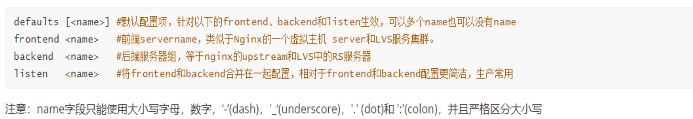


defaults就是默认配置，可以写明对哪些组name，生效为default配置。


## default配置

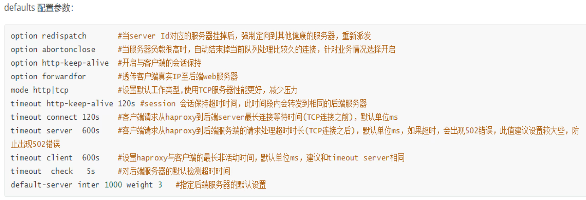

redispath比较重要的，但是判断服务器挂掉是否靠谱都带进一步研究。

abortonclose这个，服务其负载高了，断掉当前队列处理比较久的连接，这个比较久的判断又是啥？可能不是太靠谱的参数机制。

http-keep-alive，有人说是会话保持；应该不对，我理解：是长连接的意思，不是会话保持；长连接主要是为了节省tcp建连三次握手的开销。

同样连接建立在那，一直不用也有问题，于是就有了下面的timeout http-keep-alive 120s的老化时间。就是引入一个措施，必然也会带来一个新的问题，于是还要解决那个带来的问题才能差不多做好事情。这是宇宙法则；


forwardfor，保留客户端真实IP，这个提到保留一词，基本上就是因为proxy做了两头欺骗，就是两段TCP连接了，所以才有打上真实IP字段的说法。


mode http | tcp   ，指定默认是哪层代理。如果默认使用http，那么配置文件下文的具体的比如mysql的代理就要特别写上mode tcp来代理3306了。

​		比如安装后的haproxy的状态页👇的语句块里的mode http就可以删掉，因为可以用default里的7层代理。

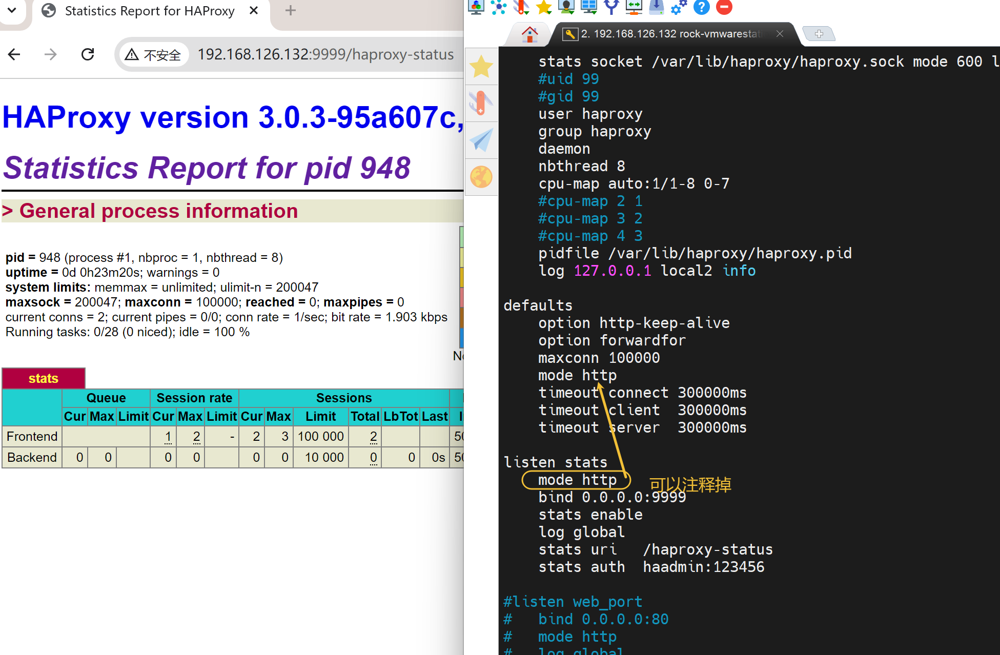


**timeout connect 120s**  客户端请求从haproxy到后端server最长tcp连接超时时间(**tcp连接之前的等待时间**)，默认单位ms

**timeout server 600s**  客户端请求从haproxy到后端server请求处理超时时长(**tcp连接之后的数据处理响应超时时间**)，如果超时会出现502错误，建议设置大点，防止502报错。默认单位ms

**timeout client 600s**  设置haproxy与客户端的最长非活动时间，建议与timeout server相同。默认单位ms。

**timeout check 5s** 检测后端服务器的超时时间。


**default-server inter 1000 weight 3**  看着像一个整体性的设置，1000ms一次的健康检查，语句块里的服务器们都是权重3。


查看帮助去官网就行

https://docs.haproxy.org/3.0/configuration.html#3


然后安装后倒是有一个man帮助，不过看要这么看

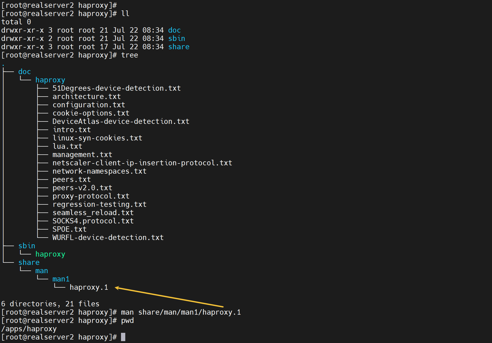


haproxy里的frontend就是nginx和http里的vip和端口；Backend就是Realserver后端服务器。

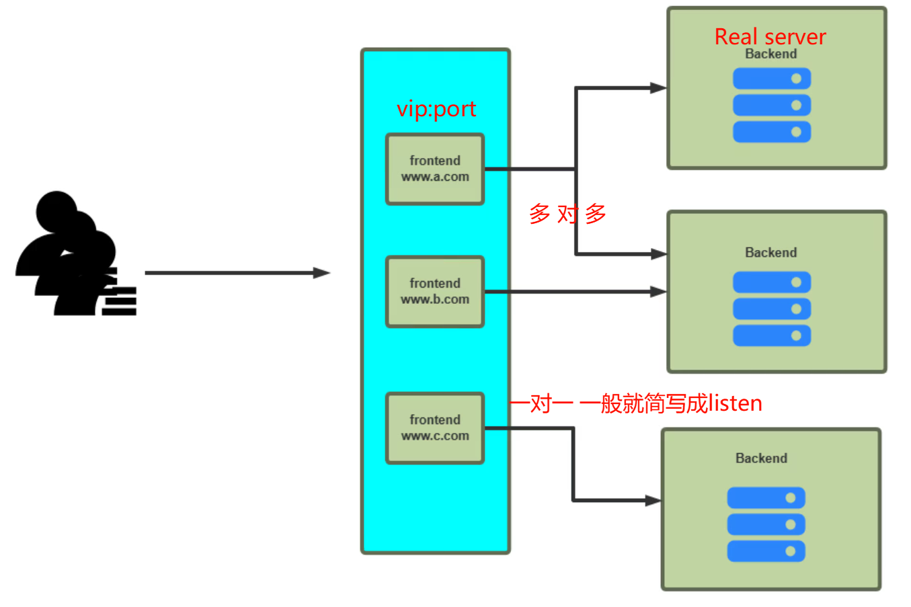

配置文件里2中写法

1、frontend和Backend分开来写，实现多对多的效果

2、如果一个前端就对应一个后端，那么就写成listen的格式也就是前后端写在一个语句块里。

https://docs.haproxy.org/3.0/configuration.html#4.1

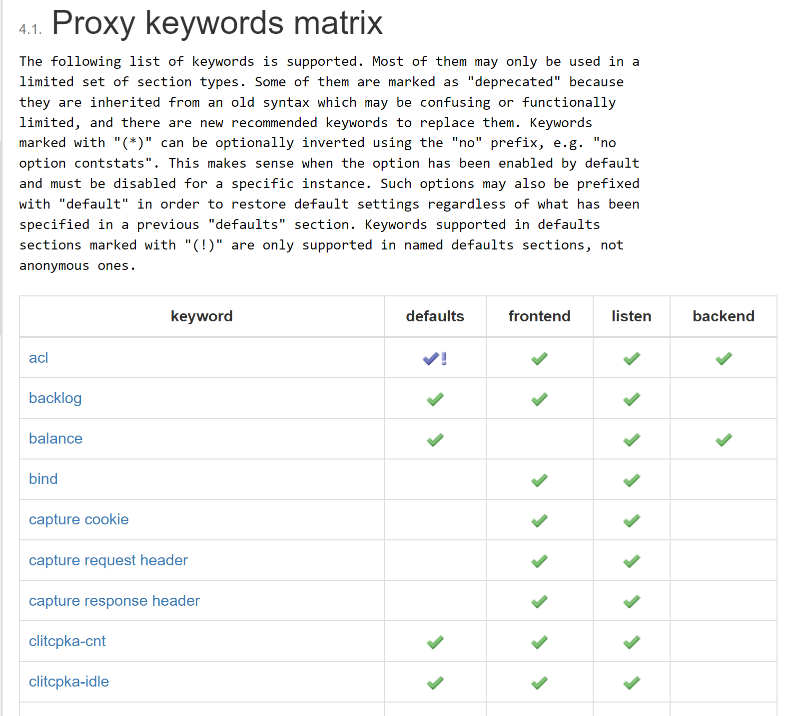

这就是一些指令只能放在一些地方👆。


# listen的写法，就是前端后端写一起

```bash
vim /etc/haproxy/haproxy.cfg
# 文末加上
listen www.ming.com
    bind 0.0.0.0:80
    server web1 192.168.126.133:80
    server web2 192.168.126.134:80
    
# 保存后reload
systemctl reload nginx
```

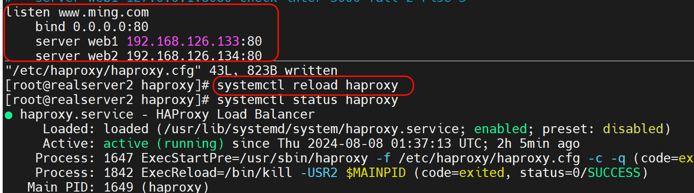

haproxy可以reload是因为当初写了service文件

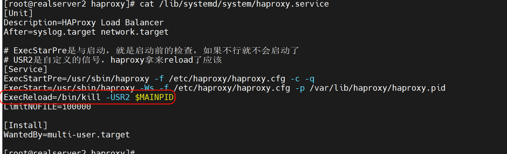

nginx也有reload的👇

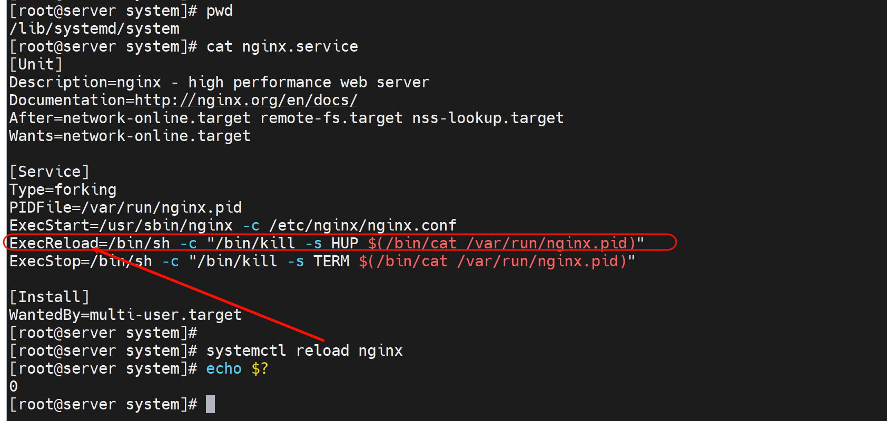


haproxy配置bind后就监听相应的端口了


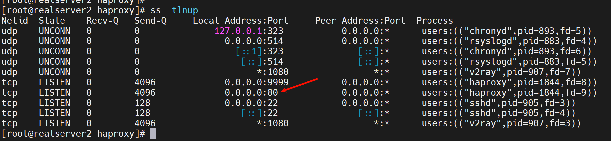

LVS那边是内核监听，ss -tlnup是看不到的；而haproxy是七层APP，监听的端口，ss 是可见的。


此时就可以测试了

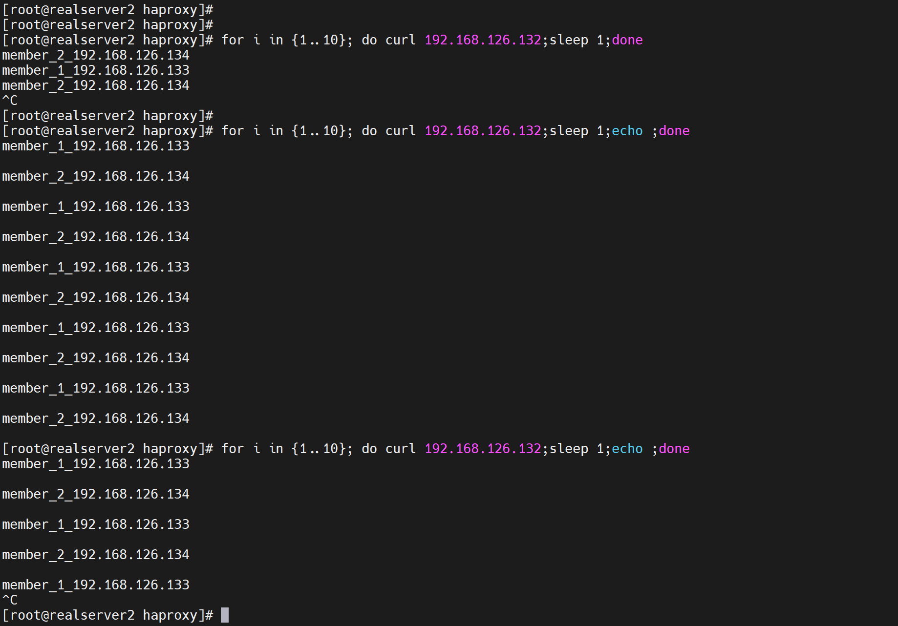

可见调度默认还是轮询的，1：1的。


然后观察后端日志也可以看到是两个tcp


然后ss -nt看看长连接，不过配合大文件+限速看最佳，还要注意ss -nt可见即使wget文件完成了，最终tcp断开要继续晚个20s左右的。

### wget的cli限速和nginx那头限速👇

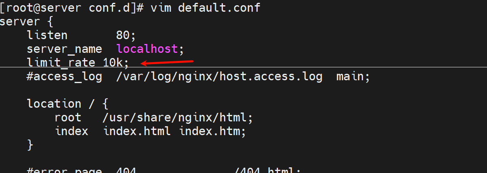


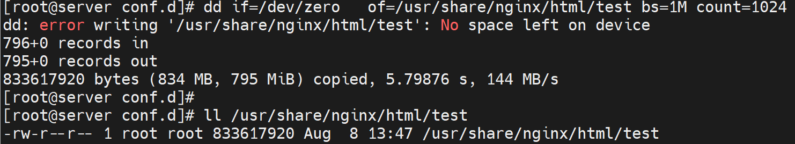


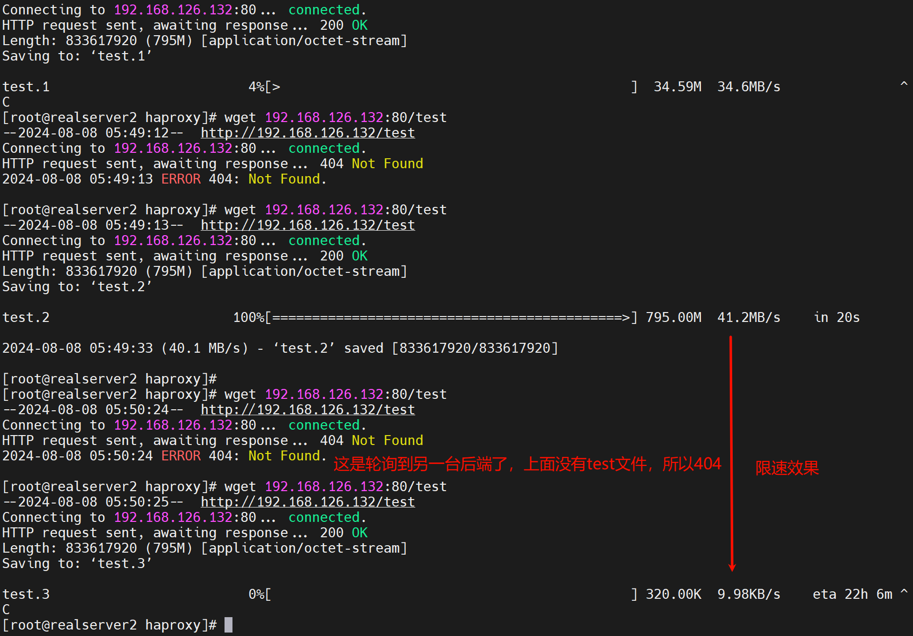

```bash
[roo@realserver2 haproxy]# wget --limit-rate=1k  192.168.126.132:80/test
```

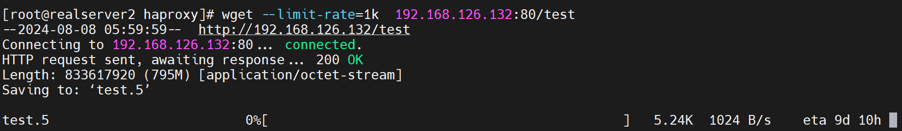


此时haproxy和后端服务器的长连接就一直都在的，**什么时候client下载完了，什么时候haproxy和后端的长连接就没了** 这点和nginx是不一样的。nginx是快速从后端拉下资源(应该是缓存在本地，不过这个缓存不是每次都能利用的，好像每次client发起都要来一遍，关于缓存参见nginx缓存章节38章第一节里有详细讲解)，然后慢慢的发给client的。

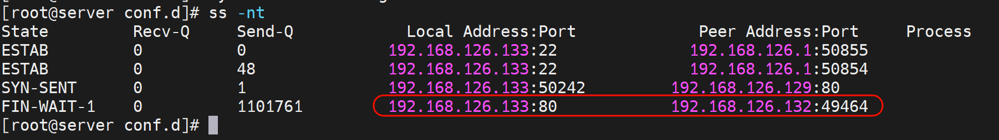


将haproxy改成nginx，同样下载测试

nginx的相关配置

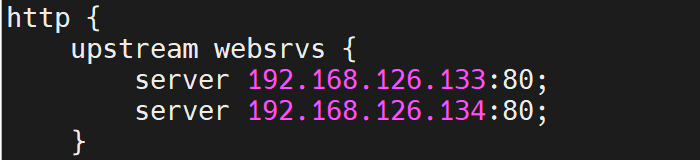

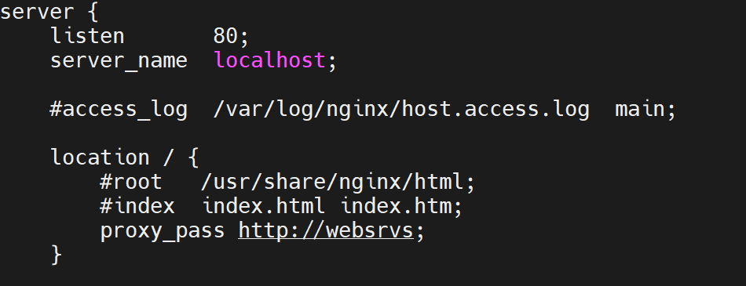


然后测试下

负载调度OK

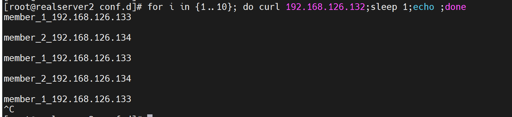

也是默认1：1

下载测试

1、client自己限速

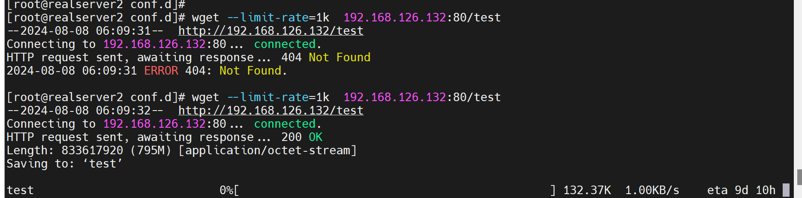

2、观察nginx和后端realserver的tcp，发现很快就没有tcp的连接了，然后client还在那慢慢下着。

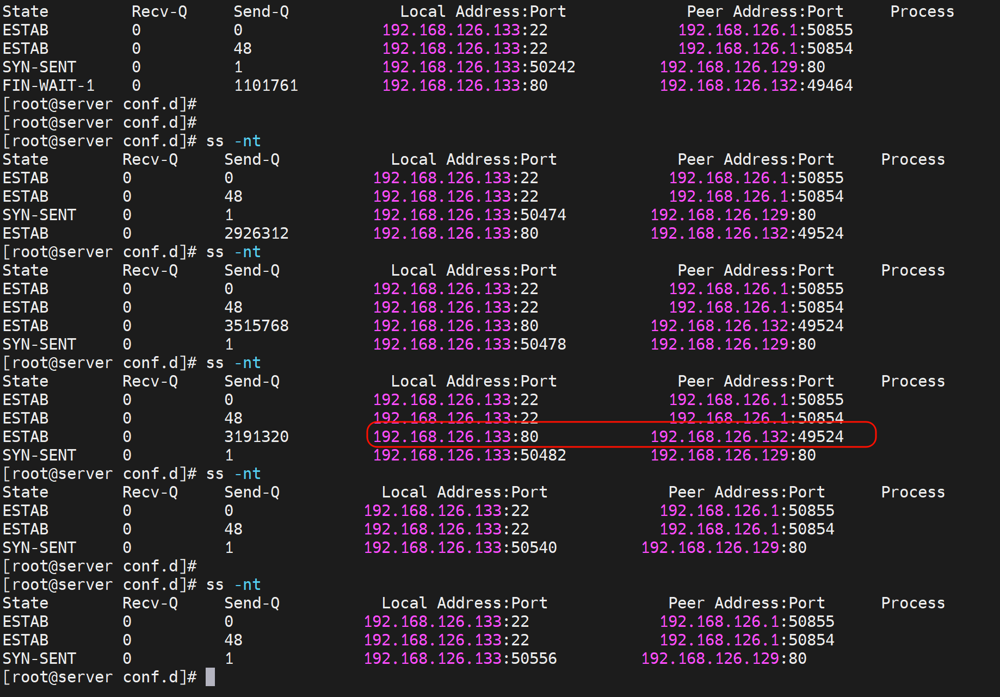

3、结论：

nginx和haproxy存在 下载缓存的区别

①client wget --limit-rate 限速下载

②如果是nginx，那么限速只发生在client---nginx代理之间，后端到nginx代理是飞速的也就是不限速的很快就下完了。

​		然后，如果是nginx 代理配置里做限速，是client---nginx-----realserver，nginx中间代理上做的限速，效果一样的，后端到nginx的资源下载都是飞速就下完了。

​		这是实测的结论：就是client----nginx----realserver,  client自己限速 或者 nginx配置server块里配置了limit_rate来限速，都是限制的client到nginx之间的速度，而nginx从realserver上的资源是不限速的；

​		然后nginx有缓存功能吗？默认是没有的，需要配置参见38章第一节内容，client再次发起下载，同样nginx代理要往后端再次重新请求资源的，时间都是一样的。

③如果是haproxy，client---haproxy----后端服务器，client 限速请求资源，haproxy和后端的资源请求一样是慢慢下载的，不会先飞速下载来然后慢慢发给client，这点和nginx不一样。

④所以表现形式就是，nginx代理，你client发送一个请求，然后在后端上看tcp连接，可能就看不到了，因为很快就完成了nginx和后端服务器的交互了。而haproxy是一直可以在后端服务上看到tcp连接的，因为什么时候client下完，什么时候haproxy和后端服务器的tcp连接什么时候才会断开。


**ubuntu加网卡，激活操作**

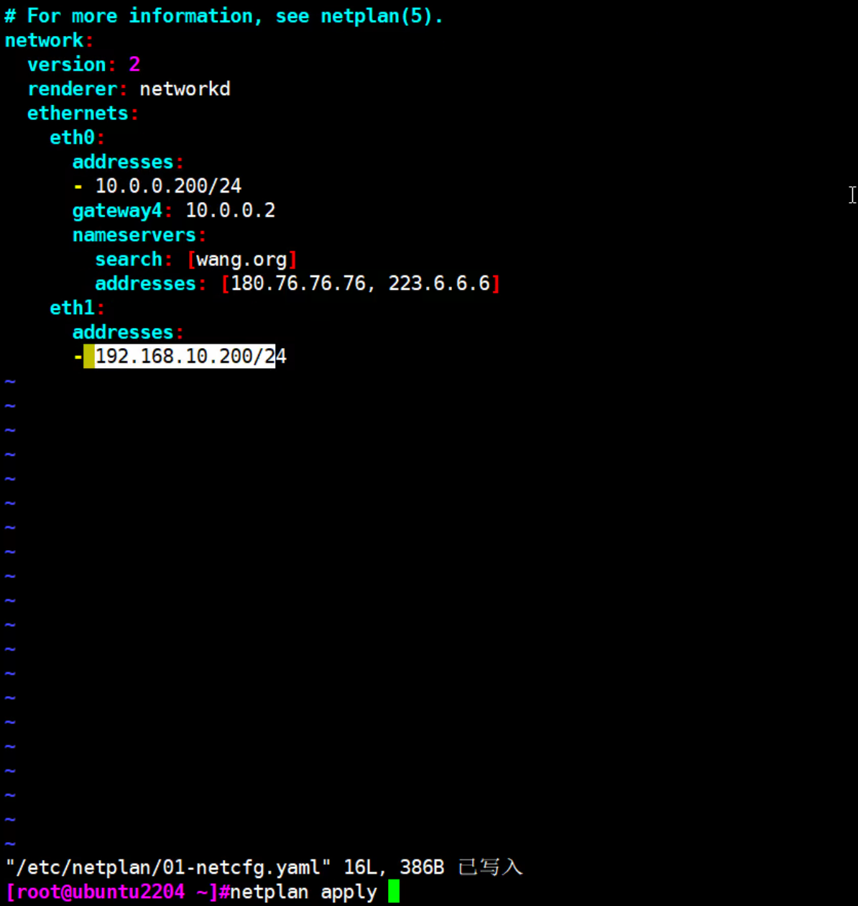 


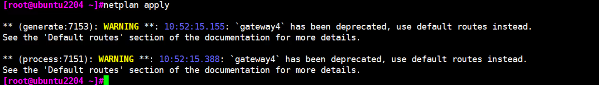


```bash
[root@realserver2 docker]# haproxy -c -f /etc/haproxy/haproxy.cfg
```


# frontend和backend分开来写


业务复杂，多对多就需要用frontend和backend，简单一对一就用上面的listen配置块就行了


```bash
frontend www.ming.com
    bind 192.168.126.132:80
    use_backend web_servers

backend web_servers
    server web1 192.168.126.133:80
    server web2 192.168.126.134:80

```


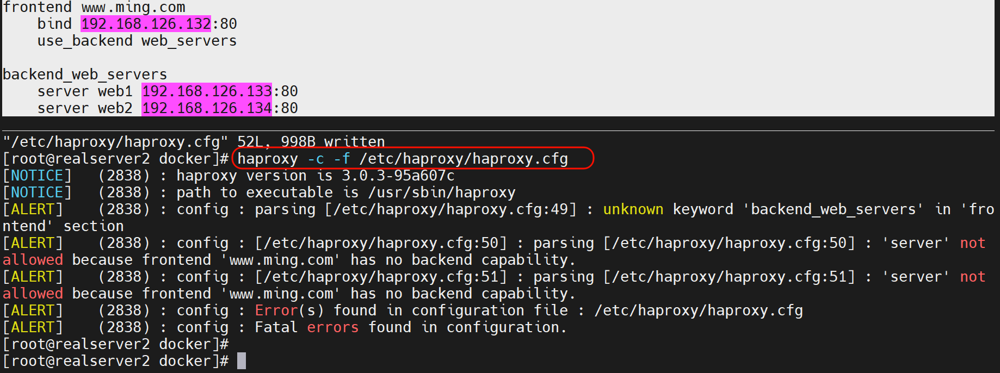

报错修改👇

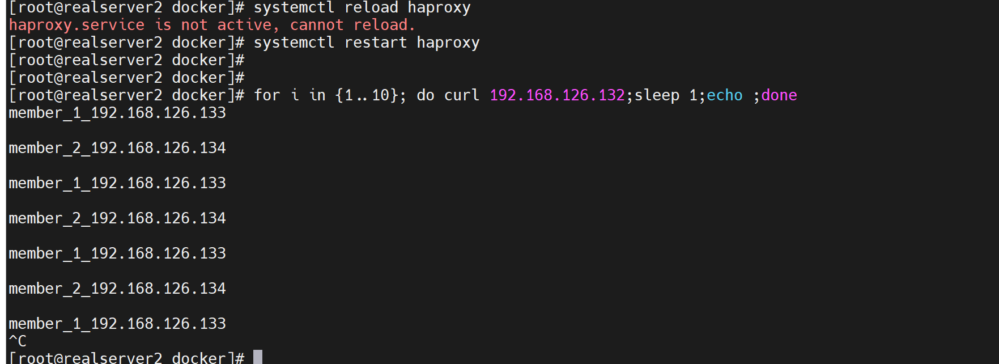


