# 3.Haproxy代理的健康性检查和子配置等基础配置.md


# haproxy的健康检查

如果不做健康检查，调度还是会往down掉的后端调度

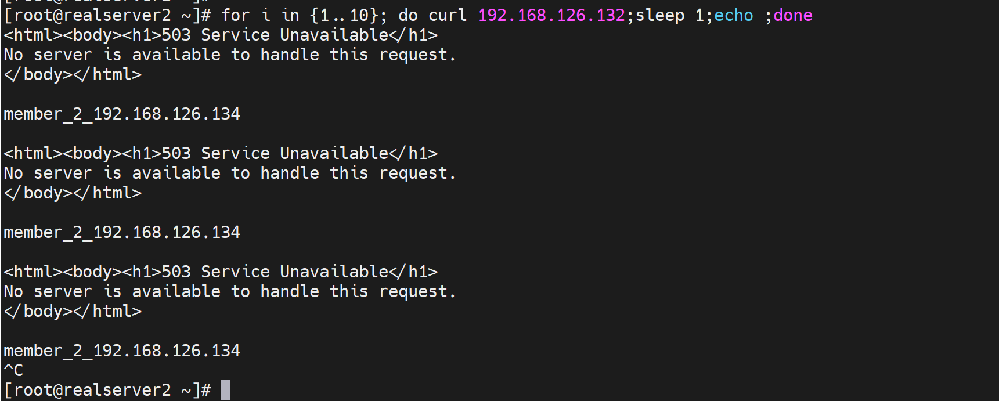

502 网关不能访问

504超时

503服务挂了


```bash
backend web_servers
    server web1 192.168.126.133:80 check
    server web2 192.168.126.134:80 check
```


 

重新加载配置，此时就会调度到down掉的后端server上了


于此同时，我打开了所有后端的check，所以页面上可以看到一些检查状况

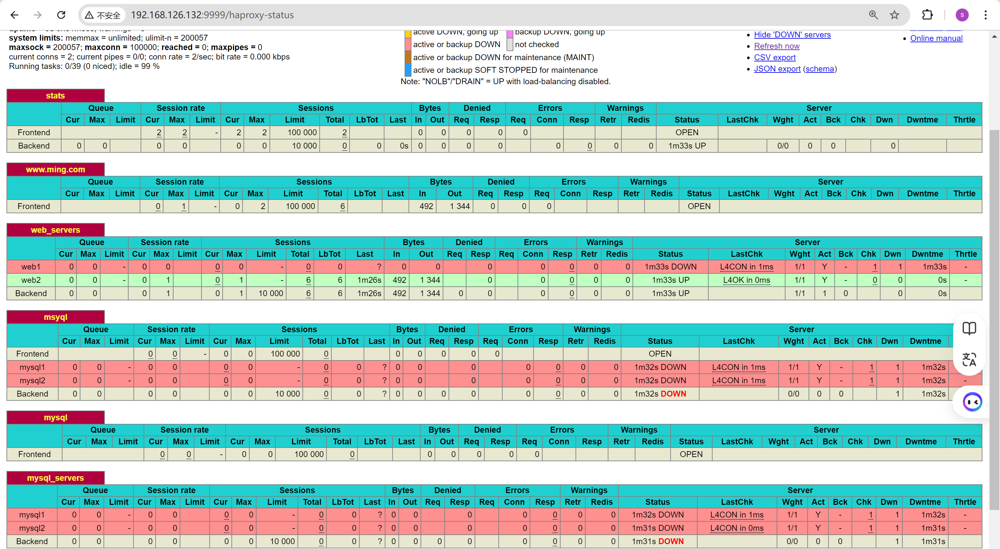


通过打开后端的对应服务，就可以修复啦

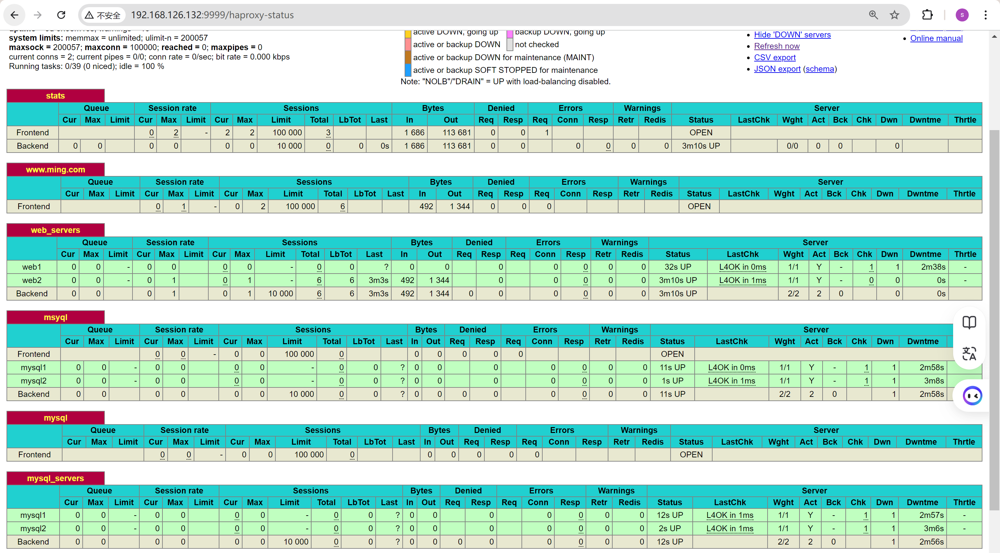


不过由于这些都是4层检查，所以很容易就被欺骗


比如关闭nginx服务，用nc -l 80打开监听80，此时haproxy的健康检查依然判断为正常状态。


## 默认check的周期是

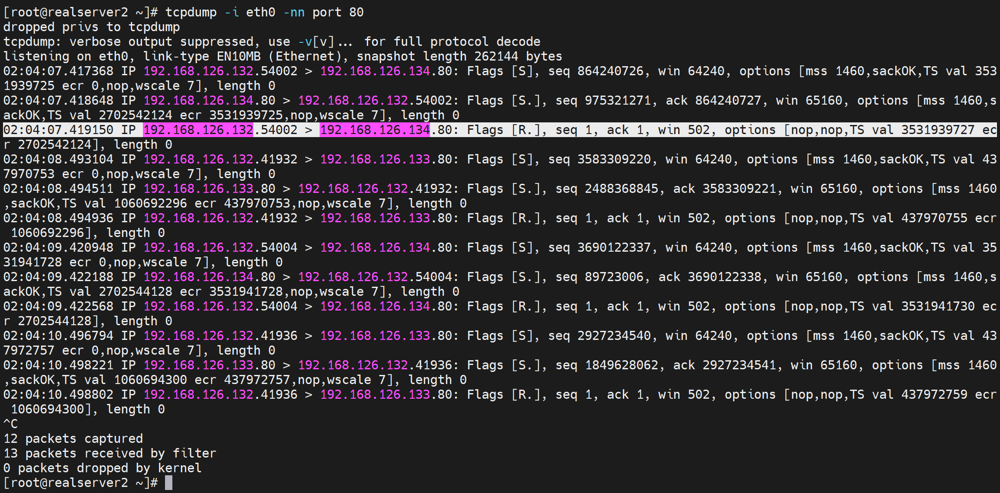

默认检查周期是2s一次

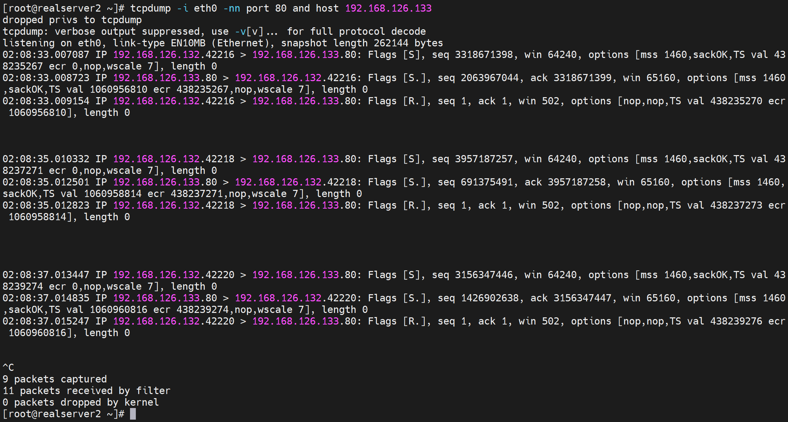


```bash
backend web_servers
    server web1 192.168.126.133:80 check inter 5000
    server web2 192.168.126.134:80 check inter 5000

```

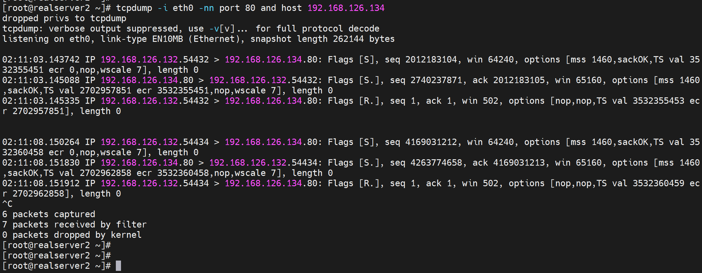


```bash
backend web_servers
    server web1 192.168.126.133:80 check inter 5000 fail 5 rise 5
    server web2 192.168.126.134:80 check inter 5000 fail 5 rise 5
# 这TM就要25s才能判定出来故障，就灰常不好的参数配置了
# rise 5 次 inter 5000ms，也就是 25s才判定起立，这也不好，优化为
backend web_servers
    server web1 192.168.126.133:80 check inter 1000 fail 2 rise 10
    server web2 192.168.126.134:80 check inter 1000 fail 2 rise 10
#1秒一次检查
#2秒钟故障可切换到好的服务
#10次检查ok才判定故障服务节点恢复了，这个要花20s了。
```

### 加上权重

```bash
backend web_servers
    server web1 192.168.126.133:80 check inter 1000 fall 2 rise 10 weight 3
    server web2 192.168.126.134:80 check inter 1000 fall 2 rise 10

```

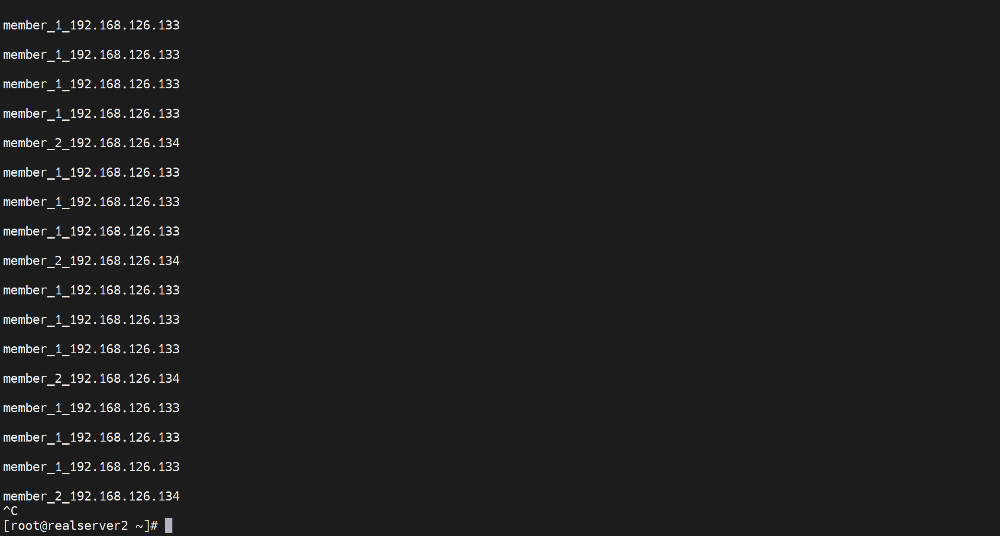

页面上显示，3:1的权重显示效果如下👇


### backup备用

就是所有后端server都挂了，就让backup标识的机器上线


这里就让haproxy自己作为一个backup备用nginx服务，以备不测

注意：由于haproxy占用了80，所以自己做backup站点的nginx服务就改成8080好了。


这个backup的使用场景是啥呢，可以是道歉服务器，就是正常业务都挂了，这个页面就写上sorry xxxx

```bash
backend web_servers
    server web1 192.168.126.133:80 check inter 1000 fall 2 rise 10 weight 3
    server web2 192.168.126.134:80 check inter 1000 fall 2 rise 10
    server web_backup 127.0.0.1:8080 check backup
```

测试，当后端server都挂了后，sorry server(也就是backup server)就出来啦

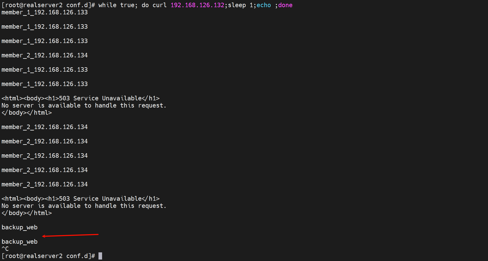


### disable禁用后端服务

```bash
backend web_servers
    server web1 192.168.126.133:80 check inter 1000 fall 2 rise 10
    server web2 192.168.126.134:80 check inter 1000 fall 2 rise 10 disabled
    server web_backup 127.0.0.1:8080 check
```

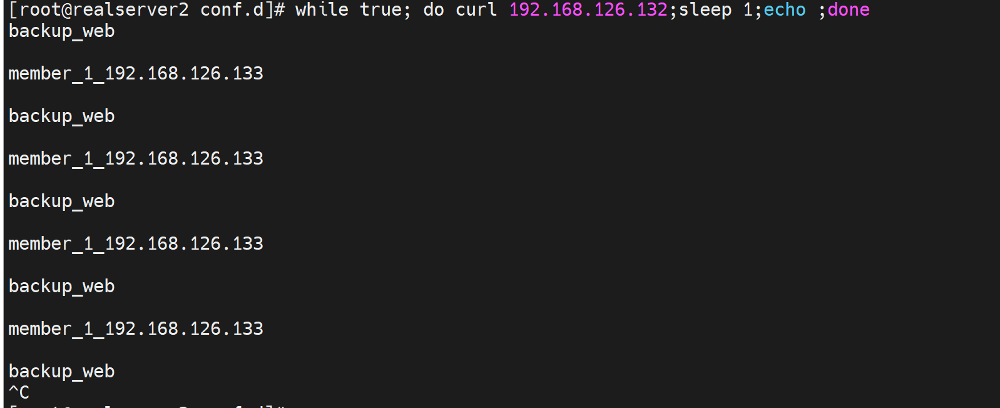

这样第二台后端节点就不会被调度了


## maxconn并发的数值

### 全局数值


只找到一个10000并发的，看来这是针对的frontend前端的设置。后端的1000没找到，估计是默认值，是前端➗10的关系。


注释掉后，就看到默认值了是一个奇怪的49973，然后后端并发自动变化4998，好像是10:1的关系。

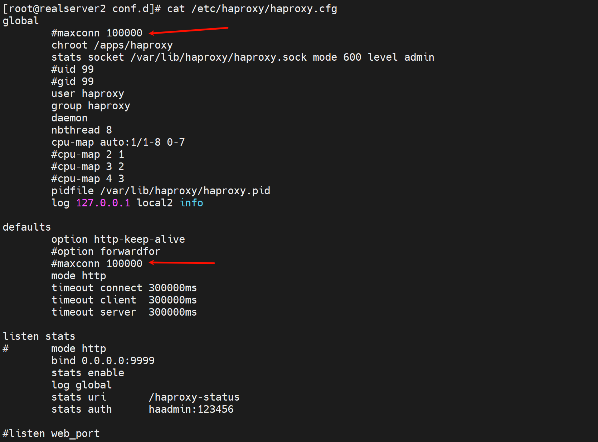


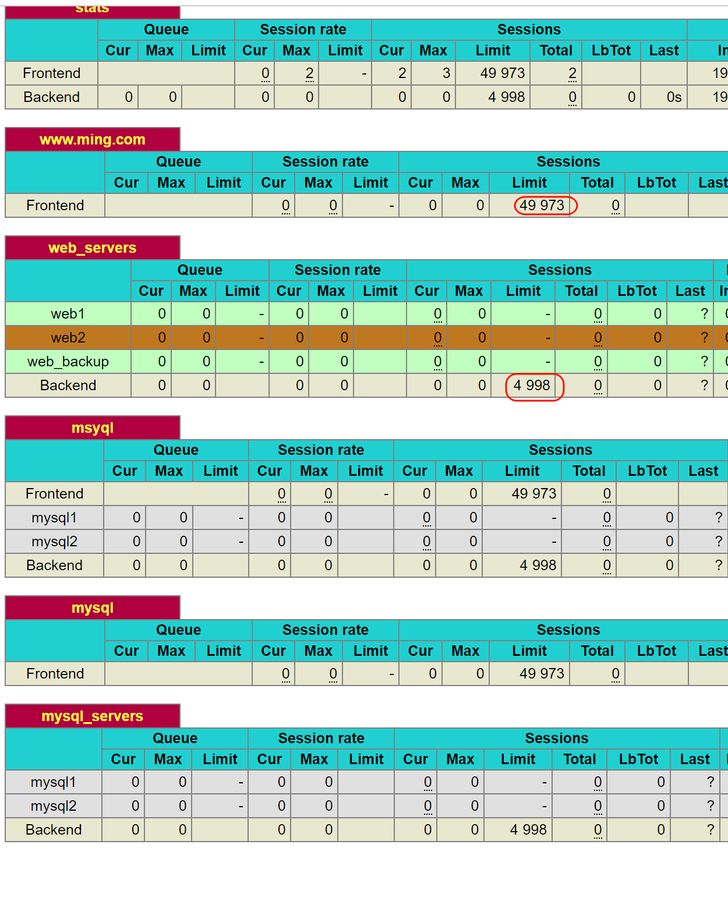

### 单台数值


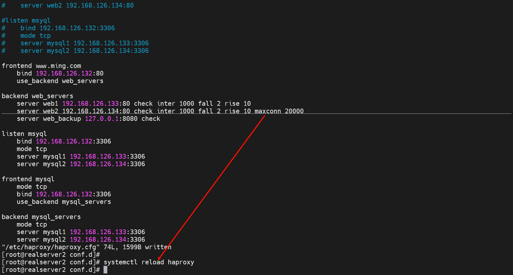


## 重定向redir


```bash
backend web_servers
    server web1 192.168.126.133:80 check inter 1000 fall 2 rise 10
    server web2 192.168.126.134:80 check inter 1000 fall 2 rise 10 maxconn 20000 redir http://www.bing.com
    server web_backup 127.0.0.1:8080 check

```


当调度到第二台的时候就会redirect bing.com了


上面是单个的，下面全局的

```bash
backend web_servers
    redirect prefix http://www.bing.com
    server web1 192.168.126.133:80 check inter 1000 fall 2 rise 10
    server web2 192.168.126.134:80 check inter 1000 fall 2 rise 10 maxconn 20000
    server web_backup 127.0.0.1:8080 check

```

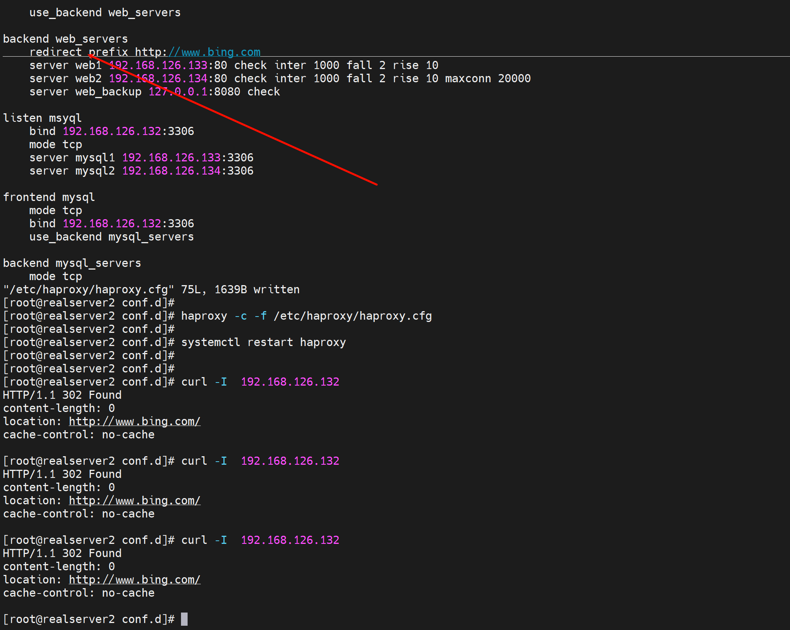

这样全部后端节点都被重定向了。


https也是可以的

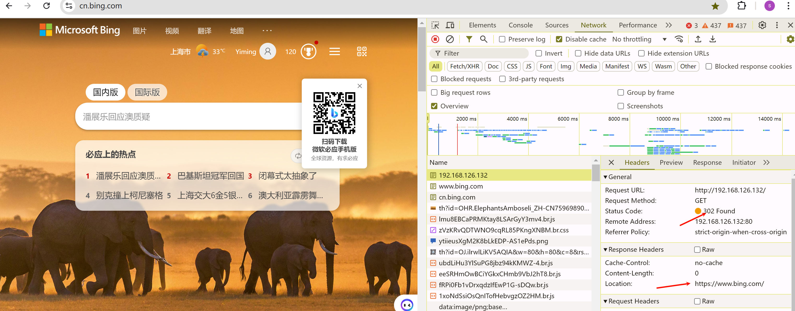


## 网站配置放到子文件里去

一个维护思路，就是 主配置文件放一些全局的配置就行了；站点配置放到独立的子配置文件，一个站点放一个。


然后主配置文件里删掉frontend、backend、listen的站点，当然除了初始的listen stats可以留着。

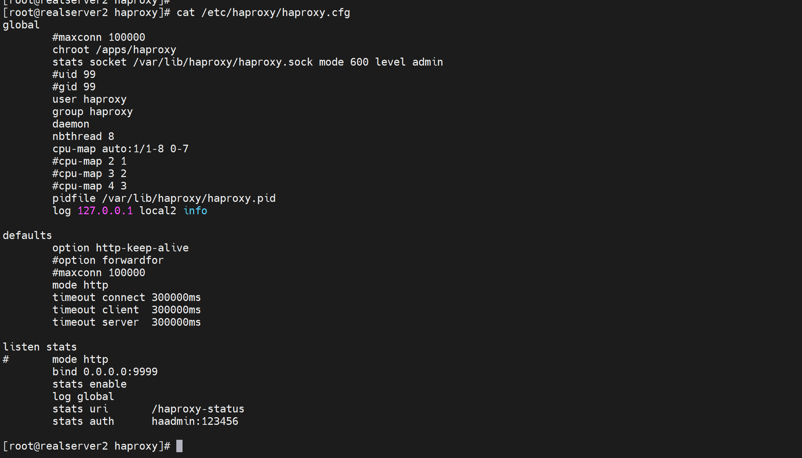


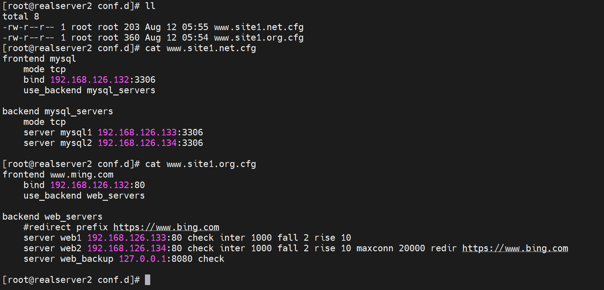

然后要让haproxy识别到自己定义的conf.d这个子配置文件夹，CLI里有类似的方法👇


不过我希望能有像nginx那样的include xxx/xx/xx/就好了。

还是按haproxy自带的来吧，在service文件里加上-f /etc/haproxy/conf.d/这个文件夹路径


然后

[root@realserver2 conf.d]# systemctl daemon-reload
[root@realserver2 conf.d]# systemctl restart haproxy


### 关于配置文件后缀只能用cfg


观察状态页发现msyql前后端没了

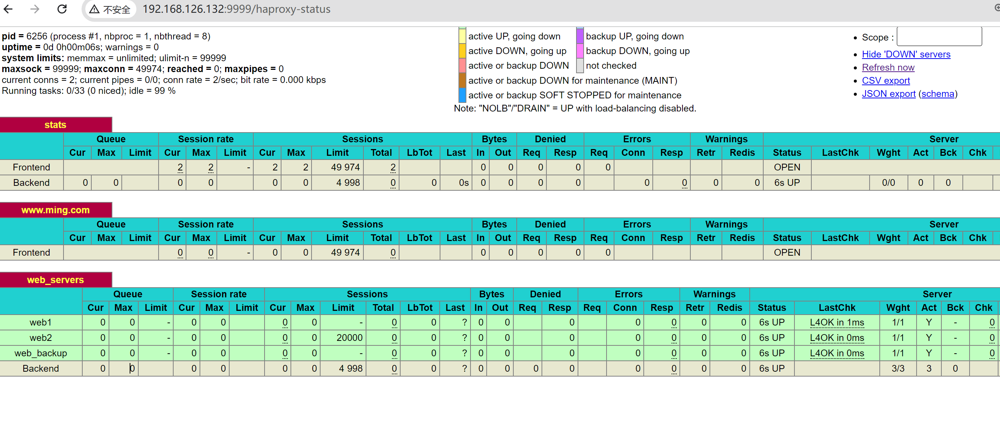

改回去就恢复了


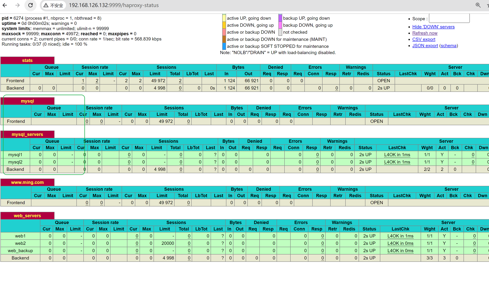


