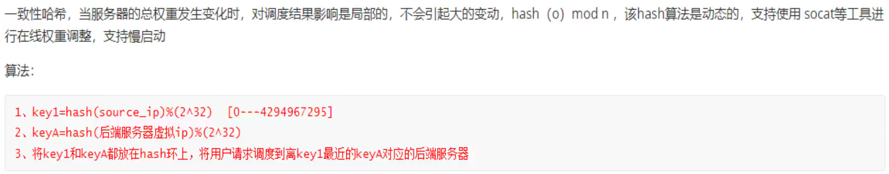

# 5.Haproxy动态其它调度算法和状态页.md

# 动态算法

### roundbin算法

默认的调度算法

### leastconn算法

类似LVS的WLC算法

### random算法

# 其他算法：

# source算法

### source : map-base取模法

这是source下的默认的算法(也就是配置了balance source，hash-type不配置也是map-based了)，反而不好

不能修改权重的，所以不能通过sockt修改👆，而下面的一致性哈希算法 是动态的，就可以修改weight值。

图中A就是源IP地址👆

​		但是随着后端服务器的增减，权重就会增减，会导致map-base取模的结果就不一样了，比如 上图 两台后端服务的权重是1和2，当前调度是hash(SRC_IP) 对3  取模，也就是0 1 2 三个结果，0就调度到后端服务器1，1 2 就调度到后端服务器2上去，如果新增一台服务器且权重是2，那么就是对5取模，结果就是 原来hash(SRC_IP) 对3 取模的结果比如是0，现在可能不再是0可能是3 那么对其调度就变了，而且此时整体调度都会发送变化，会话保持就保持不住了。 

​		这里可以联系nginx的一致性哈希算法调度，是一回事。不管是分布式站点的调度，还是缓存穿透的防止都是一回事，都是用$request_rui consistent来解决的。

](5.Haproxy动态其它调度算法和状态页.assets/image-20240827104555260.png)

### source :  一致性哈希

这是动态算法，就可以通过sockt修改权重了👇

### 测试source 一致性哈希算法调度

开始源ip不同，没有测出来还

再换别的IP来测

然后就出来了👇--不同的IP不一定调度到不同的服务器上，但是很多不同的IP一定可以得到效果，源IP 经过hash后再对 后端服务器的权重之后 取模，然后再调度，大概要了解成这样吧。

# uri算法

只支持HTTP协议，不支持TCP，想来也是uri就是http报文里的内容了。TCP协议通常就是TCP头部去掉看TCP的DATA自然是看不到uri也就是链接文件目录的。

同样对于uri一样有一致性哈希算法调度。

就是uri访问的固定，就会调度到那一台服务器，也就和source 一致性哈希算法调赴 一样实现了 会话保持，或者叫缓存利用，或者叫防止缓存穿透，或者叫分布式站点的会话保持。

### uri取模算法配置

### uri一致性hash算法配置

### 测试uri一致性哈希算法调度

然后换一个uri 去curl

这就实现了不同uri，调度的效果，当然同src调度一样，不同的uri不一定就调度到不同的后端节点，但是大量的不同的uri一定会调度开来的。底层逻辑就是个2^32的环👇

再测试下

两个后端节点做10个页面出来

调度就是基于uri的了，

大家都是一样，只有第一个uri调度到134上，因为都是基于uri了，不管什么源IP都一样了。

也奇怪的，不过随意了

不对，uri要改成mode http来着，我没改！改之

没关系，我有default就是mode http，所以上面实验没有体现，但是实际也是http的，在主配置文件里设置了

正好去掉这个mode观察下

此时调度虽然写的是

但是由于uri必须是mode http，所以不会生效，就又变成了默认的roundbin算法了👇

# url_param算法

uri里一般是一个xxx.php后面跟一个问好?key=value就好比sql语句里的where key=value查询一样

同理uri的东西肯定是要mode http的

### url_param取模算法配置

这个userid就是uri里的key=value的那个key

如果key的值也就是value一样，那么调度到同一台机器，如果key的值不一样，那么调度到别的机器--当然可能还是同一台，但是key的量起来就能分开来了。底层还是hash(value)取模权重。

### url_param一致性hash算法配置

上图userid就是key，不过可以是其他的key咯，总之你页面里？问号 问的是谁就写谁了。

实验要写php去查DB，所以不弄了，大概意思就是

测一下

不对，mode http没加

再测

改变username=测试效果，多改几次就出效果了，无非是hash和权重的鬼👇可能不同的uri_param也调度到一台机器的。

不过要具体做出?username=xxx的sql查询效果，就要做php和db库了吧，这就不折腾了。

# hdr算法

复习下head头里的东西，curl 和 F12都可以看到

# rdp-cookie算法

