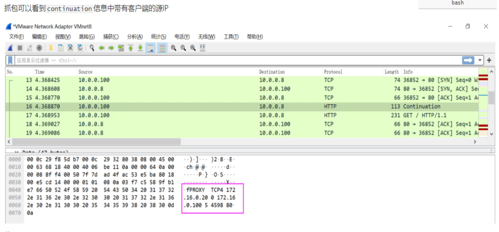
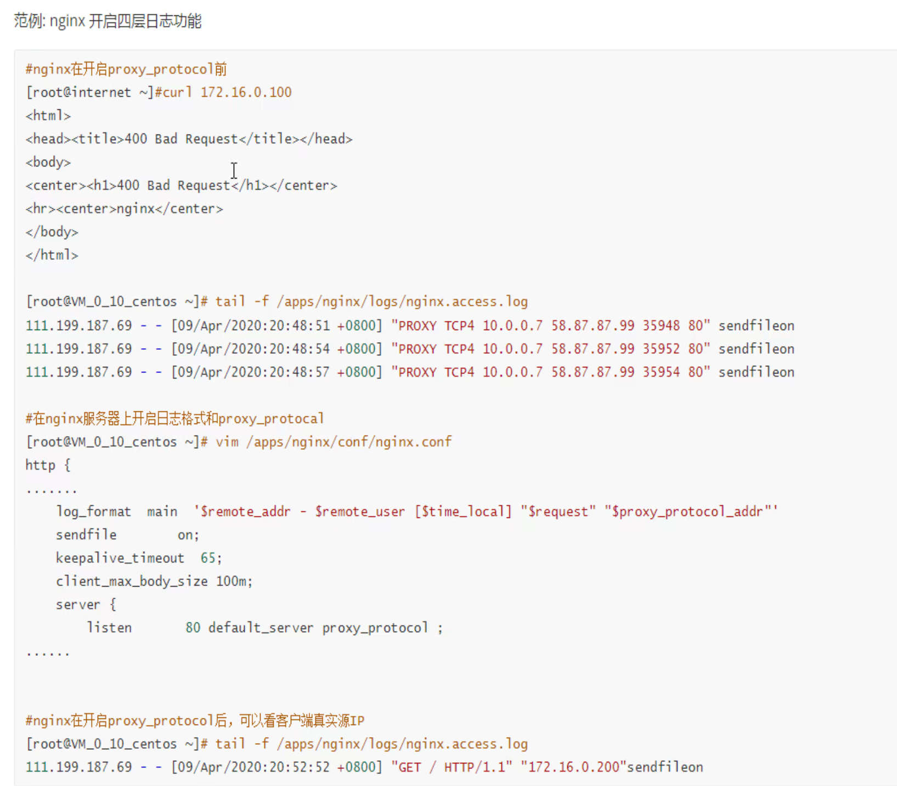

# 6.Haproxy常见功能压缩报文修改健康性检查


# haproxy如何携带用户信息

正常后端服务器看到的IP都是haproxy的IP地址

client IP就是192.168.126.133👇


后端server看到的就是haproxy中过来的IP地址👇


**haproxy透传**


1、option forwardfor 实现7层透传


一般写到主配置文件的里默认值语块就行了


请求


可见x-forward-for


后端nginx需要修改log格式才能看到这个参数


log_format的格式有个规律：就是比如，要抓取抓包里看到的x-forwarded-for字段，写到log里就要

1、http头部标识$http，

2、然后-换成_下划线，

3、全部小写


此时后端就可以看到真实的用户IP了👇


四层透传

```bash
#haproxy配置：
listen web_http_nodes
	bind 192.168.126.132:80
	mode tcp
	balance roundrobin
    server web1 www.testtttt.com:80 send-proxy check inter 1000 fall 2 rise 10  # 比常规的转发cli多一个send-proxy,会造成大量PROXY TCP4 a.b.c.d a.b.c.d xxxxx 报文
    
#nginx配置：在访问日志中通过变量$proxy_protocol_addr 记录透传过来的客户端IP
http {
	log_format main '$remote_addr - $remote_user [$time_local] "$request" "$proxy_protocol_addr"'
	server {
		listen 80 proxy_protocol;  # 启动此项，将无法直接访问此网站，只能通过四层代理访问
		server_name www.testtttt.com;
	}
}
```


实操过程处理截图，含故障注意点：就是send-proxy要么server xxx 都配置上，要么都不配，否则会导致send-proxy配置的那个后端请求失败

比如错误案例

haproxy的配置👇


对应的后端126.134的nginx的配置👇


不过好像无法复现了，现在上面配置也不会报错了








