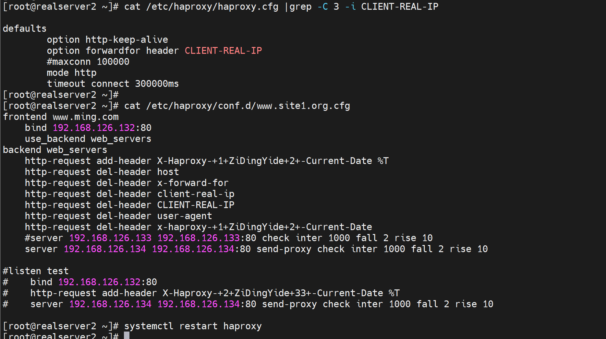

# 6.Haproxy常见功能压缩报文修改健康性检查


# haproxy如何携带用户信息

正常后端服务器看到的IP都是haproxy的IP地址

client IP就是192.168.126.133👇


后端server看到的就是haproxy中过来的IP地址👇


## **haproxy透传** 


**1、option forwardfor 实现7层透传**


一般写到主配置文件的里默认值语块就行了


请求


可见x-forward-for


后端nginx需要修改log格式才能看到这个参数


log_format的格式有个规律：就是比如，要抓取抓包里看到的x-forwarded-for字段，写到log里就要

1、http头部标识$http，

2、然后-换成_下划线，

3、全部小写


此时后端就可以看到真实的用户IP了👇


总结


需要注意的是，header 大小写，还有减号-，在后端nginx日志里都转成 小写，和下划线。


后端nginx日志里转小写和下划线👇


总结，补充：


**2、四层透传-不推荐的方式，其实是mode tcp而不是lvs那种四层透传**

```bash
#haproxy配置：
listen web_http_nodes
	bind 192.168.126.132:80
	mode tcp
	balance roundrobin
    server web1 www.testtttt.com:80 send-proxy check inter 1000 fall 2 rise 10  # 比常规的转发cli多一个send-proxy,会造成大量PROXY TCP4 a.b.c.d a.b.c.d xxxxx 报文 
    

--------------------------------------------

#后端服务器的nginx配置：在访问日志中通过变量$proxy_protocol_addr 记录透传过来的客户端IP
http {
	log_format main '$remote_addr - $remote_user [$time_local] "$request" "$proxy_protocol_addr"'
	server {
		listen 80 proxy_protocol;  # 启动此项，将无法直接访问此网站，只能通过四层代理访问
		server_name www.testtttt.com;
	}
}
```


实操过程处理截图，含故障注意点：

​		就是send-proxy的配置，要么server xxx 都配置上，要么都不配，否则会导致send-proxy配置的那个后端请求失败，可能是初始实验理解不到位，其实就是后端nginx没有配置proxy_protocol。继续往下看就行了。不要太纠结。纠结的话，实验敲一下就行了。

比如错误案例

haproxy的配置👇


对应的后端126.134的nginx的配置👇


不过好像无法复现了，现在上面配置也不会报错了，

可以复现，就是上图的listen 80后的proxy_protocol去掉，就能看到了(看到这些大量的haproxy 发过来的PROXY TCP4)，不仅如此，而且此时如果观察log可见，其实也已经可以携带了client IP了。👇只不过，就是页面还不正常。


同样抓包可见，需要知道的是上图除了192.168.126.1高亮的那一行是HTTP包👇，其他的都是TCP包--这些192.168.126.132频繁发给192.168.126.134的包是没有像下图一样携带什么IP信息来着。


比较好奇的是continuation关键字


然后，再在后端nginx服务，加了proxy_protocol后就不能直接访问了


只能通过proxy进行访问了，此时页面正常，但是log里就看不到这个真实的IP了，以及的频繁的PROXY TCP4 也看不到了--但是这个频繁的报文只是看不到，其实抓包可见还是一直再发送的

但是log和抓包都看不到continuation这个报文，以及真实的客户端IP也看不到了，不过只需要再来一步

就是log日志里写上$proxy_protocol变量就行了


此时log里有了


抓包依旧没有，抓包看来就是后端nginx配置正确了，抓包反而看不到了，哈哈，应该是有的，否则log里不可能看到。果然，抓包工具显示问题，再敲一下回车就出来了


但这种方式其实也是2个TCP，haproxy越是说做4层透传，LVS才是。


也可以两个方式都用上，就是mode tcp及支持x-forward-for，也支持proxy_protocol_addr


然后去后端nginx配置


看看log就两种携带真实客户IP的方式都生效了


# 报文修改


## 理论

代理可以修改的报文一般就是自己发出去的报文，也就是②和④两个包


http-request就是②的改包

http-response就是④的改包


**老版本了解下就行：**


## 实验


1、先看未修改之前的head


👆大段大段每秒一个的都是健康检测的，而拼手速抓到的就是192.168.126.1 去curl出来的包，这个包是可以看到当前的header有哪些，其中client-real-ip是自定义的x-forward-for👇


命令参数配置位置说明：


PS：√! 和 √的区别，就是能用但是有限制，需要点进去看详情的意思。然后就点进去瞧一瞧


这段话就不太好看懂，拆分开来意思大概如下：

1、default默认的就是不带名字的，就是http-request这个指令不能配置在匿名的default下

这就是匿名的👇defaults


而这是命名的default，既然是命名的就需要调用的

1、命名方法，和调用方法


2、所以http-request，如果配置在defaults里，是要用命名的defaults的，

3、而命名的defaults xxx，如何被listen，以及frontend和backend调用

就是用这种方式，或者写在前后端或listen语句块前面就行


4、但是这个http-request写到default xxx里，是不能同时被frontend和backend调用的，也就是不能被listen调用。

5、但是http-requst却可以直接写到listen里，好奇怪....不研究了


实验，实验

## 给后端转发的时候添加header字段

### 写到frontend里


此时后端抓包就能看见了👇


### 写到backend里


同样生效


### 写到listen里


生效的


## 给后端转发的时候修改header字段

删除hosts信息，一样不影响转发和用户请求。


## 给后端转发的时候删除header字段


除了真实的用户IP地址信息，其他确实可以删除


不过删的太多会报错


**写到backend里去看看x-forward-for能否被删除**

还是不能删除x-forward-for




不过此时用户以及curl报错了


说明x-forward-for是送出去的时候打上真实用户IP的动作实在http-request之后的。正要想删这个字段，就别打上就行了，本来默认就不携带，哈哈。


## 给用户回包的时候增删改字段


比如正常的响应头里会暴露真实的web服务器的信息，如上图的server:nginx/1.26.1

隐藏掉


