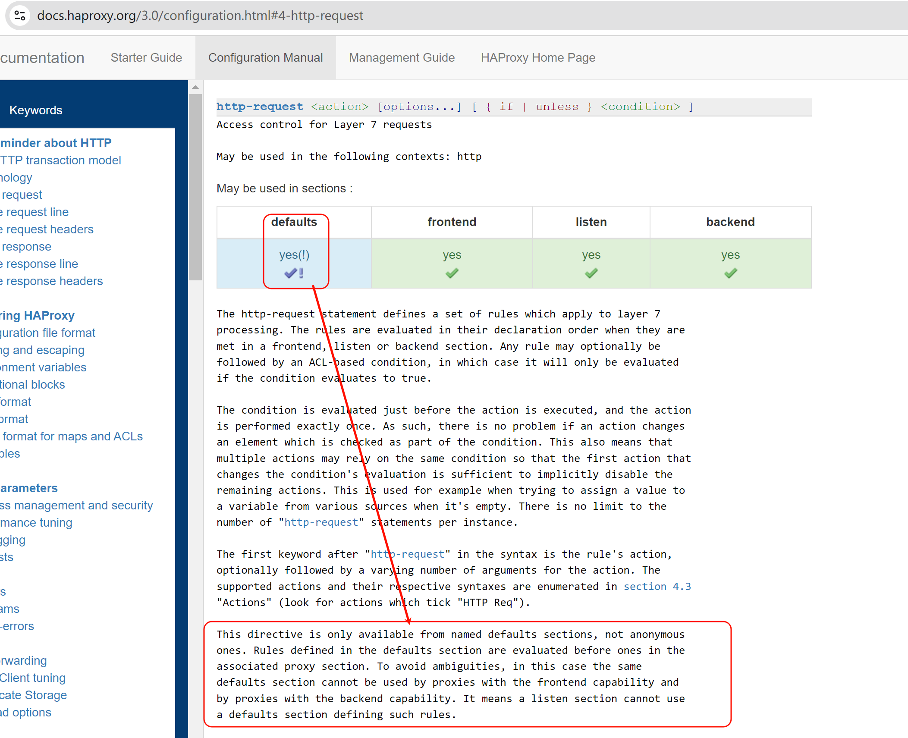
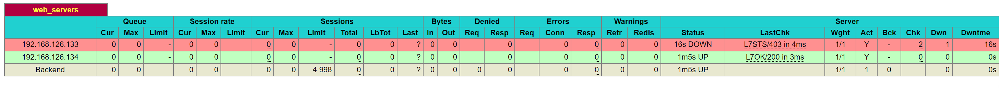

# 6.Haproxy常见功能压缩报文修改健康性检查


# haproxy如何携带用户信息

正常后端服务器看到的IP都是haproxy的IP地址

client IP就是192.168.126.133👇


后端server看到的就是haproxy中过来的IP地址👇


## **haproxy透传** 


**1、option forwardfor 实现7层透传**


一般写到主配置文件的里默认值语块就行了


请求


可见x-forward-for


后端nginx需要修改log格式才能看到这个参数


log_format的格式有个规律：就是比如，要抓取抓包里看到的x-forwarded-for字段，写到log里就要

1、http头部标识$http，

2、然后-换成_下划线，

3、全部小写


此时后端就可以看到真实的用户IP了👇


总结


需要注意的是，header 大小写，还有减号-，在后端nginx日志里都转成 小写，和下划线。


后端nginx日志里转小写和下划线👇


总结，补充：


**2、四层透传-不推荐的方式，其实是mode tcp而不是lvs那种四层透传**

```bash
#haproxy配置：
listen web_http_nodes
	bind 192.168.126.132:80
	mode tcp
	balance roundrobin
    server web1 www.testtttt.com:80 send-proxy check inter 1000 fall 2 rise 10  # 比常规的转发cli多一个send-proxy,会造成大量PROXY TCP4 a.b.c.d a.b.c.d xxxxx 报文 
    

--------------------------------------------

#后端服务器的nginx配置：在访问日志中通过变量$proxy_protocol_addr 记录透传过来的客户端IP
http {
	log_format main '$remote_addr - $remote_user [$time_local] "$request" "$proxy_protocol_addr"'
	server {
		listen 80 proxy_protocol;  # 启动此项，将无法直接访问此网站，只能通过四层代理访问
		server_name www.testtttt.com;
	}
}
```


实操过程处理截图，含故障注意点：

​		就是send-proxy的配置，要么server xxx 都配置上，要么都不配，否则会导致send-proxy配置的那个后端请求失败，可能是初始实验理解不到位，其实就是后端nginx没有配置proxy_protocol。继续往下看就行了。不要太纠结。纠结的话，实验敲一下就行了。

比如错误案例

haproxy的配置👇


对应的后端126.134的nginx的配置👇


不过好像无法复现了，现在上面配置也不会报错了，

可以复现，就是上图的listen 80后的proxy_protocol去掉，就能看到了(看到这些大量的haproxy 发过来的PROXY TCP4)，不仅如此，而且此时如果观察log可见，其实也已经可以携带了client IP了。👇只不过，就是页面还不正常。


同样抓包可见，需要知道的是上图除了192.168.126.1高亮的那一行是HTTP包👇，其他的都是TCP包--这些192.168.126.132频繁发给192.168.126.134的包是没有像下图一样携带什么IP信息来着。


比较好奇的是continuation关键字


然后，再在后端nginx服务，加了proxy_protocol后就不能直接访问了


只能通过proxy进行访问了，此时页面正常，但是log里就看不到这个真实的IP了，以及的频繁的PROXY TCP4 也看不到了--但是这个频繁的报文只是看不到，其实抓包可见还是一直再发送的

但是log和抓包都看不到continuation这个报文，以及真实的客户端IP也看不到了，不过只需要再来一步

就是log日志里写上$proxy_protocol变量就行了


此时log里有了


抓包依旧没有，抓包看来就是后端nginx配置正确了，抓包反而看不到了，哈哈，应该是有的，否则log里不可能看到。果然，抓包工具显示问题，再敲一下回车就出来了


但这种方式其实也是2个TCP，haproxy越是说做4层透传，LVS才是。


也可以两个方式都用上，就是mode tcp及支持x-forward-for，也支持proxy_protocol_addr


然后去后端nginx配置


看看log就两种携带真实客户IP的方式都生效了


# 报文修改


## 理论

代理可以修改的报文一般就是自己发出去的报文，也就是②和④两个包


http-request就是②的改包

http-response就是④的改包


**老版本了解下就行：**


## 实验


1、先看未修改之前的head


👆大段大段每秒一个的都是健康检测的，而拼手速抓到的就是192.168.126.1 去curl出来的包，这个包是可以看到当前的header有哪些，其中client-real-ip是自定义的x-forward-for👇


命令参数配置位置说明：


PS：√! 和 √的区别，就是能用但是有限制，需要点进去看详情的意思。然后就点进去瞧一瞧




这段话就不太好看懂，拆分开来意思大概如下：

1、default默认的就是不带名字的，就是http-request这个指令不能配置在匿名的default下

这就是匿名的👇defaults


而这是命名的default，既然是命名的就需要调用的

1、命名方法，和调用方法


2、所以http-request，如果配置在defaults里，是要用命名的defaults的，

3、而命名的defaults xxx，如何被listen，以及frontend和backend调用

就是用这种方式，或者写在前后端或listen语句块前面就行


4、但是这个http-request写到default xxx里，是不能同时被frontend和backend调用的，也就是不能被listen调用。

5、但是http-requst却可以直接写到listen里，好奇怪....不研究了


实验，实验

## 给后端转发的时候添加header字段

### 写到frontend里


此时后端抓包就能看见了👇


### 写到backend里


同样生效


### 写到listen里


生效的


## 给后端转发的时候修改header字段

删除hosts信息，一样不影响转发和用户请求。


## 给后端转发的时候删除header字段


除了真实的用户IP地址信息，其他确实可以删除


不过删的太多会报错


**写到backend里去看看x-forward-for能否被删除**

还是不能删除x-forward-for


不过此时用户以及curl报错了


说明x-forward-for是送出去的时候打上真实用户IP的动作实在http-request之后的。正要想删这个字段，就别打上就行了，本来默认就不携带，哈哈。


## 给用户回包的时候增删改字段


比如正常的响应头里会暴露真实的web服务器的信息，如上图的server:nginx/1.26.1

隐藏掉


# 自定义日志格式


log指令适配的语法块，就是哪都可以👇


然后看到(*) 其实就是表格前文会有解释，我跟你说，这种一般就是表头，表尾，点进去蓝色就是子链接，三个地方找找ctrl f 搜索下，一般就能找到了。


## 实验


修改为httplog


### **上图关键字段解释：这个可以用来排除网络故障哦**


PS：主要www.ming.com不要以为是什么IP反解哦，其实只是Haproxy配置文件里的frontend xxx起的名字

改一下就看到了👇


# 压缩功能-节省带宽


压缩-耗时CPU，节省网络传输空间，CPU一般富裕的都是，所以还是推荐压缩的，这样就是用时间换空间，用CPU的计算时间 来换取 网络传输的小空间占用。其实也提升了传输的时间。也是用时间换时间。哈哈，有点哲学了哦，不过我不太喜欢话术~


## 实验测试压缩的好处

准备大一点的文件测试用


mess文件补一个后缀.html否则浏览器不识别就会直接下载处理了


之前nginx里也提到过 https://developer.mozilla.org/zh-CN/docs/Web/HTTP/Basics_of_HTTP/MIME_types


这个默认行为的资料说明如下


好，回到测试压缩效果，276M的文本耗时情况如下👇


### 压缩前耗时


稍微等等吧，文件还是给大了哈哈👆

然后


OOM了，，，，卧槽，直接我笔记本报警 内存爆了。。。一个chrome内存占用96%，紧接着就上图报错后，内存才降下来。不过第一次会OOM，后面就不会，可能还是有缓存机制的。也许可以通过清理APPLICATION进一步复现OOM，好像无痕可以复现👇


再等会就oom了👇


看来我踩了一个前端的坑


分页体验没有流式的好，所谓流式其实就是滚轮滚下去才加载到内存里，这样内存在接收大文本的时候可以得到释放。分页不是分页面的意思，可能是区别于流式的一行一行，而是一屏一屏也就是一页一页的加载。

​		然后浏览器的看到东西都是再内存里的，是不会放到本地磁盘上的。所以浏览器经常占用大量内存


好像系统本身也有一些优化，记得第一次是系统报警内存96%了，后来系统内存就没超过80%，所以还是这个机制自动生效了看来，不过这个机制保护了整体系统，但是对于浏览器的内存一样是限制了的，所以浏览器层面的OOM还是在的。


好 没有启用haproxy压缩的时候一次OOM出来要5分钟👇


同时看看响应头


此时是没有压缩的


### 启动后端nginx压缩再试试


开启nginx的压缩试试，4分就抵达了OOM了确实加速了，


不过OOM毕竟是故障，不适合用来对比测试。减少加载文本重新对比测试。


还是太大了

```bash
find -name "mess_parta[^a]*" -exec rm -rf {} \;
mv mess_partaa mess.html

```


后端服务器nginx直接压缩，测试多次 5-7s左右的样子。


后端nginx不压缩测试 3-6s的样子，就是nginx不压缩，我TM还快一点。就是用户PC浏览器解压耗时了。。。


### 

等等，调大测试文本，拉开后端nginx启用和不启用压缩的耗时差距


**不压缩**

测多几次6次的样子，发现稳定再33s的样子，那个下图19s神经病不管他。


开启后端nginx的压缩测多几次，发现25s-1min都有。整体耗时50s的样子，压缩反而变长了。

发现①首先后端nginx开启压缩后，waitting for server response时间变成好多，就是后端要压缩所以耗时变成了。

②其次，整体上content download时间也是加载文件时间，也TMD变长了，

所以还是那句话，还不如不压缩呢。


再通过对比后端nginx 压缩 和没压缩的 log里的字节数看看


### 结论1：压缩可能带来不好的用户体验

压缩后👆网络传输的文本大小确实小了很多👇417663 :  21032194  的效果，节省了网络带宽，加重了用户加载，用户体验变差。

也有可能是我服务的CPU也就是nginx那台CPU太差了。也不是我对比了TOP查看压缩和不压缩的CPU，都占用很小。那就不知道了。。。


### 启用haproxy的压缩测试

haproxy的配置示例：

```bash
compression alog gzip raw-deflate  # alog是算法的缩写，就是用gzip和raw-deflate压缩算法。
compresssion type text/html text/css text/plain  # 这是针对哪些mime类型进行压缩
```


此时nginx日志是没有压缩的，因为c---haprox---nginx    , haproxy和nginx之间是没有压缩的，

压缩是haproxy做的，是发给c的时候压缩的，所以日志要开哈proxy的发送文件大小


**haproxy压缩的效果，在用户浏览器里可以看到，haproxy日志是压缩前的字节数**

### 同样结论2：压缩可能带来不好的用户体验

content download 时间大差不差，整体是压缩后反而时间变长。


haproxy转发了一下多了210字节

观察用户那边吧


haproxy开启压缩：后端nginx未开启压缩


haproxy关闭压缩：后端nginx未开启压缩


client---haproxy---nginxServer，建议压缩在nginx上做，减轻haproxy的压力。


# 后端服务器的健康性检查


## 概述


默认也是有健康检查的，不过是L4的，不是http应用的检查


option http就是开启后端的http应用层的检查，望文生义，后端服务的健康检查自然是写到backend、以及合二为一的listen里的，是不能写到frontend里的


## 实验


此时status页面是报错的👇检查失败，也就是说haproxy的健康检查开启option http默认就是是失败的，要处理


PS：上图由于两个server都是down，所以最后一样的Backend就是DOWN 红色的了。


然后tcpdump抓包也是报错的


-vv也一样


改成option http GET /index.html


此时就可以了


抓包可见


然后nginx的log也可以看到，不过实验遇到点问题

192.168.126.133和134两个http检查都是OK的


但是两台nginx的log，133的tcpdump明明是有的，但是log就是看不到，134 是正常的。


研究下为什么133的log看不到健康检查过来的http请求。


手动curl，两台nginx的log倒是都可以看到


妈的，出BUG了，删掉a.conf让default.conf抢先，haproxy的option http有日志了.

不管了，反正有了，操作过程就是复制了一个134的a.conf过来抢了，然后删掉只剩default.conf就好了。


再一个error.log里的notice可能级别看不全，不过和这里的实验没关系，就是OPTIONS发过去也是在nginx的access日志里而不是在error日志里


### 修改index.html造成故障

造成：健康检查option httpchk GET /index.html的故障




鼠标悬浮那边就是 


好玩的是192.168.126.132的access和error日志都看的到


### 减轻7层健康检查的负担

如果默认是访问首页，首页很大会导致每次健康检查都要打开很大的页面。

所以 自定义一个简单页面用来检测就行了

**后端服务器弄一个状态页👇**

```bash
echo ready > /usr/share/nginx/html/check.html
```

也许我可以弱化实验，因为 实验过程繁复，我已经有一些基础应对，所以记录操作和关键，就会凸显步骤，脉络更为清晰，而不必每个实验，甚至小实验都开几台模拟器敲一遍。 错！！！ 模拟器打开要1分钟，敲实验也就几分钟，不要为懒找借口。正所谓道理怎么讲都是通的，不讲道理的坚守往往更为宝贵。

不过倒是提醒了我，实验要敲，梳理脉络也要清晰，不要什么都往笔记里扔。


# 工作案例

1、gitlab拆库，用户无感

2、我的环境是gitlab虚拟机，所以直接克隆3份出来，每份只留1个不同的库

3、不同库的url使用location转到不同的后端VM

4、针对登录这些同样域名的处理就用会话保持来做


浏览器没问题可以做出来，但是git clone由于不支持重定向所以做不了。而gitlab主要就是给研发用的git clone不支持就没戏了。所以gitlab拆库 无感 做不了。


附详情：


proxy_set_header Host $host;作用就是让后端gitlab认定为你设定的host头，也就是域名咯，如果不改就是：

不重定向分库的难点：client请求的nginx代理的域名，会作为后端gitlab 认证登入页面的域名处理，这样nginx的一个域名两个库的登入url都是一样的，就不太可能实现路由的区分；

重定向分库的缺点：如果repo1和repo2分别改为proxy_set_header Host www.repo1.com和www.repo2.com就会让后后端gitlab基于这个host生成login的url，返还给用户，用户就跳转到这两个域名去了，所以分库实现，不过这是浏览器支持了，git clone不支持的。


# 工作案例-service里的环境变量问题

1、cli运行没问题

```
[root@network001 log]# nohup /root/bin/python /pythonProject/netPolicyAuto/ssgAuto/devIpPermitTemporarily/transApi/api002.py &

```

2、改成service运行的起来，貌似也没问题

```
[root@network001 log]# cat /usr/lib/systemd/system/policytmp.service
[Unit]
Description=API 002 Python Service
After=network.target

[Service]
ExecStart=/root/bin/python /pythonProject/netPolicyAuto/ssgAuto/devIpPermitTemporarily/transApi/api002.py
Restart=always
RestartSec=5

[Install]
WantedBy=multi-user.target

[root@network001 log]#

```

但是api002这个其实是api咯，调用的时候通过status 看到报错的👇


58行就是ssh登入的时候用了os调用变量


而变量值通过os.environ.get这句取出来的，service里就取不出来，修改为实际的密码后，测试ok，说明就是这里os的调用在service服务里实现不了。


进一步研究发现可以取出来的，通过service里设置环境变量的方式，但是即使取出来还是报错一样的。


# 工作案例-DNS 53丢包

1、现象

192.168.10.2的tcp 53丢包，这是tcping测试可见的，

同样dig解析也就是udp 53 卡顿

ssh端口都是不丢包，但是存在ssh登入卡几秒的情况，偶发


2、处理：

https://www.cnblogs.com/lemon-flm/p/7975812.html

