# 7.Haproxy实现ACL和HTTPS安全.md

ACL才是HAproxy相对于nginx的优势

# ACL

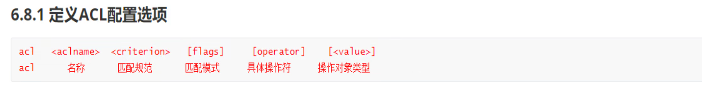

acl xxx xx xxx xxx #  这些字段不一定都有

匹配规范：比如head里带什么内容，url带什么关键字，尾包含什么。

匹配模式：比如简单的区分大小写

具体操作符：相等还是不等

value：具体的值

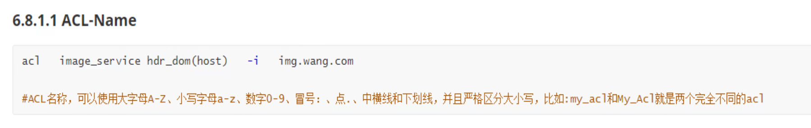

image_service就是acl的name

hdr_dom是haproxy里的固定用法，是一个判断条件，hdr_dom(host)就是主机头里host字段里  包含 后面的value--mg.wang.com的意思 

-i   忽略大小写

=============================

host字段是在Request Headers块里的，然后新版HTTP/2 /3不叫host而是authority字段。

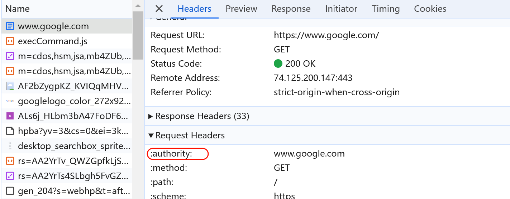

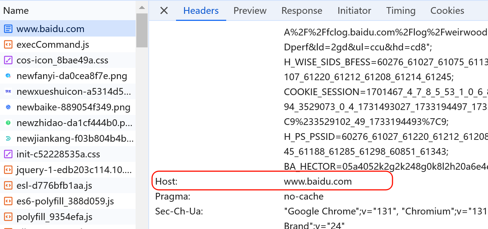

============================

### hdr：抓取head头里的东西

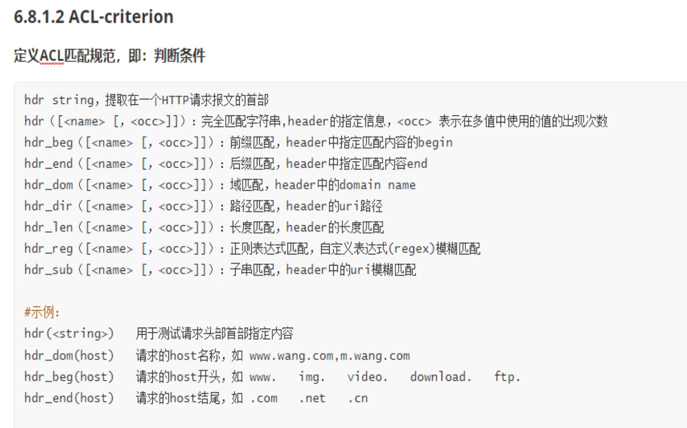

beg开头end结尾dir是uri，rge是正则，sub是包含字符串

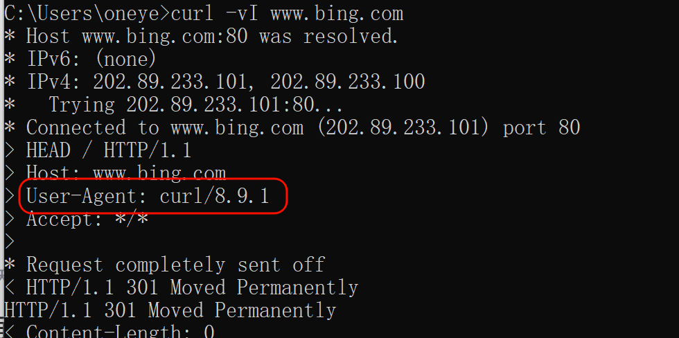 

👇 hdr_sub(User-Agent) -i curl wget 解释；hdr_sub就看是否包含字符串，看User-Agent字段里的是否有curl **或**wget 且不区分大小写。

如果你用curl和wget请求的就deny掉👇

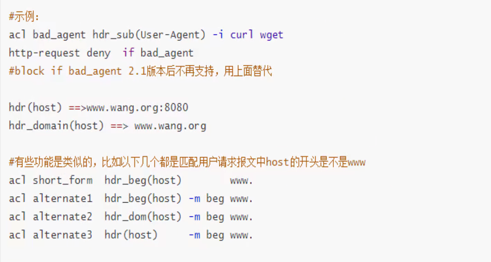

👆面的几个都一个意思都是www.开头

上图的hdr_dom(host) 和 hdr(host) 好像没啥区别啊，都是hdr(headr块里的)host字段啊，前置是域名，后者没说域名又有什么关系呢，都是beg 或 end xxx不一样用啊

然后-m写不写都都一样，-m就是-i类似的，-i是忽略大小写，不写-m就是精确匹配，如果用beg end这种就需要用-m来配合。

### 抓取部分url里的东西：base的用法

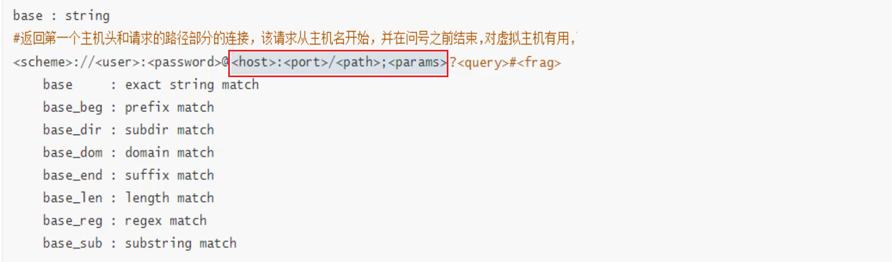

👆👇这差不多是url匹配就是nginx没法实现的

### 抓取部分url里的东西：path的用法

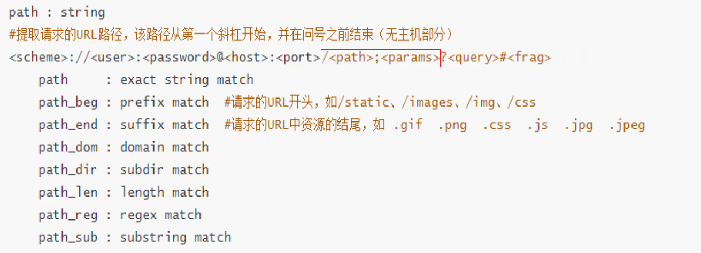

👇去掉下图的xx/就能够满足前面的匹配了

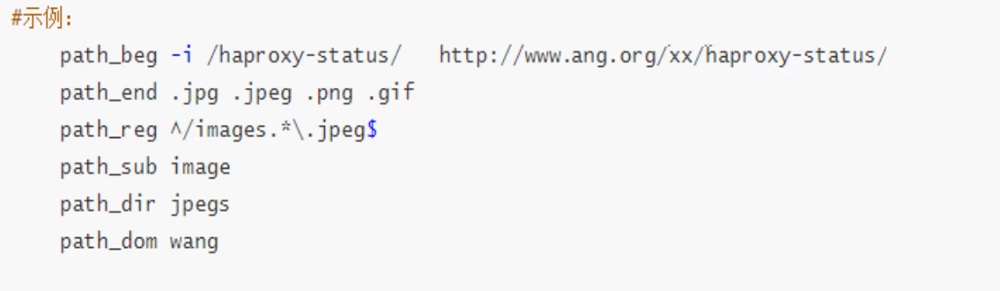

👆reg就是regex正则

path_sub是子串，所谓子串就是只要包含就匹配到了。

path_dir jpegs就是必须是一个独立的文件夹，比如www.ming.org/xxx/jpegs/xxx   xxx有没有都可以咯。

### 抓取整个url里的东西：url的用法

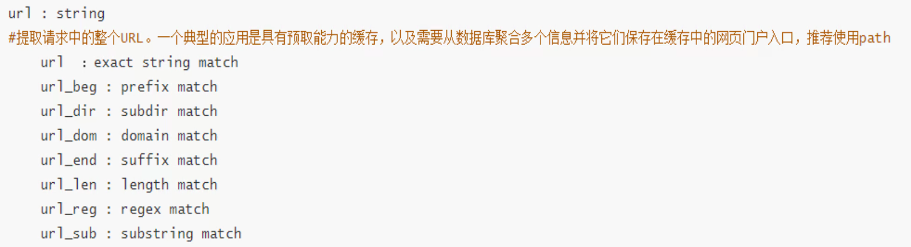

### 抓取：源目IP和端口、状态码、以及method七层协议里的动作(GET/POST等)🐂

 

## 匹配模式

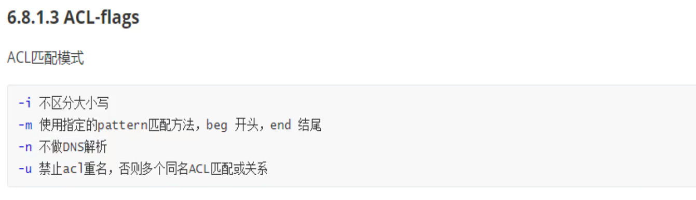

-u就是acl不能同名，这种写法就不行了

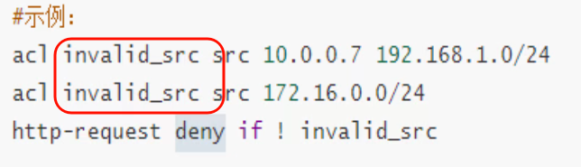

本来多个acl同名就是并集也就是或的关系，squid里就是这么用的。

## 操作符

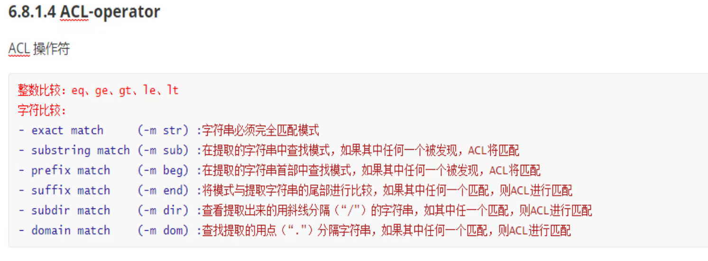

## value值

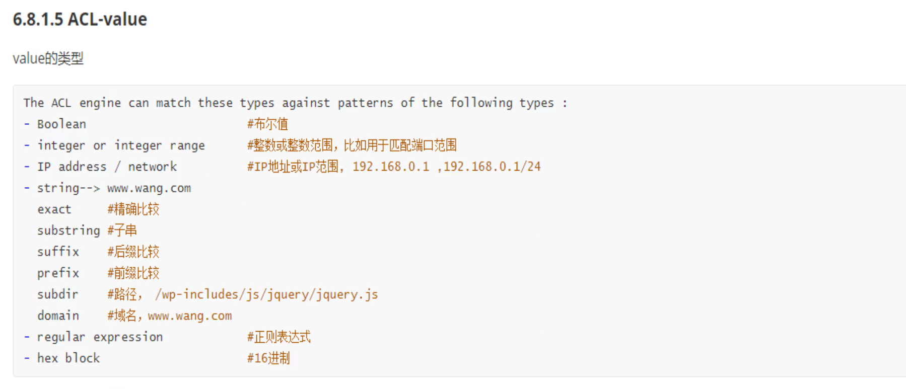

## acl组合

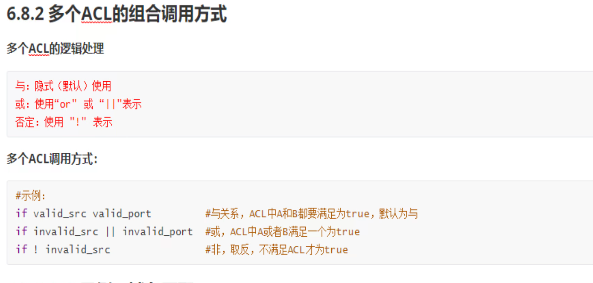

# 实验

假设 一个网站提供手机端访问，一个网站提供电脑端访问

