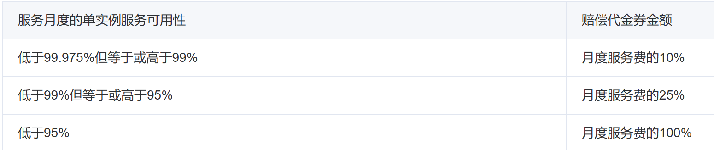
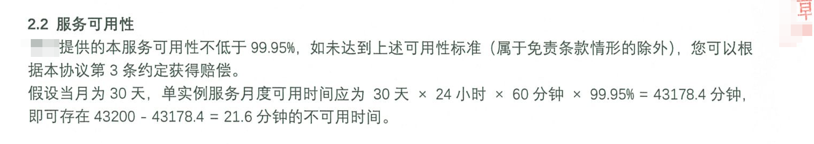

# 1.高可用集群和VRRP协议.md


LVS的问题，单点问题，后端lvs自身不做健康检查默认情况下。

ngninx 和 haproxy 和 LVS 的单点问题都可以用这一篇的keepalive来解决。

haproxy是某某云厂家生产中用的，私下我可以告诉你，keepalive自然也是配合一起用的。


# 内容概述

HA高可用介绍

VRRP，地址漂移

keepAlived 组成和安装

keepAlived 实现VRRP

KeepAlived实现LVS高可用

keepalived实现其他应用的HA


# 高可用集群

## 集群类型

提到 高可用+无状态  就是keepalived了

**LB:：load balance 负载集群**

​			LVS\HAProxy\nginx

**HA：High Avaliability 高可用集群**

​			非通用自身携带的HA机制：MySQL、Redis、Zookeeper、Kafka，这些是有状态的。

​			通用的高可用集群：keepalived，更适合无状态的服务。

​			SPoF：single Point of Failture，解决单点故障

**HPC：High Performance Computing 高性能集群**

​			https://www.top500.org


## 系统可用性

**SLA** 的全称是 **Service Level Agreement（服务水平协议）**，它是一种合同或协议，定义了服务提供方和服务接收方之间的服务质量、责任和义务。SLA 通常用于 IT 服务管理中，尤其在云计算、托管服务、网络运维等领域非常常见。


A = MTBF / (MTBF + MTTR)

MTBF：Mean Time Between Failure 平均无故障时间，属于业务正常时间

MTTR：Mean Time To Restoration ( repair ) 平均恢复前时间，故障时间。

```bash
99.95%:  (30*24*60)*(1-0.9995)=21.6分钟  # 一般按一个月或一年非计划内停机时间统计
```

指标：99.9%，99.99%，99.999%，99.9999%


比如各个云厂商的合同协议：





还有：




## HA的模型

A/S主从好理解，A/A 参见ASA的failover的双活就好理解，其中还涉及防火墙的端口组，以及状态的同步等细节。网工肯定有印象的。


