# 3.Keepalived实现VRRP协议配置和日志及独立子配置文件.md


```bash
[root@server keepalived-2.3.2]# vim /apps/keepalived/etc/keepalived/keepalived.conf
! Configuration File for keepalived

global_defs {
   router_id 192.168.126.136
   vrrp_mcast_group4 230.0.0.0
}

vrrp_instance VI_1 {
    state MASTER
    interface eth0
    virtual_router_id 51
    priority 100
    advert_int 1
    authentication {
        auth_type PASS
        auth_pass 1111
    }
    virtual_ipaddress {
        192.168.126.100/24  # 将vip改到正确的网段里，然后不加/24默认就是/32的。
    }

    # Allow packets addressed to the VIPs above to be received
    accept
}


```

网卡一般规划是一台服务器3块网卡

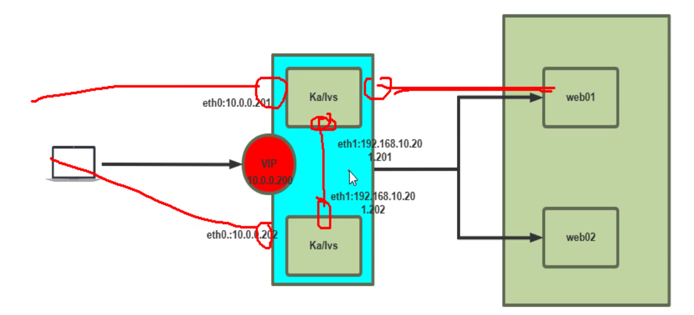

一个对外、一个对内、一个做心跳线

VIP一般是对外作为业务承接的，不过也可以向网络里用来做内部的网关，不过在linux APP运维体系里VIP肯定是对外了，谁用linux做路由器啊，诶，等等，不好说哦，哈哈。


其实也挺简单的，就是安装后，配置简化下，然后我是rocky也不用管什么vrrp_strict，VIP就是通的，然后看看MAC的切换也是丝滑的

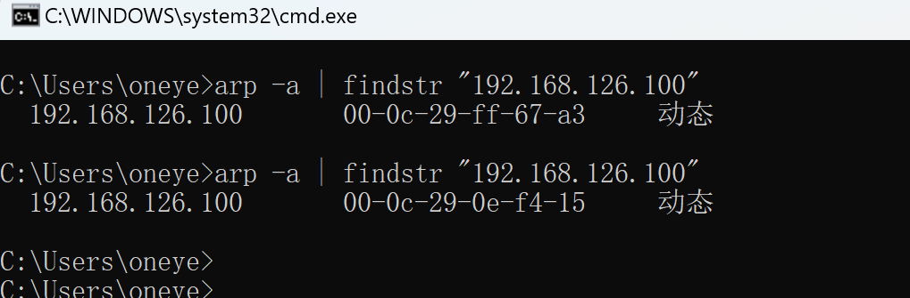

126.100的MAC从一台keepalived机器变成了另一台了👆


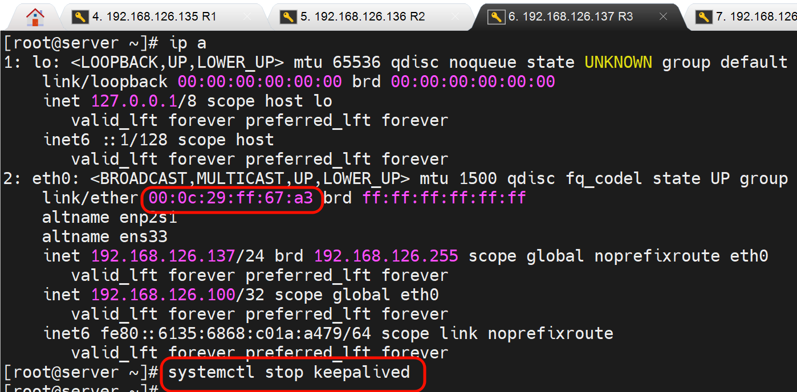

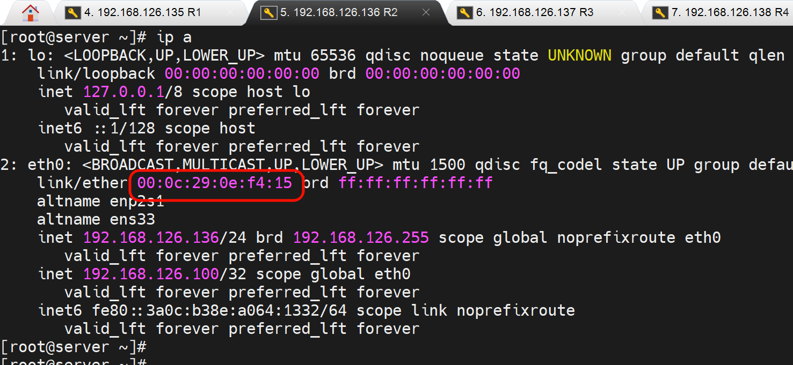


## 独立的心跳线配置

独立的心跳线，意味着VIP也要绑到独立的接口了

```bash
[root@server keepalived-2.3.2]# vim /apps/keepalived/etc/keepalived/keepalived.conf
! Configuration File for keepalived

global_defs {
   router_id 192.168.126.136
   vrrp_mcast_group4 230.0.0.0
}

vrrp_instance VI_1 {
    state MASTER  # 也就是标识一下，以后真正的MASTER都是优先级竞选出来的
    interface eth0
    virtual_router_id 51
    priority 100  # 优先级比大
    advert_int 1
    authentication {
        auth_type PASS
        auth_pass 1111
    }
    virtual_ipaddress {
        192.168.126.100/24 dev eth0 label eth0:1
    }

    # Allow packets addressed to the VIPs above to be received
    accept
}


```

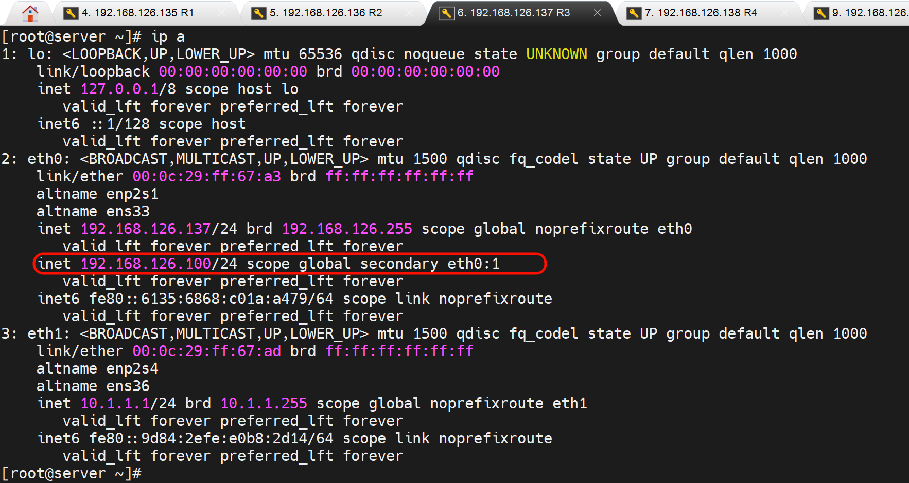


**心跳线独立网卡👇然后设置优先级，默认就是开启抢占的**

```shell
#MASTER上

! Configuration File for keepalived

global_defs {
   router_id 192.168.126.136
   vrrp_mcast_group4 230.0.0.0
}

vrrp_instance VI_1 {
    state MASTER
    interface eth1  # 心跳网卡
    virtual_router_id 51
    priority 120
    advert_int 1
    authentication {
        auth_type PASS
        auth_pass 1111
    }
    virtual_ipaddress {
        192.168.126.100/24 dev eth0 label eth0:1
    }

    # Allow packets addressed to the VIPs above to be received
    accept
}


#SLAVE上

! Configuration File for keepalived

global_defs {
   router_id 192.168.126.136
   vrrp_mcast_group4 230.0.0.0
}

vrrp_instance VI_1 {
    state SLAVE
    interface eth1  # 心跳网卡
    virtual_router_id 51
    priority 100
    advert_int 1  # 心跳组播发送时间，检测时间1s也是默认值。
    authentication {
        auth_type PASS
        auth_pass 1111
    }
    virtual_ipaddress {
        192.168.126.100/24 dev eth0 label eth0:1
    }

    # Allow packets addressed to the VIPs above to be received
    accept
}

```


此时心跳就独立接口发送了👆


linux arp看法-n较好

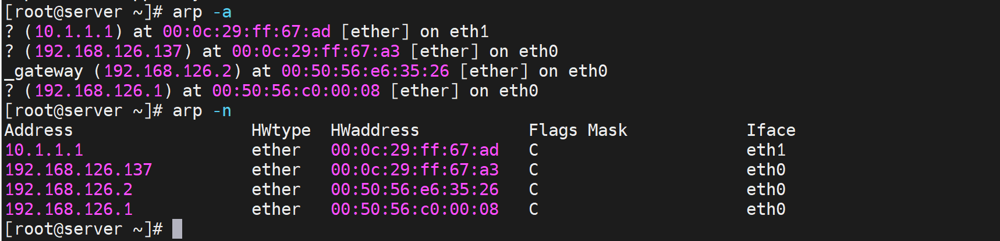


### 脑裂

心跳线剪掉 就脑裂了；

认证密码不一致，也脑裂了；

interface eth1  ，另一个配置interface eth0 就脑裂了；

一旦脑裂，对于client端来讲，就是两个一样的IP地址存活了，可能导致业务不通。


## keepalive的日志独立处理

默认就有日志的，在/var/log/message里的

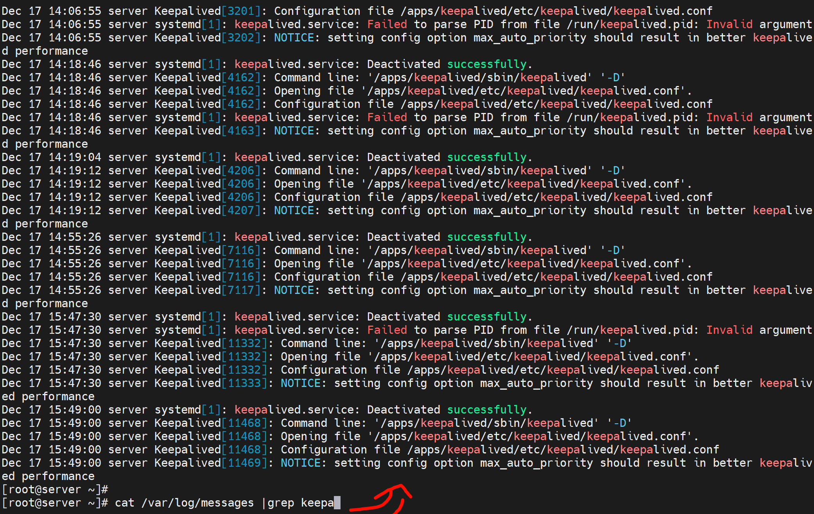


独立出来

```bash
# 修改log设备是日志独立出来
vim /apps/keepalived/etc/sysconfig/keepalived
KEEPALIVED_OPTIONS="-D -S 6"

# 然后去syslog配置文件里将local6设备对接的日志存下来单独。
vim /etc/rsyslog.conf
local6.*        /var/log/keepalived.log
```

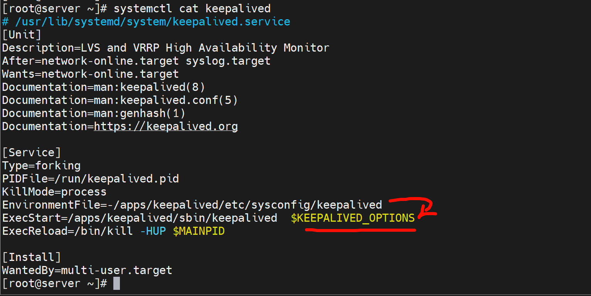

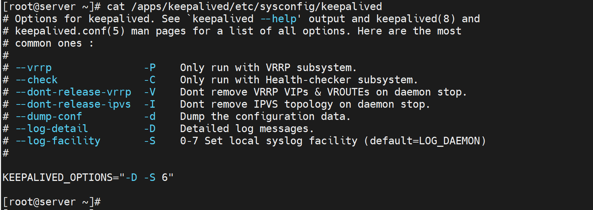

👆默认是LOG_DAEMON，也默认放到/var/log/message里了。为啥呢，因为👇*.就是默认没指定的都放进去了


这就ok了

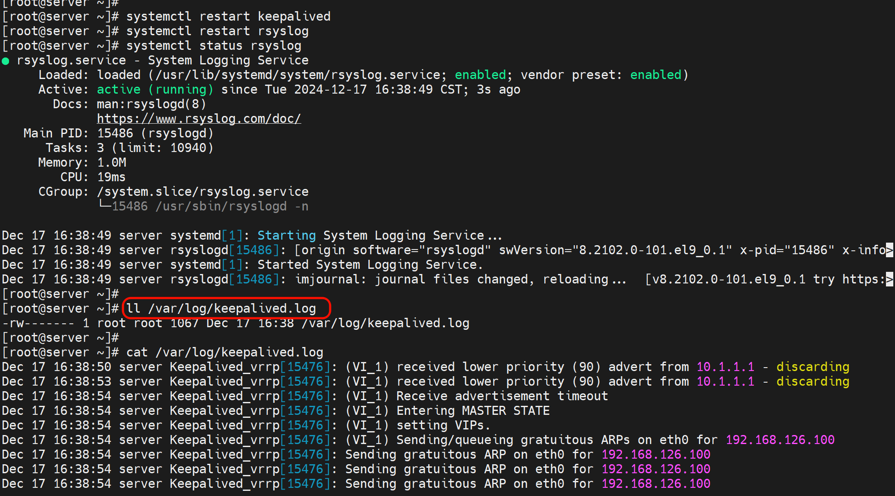


## keepalive子配置文件-业务配置独立存放

和haproxy、nginx一样，子配置文件一般是一个独立的站点配置文件单独存放。

和nginx一样加一个include，和haproxy不一样的是haproxy是service文件里的-f指定来着。


keepalive子配置文件也就是用来存放VIP配置的，也算独立业务独立配置


业务逻辑更清晰👆

```bash
[root@server ~]# cat /apps/keepalived/etc/keepalived/keepalived.conf
! Configuration File for keepalived

global_defs {
   router_id 192.168.126.136
   vrrp_mcast_group4 230.0.0.0
}

include /apps/keepalived/etc/keepalived/conf.d/*.conf
```

```bsah
mkdir /apps/keepalived/etc/keepalived/conf.d/
```


MASTER:

```bash
vim /apps/keepalived/etc/keepalived/conf.d/www.ming.org.conf
vrrp_instance VI_1 {
    state MASTER
    interface eth1
    virtual_router_id 51
    priority 100
    advert_int 3
    authentication {
        auth_type PASS
        auth_pass cisco
    }
    virtual_ipaddress {
        192.168.126.100/24 dev eth0 label eth0:1
    }

    # Allow packets addressed to the VIPs above to be received
    accept
}


```

SLAVE:

```bash
[root@server ~]# vim /apps/keepalived/etc/keepalived/conf.d/www.ming.org.conf
vrrp_instance VI_1 {
    state SLAVE
    interface eth1
    virtual_router_id 51
    priority 90
    advert_int 3
    authentication {
        auth_type PASS
        auth_pass cisco
    }
    virtual_ipaddress {
        192.168.126.100/24 dev eth0 label eth0:1
    }

    # Allow packets addressed to the VIPs above to be received
    accept
}

```


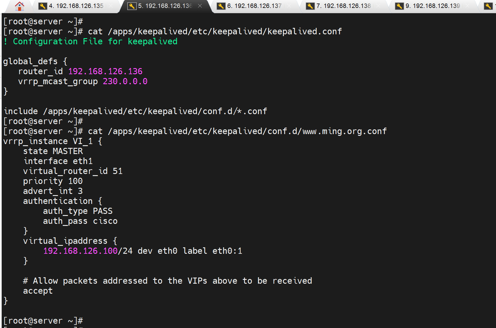

