# 4.Keepalived脑裂现像单播通信非抢占式及邮件通知实现.md


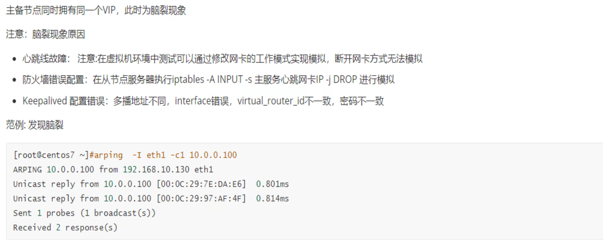

心跳线故障，就是两头keepalive的心跳线接口都带电的，所以才能说hello包探测机制都认为是OK的，才能出现脑裂。

arping 发现一个VIP两个MAC就可以判断出脑裂了。


模拟脑裂


将eth1改成NAT，此时脑裂产出，从VIP对外服务的client那里 进行 arping可以看到👇

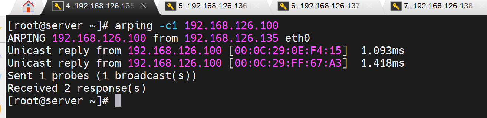 


心跳线 理论上 最好也是做bond，然后keepalived里的cfg文件里就要些bond接口

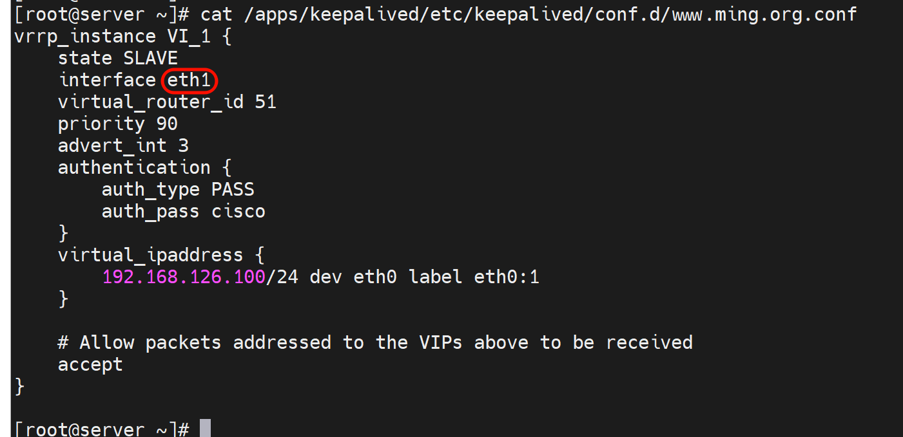 

上图写错了哦👆，SLAVE改成BACKUP


据说有新的防火墙内置的工具？

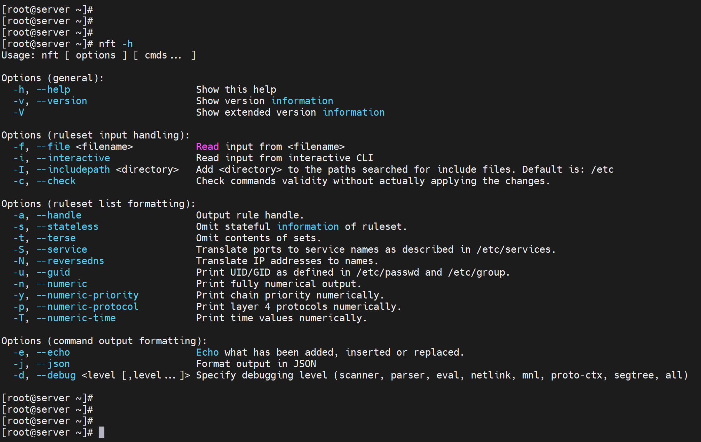


# 抢占

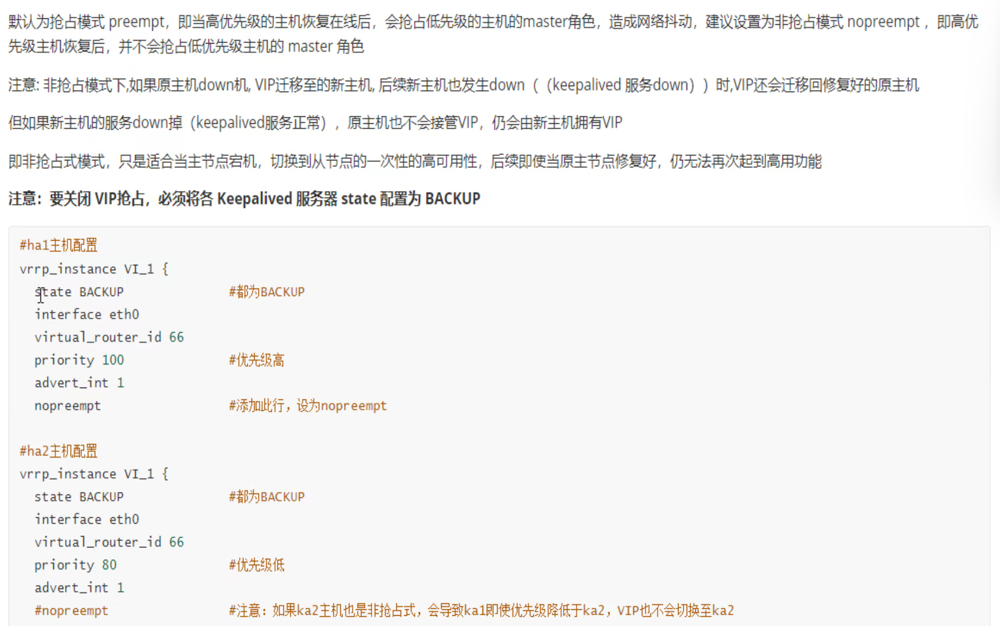


```bash
# 主备机的主配置文件都一样
[root@server ~]# cat /apps/keepalived/etc/keepalived/keepalived.conf
! Configuration File for keepalived

global_defs {
   router_id 192.168.126.136
   vrrp_mcast_group4 230.0.0.0
}
include /apps/keepalived/etc/keepalived/conf.d/*.conf
[root@server ~]#

=============================================================================
# 主备机的子配置文件
# 主机：
[root@server ~]# cat /apps/keepalived/etc/keepalived/conf.d/www.ming.org.conf
vrrp_instance VI_1 {
    state BACKUP
    interface eth1
    virtual_router_id 51
    priority 100
    advert_int 3
    nopreempt
    authentication {
        auth_type PASS
        auth_pass cisco
    }
    virtual_ipaddress {
        192.168.126.100/24 dev eth0 label eth0:1
    }

    # Allow packets addressed to the VIPs above to be received
    accept
}


# 备机：
[root@server ~]# cat /apps/keepalived/etc/keepalived/conf.d/www.ming.org.conf
vrrp_instance VI_1 {
    state BACKUP
    interface eth1
    virtual_router_id 51
    priority 90
    advert_int 3
    authentication {
        auth_type PASS
        auth_pass cisco
    }
    virtual_ipaddress {
        192.168.126.100/24 dev eth0 label eth0:1
    }

    # Allow packets addressed to the VIPs above to be received
    accept
}


```

此时主挂了，再起来，就不会抢占了。


### 延迟抢占

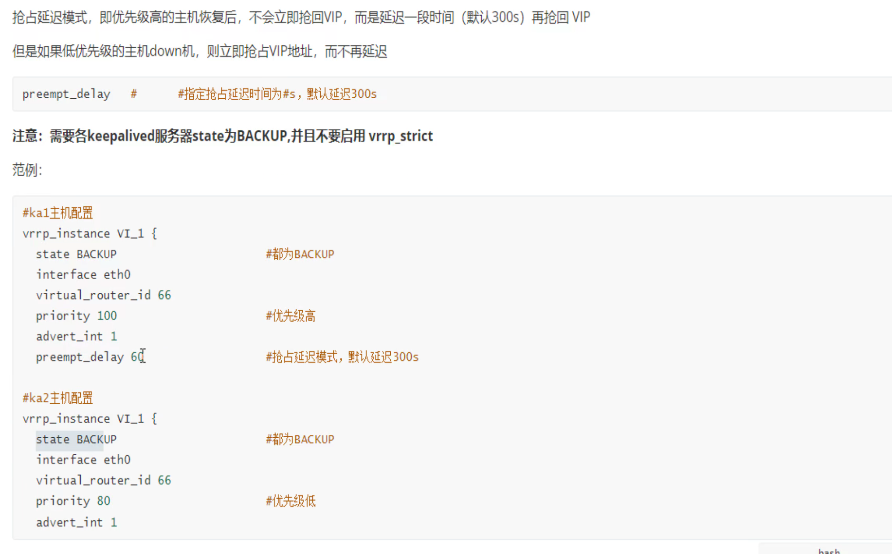

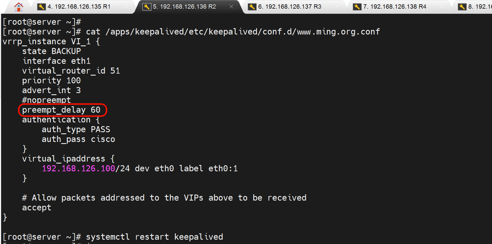

这就是①BACKUP②preempt_delay做到延迟抢占。


## 单播


1、观察拓扑

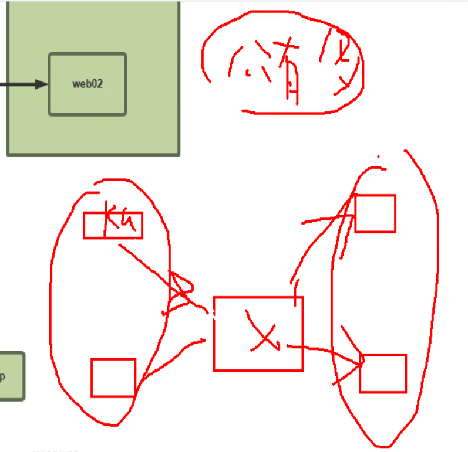

1、公有云上，限制多播也就是组播的 可能，所以要改单播

2、本地SW做心跳交换机的集中式的中继桥接，但是组播报文交换机的转发式同一个VLAN下的端口防洪的，理由就是没有哪个源MAC地址式224.0.0.x这种的，所以CAM表里也没有的一定。所以会泛洪的

3、于是单播的需求就应运而生了。


```bash

# 主配置文件差不多

# 主节点
[root@server ~]# cat /apps/keepalived/etc/keepalived/keepalived.conf
! Configuration File for keepalived

global_defs {
   router_id 192.168.126.136
   vrrp_mcast_group4 230.0.0.0
}
include /apps/keepalived/etc/keepalived/conf.d/*.conf
[root@server ~]#


# 从节点：
[root@server ~]# cat /apps/keepalived/etc/keepalived/keepalived.conf
! Configuration File for keepalived

global_defs {
   router_id 192.168.126.137
   vrrp_mcast_group4 230.0.0.0
}
include /apps/keepalived/etc/keepalived/conf.d/*.conf
[root@server ~]#


======================================
# 子配置文件

# 主：

[root@server ~]# vim /apps/keepalived/etc/keepalived/conf.d/www.ming.org.conf
vrrp_instance VI_1 {
    state BACKUP
    interface eth1
    virtual_router_id 51
    priority 100
    advert_int 3
    #nopreempt
    preempt_delay 60
    authentication {
        auth_type PASS
        auth_pass cisco
    }
    virtual_ipaddress {
        192.168.126.100/24 dev eth0 label eth0:1
    }
    unicast_src_ip 10.1.1.1
    unicast_peer{
        10.1.1.2
    }
    # Allow packets addressed to the VIPs above to be received
    accept
}


# 备：
[root@server ~]# cat /apps/keepalived/etc/keepalived/conf.d/www.ming.org.conf
vrrp_instance VI_1 {
    state BACKUP
    interface eth1
    virtual_router_id 51
    priority 90
    advert_int 3
    authentication {
        auth_type PASS
        auth_pass cisco
    }
    virtual_ipaddress {
        192.168.126.100/24 dev eth0 label eth0:1
    }

    unicast src_ip 10.1.1.2
    unicast_peer{
        10.1.1.1
    }
    # Allow packets addressed to the VIPs above to be received
    accept
}

```


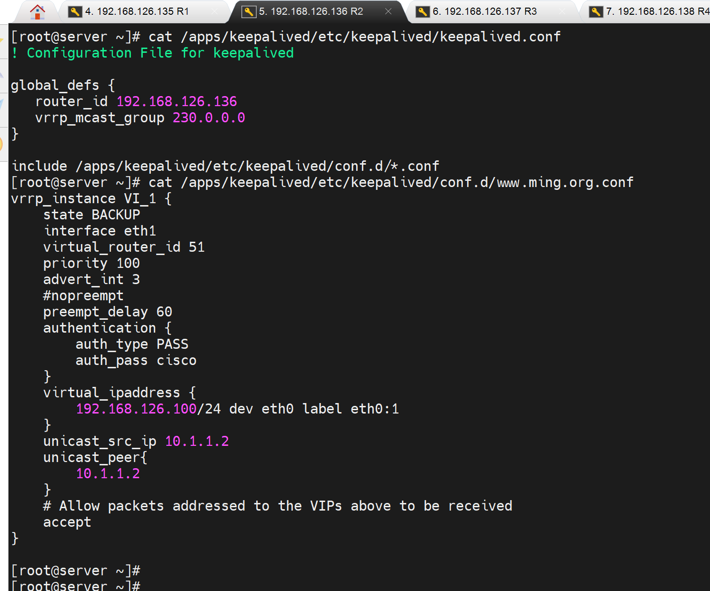

上图👆src_ip写错了改成10.1.1.1


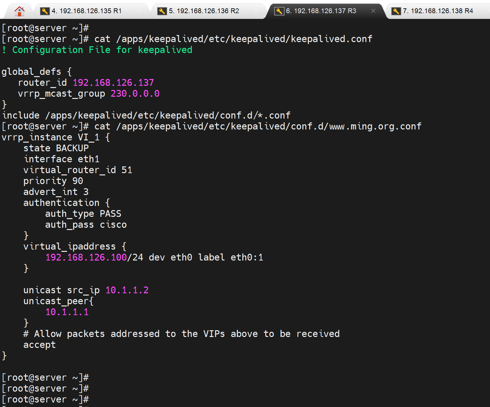


观察可见，抢占延迟，然后也是单播了。

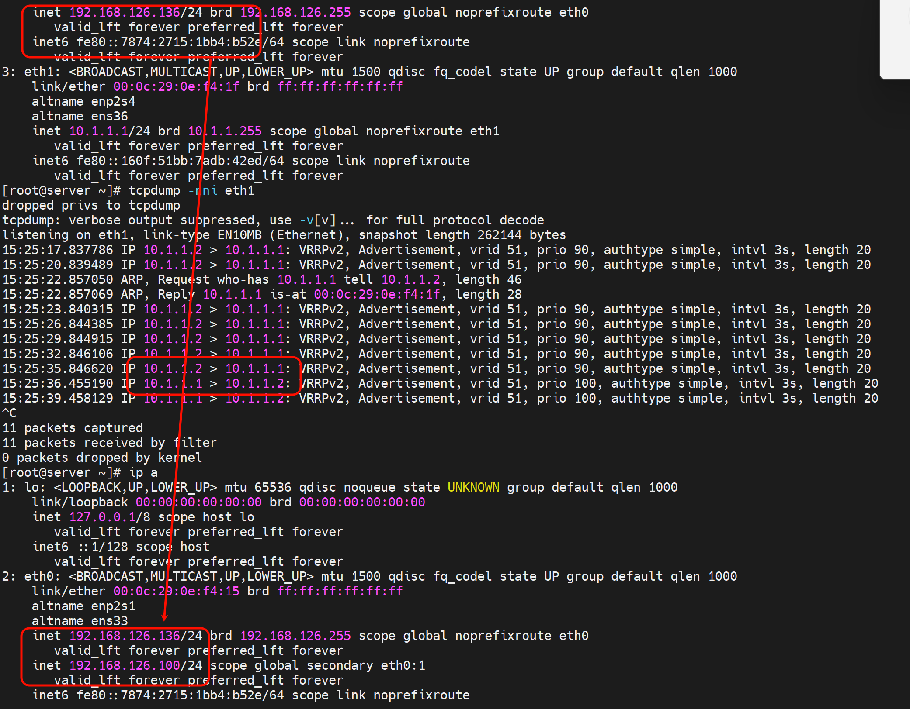

有了单播配置，组播即使配置上去也不会生效了。

注意事项：单播不能和vrrp_strict同时配置，不过vrrpt_strict好像不推荐开启。

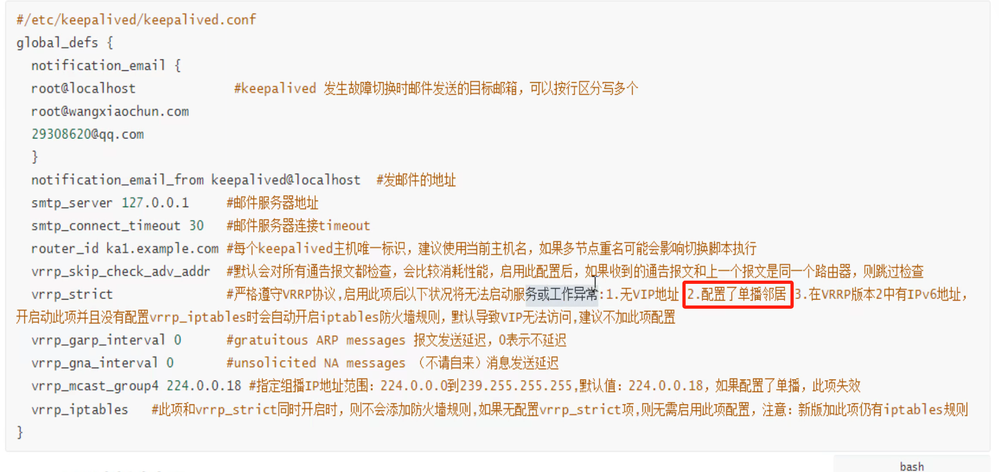


## accept

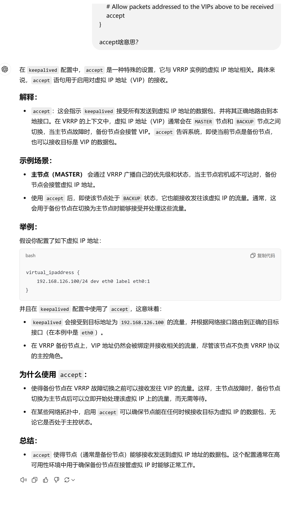


## 邮件通知

1、就是节点挂了，切换啦，虽然不影响业务，但是通知还是要发一下的，比如主从切换了，发生时间式夜里2点，那么通知就要做到早上9点发出来，让运维处理

### keepalive通知脚本

默认以用户keepalived_script身份执行脚本，如果此用户不存在，就用root执行脚本。

可以用下面指令指定脚本执行用户的身份

```bash
global_defs {
	......
	script_user <user>
	......
}
```


### 通知脚本类型

当前节点成为主节点时触发的脚本

```shell
notify_master <STRING>|<QUOTED-STRING>
```

当前节点转为备节点时触发的脚本

```bash
notify_backup <STRING>|<QUOTED-STRING>
```

当前节点转为”失败“状态时触发的脚本

```bash
notify_fault <STRING>|<QUOTED-STRING>
```

通用格式的通知触发机制，一个脚本可完成以上三种状态的转换时的通知

```bash
notify <STRING>|<QUOTED-STRING>
```

当停止VRRP时触发的脚本

```bash
notify_stop <STRING>|<QUOTED-STRING>
```


### 脚本的调用方法

在vrrp_instance VL_1语句块的末尾加入以下内容，这个脚本的思路是：

定义的名称notify_xxx   ， 后面就是脚本notify.sh，再后面就是传参进去，所以notify.sh是一个综合脚本，通过传递不通参数实现各自的功能，比如变成master，变成backup，fault故障的脚本动作。

```bash
notify_master "/xxx/xxx/xx/notify.sh master"
notify_backupr "/xxx/xx/xx/notify.sh backup"
notify_fault "/xxx/xx/xx/notify.sh fault"
```

```

[root@server ~]# cat /apps/keepalived/etc/keepalived/conf.d/www.ming.org.conf
vrrp_instance VI_1 {
    state BACKUP
    interface eth1
    virtual_router_id 51
    priority 90
    advert_int 3
    authentication {
        auth_type PASS
        auth_pass cisco
    }
    virtual_ipaddress {
        192.168.126.100/24 dev eth0 label eth0:1
    }

    unicast src_ip 10.1.1.2
    unicast_peer{
        10.1.1.1
    }

    notify_master "/apps/keepalived/bin/notify.sh master"
    notify_backup "/apps/keepalived/bin/notify.sh backup"
    notify_fault "/apps/keepalived/bin/notify.sh fault"

    # Allow packets addressed to the VIPs above to be received
    accept
}

[root@server ~]# ll /apps/keepalived/etc/keepalived/bin
-rwxr-xr-x 1 root root 2094 Dec 19 10:15 /apps/keepalived/etc/keepalived/bin
[root@server ~]# systemctl restart keepalived


```


### 实战案例1：实现keepalived状态切换的通知脚本

以下脚本支持RHEL和Ubuntu系统

```bash
#在所有keepalived节点配置如下：
cat /etc/keepavlied/notify.sh
#!/bin/bash
#
#*******
#脚本规范的开篇段落，略
#
#********


contact='root@xxxx.com'
email_send='yyyyy@qq.com'
email_passwd='1212jiojsfojfi'
email_smtp_server='smtp.qq.com'

. /etc/os-release

msg_error() {
  echo -e "\033[1;31m$1\033[0m"
}

msg_info() {
  echo -e "\033[1;32m$1\033[0m"
}

msg_warn() {
  echo -e "\033[1;33m$1\033[0m"
}

color () {
    RES_COL=60
    MOVE_TO_COL="echo -en \\033[${RES_COL}G"
    SETCOLOR_SUCCESS="echo -en \\033[1;32m"
    SETCOLOR_FAILURE="echo -en \\033[1;31m"
    SETCOLOR_WARNING="echo -en \\033[1;33m"
    SETCOLOR_NORMAL="echo -en \E[0m"
    echo -n "$1" && $MOVE_TO_COL
    echo -n "["
    if [ $2 = "success" -o $2 = "0" ] ;then
        ${SETCOLOR_SUCCESS}
        echo -n $"  OK  "    
    elif [ $2 = "failure" -o $2 = "1"  ] ;then 
        ${SETCOLOR_FAILURE}
        echo -n $"FAILED"
    else
        ${SETCOLOR_WARNING}
        echo -n $"WARNING"
    fi
    ${SETCOLOR_NORMAL}
    echo -n "]"
    echo 
}


install_sendemail () {
    if [[ $ID =~ rhel|centos|rocky ]];then
        rpm -q sendemail &> /dev/null ||  yum install -y sendemail
    elif [ $ID = 'ubuntu' ];then
        dpkg -l |grep -q sendemail  || { apt update; apt install -y libio-socket-ssl-perl libnet-ssleay-perl sendemail ; } 
    else
        color "不支持此操作系统，退出!" 1
        exit
    fi
}

# tls=yes改成no防止ssl报错
send_email () {
    local email_receive="$1"
    local email_subject="$2"
    local email_message="$3"
    sendemail -f $email_send -t $email_receive -u $email_subject -m $email_message -s $email_smtp_server -o message-charset=utf-8 -o tls=yes -xu $email_send -xp $email_passwd
    [ $? -eq 0 ] && color "邮件发送成功!" 0 || color "邮件发送失败!" 1 
}

notify() {
    if [[ $1 =~ ^(master|backup|fault)$ ]];then
        mailsubject="$(hostname) to be $1, vip floating"
        mailbody="$(date +'%F %T'): vrrp transition, $(hostname) changed to be $1"
        send_email "$contact" "$mailsubject" "$mailbody"
   else
        echo "Usage: $(basename $0) {master|backup|fault}"
        exit 1
   fi
}

install_sendemail 
notify $1


```


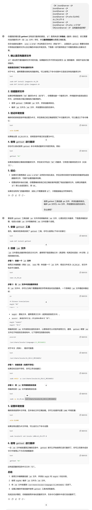


第一台

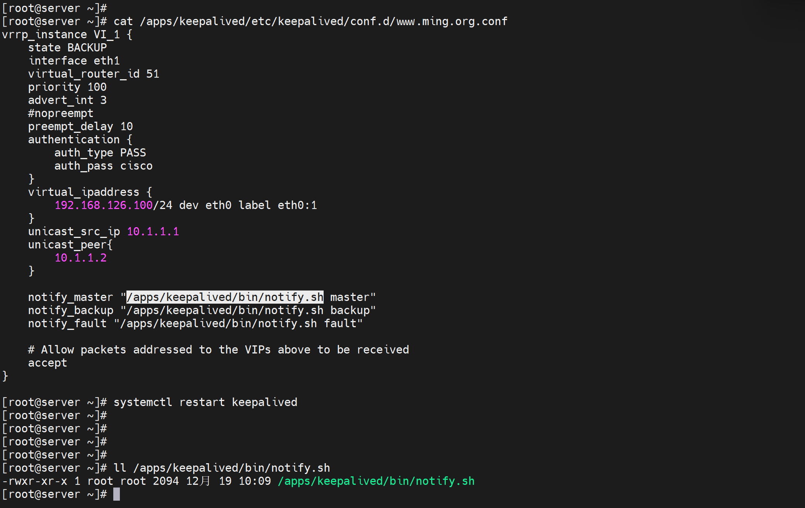

第二台

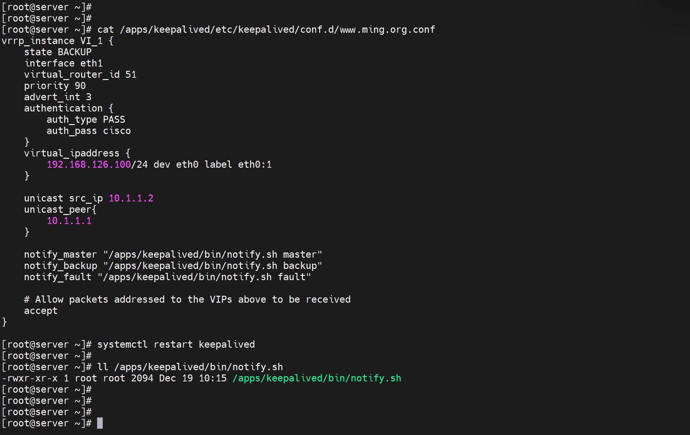


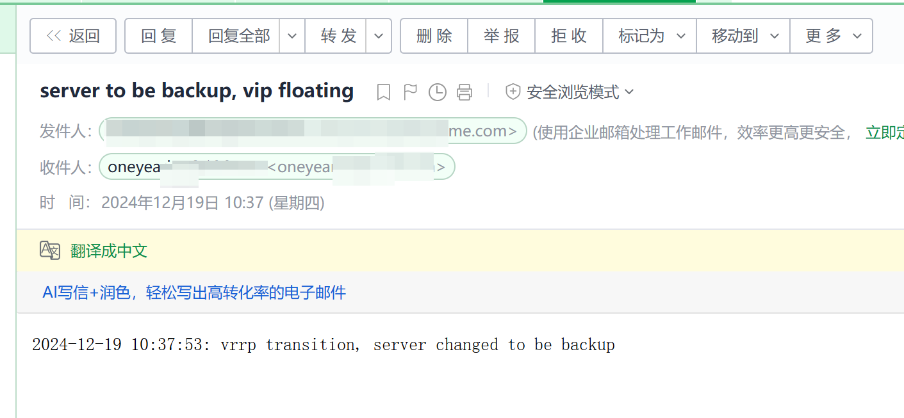


VIP漂移的告警就OK了。


**Virtual Server 虚拟服务器 定义格式**


**虚拟服务器组**

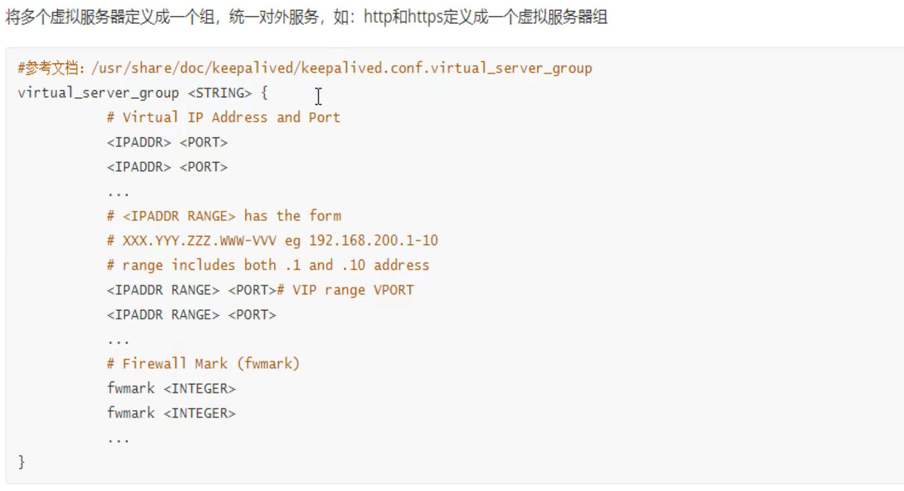


**虚拟服务器配置**

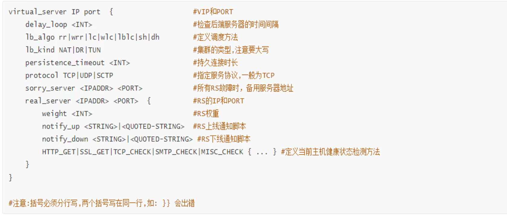

keepalive内嵌了健康性检查--dely_loop 语句实现的👆

persistence_timeout 下次调度还是往之前的后端实例调度，保持连接，会话保持，可以这么描述吧，不然调度到别的机器会话就不一致了，可能需要各个实例之间的会话同步机制了。

sorry_server就是后端rs(real server)都挂了的一个对外公告页面服务

weight权重，如果调度是wrr wlc 这种带weight的就起作用了。


**应用层检测**

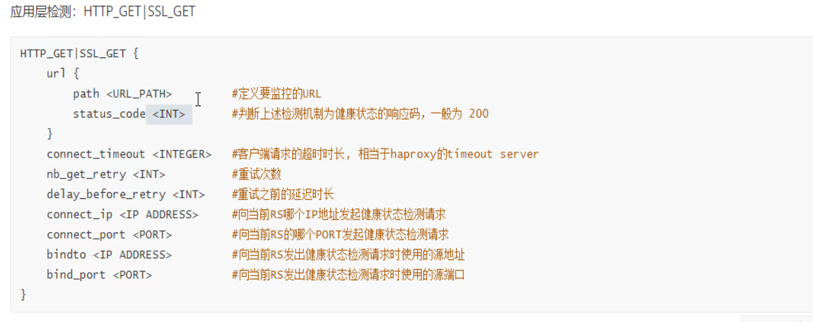


**范例**

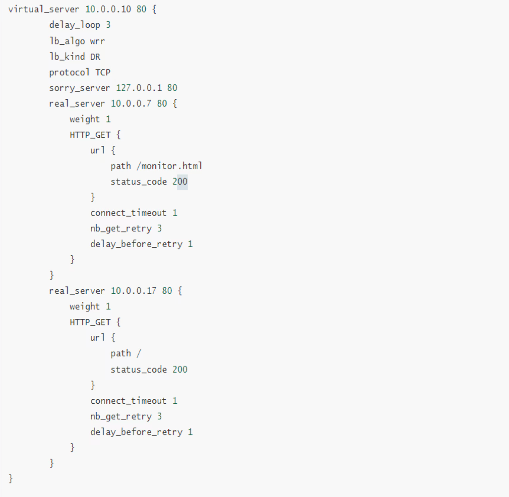

HTTP_GET里的就是健康检查，如果检查不是200结果，就将其从调度列表里移除。


dr模型，因为后端服务器也得有用这个VIP，rs和lvs要修改内核参数，防止IP冲突。NAT模式不需要。这里讲的LVS的概念了。


```bash
#!/bin/bash

vip=172.16.31.100
mask='255.255.255.255'
dev=lo:1
rpm -q httpd &> /dev/null || yum -y install httpd &>/dev/null
service httpd start &> /dev/null && echo "The httpd Server is Ready!"
echo "www.ming.org `hostname -I`" > /var/www/html/index.html

case $1 in
start)
    echo 1 > /proc/sys/net/ipv4/conf/all/arp_ignore
    echo 1 > /proc/sys/net/ipv4/conf/lo/arp_ignore
    echo 2 > /proc/sys/net/ipv4/conf/all/arp_announce
    echo 2 > /proc/sys/net/ipv4/conf/lo/arp_announce
    ifconfig $dev $vip netmask $mask #broadcast $vip up
    #route add -host $vip dev $dev
    echo "The RS Server is Ready!"
    ;;
stop)
    ifconfig $dev down
    echo 0 > /proc/sys/net/ipv4/conf/all/arp_ignore
    echo 0 > /proc/sys/net/ipv4/conf/lo/arp_ignore
    echo 0 > /proc/sys/net/ipv4/conf/all/arp_announce
    echo 0 > /proc/sys/net/ipv4/conf/lo/arp_announce
    echo "The RS Server is Canceled!"
    ;;
*)
    echo "Usage: $(basename $0) start|stop"
    exit 1
    ;;
esac
```


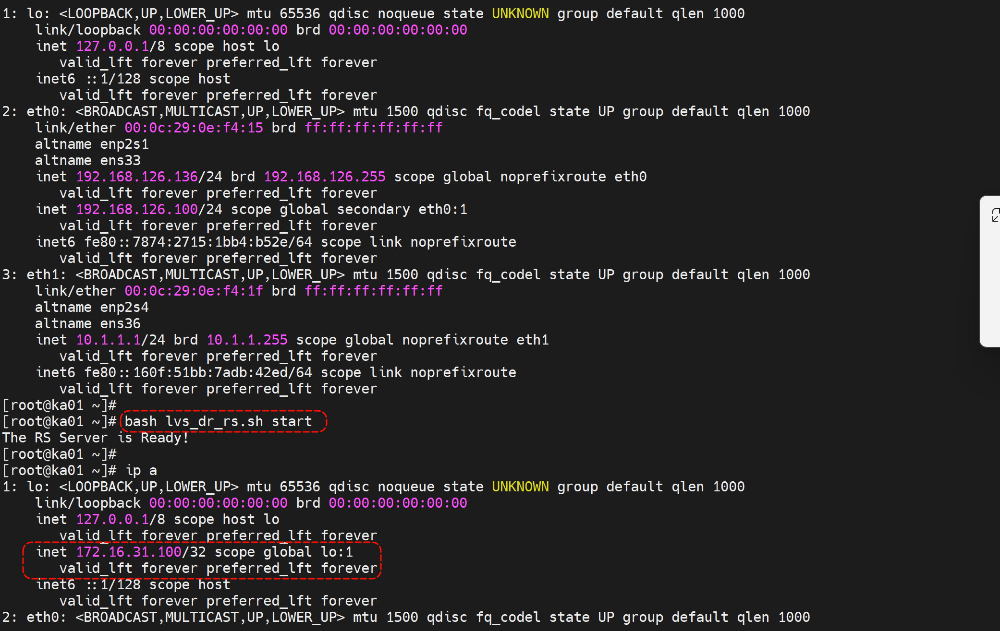


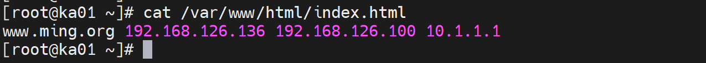


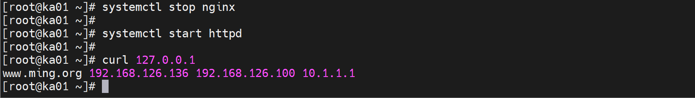


另一台也一样


