# 5.Keepalived多主模式和实现LVS.md


# 双主模型

两台节点不浪费

其实就是多业务的A/A了，就好比ECMP其实是多用户的链路负载分担咯。


1、主配置文件不变


2、子配置文件跟着业务走也就是一个站点一个子配置文件一个VIP


上图改为nopreempt降低回切导致闪断。


再做第二个站点的子配置文件


重启keepalived服务后

让192.168.126.100落在ka001上，让192.168.126.102落在ka002上👇


# 同步组

ASA里的failover里有个端口组，不知道是不是一个概念。


VIP 要能票，DIP也要能飘


```bash
vrrp_sync_group VG_1 {
	group {  # 成为一个group后，要飘就一块飘了。
		VI_1 # name of vrrp_instance (below)
		VI_2 # One of each moveable IP
	}
	vrrp_instance VI_1 {
		eth0
		vip
	}
	vrrp_instance VI_2 {
		eth1
		dip
	}
}
	
```


# keepalive内嵌LVS规则

LVS单点问题，和健康检测问题，算是LVS的遗留问题，keepalived都有解决方案

lvs 以前要用ipvsadmin工具来 编辑转发规则。

```bash
ipvsadmin -A -t vip:80 -s rr; ipvsadmin -a -t vip:80 -r rip1:80 -m|g|i （nat|gatway|tunnel） 
```

keepalived里内置的lvs，无需再依赖ipvsadmin来创建规则，直接用keepalive的配置文件就行。不过可以用ipvadmin来看看已经创建的规则。


keepalive内嵌lvs规则，必然保持lvs的对外IP和VRRP里的VIP一致

VRRP的VIP收到用户请求，然后就匹配virtual_server IP port 语句块，来调度到后端实例。


```bash
# 主节点

[root@ka01 ~]# cat /apps/keepalived/etc/keepalived/keepalived.conf
! Configuration File for keepalived

global_defs {
   router_id 192.168.126.136
   vrrp_mcast_group4 230.0.0.0
}

include /apps/keepalived/etc/keepalived/conf.d/*.conf
[root@ka01 ~]#

[root@ka01 ~]# cat /apps/keepalived/etc/keepalived/conf.d/www.ming.org.conf
vrrp_instance VI_1 {
    state BACKUP
    interface eth1
    virtual_router_id 51
    priority 100
    advert_int 3
    #nopreempt
    preempt_delay 10
    authentication {
        auth_type PASS
        auth_pass cisco
    }
    virtual_ipaddress {
        192.168.126.100/24 dev eth0 label eth0:1
    }
    unicast_src_ip 10.1.1.1
    unicast_peer{
        10.1.1.2
    }

    notify_master "/apps/keepalived/bin/notify.sh master"
    notify_backup "/apps/keepalived/bin/notify.sh backup"
    notify_fault "/apps/keepalived/bin/notify.sh fault"

    # Allow packets addressed to the VIPs above to be received
    accept
}

virtual_server 192.168.126.100 80 {
    delay_loop 6
    lb_algo wrr
    lb_kind DR
    #persistence_timeout 50
    protocol TCP
    sorry_server 127.0.0.1 80


    real_server 192.168.126.138 80 {
        weight 2
        HTTP_GET {
            url {
              path /index.html
              status_code 200
            }
            connect_timeout 1
            nb_get_retry 3
            delay_before_retry 1
        }
    }
    real_server 192.168.126.139 80 {
        weight 1
        HTTP_GET {
            url {
              path /index.html
              status_code 200
            }
            connect_timeout 1
            nb_get_retry 3
            delay_before_retry 1
        }
    }
}

[root@ka01 ~]#


----------------------------


# 从节点

[root@ka02 ~]# cat /apps/keepalived/etc/keepalived/keepalived.conf
! Configuration File for keepalived

global_defs {
   router_id 192.168.126.137
   vrrp_mcast_group4 230.0.0.0
}
include /apps/keepalived/etc/keepalived/conf.d/*.conf

[root@ka02 ~]# cat /apps/keepalived/etc/keepalived/conf.d/www.ming.org.conf
vrrp_instance VI_1 {
    state BACKUP
    interface eth1
    virtual_router_id 51
    priority 90
    advert_int 3
    authentication {
        auth_type PASS
        auth_pass cisco
    }
    virtual_ipaddress {
        192.168.126.100/24 dev eth0 label eth0:1
    }

    unicast src_ip 10.1.1.2
    unicast_peer{
        10.1.1.1
    }

    notify_master "/apps/keepalived/bin/notify.sh master"
    notify_backup "/apps/keepalived/bin/notify.sh backup"
    notify_fault "/apps/keepalived/bin/notify.sh fault"

    # Allow packets addressed to the VIPs above to be received
    accept
}

virtual_server 192.168.126.100 80 {
    delay_loop 6
    lb_algo wrr
    lb_kind DR
    protocol TCP
    sorry_server 127.0.0.1 80


    real_server 192.168.126.138 80 {
        weight 2
        HTTP_GET {
            url {
              path /index.html
              status_code 200
            }
            connect_timeout 1
            nb_get_retry 3
            delay_before_retry 1
        }
    }
    real_server 192.168.126.139 80 {
        weight 1
        HTTP_GET {
            url {
              path /index.html
              status_code 200
            }
            connect_timeout 1
            nb_get_retry 3
            delay_before_retry 1
        }
    }
}


[root@ka02 ~]#


```


persistence_timeout  是会话保持，先注释掉，否则单用户测试看不出来wrr的权重调度比例了


LVS规则已经生效

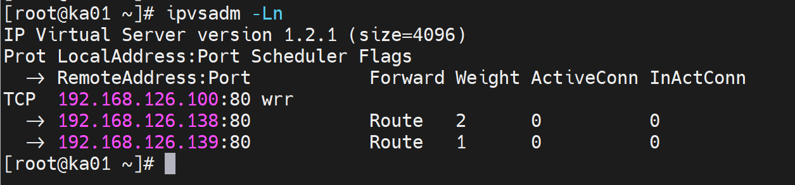

不过从节点不承载VIP，所以规则实际是未起作用的。

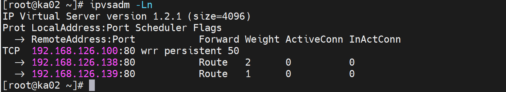


测试确实是2:1的wrr调度

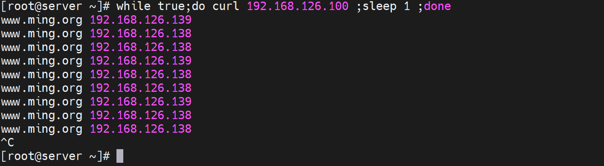

与此同时可通过ipvadm -Ln观察命中规则次数，因为VIP落在主节点上，所以其上才可见LVS规则命中情况

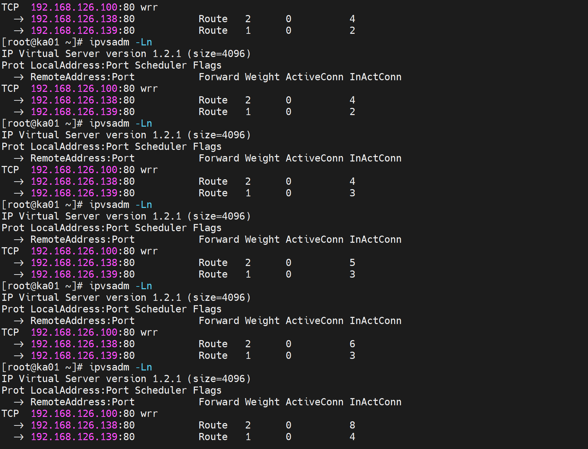


然后看下后端rs的健康检查 发现不通后，不再往故障服务器转发的情况

后端挂一个

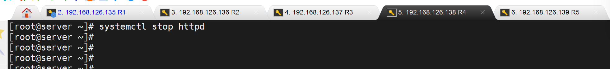

调度能够识别到，并优化转发👇

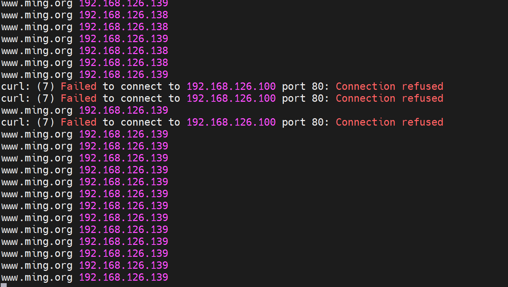


此时就不会再往故障节点192.168.126.138转发了，因为LVS的转发规则已经调整👇

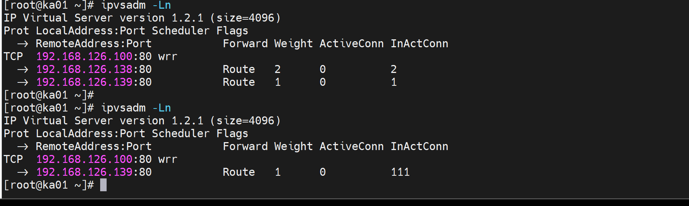

RS起来后，LVS规则会自动加回来，转发重新恢复wrr2:1调度

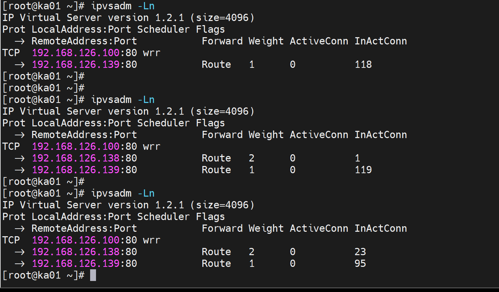


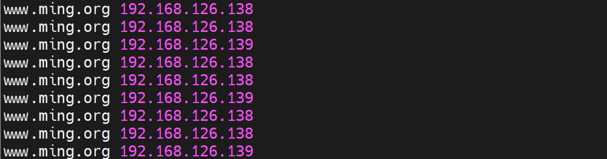


所以keepalived+lvs是黄金搭档~


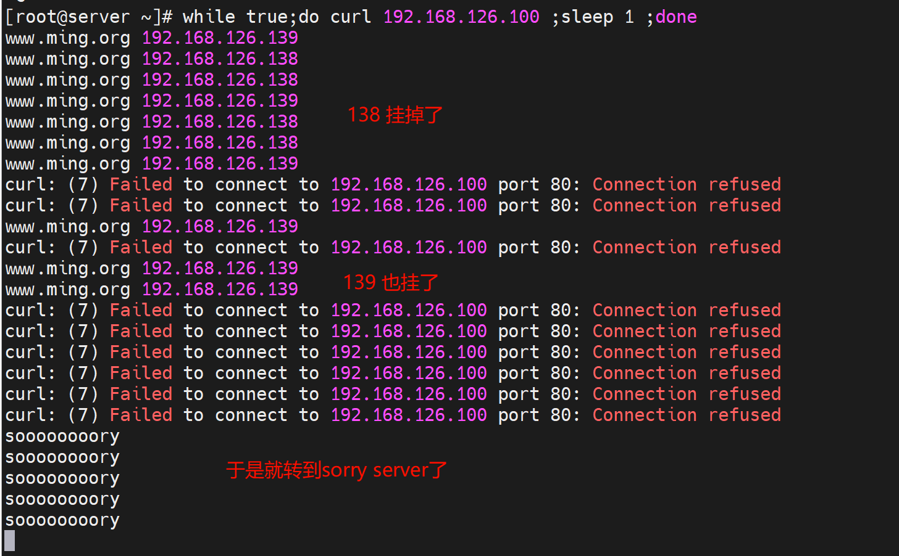


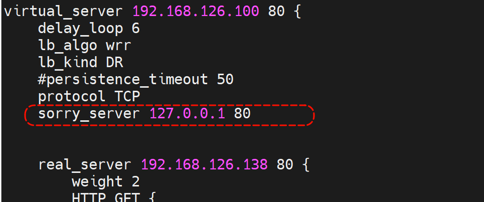


## L4检查的配置方法

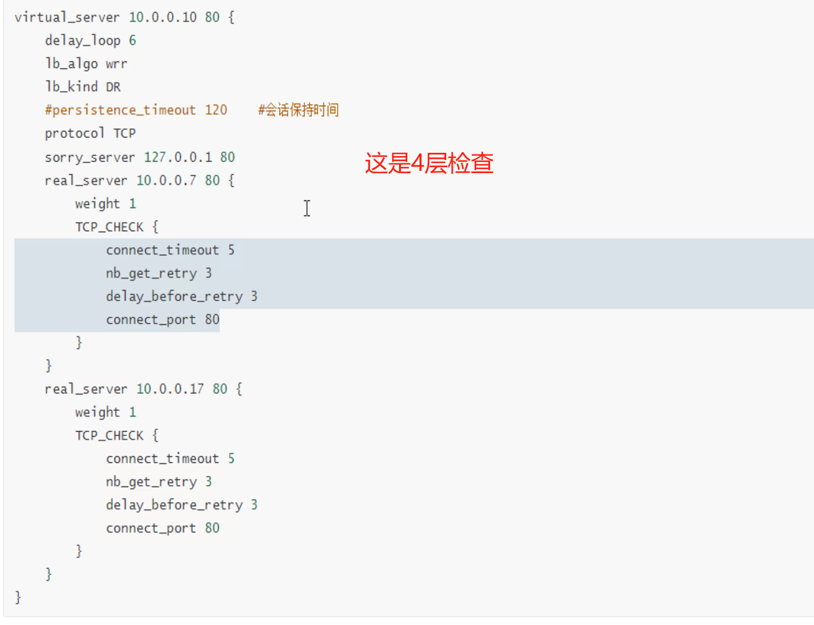


保持之前的http检查的配置文件，然后复制一份出来做L4检查，vim的使用技巧，删除选中行，vim进去然后按v选择多行，d就行了


```bash
# 主节点
[root@ka01 ~]# cat /apps/keepalived/etc/keepalived/conf.d/www.ming.org.conf
vrrp_instance VI_1 {
    state BACKUP
    interface eth1
    virtual_router_id 51
    priority 100
    advert_int 3
    #nopreempt
    preempt_delay 10
    authentication {
        auth_type PASS
        auth_pass cisco
    }
    virtual_ipaddress {
        192.168.126.100/24 dev eth0 label eth0:1
    }
    unicast_src_ip 10.1.1.1
    unicast_peer{
        10.1.1.2
    }

    notify_master "/apps/keepalived/bin/notify.sh master"
    notify_backup "/apps/keepalived/bin/notify.sh backup"
    notify_fault "/apps/keepalived/bin/notify.sh fault"

    # Allow packets addressed to the VIPs above to be received
    accept
}

virtual_server 192.168.126.100 80 {
    delay_loop 6
    lb_algo wrr
    lb_kind DR
    #persistence_timeout 50
    protocol TCP
    sorry_server 127.0.0.1 80


    real_server 192.168.126.138 80 {
        weight 2
        TCP_CHECK {
            connect_timeout 5
            nb_get_retry 3
            delay_before_retry 3
            connect_port 80
       }
    }
    real_server 192.168.126.139 80 {
        weight 1
        TCP_CHECK {
            connect_timeout 5
            nb_get_retry 3
            delay_before_retry 3
            connect_port 80
       }

    }
}

[root@ka01 ~]#


# 从节点
[root@ka02 ~]# cat /apps/keepalived/etc/keepalived/conf.d/www.ming.org.conf
vrrp_instance VI_1 {
    state BACKUP
    interface eth1
    virtual_router_id 51
    priority 90
    advert_int 3
    authentication {
        auth_type PASS
        auth_pass cisco
    }
    virtual_ipaddress {
        192.168.126.100/24 dev eth0 label eth0:1
    }

    unicast src_ip 10.1.1.2
    unicast_peer{
        10.1.1.1
    }

    notify_master "/apps/keepalived/bin/notify.sh master"
    notify_backup "/apps/keepalived/bin/notify.sh backup"
    notify_fault "/apps/keepalived/bin/notify.sh fault"

    # Allow packets addressed to the VIPs above to be received
    accept
}

virtual_server 192.168.126.100 80 {
    delay_loop 6
    lb_algo wrr
    lb_kind DR
    #persistence_timeout 50
    protocol TCP
    sorry_server 127.0.0.1 80


    real_server 192.168.126.138 80 {
        weight 2
        TCP_CHECK {
            connect_timeout 5
            nb_get_retry 3
            delay_before_retry 3
            connect_port 80
       }
    }
    real_server 192.168.126.139 80 {
        weight 1
        TCP_CHECK {
            connect_timeout 5
            nb_get_retry 3
            delay_before_retry 3
            connect_port 80
       }

    }
}

[root@ka02 ~]#


```

4层就是仅看端口了，

如果80还是通的，那么健康检查判断还是OK的，所以还是会往故障机器转发的


**tcp通的，但是index.html没有权限读取**

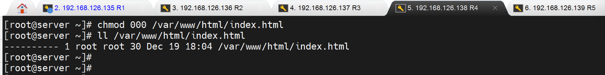


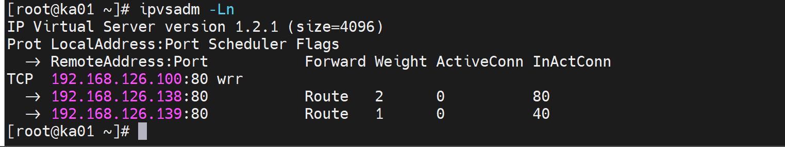


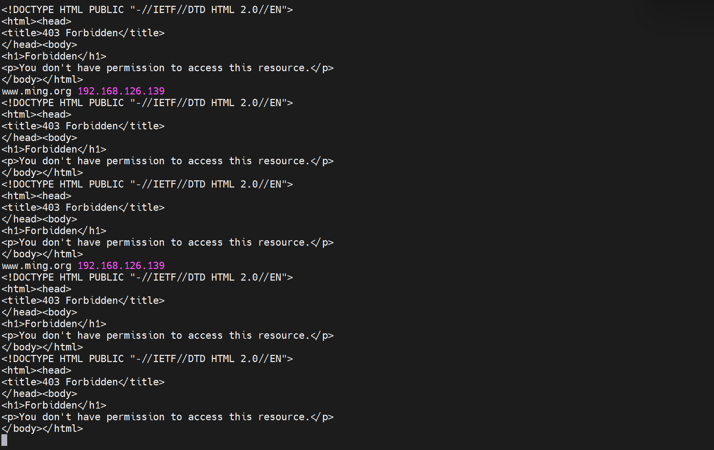


**tcp通的，但是httpd挂了，nc模拟了一个80**

192.168.126.138上 stop httpd，nc一个80

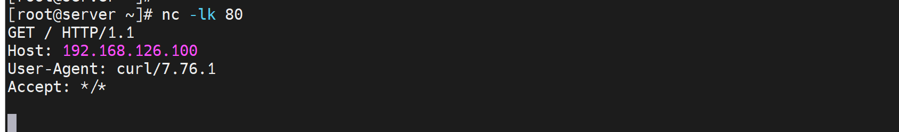

然后测试的时候curl带上timeout超时选项


### mod_ssl会自动生成证书不用自己动手

安装mod_ssl后httpd的443就打开了


本来是vs就写了一个80，现在多了一个443

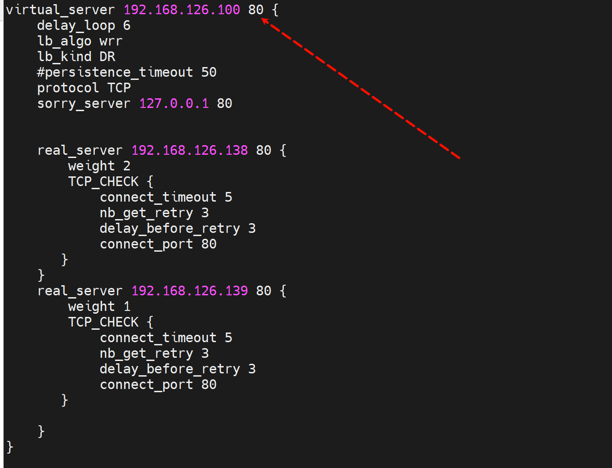

没有必要再写一个大的字典，可以利用防火墙标签整合


```bash
iptables -t mangle -A PREROUTING -d 192.168.126.100 -p tcp -m multiport --dports 80,443 -j MARK --set-mark 6
```

```bash
virtual_server fwmark 6 {
    delay_loop 3
    # 改为rr后下面的weight 就不生效了，就是1:1rr了
    lb_algo rr
    lb_kind DR
    #persistence_timeout 50
    protocol TCP
    sorry_server 127.0.0.1 80


    real_server 192.168.126.138 80 {
        weight 2
        HTTP_GET {
            url {
              path /index.html
              status_code 200
            }
            connect_timeout 1
            nb_get_retry 3
            delay_before_retry 1
        }
    }
    real_server 192.168.126.139 80 {
        weight 1
        HTTP_GET {
            url {
              path /index.html
              status_code 200
            }
            connect_timeout 1
            nb_get_retry 3
            delay_before_retry 1
        }
    }
}


```

### 此时就根据防火墙标签来转发了

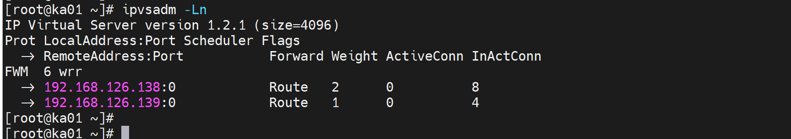


### 做两个VIP对应两个业务A/A


```bash
iptables -t mangle -A PREROUTING -d 192.168.126.101 -p tcp -m multiport --dports 80,443 -j MARK --set-mark 6

```


```bash
virtual_server fwmark 7 {
    delay_loop 3
    lb_algo rr
    lb_kind DR
    #persistence_timeout 50
    protocol TCP
    sorry_server 127.0.0.1 80


    real_server 192.168.126.138 80 {
        weight 2
        HTTP_GET {
            url {
              path /index222.html
              status_code 200
            }
            connect_timeout 1
            nb_get_retry 3
            delay_before_retry 1
        }
    }
    real_server 192.168.126.139 80 {
        weight 1
        HTTP_GET {
            url {
              path /index222.html
              status_code 200
            }
            connect_timeout 1
            nb_get_retry 3
            delay_before_retry 1
        }
    }
}


```

```bash
ifconfig lo:2 192.168.126.101 netmask 255.255.255.255  #broadcast 192.168.126.101 up
```

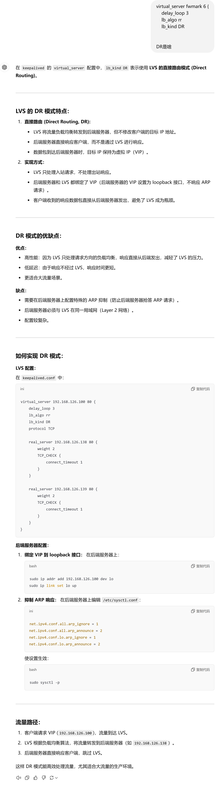

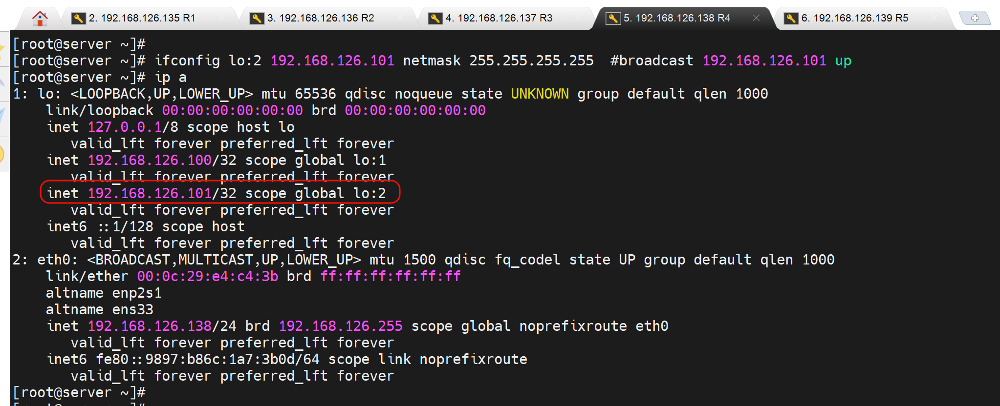


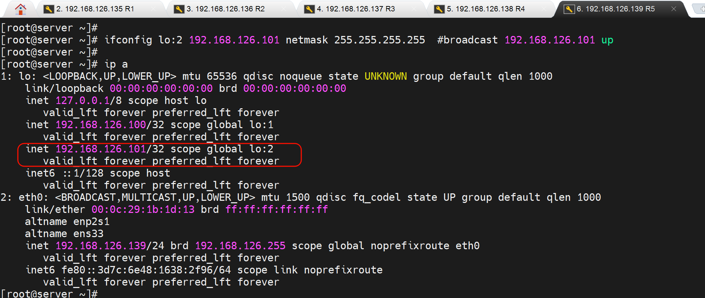

内核之前最192.168.126.100这个VIP的DR模式已经修改过了

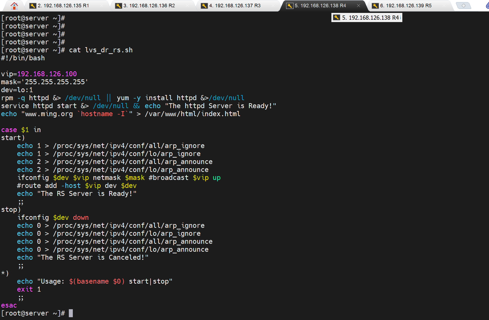


测试

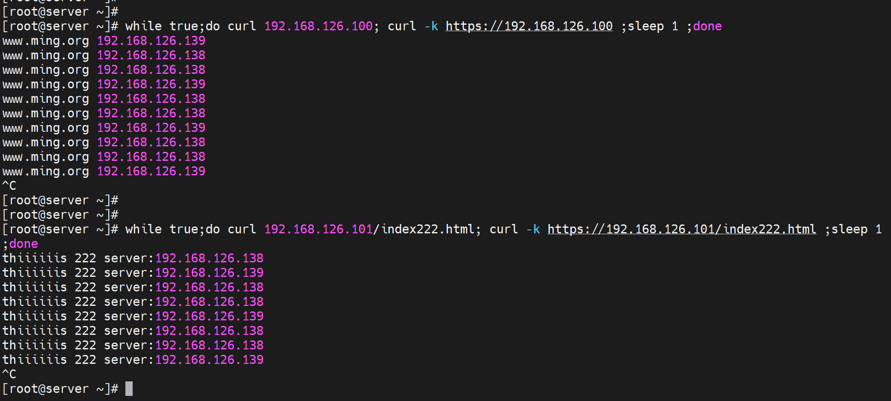


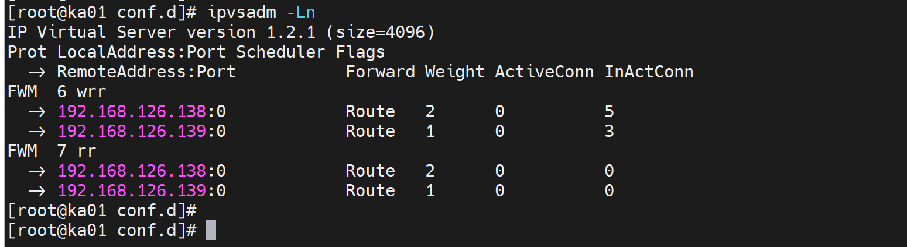


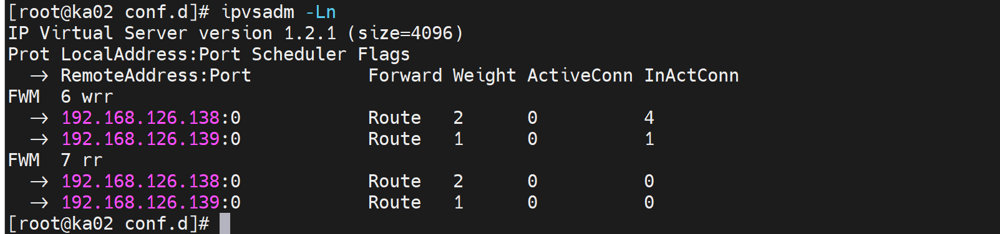


问题是：FWM 7 rr 不是应该1:1嘛

iptables标签打错了，👇192.168.126.101应该达成7的

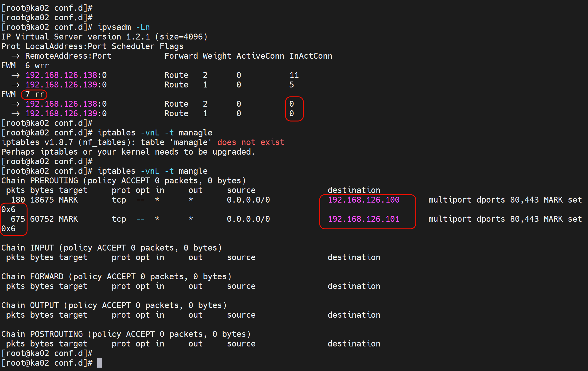


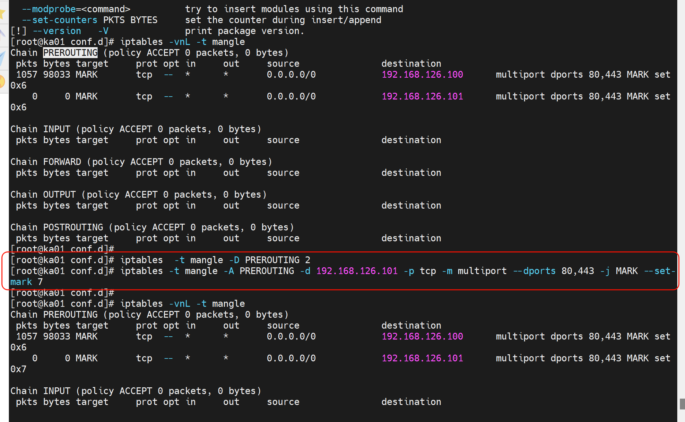


第二台keepalived一样


这就wrr和rr都OK了

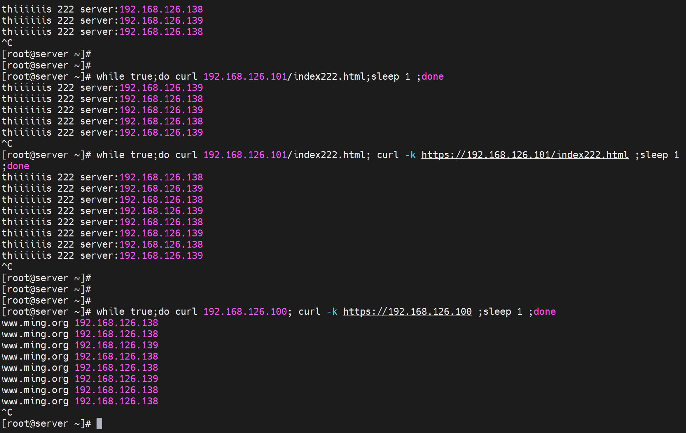


192.168.126.100这个VIP是 iptables打标未6 走的wrr

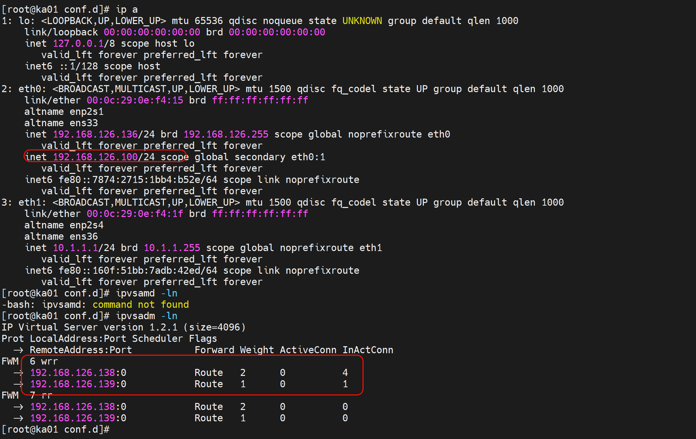


192.168.126.101这个VIP是落在ka02上，iptables打标未7走的rr

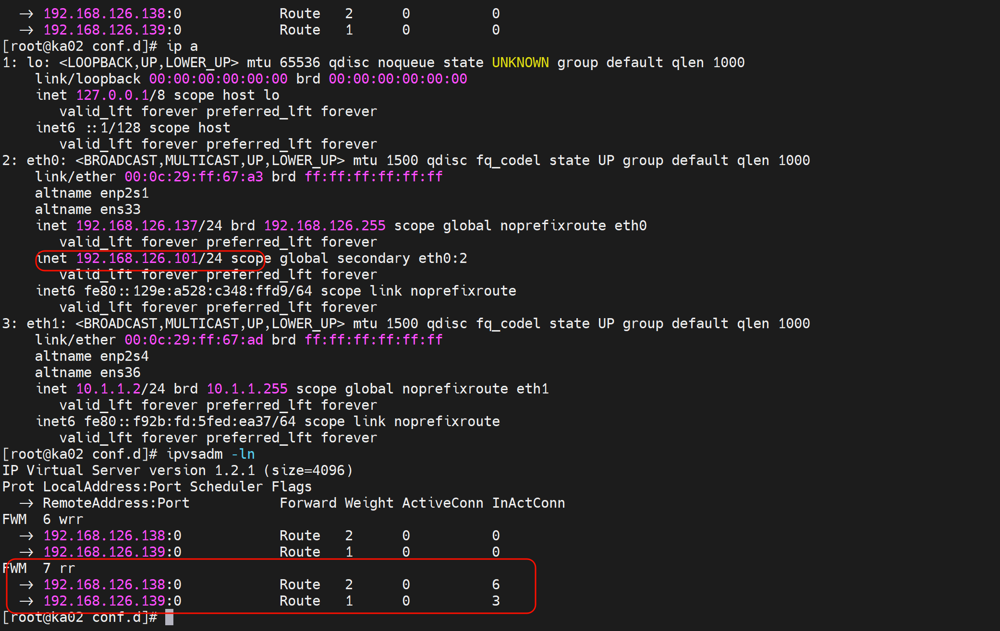

注意👆虽然2:1 但由于是rr，所以weight不生效的。


 			
