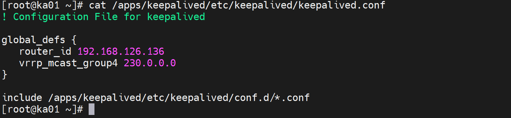
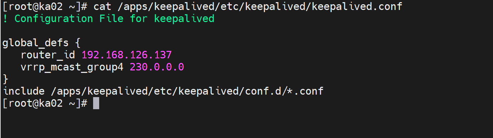
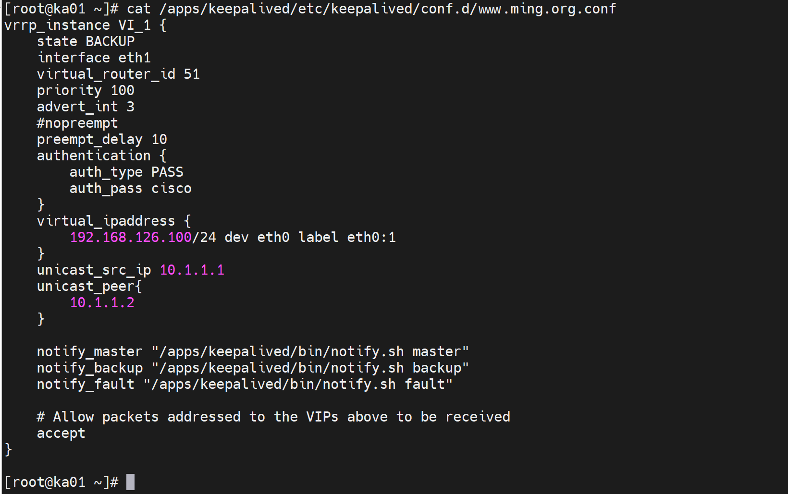
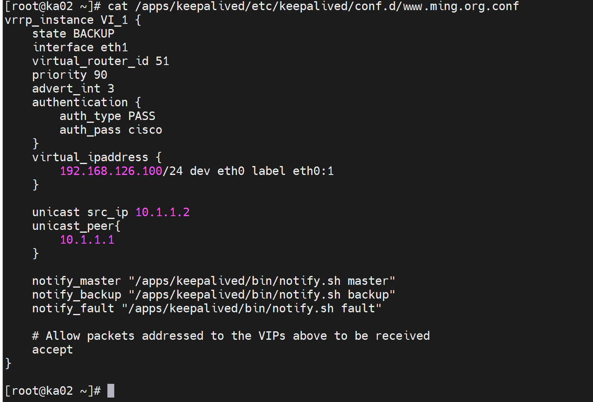
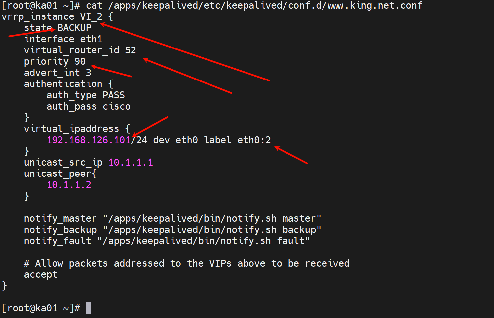
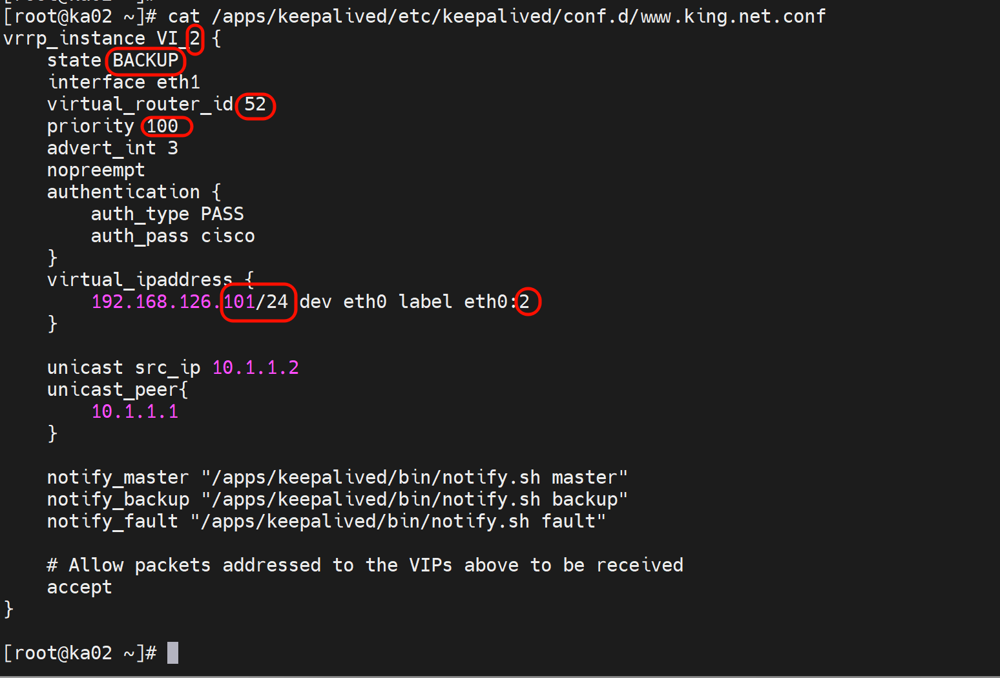
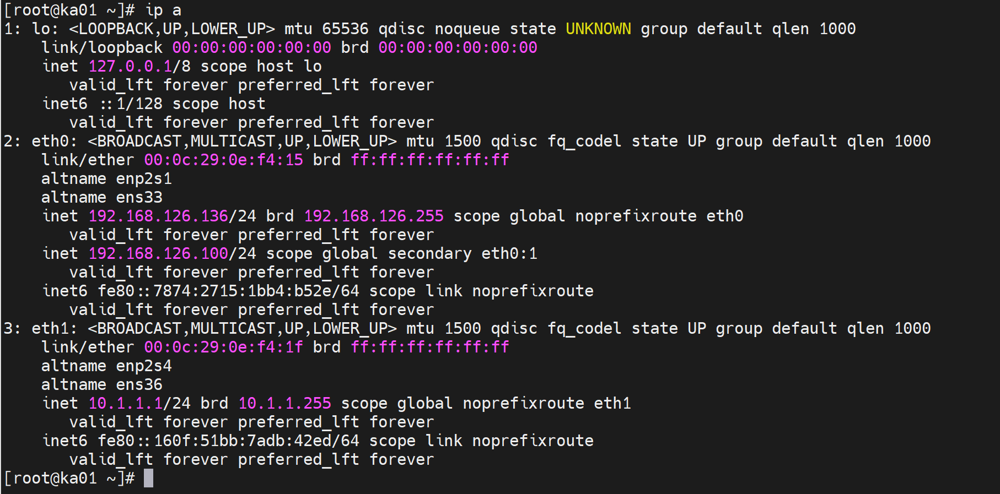
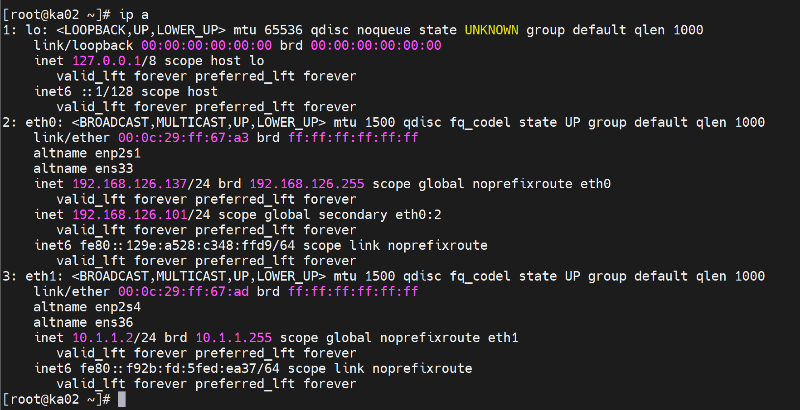
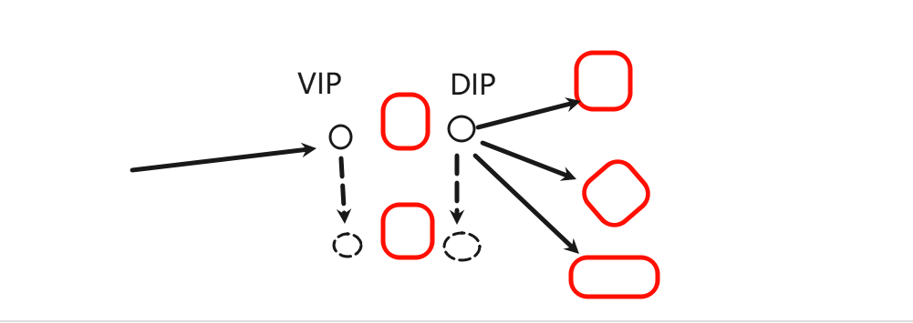

# 5.Keepalived多主模式和实现LVS.md


# 双主模型

两台节点不浪费

其实就是多业务的A/A了，就好比ECMP其实是多用户的链路负载分担咯。


1、主配置文件不变







2、子配置文件跟着业务走也就是一个站点一个子配置文件一个VIP



上图改为nopreempt降低回切导致闪断。





再做第二个站点的子配置文件







重启keepalived服务后

让192.168.126.100落在ka001上，让192.168.126.102落在ka002上👇







# 同步组

ASA里的failover里有个端口组，不知道是不是一个概念。


VIP 要能票，DIP也要能飘




```bash
vrrp_sync_group VG_1 {
	group {  # 成为一个group后，要飘就一块飘了。
		VI_1 # name of vrrp_instance (below)
		VI_2 # One of each moveable IP
	}
	vrrp_instance VI_1 {
		eth0
		vip
	}
	vrrp_instance VI_2 {
		eth1
		dip
	}
}
```


# keepalive内嵌LVS规则

LVS单点问题，和健康检测问题

lvs 以前要用ipvsadmin工具来 编辑转发规则。

```bash
ipvsadmin -A -t vip:80 -s rr; ipvsadmin -a -t vip:80 -r rip1:80 -m|g|i （nat|gatway|tunnel） 
```

keepalived里内置的lvs，无需再依赖ipvsadmin来创建规则，直接用keepalive的配置文件就行。不过可以用ipvadmin来看看已经创建的规则。


keepalive内嵌lvs规则，必然保持lvs的对外IP和VRRP里的VIP一致

VRRP的VIP收到用户请求，然后就匹配virtual_server IP port 语句块，来调度到后端实例。


