# 2.Redis工作机制和编译安装.md


# redis特性

速度快：10W QPS ，基于内存，C语言实现

单线程

持久化

支持多种数据结构

支持多种编程语言

功能丰富：支持Lua脚本，发布订阅，事务，pipline等功能

简单：代码短小精悍(单机核心代码只有23000行左右)，单线程开发容易，不依赖外部库，使用简单

主从复制

支持高可用和分布式


# redis的单线程


6.0版本之前都是单线程：开一个独立的线程 处理用户的请求，一次性在同一时间一次性只能接收一个指令的操作。


get：好比mysql的select

set：类似mysql的update


单线程速度也非常快  [纯内存、非阻塞、无线程间切换、Epoll实现IO多路复用 ]：10W QPS，因为是基于内存且是C写的。是微秒级

而且单线程还避免了 阻塞问题 mysql里有讲过,mysql有一个锁机制，行级锁和表级锁。有人更新行/表，第二个人就得等待，这就是阻塞。而redis本身就是单线程的，就省掉了多线程的加锁/解锁过程。


也避免了多线程之间的切换过程，

Epoll是I/O多路复用模型，即使单线程也可以在I/O层面做到并发。

并发：一起发出去请求，但是执行可能就是处理的够快，或者有等待 队列机制 来支撑 请求方的并发。

并行：那个时间点的同时进行。


缺点：

单线程，只能工作在一核上，其余的多核就浪费了。应对这种，可以用redis多实例来实现多线程？

其实还有超线程，还有httpd的三种工作模型，还有和cpu核绑定的都是线程。还有我之前端口扫描的多进程和多线程双重并发。


一般内存16G 32G，再大，就拆开来多个redis实例来弄了，多个redis实例，分别各自是单线程的，然后绑到CPU多个核上去。比如有一个很大的数据100G，就推荐用4个redis实例分别绑到不同的核上来处理。


### 关于redis的单线程进一步说明


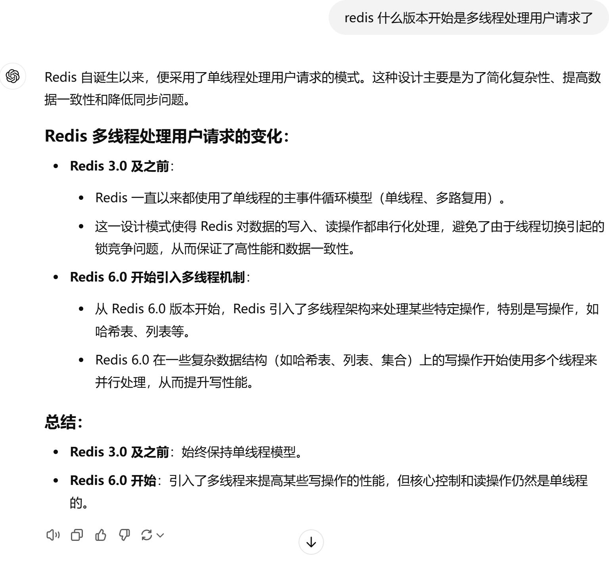


还有redis的单线程是 对接用户数据的时候的单线程处理，是读写操作的单线程；其他环节不是单线的：

1、数据的持久化：就需要redis单开一个另外的线程来独立完成

2、主从复制，也单开线程

3、等等，所整体来讲redis是多线程的。

4、一般提到redis就说单线程，指的是用户请求的读写操作的单线程。

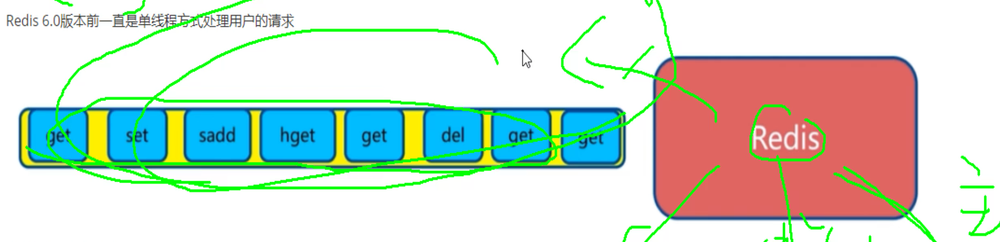


这个处理用户请求的就是单线程，所以个get的时间就不能太长


一般处理这些get set sadd hget del 都很快，但确实也有耗时长的时候，就像mysql中select * from large_table;这种大表全表扫描一下就很慢了。

redis也有这种全表查看的动作，这种操作必然会照成性能下降，比如32G的内存，全扫一遍，肯定快不了啦。

所以生成中 禁止 执行(慢)命令

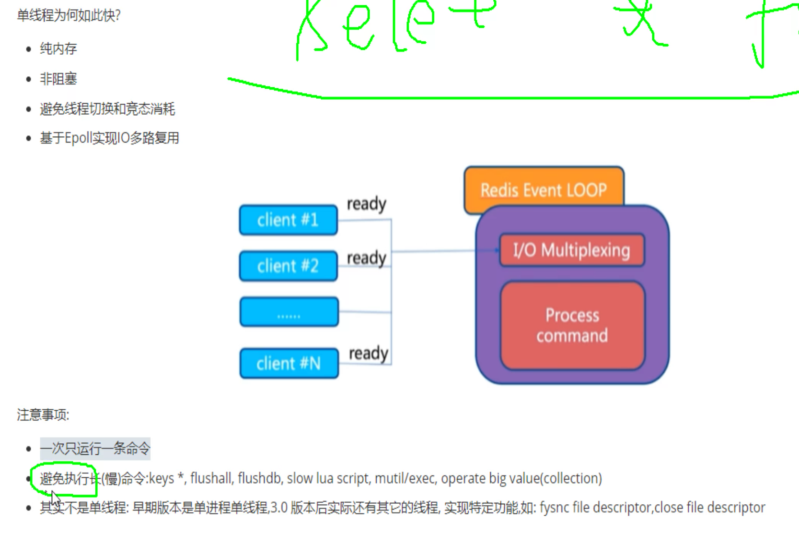

keys *就是说key vlues了，要给动作耗时太长，在实际业务逻辑中可能就会调度查询到其他DB比如请求动作处理太久(判定为redis没有该数据)，就让他查mysql去了。

1、优先访问redis

2、redis查找不到了(必然有一个timeout判定的，不然你查一辈子~)，就访问mysql

3、redis很多时候作为缓存存在的。

4、redis的性能可达到10W并发，mysql是2K并发，结果redis的一个timeout导致10W并发都打到mysql上去了。mysql必然崩了。


### redis 对比 Memcached

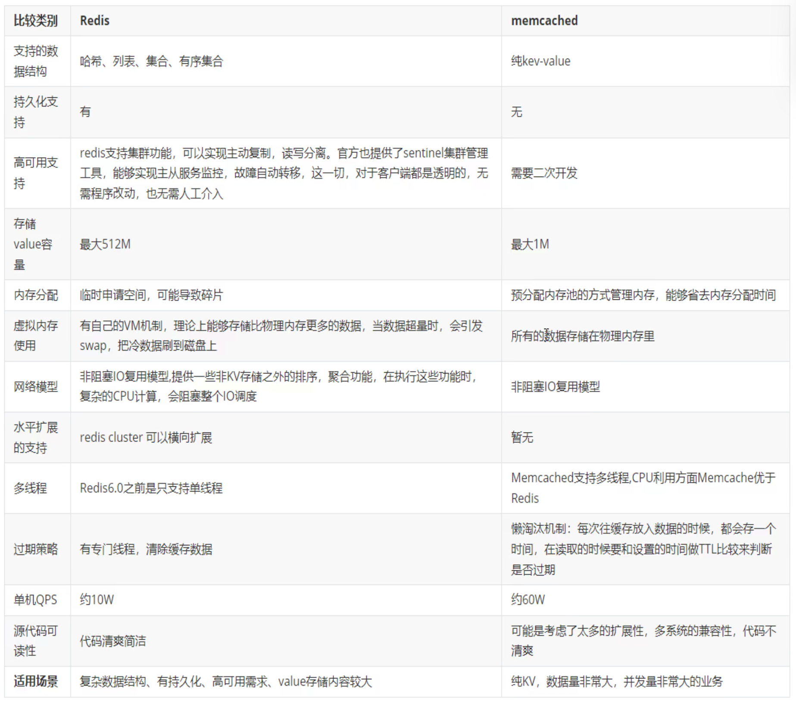


memcached 比 redis 唯一一个优点就是块60W的QPS，但是其他各个方面都是弱的较之redis。


### redis的应用场景是非常多的


## 缓存的实现流程

1、写操作，先往mysql里写，一旦写成功了，就会同步到redis里

2、读操作，先到redis里读，一旦读不到，就会去mysql里找，mysql里找到了，就会同步一份给redis。

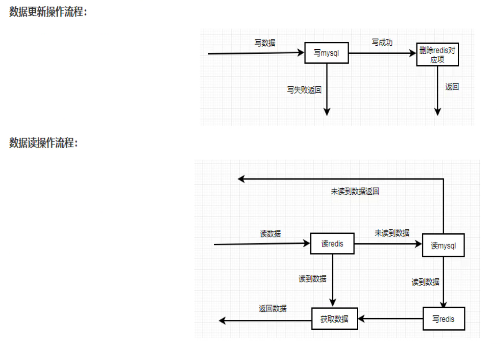


## 缓存穿透，缓存击穿和缓存雪崩


### 穿透

缓存和数据库中 都没有的数据，而用户不断发起请求，比如：发起id为"-1"的数据或id为特别大不存在的数据，这时的用户很可能是攻击者，攻击会导致数据库压力过大。

解放方法：

​	接口层增加校验，入用户鉴权校验，id做基础校验，id<=0的直接拦截

​	从缓存取不到的数据，在数据库中也没有取到，这时也可以将key-value对写为key-null，缓存有效时间可以设置短点，如30s(设置太长会导致正常情况也没法使用)，这样额可以防止攻击用户反复用同一个id暴力攻击。


   \#  这个key-null很有意思的，key-null必须结合30s这种短时控制，以达到如下效果：

黑客查询id=666的这种实际不存在的商品数据，大量高频请求，为了防止请求到达后端mysql，于是在redis里设置key-null这种键值对，让redis直接有了一个结果返给请求方，并且为了防止id=666的数据后面真的来了，所以30s以后id=666的key-null就老化掉了，于是redis没有数据，就又会转发给mysql了，此时就实现了类似惩罚机制---sw登入多次30s的一个禁止登入一样就有点像。


### 击穿

缓存中没有，但数据库中有的数据，比如：热点数据的缓存时间到期后，这时由于并发用户特别多，同时读缓存没读到数据，又同时去数据库取数据，引起数据库压力瞬间增大，造成业务无法正常响应。

解决方法：

​	设置热点数据永远不过期。  

​	# 个人解读： 乍一看，肯定想 这是错误的思维方式，没有永远不过期的热点数据，也许热点只是不同数据的标签而已，数据A可以携带热点标签大概3个月，或者一直持续保持热度的话题，也许这就是热点数据永不过期的另一层含义了吧。


### 雪崩

缓存中数据大批量到过期时间，而查询数据量巨大，引起数据库压力过大甚至down机。和缓存击穿不同的是，缓存击穿指并发查同一条数据，缓存雪崩是 不同数据都过期了，很多数据都查不到从而查数据库。


解决方法：
	缓存数据的过期时间设置随机，防止同一时间大量数据一起过期现象发生

​	如果缓存数据库是分布式部署，将热点数据均匀分布在不同的缓存数据库中

​	设置热点数据永不过期。


## redis内置了pipeline的功能

jenkins、cicd、gitrunner都会提到流水线pipeline


redis客户端执行一条命令分4个过程：

发送命-->命令排队-->命令执行-->返回结果

这个过程称为RTT(Round trip time 往返时间)，mget,mset指令可以一次性的批量对多个数据的只能怪操作，所以有效节约了RTT；但大部分命令(如hgetall)不支持批量操作，需要消耗N次RTT，利用Pipeline技术可以解决这一问题

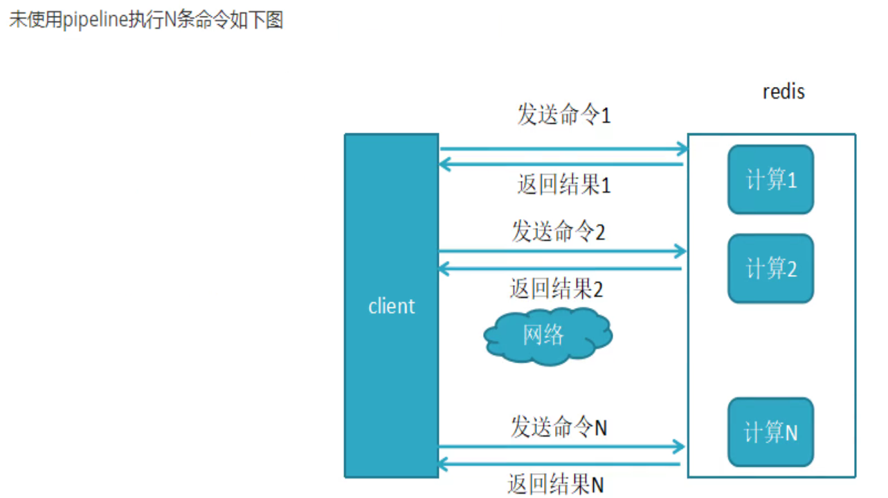 


发送命令--通常走网络传递过去，返回结果--也基本都是互联网传递回来，上海到宁波的也有20ms呢吧，而redis处理也就10ms不要基本就结束了。时间大量消耗在路上了。


如果提高用户体验呢，就是pipeline了，思路就是本来10个命令，一个个发送过去，现在10个命令合成1个执行直接发送过去，这里就是节省了①tcp三次握手的时间②数据报文的头部消耗提高了数据传输的正式有效DATA的容量比③我想到了再来编O(∩_∩)O，哦返回也是10个指令的结果合并一起返回了。④还一个redis处理四个环节，本来是10个命令，就是40次，现在变成一个命令块，也就是4次 ： 发送  -- 排队 -- 执行(命令块) --返回


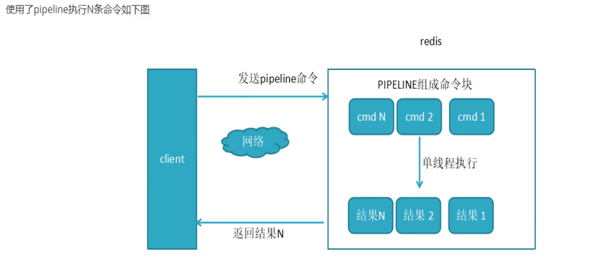


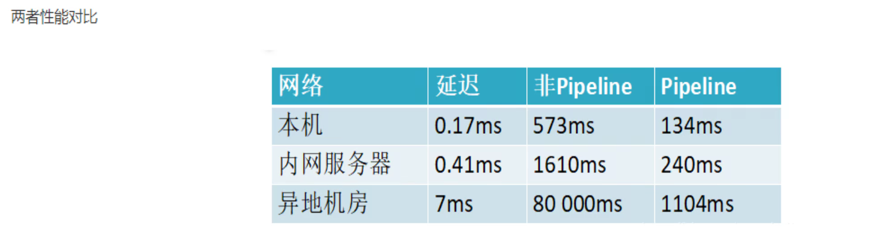


上表说明：延迟列代表 3个环境本地、内网、异地下的用户到redis之间的网络延迟。然后在这种网络延迟下 有pipeline和无pipeline的性能差异是非常大的。


# redis安装

https://redis.io/docs/getting-started/installation/

https://redis.io/docs/latest/operate/oss_and_stack/install/install-stack/


官网7.4的时候，yum info才6.2


## 编译安装


https://download.redis.io/releases/

这个可以看到各个版本明细

rc版本不要用，是候选版本也就是测试版


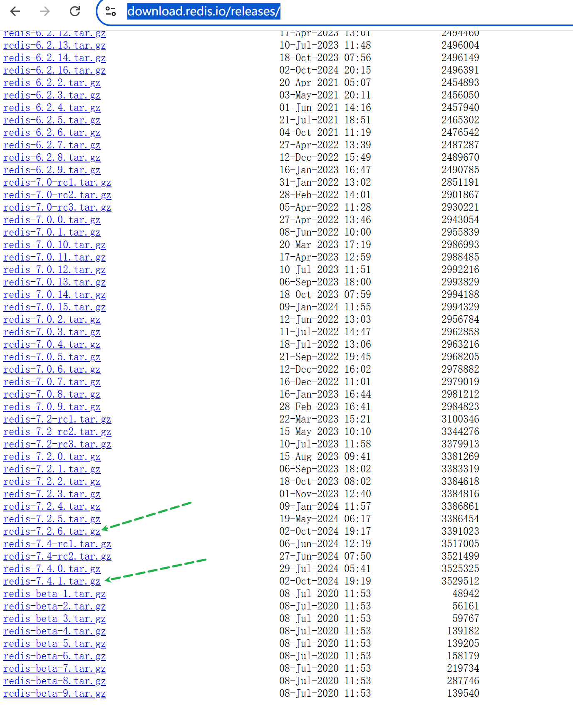


https://redis.io/docs/getting-started/installation/install-redis-from-source/

https://redis.io/docs/latest/operate/oss_and_stack/install/install-redis/install-redis-from-source/


```bash
# ubuntu
apt update & apt -y install make gcc libjemalloc-dev libsystemd-dev

# centos rocky
yum -y install gcc make jemalloc-devel systemd-devel

wget https://download.redis.io/releases/redis-7.4.1.tar.gz
tar xvf redis-7.4.1-tar.gz

cd redis-7.4.1
make -j 16 PREFIX=/apps/redis install
# 支持systemd，需要加选项👇
make -j 16 PREFIX=/apps/redis install USE_SYSTEMD=yes

# redis的源码安装无需./configure和make，就是直接make install 👆

echo 'PATH=/apps/redis/bin:$PATH' > /etc/profile.d/redis.sh
. /etc/profile.d/redis.sh

# 创建配置文件、日志、数据等目录
mkdir /apps/redis/{etc,log,data,run}
cp redis.conf /apps/redis/etc/


# 启动文件叫 redis-server
# 也提供了客户端 redis-cli

```


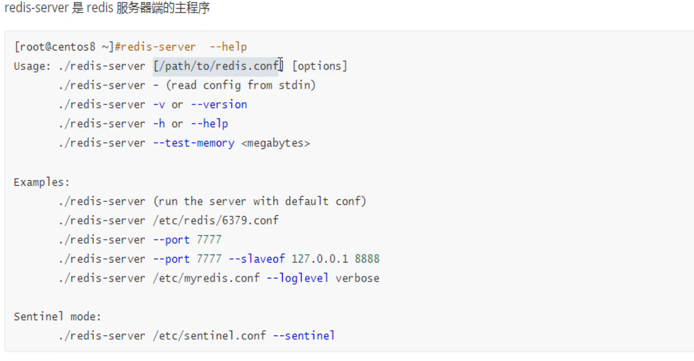

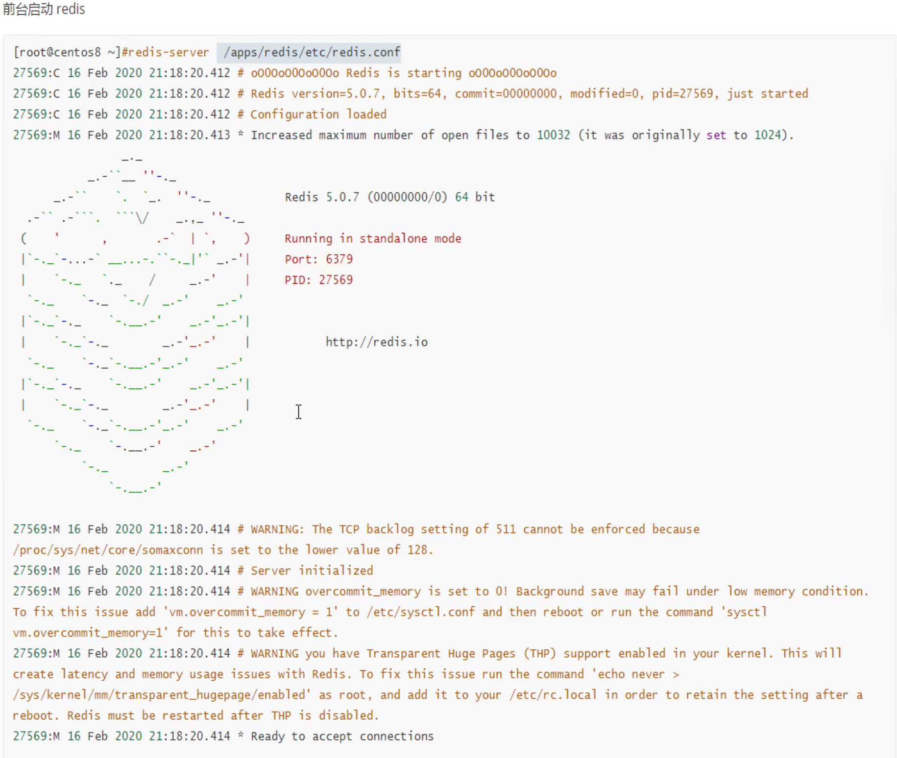

上图三个WARNING是优化，是系统没有针对redis做优化导致的，希望redis性能更好，就优化掉。


redis默认是6379端口，但是默认是127.0.0.1的，所以不支持远程连接。


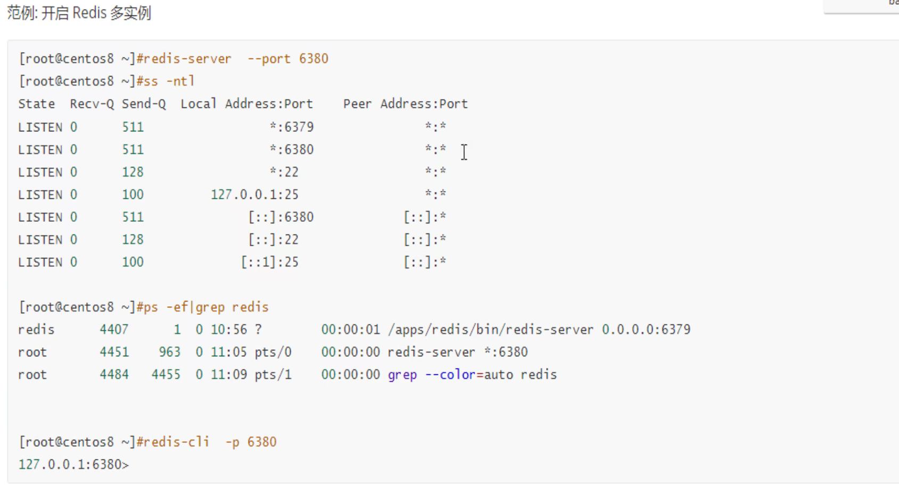


### **新版本里三个WARNING不一定有了**，处理方式如下👇


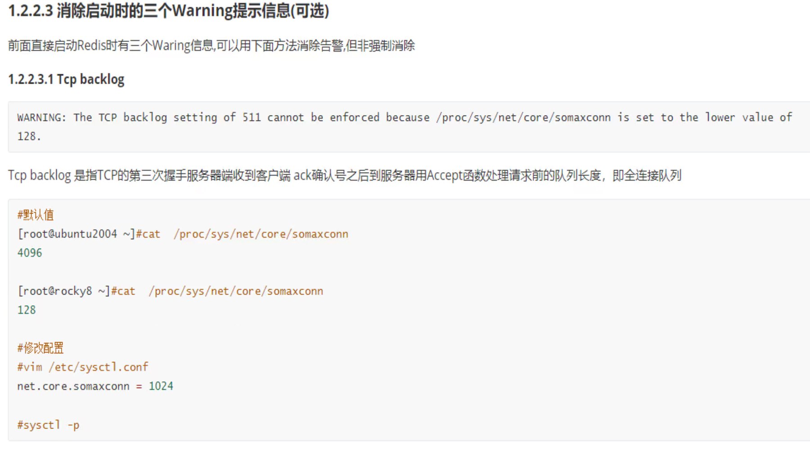


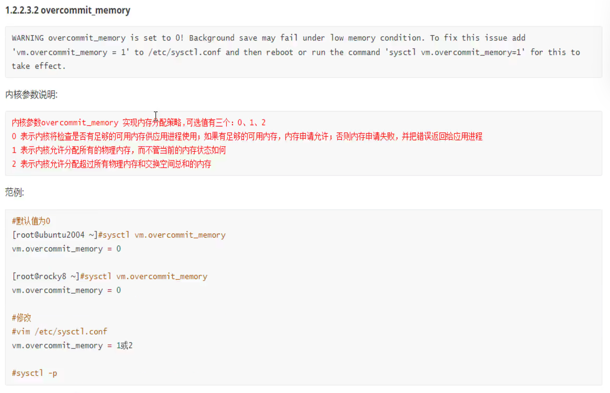


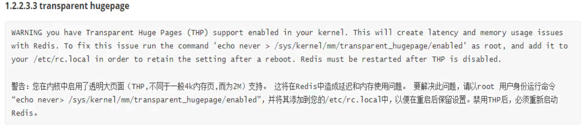


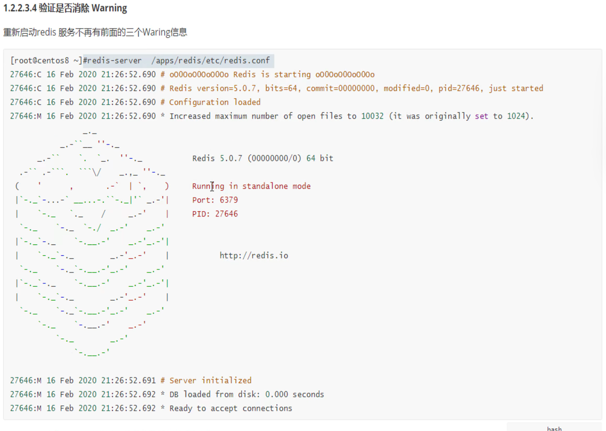


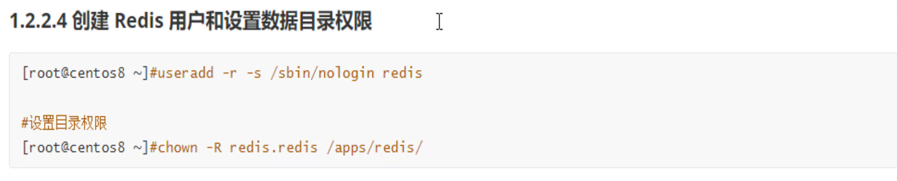

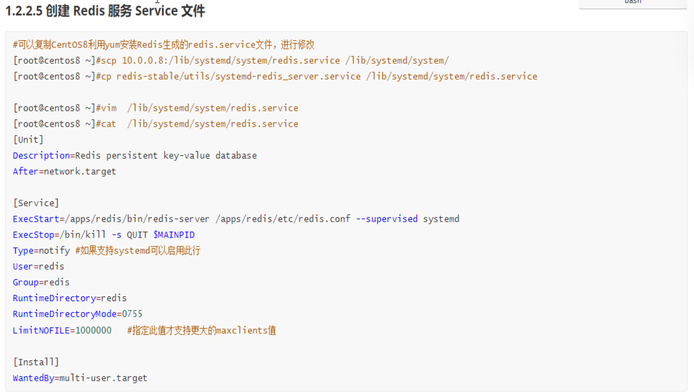

👆编译的时候加上了systemd了，所以service文件就可以加上这个选项了

type=notify，redis 可以通过systemd来发送信号通知，就需要type类型为notify，必须是支持systemd才能写notify，如果不支持systemd就不写，或者写个simple。

性能优化：LimitNOFILE=xxxx，打开文件个数。


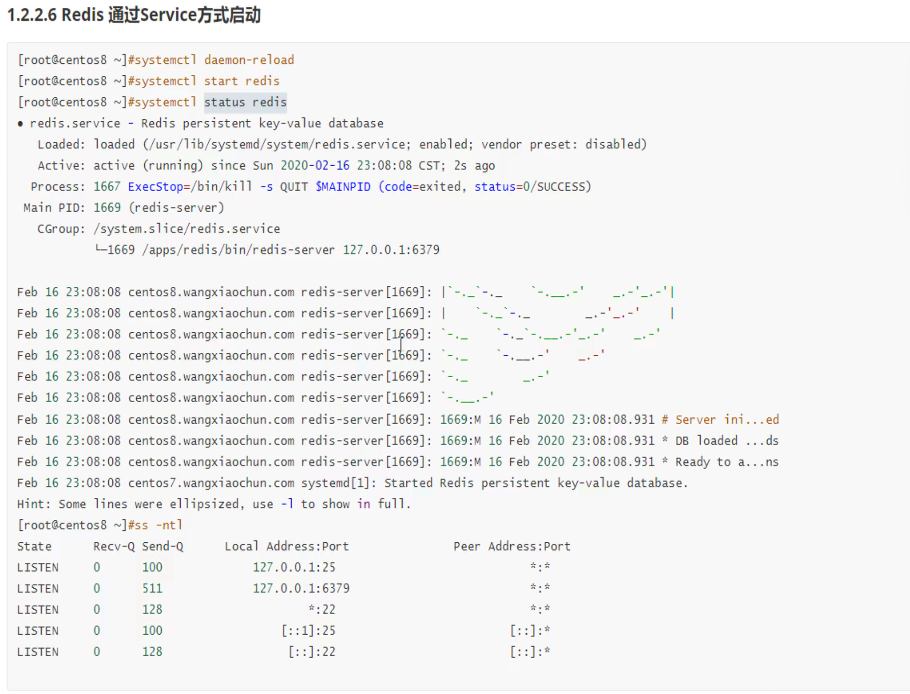


### redis安装脚本

```bash
#!/bin/bash
#
#********************************************************************
#
#********************************************************************

#本脚本支持在线和离线安装

REDIS_VERSION=redis-7.4.1
#REDIS_VERSION=redis-7.0.7
#REDIS_VERSION=redis-7.0.3
#REDIS_VERSION=redis-6.2.6
#REDIS_VERSION=redis-4.0.14

# redis推荐设置密码，不配也没关系
PASSWORD=123456
INSTALL_DIR=/apps/redis

CPUS=`lscpu |awk '/^CPU\(s\)/{print $2}'`

. /etc/os-release

color () {
    RES_COL=60
    MOVE_TO_COL="echo -en \\033[${RES_COL}G"
    SETCOLOR_SUCCESS="echo -en \\033[1;32m"
    SETCOLOR_FAILURE="echo -en \\033[1;31m"
    SETCOLOR_WARNING="echo -en \\033[1;33m"
    SETCOLOR_NORMAL="echo -en \E[0m"
    echo -n "$1" && $MOVE_TO_COL
    echo -n "["
    if [ $2 = "success" -o $2 = "0" ] ;then
        ${SETCOLOR_SUCCESS}
        echo -n $"  OK  "    
    elif [ $2 = "failure" -o $2 = "1"  ] ;then 
        ${SETCOLOR_FAILURE}
        echo -n $"FAILED"
    else
        ${SETCOLOR_WARNING}
        echo -n $"WARNING"
    fi
    ${SETCOLOR_NORMAL}
    echo -n "]"
    echo 
}


prepare(){
    if [ $ID = "centos" -o $ID = "rocky" ];then
        yum  -y install gcc make jemalloc-devel systemd-devel
    else
        apt update 
        apt -y install  gcc make libjemalloc-dev libsystemd-dev
    fi
    if [ $? -eq 0 ];then
        color "安装软件包成功"  0
    else
        color "安装软件包失败，请检查网络配置" 1
        exit
    fi
}

install() {   
    if [ ! -f ${REDIS_VERSION}.tar.gz ];then
        wget http://download.redis.io/releases/${REDIS_VERSION}.tar.gz || { color "Redis 源码下载失败" 1 ; exit; }
    fi
    tar xf ${REDIS_VERSION}.tar.gz  -C /usr/local/src
    cd /usr/local/src/${REDIS_VERSION}
    make -j $CUPS USE_SYSTEMD=yes PREFIX=${INSTALL_DIR} install && color "Redis 编译安装完成" 0 || { color "Redis 编译安装失败" 1 ;exit ; }

    ln -s ${INSTALL_DIR}/bin/redis-*  /usr/local/bin/
    # 放在/usr/local/bin里比 /usr/bin里要好，因为/usr/bin都是系统的。而local/bin通常都是空的，后面自己的东西放里面比较清爽。
    
    mkdir -p ${INSTALL_DIR}/{etc,log,data,run}
  
    cp redis.conf  ${INSTALL_DIR}/etc/
    
	# 这是安装的时候顺便修改配置文件了，首次学习接触，可以先注释掉下面的sed语句：
    #sed -i -e 's/bind 127.0.0.1/bind 0.0.0.0/'  -e "/# requirepass/a requirepass $PASSWORD"  -e "/^dir .*/c dir ${INSTALL_DIR}/data/"  -e "/logfile .*/c logfile ${INSTALL_DIR}/log/redis-6379.log"  -e  "/^pidfile .*/c  pidfile ${INSTALL_DIR}/run/redis_6379.pid" ${INSTALL_DIR}/etc/redis.conf


    if id redis &> /dev/null ;then 
         color "Redis 用户已存在" 1 
    else
         useradd -r -s /sbin/nologin redis
         color "Redis 用户创建成功" 0
    fi

    chown -R redis.redis ${INSTALL_DIR}
    
	
	# 这是3个WARNING的优化，首次学习redis，可以先注释掉：
    #cat >> /etc/sysctl.conf <<EOF
#net.core.somaxconn = 1024
#vm.overcommit_memory = 1
#EOF
    #sysctl -p 
    #if [ $ID = "centos" -o $ID = "rocky" ];then
    #    echo 'echo never > /sys/kernel/mm/transparent_hugepage/enabled' >> /etc/rc.d/rc.local
    #    chmod +x /etc/rc.d/rc.local
    #    /etc/rc.d/rc.local 
    #else 
    #    echo -e '#!/bin/bash\necho never > /sys/kernel/mm/transparent_hugepage/enabled' >> /etc/rc.local
    #    chmod +x /etc/rc.local
    #    /etc/rc.local
    #fi


cat > /lib/systemd/system/redis.service <<EOF
[Unit]
Description=Redis persistent key-value database
After=network.target

[Service]
ExecStart=${INSTALL_DIR}/bin/redis-server ${INSTALL_DIR}/etc/redis.conf --supervised systemd
ExecStop=/bin/kill -s QUIT \$MAINPID
Type=notify
User=redis
Group=redis
RuntimeDirectory=redis
RuntimeDirectoryMode=0755
LimitNOFILE=1000000

[Install]
WantedBy=multi-user.target

EOF
     systemctl daemon-reload 
     systemctl enable --now  redis &> /dev/null 
     if [ $? -eq 0 ];then
         color "Redis 服务启动成功,Redis信息如下:"  0 
     else
        color "Redis 启动失败" 1 
        exit
     fi
     sleep 2
     redis-cli -a $PASSWORD INFO Server 2> /dev/null
}

prepare 

install 

```


运行上面的安装脚本，安装成功，并且该脚本也显示了redis的信息👇

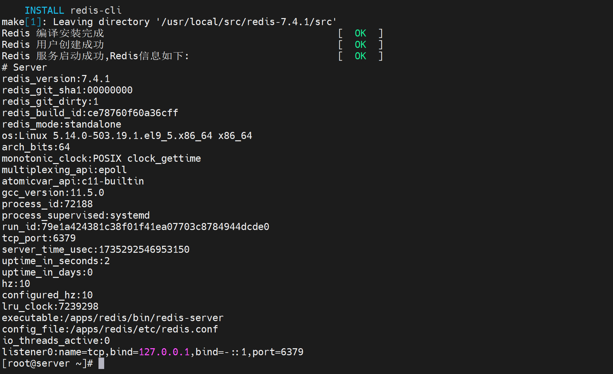

观察日志

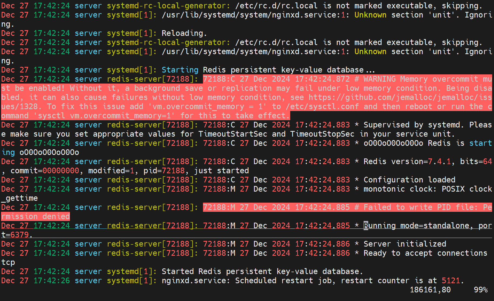


没有做优化，所以监听在127上的

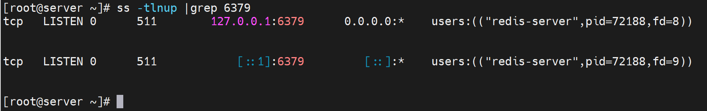


下一篇再 继续 优化之类


