# 4.Redis程序访问和多实例.md


# shell写入redis的效率

RDB化临时开一下👇，防止和上一篇python写入的时候一样报错写到322个就不行了。

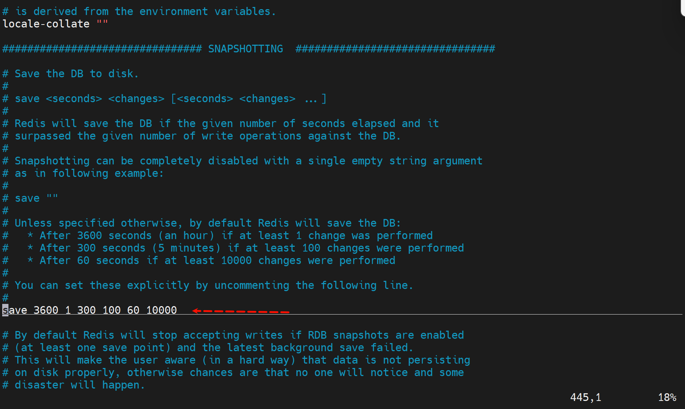

然后尝试禁用 `stop-writes-on-bgsave-error`，以避免 Redis 因 RDB 快照失败而阻止写操作： 在 Redis 配置文件 `redis.conf` 中，找到以下配置项并将其设置为 `no`：👇

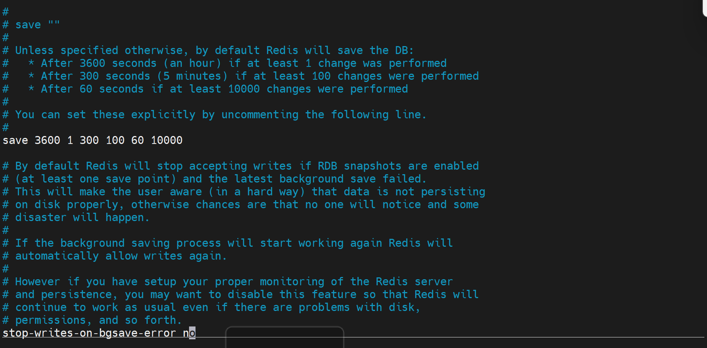


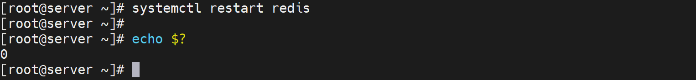


```bash
#!/bin/bash
#
#*****************************************************************
#Author:            oneyearice
#QQ:                123456789
#Date:              2024-12-30
#FileName:          redis_test.sh
#URL:               https://www.oneyearice.github.io
#Description:       The test script
#Copyright(C):     All rights reserved
#*****************************************************************
NUM=10000
PASS=
HOST=127.0.0.1
PORT=6379
DATABASE=0


for i in `seq $NUM`;do
    redis-cli -h ${HOST} -p ${PORT} -n ${DATABASE} --no-auth-warning set key${i} value${i}
done
echo"$NUM个key写入到Redis完成"
~

```


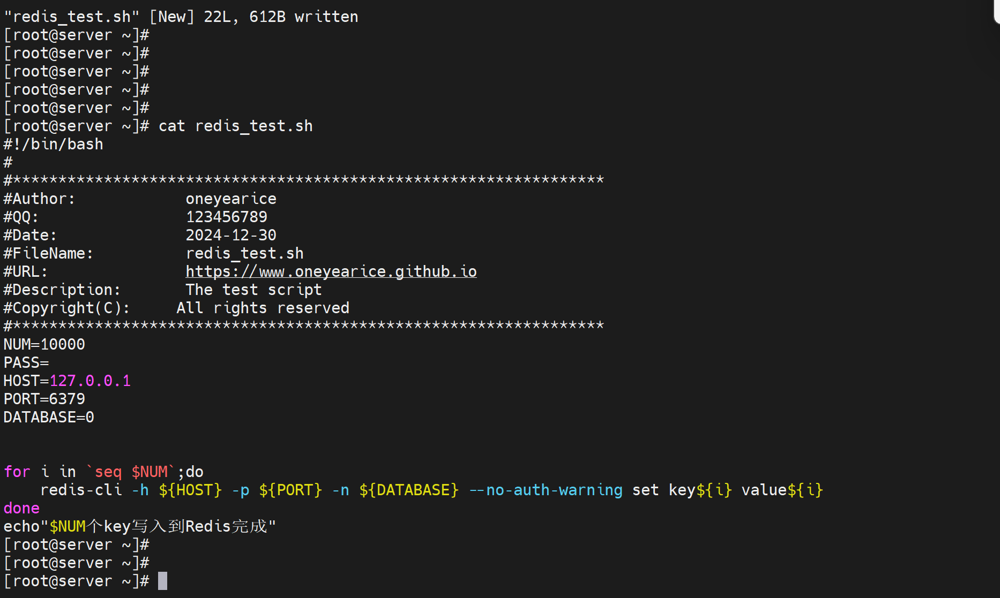


然后执行

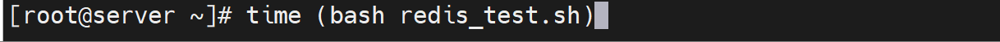

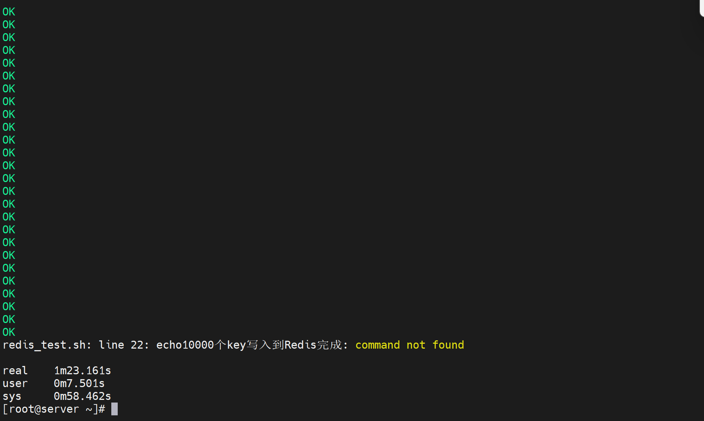

耗时1m23秒👆


然后对比执行python的10000条写入

```bash
[root@server ~]# cat redis_test.py
#!/usr/bin/python3
import redis
pool = redis.ConnectionPool(host="127.0.0.1",port=6379,decode_responses=True)
#pool = redis.ConnectionPool(host="127.0.0.1",port=6379,password="123456",decode_responses=True)
r = redis.Redis(connection_pool=pool)
for i in range(10000):
    r.set("k%d" % i,"v%d" % i)
    data=r.get("k%d" % i)
    print(data)
[root@server ~]#

```

先清空redis的所有内容

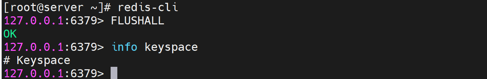

然后执行👇

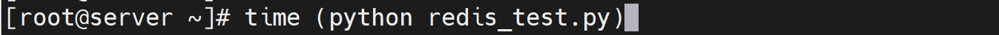

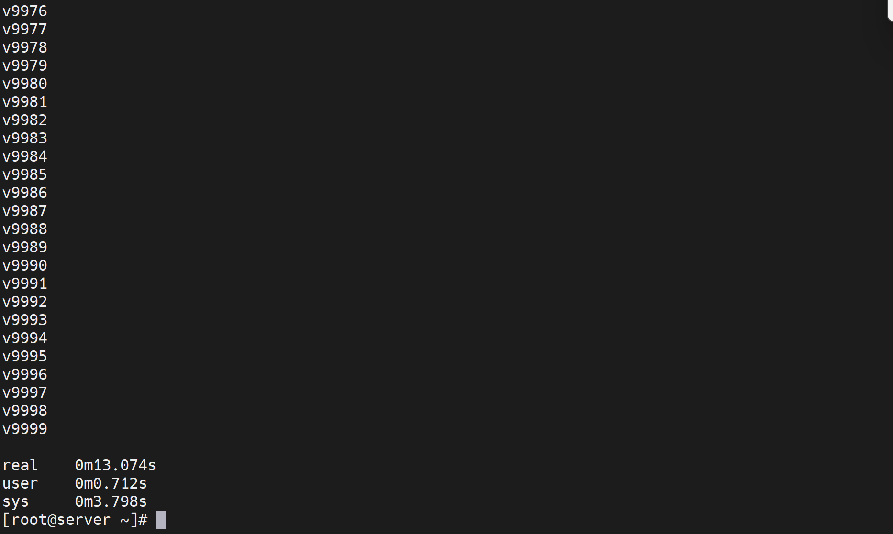

耗时13秒


如果不打开stop-writes-on-bgsave-error no 可能就需要正面处理 权限问题👇

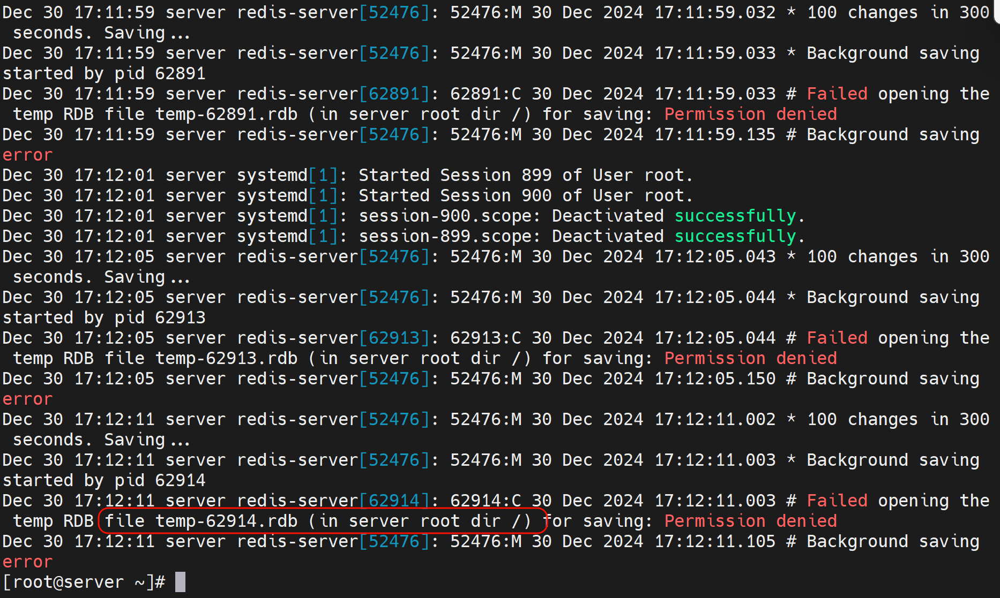

正面解决就这样也行，我就不弄了

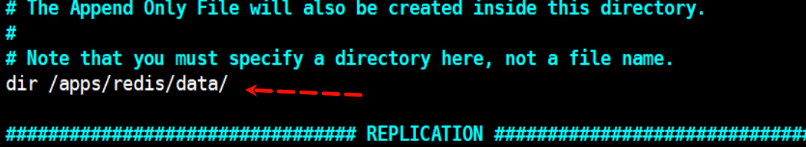 

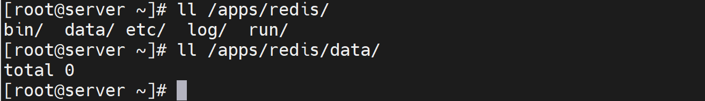 


## 图形化的redis客户端


 [redis-desktop-manager-0.8.8.384.exe](4.Redis程序访问和多实例.assets\redis-desktop-manager-0.8.8.384.exe) 


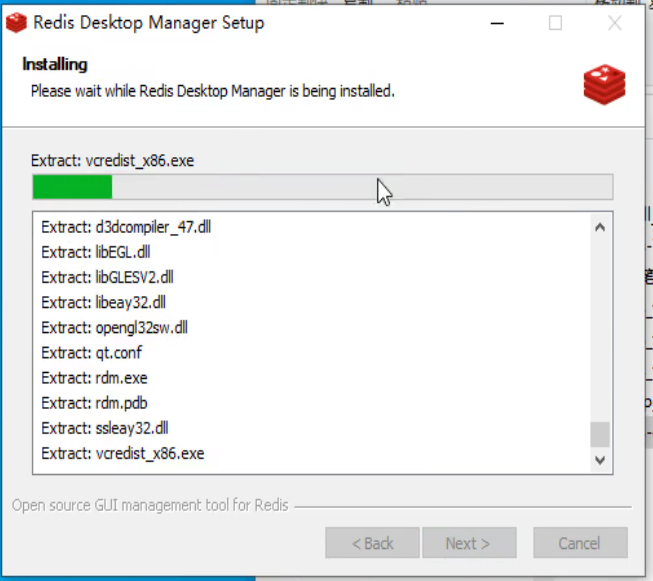


还有：https://goanother.com/cn/

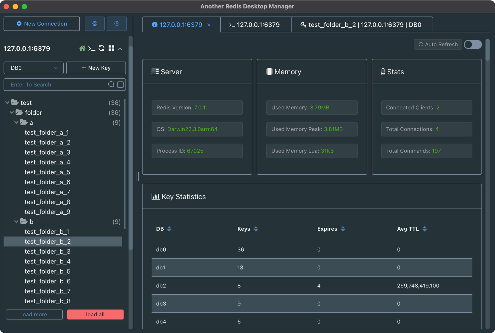


我就用第一个吧：

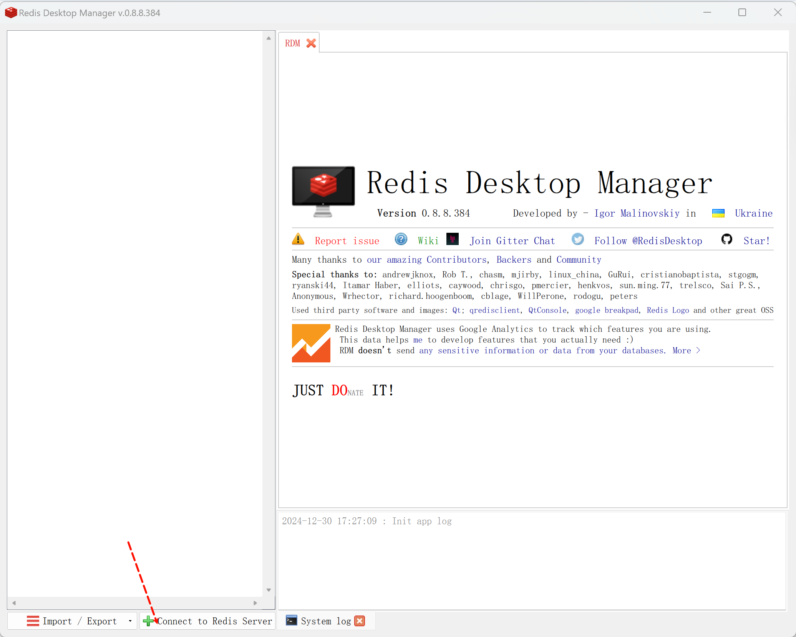


先把密码加上

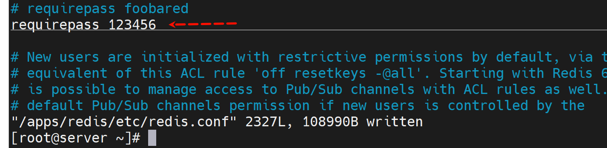 

redis没有什么用户名的修改，只有密码的修改

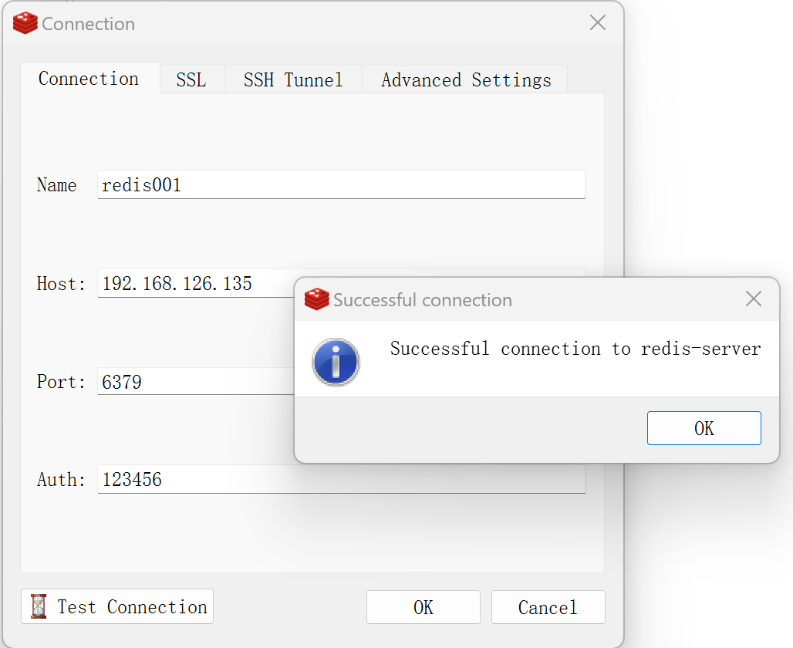 


这软件不太好，配置错误的redis001 即使修改正确后还是点不开，新建一个才行：

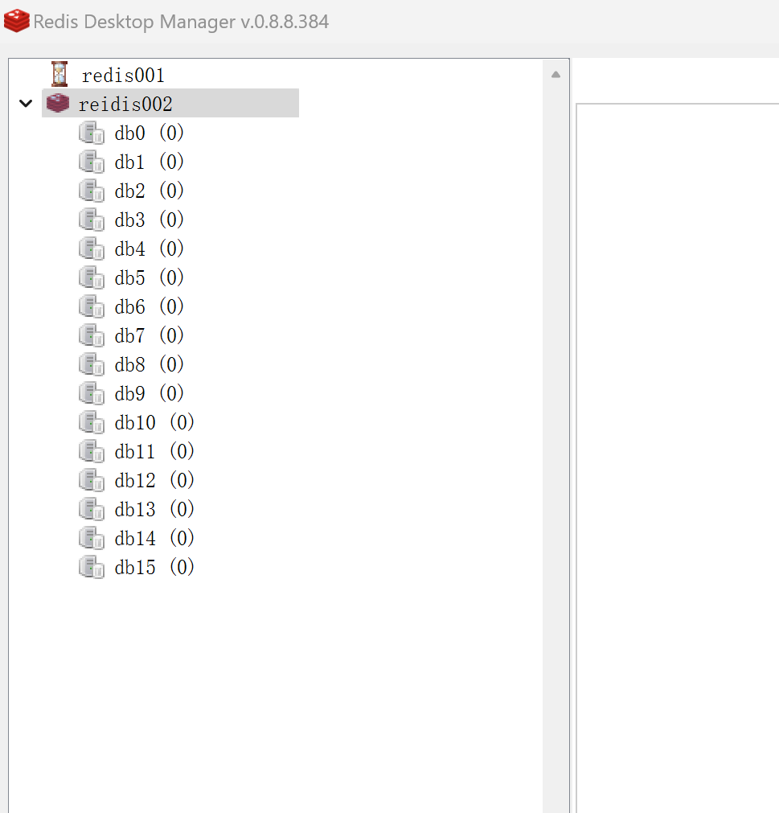


执行一下

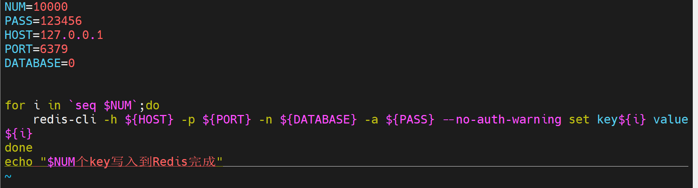

然后可见👇

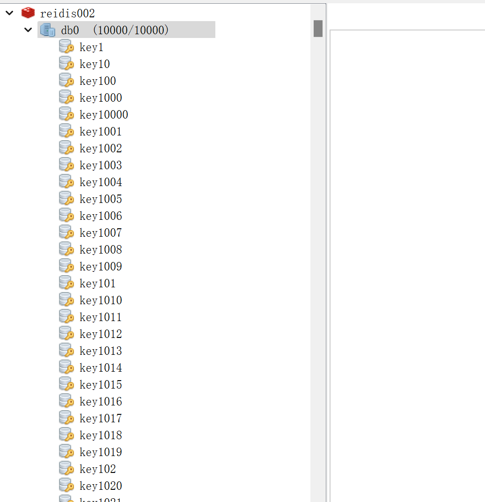


