# 第2节. 管道实现重定向

## 如何对错误信息进行管道符传递

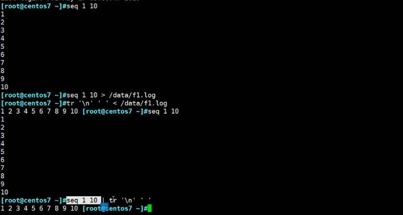

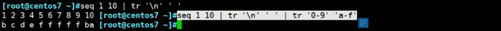

 上图：管道符|只能处理标准输出，而标准错误无法传递，不过可以下图做法：

上图有两种写法，最后的|&是相对2>&1晚一些时间出来的写法。

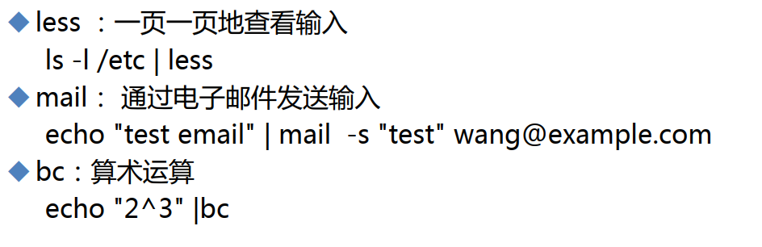 

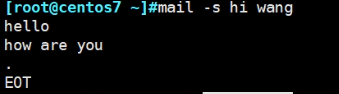 

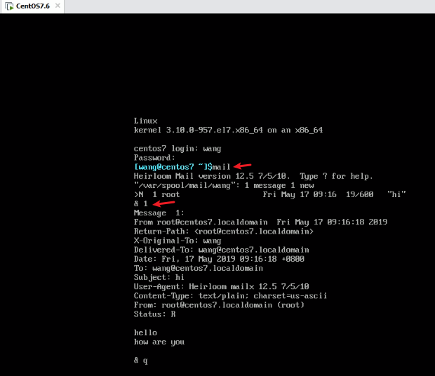 

换种邮件正文的写法

 

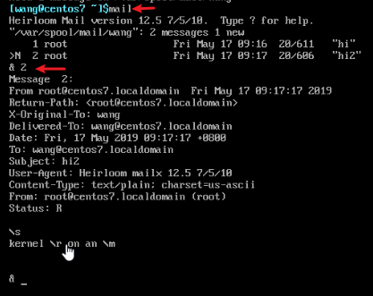 

## bc的灵活用法

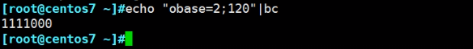 

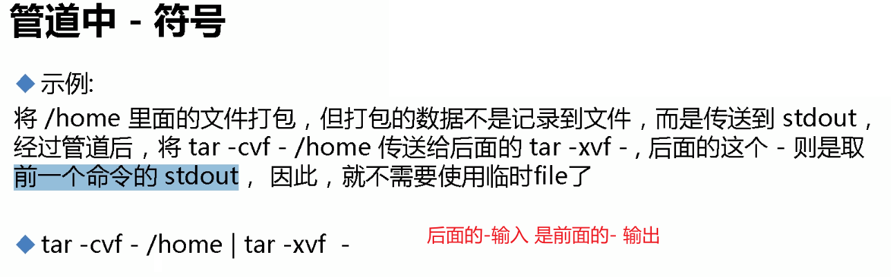 

## tee的意义

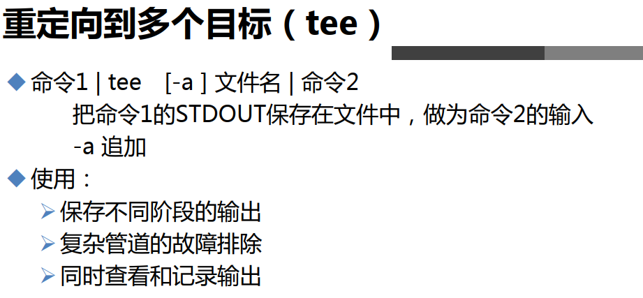 

tee会覆盖

tee的追加效果

tee的意义

 

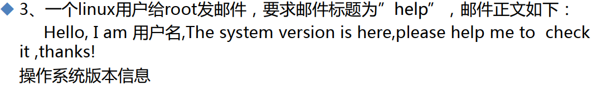 

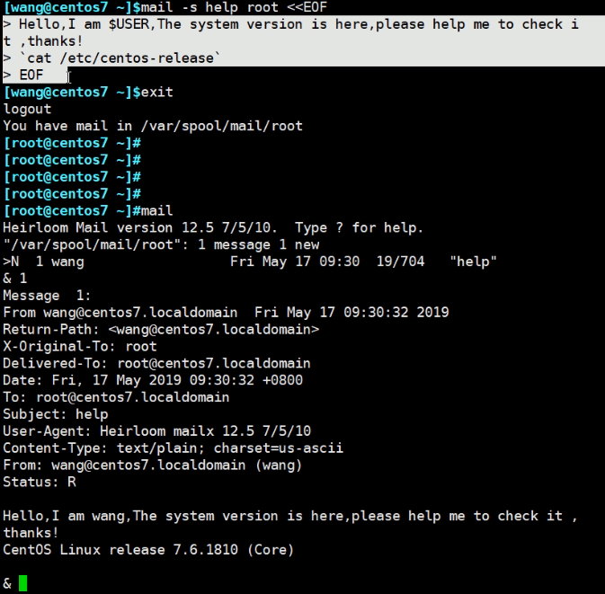

## 计算1+2+3+ ... +100

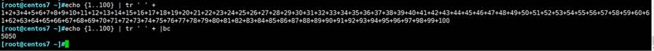

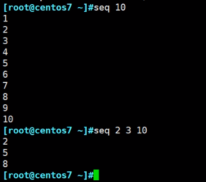 

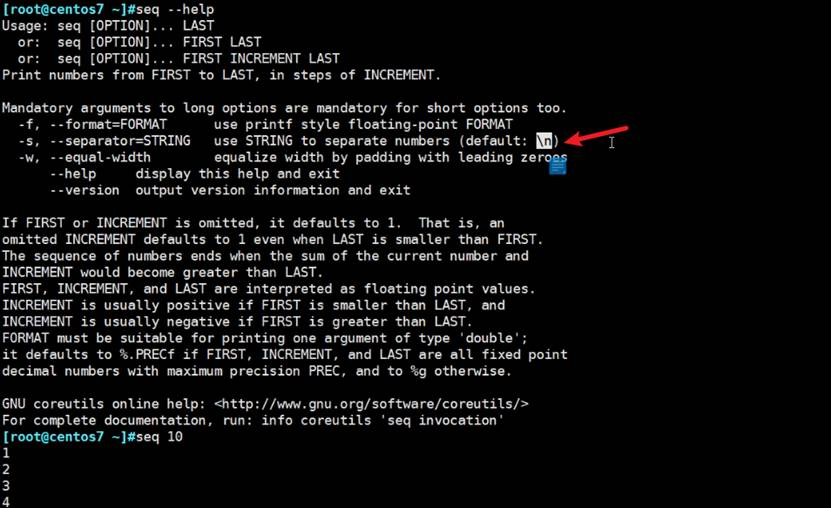

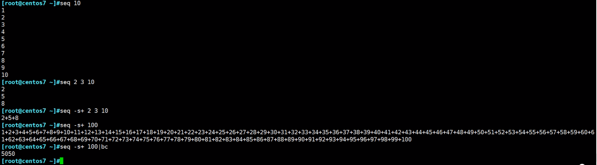

 

 
