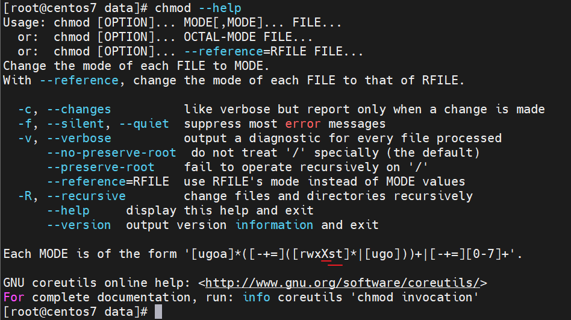
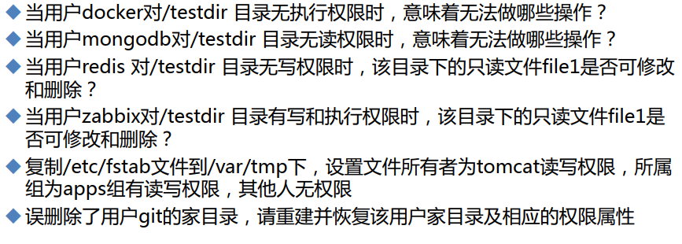
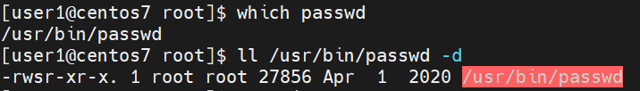
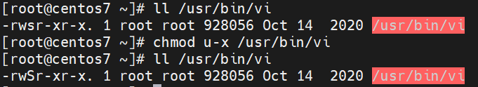
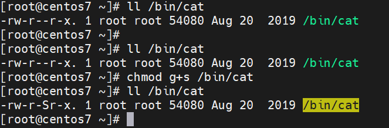
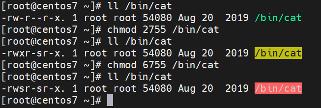
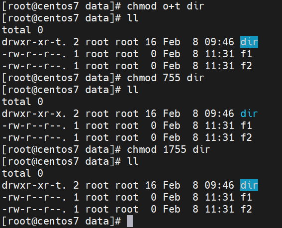
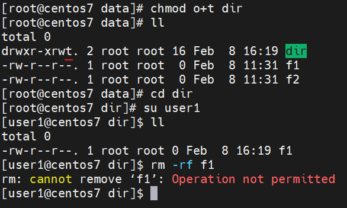

# 第3节. 文件和特殊权限


## 接上文，模式法

```
chmod who opt per file
who:	u,g,o,a
opt:	+,-,=
per:	r,w,x
```

## 数字法

```
rwxrw-r--	f1
111110100   👉 111 110 100 = 7 6 4
r 4
w 2
x 1
```

## 文件夹的权限

```
w：针对文件夹，就是创建、删除其中的文件。而修改文件涉及的是文件本身的写权限。
----------👇---------------------------------
[user1@centos7 dir]$ ll ./ -d
drwxr-xr-x. 2 root root 16 Feb  8 09:23 ./		 # 文件夹dir的权限
[root@centos7 dir]# su user1
[user1@centos7 dir]$ ll
total 0
-rw-r--rw-. 1 root root 0 Feb  8 09:23 f1
[user1@centos7 dir]$ touch 11
touch: cannot touch ‘11’: Permission denied
[user1@centos7 dir]$ vi f1
[user1@centos7 dir]$ cat f1
111
[user1@centos7 dir]$ rm f1
rm: cannot remove ‘f1’: Permission denied
[user1@centos7 dir]$ echo xxx > f1
[user1@centos7 dir]$ cat f1
xxx
[user1@centos7 dir]$

```

```
r: 读权限针对文件夹就是看不到文件夹下面的内容，但是如果你知道某个文件的名称，是可以直接看该文件内容的。
[root@centos7 data]# chmod o-r dir/
[root@centos7 data]# ll
total 0
drwxr-x--x. 2 root root 16 Feb  8 09:46 dir
[root@centos7 data]# su user1
[user1@centos7 data]$ cat dir/f1
xx
[user1@centos7 data]$ cd dir
[user1@centos7 dir]$ ls
ls: cannot open directory .: Permission denied
[user1@centos7 dir]$ cat f1
xx
[user1@centos7 dir]$ ll -d f1
-rw-r--r--. 1 root root 3 Feb  8 09:48 f1
[user1@centos7 dir]$ ll
ls: cannot open directory .: Permission denied
[user1@centos7 dir]$

```

```
x：执行权限针对文件夹就是进入咯，这个执行一旦取消，关系就大了，你连文件夹都进不去，那么文件夹下的文件就看不到<<只是看不到元数据，文件名称倒是可以看到这个qu'jue'yu，
👇-----这是dir的rwx都没的情况----
[root@centos7 data]# chmod o-x dir
[root@centos7 data]# ll
total 0
drwxr-x---. 2 root root 16 Feb  8 09:46 dir
[root@centos7 data]# ll dir/
total 4
-rw-r--r--. 1 root root 3 Feb  8 09:48 f1
[root@centos7 data]# cd dir/
[root@centos7 dir]# ll
total 4
-rw-r--r--. 1 root root 3 Feb  8 09:48 f1
[root@centos7 dir]# chmod o+w f1
[root@centos7 dir]# cd ..
[root@centos7 data]# ll
total 0
drwxr-x---. 2 root root 16 Feb  8 09:46 dir
[root@centos7 data]# ll dir/
total 4
-rw-r--rw-. 1 root root 3 Feb  8 09:48 f1
[root@centos7 data]# su user1
[user1@centos7 data]$ cd dir
bash: cd: dir: Permission denied
[user1@centos7 data]$ cat dir/f1
cat: dir/f1: Permission denied
[user1@centos7 data]$ echo 333 dir/f1
333 dir/f1
[user1@centos7 data]$ echo 333 > dir/f1
bash: dir/f1: Permission denied
[user1@centos7 data]$ ll dir/
ls: cannot open directory dir/: Permission denied
[user1@centos7 data]$
👇-----给上面的dir补一个r读权限----
[root@centos7 data]# chmod o=r dir
[root@centos7 data]# ll
total 0
drwxr-xr--. 2 root root 16 Feb  8 09:46 dir
[root@centos7 data]# ll dir/f1
-rw-r--rw-. 1 root root 3 Feb  8 09:48 dir/f1
[root@centos7 data]#
[root@centos7 data]# su user1
[user1@centos7 data]$ ll dir
ls: cannot access dir/f1: Permission denied
total 0
-????????? ? ? ? ?            ? f1				# 👈元数据看不到，文件名字倒是可以的
[user1@centos7 data]$ cd dir
bash: cd: dir: Permission denied
[user1@centos7 data]$ ll dir/f1
ls: cannot access dir/f1: Permission denied
[user1@centos7 data]$

```

文件夹来讲：

目录存放的数据块里的内容是各个文件名和其对应的节点信息

文件存放的数据块里的内容是文件的内容

**读**：可以列出该文件夹下的文件名，拿掉后，如果知道文件夹下的文件名，也能通过/dir/file去直接cat（这取决于文件本身的r权限）。

**执行**：可以进入目录，可以访问目录里的文件内容(依赖于文件本身的r权限)。

**写**：决定是否可以在目录里面创建和删除文件。文件本身的权限还得看文件自己的。

注意，w需要x加持~如果文件夹的执行权限取消，及时有写权限，由于进不到该目录下，所以也就没法去写文件的。

 

## 说下大X，后面再将st

```
[root@centos7 data]# ll
total 0
drwxr-xr--. 2 root root 16 Feb  8 09:46 dir
-rw-r--r--. 1 root root  0 Feb  8 11:31 f1
-rw-r--r--. 1 root root  0 Feb  8 11:31 f2
[root@centos7 data]# chmod -R a+x /data
[root@centos7 data]# ll /data
total 0
drwxr-xr-x. 2 root root 16 Feb  8 09:46 dir
-rwxr-xr-x. 1 root root  0 Feb  8 11:31 f1
-rwxr-xr-x. 1 root root  0 Feb  8 11:31 f2
[root@centos7 data]# ll /data -d
drwxr-xr-x. 3 root root 37 Feb  8 11:31 /data

------👆通过-R可以使文件夹和其下所有文件的权限都递归改掉-----
但是如果遇到文件你给它一个x执行权限，往往存在安全风险---所以-R 配合大X就可以过滤文件的权限修改
👇
[root@centos7 data]# chmod -R a-x /data/
[root@centos7 data]# ll /data/
total 0
drw-r--r--. 2 root root 16 Feb  8 09:46 dir
-rw-r--r--. 1 root root  0 Feb  8 11:31 f1
-rw-r--r--. 1 root root  0 Feb  8 11:31 f2
[root@centos7 data]# chmod -R a+X /data/
[root@centos7 data]# ll /data/
total 0
drwxr-xr-x. 2 root root 16 Feb  8 09:46 dir
-rw-r--r--. 1 root root  0 Feb  8 11:31 f1
-rw-r--r--. 1 root root  0 Feb  8 11:31 f2
[root@centos7 data]#

```

**练习**：

 

```
误删了用户ming的家目录，进行恢复
三条命令
cp -r /etc/skel /home/ming
chown -R ming.ming /home/ming
chmod 700 /home/ming   # 里面的几个隐藏文件都是从/etc/skel下复制过来的，属性不变就好。

---误删除了用户ming家目录下的文件，但是目录还在，进行恢复👇
[root@centos7 ~]# rm -rf /home/ming/.*
rm: refusing to remove ‘.’ or ‘..’ directory: skipping ‘/home/ming/.’
rm: refusing to remove ‘.’ or ‘..’ directory: skipping ‘/home/ming/..’
[root@centos7 ~]# ll -a /home/ming
total 0
drwx------.  2 ming ming   6 Feb  8 13:43 .
drwxr-xr-x. 16 root root 192 Feb  8 12:01 ..
--👇注意，此时通过.*复制/etc/skel/下的所有文件--包含隐藏和非隐藏，会有大问题🐕--
[root@centos7 home]# cp -r /etc/skel/.* /home/ming
cp: will not create hard link ‘/home/ming/skel’ to directory ‘/home/ming/.’
cp: overwrite ‘/home/ming/.bash_logout’? ^C
[root@centos7 home]# ll /home/ming
total 1036
-rw-r--r--.  1 root root     16 Feb  8 13:44 adjtime
-rw-r--r--.  1 root root   1529 Feb  8 13:44 aliases
-rw-r--r--.  1 root root  12288 Feb  8 13:44 aliases.db
drwxr-xr-x.  2 root root    236 Feb  8 13:44 alternatives
-rw-------.  1 root root    541 Feb  8 13:44 anacrontab
-rw-r--r--.  1 root root     55 Feb  8 13:44 asound.conf
drwxr-x---.  3 root root     43 Feb  8 13:44 audisp
drwxr-x---.  3 root root     83 Feb  8 13:44 audit
drwxr-xr-x.  2 root root     22 Feb  8 13:44 bash_completion.d
-rw-r--r--.  1 root root   2853 Feb  8 13:44 bashrc
drwxr-xr-x.  2 root root      6 Feb  8 13:44 binfmt.d
-rw-r--r--.  1 root root     37 Feb  8 13:44 centos-release
-rw-r--r--.  1 root root     51 Feb  8 13:44 centos-release-upstream
drwxr-xr-x.  2 root root      6 Feb  8 13:44 chkconfig.d
drwxr-xr-x.  2 root root     21 Feb  8 13:44 cron.d
drwxr-xr-x.  2 root root     42 Feb  8 13:44 cron.daily
-rw-------.  1 root root      0 Feb  8 13:44 cron.deny
drwxr-xr-x.  2 root root     22 Feb  8 13:44 cron.hourly
drwxr-xr-x.  2 root root      6 Feb  8 13:44 cron.monthly
-rw-r--r--.  1 root root    451 Feb  8 13:44 crontab
drwxr-xr-x.  2 root root      6 Feb  8 13:44 cron.weekly
-rw-------.  1 root root      0 Feb  8 13:44 crypttab
-rw-r--r--.  1 root root   1620 Feb  8 13:44 csh.cshrc
-rw-r--r--.  1 root root   1103 Feb  8 13:44 csh.login
👆发现复制很N多文件过来了，原因是因为.*通配符它代表.xxx还有..xxx所以复制.*意味着你不仅仅复制了当前目录下的所有文件，也复制了上级目录下的所有文件。
推荐👇👉使用cp -r /etc/skel/. /home/ming这种方式复制所有文件含隐藏文件
drwx------. 2 root root 6 Feb  8 13:52 ming
[root@centos7 home]# cp -r /etc/skel/. /home/ming
[root@centos7 home]# ll -a ming
total 12
drwx------.  2 root root  72 Feb  8 13:53 .
drwxr-xr-x. 16 root root 192 Feb  8 13:52 ..
-rw-r--r--.  1 root root  18 Feb  8 13:53 .bash_logout
-rw-r--r--.  1 root root 193 Feb  8 13:53 .bash_profile
-rw-r--r--.  1 root root 231 Feb  8 13:53 .bashrc
-rw-r--r--.  1 root root   0 Feb  8 13:53 f1
[root@centos7 home]#
------👇这样也行，就是通过.[^.]*来表示所有隐藏文件，和*来表示所有非隐藏文件----
[root@centos7 home]# cp -r /etc/skel/.[^.]* /home/ming
[root@centos7 home]# ll /home/ming -a
total 12
drwx------.  2 root root  62 Feb  8 13:55 .
drwxr-xr-x. 16 root root 192 Feb  8 13:52 ..
-rw-r--r--.  1 root root  18 Feb  8 13:55 .bash_logout
-rw-r--r--.  1 root root 193 Feb  8 13:55 .bash_profile
-rw-r--r--.  1 root root 231 Feb  8 13:55 .bashrc
[root@centos7 home]# cp -r /etc/skel/* /home/ming
[root@centos7 home]# ll /home/ming -a
total 12
drwx------.  2 root root  72 Feb  8 13:55 .
drwxr-xr-x. 16 root root 192 Feb  8 13:52 ..
-rw-r--r--.  1 root root  18 Feb  8 13:55 .bash_logout
-rw-r--r--.  1 root root 193 Feb  8 13:55 .bash_profile
-rw-r--r--.  1 root root 231 Feb  8 13:55 .bashrc
-rw-r--r--.  1 root root   0 Feb  8 13:55 f1
[root@centos7 home]#

```

mkdir创建文件夹的时候可以设置权限

```
[root@centos7 home]# mkdir --help
Usage: mkdir [OPTION]... DIRECTORY...
Create the DIRECTORY(ies), if they do not already exist.

Mandatory arguments to long options are mandatory for short options too.
  -m, --mode=MODE   set file mode (as in chmod), not a=rwx - umask
  -p, --parents     no error if existing, make parent directories as needed
  -v, --verbose     print a message for each created directory
  -Z                   set SELinux security context of each created directory
                         to the default type
      --context[=CTX]  like -Z, or if CTX is specified then set the SELinux
                         or SMACK security context to CTX
      --help     display this help and exit
      --version  output version information and exit

GNU coreutils online help: <http://www.gnu.org/software/coreutils/>
For complete documentation, run: info coreutils 'mkdir invocation'
[root@centos7 home]#

[root@centos7 ~]# mkdir -m 000  /home/sb001
[root@centos7 ~]# ll /home/sb001 -d
d---------. 2 root root 6 Feb  8 14:00 /home/sb001
[root@centos7 ~]#

```

## 文件的特殊权限


/etc/shaow这个文件普通用户没有权限对其修改，但是可以通过passwd命令对其进行修改的，因为改自身密码本质上就是修改了shadow文件。

```
[root@centos7 ~]# ll /etc/shadow
----------. 1 root root 1366 Feb  8 14:06 /etc/shadow
[root@centos7 ~]# su user1
[user1@centos7 root]$ cat /etc/shadow
cat: /etc/shadow: Permission denied
[user1@centos7 root]$ echo xx /etc/shadow
xx /etc/shadow
[user1@centos7 root]$ echo xx >> /etc/shadow
bash: /etc/shadow: Permission denied
[user1@centos7 root]$ passwd
Changing password for user user1.
Changing password for user1.
(current) UNIX password:
passwd: Authentication token manipulation error
[user1@centos7 root]$ passwd
Changing password for user user1.
Changing password for user1.
(current) UNIX password:
New password:
Retype new password:
passwd: all authentication tokens updated successfully.
[user1@centos7 root]
```

这是因为passwd命令-也就是这/bin/passwd这个执行文件用户属性位上有s位。

[user1@centos7 root]$ ll /bin/passwd
 

**suid**当用户使用该程序/命令访问某个文件的时候，原则上是使用这个用户的权限去访问文件。

一旦有了suid，不管谁运行这个程序，通过这个程序访问文件，就是获得这个程序所有者的权限。上图只要你运行passwd，你的身份就转换为root了。suid全称就是set owner user id up to execution在执行时设置所有者用户ID。


第二点，suid一定是作用在<font color=red>二进制</font>的可执行的文件上(对shell脚本无效)，否则没有意义了就。所以大S没有意义-去掉x后就是大S

 


```
[root@centos7 ~]# ll /usr/bin/vi
-rwsr-xr-x. 1 root root 928056 Oct 14  2020 /usr/bin/vi
[root@centos7 ~]# su user
su: user user does not exist
[root@centos7 ~]# su user1
[user1@centos7 root]$ vi /etc/shadow    # 此时就可以vi进去修改并保持了
[user1@centos7 root]$ echo xxx >> /etc/shadow   # echo不行肯定的啊你suid的是vim啊
bash: /etc/shadow: Permission denied
----------这个，，，尝试将echo变成suid权限，发现还是不行，可能要该重定向文件咯呵呵----
[root@centos7 ~]# which echo
/usr/bin/echo
[root@centos7 ~]# ll /usr/bin/echo
-rwxr-xr-x. 1 root root 33088 Aug 20  2019 /usr/bin/echo
[root@centos7 ~]# chmod u+s /usr/bin/echo
[root@centos7 ~]# ll /usr/bin/echo
-rwsr-xr-x. 1 root root 33088 Aug 20  2019 /usr/bin/echo
[root@centos7 ~]# su user1
[user1@centos7 root]$ echo xx >> /etc/shadow
bash: /etc/shadow: Permission denied
[user1@centos7 root]$ exit
exit
[root@centos7 ~]# which >>
-bash: syntax error near unexpected token `newline'
[root@centos7 ~]#

```

## 数字法修改suid：

4是单独算的

```
[root@centos7 ~]# ll /usr/bin/echo
-rwsr-xr-x. 1 root root 33088 Aug 20  2019 /usr/bin/echo
[root@centos7 ~]# chmod 755 /usr/bin/echo
[root@centos7 ~]# ll /usr/bin/echo
-rwxr-xr-x. 1 root root 33088 Aug 20  2019 /usr/bin/echo
[root@centos7 ~]# chmod 4755 /usr/bin/echo
[root@centos7 ~]# ll /usr/bin/echo
-rwsr-xr-x. 1 root root 33088 Aug 20  2019 /usr/bin/echo
[root@centos7 ~]#

```


## sgid

1、如果某个用户运行cat程序也即是使用cat去访问文件，就会继承所属组的权限。或者说就会将用户原本的所属组提升至该程序的所属组。

 

同样数字法

 

755前面补一个2，sgid

755前面补一个4，sguid

755前面补一个6，suid+sgid

## 粘滞位

针对文件夹的属性

非用户本人，无法删除文件夹下的文件

 

 

粘滞位对文件不生效

```
[root@centos7 dir]# su user1
[user1@centos7 dir]$ ll
total 0
-rw-r--r--. 1 root  root  0 Feb  8 16:19 f1
-rw-rw-r-T. 1 user1 user1 0 Feb  8 16:22 f2
[user1@centos7 dir]$ rm -rf f2
[user1@centos7 dir]$ ll
total 0
-rw-r--r--. 1 root root 0 Feb  8 16:19 f1
[user1@centos7 dir]$

```

## 总结

suid：

​	作用于可执行的二进制的程序，权限4，功能：用户执行此程序时，将继承此程序所有者的权限。

sguid：

​	作用于可执行的二进制的程序，权限2，功能：用户执行此程序时，将集成此程序所属组的权限。

​	作用于目录，权限2，功能，新建的文件，将自动集成该目录的所属组。

sticky：

​	作用于目录，权限1，功能：只能删除自己的文件，root不受限。


## 创建一个目录可以让有限的几个用户使用

```
[16:49:55 root@localhost data]#mkdir -m 770 testdir
[16:50:10 root@localhost data]#ll
total 1
drwxrwx---. 2 root  root   6 Jan 19 16:50 testdir
[16:52:38 root@localhost data]#chown .grp001 testdir
[16:52:50 root@localhost data]#ll
total 1
drwxrwx---. 2 root  grp001  6 Jan 19 16:50 testdir
[16:53:01 root@localhost data]#usermod -G grp001 user1
[16:54:31 root@localhost data]#usermod -G grp001 user2
[16:55:01 root@localhost data]#groupmems -l -g grp001
user1  user2
[16:55:14 root@localhost data]#su user1
[16:55:19 user1@localhost data]$cd testdir/
[16:55:28 user1@localhost testdir]$touch f1
[16:55:30 user1@localhost testdir]$echo 11 >> f1

[16:55:34 user1@localhost testdir]$exit
exit
[16:55:36 root@localhost data]#su user2
[16:55:43 user2@localhost data]$cd testdir/
[16:55:54 user2@localhost testdir]$echo xx >> f2
[16:56:06 user2@localhost testdir]$cat f2
xx
貌似centos7.9和7.6这里有个不一样的点👇
就是user1可以修改user2创建的文件，如果时之前的观点，就会再设置文件夹的sguid来使目录下的文件创建的时候自动集成父目录的所属组。
当然最好还是设置一下文件夹的sgid
[root@centos7 data]# chmod g+s renyue/
[root@centos7 data]# ll
total 0
drwxrws---. 2 root renyue-group 26 Feb  8 17:12 renyue
[root@centos7 data]#
[root@centos7 data]# su client1
[client1@centos7 data]$ ll
total 0
drwxrws---. 2 root renyue-group 26 Feb  8 17:12 renyue
[client1@centos7 data]$ cd renyue/
[client1@centos7 renyue]$ touch f3
[client1@centos7 renyue]$ ll
total 4
-rw-rw-r--. 1 client1 client1      2 Feb  8 17:12 f1
-rw-rw-r--. 1 client2 client2      0 Feb  8 17:12 f2
-rw-rw-r--. 1 client1 renyue-group 0 Feb  8 17:35 f3
[client1@centos7 renyue]$


```

## cp /etc/fstab /data/dir/ 普通需要什么权限？

cp 命令的执行权限

/etc文件夹的执行

fstab文件的读

/data文件夹的执行

/dir文件夹得执行和写

