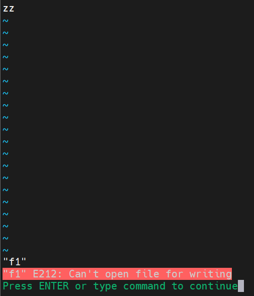

# 第4节. umask权限

## chattr

**i** :文件不会被修改、删除、包含所在目录也不能被删除。

```
[19:40:28 root@localhost data]#chattr +i f1
[19:40:37 root@localhost data]#ll
total 0
-rw-r--r--. 1 root root 0 Jan 19 19:40 f1
[19:40:38 root@localhost data]#lsattr f1
----i--------------- f1
[19:41:22 root@localhost data]#rm -rf f1
rm: cannot remove 'f1': Operation not permitted
[19:41:29 root@localhost data]#echo xx > f1
-bash: f1: Operation not permitted
[19:41:32 root@localhost data]#mv f1 f2
mv: cannot move 'f1' to 'f2': Operation not permitted
[19:41:36 root@localhost data]#cd ..
[19:41:38 root@localhost /]#rm -rf /data/
rm: cannot remove '/data/f1': Operation not permitted
[19:41:44 root@localhost /]#
```

**a**:文件仅可以添加，同样所在目录不能被删除

```
[19:45:29 root@localhost data]#chattr +a f1
[19:45:36 root@localhost data]#lsattr f1
----ia-------------- f1
[19:45:39 root@localhost data]#echo xx > f1
-bash: f1: Operation not permitted
[19:45:45 root@localhost data]#echo xx >> f1
-bash: f1: Operation not permitted
[19:45:48 root@localhost data]#chattr -i f1
[19:46:05 root@localhost data]#lsattr f1
-----a-------------- f1
[19:46:09 root@localhost data]#echo xx > f1
-bash: f1: Operation not permitted
[19:46:13 root@localhost data]#echo xx >> f1
[19:46:16 root@localhost data]#cat f1
xx
[19:46:19 root@localhost data]#rm -rf f1
rm: cannot remove 'f1': Operation not permitted
[19:46:22 root@localhost data]#exit
logout
[19:46:54 root@localhost /]#rm -rf /data/
rm: cannot remove '/data/f1': Operation not permitted
---但是👇vi进去后在最后一行添加这种操作，系统判定不出来你是不是追加所以这种追加时不行的。
```

 


## umask

1、root用户新建文件和文件夹可发现默认的权限分别时644和755

```
[19:57:42 root@localhost data]#ll
total 0
drwxr-xr-x. 2 root root 6 Jan 19 19:57 dir
-rw-r--r--. 1 root root 0 Jan 19 19:57 f1
[19:57:42 root@localhost data]#

```

2、换普通用户创建文件和文件夹权限就不一样

```
[putong@centos7 data]$ ll |grep putong
drwxrwxr-x. 2 putong putong 6 Feb  8 20:02 dir2
-rw-rw-r--. 1 putong putong 0 Feb  8 20:02 f2
[putong@centos7 data]$

```


```
[putong@centos7 data]$ type umask
umask is a shell builtin
[putong@centos7 data]$ umask
0002
[putong@centos7 data]$ exit
exit
[root@centos7 data]# umask
0022
[root@centos7 data]#

```

## umask+default_value=777目录|666文件

000+default=777，假设文件也用777总和，会导致文件可能就带上了x执行权限，带来一定的风险。

022+default=777|666，文件夹default=755，文件default=644

👆上面的公式不正确

umask，mask时掩码，user的mask就是用户的掩码的意思。


umask ugo   也分user group other

umask的功能，将777或者666中对应的权限去掉，得出默认权限。

```
777
022
↓转成二进制,0锁死，1放开，就是通配符或者反掩码的算法.
111 111 111
000 010 010
------------
111 101 101  = 755 这就是文件夹创建默认权限

666
022
110 110 110
000 010 010
------------
110 100 100  = 644 这就是文件创建默认权限

----👇修改umask值再来看，发现777|666-umask就不准确了----
[root@centos7 data]# umask 123
[root@centos7 data]# touch f1
[root@centos7 data]# mkdir dir
[root@centos7 data]# ll
total 0
drw-r-xr--. 2 root root 6 Feb  8 20:18 dir
-rw-r--r--. 1 root root 0 Feb  8 20:18 f1
[root@centos7 data]#
-------
分析：
777
123
111 111 111
001 010 011
--------------
110 101 100  => 掩出来的文件夹默认值为：654，这个确实就是777-123=654

如果是文件
666
123
110 110 110
001 010 011
--------------
110 100 100  => 得到：644，这个就不是666-123=543，使用奇数+1的规律=644，所以速算法就是
543里面带上了执行权限了，肯定不可能的。
👇
如果是文件夹777-umask=default
如果是文件666-umask=default(3个数，如果是奇数就+1，偶数不变)
```

umask退出后丢失，可以写到.bashrc或者/etc/bashrc里，这里也有个点就是几个文件里配置环境变量等，谁优先的原则，涉及文件有/etc/profile  bashrc等，这个后面讲。

```
[root@centos7 ~]# cat /etc/bashrc | tail -3
fi
# vim:ts=4:sw=4
umask 123
[root@centos7 ~]#

[root@centos7 ~]# umask
0022
[root@centos7 ~]# umask -p
umask 0022
[root@centos7 ~]# umask -p >> .bashrc	# 将当前umaks值写入配置文件里
[root@centos7 ~]# tail -1 .bashrc
umask 0022
[root@centos7 ~]#


```

## FACL

解决一些特殊需求，普通权限解决不了，比如

user1不能访问f1，user2能对f1完全控制，user3只能读f1，user4只能写f1

此时ugo三个角色，user、group、other，用户权限超过3个，就需要ACL了。 

```
setfacl -m u:user1:0 f1
setfacl -m u:user1:- f1
```

