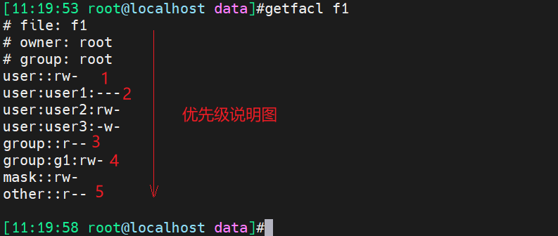

# 第5节. FACL实现权限的灵活控制


## 解决一些特殊需求，普通权限解决不了，比如

user1不能访问f1，user2能对f1完全控制，user3只能写f1，user4只能读f1

此时ugo三个角色，user、group、other，用户权限超过3个，就需要ACL了。 

```
setfacl -m u:user1:0 f1    👈表示啥权限都没有
setfacl -m u:user1:- f1    👈表示啥权限都没有，等价于0

👉user1不能访问f1
[10:03:19 root@localhost data]#ll f1
-rw-r--r--+ 1 root root 4 Jan 29 10:03 f1
[10:04:59 root@localhost data]#su user2 -c "cat f1"👈切换用户输入cli后直接退出来
123
[10:05:00 root@localhost data]#su user1 -c "cat f1"
cat: f1: Permission denied

```

```
👉user2完全控制f1
[10:20:21 root@localhost data]#su user2 -c 'cat f1'
123
[10:20:39 root@localhost data]#su user2 -c 'echo 123 > f1'
bash: f1: Permission denied
[10:20:43 root@localhost data]#setfacl -m u:user2:rw f1
[10:20:59 root@localhost data]#su user2 -c 'echo 321 > f1'
[10:21:05 root@localhost data]#su user2 -c 'cat  f1'
321
[10:21:11 root@localhost data]#

```

```
👉user3只能写f1
[10:24:33 root@localhost data]#setfacl -m u:user3:w f1
[10:25:44 root@localhost data]#su user3 -c 'cat f1'
cat: f1: Permission denied
[10:25:52 root@localhost data]#su user3 -c 'echo aaa >>  f1'
[10:26:01 root@localhost data]#su user3 -c 'cat f1'
cat: f1: Permission denied
[10:26:03 root@localhost data]#cat f1
321
aaa
[10:26:15 root@localhost data]#

```

```
👉user4只能读f1,就归到other整体权限去，无需修改
```

```
👉查看facl
[10:26:15 root@localhost data]#getfacl f1
# file: f1
# owner: root
# group: root
user::rw-
user:user1:---
user:user2:rw-
user:user3:-w-
group::r--
mask::rw-
other::r--


```

## 针对group设置facl

```
[10:28:34 root@localhost data]#setfacl -m g:g1:rw f1
[10:36:27 root@localhost data]#getfacl f1
# file: f1
# owner: root
# group: root
user::rw-
user:user1:---
user:user2:rw-
user:user3:-w-
group::r--
group:g1:rw-       👈g1有了rw
mask::rw-
other::r--
[10:38:33 root@localhost data]#su user5 -c "echo 123 > f1"
bash: f1: Permission denied
[10:38:37 root@localhost data]#usermod -G g1 user5   👈user5加入g1扩展组
[10:39:09 root@localhost data]#id user5
uid=1012(user5) gid=1016(user5) groups=1016(user5),1001(g1)
[10:39:11 root@localhost data]#
[10:39:15 root@localhost data]#su user5 -c "echo aaa > f1"
[10:39:28 root@localhost data]#cat f1
aaa

```

## 针对user1 同时设置facl的user和group权限，user优先。

```

[11:03:16 root@localhost data]#setfacl -m u:user1:- f1
[11:03:37 root@localhost data]#su user1 -c 'cat f1'
cat: f1: Permission denied
[11:03:46 root@localhost data]#su user1 -c 'echo 123 > f1'
bash: f1: Permission denied
[11:03:49 root@localhost data]#getfacl f1
# file: f1
# owner: root
# group: root
user::rw-
user:user1:---
user:user2:rw-
user:user3:-w-
group::r--
group:g1:rw-
mask::rw-
other::r--
[11:03:55 root@localhost data]#id user1
uid=1008(user1) gid=1013(g12) groups=1013(g12),1015(grp001)
[11:03:59 root@localhost data]#usermod -G g1 user1
[11:04:08 root@localhost data]#id user1
uid=1008(user1) gid=1013(g12) groups=1013(g12),1001(g1)
[11:04:46 root@localhost data]#su user1 -c 'echo 123 > f1'
bash: f1: Permission denied
[11:05:06 root@localhost data]#su user1 -c 'cat f1'
cat: f1: Permission denied

```

## 所有文件的权限判定规则：从上往下优先，先中先得

1、先看所有者

2、看针对user的FACL

3、看所属组

4、看针对group的FACL

5、看other

 

交换机的acl 、linux 路由表 ip roue show (metric小的自动放到上面) ，都是从上到下匹配的，

ssg 的policy 也是从上到下匹配，linux的shell脚本、python的主程序都是从上到下，所以此乃天地法则🤮

 

```
👇判断所有者优于facl的user
[11:12:11 root@localhost data]#getfacl f1
# file: f1
# owner: root
# group: root
user::rw-
user:user1:---
user:user2:rw-
user:user3:-w-
group::r--
group:g1:rw-
mask::rw-
other::r--

[11:12:18 root@localhost data]#ll f1
-rw-rw-r--+ 1 root root 7 Jan 29 10:53 f1
[11:12:21 root@localhost data]#chown user1 f1
[11:12:35 root@localhost data]#ll f1
-rw-rw-r--+ 1 user1 root 7 Jan 29 10:53 f1
[11:12:36 root@localhost data]#su user1 -c 'cat f1'
aaa
bb
[11:15:58 root@localhost data]#getfacl f1
# file: f1
# owner: root
# group: root
user::rw-
user:user2:rw-
user:user3:-w-
group::r--
group:g1:rw-
mask::rw-
other::r--

👇判断facl的group 优先于本来的group，这里错啦，group没命令中，自然不起作用啦
[11:16:01 root@localhost data]#su user1 -c 'catf1'
bash: catf1: command not found
[11:16:10 root@localhost data]#su user1 -c 'echo aa > f1'
[11:16:16 root@localhost data]#su user1 -c 'cat f1'
aa
[11:16:21 root@localhost data]#setfacl -x g:g1 f1
[11:16:48 root@localhost data]#su user1 -c 'cat f1'
aa
[11:16:54 root@localhost data]#su user1 -c 'echo 11 >> f1'
bash: f1: Permission denied
[11:16:59 root@localhost data]#getfacl f1
# file: f1
# owner: root
# group: root
user::rw-
user:user2:rw-
user:user3:-w-
group::r--
mask::rw-
other::r--

[11:17:04 root@localhost data]#


```


## 删除facl两种方法

-x删一个

-b全删

-R -b dir 递归删除文件夹下所有的acl，据说相当有用

```
[11:19:58 root@localhost data]#getfacl f1
# file: f1
# owner: root
# group: root
user::rw-
user:user1:---
user:user2:rw-
user:user3:-w-
group::r--
group:g1:rw-
mask::rw-
other::r--

[11:28:31 root@localhost data]#setfacl -x u:user1 f1
[11:28:41 root@localhost data]#setfacl -x g:g1 f1
[11:28:46 root@localhost data]#getfacl f1
# file: f1
# owner: root
# group: root
user::rw-
user:user2:rw-
user:user3:-w-
group::r--
mask::rw-
other::r--

[11:28:48 root@localhost data]#setfacl -b f1
[11:28:54 root@localhost data]#getfacl f1
# file: f1
# owner: root
# group: root
user::rw-
group::r--
other::r--

[11:28:57 root@localhost data]#

```

## 经典案例

我们复制文件夹的时候总担心权限、所有者、所属组这些信息的丢失，cp -a 可以提供思路

我们修改文件夹的权限比如chmod -R 777 dir/   , 带来的问题是，以后想要回收权限，没有办法了，这个时候facl就提供了很好的思路。


```
[11:40:55 root@localhost ~]#setfacl -R -m u:user1:r data/
[11:41:02 root@localhost ~]#ll
total 12
-rw-r--r--. 1 root root    3 Jan 12 16:53 1
-rw-------. 1 root root 1031 Jan  5 16:52 anaconda-ks.cfg
drwxrwxrwx+ 4 root root   61 Jan 29 10:59 data
-rw-r--r--. 1 root root    0 Jan 12 16:53 f1
-rw-r--r--. 1 root root    0 Jan 12 16:53 f2
-rw-r--r--. 1 root root    4 Jan 12 17:51 hello.txt
[11:41:03 root@localhost ~]#cd data/
[11:41:04 root@localhost data]#ll
total 8
drwxr-xr-x+ 2 root  root  6 Jan 19 19:57 dir
drwxr-xr-x+ 2 user1 g12   6 Jan 19 19:58 dir2
-rw-r--r--+ 1 root  root  3 Jan 29 11:16 f1
-rw-r--r--+ 1 user1 g12   0 Jan 19 19:58 f2
-rw-r--r--+ 1 root  root 65 Jan 29 10:59 test
[11:41:05 root@localhost data]#getfacl f2
# file: f2
# owner: user1
# group: g12
user::rw-
user:user1:r--
group::r--
mask::r--
other::r--

[11:41:31 root@localhost ~]#getfacl data
# file: data
# owner: root
# group: root
user::rwx
user:user1:r--
group::rwx
mask::rwx
other::rwx

[11:41:56 root@localhost ~]#setfacl -R -b data/
[11:42:08 root@localhost ~]#
[11:42:09 root@localhost ~]#ll
total 12
-rw-r--r--. 1 root root    3 Jan 12 16:53 1
-rw-------. 1 root root 1031 Jan  5 16:52 anaconda-ks.cfg
drwxrwxrwx. 4 root root   61 Jan 29 10:59 data
-rw-r--r--. 1 root root    0 Jan 12 16:53 f1
-rw-r--r--. 1 root root    0 Jan 12 16:53 f2
-rw-r--r--. 1 root root    4 Jan 12 17:51 hello.txt
[11:42:11 root@localhost ~]#ll data/
total 8
drwxr-xr-x. 2 root  root  6 Jan 19 19:57 dir
drwxr-xr-x. 2 user1 g12   6 Jan 19 19:58 dir2
-rw-r--r--. 1 root  root  3 Jan 29 11:16 f1
-rw-r--r--. 1 user1 g12   0 Jan 19 19:58 f2
-rw-r--r--. 1 root  root 65 Jan 29 10:59 test
[11:42:19 root@localhost ~]#


```

## 其他用法参考setfacl -h

比如

```
setfacl -m d:u:ming:rx dir👈意思是dir文件夹下创建的文件默认就带针对ming的rx权限，d设置的默认权限，删除用setfac -k dir来删
setfacl -X file.acl dir👈意思是file.acl里写好g:sales:rw这些facl的明细，这个比较好的。
setfacl -m u:user1:rwX dir👈X是只是针对文件夹设置，不过我用x一i杨的效果。要么是rocky-linux自带的，要吗是版本高的好处，不管。
getfacl file1 | setfacl --set-file=- file2👈参考chmod里的--reference一个效果，就是将f2的权限设置成f1一样的。

```


## FACL里的mask

mask就是设置一个最高权限，谁都不能超过

ll可见group的rwx3位现在用来填充mask的值了。

mask默认设置了facl后位rwx，手动修改后getfacl 可见#effective:rw-这种

mask只影响单个人，所有者和other不受影响


```

[11:59:54 root@localhost data]#getfacl f1
# file: f1
# owner: root
# group: root
user::rw-
group::r--
other::r--

[11:59:57 root@localhost data]#ll
total 8
drwxr-xr-x. 2 root  root  6 Jan 19 19:57 dir
drwxr-xr-x. 2 user1 g12   6 Jan 19 19:58 dir2
-rw-r--r--. 1 root  root  3 Jan 29 11:16 f1
-rw-r--r--. 1 user1 g12   0 Jan 19 19:58 f2
-rw-r--r--. 1 root  root 65 Jan 29 10:59 test
[12:00:03 root@localhost data]#setfacl -m u:user1:rw f1
[12:00:25 root@localhost data]#ll f1
-rw-rw-r--+ 1 root root 3 Jan 29 11:16 f1
[12:00:27 root@localhost data]#setfacl -m u:user2:rwx f1
[12:00:42 root@localhost data]#ll
total 8
drwxr-xr-x. 2 root  root  6 Jan 19 19:57 dir
drwxr-xr-x. 2 user1 g12   6 Jan 19 19:58 dir2
-rw-rwxr--+ 1 root  root  3 Jan 29 11:16 f1
-rw-r--r--. 1 user1 g12   0 Jan 19 19:58 f2
-rw-r--r--. 1 root  root 65 Jan 29 10:59 test
[12:00:44 root@localhost data]#getfacl f1
# file: f1
# owner: root
# group: root
user::rw-
user:user1:rw-
user:user2:rwx
group::r--
mask::rwx			👈mask默认值
other::r--

[12:00:57 root@localhost data]#setfacl -m mask::r f1
[12:01:14 root@localhost data]#ll
total 8
drwxr-xr-x. 2 root  root  6 Jan 19 19:57 dir
drwxr-xr-x. 2 user1 g12   6 Jan 19 19:58 dir2
-rw-r--r--+ 1 root  root  3 Jan 29 11:16 f1		👈修改mask后group位的3位用来表示mask的3位
-rw-r--r--. 1 user1 g12   0 Jan 19 19:58 f2
-rw-r--r--. 1 root  root 65 Jan 29 10:59 test
[12:01:15 root@localhost data]#getfacl f1
# file: f1
# owner: root
# group: root
user::rw-
user:user1:rw-                  #effective:r--		👈注意mask影响了单个用户的权限上限
user:user2:rwx                  #effective:r--
group::r--
mask::r--
other::r--

[12:01:20 root@localhost data]#

```


## facl的备份

怎么备份和还原

```
getfacl -R /tmp/dir1 > acl.txt		👈备份到acl.txt
setfacl -R -b /tmp/dir1		👈清空下，Centos8 -b一旦用了，组权限清空为---，8的BUG,centos7亲测没问题，放心用，读我这篇的你自己测你的版本啊。
setfacl -R --set-file=acl.txt /tmp/dir1		👈恢复方法1
setfacl --restore acl.txt  👈恢复方法2
getfacl -R /tmp/dir1  👈递归，也就是包含dir1及其下所有文件的facl

```

cp -p 或-a就能备份facl，还有所有者权限等

mv 也支持facl这些的保留

tar不行，tar备份的时候facl就丢了


