# 第3节 基本和扩展正则


举个例子

```
[^ming]  不是m、i、n、g的字符
[0-9]
[[:lower:]]   任意一个小写字母
. 任意一个非\n的字符
* 前一个字符出现0次或N次

a\?   a出现了0次或1次，可有可无的表达方式
a\+   a出现1次及以上
a\{10\}   a出现了10次
a\{10,20\}   10到20次
a\{,20\}     20次以下
a\{10,\}     10次以上

.* 所有但是不能匹配\n，所以你用.*抓全文只能抓到换行符就结束了，
.*等价于通配符里的*

```


## 位置锚定

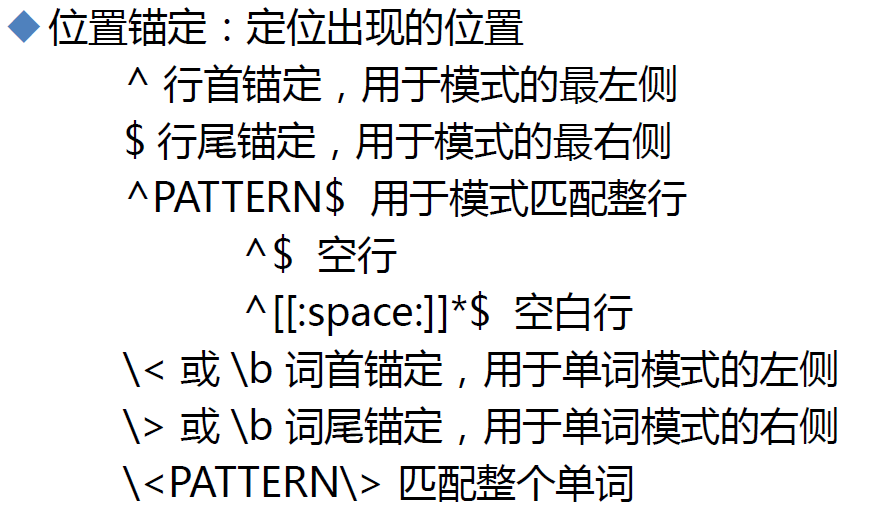 

```
[16:47:46 root@host1 ~]#grep -v "^#" /etc/fstab

/dev/mapper/centos_host1-root /                       xfs     defaults        0 0
UUID=e36eac36-1940-4883-8c19-a05f6b4bb4a6 /boot                   xfs     defaults        0 0
/dev/mapper/centos_host1-swap swap                    swap    defaults        0 0
[16:47:55 root@host1 ~]#
[16:47:56 root@host1 ~]#
[16:47:56 root@host1 ~]#grep ^[^#] /etc/fstab
/dev/mapper/centos_host1-root /                       xfs     defaults        0 0
UUID=e36eac36-1940-4883-8c19-a05f6b4bb4a6 /boot                   xfs     defaults        0 0
/dev/mapper/centos_host1-swap swap                    swap    defaults        0 0
[16:48:07 root@host1 ~]#

```

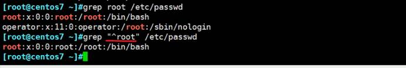

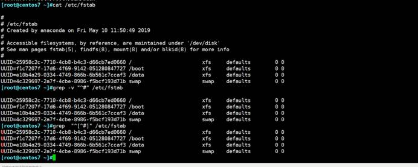

上图注意下，grep -v "^#" 和 grep "^\[^#\]"的区别，明显第二种也过滤空行。因为\[^#]里面至少的又一个字符的。

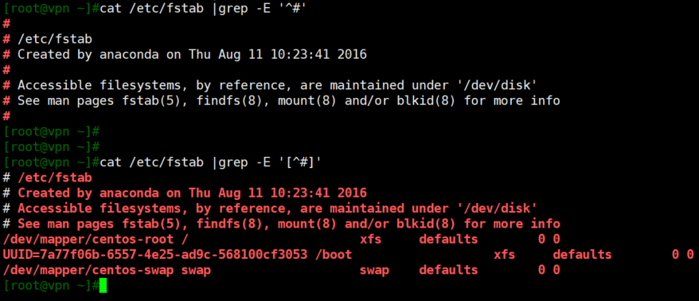

这种\[^#\]写法是有问题的，不推荐这么写。


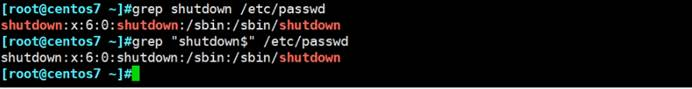

搜索shutdown行尾👆

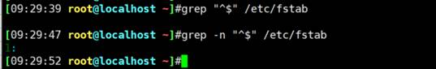

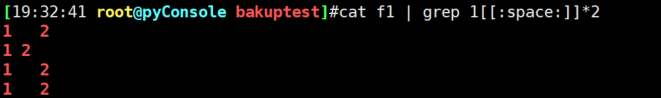

[[:space:]]他不仅仅抓空格，还抓TAB。当然上图其实都是空格，因为做了4空格等1tab的设置，取消后再验证下

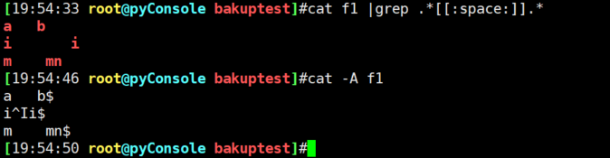

还是[[:space:]]能够抓到空格和TAB的。没问题。注意一个细节，cat -A 是能够区分TAB和空格的，但是如果你优化了tab=4空格，那么就自然都是空格了。-A看到的都是空格了就。

搜索空行👆

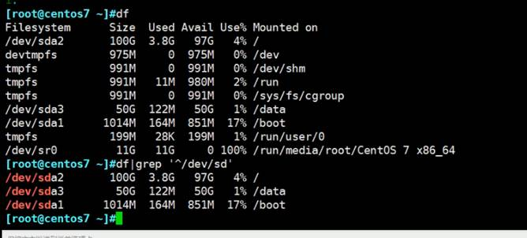

 


## 单词：在系统中，数字字母下划线都算单词的范畴。此外都不算单词。

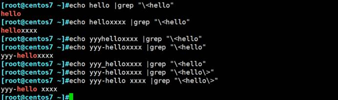

## 空行是^$,空白行^[[:space:]]*$

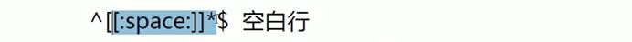

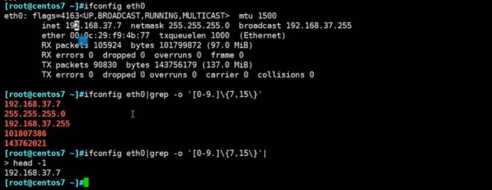

 

 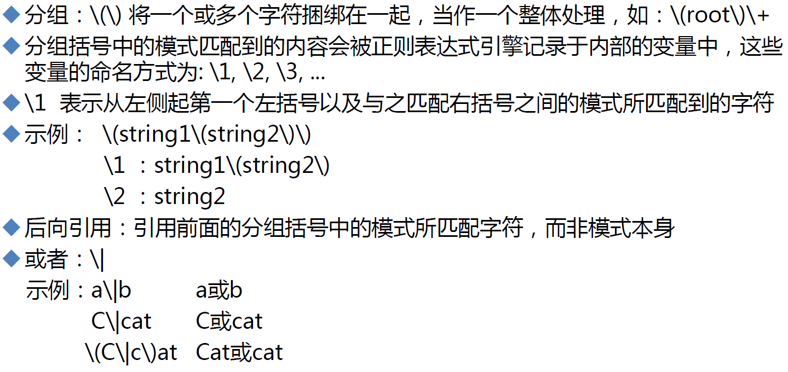

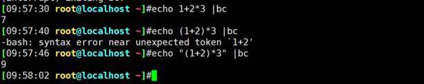

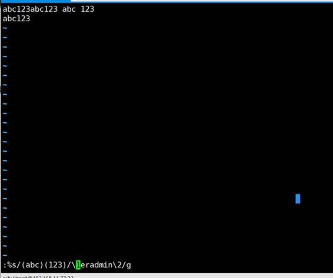

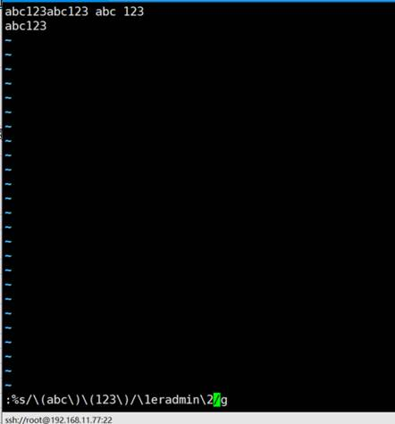

注意，写的思路：

:%s///g

:%s/(abc)(123)/1eradmin2/g

:%s/\(abc\)\(123\)/\1eradmin\2/g

 

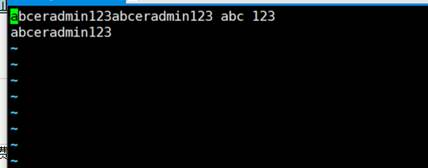

## 👆这个叫后向引用，在后面的sed搜索替代有关

nginx里也有后向引用的

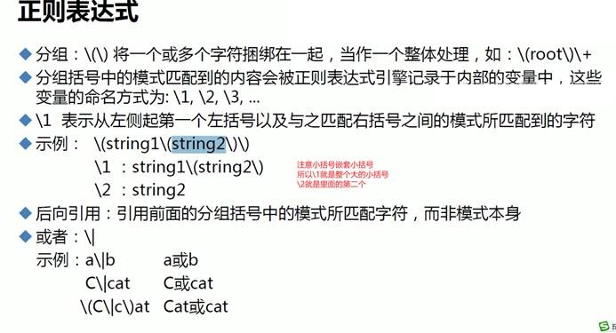

 

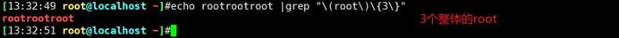

```
[17:30:32 root@host1 ~]#echo rootrootxxroot |grep -E "(root){2}"
rootrootxxroot
👆抓两连续的root
```


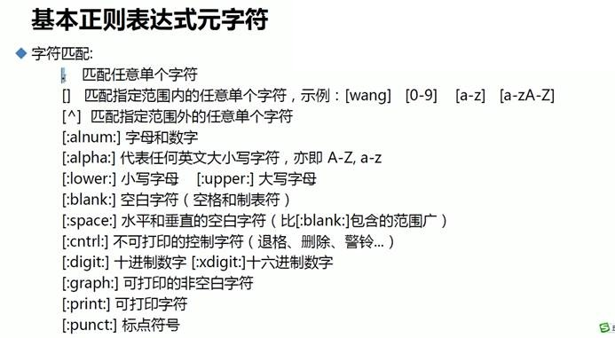

 

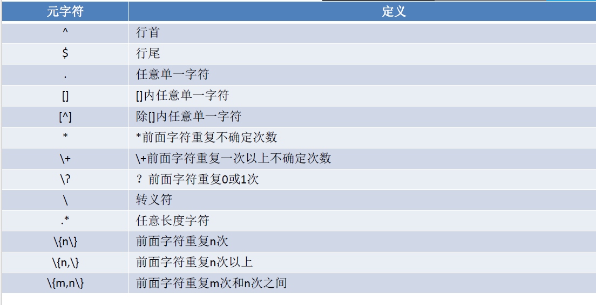

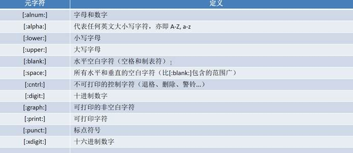


## 练习

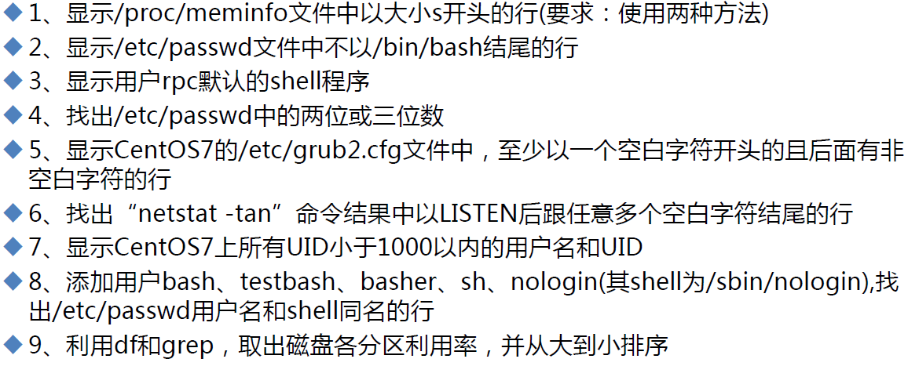

```
4题
cat /etc/passwd |grep -E "[0-9]{2,3}" -o | grep -Ev ^0   👈这是错误的，因为4位数也会搜出来的比如65534这个数字也会当作655和34两个匹配结果的，需要词尾锚定
cat /etc/passwd |grep -E "/<[0-9]{2,3}/>" -o | grep -Ev ^0
```

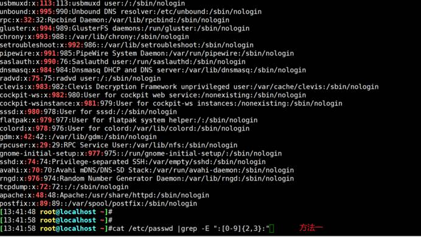

注意该方法由于是:xx:所以对于后面的数字是不匹配的。

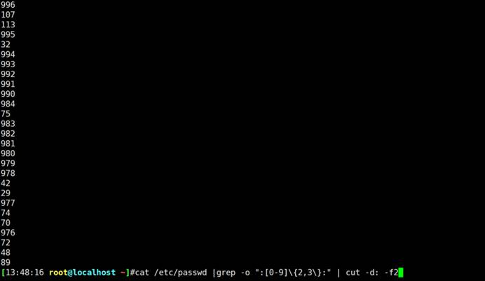

 

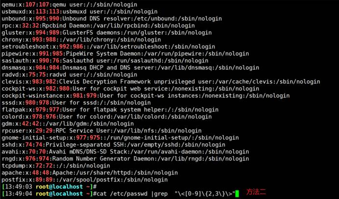

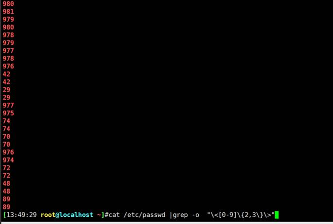

方法一肯定只能是抓出第一个段数字，

方法二可以匹配所有数字

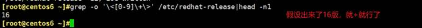

 

\---

 

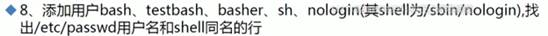

 

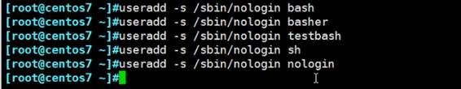

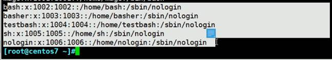

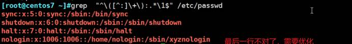

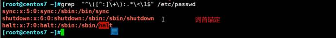

 词尾铆钉的必要性👇

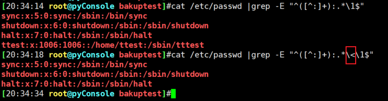


 

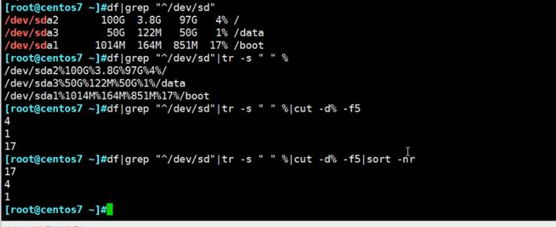

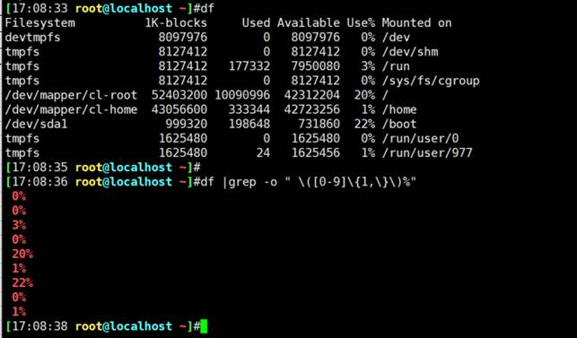

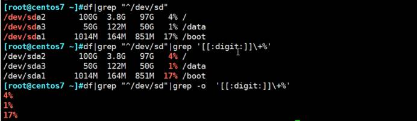

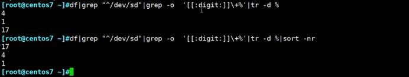

##  扩展正则

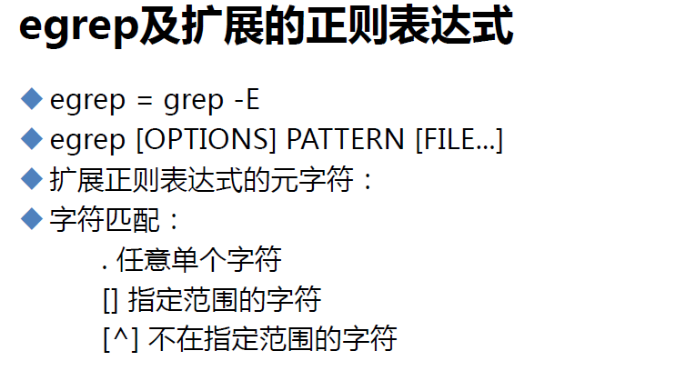 


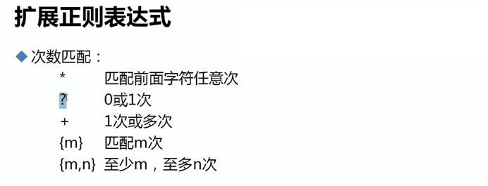

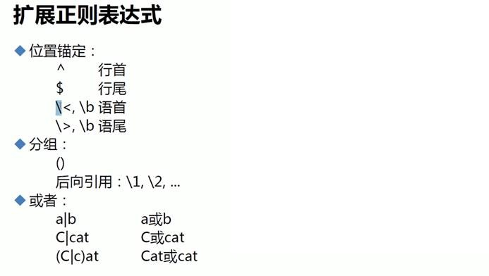

grep -E还是有一些还是需要加\的。

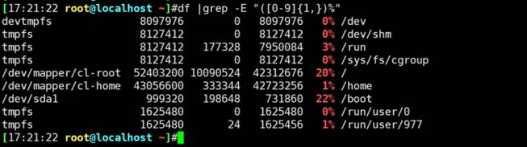

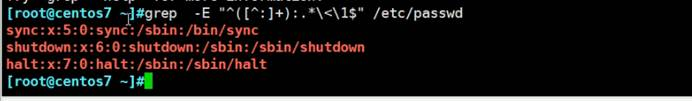

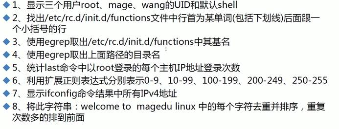

##  nginx的后向引用举例

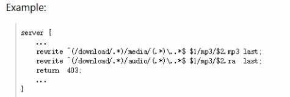 

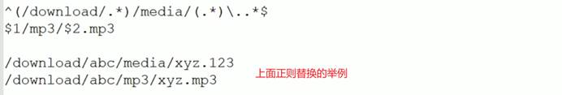

这是nginx里的rewrite替换的正则写法

 

 

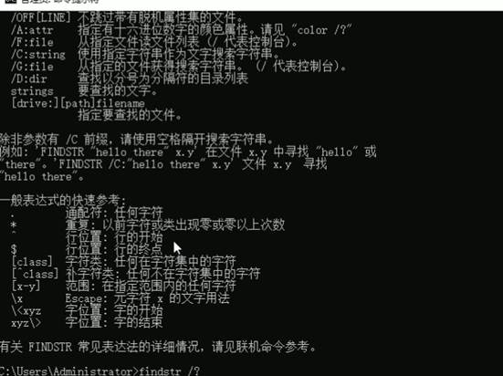

windows里也有正则
