# 第2节. shell编程特殊位置变量

## 举个例子

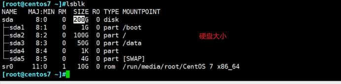

 

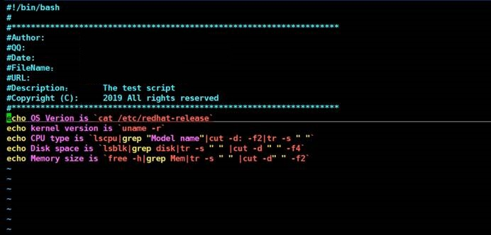

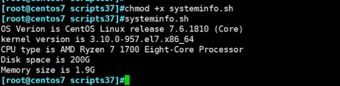

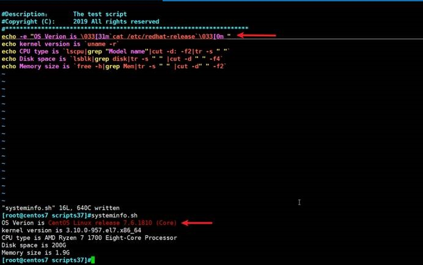

之前接触过%s/xx/yy/g，现在又看到了.,$s/XX/yy/g

.点表示当前行号,逗号是一直到整个文件最后一行

u撤销后，改成

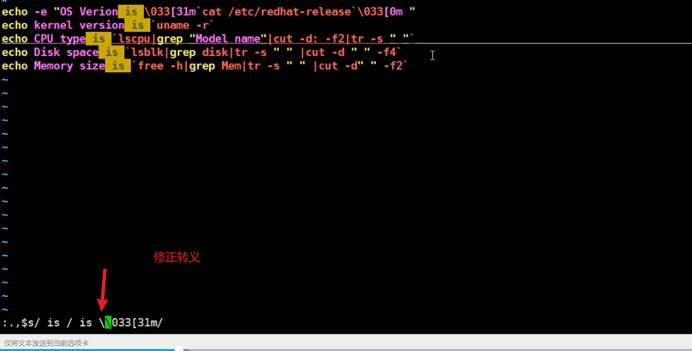

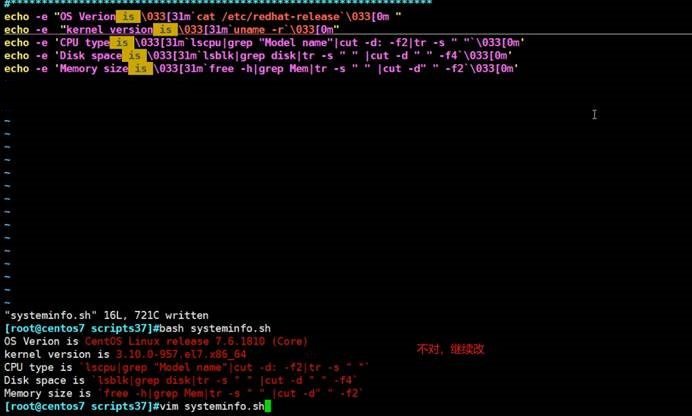

引号替换一下

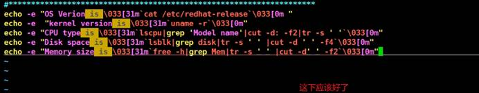

## 变量

变量代表着内存空间 

 

内存中的一个地址块放了magedu，而name就表示地址值。于是就是name中存放了magedu。

变量，值可变化，当然也有不可变

 

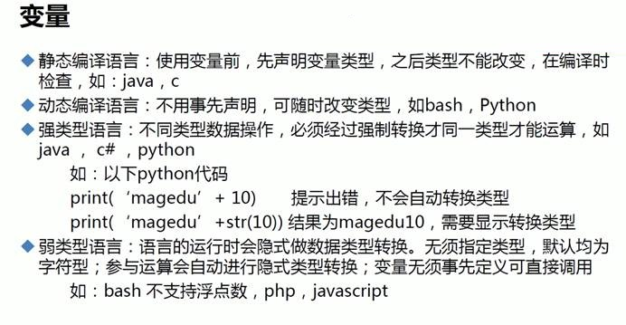

python和shell都不需要事先申明变量

##  变量起名规范

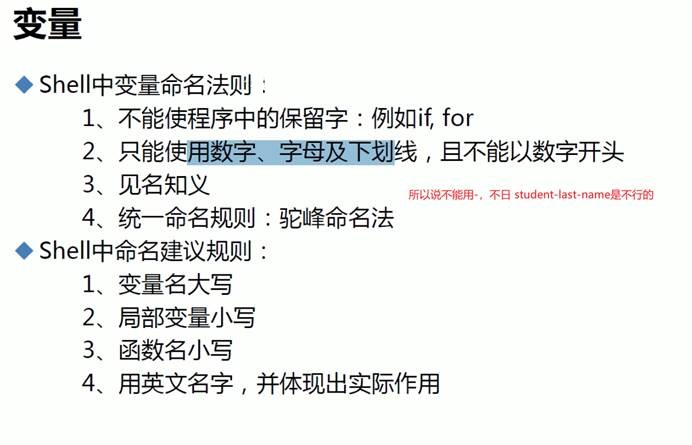

##  特殊变量

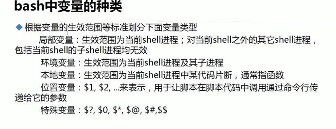

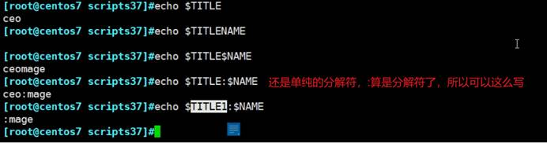

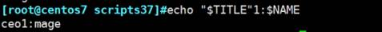

##  👆变量的正儿八经的写法，很重要 

 

### 如果此时Y的值变成了30，问X的值是多少，这个在PYTHON里面叫变量赋值，如果是列表、字典是需要.copy()的

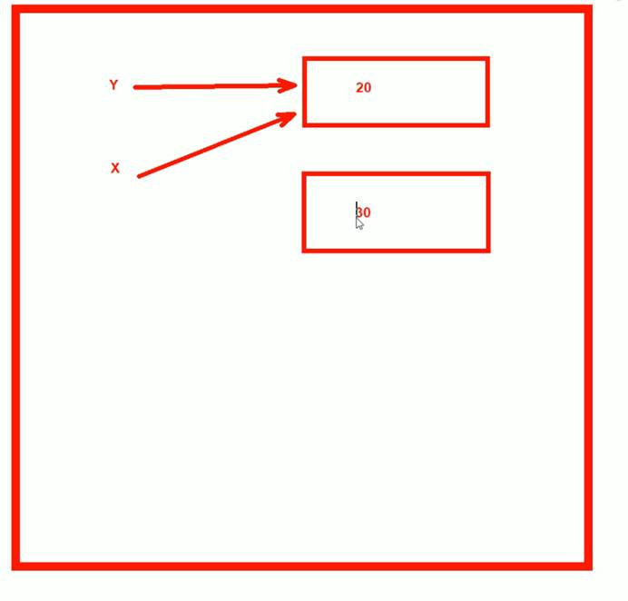

##  变量取消

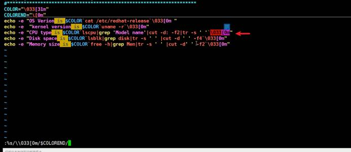

上图替换语法存在错误

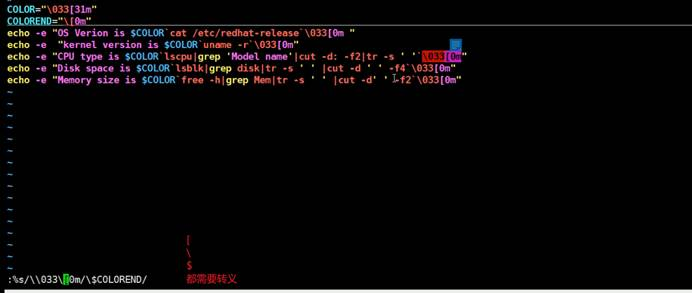

### 不用加g，%s/xx/yy/g，的g如果是每行只有一个不需要加g全局

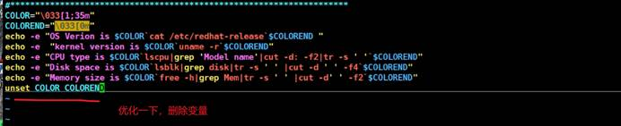

一般脚本结束了变量也就没了。不过还是建议删掉。

 

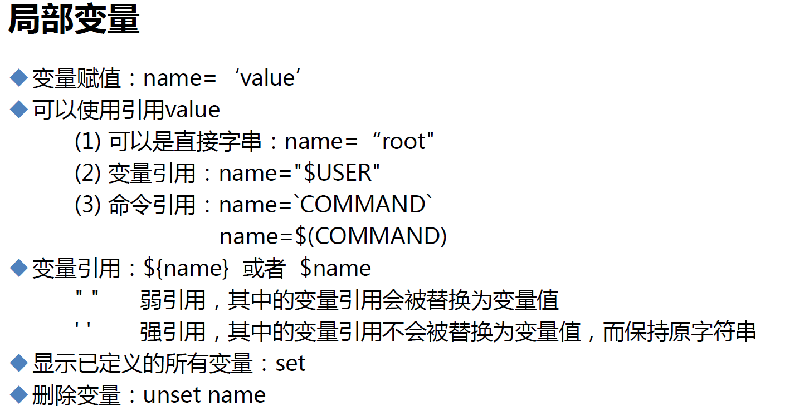 

## 把命令放到变量里

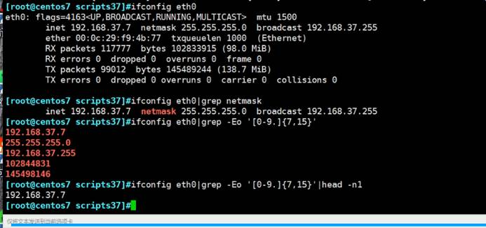

第一题答案就有了

 

 cp -a  的a等价于-dR

### 文件夹不存在cp会直接创建的

第二题答案

 

 

 

 nl 和 cat -b一个意思，不过不能列出空行行号

 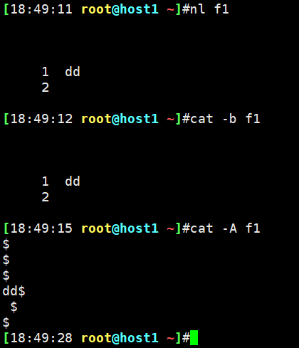 

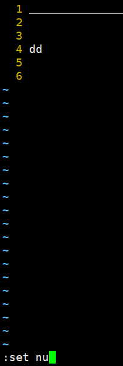 

